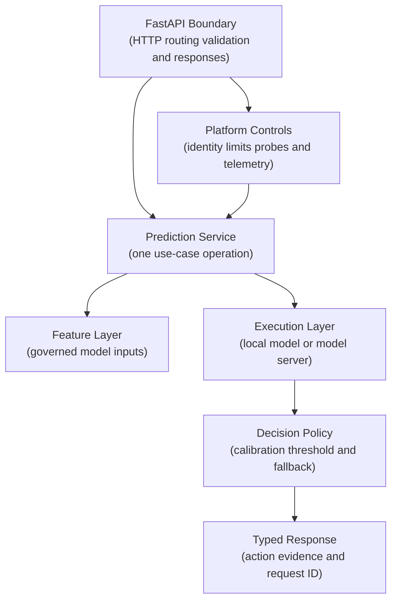
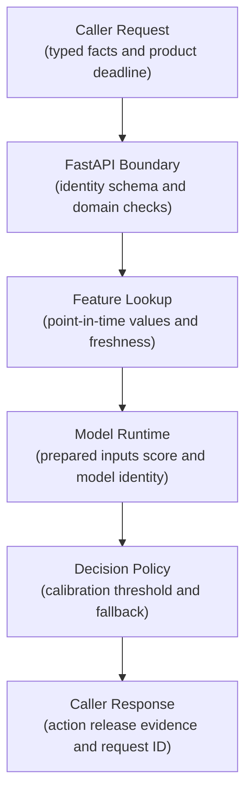
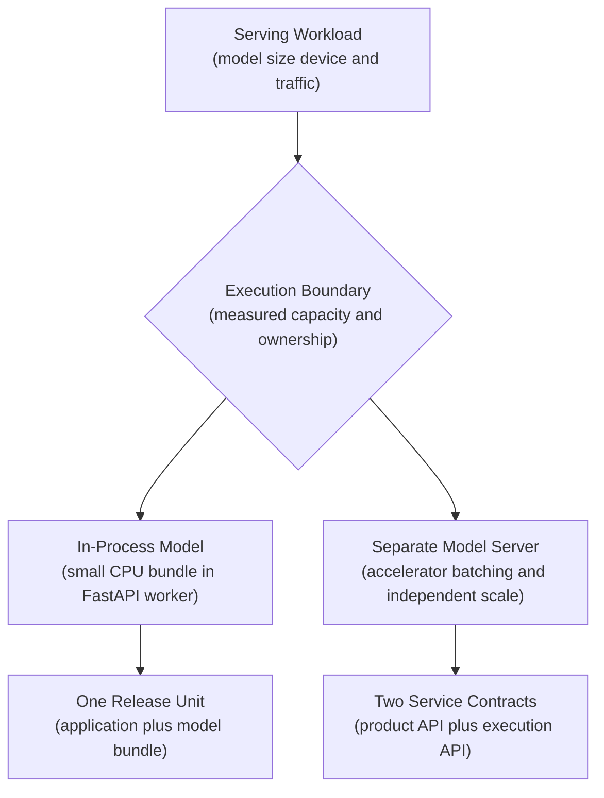
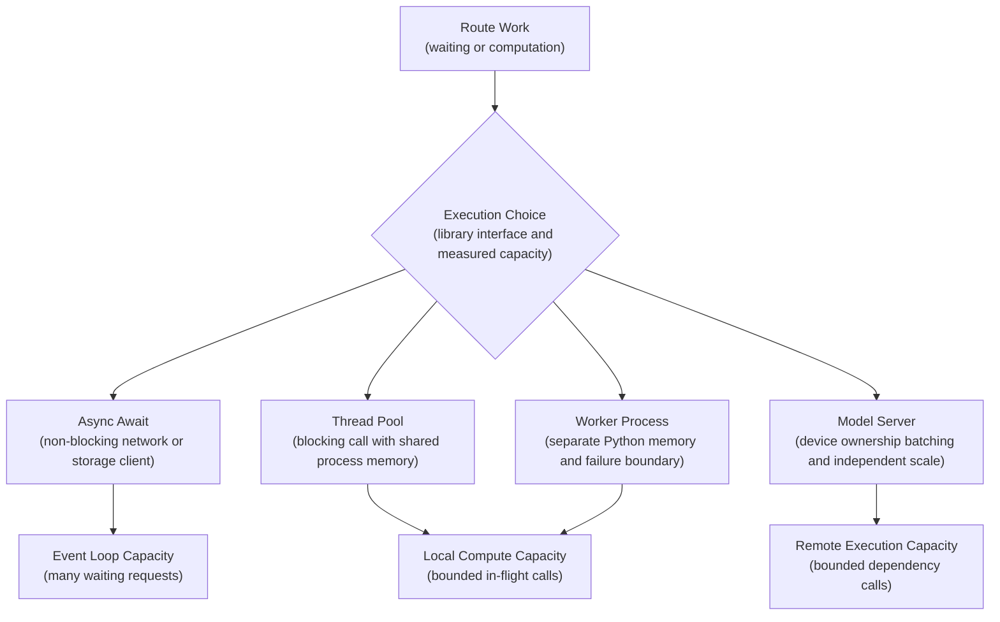
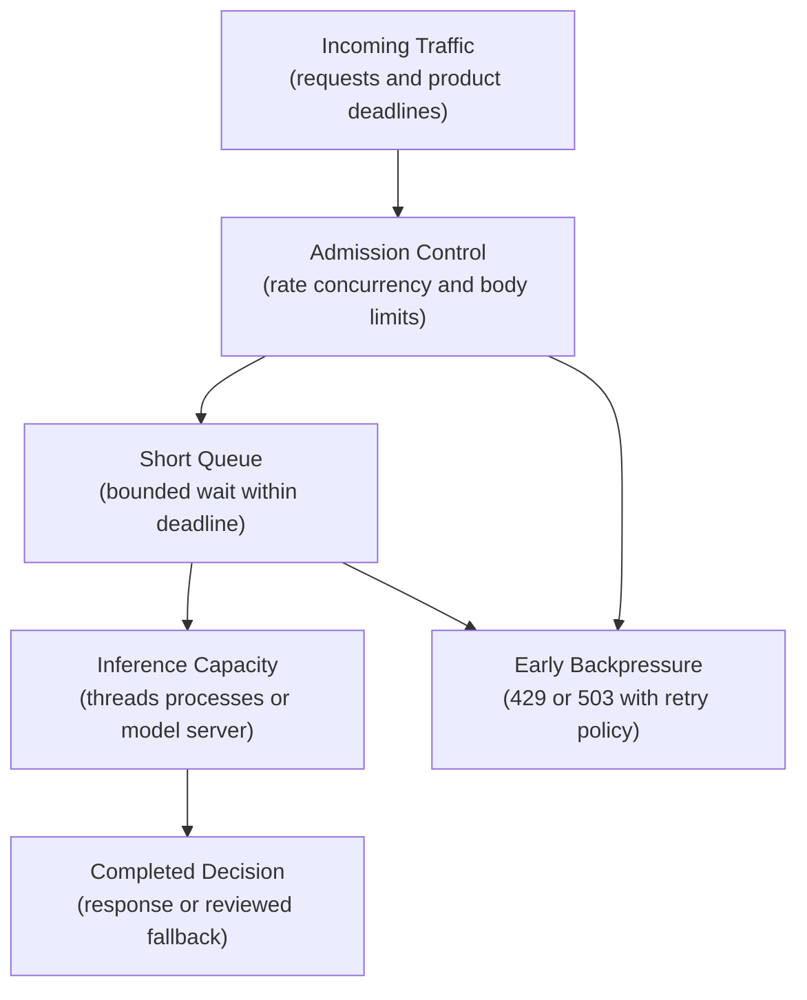
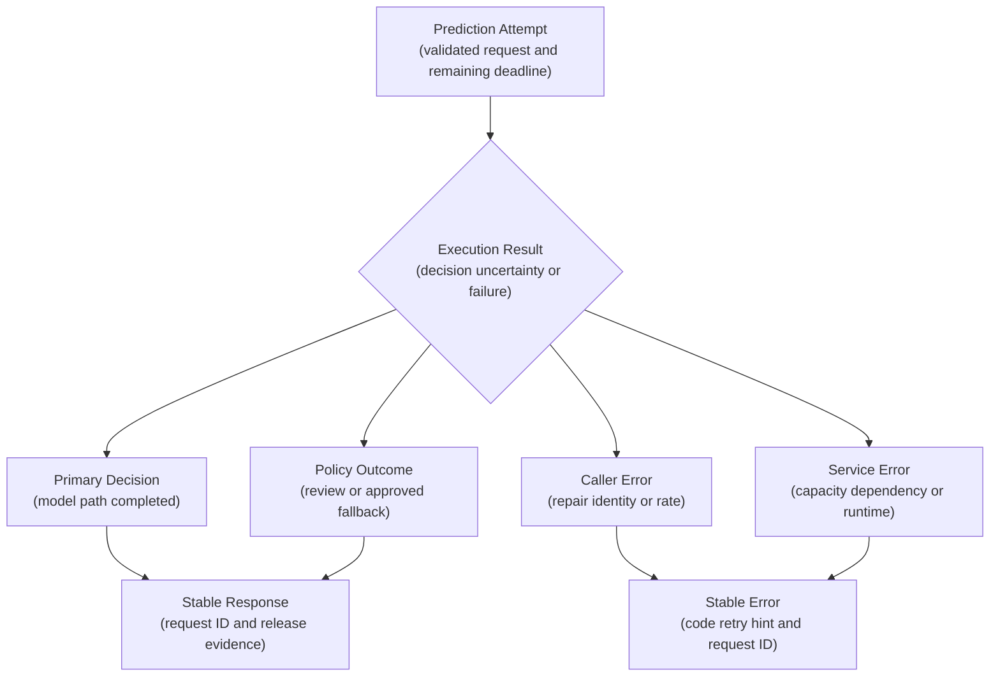
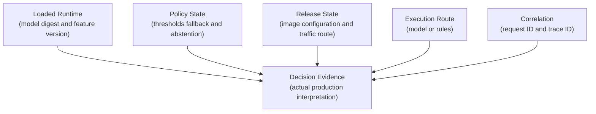
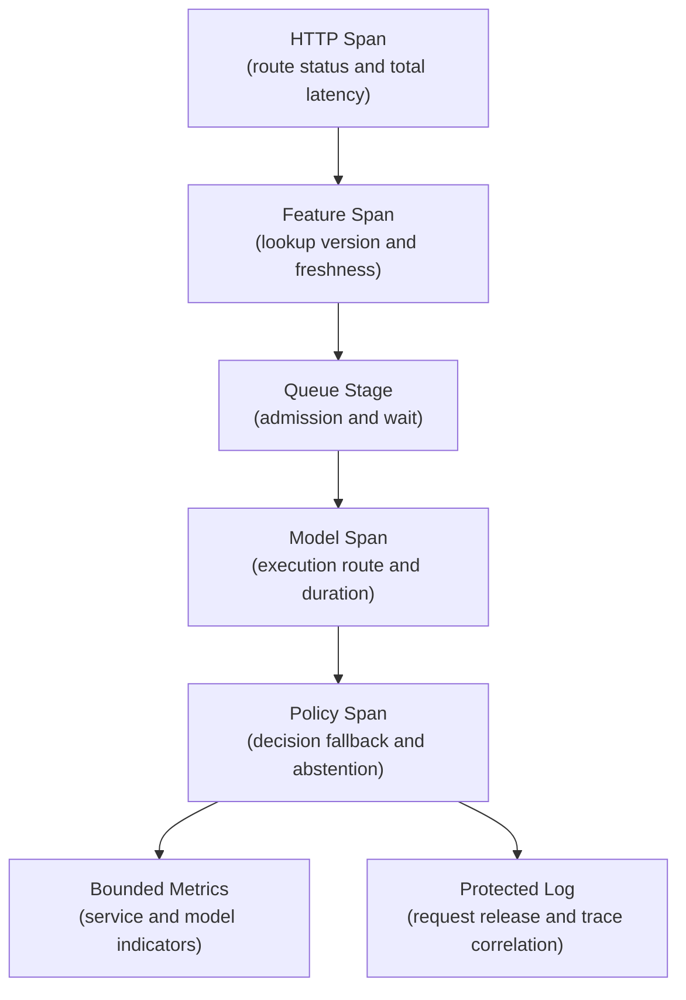
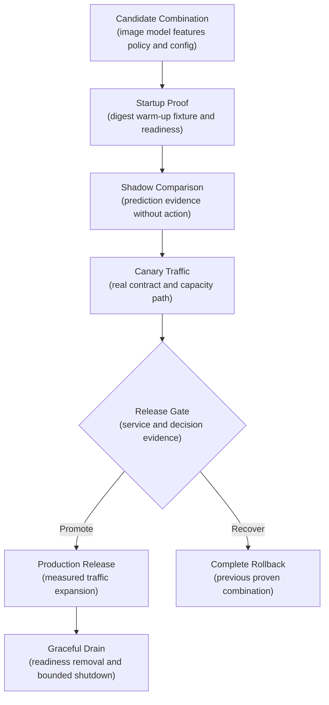

## Table of Contents

1. [What FastAPI Does In A Model Service](#what-fastapi-does-in-a-model-service)
2. [Follow One Prediction Through The System](#follow-one-prediction-through-the-system)
3. [Choose Where The Model Runs](#choose-where-the-model-runs)
4. [Choose Async, Threads, Or Processes For The Workload](#choose-async-threads-or-processes-for-the-workload)
5. [Use Separate Startup, Readiness, And Liveness Checks](#use-separate-startup-readiness-and-liveness-checks)
6. [Trace And Measure The Whole Prediction Path](#trace-and-measure-the-whole-prediction-path)
7. [Choose The Container And Worker Layout](#choose-the-container-and-worker-layout)
8. [The Main Idea](#the-main-idea)
9. [References](#references)

## What FastAPI Does In A Model Service
<!-- section-summary: FastAPI turns HTTP requests into typed Python calls and typed responses, while the serving design still owns model execution, policy, capacity, and release safety. -->

A model that works through a Python function still needs an HTTP boundary. Product services use that boundary to send requests and receive stable responses. **FastAPI** is a Python framework for building the boundary and validating its inputs. It runs on the ASGI interface, uses Python type annotations and Pydantic models, and generates an OpenAPI description of the routes it exposes. In an MLOps system, it usually sits around a prediction capability rather than replacing the serving runtime itself.

That boundary has a clear job. It accepts an authenticated request, validates the public contract, calls the prediction service, maps the result into a response, and records operational evidence. This is the part that turns a Python model into something another service can call over a network.

FastAPI leaves several important decisions to the serving team. Model governance selects the approved artifact. Feature contracts define the data. Capacity controls limit concurrent work, policy turns scores into actions, and release automation controls traffic. Those responsibilities belong to explicit components around the framework.

You can think of FastAPI as the front desk of the serving system. It checks who arrived and what they asked for, then sends the work to the correct internal capability. The model runtime is the specialist doing the prediction. Feature services provide evidence. Policy code turns model output into a product action. Kubernetes or another runtime controls replicas, health, and traffic.


```mermaid
flowchart TD
    A["FastAPI Boundary<br/>(HTTP routing validation and responses)"] --> B["Prediction Service<br/>(one use-case operation)"]
    B --> C["Feature Layer<br/>(governed model inputs)"]
    B --> D["Execution Layer<br/>(local model or model server)"]
    D --> E["Decision Policy<br/>(calibration threshold and fallback)"]
    E --> F["Typed Response<br/>(action evidence and request ID)"]
    A --> G["Platform Controls<br/>(identity limits probes and telemetry)"]
    G --> B

    class A input
    class B,C,D,E,G process
    class F result
```

This ownership map keeps route functions small. A schema failure stays at the API boundary. Stale online features stay with feature readiness. An accelerator queue problem stays with model execution. A threshold mistake stays with decision policy. Every incident starts with a narrower set of evidence.

## Follow One Prediction Through The System
<!-- section-summary: A production request crosses identity, validation, feature, execution, policy, response, and telemetry stages under one deadline. -->

Consider a small transaction-risk endpoint: `POST /v1/risk-decisions`. The caller sends a transaction ID, account reference, amount in minor currency units, currency, and event timestamp. The API returns `approve`, `review`, or `decline` together with an opaque release ID and request ID.

The request first passes through a gateway that handles TLS, caller authentication, body limits, and rate limits. FastAPI receives the trusted caller context and parses the body into a Pydantic request model. Domain validation checks unit and timestamp relationships.

The prediction service then retrieves approved features as of the event time. It checks freshness before calling the loaded model. The raw model score goes through calibration and the active policy. A high-uncertainty result may route to review; a feature outage may select an evaluated fallback.

FastAPI serializes the resulting decision through a Pydantic response model. OpenTelemetry connects the request span to feature and execution spans. Metrics record queue wait, model time, route, outcome class, and error category using bounded labels. A protected decision record keeps the actual model, feature, policy, and release identities.


*FastAPI owns the typed HTTP boundary while the prediction service, model, and policy remain explicit stages whose latency and release identities can be traced together.*


```mermaid
flowchart TD
    A["Caller Request<br/>(typed facts and product deadline)"] --> B["FastAPI Boundary<br/>(identity schema and domain checks)"]
    B --> C["Feature Lookup<br/>(point-in-time values and freshness)"]
    C --> D["Model Runtime<br/>(prepared inputs score and model identity)"]
    D --> E["Decision Policy<br/>(calibration threshold and fallback)"]
    E --> F["Caller Response<br/>(action release evidence and request ID)"]

    class A input
    class B,C,D,E process
    class F result
```

The complete path shares one product deadline. Spending most of that budget in a feature lookup leaves little time for inference or fallback. The service therefore assigns smaller budgets to internal stages and rejects work that has too little time remaining.

## Choose Where The Model Runs
<!-- section-summary: Small CPU models can run inside the FastAPI process, while large or accelerator-heavy workloads benefit from a separate execution service. -->

The first architecture choice is where `predict` runs. A small scikit-learn, XGBoost, or ONNX model can live inside the FastAPI process. Startup loads one bundle, requests call it directly, and the application image plus model artifact are tested as one combination.

This in-process design removes a network hop and keeps failure handling compact. It fits a model whose memory, startup time, concurrency, and native-library behavior are well understood. A modest CPU classifier with predictable preprocessing often works well here.

The model size changes the tradeoff. Every application worker generally loads its own copy. Four workers around a multi-gigabyte model can exhaust pod memory before traffic arrives. GPU models add device-memory ownership, dynamic batching, and accelerator scheduling. Generic web-worker settings provide weak controls for those concerns.

A separate model server gives the HTTP application and execution runtime different scaling rules. FastAPI keeps the product contract, authentication, feature coordination, and response policy. KServe, NVIDIA Triton, Ray Serve, BentoML, or a managed endpoint can own model replicas and accelerator-aware execution. The extra network call creates a dependency with its own timeout and telemetry.

Choose from measurements: artifact memory per process, warm-up time, safe concurrency, batching opportunity, failure isolation, and team ownership. An in-process model remains a sound production choice if it meets the service objective. A separate runtime earns its complexity by solving a measured execution problem.


```mermaid
flowchart TD
    A["Serving Workload<br/>(model size device and traffic)"] --> B{"Execution Boundary<br/>(measured capacity and ownership)"}
    B --> C["In-Process Model<br/>(small CPU bundle in FastAPI worker)"]
    B --> D["Separate Model Server<br/>(accelerator batching and independent scale)"]
    C --> E["One Release Unit<br/>(application plus model bundle)"]
    D --> F["Two Service Contracts<br/>(product API plus execution API)"]

    class A input
    class B gate
    class C,D,E,F process
```

### Load And Verify The Model At Application Startup
<!-- section-summary: FastAPI lifespan loads one verified model bundle per process, warms it, runs a fixture, and exposes readiness only after successful initialization. -->

Model loading belongs to the application lifecycle. Loading from object storage for every request adds seconds of latency, duplicates memory, and introduces a remote dependency into every prediction. Concurrent first requests can also race to initialize several copies.

FastAPI's **lifespan** is an async context manager that runs setup before the application accepts requests and cleanup during shutdown. It is the appropriate place to load a model, open a client pool, and release resources. The hook runs once for each application process, which matters for multi-worker memory planning.

Startup should resolve an immutable artifact reference and verify its digest or signature. It loads the preprocessing assets, model, calibration data, and policy compatibility metadata as one bundle. A warm-up call initializes lazy kernels or native runtimes. A reviewed fixture then checks the packaged path and expected output shape.

```python
from contextlib import asynccontextmanager
from dataclasses import dataclass

from fastapi import FastAPI


@dataclass(frozen=True)
class LoadedRuntime:
    predictor: "Predictor"
    model_version: str
    model_digest: str
    feature_version: str
    policy_version: str


@asynccontextmanager
async def lifespan(app: FastAPI):
    runtime = load_verified_runtime(settings.model_uri, settings.model_digest)
    runtime.predictor.warm_up()
    verify_startup_fixture(runtime)

    app.state.runtime = runtime
    app.state.prediction_service = build_prediction_service(runtime)
    app.state.accepting_traffic = True
    try:
        yield
    finally:
        app.state.accepting_traffic = False
        close_prediction_service(app.state.prediction_service)
        close_runtime(runtime)


app = FastAPI(lifespan=lifespan)
```

A failed digest check, incompatible preprocessor, or failed fixture should fail startup. The deployment keeps the candidate out of readiness, so traffic stays on healthy replicas. Silent substitution with an older model would erase release evidence and can violate the decision contract.

This design also separates desired identity from loaded identity. A registry alias may point to a newer model during a partial rollout. The runtime stores and reports the immutable identity that the process actually loaded.

### Define Typed Request And Response Models
<!-- section-summary: Pydantic request and response models make the public decision contract executable and keep internal model data away from callers. -->

FastAPI uses Pydantic models to turn JSON documents into typed Python values. Invalid requests fail before the route body runs. FastAPI also adds the generated JSON Schemas to OpenAPI, giving clients a machine-readable description of the boundary.

The schema should describe product facts and product outcomes. A caller sends a transaction amount in named units and an event timestamp. It should never need to know the model's tensor order or encoded category IDs. Every response returns a controlled decision. A model result carries its calibrated probability and model provenance, while a rules result carries the identity and reason for that fallback route.

```python
from typing import Annotated, Literal
from uuid import UUID

from pydantic import AwareDatetime, BaseModel, ConfigDict, Field


class RiskRequest(BaseModel):
    model_config = ConfigDict(extra="forbid")

    transaction_id: str = Field(min_length=8, max_length=80)
    account_ref: str = Field(min_length=8, max_length=120)
    amount_minor: Annotated[int, Field(strict=True, ge=0)]
    currency: Literal["GBP", "EUR", "USD"]
    event_time: AwareDatetime


class ModelDecisionEvidence(BaseModel):
    decision_source: Literal["model"]
    release_id: str
    model_version: str
    feature_version: str
    policy_version: str
    fraud_probability: Annotated[float, Field(ge=0.0, le=1.0)]


class RulesFallbackEvidence(BaseModel):
    decision_source: Literal["rules"]
    release_id: str
    policy_version: str
    fallback_id: str
    fallback_reason: str


class RiskResponse(BaseModel):
    request_id: UUID
    decision: Literal["approve", "review", "decline"]
    evidence: Annotated[
        ModelDecisionEvidence | RulesFallbackEvidence,
        Field(discriminator="decision_source"),
    ]
```

The model result places `fraud_probability` beside the model identity that produced it. Its description in OpenAPI should state the positive class, label window, and calibration meaning. A rules fallback uses a separate evidence shape with a governed fallback identity and reason. It carries no model probability or model version, so the caller can distinguish a model result from a rules decision by construction.

The API creates `request_id` at the network boundary and returns it for correlation. It is absent from the caller body. A route that performs a business side effect would accept a separately named idempotency key and store it under a durable replay policy. This prediction route only returns a decision, so request correlation is the relevant identity here.

The `response_model` parameter makes FastAPI validate and filter returned fields through the response schema. This protects the boundary from an internal object that contains raw features, debug state, or sensitive model details. Domain and authorization rules still run inside the service layer because types alone lack that context.

### Use Dependency Injection For Testing And Replacement
<!-- section-summary: FastAPI dependencies provide authenticated callers and runtime collaborators, allowing tests to replace external systems without changing route logic. -->

**Dependency injection** means a function receives the collaborator it needs from a provider. The route asks for an authenticated caller and a prediction service. Identity clients, feature-store clients, and model runtimes are constructed at stable lifecycle boundaries and supplied through those providers.

This pattern keeps protocol code separate from prediction logic. The route handles HTTP input and output. The prediction service owns feature retrieval, preprocessing, model execution, and policy. A narrow Python protocol states the capability the route needs, which also gives tests a small fake to implement.

```python
from typing import Annotated, Protocol

from fastapi import Depends, Request


class PredictionService(Protocol):
    def decide(
        self,
        payload: RiskRequest,
        caller: "Caller",
        request_id: UUID,
    ) -> RiskResponse: ...


def get_prediction_service(request: Request) -> PredictionService:
    return request.app.state.prediction_service


@app.post("/v1/risk-decisions", response_model=RiskResponse)
def predict(
    payload: RiskRequest,
    request: Request,
    caller: Annotated["Caller", Depends(authenticated_caller)],
    service: Annotated[PredictionService, Depends(get_prediction_service)],
) -> RiskResponse:
    return service.decide(payload, caller, request.state.request_id)
```

FastAPI's `app.dependency_overrides` can replace `get_prediction_service` or `authenticated_caller` during a contract test. The test can return a fixed domain decision without downloading a model or contacting an identity provider. Separate integration tests still exercise the real packaged bundle and authentication path.

Dependency injection should stay at stable boundaries. Turning every helper into a framework dependency creates a web of providers that hides ordinary Python control flow. Use it for request-scoped identity, settings, clients, and replaceable service interfaces. Keep deterministic transformations as direct function calls inside the prediction service.

## Choose Async, Threads, Or Processes For The Workload
<!-- section-summary: Async handles waiting, threads protect the event loop from blocking calls, and processes or model servers provide separate execution capacity. -->

The word **async** describes cooperative waiting. An `async def` route can pause during an async database or HTTP call so the event loop serves other connections. CPU and GPU inference performs computation, so adding `async` around a blocking `predict` call provides no extra compute capacity.

FastAPI handles a regular `def` route in an external thread pool and awaits its completion. The route in the preceding example uses `def` because the small local predictor exposes a blocking interface. This protects the event loop from direct blocking work, provided the predictor supports the tested level of concurrent calls.

An `async def` route is appropriate for a path built from awaitable clients. If that route also calls a blocking model library directly, the event loop stalls. The service must move the blocking call to a controlled thread, process, or separate model server. A thread keeps the event loop responsive, while the model's own thread safety and CPU use still determine safe concurrency.

Processes provide memory and failure isolation. Each Uvicorn worker is a separate process and usually loads another model copy through lifespan. CPU libraries may also start native threads for BLAS or OpenMP. Multiplying web workers by native math threads can oversubscribe the available cores and increase tail latency.

GPU execution usually benefits from a dedicated owner. One model server can hold the device memory, batch compatible requests, and schedule accelerator work from several FastAPI replicas. The FastAPI application then treats model execution as an async network dependency with a bounded timeout.


```mermaid
flowchart TD
    A["Route Work<br/>(waiting or computation)"] --> B{"Execution Choice<br/>(library interface and measured capacity)"}
    B --> C["Async Await<br/>(non-blocking network or storage client)"]
    B --> D["Thread Pool<br/>(blocking call with shared process memory)"]
    B --> E["Worker Process<br/>(separate Python memory and failure boundary)"]
    B --> F["Model Server<br/>(device ownership batching and independent scale)"]
    C --> G["Event Loop Capacity<br/>(many waiting requests)"]
    D --> H["Local Compute Capacity<br/>(bounded in-flight calls)"]
    E --> H
    F --> I["Remote Execution Capacity<br/>(bounded dependency calls)"]

    class A input
    class B gate
    class C,D,E,F,G,H,I process
```

### Bound Concurrency And Apply Backpressure
<!-- section-summary: A serving service limits admitted inference work, keeps queues short, and rejects overload early enough for the caller's fallback. -->

Every model has a saturation point. Beyond it, extra concurrency increases queueing while throughput stays flat. A CPU model may saturate its cores. A GPU model may reach its effective batch size and device memory. A feature dependency may allow only a fixed number of concurrent lookups.

Load tests identify the safe in-flight limit for each scarce resource. The application admits work up to that limit and keeps any waiting queue short. Global overload can return `503` with bounded retry guidance. A per-caller rate limit commonly returns `429`. These categories tell the caller whether the whole service is full or its own traffic exceeded policy.

Uvicorn provides `--limit-concurrency` as a server-level bound on concurrent connections or tasks. A prediction service still benefits from its own limiter around the expensive model call, because health checks and inexpensive routes need capacity during inference pressure. A separate model server applies another limit at its queue or replica boundary.

Timeouts share one end-to-end budget. The gateway deadline is larger than the application's internal deadline. Feature and model calls receive smaller budgets, leaving time to assemble a fallback response. A caller with only a few milliseconds remaining should avoid sending work that exceeds its product deadline.

Cancellation needs special care. Cancelling an HTTP coroutine may abandon the result while a native thread or GPU kernel continues running. The capacity token should remain occupied until the underlying work ends. Otherwise, timed-out requests continue consuming resources while new requests enter, which turns latency pressure into memory or device exhaustion.


```mermaid
flowchart TD
    A["Incoming Traffic<br/>(requests and product deadlines)"] --> B["Admission Control<br/>(rate concurrency and body limits)"]
    B --> C["Short Queue<br/>(bounded wait within deadline)"]
    C --> D["Inference Capacity<br/>(threads processes or model server)"]
    D --> E["Completed Decision<br/>(response or reviewed fallback)"]
    B --> F["Early Backpressure<br/>(429 or 503 with retry policy)"]
    C --> F

    class A input
    class B,C,D,E process
    class F reject
```

## Use Separate Startup, Readiness, And Liveness Checks
<!-- section-summary: Startup allows model initialization, readiness controls traffic, and liveness requests a restart only for an unrecoverable process condition. -->

Health probes are small APIs between the application and its runtime platform. Their names sound similar, yet each one triggers a different operational action.

A **startup probe** gives a slow-loading model enough time to initialize. Kubernetes waits for this probe to succeed before running liveness and readiness probes. If startup never succeeds within the configured threshold, Kubernetes restarts the container.

A **readiness probe** answers whether this replica should receive new prediction traffic. It stays false until the verified model, preprocessing bundle, and required local state are ready. It can turn false during drain or a critical dependency outage. Kubernetes then removes the pod from matching Service endpoints while leaving the process alive.

A **liveness probe** answers whether restarting the process is likely to help. Keep it cheap and focused on local process progress. A temporary feature-store outage should usually reduce readiness or trigger fallback; failing liveness across every replica can create a restart storm and remove the remaining capacity.

```python
from fastapi import HTTPException, Request


@app.get("/livez", include_in_schema=False)
async def livez() -> dict[str, str]:
    return {"status": "alive"}


@app.get("/readyz", include_in_schema=False)
async def readyz(request: Request) -> dict[str, str]:
    if request.app.state.accepting_traffic is False:
        raise HTTPException(status_code=503, detail="draining")
    if request.app.state.runtime.predictor.is_ready() is False:
        raise HTTPException(status_code=503, detail="model_unavailable")
    return {"status": "ready"}
```

The readiness endpoint should read a cheap local readiness state. Running a full prediction on every probe can consume serving capacity, and synchronously calling every dependency can spread one outage into fleet-wide unready status. Startup runs a reviewed prediction fixture once; background checks can update dependency readiness between probes.


*Startup, readiness, and liveness govern whether a replica may serve; concurrency and backpressure govern how much prediction work an already-ready replica may admit.*

### Define Errors And Fallbacks In The API Contract
<!-- section-summary: The API distinguishes caller repair, authentication, overload, dependency failure, model failure, abstention, and approved fallback routes. -->

A production endpoint needs stable outcomes for failure as well as success. The caller should know whether to repair its payload, refresh credentials, slow down, retry within a deadline, or continue with a product fallback.

FastAPI and Pydantic produce request-validation failures before the route executes. The application maps them into the service's documented error envelope, preserving bounded field paths and a request ID. Authentication failures use `401`, authorization failures use `403`, per-caller rate limits use `429`, and global capacity or dependency failures commonly use `503`.

Model uncertainty belongs to decision policy. A valid request with weak evidence may return `review` as a successful product outcome. An evaluated rules path may also return success with `decision_source` set to `rules`. This lets callers act safely and lets operators measure degraded traffic.

Unhandled Python exceptions, stack traces, model paths, and raw dependency messages stay out of responses. Exception handlers map known failures to stable codes such as `FEATURES_STALE`, `MODEL_BUSY`, or `MODEL_UNAVAILABLE`. Logs and traces keep protected diagnostic context under access and retention policy.


```mermaid
flowchart TD
    A["Prediction Attempt<br/>(validated request and remaining deadline)"] --> B{"Execution Result<br/>(decision uncertainty or failure)"}
    B --> C["Primary Decision<br/>(model path completed)"]
    B --> D["Policy Outcome<br/>(review or approved fallback)"]
    B --> E["Caller Error<br/>(repair identity or rate)"]
    B --> F["Service Error<br/>(capacity dependency or runtime)"]
    C --> G["Stable Response<br/>(request ID and release evidence)"]
    D --> G
    E --> H["Stable Error<br/>(code retry hint and request ID)"]
    F --> H

    class A input
    class B gate
    class C,D,G process
    class E,F,H fail
```

Retries require an explicit policy. A transient model-server timeout may allow one retry if enough product deadline remains and another healthy replica has capacity. Schema errors and authorization failures need repair. Repeating expensive inference against the same saturated pool increases overload.

### Return The Model Version And Decision Evidence
<!-- section-summary: Responses and decision records identify the model, features, policy, release, and execution route that actually produced the action. -->

The service should report the runtime identity that actually produced the result. A candidate pod may load an older cached artifact after a registry alias changes. A rollout may update policy before every model replica moves. Desired state alone provides incomplete evidence for the resulting decision.

The `LoadedRuntime` object captures immutable model and feature identities during startup. A model result combines those identities with the active policy and calibrated probability. A rules fallback names its fallback record, reason, policy, and release. It leaves model-only fields absent. The public response can expose this complete evidence for trusted internal callers, or expose an opaque release ID while the protected decision record stores the detailed mapping.

This evidence separates common incidents. A score distribution shift tied to one model version points toward the artifact or feature compatibility. A change in final decisions with stable scores may come from policy. Higher fallback rate with unchanged model quality points toward a dependency or capacity problem.

Request ID and trace ID have different jobs. The request ID locates the prediction record and response. The trace ID links spans across services. Model and release identities remain explicit attributes because tracing may be sampled and retained for a shorter period than governed decision evidence.


```mermaid
flowchart TD
    A["Loaded Runtime<br/>(model digest and feature version)"] --> F["Decision Evidence<br/>(actual production interpretation)"]
    B["Policy State<br/>(thresholds fallback and abstention)"] --> F
    C["Release State<br/>(image configuration and traffic route)"] --> F
    D["Execution Route<br/>(model or rules)"] --> F
    E["Correlation<br/>(request ID and trace ID)"] --> F

    class A,B,C,D,E input
    class F result
```

## Trace And Measure The Whole Prediction Path
<!-- section-summary: OpenTelemetry and Prometheus connect HTTP health to queue, feature, model, policy, and fallback evidence using bounded attributes. -->

HTTP latency tells an operator that the endpoint is slow. Prediction-path instrumentation explains where the time went. A trace should show authentication, request validation, feature lookup, queue wait, preprocessing, model execution, policy, and response serialization as related spans or timed stages.

OpenTelemetry's FastAPI instrumentation creates server spans and standard HTTP metrics around application routes. Client instrumentation can continue the trace into an HTTP feature service or model server. Focused manual spans around `feature.lookup`, `model.predict`, and `policy.apply` reveal the ML-specific stages.

```python
from opentelemetry.instrumentation.fastapi import FastAPIInstrumentor
from prometheus_client import make_asgi_app


FastAPIInstrumentor.instrument_app(
    app,
    excluded_urls="livez,readyz,metrics",
)

app.mount("/metrics", make_asgi_app())
```

This example exposes Prometheus client metrics through an ASGI sub-application and adds OpenTelemetry request tracing. A team may export OpenTelemetry metrics to its monitoring backend or define Prometheus client metrics directly. Pick one owner for each HTTP counter and latency histogram so dashboards avoid duplicate series.

Core model-serving metrics cover admitted and rejected work. Separate histograms measure queue wait, feature latency, and inference latency. Bounded counters describe timeouts, fallback outcomes, and response decisions. Model version can be a bounded label if only a small number serve concurrently. Request ID, transaction ID, raw prediction values, and unrestricted error text belong outside metric labels.

OpenTelemetry header capture is configurable and can collect sensitive credentials or personal data. Keep header capture allowlisted, apply sanitization, and verify the resulting telemetry. Health and metrics routes can be excluded from tracing to reduce noise.

Prometheus's Python client needs special configuration in a multi-process deployment. Its multiprocess mode uses a shared directory and has limitations for gauges, collectors, and exemplars. A single Uvicorn process per Kubernetes pod avoids that aggregation problem, while Prometheus naturally combines pod-level series in queries.


```mermaid
flowchart TD
    A["HTTP Span<br/>(route status and total latency)"] --> B["Feature Span<br/>(lookup version and freshness)"]
    B --> C["Queue Stage<br/>(admission and wait)"]
    C --> D["Model Span<br/>(execution route and duration)"]
    D --> E["Policy Span<br/>(decision fallback and abstention)"]
    E --> F["Bounded Metrics<br/>(service and model indicators)"]
    E --> G["Protected Log<br/>(request release and trace correlation)"]

    class A input
    class B,C,D,E,F,G process
```

### Secure The API Boundary
<!-- section-summary: Identity, authorization, transport protection, resource limits, artifact verification, and data minimization surround the typed FastAPI route. -->

Pydantic validation protects document shape. The wider boundary also establishes caller identity and permission. A gateway or service mesh may validate an OIDC token, while a FastAPI dependency enforces the route's required scope and checks access to the referenced account or tenant.

TLS protects traffic in transit. Trusted-proxy configuration matters because forwarded client and scheme headers can be forged by direct callers. Uvicorn should trust forwarded headers only from the known proxy network. Internal reachability can be limited through network policy and private service exposure.

Request size, rate, concurrency, and deadline limits protect resources. These controls appear at the gateway and again around expensive inference work. Authentication alone provides little protection against a compromised or misconfigured authorized caller sending an oversized batch.

Model artifacts are executable production inputs. The service resolves an approved immutable location, verifies its digest or signature, and loads it with the expected runtime. Pickle-style formats can execute code during deserialization, so only trusted artifacts from the governed build path belong in that loader.

Every output channel follows data-minimization rules. Responses expose only the approved decision contract. General logs and traces exclude raw features, prompts, and documents. Metrics exclude credentials and direct personal identifiers. OpenAPI documentation and administrative version endpoints may also require authentication in sensitive environments.

## Choose The Container And Worker Layout
<!-- section-summary: The container pins dependencies and starts a measured Uvicorn process topology, while the platform owns replicas, resources, probes, and graceful termination. -->

A serving container should reproduce the exact application and runtime tested before release. A typical build starts from an approved Python slim image, installs the locked dependency set with `uv sync --frozen`, copies only the required application files, and runs as a non-root user. The model is either packaged into the image or fetched from an immutable URI whose digest is verified during lifespan.

The process topology follows the deployment platform. On Kubernetes, one Uvicorn process per container is a strong default because Kubernetes already manages replicas and restarts. Each pod then has a predictable model-memory footprint. More replicas provide parallel capacity and failure isolation.

On a virtual machine or a single container without cluster-level replication, Uvicorn can start several worker processes through `--workers`. Each worker executes lifespan and generally loads its own model copy. Gunicorn remains an option for teams that already operate it, using the separate `uvicorn-worker` package. Uvicorn's bundled `uvicorn.workers` module is deprecated, and the old prebuilt FastAPI Gunicorn container image is also deprecated.

This focused Kubernetes fragment shows the controls that matter to the serving process:

```yaml
spec:
  terminationGracePeriodSeconds: 45
  containers:
    - name: risk-api
      image: registry.example/ml/risk-api@sha256:0123456789abcdef0123456789abcdef0123456789abcdef0123456789abcdef
      command:
        - uvicorn
        - app.main:app
        - --host
        - 0.0.0.0
        - --port
        - "8080"
        - --timeout-graceful-shutdown
        - "30"
      resources:
        requests:
          cpu: "2"
          memory: 2Gi
        limits:
          memory: 2Gi
      startupProbe:
        httpGet:
          path: /readyz
          port: 8080
        periodSeconds: 5
        failureThreshold: 24
      readinessProbe:
        httpGet:
          path: /readyz
          port: 8080
        periodSeconds: 5
      livenessProbe:
        httpGet:
          path: /livez
          port: 8080
        periodSeconds: 10
```

These example values illustrate the deployment shape. Startup measurements determine the probe window and memory request. Load tests determine CPU allocation, inference concurrency, and termination grace.

CPU limits need their own review because throttling can create latency spikes. Some teams set a CPU request for scheduling and use a different limit policy after measuring cluster and workload behavior.

Uvicorn's graceful-shutdown timeout and Kubernetes termination grace must agree. The platform removes a terminating pod from normal traffic, Uvicorn stops accepting new work, and bounded in-flight requests get time to finish. The Kubernetes grace period should exceed the server's drain budget so forced termination remains the final step.

### Test More Than The Happy Prediction
<!-- section-summary: Tests cover the typed contract, lifespan, dependency seams, packaged model fixture, overload, probes, telemetry, and shutdown behavior. -->

The smallest unit tests exercise preprocessing, model adapters, calibration, and policy as ordinary Python. They should cover the exact feature order, missing-value behavior, score transformation, threshold boundaries, abstention, and fallback rules.

API contract tests send requests through FastAPI. They verify authentication, Pydantic validation, response filtering, stable errors, request IDs, and loaded release evidence. FastAPI's test client runs lifespan inside a context manager, so a test can prove startup and request handling together.

```python
from fastapi.testclient import TestClient


def test_prediction_uses_typed_contract(ready_app, fake_prediction_service):
    ready_app.dependency_overrides[get_prediction_service] = (
        lambda: fake_prediction_service
    )

    try:
        with TestClient(ready_app) as client:
            response = client.post(
                "/v1/risk-decisions",
                headers={"Authorization": "Bearer test-token"},
                json=valid_risk_request(),
            )

        assert response.status_code == 200
        assert response.json()["decision"] == "review"
        assert response.json()["evidence"]["model_version"] == "model-42"
    finally:
        ready_app.dependency_overrides.clear()
```

The `ready_app` fixture supplies a verified fake runtime through the same lifespan path, and the dependency override supplies a deterministic prediction service. Another integration test loads the real packaged model and runs a small reviewed fixture. That test catches missing files, incompatible preprocessing, and runtime-library drift.

Failure tests deserve equal weight. Force model loading to fail and verify the application never reaches readiness. Hold every inference permit and verify the next request receives the documented overload error. Make the feature client exceed its deadline and verify fallback evidence. Send termination during a slow request and verify traffic drains inside the configured grace period.

Load tests use representative payload sizes and the real process topology. They measure queue wait, service time, throughput, memory, CPU, native thread count, and fallback behavior. A single-request benchmark provides little evidence about tail latency under concurrent work.

### Roll Out And Roll Back The Exact Model And Runtime
<!-- section-summary: A release pins the application, model, preprocessing, feature contract, policy, and runtime configuration that passed together. -->

A FastAPI image and a model artifact form one tested serving combination. The release record should also pin preprocessing, feature contract, policy, dependency versions, and runtime configuration. Startup verifies the expected artifact, while every decision records the identity actually loaded.

The candidate first proves it can start, warm, pass its fixture, and become ready. Shadow traffic can compare predictions without changing product actions. A canary then receives a small production segment and exercises the full response path. The release gate checks readiness, error rate, queue wait, latency, fallback rate, and prediction behavior by release ID.

Rollback restores the previous complete combination. Rolling back application code while leaving an incompatible model alias or policy in place may repeat the failure. Immutable image and model digests keep the previous pair available and make the recovery action deterministic.

Suppose the canary's HTTP success rate stays healthy while review decisions double. The investigation first verifies release evidence and traffic routing. It then compares feature version, model score distribution, policy version, and decision source. Stable scores with a new policy point to thresholds; changed scores on one model version point to the artifact or its preprocessing.

Graceful drain completes the release path. The candidate leaves readiness before termination, finishes bounded in-flight work, exports final telemetry, and closes model or client resources through lifespan. The new replica enters traffic only after its own verified runtime reports ready.


```mermaid
flowchart TD
    A["Candidate Combination<br/>(image model features policy and config)"] --> B["Startup Proof<br/>(digest warm-up fixture and readiness)"]
    B --> C["Shadow Comparison<br/>(prediction evidence without action)"]
    C --> D["Canary Traffic<br/>(real contract and capacity path)"]
    D --> E{"Release Gate<br/>(service and decision evidence)"}
    E -->|Promote| F["Production Release<br/>(measured traffic expansion)"]
    E -->|Recover| G["Complete Rollback<br/>(previous proven combination)"]
    F --> H["Graceful Drain<br/>(readiness removal and bounded shutdown)"]

    class A input
    class B,C,D,F,H process
    class E gate
    class G recover
```

## The Main Idea
<!-- section-summary: FastAPI is the typed HTTP boundary inside a larger serving system whose lifecycle, execution, policy, telemetry, and release controls stay explicit. -->

FastAPI makes the network boundary concrete. Pydantic models define requests and responses, lifespan loads one verified runtime per process, dependencies provide replaceable collaborators, and exception handlers produce stable failures.

Production quality comes from the surrounding design. The service chooses an execution boundary, matches async and process topology to the workload, limits in-flight work, separates probe meanings, records actual release evidence, and instruments each prediction stage. Security and data-minimization controls protect the same path.

A container release pins the application and model system that passed together. Startup proof, shadow comparison, canary evidence, complete rollback, and graceful drain carry that combination safely through production change.


*A production FastAPI service is complete only when the same tested request path connects its public contract to lifecycle, capacity, evidence, security, and recoverable release controls.*

## References

- [FastAPI: Lifespan events](https://fastapi.tiangolo.com/advanced/events/)
- [FastAPI: Request bodies](https://fastapi.tiangolo.com/tutorial/body/)
- [FastAPI: Response models](https://fastapi.tiangolo.com/tutorial/response-model/)
- [FastAPI: Dependencies](https://fastapi.tiangolo.com/tutorial/dependencies/)
- [FastAPI: Testing dependencies with overrides](https://fastapi.tiangolo.com/advanced/testing-dependencies/)
- [FastAPI: Concurrency and async](https://fastapi.tiangolo.com/async/)
- [FastAPI: Handling errors](https://fastapi.tiangolo.com/tutorial/handling-errors/)
- [FastAPI: Server workers](https://fastapi.tiangolo.com/deployment/server-workers/)
- [FastAPI: Containers and Docker](https://fastapi.tiangolo.com/deployment/docker/)
- [Pydantic: Models](https://pydantic.dev/docs/validation/latest/concepts/models/)
- [Uvicorn: Settings](https://www.uvicorn.org/settings/)
- [Uvicorn: Deployment](https://www.uvicorn.org/deployment/)
- [Kubernetes: Liveness, readiness, and startup probes](https://kubernetes.io/docs/concepts/workloads/pods/probes/)
- [OpenTelemetry: FastAPI instrumentation](https://opentelemetry-python-contrib.readthedocs.io/en/latest/instrumentation/fastapi/fastapi.html)
- [OpenTelemetry: HTTP semantic conventions](https://opentelemetry.io/docs/specs/semconv/http/)
- [Prometheus Python client: ASGI](https://prometheus.github.io/client_python/exporting/http/asgi/)
- [Prometheus Python client: Multiprocess mode](https://prometheus.github.io/client_python/multiprocess/)
