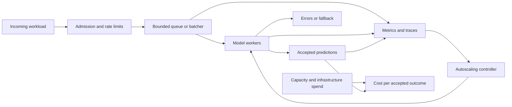
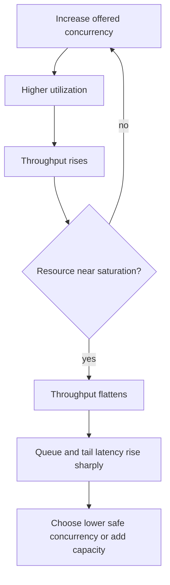
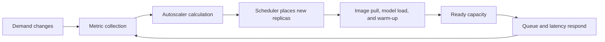

## Serving Performance Is a Capacity System

<!-- section-summary: Inference systems turn finite compute capacity into predictions under latency, reliability, and cost constraints. -->

Once a model is on a request path, accuracy is only one part of the product contract. The service must finish enough predictions, within a latency budget, while traffic and input shapes change. It must also reject or degrade work safely when demand exceeds capacity and keep the cost of successful outcomes sustainable.

This is a **queueing system**. Requests arrive, may wait, receive service from a finite number of workers, and leave as successful, failed, or fallback responses. Near saturation, a small rise in demand can create a large rise in queue time. Adding autoscaling does not remove that behaviour because new capacity takes time to start.



The main engineering task is to understand this loop before tuning Kubernetes settings. A replica count is meaningful only after the team knows the workload, service time, safe concurrency, startup delay, and overload policy.

## Define the Workload and Service Contract

<!-- section-summary: Capacity planning starts with request classes, input shapes, latency targets, traffic patterns, and fallback behaviour. -->

"Requests per second" is incomplete when requests vary. A ranking request with 20 candidates and one with 2,000 candidates may have very different compute and memory demand. Text generation varies with input and output length. Image models vary with resolution. Separate important **workload classes** so averages do not mix unlike work.

For each class, record:

- input and output size limits;
- preprocessing, feature, model, and postprocessing steps;
- interactive, streaming, or asynchronous delivery;
- steady, peak, and burst arrival rates;
- concurrency and client retry behaviour;
- p50, p95, or p99 latency objective and hard timeout;
- required availability and acceptable fallback;
- model version, runtime, hardware, and numeric precision;
- cost objective per accepted prediction or product outcome.

A service contract can keep those assumptions visible:

```yaml
workload: product-ranking-v3
request_class: interactive-small
max_candidates: 100
traffic:
  steady_rps: 450
  peak_rps: 900
  burst_seconds: 30
latency:
  target_p95_ms: 180
  hard_timeout_ms: 500
overload:
  max_queue_ms: 80
  fallback: cached-popular-items
release:
  model: ranker-2026-07-12
  runtime: onnx-cpu-v8
```

The values are illustrative. What matters is that load tests and autoscaling use the same contract the product promises. If traffic shape changes, update the contract and capacity evidence rather than assuming the old result still applies.

## Decompose Latency Before Optimizing It

<!-- section-summary: End-to-end latency contains network, queue, preprocessing, inference, postprocessing, and serialization time. -->

From the caller’s perspective:

`total latency = network + admission + queue wait + preprocessing + inference + postprocessing + serialization`

Measure the total at the service boundary and the stages inside it. Otherwise, a team may optimize model execution while most slow requests wait for a feature service or queue. Distributed traces are useful for individual slow paths; histograms show the population distribution.

An average hides the tail. **p95 latency** is the value that 95% of observations meet or beat; **p99** covers 99%. Tail latency matters because queues, garbage collection, cold workers, large inputs, noisy neighbours, and downstream timeouts affect a minority of requests first.

Percentiles are meaningful only with a defined window and workload. A p99 across all endpoints, model versions, and request sizes can hide which class is unhealthy. Preserve enough bounded labels to compare route, model version, request class, region, and response outcome without turning metrics into a high-cardinality event store.

## Connect Throughput, Service Time, and Concurrency

<!-- section-summary: Little's Law gives a first capacity estimate, while measurement reveals the safe limit before saturation. -->

**Throughput** is completed work per unit of time. **Concurrency** is work currently in the system. **Service time** is how long a worker actively spends on one request. For a stable system, Little’s Law gives a useful relationship:

`average concurrency = arrival rate × average time in system`

If 500 requests arrive each second and each spends 0.1 seconds in the system, average concurrency is about 50. This is a planning estimate, not a replica formula. Real workloads have variable service times, batching, shared dependencies, and tail objectives.

Benchmark one model worker across concurrency levels. At first, added concurrency may improve utilization and throughput. Eventually a resource saturates: CPU, accelerator compute, memory bandwidth, model-server threads, network, or a dependency. Beyond that point, throughput flattens while latency and queue depth rise. The **safe operating point** stays below this knee so bursts and variance have headroom.



CPU utilization alone may not show the real limit. An accelerator can be memory-bound, a Python preprocessor can serialize requests, or a remote feature lookup can cap throughput. Capture resource and stage evidence together.

## Keep Queues Bounded

<!-- section-summary: A queue absorbs short bursts, but an unbounded queue converts overload into long waits and wasted work. -->

A short queue can smooth arrival variation and help a batcher form efficient work units. It cannot create capacity. If arrival rate remains above completion rate, the queue grows until clients time out or memory is exhausted.

Set a maximum queue length or waiting time from the end-to-end latency budget. When the bound is reached, apply **backpressure**: reject quickly, defer asynchronous work, shed a lower-priority class, or return an approved fallback. A fast explicit overload response is often better than doing expensive inference after the caller has already abandoned the request.

Coordinate timeouts across layers. The caller’s deadline should exceed the service’s internal budget just enough to return a controlled result. Retries must use backoff and a retry budget; synchronized client retries can amplify an overload incident.

Track queue wait separately from inference time. Rising queue wait with stable model time is a capacity or admission problem. Rising model time with little queueing points to the runtime, hardware, input shape, or dependency.

## Batching Trades Waiting for Efficiency

<!-- section-summary: Batching can increase device efficiency and throughput, while its formation delay consumes part of the latency budget. -->

Many vectorized CPU and GPU models process a batch more efficiently than the same items one at a time. **Dynamic batching** combines compatible requests that arrive close together. The benefit depends on model shape, hardware, runtime, and traffic.

A batcher introduces a deliberate wait so more requests can join. Larger batches may improve throughput but consume memory and increase per-request latency. Benchmark batch size and maximum queue delay together. Stateless requests are simpler to combine; stateful sequences need correlation and ordering. Text generation often uses continuous or inflight batching because requests finish after different numbers of decoding steps.

Do not copy a preferred batch size from another model. Tools such as NVIDIA Triton’s Performance Analyzer and Model Analyzer can explore throughput, latency, memory use, dynamic batching, and instance counts for a specific model. The release gate remains the product workload and latency budget.

## Autoscaling Is a Delayed Control Loop

<!-- section-summary: An autoscaler observes a signal, calculates desired capacity, waits for new workers, and must avoid oscillation. -->

An autoscaler periodically measures a signal and changes replica count. Kubernetes Horizontal Pod Autoscaler (HPA) can scale from resource, custom, or external metrics. KEDA can observe event sources and feed scaling decisions into Kubernetes, including queue-oriented workloads.

The signal should predict missing capacity. CPU can work for compute-bound CPU inference. Accelerator utilization may be too late or too noisy on its own. Inflight requests, request rate per ready replica, queue depth, or oldest-message age can be more direct, depending on the workload.



Every stage adds delay. If a model takes four minutes to load, scaling after a 30-second burst begins cannot protect that burst. Keep a minimum warm pool, use predictive schedules for known peaks, reduce startup time, or shed load while new replicas start.

Scale-up should be fast enough for the workload; scale-down should be slower and stabilized to avoid removing capacity during a temporary dip. Readiness must remain false until the model and dependencies are usable. Otherwise, the autoscaler counts pods that cannot yet serve.

Use separate policies for interactive and asynchronous work. Queue consumers can sometimes scale to zero, while an interactive endpoint may need ready capacity at all times.

### Scaling Signals Must Match The Missing Capacity

Different signals describe different parts of the loop. CPU or GPU utilization says how busy current workers are, but it may rise only after queues form. Request rate is earlier, but assumes requests have similar cost. Inflight requests include active work but can remain low when a downstream timeout rejects quickly. Queue depth describes waiting work, while oldest-message age shows whether the queue is actually falling behind. The useful signal is the one that tracks the resource constraint for a defined workload class.

A common design combines a demand signal with safety limits. For example, desired replicas may follow requests per ready replica, while a maximum queue age pages an operator and triggers admission control. Replica floors cover known startup delay. Scale-down stabilization prevents the controller from removing newly warmed capacity after a brief dip. These mechanisms are complementary: the autoscaler seeks capacity, while overload protection controls what happens before that capacity arrives.

Avoid multiple controllers that unknowingly compete. An internal model server may adapt concurrency or batching while HPA changes pods and a cluster autoscaler changes nodes. Each loop observes the effect of the others with delay. If their time scales and limits are not explicit, the system can oscillate between long queues and excess capacity. The capacity plan should name which controller owns queueing, concurrency, replicas, and nodes.

## Prove Capacity With Load Tests

<!-- section-summary: Capacity tests reproduce realistic traffic and identify the safe operating envelope, not merely the maximum request rate. -->

Test the exact model artifact, serving image, hardware class, batching policy, limits, and dependency behaviour intended for production. Use a representative distribution of inputs, not one tiny payload. A capacity campaign normally includes:

1. warm-up so compilation and caches reach a known state;
2. a low-load baseline;
3. a step or ramp test to locate saturation;
4. a burst test to evaluate queue and autoscaling response;
5. a soak test to expose leaks and thermal or resource drift;
6. dependency slowdown and failure tests;
7. scale-up and scale-down observation.

Measure offered requests, accepted throughput, fallback and error rate, latency percentiles, queue wait, inflight work, batch sizes, replicas, resource saturation, cold-start duration, and cost. A test has passed only when all release thresholds hold simultaneously. Maximum throughput at unacceptable p99 or error rate is not usable capacity.

Store the workload definition and results with the model release. Re-run when model, runtime, hardware, compiler, input distribution, autoscaling, or dependencies change materially.

Translate the result into an operational envelope. If one warmed replica safely completes 70 requests per second for the representative mix, do not schedule exactly enough replicas for the predicted peak. Reserve headroom for variance, zone loss, uneven routing, deployment overlap, and slow dependencies. State how much headroom exists and what failure it covers. “Thirty percent” is not universally correct; it is a chosen risk allowance supported by tests.

Also test capacity loss, not only demand growth. Remove a node or zone-sized share of replicas during load, then observe queue bounds, fallback, autoscaling, and recovery. During a rolling release, old and new versions may coexist and temporarily double memory or accelerator demand. A plan that passes in a steady cluster can still deadlock when the scheduler cannot place the replacement before terminating the old replica.

## Tie Cost to Accepted Outcomes

<!-- section-summary: Unit economics should include held capacity, retries, fallbacks, and idle time rather than only model execution. -->

Serving cost includes compute or accelerator time, memory, nodes held for readiness, data transfer, observability, managed services, and wasted work from failures or retries. Divide total relevant spend by accepted predictions or a closer product outcome. Cost per token or GPU-hour is an input price, not the full unit economics.

Segment cost by route, model version, request class, region, and hardware pool. Low utilization can mean an oversized replica floor; high utilization with poor latency can mean saturation. A more expensive device may reduce cost per accepted prediction if it completes enough more work, while a cheap device can be uneconomic when it requires a large fleet.

Optimization choices include model compression or compilation, fewer features, better batching, right-sized workers, lower idle floors, asynchronous processing, caching, and workload routing. Re-run quality gates whenever optimization changes numeric behaviour or model outputs.

## What a Production Capacity Plan Provides

<!-- section-summary: A mature inference service has a measured operating envelope, explicit overload behaviour, stable scaling, and outcome-based cost evidence. -->

A production plan defines workload classes and latency objectives, decomposes the serving path, benchmarks the saturation knee, limits queues, and declares fallback behaviour. Batching and concurrency are tuned with the real model. Autoscaling uses a meaningful signal and accounts for startup delay. Load tests prove the complete operating envelope, while telemetry and cost connect runtime behaviour to accepted outcomes.

Scaling is a controlled relationship between demand, finite service capacity, waiting, delayed feedback, and cost. Once those relationships are visible, Kubernetes HPA, KEDA, model-server batching, and hardware choices fit inside one capacity design instead of appearing as isolated configuration exercises.

## References

- [Kubernetes Horizontal Pod Autoscaling](https://kubernetes.io/docs/concepts/workloads/autoscaling/horizontal-pod-autoscale/)
- [KEDA scaling deployments](https://keda.sh/docs/2.20/concepts/scaling-deployments/)
- [NVIDIA Triton batchers](https://docs.nvidia.com/deeplearning/triton-inference-server/user-guide/docs/user_guide/batcher.html)
- [NVIDIA Triton Model Analyzer](https://docs.nvidia.com/deeplearning/triton-inference-server/user-guide/docs/user_guide/model_analyzer.html)
- [Prometheus histograms and summaries](https://prometheus.io/docs/practices/histograms/)
- [OpenTelemetry HTTP metrics conventions](https://opentelemetry.io/docs/specs/semconv/http/http-metrics/)
- [Grafana k6 thresholds](https://grafana.com/docs/k6/latest/using-k6/thresholds/)
- [Google SRE Book: Handling Overload](https://sre.google/sre-book/handling-overload/)
