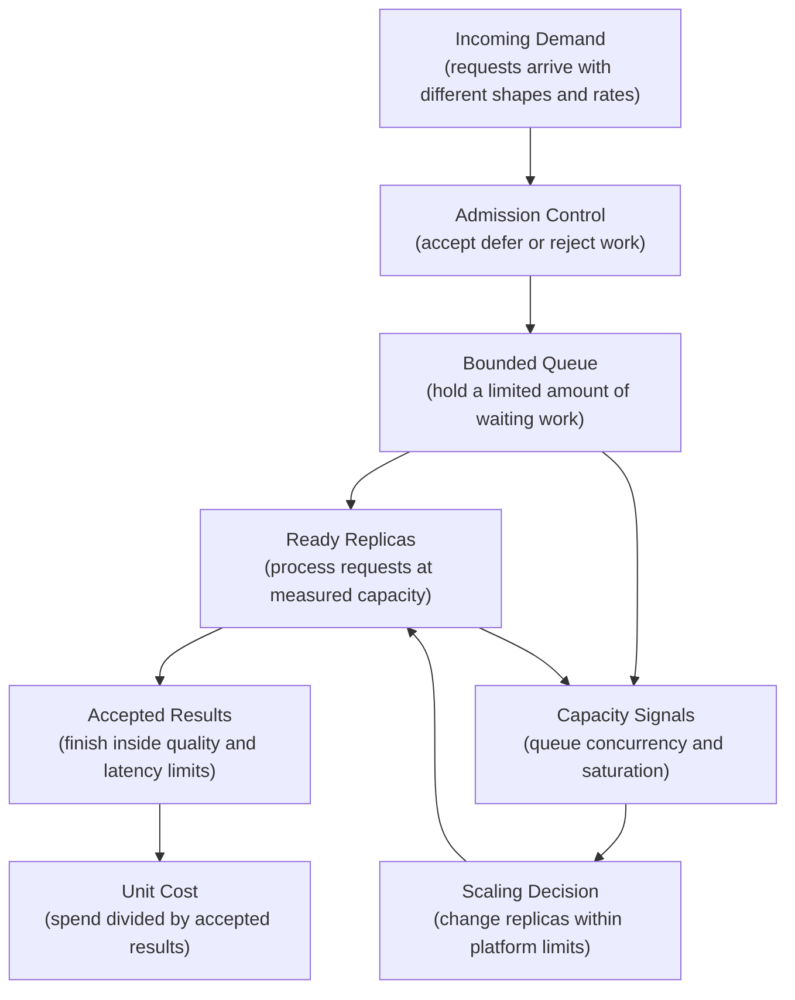
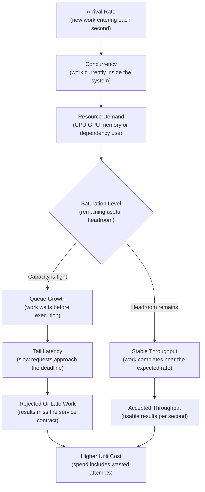
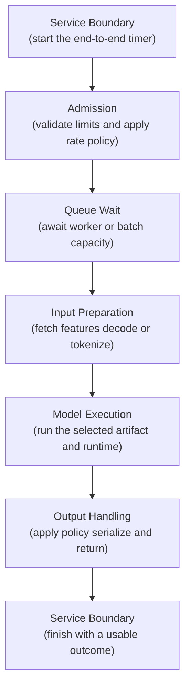
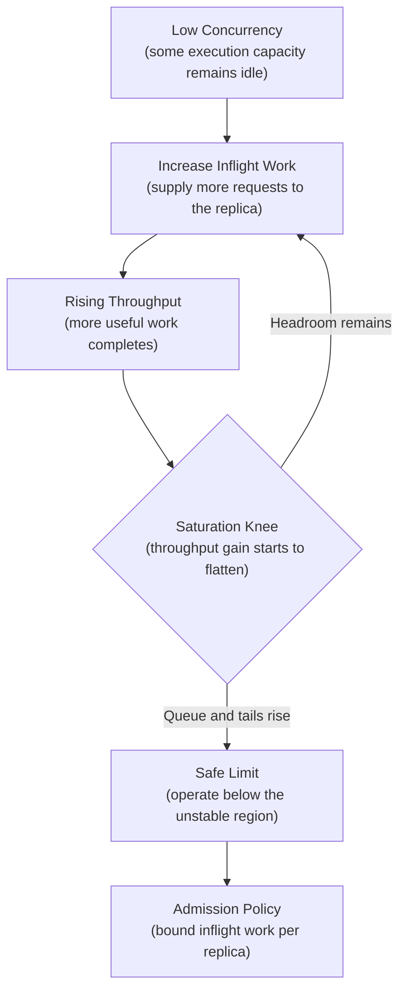
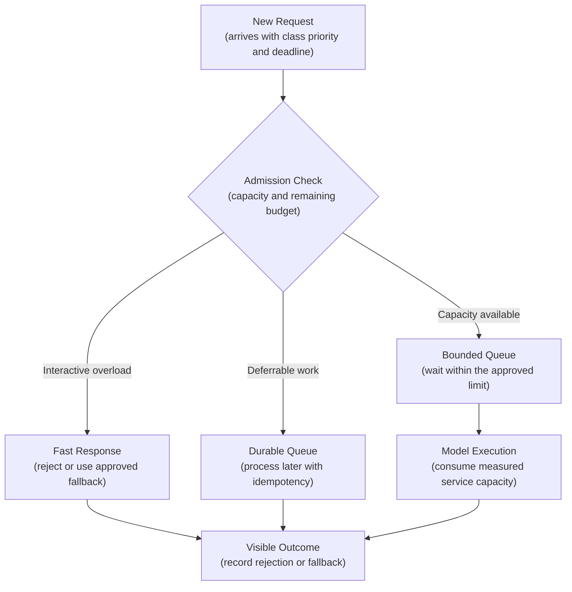
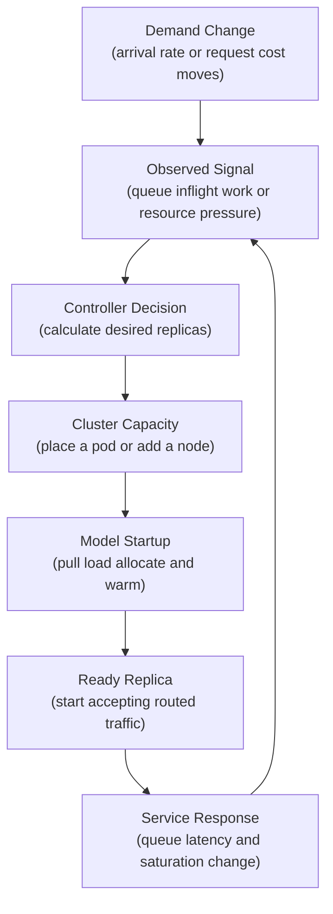
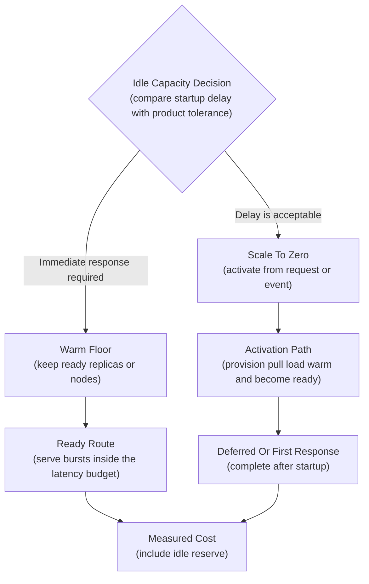
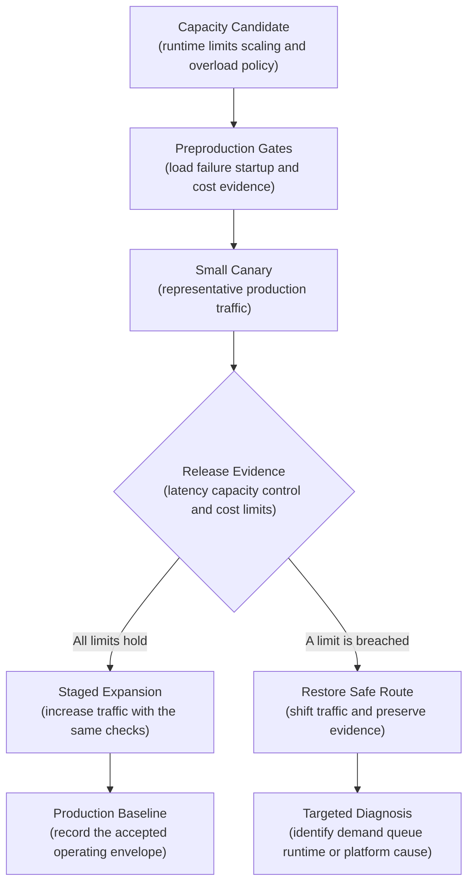

## Table of Contents

1. [What Inference Cost And Scale Mean](#what-inference-cost-and-scale-mean)
2. [Understand The Metrics That Describe Capacity](#understand-the-metrics-that-describe-capacity)
3. [Measure The Full Request Path](#measure-the-full-request-path)
4. [Read Percentiles And Histograms Carefully](#read-percentiles-and-histograms-carefully)
5. [Describe Traffic And Request Work Before Load Testing](#describe-traffic-and-request-work-before-load-testing)
6. [Use Little's Law To Check Concurrency Estimates](#use-littles-law-to-check-concurrency-estimates)
7. [Set A Safe Concurrency Limit](#set-a-safe-concurrency-limit)
8. [Control Overload With Bounded Queues And Backpressure](#control-overload-with-bounded-queues-and-backpressure)
9. [Use Batching To Improve Efficiency Within The Latency Limit](#use-batching-to-improve-efficiency-within-the-latency-limit)
10. [Understand Why Autoscaling Reacts With A Delay](#understand-why-autoscaling-reacts-with-a-delay)
11. [Choose An Autoscaler From Its Signal And Serving Platform](#choose-an-autoscaler-from-its-signal-and-serving-platform)
12. [Plan For Cold Starts And Scale To Zero](#plan-for-cold-starts-and-scale-to-zero)
13. [Build A Capacity Plan From Measurements](#build-a-capacity-plan-from-measurements)
14. [Calculate Cost Per Accepted Result](#calculate-cost-per-accepted-result)
15. [Use Load Tests To Prove Safe Operating Limits](#use-load-tests-to-prove-safe-operating-limits)
16. [Release And Recover Capacity Changes Safely](#release-and-recover-capacity-changes-safely)
17. [The Main Idea](#the-main-idea)
18. [References](#references)

## What Inference Cost And Scale Mean
<!-- section-summary: Inference cost and scale describe how a production service turns finite compute capacity into timely accepted predictions under changing demand. -->

An endpoint may answer quickly during normal traffic and form a long queue after a launch multiplies demand. Keeping extra replicas ready can protect latency, although idle capacity still costs money. **Inference scale** is the ability to keep serving predictions as demand changes, and **inference cost** is the money spent to produce those usable results. Teams must manage them together because either extreme can damage the product.

Imagine a product-ranking endpoint with four ready model replicas. During ordinary traffic, requests arrive steadily and each replica has time to process them. A promotion suddenly doubles the arrival rate. Requests now reach the service faster than the replicas can finish them. A queue grows, response time rises, clients retry, and the retries add more traffic. The model itself may still take the same 30 milliseconds to calculate a ranking. The production system around it has run out of timely capacity.

This is the central problem of inference performance: demand arrives over time, each request consumes finite service capacity, and users care about the total wait for a successful result. Capacity engineering decides how much work each replica can safely carry, how the service responds to excess demand, how quickly new capacity arrives, and what that capability costs.


```mermaid
flowchart TD
    A["Incoming Demand<br/>(requests arrive with different shapes and rates)"] --> B["Admission Control<br/>(accept defer or reject work)"]
    B --> C["Bounded Queue<br/>(hold a limited amount of waiting work)"]
    C --> D["Ready Replicas<br/>(process requests at measured capacity)"]
    D --> E["Accepted Results<br/>(finish inside quality and latency limits)"]
    C --> F["Capacity Signals<br/>(queue concurrency and saturation)"]
    D --> F
    F --> G["Scaling Decision<br/>(change replicas within platform limits)"]
    G --> D
    E --> H["Unit Cost<br/>(spend divided by accepted results)"]

    class A demand; class B,C,D system; class F,G control; class E,H result
```

Autoscaling is one control inside this system. It adds or removes replicas after observing a signal. It still depends on accurate metrics, available nodes, startup time, readiness, queue bounds, and a safe per-replica operating point. Those foundations come first.

## Understand The Metrics That Describe Capacity
<!-- section-summary: Latency, throughput, concurrency, queueing, saturation, utilization, and unit cost describe different parts of the same serving system. -->

Several performance terms sound interchangeable at first. A service can have high throughput and poor latency, high utilization and spare request capacity, or low cost per attempt and high cost per successful result. The terms below separate those conditions so teams can respond to the actual problem.

**Latency** is the time one request spends from the chosen start boundary to the chosen finish boundary. End-to-end latency usually starts as the service receives a request and ends after it returns a usable response. A stage can have its own latency too, such as queue wait or model execution.

**Throughput** is completed work per unit of time, often accepted predictions per second or generated tokens per second. Completed work matters because offered requests can include timeouts, rejected requests, and failed attempts.

**Concurrency** is the number of requests currently inside a defined part of the system. It may mean requests active in the whole service, requests executing inside one model server, or sequences occupying an LLM engine. The boundary should always be named.

**Queueing** is the waiting that occurs before a constrained resource can start work. A short queue can absorb small timing differences. A growing queue shows that arrival rate has exceeded completion rate for a sustained period.

**Saturation** means a limiting resource has little useful headroom. The resource might be CPU, GPU compute, device memory, memory bandwidth, model-server workers, a connection pool, or a remote feature service. Saturation belongs to that specific constraint, so no universal percentage describes every service.

**Utilization** is the share of a resource observed as busy over a period. It helps explain saturation. User latency and accepted throughput require their own measurements. A GPU can report high activity while requests wait too long, and a CPU can report moderate use while one serialized thread limits the service.

**Cost per accepted result** divides the relevant serving spend by results that met the product contract. Failed work, late responses, duplicate retries, and idle reserve still contribute to spend.

These signals form a causal path. Demand raises concurrency. Concurrency occupies workers and memory. As the limiting resource approaches saturation, queue time grows. Queue time raises tail latency and can trigger timeouts or retries. More capacity can reduce the pressure, with a financial cost and a startup delay.


```mermaid
flowchart TD
    A["Arrival Rate<br/>(new work entering each second)"] --> B["Concurrency<br/>(work currently inside the system)"]
    B --> C["Resource Demand<br/>(CPU GPU memory or dependency use)"]
    C --> D{"Saturation Level<br/>(remaining useful headroom)"}
    D -->|"Headroom remains"| E["Stable Throughput<br/>(work completes near the expected rate)"]
    D -->|"Capacity is tight"| F["Queue Growth<br/>(work waits before execution)"]
    F --> G["Tail Latency<br/>(slow requests approach the deadline)"]
    G --> H["Rejected Or Late Work<br/>(results miss the service contract)"]
    E --> I["Accepted Throughput<br/>(usable results per second)"]
    H --> J["Higher Unit Cost<br/>(spend includes wasted attempts)"]
    I --> J

    class A demand; class B,C,E,F,G system; class D choice; class H,I,J result
```

An operating dashboard should preserve these distinctions. A graph of request latency beside accepted throughput and queue depth tells a story. A single utilization gauge omits both user experience and completed work.

## Measure The Full Request Path
<!-- section-summary: End-to-end latency contains admission, queueing, feature work, preprocessing, model execution, postprocessing, and response delivery. -->

The user experiences the entire request path. A 20-millisecond model can sit inside a 400-millisecond endpoint if feature retrieval, queueing, or serialization takes most of the time.

A useful latency budget assigns time to the stages that own it:

\[
L_{total} = L_{admission} + L_{queue} + L_{features} + L_{preprocess} + L_{inference} + L_{postprocess} + L_{response}
\]

The exact stages depend on the service. A recommendation endpoint may fetch candidates and online features. A vision endpoint may decode and resize an image. An LLM endpoint separates time to first token from inter-token latency and total generation time.


*Measure the full request boundary and keep accepted latency beside throughput, request-shape percentiles, and rejection, because a fast model alone does not prove a fast or useful service.*


```mermaid
flowchart TD
    A["Service Boundary<br/>(start the end-to-end timer)"] --> B["Admission<br/>(validate limits and apply rate policy)"]
    B --> C["Queue Wait<br/>(await worker or batch capacity)"]
    C --> D["Input Preparation<br/>(fetch features decode or tokenize)"]
    D --> E["Model Execution<br/>(run the selected artifact and runtime)"]
    E --> F["Output Handling<br/>(apply policy serialize and return)"]
    F --> G["Service Boundary<br/>(finish with a usable outcome)"]

    class A,G boundary; class B,C,D,F stage; class E model
```

Suppose p99 endpoint latency rises from 180 to 600 milliseconds. Model execution remains near 45 milliseconds. Traces show 350 milliseconds in a feature lookup and another 120 milliseconds in the queue. Optimizing the model runtime can touch only a small part of the delay. The immediate containment may bypass a nonessential feature, reduce admission for expensive request classes, or route to an approved fallback while the dependency recovers.

Instrument the outer boundary with a duration histogram and instrument important internal stages with spans or dedicated histograms. OpenTelemetry's HTTP semantic conventions define `http.server.request.duration` as a histogram for server requests. Model-serving metrics should add bounded dimensions such as model route, request class, response outcome, region, and release version. Request IDs belong in traces and logs because per-request labels would create an unbounded metric series set.

## Read Percentiles And Histograms Carefully
<!-- section-summary: Percentiles describe the latency distribution, while histogram design and query scope determine whether those percentiles are meaningful. -->

An average combines fast and slow requests into one number. It can look healthy while a significant minority of users wait far longer. Percentiles describe positions in the full distribution.

**p50**, the median, is the latency met by half of observations. **p95** is met by 95% of observations. **p99** is met by 99%, leaving the slowest 1% above it. For one million daily requests, that slowest 1% still represents ten thousand user experiences.

A percentile always needs a scope. Start with its time window and endpoint. Then separate request classes that have materially different cost. Outcome, region, and model route show whether the tail belongs to accepted work or one part of the deployment.

Combining thumbnail and full-resolution image requests into one p99 hides which shape created the tail. Combining successful responses with fast rejections can make a degraded service appear faster.

Prometheus histograms store duration observations so operators can calculate rates, threshold compliance, and percentiles. Current Prometheus guidance prefers native histograms where the instrumentation and storage path support them. Classic histograms remain common and need bucket boundaries around the service objective; percentile accuracy is limited by bucket width.

For a classic histogram, a p99 query might look like this:

```promql
histogram_quantile(
  0.99,
  sum by (le, model_route, request_class) (
    rate(ml_inference_request_duration_seconds_bucket{result="accepted"}[5m])
  )
)
```

This query calculates separate p99 estimates for each bounded route and request class. It excludes rejected work from the accepted-latency view, so the dashboard should show rejection rate beside it. Otherwise, aggressive load shedding could improve the p99 graph by refusing difficult requests.

Histograms also support a direct service-objective question: what share of accepted requests finished within 250 milliseconds? That ratio is often more actionable than a percentile because it matches the promise directly. Keep both views if operators need the distribution and the objective.

## Describe Traffic And Request Work Before Load Testing
<!-- section-summary: Request shapes, arrival patterns, client behaviour, and delivery mode determine the load a serving system must handle. -->

“One thousand requests per second” describes only arrival count. Capacity also depends on what those requests contain, how they arrive, how long clients wait, and whether clients retry.

Start with **request classes**. A ranking request with 20 candidates costs less than one with 2,000. A 64-token prompt consumes less LLM memory and compute than a 16,000-token prompt. A request that generates 20 tokens occupies the engine for less time than one that generates 2,000. Define stable classes around the variables that materially affect service time or memory.

Then describe the **arrival pattern**. Steady traffic tests sustained capacity. A burst reveals queue and admission behaviour. A ramp helps locate the saturation knee. A scheduled peak may justify adding capacity in advance. A regional failover can move a large share of traffic almost instantly.

Load generators use two common models. In a **closed model**, each virtual user waits for a response before sending its next request. A slowing server reduces the generated arrival rate, which can hide overload. In an **open model**, requests start according to an external arrival schedule. This preserves offered load even as latency rises. Grafana k6 arrival-rate executors implement the open approach and report dropped iterations if the load generator lacks enough virtual users.

Client behaviour completes the workload. Record timeouts, retry count, backoff, cancellation, and connection reuse. A client that times out at 500 milliseconds and retries twice can turn one product action into three inference attempts. The service should stop work after cancellation where the runtime allows it, especially for expensive generation.

A compact workload contract makes the test reproducible:

```yaml
workload: product-ranking
request_classes:
  small:
    candidate_limit: 100
    traffic_share: 0.85
  large:
    candidate_limit: 1000
    traffic_share: 0.15
arrival:
  steady_rps: 450
  peak_rps: 900
  burst_duration_seconds: 30
service_objective:
  accepted_p99_ms: 250
  maximum_rejection_rate: 0.005
client:
  timeout_ms: 500
  retry_budget: 1
```

The values are illustrative. Production evidence must use the contract approved for that endpoint and release.

## Use Little's Law To Check Concurrency Estimates
<!-- section-summary: Little's Law connects average arrival rate, time in the system, and work in progress for a stable flow. -->

Capacity planning often needs a quick check on whether arrival rate, latency, and observed work in progress agree. Little's Law supplies that check for a stable flow. It connects three measurements without requiring a detailed model of the service internals.

The relationship is:

\[
L = \lambda W
\]

Here, **L** is the average number of requests in the system, **lambda** is the average arrival rate, and **W** is the average time each request spends in the system.

The relationship is intuitive. If 100 requests arrive each second and each stays for 0.2 seconds, about 20 requests are present on average:

\[
100\ requests/second \times 0.2\ seconds = 20\ concurrent\ requests
\]

Think of a café serving ten customers per minute. If each customer spends six minutes from joining the line to receiving the order, roughly sixty customers are somewhere in that process on average. A longer wait raises work in progress even if the arrival rate stays unchanged.

Use this law as a cross-check. Replica planning needs additional evidence because the formula relies on averages and a stable flow. Production traffic includes bursts and multiple request classes. Timeouts, batching, and changing replica counts also affect the observed system. Tail latency objectives need more headroom than an average relationship reveals.

The formula is still useful during diagnosis. If observed arrival rate is 200 requests per second and average latency is 0.5 seconds, average in-system concurrency should be near 100. A dashboard showing only 20 active requests may have a different measurement boundary, missing queue instrumentation, or fast rejected traffic. Resolve that mismatch before using the metric for autoscaling.

## Set A Safe Concurrency Limit
<!-- section-summary: A safe concurrency limit keeps each replica below the point where added work creates unstable queues, memory pressure, or tail latency. -->

Increasing concurrency gives a worker more opportunities to overlap work. It can keep CPU threads, network calls, or a GPU pipeline supplied. The benefit ends after a limiting resource reaches its practical capacity.

Run one warmed replica under increasing offered concurrency. At low levels, throughput often rises with concurrency. Near the **saturation knee**, throughput gains shrink while queue time and p99 latency begin to climb. Past that point, more inflight work mainly creates waiting and memory pressure.


```mermaid
flowchart TD
    A["Low Concurrency<br/>(some execution capacity remains idle)"] --> B["Increase Inflight Work<br/>(supply more requests to the replica)"]
    B --> C["Rising Throughput<br/>(more useful work completes)"]
    C --> D{"Saturation Knee<br/>(throughput gain starts to flatten)"}
    D -->|"Headroom remains"| B
    D -->|"Queue and tails rise"| E["Safe Limit<br/>(operate below the unstable region)"]
    E --> F["Admission Policy<br/>(bound inflight work per replica)"]

    class A state; class B,C work; class D choice; class E,F policy
```

The safe limit should pass the latency, memory, error, and quality gates with headroom. For an LLM, include prompt length, generated length, and KV-cache occupancy. For a GPU model server, test batch size and model-instance count with concurrency because all three consume device resources.

Suppose one image replica completes 75 requests per second at concurrency 12 with p99 of 170 milliseconds. At concurrency 20, it completes 79 requests per second while p99 reaches 430 milliseconds and OOMs appear on large images. The extra four requests per second are poor capacity. A per-replica inflight limit near 12, validated across the shape mix, gives the service a defensible operating point.

## Control Overload With Bounded Queues And Backpressure
<!-- section-summary: Bounded queues absorb short variation, while backpressure and load shedding protect useful work after demand exceeds timely capacity. -->

A queue stores work awaiting execution. It can smooth a brief arrival spike and help a batcher collect compatible requests. The worker completion rate stays unchanged.

If arrivals remain above completion rate, the queue grows. Waiting requests consume memory and continue aging toward their client deadlines. By the time a worker starts an old request, the caller may already have abandoned it. The service then spends capacity on a result nobody can use.

Set a maximum queue length or maximum queue age from the end-to-end budget. If the whole request has 250 milliseconds and typical execution needs 150, a 300-millisecond queue budget already violates the service objective. Admission should account for the request's remaining deadline where possible.

**Backpressure** tells callers or upstream components that the service has reached its safe inflight capacity. For synchronous APIs, this may be a fast retryable response with a bounded retry policy. For asynchronous work, the producer may slow down or the queue may retain the message for later processing.

**Load shedding** deliberately refuses lower-priority or excess work to preserve the capacity needed for important requests. Possible actions include rejecting an expensive request class, routing to a smaller approved model, returning a cached result, shortening generation limits, or deferring background enrichment. Each action needs a product-approved meaning and its own outcome metric.


```mermaid
flowchart TD
    A["New Request<br/>(arrives with class priority and deadline)"] --> B{"Admission Check<br/>(capacity and remaining budget)"}
    B -->|"Capacity available"| C["Bounded Queue<br/>(wait within the approved limit)"]
    B -->|"Interactive overload"| D["Fast Response<br/>(reject or use approved fallback)"]
    B -->|"Deferrable work"| E["Durable Queue<br/>(process later with idempotency)"]
    C --> F["Model Execution<br/>(consume measured service capacity)"]
    D --> G["Visible Outcome<br/>(record rejection or fallback)"]
    E --> G
    F --> G

    class A request; class B choice; class C,D,E,F path; class G result
```

Coordinate timeouts and retries across the chain. Add jittered backoff and a retry budget. A synchronized retry wave can turn a short overload into a sustained incident. Track original product actions separately from inference attempts so the business-workload metric counts each action once.

## Use Batching To Improve Efficiency Within The Latency Limit
<!-- section-summary: Batching groups compatible inputs into one execution, improving throughput for some runtimes while consuming queue time and memory. -->

A **batch** is a group of inputs processed by one model execution. Vectorized CPU libraries and GPUs often handle a batch more efficiently than the same inputs executed one at a time. Fixed overhead is shared, and larger tensor operations may use the hardware more fully.

Online requests rarely arrive already grouped. A **dynamic batcher** holds compatible requests for a short time or until it reaches a size limit. That deliberate wait uses part of the latency budget. Larger batches also increase activation memory and can take longer to execute.

Tune maximum batch size, queue delay, concurrency, and model instances together. Measure the batch sizes the server actually forms at production-like arrival rates. A configured maximum of 32 means little if ordinary traffic forms batches of two.

For example, a stateless embedding endpoint may gain substantial throughput from a one-millisecond batching window and stay inside a 100-millisecond p99 objective. The same delay adds pure waiting to a quiet endpoint that rarely receives adjacent requests. Text-generation runtimes commonly use continuous batching because sequences finish at different times; prompt length, output length, and KV cache then join the capacity model.

NVIDIA Triton supplies dynamic batching for stateless models and Performance Analyzer for controlled concurrency or request-rate tests. The following GPU article develops the hardware-specific batch, memory, and instance interactions in more depth. Here, the capacity principle is simple: count the waiting time, memory, and accepted throughput produced by the complete batch policy.

## Understand Why Autoscaling Reacts With A Delay
<!-- section-summary: Autoscaling observes a demand signal, calculates desired replicas, waits for infrastructure and model startup, and sees the result after another delay. -->

An autoscaler is a feedback controller. It measures a signal, compares that value with a target, changes desired replica count, and later observes whether the change reduced pressure. Every step takes time.

Metric collection and aggregation introduce the first delay. The controller evaluates on a schedule. Kubernetes must find an existing node or request a new one. The node pulls the image, the pod downloads and loads the model, the runtime allocates memory, warm-up runs, and readiness finally allows traffic. The effect appears in queue and latency metrics after requests reach the new replica.


```mermaid
flowchart TD
    A["Demand Change<br/>(arrival rate or request cost moves)"] --> B["Observed Signal<br/>(queue inflight work or resource pressure)"]
    B --> C["Controller Decision<br/>(calculate desired replicas)"]
    C --> D["Cluster Capacity<br/>(place a pod or add a node)"]
    D --> E["Model Startup<br/>(pull load allocate and warm)"]
    E --> F["Ready Replica<br/>(start accepting routed traffic)"]
    F --> G["Service Response<br/>(queue latency and saturation change)"]
    G --> B

    class A demand; class B,C control; class D,E,F platform; class G result
```

If the complete scale-up path takes four minutes, a 30-second burst has ended long before new capacity arrives. A warm replica floor, scheduled capacity before known peaks, faster startup, or overload control must protect that event.

Scale-down needs patience. Removing a recently warmed replica after one quiet interval can start an oscillation: traffic rises, pods warm, the signal falls, pods leave, and the queue rises again. Stabilization windows and conservative scale-down policies give the system time to reveal the effect of a change.

Each controller needs an explicit responsibility. A model server may tune batches, an HPA changes pods, and a cluster autoscaler changes nodes. Their observation windows and limits should reflect that order. Several controllers reacting to the same delayed symptom can amplify oscillation.


*The tested inflight limit and bounded queue protect current requests; a warm floor and headroom bridge the separate delay before autoscaling can add ready capacity.*

## Choose An Autoscaler From Its Signal And Serving Platform
<!-- section-summary: HPA, KEDA, Knative, and KServe operate at different layers, so the workload and scaling signal determine which component should own the decision. -->

The industrial stack provides several scaling components. They solve related parts of the system and should be selected by responsibility.

### Kubernetes Horizontal Pod Autoscaler

The **Horizontal Pod Autoscaler**, or **HPA**, is the standard Kubernetes controller for changing replica count on a scalable workload such as a Deployment. The stable `autoscaling/v2` API supports CPU, memory, per-pod custom metrics, object metrics, and external metrics. If several metrics are configured, HPA calculates a desired count for each and uses the highest recommendation.

CPU utilization is appropriate for a CPU-bound model whose CPU usage rises before latency fails. GPU endpoints often need a serving signal such as inflight requests or queue pressure because CPU can remain quiet while the accelerator is full. Custom metrics require an adapter that exposes them through the Kubernetes metrics APIs.

HPA behaviour policies control scale-up and scale-down velocity. A scale-down stabilization window keeps recent higher recommendations and preserves useful capacity through a short dip.

### KEDA

**Kubernetes Event-driven Autoscaling**, or **KEDA**, connects event sources and external metrics to Kubernetes scaling. For a ScaledObject, KEDA owns activation between zero and one replica, then supplies metrics to HPA for scaling between one and many. This is valuable for message queues and for Prometheus signals that already represent model-serving demand.

A focused Prometheus-backed policy could scale an inference Deployment from total inflight work. An interactive endpoint keeps a warm floor of two replicas:

```yaml
apiVersion: keda.sh/v1alpha1
kind: ScaledObject
metadata:
  name: ranking-inference
spec:
  scaleTargetRef:
    name: ranking-inference
  minReplicaCount: 2
  maxReplicaCount: 20
  cooldownPeriod: 300
  triggers:
    - type: prometheus
      metadata:
        serverAddress: http://prometheus.monitoring.svc:9090
        query: sum(ml_inference_inflight_requests{service="ranking-inference"})
        threshold: "8"
```

The threshold represents the target metric value used by the scaling calculation. Its value must come from the safe per-replica concurrency test. The metric query must return one usable scalar, and the production design needs authentication, metric-loss behaviour, and ownership of the generated HPA.

### Knative Serving

**Knative Serving** provides request-driven scaling for services and supports scaling to zero. Its pod autoscaler can use concurrency or requests per second. Knative distinguishes a soft concurrency target used for scaling from an optional hard `containerConcurrency` limit that controls how many simultaneous requests reach a replica.

Knative fits predictive endpoints with request patterns and startup times compatible with its request buffering and activation path. A low hard concurrency limit can create extra buffering and cold starts, so derive it from the same saturation experiment used for other admission controls.

### KServe

**KServe** adds model-serving resources and lifecycle management on Kubernetes. Its current architecture offers Standard mode for direct Kubernetes control and Knative mode for serverless predictive inference. Standard deployments can use HPA and, where configured, KEDA for custom metrics. KServe documents KEDA scaling from Prometheus or OpenTelemetry-derived LLM metrics such as waiting requests or KV-cache pressure.

For GPU-heavy generative inference, current KServe guidance favors Standard mode because long requests, accelerator scheduling, and specialized scaling signals need more direct control. Knative mode is aimed primarily at predictive workloads that benefit from request-based scaling and scale-to-zero behaviour.

The choice follows the workload. Use HPA for a direct Kubernetes replica controller with available metrics. Add KEDA for event-driven activation or external sources. Use Knative for request-driven serverless behaviour. Use KServe to standardize the model-serving resource and runtime lifecycle, then select the supported autoscaling path within that deployment mode.

## Plan For Cold Starts And Scale To Zero
<!-- section-summary: Cold-start time determines whether new or zero-scaled capacity can meet the product's response objective. -->

A **cold start** is the delay before newly requested capacity can serve real traffic. For ML systems, it can include node provisioning, image pull, model download, engine compilation, weight loading, device-memory allocation, dependency connection, warm-up, and readiness.

Measure each stage separately. A large container image may dominate one service. A TensorRT engine build may dominate another. A large language model may spend most startup time downloading weights and filling device memory. The slowest stage needs an owner and a tested improvement path.

**Scale to zero** removes all serving replicas during idle periods. It saves idle compute, while the first new request or event must activate the service. That behaviour suits asynchronous jobs, development endpoints, and interactive products whose contract explicitly tolerates the activation delay.

Suppose a GPU endpoint takes six minutes to provision a node and load its model. A two-second user objective requires ready capacity, a smaller warm fallback, or an asynchronous product flow. For a nightly document-embedding queue, six minutes may be acceptable and scale to zero can materially reduce cost.


```mermaid
flowchart TD
    A{"Idle Capacity Decision<br/>(compare startup delay with product tolerance)"} -->|"Immediate response required"| B["Warm Floor<br/>(keep ready replicas or nodes)"]
    A -->|"Delay is acceptable"| C["Scale To Zero<br/>(activate from request or event)"]
    B --> D["Ready Route<br/>(serve bursts inside the latency budget)"]
    C --> E["Activation Path<br/>(provision pull load warm and become ready)"]
    E --> F["Deferred Or First Response<br/>(complete after startup)"]
    D --> G["Measured Cost<br/>(include idle reserve)"]
    F --> G

    class A choice; class B,C,D,E path; class F,G result
```

Caches help only with controlled compatibility. A cached engine needs a matching model graph, runtime, driver expectations, and hardware profile. A cached artifact needs digest verification and an eviction policy. Readiness should remain false until a representative warm-up proves the actual execution path.

## Build A Capacity Plan From Measurements
<!-- section-summary: A capacity plan converts safe per-replica throughput into replica floors, peak capacity, failure reserve, and infrastructure limits. -->

The capacity plan starts with one configuration that passed the quality, latency, memory, and error gates. Record its sustainable accepted throughput for the representative request mix at the safe concurrency limit.

A first replica estimate is:

\[
N = \left\lceil \frac{R_{peak}}{T_{safe} \times U_{target}} \right\rceil
\]

Here, **N** is the replica count, **R peak** is forecast peak arrival rate, **T safe** is sustainable accepted throughput per warmed replica, and **U target** is the chosen load fraction that preserves headroom.

If one replica safely accepts 70 requests per second and the target load fraction is 0.65, plan around 45.5 requests per second of usable capacity per replica. A peak of 400 requests per second needs nine replicas before additional failure reserve.

Headroom has a purpose. Traffic variance needs some. Uneven load balancing may leave one replica hotter than another. A rolling release needs old and new replicas at the same time. Zone or node failure removes capacity. A slower dependency can reduce per-replica throughput. State which event each reserve covers.

The infrastructure must also be able to place the plan. Check node-pool maximums, GPU availability, quotas, IP capacity, topology constraints, image-registry throughput, and model-storage bandwidth. An autoscaler with `maxReplicas: 50` provides no protection if the cluster can place only 12 replicas.

Test capacity loss as well as demand growth. Remove a node or a zone-sized share of replicas under representative traffic. Observe admission, queue bounds, fallback, autoscaling, replacement readiness, and recovery time. This establishes whether the stated reserve works in the failure it was meant to cover.

## Calculate Cost Per Accepted Result
<!-- section-summary: Cost per accepted result connects total serving spend with predictions that met the required quality, latency, and outcome contract. -->

Hourly instance price is only one part of serving cost. Include CPU or accelerator capacity, memory, nodes held ready, storage, model transfer, networking, observability, managed control planes, and platform overhead. Failed attempts, late results, and duplicate retries consume those resources too.

Define an **accepted result** before calculating unit cost. For an online classifier, it may be a valid prediction returned inside the latency objective. For an LLM endpoint, it may require a completed or deliberately stopped response that passed safety checks. For a batch job, it may be a record published exactly once before the deadline.

\[
\text{cost per accepted result} = \frac{\text{serving spend for the period}}{\text{accepted results in the period}}
\]

Suppose a service spends £120 during a load window. It receives one million requests, rejects 50,000 during overload, and returns another 20,000 after the product deadline. The denominator is 930,000 accepted results, giving about £0.000129 per accepted result. Dividing by all one million requests would hide the cost of unusable work.

Segment unit cost by model route, request class, hardware pool, and region. A larger GPU can cost more per hour and less per accepted result if it completes far more useful work. A shared deployment can reduce idle cost and introduce contention that harms p99. A warm floor raises idle spend and may be necessary to meet the availability and cold-start contract.

Cost optimization should preserve the product gates. Batching, compilation, quantization, caching, smaller models, workload routing, and scale-down policies can all change quality, latency, or failure behaviour. Compare complete candidates at the same accepted-result definition.

## Use Load Tests To Prove Safe Operating Limits
<!-- section-summary: Load tests identify the range of traffic and failures where latency, quality, rejection, memory, recovery, and cost remain acceptable together. -->

A production load test should answer a release question. It uses the exact artifact, serving image, hardware class, model-server configuration, autoscaling policy, and dependency path intended for production.

Build the campaign in layers:

1. **Warm baseline.** Confirm correctness and low-load latency after the declared warm-up state.
2. **Step or ramp.** Increase offered arrival rate to locate the saturation knee and safe per-replica concurrency.
3. **Burst.** Test admission, queue bounds, retry amplification, and the time before scaled capacity is ready.
4. **Soak.** Hold representative load long enough to expose leaks, cache growth, fragmentation, or thermal effects.
5. **Shape stress.** Exercise the largest supported images, candidate sets, prompts, and generated outputs in their expected proportions.
6. **Dependency impairment.** Add latency or failure to feature stores, model storage, queues, and downstream services.
7. **Capacity loss.** Drain nodes or remove a failure-sized share of replicas during traffic.
8. **Recovery.** Confirm that queues fall, fallback stops, and unit cost returns to its expected range.

Grafana k6 can generate constant or ramping arrival-rate scenarios and enforce thresholds. A focused test gate might require accepted p99 under 250 milliseconds and rejection below 0.5%:

```javascript
export const options = {
  scenarios: {
    peak: {
      executor: "constant-arrival-rate",
      rate: 900,
      timeUnit: "1s",
      duration: "10m",
      preAllocatedVUs: 300,
      maxVUs: 1200,
    },
  },
  thresholds: {
    http_req_duration: ["p(99)<250"],
    http_req_failed: ["rate<0.005"],
  },
};
```

The load generator must have enough capacity to maintain the offered rate. k6 exposes dropped iterations if it runs out of available virtual users. Monitor the generator separately because a client-side bottleneck can create a falsely low service load.

Store the workload contract, test code, raw results, release identity, and gate decision together. Re-run after material changes to the model, runtime, hardware, batching, request distribution, autoscaler, dependencies, or overload policy.

## Release And Recover Capacity Changes Safely
<!-- section-summary: Capacity changes need staged release gates, signal-based diagnosis, a safe traffic route, and proof that recovery restores the full service contract. -->

A capacity release can change the model, runtime, container resources, concurrency, batching, queue limits, replica floor, autoscaling signal, scaling thresholds, node pool, or fallback. Each change can affect several signals, so release the complete configuration as one identified candidate.

Before production exposure, require four groups of evidence. The **service gate** proves accepted p99 and throughput at the release load. Rejection, fallback, and errors must stay inside their separate limits.

The **resource gate** proves memory and saturation headroom on each supported hardware class. The **control gate** proves that metrics remain available, scaled capacity reaches readiness inside its budget, and the platform can reach the declared maximum. It also verifies stable scale-down. The **economic gate** checks cost per accepted result at ordinary and peak traffic.

Use a small canary with the same request-shape mix as the target route. Compare it with the previous configuration across latency stages, queue age, accepted throughput, resource pressure, scaling events, cold starts, and unit cost. Expand only through predefined evidence windows.


```mermaid
flowchart TD
    A["Capacity Candidate<br/>(runtime limits scaling and overload policy)"] --> B["Preproduction Gates<br/>(load failure startup and cost evidence)"]
    B --> C["Small Canary<br/>(representative production traffic)"]
    C --> D{"Release Evidence<br/>(latency capacity control and cost limits)"}
    D -->|"All limits hold"| E["Staged Expansion<br/>(increase traffic with the same checks)"]
    D -->|"A limit is breached"| F["Restore Safe Route<br/>(shift traffic and preserve evidence)"]
    E --> G["Production Baseline<br/>(record the accepted operating envelope)"]
    F --> H["Targeted Diagnosis<br/>(identify demand queue runtime or platform cause)"]

    class A candidate; class B,C,E gate; class D choice; class F,G,H result
```

During an incident, read the signal relationships in order. Confirm offered arrival rate and request mix. Check accepted throughput and rejection. Inspect queue age and inflight work. Compare stage latency. Identify the saturated resource. Then inspect desired, scheduled, starting, ready, and unavailable replicas.

Several patterns lead to different actions:

- Rising queue age with stable per-request execution indicates insufficient ready capacity or an admission limit that is too loose. Contain with load shedding or fallback while capacity recovers.
- Rising model execution time with stable traffic points toward an artifact, runtime, input-shape, hardware, or neighbour change. Shift traffic to the previous route and compare profiles.
- Desired replicas rise while ready replicas stay flat indicates scheduling, quota, node provisioning, image pull, model load, or readiness trouble. Inspect the startup chain before increasing the desired maximum.
- Rejections rise while p99 improves indicates that overload control is protecting the accepted path. Verify the rejection budget and product impact before declaring the service healthy.
- Cost rises with flat accepted throughput indicates idle capacity, failed work, routing imbalance, or a less efficient candidate. Break unit cost down by route and hardware pool.

Rollback restores a known-safe combination of limits, scaling policy, serving image, artifact, and routing. Keep enough old capacity ready during a risky rollout, especially where node and model startup are slow. After recovery, prove that queue age returns to baseline, accepted p99 and rejection meet their gates, the autoscaler stabilizes, and cost per accepted result returns to the approved range.

## The Main Idea

Inference scaling is the controlled relationship among arriving work, per-request time, safe concurrency, finite capacity, queueing, delayed autoscaling, and spend. Latency shows the experience of one request. Throughput shows completed work. Concurrency and queues show work in progress. Saturation explains the limit. Cost per accepted result shows the economic consequence.

Measure the whole request path and representative workload. Find the safe operating point for one replica. Bound the queue and define overload behaviour. Choose an autoscaling component whose signal matches the missing capacity, then account for its startup delay. Prove peak load, capacity loss, recovery, and unit cost before expanding the release.


*A capacity change is ready for release only after service, resource, control, and economic evidence pass together, with a tested route back to the previous complete configuration when any limit fails.*

## References

- [Kubernetes Horizontal Pod Autoscaling](https://kubernetes.io/docs/concepts/workloads/autoscaling/horizontal-pod-autoscale/)
- [Kubernetes HorizontalPodAutoscaler API](https://kubernetes.io/docs/reference/kubernetes-api/autoscaling-resources/horizontal-pod-autoscaler-v2/)
- [KEDA scaling Deployments and StatefulSets](https://keda.sh/docs/latest/concepts/scaling-deployments/)
- [KEDA Prometheus scaler](https://keda.sh/docs/latest/scalers/prometheus/)
- [Knative Serving autoscaling](https://knative.dev/docs/serving/autoscaling/)
- [Knative concurrency configuration](https://knative.dev/docs/serving/autoscaling/concurrency/)
- [KServe control-plane architecture](https://kserve.github.io/website/docs/concepts/architecture/control-plane)
- [KServe autoscaling with LLM metrics](https://kserve.github.io/website/docs/model-serving/generative-inference/autoscaling)
- [KServe administrator guide](https://kserve.github.io/website/docs/admin-guide/overview)
- [Prometheus histograms and summaries](https://prometheus.io/docs/practices/histograms/)
- [OpenTelemetry HTTP metrics conventions](https://opentelemetry.io/docs/specs/semconv/http/http-metrics/)
- [NVIDIA Triton dynamic batching](https://docs.nvidia.com/deeplearning/triton-inference-server/user-guide/docs/user_guide/batcher.html)
- [NVIDIA Triton Performance Analyzer](https://docs.nvidia.com/deeplearning/triton-inference-server/user-guide/docs/perf_analyzer/README.html)
- [Grafana k6 arrival-rate testing](https://grafana.com/docs/k6/latest/using-k6/scenarios/concepts/arrival-rate-vu-allocation/)
- [Grafana k6 thresholds](https://grafana.com/docs/k6/latest/using-k6/thresholds/)
- [Google SRE Book: Addressing Cascading Failures](https://sre.google/sre-book/addressing-cascading-failures/)
