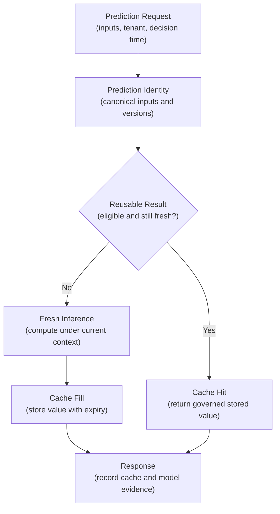
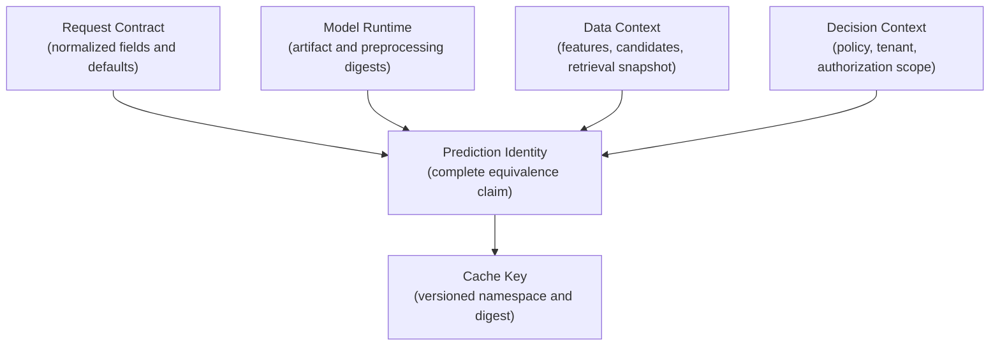
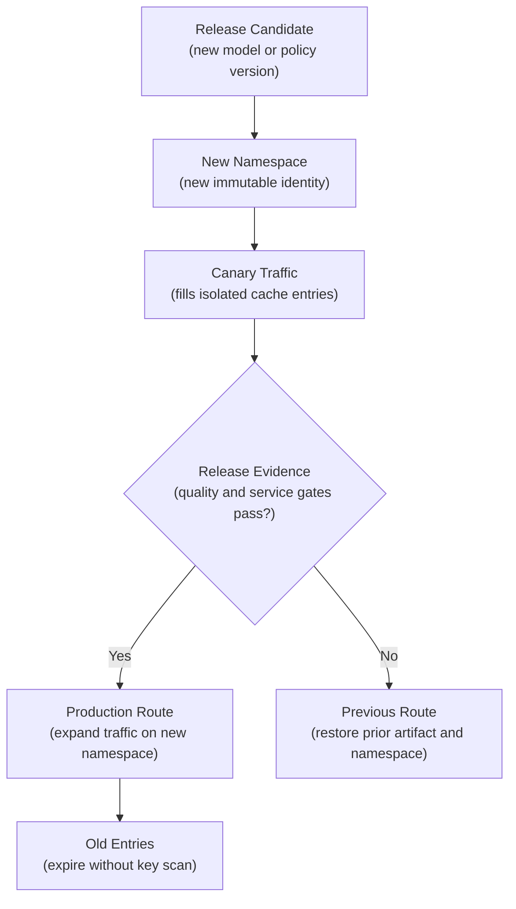
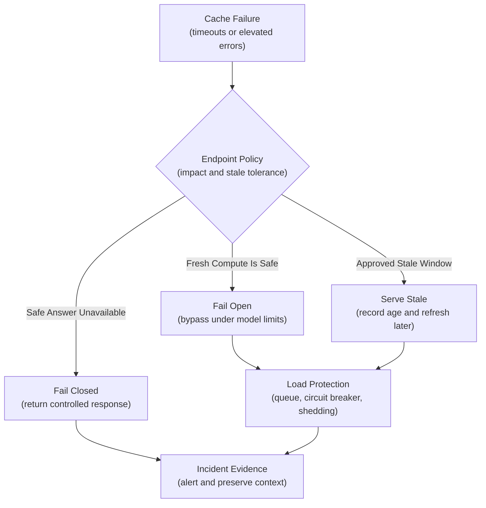
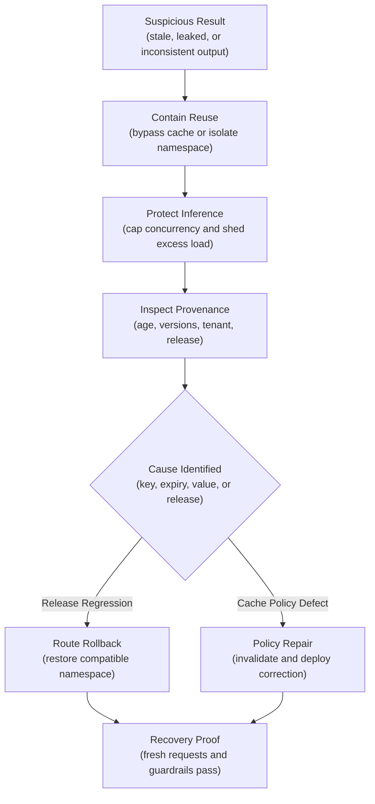

## Table of Contents

1. [What Prediction Caching Changes](#what-prediction-caching-changes)
2. [Decide Whether A Result Is Reusable](#decide-whether-a-result-is-reusable)
3. [Define What Counts As The Same Prediction Before Caching](#define-what-counts-as-the-same-prediction-before-caching)
4. [Build The Cache Key From The Complete Prediction Identity](#build-the-cache-key-from-the-complete-prediction-identity)
5. [Define How Long A Cached Result May Be Used](#define-how-long-a-cached-result-may-be-used)
6. [Invalidate The Cache With Versioned Names](#invalidate-the-cache-with-versioned-names)
7. [Separate Tenant And Sensitive Cache Data](#separate-tenant-and-sensitive-cache-data)
8. [Choose Where The Cache Is Read And Written](#choose-where-the-cache-is-read-and-written)
9. [Prevent Cache Stampedes And Invalid Entries](#prevent-cache-stampedes-and-invalid-entries)
10. [Decide Whether To Cache Failures And Partial Results](#decide-whether-to-cache-failures-and-partial-results)
11. [Apply Caching Rules To Embeddings, Ranking, And LLMs](#apply-caching-rules-to-embeddings-ranking-and-llms)
12. [Operate Redis Or Valkey In Production](#operate-redis-or-valkey-in-production)
13. [Decide What Happens If The Cache Fails](#decide-what-happens-if-the-cache-fails)
14. [Measure Cache Correctness And Benefit](#measure-cache-correctness-and-benefit)
15. [Test Cache Changes And Incident Recovery](#test-cache-changes-and-incident-recovery)
16. [Main Idea](#main-idea)
17. [References](#references)

## What Prediction Caching Changes
<!-- section-summary: Prediction caching reuses a previous model result only inside a declared equivalence and freshness boundary. -->

Two requests may ask for the same prediction over unchanged inputs. Running the model twice adds delay and compute without changing the answer. **Prediction caching** stores the earlier result so a later equivalent request can reuse it. A valid cache hit avoids another model call, gives the user a faster answer, and spends less CPU, GPU time, or external-model budget.

This sounds similar to ordinary web caching, although an ML result carries more hidden dependencies. A web cache may identify a response from its URL, selected headers, and expiry policy. A prediction can depend on the model artifact and preprocessing code. Feature values, retrieval state, prompts, safety policy, tenant, and decision time can also affect it. Two HTTP bodies can look identical while those hidden inputs differ.

The cache key therefore represents a claim: **requests that produce the same key may safely share one stored result for a defined period**. A missing identity field widens that claim. A long expiry widens it again. Safe caching comes from making the claim explicit before choosing Redis commands or cloud infrastructure.



Consider a service that creates an image embedding, a numeric vector used for similarity search. If the image bytes and embedding-model artifact are unchanged, recalculating the vector usually repeats the same work. A key derived from the content digest and model digest can safely reuse the vector for a long period. A payment-fraud decision has a different shape: recent attempts, account state, device evidence, and policy can change between two apparently identical requests. Reusing the earlier approval may ignore the very evidence the system exists to inspect.

Those examples point to the first design question: what exactly is being reused—stable computation, a time-sensitive score, or a consequential decision?

## Decide Whether A Result Is Reusable
<!-- section-summary: Cache eligibility depends on repeatability, freshness, user impact, and the probability of receiving genuinely equivalent requests. -->

Cache eligibility describes which outputs the system permits itself to reuse. Teams often start with determinism: given identical inputs, will the model return the same output? Determinism matters, yet it covers only one part of the decision. The service must know whether the key can capture all relevant inputs. It must also judge how quickly the surrounding world changes and what harm a stale result could cause.

### Stable computation

Content-derived embeddings, deterministic preprocessing, and fixed batch forecasts are strong candidates. For example, an ingestion worker may receive the same product image three times because a message is retried. It calculates `sha256(image_bytes)`, combines that digest with the embedding-model digest, and finds an existing vector. The worker can reuse the vector because the cached object represents the same bytes processed by the same model.

### Time-sensitive scores

Anonymous search ranking may be reusable for a short period if its candidate set and features move slowly. The cache should store the expensive ranking core rather than the complete page response. Live price and availability checks still run before results reach the user. This division preserves the latency benefit while keeping fast-changing commercial facts current.

### Consequential decisions

Fraud authorization and medical triage usually require fresh evaluation. A previous decision can contain an outdated account balance, new symptoms, a recent failed login, or a policy version that no longer applies. Caching a stable sub-computation may still help: a device embedding or document representation can be reusable, while the final approval or triage result remains live.

### Stochastic generation

A language model with sampling can produce different answers from identical messages. Caching freezes the first answer and changes the product behaviour from “generate” to “replay.” That may be acceptable for a reviewed public FAQ response. It is unsuitable where users expect a fresh answer, citations change frequently, or access-controlled retrieval differs by user.

An eligibility review should record four facts in prose. State the exact cached value and the conditions that make two requests equivalent. Add the maximum acceptable age and the consequence of a wrong reuse. The review should also estimate whether equivalent requests occur often enough to justify the operational complexity. A cache with almost no hits adds another dependency without removing meaningful inference work.


*Choose the narrowest reusable object: immutable computation can be shared, time-sensitive ranking needs live commercial facts, and consequential decisions must incorporate current evidence.*

## Define What Counts As The Same Prediction Before Caching
<!-- section-summary: Canonicalization removes irrelevant representation differences while preserving every difference that can change the prediction. -->

**Canonicalization** converts equivalent requests into one stable representation. JSON object keys can arrive in a different order. Optional fields can be omitted or written with their default values. Text can also contain harmless whitespace differences. Hashing raw request bytes would create separate keys for these equivalent forms.

The dangerous mistake is over-normalization. Lowercasing may be valid for a country code and destructive for case-sensitive text. Sorting candidate IDs is safe only if their original order cannot influence the model. Rounding a float can merge inputs whose scores differ near a decision threshold. A canonicalizer needs field-by-field rules derived from the model contract.

A compact key builder can make those rules reviewable:

```python
import hashlib
import json


def prediction_key(namespace: str, identity: dict) -> str:
    canonical = json.dumps(
        identity,
        sort_keys=True,
        separators=(",", ":"),
        ensure_ascii=False,
    ).encode("utf-8")
    digest = hashlib.sha256(canonical).hexdigest()
    return f"prediction:{namespace}:{digest}"


identity = {
    "request_schema": "search-rank-v4",
    "query": normalized_query,
    "candidate_set_digest": candidate_set_digest,
    "model_digest": model_digest,
    "feature_snapshot": feature_snapshot_id,
    "policy_version": policy_version,
    "tenant_scope": opaque_tenant_id,
}
```

The digest keeps the key compact and avoids placing request contents in the cache namespace. It does not repair an incomplete identity. The service should keep golden tests for the canonicalizer: semantically equivalent forms produce the same key, and every meaningful change produces a different key.

A ranking release provides a useful concrete test. Reordering JSON fields should preserve the key. Changing the candidate set, feature snapshot, or model digest should change it. Adding a new model input should fail a contract test until the team decides how that field participates in canonicalization.

## Build The Cache Key From The Complete Prediction Identity
<!-- section-summary: A prediction identity binds a cache entry to every versioned dependency that can alter the result. -->

Request fields are only the visible part of prediction identity. Production inference frequently joins state from other systems. A complete identity records the versions or snapshots of those dependencies.

For a conventional model, record the immutable model artifact digest and the preprocessing or tokenizer version. Add the request schema, feature snapshot, candidate set, and policy version because each can change the score. An LLM path also records its system prompt and generation parameters. Retrieval-index versions, selected document digests, tool schemas, and safety configuration complete that context. Multi-tenant services include a tenant or authorization scope wherever results are private.

Version identifiers should refer to immutable objects. A mutable label such as `production` can point to a different artifact after release. Resolve the label to its model version or artifact digest before computing the key. The same rule applies to feature aliases and retrieval indexes.



The identity can be smaller than the complete source data. A content digest, immutable snapshot ID, or governed version often provides enough evidence. That approach keeps keys compact and reduces accidental disclosure while still making releases and investigations traceable.

## Define How Long A Cached Result May Be Used
<!-- section-summary: A staleness budget states how old a result may be before the product must recompute it. -->

A **time to live**, usually shortened to **TTL**, tells the cache to expire an entry after a period. The TTL should come from a product staleness budget: the longest age at which a reused result remains acceptable for the user and the decision.

An image embedding tied to immutable image and model digests may remain valid for days or until storage pressure evicts it. A ranking built from a slowly changing catalog may tolerate several minutes. An answer containing stock, availability, or account state may tolerate only seconds, or may require that those fields stay outside the cached result.

Teams should document the reason for the number. “Five minutes” is incomplete by itself. A useful policy explains that the cached object contains ranking scores while inventory is checked live. Catalog removals publish an invalidation event. The five-minute budget covers the accepted delay for ordinary feature changes. This lets reviewers challenge the real assumptions.

Two expiry boundaries can support tolerant workloads. A **soft TTL** marks a value old enough to refresh, while a later **hard TTL** forbids further use. Between them, the service may return the stored value and refresh it in the background. This stale-while-revalidate pattern is appropriate only where serving an older value is explicitly safe. It should never appear as a hidden fallback for a high-impact decision.

Add small random jitter to TTLs for high-volume namespaces. If one batch writes a million keys with the same expiry, they can all miss together later and overload inference. Jitter spreads refresh work across time without changing the underlying freshness policy materially.

## Invalidate The Cache With Versioned Names
<!-- section-summary: Versioned namespaces make model and policy changes select new entries immediately while old entries expire naturally. -->

TTL handles ordinary ageing. Invalidation handles known changes that make a value wrong before its scheduled expiry. Together, they cover expected ageing and immediate loss of validity.

The safest general mechanism is a **versioned namespace**. Put immutable model, schema, feature, retrieval, and policy versions into the identity or namespace. A new release then reads and writes a new key family immediately. Old keys can expire naturally, which avoids expensive key scans and broad deletion commands.



Some changes are entity-specific. Removing a catalog item, revoking a document, or changing a user's access can require an event-driven invalidation in addition to versioning. The event should identify the affected namespace or entity keys, and consumers should be idempotent so duplicate events remain safe.

Version rollback deserves equal care. Reconnecting the previous model to entries created under a newer feature or policy version can produce a mixed system. A rollback record restores the compatible model and preprocessing identities. It also restores matching feature, retrieval, and policy versions. The previous namespace may still be warm, provided its values remain inside their freshness and authorization boundaries.

## Separate Tenant And Sensitive Cache Data
<!-- section-summary: Shared cache entries require shared semantics and authorization; private or personalized results need isolated scopes. -->

A shared cache is safe only if every eligible caller is allowed to receive the same value. Public image embeddings can often be shared by content digest. Personalized rankings and retrieved documents usually require a tenant or user scope. Medical features and internal recommendations require an authorization scope that matches the caller.

Suppose two organizations ask the same natural-language question. Their request text matches, yet each organization retrieves from a private document collection. A key based only on the question and model would allow one tenant's answer or citations to reach the other. The identity must include an opaque tenant scope, retrieval-index version, access-policy version, and selected-document evidence. Many teams use separate namespaces or separate cache instances for stronger isolation boundaries.

Cache keys, values, logs, and traces all deserve a privacy review. Use opaque internal identifiers or digests instead of emails, raw prompts, medical details, or full document text. Keep transport encryption enabled, restrict the cache to private networks, authenticate clients, grant least-privilege commands, and set retention through expiry. A digest hides the original value from casual inspection, although low-entropy values can still be guessed; it is not a substitute for authorization or encryption.

Give each cached value a schema and provenance envelope. Store its value-schema version and producing model digest beside the result. Creation time and policy identity complete the evidence. Validate that envelope before returning a hit.

Reject an oversized or malformed value. Unknown schema versions and unauthorised values also follow the miss or error path rather than entering the application through blind deserialization.

## Choose Where The Cache Is Read And Written
<!-- section-summary: Cache-aside is the usual online default, while read-through and write-through suit narrower ownership models. -->

**Cache-aside** leaves the application in control. The serving service reads the cache, computes on a miss, and writes the result with an expiry. This is the practical default for online inference because the application already knows the complete prediction identity and can decide whether a value is eligible.

**Read-through** moves miss loading behind a cache abstraction. It can reduce repeated application code, though the loader must still receive model, feature, policy, and tenant context. A generic loader that knows only a request ID is too weak for prediction correctness.

**Write-through** writes the cache at the same time as the authoritative producer creates a value. It can fit precomputed embeddings, batch forecasts, or recommendation lists. The producer publishes a versioned object, and online serving reads it. This resembles materialized prediction storage more than opportunistic online caching, so ownership and rebuild procedures should be explicit.


*A governed hit requires more than a matching request hash: the complete dependency identity, value envelope, age, and caller scope must all still match before reuse.*

```mermaid
flowchart TD
    A["Online Request<br/>(complete prediction identity)"] --> B{"Cache-Aside Lookup<br/>(read governed value)"]
    B -->|Hit| C["Return Result<br/>(record age and provenance)"]
    B -->|Miss| D["Single-Flight Guard<br/>(one fill per key)"]
    D --> E["Model Inference<br/>(compute fresh result)"]
    E --> F["Expiring Write<br/>(value envelope and TTL)"]
    F --> C
```

Keep the cache outside the model's source of truth. Registry records, feature data, policy configuration, and prediction evidence still live in durable governed systems. A cache can disappear entirely and rebuild from fresh inference or a controlled batch producer.

## Prevent Cache Stampedes And Invalid Entries
<!-- section-summary: Single-flight coordination, bounded waits, typed values, and short expiries stop misses from turning into load or integrity incidents. -->

A **cache stampede** occurs after a popular key expires and many requests compute the same expensive result at once. The resulting burst can overload the model server.

Start with in-process single-flight coordination so concurrent requests inside one serving replica share one computation. For a hot key requested across many replicas, Redis or Valkey can add a short distributed fill lease with `SET key token NX PX milliseconds`. The owner writes the result and releases the lease only if its token still matches. Followers wait with jitter for a bounded period, check the cache again, and then follow the service's overload policy.

The focused path below shows the important operations. Production code should use the client library's reviewed lock or compare-and-delete primitive rather than an unconditional `DEL`.

```python
async def cached_predict(redis, key, compute, ttl_seconds=300):
    if raw := await redis.get(key):
        return decode_and_validate(raw)

    lease = secrets.token_hex(16)
    owns_fill = await redis.set(f"{key}:fill", lease, nx=True, px=5_000)

    if owns_fill:
        try:
            result = await compute()
            await redis.set(key, encode_envelope(result), ex=ttl_seconds)
            return result
        finally:
            await compare_and_delete(redis, f"{key}:fill", lease)

    await asyncio.sleep(random.uniform(0.03, 0.09))
    if raw := await redis.get(key):
        return decode_and_validate(raw)
    return await compute_under_model_limit()
```

The fill lease provides coordination; it is unsuitable as a correctness lock for money movement or medical state. Load tests should cover its duration and retry count. They should also cover the model concurrency limit and timeout. A lost lease can permit duplicate inference, which is acceptable for many caches. The important guarantee is that a stale owner cannot delete a newer owner's lease.

Cache poisoning requires a second defence. Validate request bounds before key creation, authenticate writers, restrict commands with access controls, use typed serialization rather than executable object formats, and verify the value envelope on every hit. A cache namespace should have predictable value sizes and an eviction policy that matches its workload.

## Decide Whether To Cache Failures And Partial Results
<!-- section-summary: Negative and partial caching can save work, provided each stored object has its own risk and freshness policy. -->

**Negative caching** stores a known absence or stable rejection, such as “this immutable content digest has no supported image.” It prevents repeated expensive work on the same invalid object. Use a short TTL unless the absence is tied to an immutable version, and include the validator or policy version in the identity.

Transient failures should stay out of the prediction cache. A model timeout, cache connection error, authorization-service failure, or upstream `5xx` response may recover immediately. Replaying it as a cached decision extends the outage. Rate-limit responses also depend on caller and time window, so a broad shared negative entry can affect unrelated users.

Partial-result caching often gives a safer design than caching the final response. A search service can store candidate embeddings or base ranking scores, then apply live inventory, price, policy, and personalization. A document assistant can store text embeddings by document chunk and embedding-model digest, then perform current authorization and retrieval for every question.

Each partial object needs its own identity and TTL. One large API-response cache tends to combine facts that change at different speeds. Separating stable computation from live decision state makes the freshness policy understandable and reduces the impact of invalidation.

## Apply Caching Rules To Embeddings, Ranking, And LLMs
<!-- section-summary: Different ML workloads reuse different objects, so their identities and safety boundaries should differ. -->

For an **image embedding**, use a digest of the decoded content or governed object version, the embedding-model digest, preprocessing version, and output schema. A retry for the same image can reuse the vector. A newly cropped image or new model receives a different key. This is a strong cache candidate because the reused object is stable computation.

For **anonymous ranking**, cache a narrow ranking core only after defining the candidate set, feature snapshot, model digest, and policy version. Suppose a marketplace repeatedly ranks the same 200 public products during a promotion. The cached object can contain product IDs and base scores for two minutes. The response service still removes unavailable products and loads current prices before presenting results. A product-removal event invalidates affected ranking keys.

For a **repeated LLM FAQ**, exact reuse requires more than matching the user's sentence. Record the normalized conversation state, system prompt, model identifier, and generation parameters.

Record the retrieval-index version and selected-document digests as well. Citation format and safety-policy version complete another part of the identity. Add the tool schema, locale, and tenant scope. The cached answer should retain provenance so the service can confirm that its cited documents remain authorized.

Semantic caching goes further by treating different sentences as equivalent according to embedding similarity. That introduces a second model decision into the cache lookup. Before enabling it, teams need a labelled evaluation set and similarity thresholds for each intent. Tenant isolation and high-risk exclusions reduce the blast radius. A measured wrong-reuse rate shows whether the policy is safe enough. Exact caching provides a safer starting point for public, reviewed FAQ content.

For **fraud and medical decisions**, prefer live scoring and preserve the complete decision record. Stable sub-computations may still be cached under strict identities, but the final action should incorporate current evidence and policy.

## Operate Redis Or Valkey In Production
<!-- section-summary: Redis and Valkey provide fast expiring storage; production safety still depends on topology, security, capacity, and client behaviour. -->

Redis and Valkey are in-memory data stores that support key expiry and conditional writes. Teams can operate them directly or use managed services such as Amazon ElastiCache for Valkey or Redis OSS, Google Cloud Memorystore for Valkey, and Azure Managed Redis. A managed service reduces control-plane work, while the application still owns identity, freshness, isolation, and failure policy.

Choose a highly available topology for a cache whose outage would create dangerous inference load. Replicas and automatic failover improve availability, though asynchronous replication can lose recently acknowledged writes during failure. That is acceptable for a reconstructible prediction cache if the application treats a missing value as a miss. It is another reason to keep durable decision evidence elsewhere.

Provision memory from observed key count, average value size, replication overhead, growth, and hot-key distribution. Configure an eviction policy deliberately and alert before memory pressure creates an eviction storm. Cache-only workloads often use an all-keys least-recently-used or least-frequently-used policy, but the right choice depends on access distribution and the value of warm entries. Test it with representative traffic.

Clients need connection pooling and short timeouts. Use bounded retries with jitter, cluster-aware routing where applicable, and circuit breaking. Retries without a bound can amplify an overloaded cache. Large values increase network time and memory fragmentation, so store the smallest governed result that avoids expensive recomputation.

Keep the service on private networking and require TLS plus authentication. Use role-based or command-level access controls where the platform supports them. Cloud-managed offerings differ in their failover and sharding designs. Maintenance and authentication also vary, so verify the current provider documentation during platform design.

## Decide What Happens If The Cache Fails
<!-- section-summary: Cache failure policy must protect both the user decision and the model server that receives miss traffic. -->

**Fail open** means bypassing an unavailable cache and computing a fresh result. This suits performance-only caches such as image embeddings or anonymous ranking. The model path still needs concurrency limits, queues, and load shedding because a cache outage can send the full request rate to inference.

**Fail closed** means refusing the operation because the system cannot establish a safe answer. This is rare for an ordinary prediction cache. If a cached object is required to prove authorization or policy, it is acting as a critical state dependency and should be designed and governed as one.

A **bypass** path deliberately skips cache reads and writes. Use an authenticated operational flag or a controlled traffic route rather than an untrusted public header. It supports incident response, canary comparison, and release verification. The bypass path should receive regular production-like tests so it remains usable after months of high hit rates.

During a cache outage, the service may combine strategies: bypass low-volume requests, serve a previously validated value inside its soft-TTL window for tolerant endpoints, reject nonessential bulk work, and cap fresh inference. Each endpoint should document its order of actions and the evidence required to restore normal caching.



## Measure Cache Correctness And Benefit
<!-- section-summary: Useful telemetry shows performance savings, freshness, integrity, and the effect of reuse on model outcomes. -->

Hit rate alone can make a harmful cache look successful. Production telemetry should answer four questions: how much work the cache saves, how much latency it removes, whether stored values are valid and fresh, and whether reuse changes user or model outcomes.

Record hit, miss, bypass, stale-serve, decode-error, and backend-error counts. Measure cache lookup latency, fill latency, lock wait time, eviction rate, memory pressure, entry age at serve time, and inference traffic after misses. Break these down by low-cardinality endpoint, namespace, and release version. Avoid full keys, prompts, raw features, and user identifiers in metrics or traces.

OpenTelemetry can connect a cache lookup to the surrounding prediction trace. A span should show the cache operation, cache system, result category, namespace, and safe release identifiers. Follow the current database semantic conventions where they fit the client instrumentation, and add bounded application attributes for prediction-specific evidence. High-cardinality cache keys belong in protected logs only if the privacy design permits them.

For selected low-risk traffic, recompute a small sample of cache hits in the background and compare the fresh result with the stored one. An embedding service can compare vectors or digests. A ranking service can compare top-k overlap and downstream availability. This **shadow validation** estimates wrong-reuse and staleness directly without sending the shadow answer to users.

Alert on user impact and load risk: cache errors that cause request failures, sharp miss-rate changes that overload inference, invalid value envelopes, cross-tenant authorization failures, or stale-result guardrail regressions. A falling hit rate with healthy users is usually investigation work rather than an immediate page.

## Test Cache Changes And Incident Recovery
<!-- section-summary: Release tests prove key boundaries, concurrency behaviour, isolation, and rollback before production traffic depends on the cache. -->

Prediction-cache tests should target the equivalence claim. Golden tests prove that harmless representation changes keep the same key. Mutation tests change one dependency at a time and require a new key.

Cover the model, preprocessing, feature snapshot, and policy first. Then cover the retrieval index, candidate set, and tenant scope. Tenant tests attempt cross-scope reads and must fail.

Concurrency tests send many requests for one missing key and measure the number of actual model calls. Expiry tests cover soft TTL, hard TTL, jitter, and event invalidation. Failure tests make Redis slow or unavailable, corrupt a value envelope, expire a fill lease, and exhaust model concurrency. The expected response should match the endpoint's documented failure policy.

A canary release should use a new namespace. Compare cache misses, fill load, latency, wrong-reuse evidence, model quality, and business guardrails before expanding traffic. A cold namespace can temporarily increase inference load, so capacity planning and gradual rollout belong in the release plan.

During an incident, first stop unsafe reuse with the bypass flag or route rollback. Protect the model server with concurrency limits and load shedding. Inspect the stored value's creation time, model digest, feature or retrieval version, policy version, tenant scope, and release record. Restore the last compatible route and namespace, then prove recovery through fresh requests, cache telemetry, and outcome guardrails.



## Main Idea
<!-- section-summary: A prediction cache is safe only inside a complete equivalence, freshness, and authorization boundary. -->

Prediction caching can remove substantial inference work, especially for immutable embeddings, repeated public ranking computations, and carefully versioned FAQ responses. The infrastructure is the smaller part of the design. The central work is defining which result may be reused, which dependencies make two requests equivalent, how long that claim remains valid, and who may receive the stored value.

Use immutable version identities, narrow cached objects, explicit TTLs, versioned namespaces, tenant isolation, typed value envelopes, single-flight fill control, and a tested bypass path. Observe wrong reuse and freshness alongside latency and hit rate. These controls turn a fast key-value lookup into a defensible production feature.


*Cache safety is a release property: eligibility, keys, freshness, failure behaviour, canary isolation, and operating evidence must pass together, with bypass and complete recovery ready when evidence points to unsafe reuse.*

## References

- [Redis SET command](https://redis.io/docs/latest/commands/set/)
- [Redis EXPIRE command](https://redis.io/docs/latest/commands/expire/)
- [Redis distributed locks](https://redis.io/docs/latest/develop/clients/patterns/distributed-locks/)
- [Redis eviction policies](https://redis.io/docs/latest/develop/reference/eviction/)
- [Valkey commands](https://valkey.io/commands/)
- [Amazon ElastiCache data security](https://docs.aws.amazon.com/AmazonElastiCache/latest/dg/encryption.html)
- [Amazon ElastiCache authentication](https://docs.aws.amazon.com/AmazonElastiCache/latest/dg/auth.html)
- [Google Cloud Memorystore for Valkey high availability and replicas](https://cloud.google.com/memorystore/docs/valkey/ha-and-replicas)
- [Google Cloud Memorystore for Valkey FAQ](https://cloud.google.com/memorystore/docs/valkey/faq)
- [Azure Managed Redis security guidance](https://learn.microsoft.com/azure/redis/secure-azure-managed-redis)
- [Azure Cache-Aside pattern](https://learn.microsoft.com/azure/architecture/patterns/cache-aside)
- [OpenTelemetry database semantic conventions](https://opentelemetry.io/docs/specs/semconv/database/)
- [OWASP Cryptographic Storage Cheat Sheet](https://cheatsheetseries.owasp.org/cheatsheets/Cryptographic_Storage_Cheat_Sheet.html)
