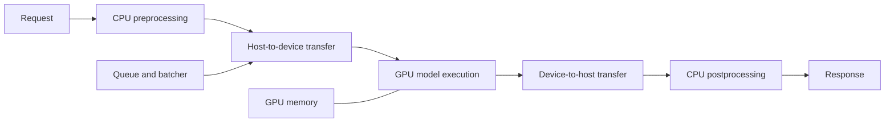
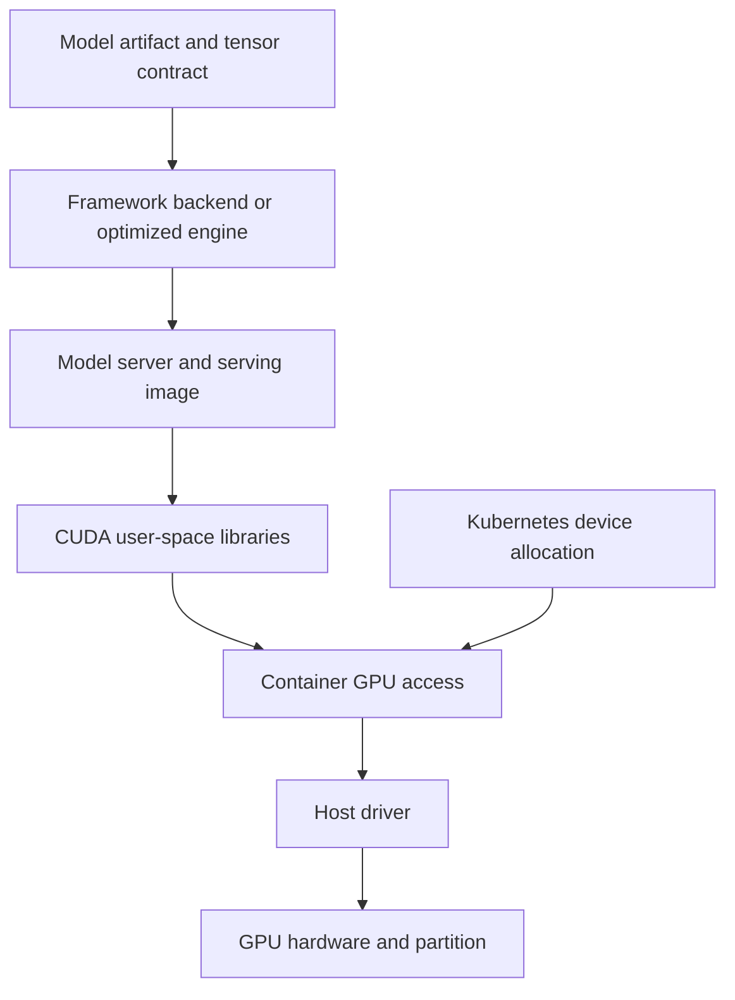
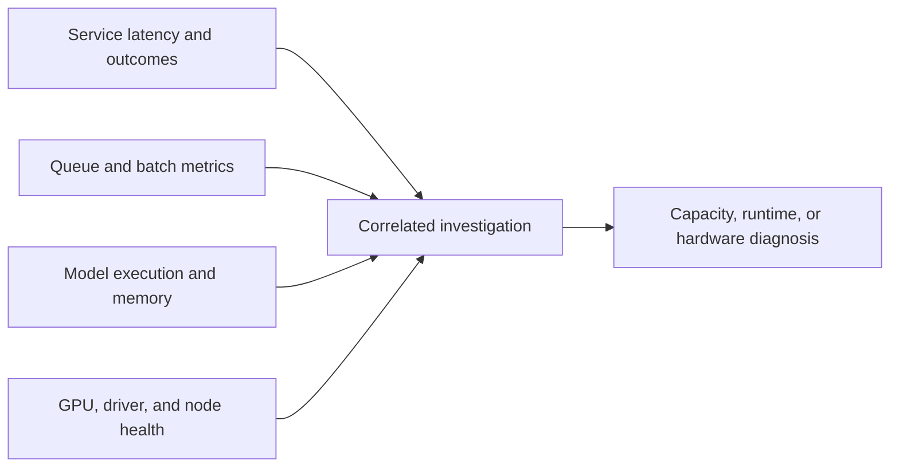

## A GPU Is Useful Only When the Workload Can Use It

<!-- section-summary: GPU inference can improve parallel model execution, but transfer, batching, memory, and idle capacity determine the real benefit. -->

A graphics processing unit contains many execution units and high-bandwidth memory designed for parallel numerical work. Deep-learning layers often map well to this hardware, so a GPU can process larger models or more operations per second than a general-purpose CPU. Some endpoints are still cheaper or faster on CPUs because model size, batch opportunity, data movement, and traffic shape determine the result.

An inference request still pays for preprocessing, data transfer to the device, scheduling, kernel launches, model execution, data transfer back, and postprocessing. A tiny model, low request rate, or CPU-heavy preprocessor may leave the accelerator idle. A GPU can reduce execution time while increasing cost per accepted request because the service holds expensive capacity between calls.



The decision to use a GPU should follow measurement. Compare CPU and accelerator candidates on the real model, input distribution, precision, concurrency, latency objective, throughput, and full hourly cost. Keep the quality gate identical unless a deliberate optimization changes numeric behaviour.

## Characterize the Workload Before Choosing Hardware

<!-- section-summary: Model operations, memory footprint, input shape, latency, throughput, and traffic determine accelerator fit. -->

Begin with five questions.

1. **Does the model fit?** Parameters, runtime workspace, intermediate activations, framework overhead, and concurrent batches must fit device memory with headroom.
2. **Is execution parallel enough?** Dense matrix operations and convolutions usually benefit more than small branching logic or heavy Python preprocessing.
3. **Can work be batched?** Higher batch sizes often improve utilization, but interactive latency limits waiting.
4. **Is traffic sufficient?** An underused dedicated accelerator may be more expensive than CPU capacity or a shared/managed route.
5. **What is the product constraint?** Online services optimize tail latency within cost; batch jobs often optimize throughput and completion time.

Profile shapes separately. Image resolution, sequence length, candidate count, and output length can change memory and execution sharply. A single average payload hides out-of-memory risk and slow tails.

Use an initial benchmark matrix across hardware class, precision, batch size, concurrency, model instance count, and input class. Record p50/p95/p99 latency, throughput, memory, utilization, power where available, failures, and cost per accepted result. The output is an operating envelope, not one winning benchmark number.

## Understand the Compatibility Stack

<!-- section-summary: Accelerator serving depends on a compatible chain from hardware and driver through the container runtime, framework, model server, and artifact. -->

For NVIDIA-based serving, the physical GPU and host driver form the base. CUDA provides the programming and runtime ecosystem. Container access commonly uses NVIDIA Container Toolkit. Kubernetes discovers and allocates devices through device plugins or operators. The serving image contains compatible framework libraries and a model server or application runtime. The artifact may be a framework checkpoint, ONNX graph, or optimized engine.



Each layer has a version and support relationship. A container can include user-space CUDA libraries, while the host driver remains on the node. A framework build may require particular runtime capabilities. An optimized engine can be less portable across hardware or software versions than an exchange-format model.

Capture the exact hardware SKU or partition, driver, serving image digest, CUDA and framework versions, model server and backend, model artifact digest, precision, and compiler settings. Validate the current vendor support matrix before upgrades; do not infer compatibility from one successful notebook run.

NVIDIA GPU Operator can manage drivers, container toolkit, device plugins, monitoring components, and Multi-Instance GPU support in Kubernetes. It standardizes installation while compatibility testing remains necessary. The operator version and node policy are part of the platform release.

## Model Memory and Compute Are Different Limits

<!-- section-summary: A GPU service can be limited by memory capacity, memory bandwidth, compute, transfers, or CPU-side work. -->

**Memory capacity** determines whether the model, runtime state, and active requests fit. **Memory bandwidth** determines how quickly data can move within device memory. **Compute utilization** indicates execution activity, but high utilization is not automatically healthy and low utilization does not reveal why the device waits.

For generative models, parameters and key-value cache can dominate memory. For vision or ranking models, activations and batch size may be the main variable. Multiple model instances duplicate some memory. Compilers may reserve workspace. Always measure peak memory under the intended concurrency, not only after model load.

An out-of-memory failure needs a declared response: reject the oversize input, route to another deployment, reduce batch or concurrency, or restart a damaged worker. Blind retry on the same worker and shape is unlikely to help.

If the GPU is idle, inspect CPU preprocessing, data transfer, model-server queues, input pipeline, synchronization, and request rate. If it is saturated but throughput is poor, inspect memory bottlenecks, inefficient kernels, shape changes, precision, and excessive transfers.

## Batching and Concurrency Create the Operating Point

<!-- section-summary: Batching improves device efficiency by grouping compatible work, while concurrency supplies enough work and can also create queues. -->

A batch lets one model execution process several inputs. The fixed overhead of scheduling and transfer is shared, and large tensor operations may use the device more efficiently. Larger is not always better: memory use rises, individual requests wait for batch formation, and execution time can increase.

**Dynamic batching** groups stateless requests that arrive near one another. Configure a maximum batch size and, where useful, a small queue delay. NVIDIA Triton documents dynamic batching and provides Performance Analyzer and Model Analyzer to test batch, concurrency, instance count, latency, and memory tradeoffs.

For stateful sequences, the server must preserve correlation and ordering. For text generation, **continuous batching** can fill freed batch slots as individual sequences finish, avoiding the slowest sequence holding an entire fixed batch.

Tune concurrency and batching together. Too little concurrency starves the device. Too much creates long queues and memory pressure. Choose the highest throughput configuration that still meets latency, error, and memory gates with headroom.

A compact model-server policy might state:

```yaml
model: image-embedder-v8
hardware: gpu-l4
precision: fp16
max_batch_size: 16
dynamic_batching:
  max_queue_delay_microseconds: 800
instances_per_device: 1
limits:
  max_inflight_per_replica: 64
  max_input_pixels: 16000000
  minimum_free_memory_mib: 2048
```

These values must come from the workload benchmark. The configuration is evidence of a chosen operating point, not a universal recipe.

## Kubernetes Schedules Declared Device Resources

<!-- section-summary: Kubernetes allocates devices advertised by plugins; node placement, readiness, and rollout must account for accelerator scarcity and startup time. -->

Kubernetes device plugins advertise accelerator resources such as `nvidia.com/gpu`. A pod requests a device in its resource limits, and the scheduler places it on a node with available capacity. Node labels, taints, tolerations, and affinity can keep serving workloads on approved hardware pools.

GPU requests are normally discrete and not overcommitted by the scheduler. A pod waiting in `Pending` may reflect unavailable devices, incompatible selectors, quota, or a node problem. The model service should report ready only after the device is visible, the model is loaded, warm-up passes, and dependencies are usable.

Accelerator workers can take minutes to schedule, pull images, load large artifacts, compile engines, and warm caches. Autoscaling therefore needs a warm-capacity strategy for interactive traffic. A queue signal cannot protect a short burst if new GPU nodes start after the latency window has passed.

## Choose Sharing and Isolation Deliberately

<!-- section-summary: Whole devices, hardware partitions, and time sharing offer different performance isolation and operational complexity. -->

A whole GPU gives one workload the clearest isolation. **Multi-Instance GPU (MIG)** can partition supported NVIDIA GPUs into hardware-isolated instances with defined compute and memory resources. **Time slicing** lets workloads share device time with weaker isolation and less predictable latency.

Use whole devices for demanding or latency-sensitive workloads when utilization justifies them. Use MIG when the hardware, profiles, software stack, and model memory fit are supported and stronger partitioning is valuable. Use time sharing for tolerant development or smaller workloads only after testing contention.

Sharing does not solve every low-utilization problem. Consolidating several models behind one serving runtime, routing background work to spare capacity, or using a managed scale-to-zero service may be simpler. Security, noisy-neighbour behaviour, failure blast radius, and upgrade coordination belong in the decision.

The three choices divide resources in different ways. A whole-device allocation gives the workload all compute engines and memory. A hardware partition gives it a defined slice with stronger boundaries, but only in supported profiles; a model that needs slightly more memory cannot borrow unused memory from the neighbouring partition. Time sharing changes who runs at a moment, not how memory is isolated, so several workloads may fit while their latency changes under contention.

Imagine an embedding service that uses only a quarter of an accelerator at steady load. Time sharing looks efficient until a second tenant runs a long batch and the embedding endpoint’s p99 doubles. A hardware partition can make latency more stable if the model fits the partition, but may strand capacity when traffic falls. A whole GPU avoids the neighbour but may make each prediction too expensive. The correct decision comes from the service objective, contention tests, and failure isolation—not from utilization alone.

Sharing also changes operations. The scheduler must request the correct resource name or partition profile. Dashboards must attribute memory, utilization, throttling, and errors to the allocation a workload actually received. Capacity tests must run with realistic neighbours. Incident responders need to know whether restarting one workload resets only its process, its partition, or the entire physical device. Without that ownership model, improved average utilization can create a larger and harder-to-diagnose blast radius.

## Observe the Complete Accelerator Path

<!-- section-summary: GPU telemetry must connect device conditions to model-server queues, request outcomes, and release versions. -->

Collect service throughput, latency, errors, queue time, batch size, inflight requests, model execution time, and cold starts. Add GPU memory used, compute and memory utilization, power or thermal signals where relevant, hardware errors, and device health. NVIDIA DCGM Exporter is a common source of device metrics in Kubernetes.



Correlate telemetry by model version, image digest, hardware class, and node pool. Avoid device UUIDs as broad metric labels if they create excessive cardinality; retain detailed node evidence in traces or logs. An endpoint can have healthy GPU utilization while users see poor latency because preprocessing or queueing dominates.

## Release With Performance and Compatibility Gates

<!-- section-summary: A GPU release must preserve model quality and prove hardware, software, capacity, and recovery together. -->

Before rollout, verify artifact and image digests, supported hardware and driver combinations, tensor shapes, precision, warm-up, memory headroom, batching, concurrency, tail latency, throughput, and cost. Test node drain, worker restart, out-of-memory handling, dependency failure, and fallback. Compare predictions against the reference runtime within task-appropriate tolerances.

Run the gates in layers. A **compatibility gate** proves that the expected device and execution provider are available and the artifact loads. A **correctness gate** compares predictions with the reviewed baseline, including sensitive slices. A **capacity gate** proves latency, throughput, memory, and error behaviour at the chosen operating point. A **recovery gate** drains or kills a worker and verifies that traffic moves without serving from an unready replacement. Passing only the benchmark leaves the most common rollout failures untested.

Cold-start evidence deserves its own budget. Image pull, artifact download, engine compilation, model load, memory allocation, and warm-up are different stages. Prebuilding an engine can shorten startup but bind it more tightly to hardware and runtime. Caching an artifact can help repeated starts but requires integrity checks and eviction policy. A warm pool costs money but may be the only way to meet an interactive burst objective. The release record should state which of these assumptions its load test used.

Canary by model and infrastructure version. Roll back the serving route or image when quality, latency, memory, or device errors breach the gate. Keep the previous compatible artifact and runtime available; an engine compiled for one environment may not be a portable rollback artifact.

GPU inference succeeds when workload fit, the compatibility stack, memory, batching, scheduling, sharing, and telemetry are treated as one system. The accelerator is only one layer. The production capability is the measured and reproducible path that turns requests into accepted predictions on that accelerator.

## References

- [NVIDIA Triton Inference Server](https://docs.nvidia.com/deeplearning/triton-inference-server/user-guide/docs/index.html)
- [NVIDIA Triton dynamic batching](https://docs.nvidia.com/deeplearning/triton-inference-server/user-guide/docs/user_guide/batcher.html)
- [NVIDIA Triton Model Analyzer](https://docs.nvidia.com/deeplearning/triton-inference-server/user-guide/docs/user_guide/model_analyzer.html)
- [NVIDIA GPU Operator](https://docs.nvidia.com/datacenter/cloud-native/gpu-operator/latest/overview.html)
- [NVIDIA MIG User Guide](https://docs.nvidia.com/datacenter/tesla/mig-user-guide/latest/)
- [NVIDIA GPU sharing in Kubernetes](https://docs.nvidia.com/datacenter/cloud-native/gpu-operator/latest/gpu-sharing.html)
- [Kubernetes scheduling GPUs](https://kubernetes.io/docs/tasks/manage-gpus/scheduling-gpus/)
- [Kubernetes device plugins](https://kubernetes.io/docs/concepts/extend-kubernetes/compute-storage-net/device-plugins/)
- [NVIDIA DCGM Exporter](https://docs.nvidia.com/datacenter/dcgm/latest/gpu-telemetry/dcgm-exporter.html)
