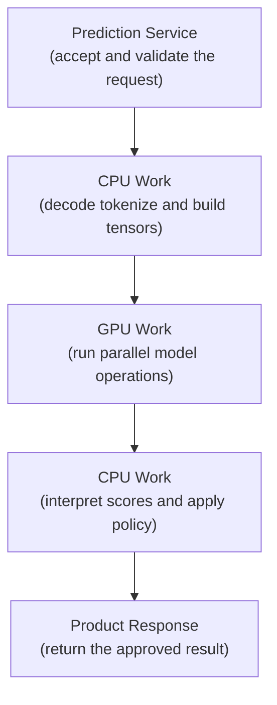
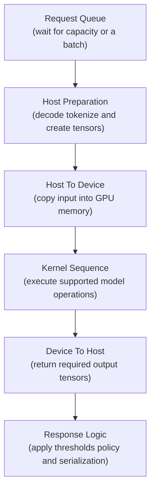
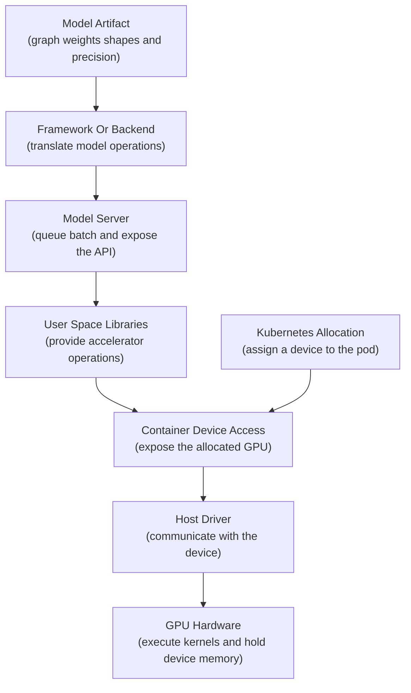
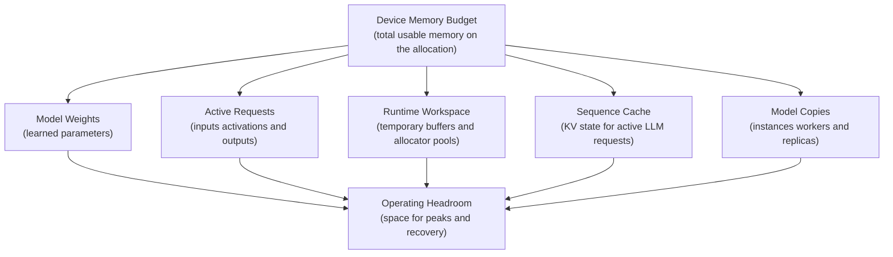
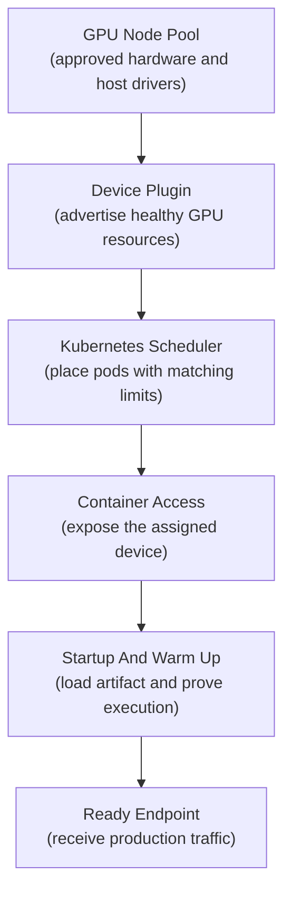
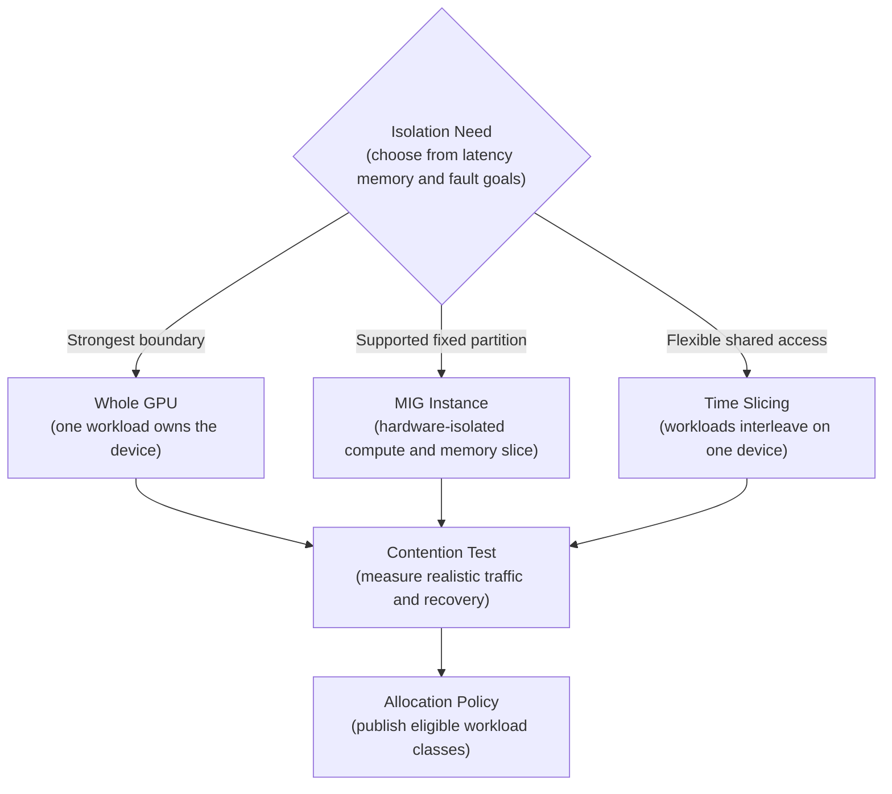
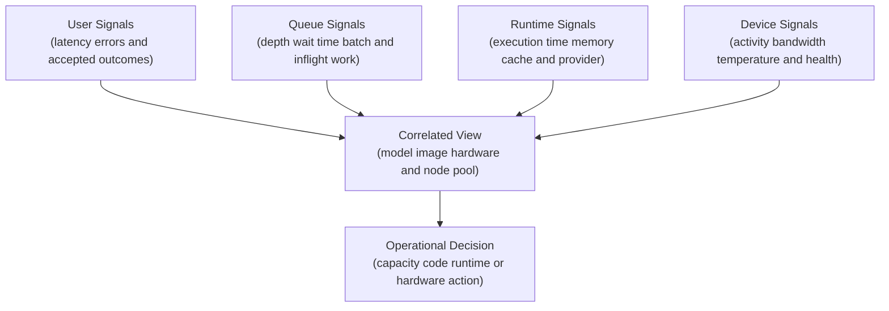
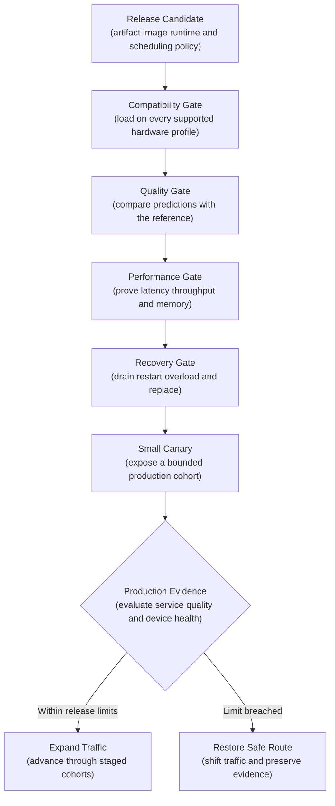

## Table of Contents

1. [What GPU Inference Means](#what-gpu-inference-means)
2. [Decide Whether The Workload Benefits From A GPU](#decide-whether-the-workload-benefits-from-a-gpu)
3. [Follow A Request Through The Complete System](#follow-a-request-through-the-complete-system)
4. [Keep The Driver, CUDA, Runtime, Framework, And Model Compatible](#keep-the-driver-cuda-runtime-framework-and-model-compatible)
5. [Understand What Uses GPU Memory](#understand-what-uses-gpu-memory)
6. [Distinguish GPU Memory, Compute, And Bandwidth Limits](#distinguish-gpu-memory-compute-and-bandwidth-limits)
7. [Re-Evaluate Model Quality After Lowering Precision](#re-evaluate-model-quality-after-lowering-precision)
8. [Tune Batch Size, Concurrency, And Model Replicas Together](#tune-batch-size-concurrency-and-model-replicas-together)
9. [Schedule GPU Workloads On Kubernetes](#schedule-gpu-workloads-on-kubernetes)
10. [Choose Between Whole GPUs, MIG, And Time Slicing](#choose-between-whole-gpus-mig-and-time-slicing)
11. [Monitor The Service And GPU Together](#monitor-the-service-and-gpu-together)
12. [Match Performance Symptoms To The Likely GPU Limit](#match-performance-symptoms-to-the-likely-gpu-limit)
13. [Plan GPU Capacity, Cost, And Startup Time](#plan-gpu-capacity-cost-and-startup-time)
14. [Release And Recover The Exact GPU Serving Stack](#release-and-recover-the-exact-gpu-serving-stack)
15. [The Main Idea](#the-main-idea)
16. [References](#references)

## What GPU Inference Means
<!-- section-summary: GPU inference runs the numerical part of prediction on a processor built to perform many similar calculations in parallel. -->

At a high level, **GPU inference** means using a graphics processing unit to run the numerical operations inside a trained model. The name comes from graphics, yet the same hardware is well suited to the matrix multiplications, convolutions, and attention operations used by many neural networks.

A central processing unit, or **CPU**, has a smaller number of powerful cores. It handles operating-system work, application logic, branching code, parsing, and many small tasks very well. A GPU has many more execution units and very fast local memory. It can apply the same mathematical operation across a large tensor at the same time. A **tensor** is simply a multidimensional array: a batch of images, a sequence of token vectors, or a block of model weights.

Consider an image model that multiplies millions of pixel-derived values by learned weights. A CPU can perform those operations, but it has fewer lanes available for the repeated arithmetic. A GPU can divide much of the work across many execution units. This parallelism often improves throughput and can reduce latency for a sufficiently large workload.

A complete prediction service contains much more than GPU execution. The web server accepts the request. CPU code may decode an image, tokenize text, validate a schema, or construct tensors. The GPU handles the supported numerical graph. CPU code then turns the output tensor into a response. GPU inference is therefore a pipeline shared by the CPU, memory buses, runtime libraries, model server, and accelerator.


```mermaid
flowchart TD
    A["Prediction Service<br/>(accept and validate the request)"] --> B["CPU Work<br/>(decode tokenize and build tensors)"]
    B --> C["GPU Work<br/>(run parallel model operations)"]
    C --> D["CPU Work<br/>(interpret scores and apply policy)"]
    D --> E["Product Response<br/>(return the approved result)"]

    class A request; class B,D cpu; class C gpu; class E result
```

This division explains a common surprise: adding a GPU can produce little improvement. A model may spend 2 milliseconds on GPU execution while image decoding and resizing consume 18 milliseconds on the CPU. Accelerating the 2-millisecond part leaves most of the request untouched. Production design needs the full request timeline.

## Decide Whether The Workload Benefits From A GPU
<!-- section-summary: Model shape, request volume, batch opportunity, latency goals, and cost determine whether accelerator serving is worthwhile. -->

GPUs provide their strongest advantage on work with substantial parallel arithmetic. Large transformers, convolutional neural networks, embedding models, and deep recommendation models often fit that description. A small decision tree, linear model, or compact tabular neural network may finish quickly on a CPU and leave a GPU mostly idle.

Four properties reveal workload fit.

1. **The amount and shape of computation.** Large matrix operations give the accelerator enough work to occupy its execution units. Small operations and branching control flow provide less parallel work.
2. **The amount of traffic.** A GPU reserved for three predictions per minute spends most of its time waiting. A CPU deployment or managed endpoint may meet the same objective at a lower cost.
3. **The opportunity to batch requests.** A batch combines several compatible inputs into one model execution. The larger tensor can use more of the GPU, although each request may wait briefly for its batch.
4. **The product objective.** An interactive endpoint usually protects tail latency. A nightly embedding job can tolerate longer individual waits and prioritize total completion time.

A tiny fraud model illustrates the decision. Suppose its CPU latency is 4 milliseconds at one request and its GPU execution takes 1 millisecond. The service also spends 3 milliseconds preparing tensors and transferring them. Both deployments now deliver roughly the same end-to-end latency. At modest traffic, the CPU is the practical choice. The same GPU may be valuable for a transformer that takes 250 milliseconds on CPU and 20 milliseconds through an optimized GPU path.

Input shape matters as much as the model name. A text classifier processing 32 tokens has a different cost from the same model processing 2,000 tokens. An image service sees similar variation between thumbnails and high-resolution images. Benchmark representative shape classes and the upper bounds accepted by the API. Average payloads hide the requests most likely to exhaust memory or breach p99 latency.

The decision record should compare real candidates under the same conditions: model artifact, input sample, numerical quality gate, concurrency, and service-level objective. Measure p50, p95, and p99 latency, accepted requests per second, errors, memory headroom, and cost per accepted result. User latency, reliability, and cost complete the picture left by a GPU utilization percentage.

## Follow A Request Through The Complete System
<!-- section-summary: End-to-end latency includes CPU preparation, queueing, transfers, GPU kernels, synchronization, and response processing. -->

Measure performance across the complete request. A GPU benchmark that starts after the tensor reaches device memory leaves out work that the production endpoint must still perform.

The request usually follows these stages:

1. **Admission and queueing.** The server validates the request and may hold it for an available worker or batch.
2. **Preprocessing on the host.** The **host** is the CPU side of the system. It may decode an image, normalize values, tokenize text, or retrieve features.
3. **Host-to-device transfer.** Input tensors move from main system memory into GPU memory. This movement has a real cost, especially for large inputs or many small transfers.
4. **Kernel execution.** A **GPU kernel** is a compiled function launched across many GPU threads. A model runtime launches a sequence of kernels for operations such as matrix multiplication, normalization, activation functions, and sampling.
5. **Device-to-host transfer.** Output tensors may return to CPU memory. Some pipelines keep intermediate tensors on the GPU to avoid repeated transfers.
6. **Postprocessing and response.** CPU code may select labels, apply thresholds, enforce business rules, or serialize the response.


```mermaid
flowchart TD
    A["Request Queue<br/>(wait for capacity or a batch)"] --> B["Host Preparation<br/>(decode tokenize and create tensors)"]
    B --> C["Host To Device<br/>(copy input into GPU memory)"]
    C --> D["Kernel Sequence<br/>(execute supported model operations)"]
    D --> E["Device To Host<br/>(return required output tensors)"]
    E --> F["Response Logic<br/>(apply thresholds policy and serialization)"]

    class A queue; class B,E host; class C,D device; class F result
```

Suppose p99 latency rises from 80 to 220 milliseconds after clients start uploading larger images. GPU execution remains at 30 milliseconds. Tracing shows image decoding at 100 milliseconds and input transfer at 45 milliseconds. More GPU instances would add memory pressure without repairing either bottleneck. An input-size limit, more efficient decoder, pinned transfer buffers, or preprocessing workers may address the actual delay.

Synchronization can also hide time. CPU code sometimes waits for a GPU operation to finish before launching the next stage. Repeated small operations create repeated launch overhead and waiting. Profilers from the framework and accelerator vendor help separate CPU activity, transfers, kernels, and idle gaps. The first investigation should establish where time is spent before changing batch size or hardware.

## Keep The Driver, CUDA, Runtime, Framework, And Model Compatible
<!-- section-summary: Successful GPU execution depends on an aligned chain from physical hardware through drivers, container access, runtime libraries, serving code, and the model artifact. -->

A GPU container carries the application and user-space portion of the platform. The physical device and its host driver live on the node. Container integration exposes the requested device and required driver libraries. User-space libraries inside the serving image connect the model framework to that driver.

The stack contains several roles:

- The **driver** lets the operating system and user-space software communicate with the accelerator.
- **Container GPU access** makes selected devices and driver capabilities visible inside the container. NVIDIA Container Toolkit is a common implementation for NVIDIA-based clusters.
- A **user-space runtime** supplies accelerator libraries used by the framework. CUDA and cuDNN are examples in the NVIDIA stack.
- An **execution provider** or **backend** translates framework operations into work for a particular hardware path. ONNX Runtime calls these plug-ins execution providers. Its CUDA and TensorRT providers can execute supported graph regions on NVIDIA GPUs.
- The **model server** accepts requests, batches work, manages model instances, and reports serving metrics. Triton and KServe-managed runtimes are common choices. vLLM is designed for large-language-model serving and manages LLM-specific scheduling and key-value cache concerns.
- The **artifact** contains the model graph, weights, tensor contract, and sometimes a hardware-optimized engine.


```mermaid
flowchart TD
    A["Model Artifact<br/>(graph weights shapes and precision)"] --> B["Framework Or Backend<br/>(translate model operations)"]
    B --> C["Model Server<br/>(queue batch and expose the API)"]
    C --> D["User Space Libraries<br/>(provide accelerator operations)"]
    D --> E["Container Device Access<br/>(expose the allocated GPU)"]
    E --> F["Host Driver<br/>(communicate with the device)"]
    F --> G["GPU Hardware<br/>(execute kernels and hold device memory)"]
    H["Kubernetes Allocation<br/>(assign a device to the pod)"] --> E

    class A artifact; class B,C,D software; class E,H access; class F,G hardware
```

Every layer has a support relationship. An ONNX Runtime GPU package expects compatible CUDA and cuDNN major versions. A TensorRT engine may depend on the GPU compute capability and the software used to build it. An unsupported operation can force part of an ONNX graph onto a fallback provider, which introduces CPU execution and extra transfers. The endpoint can still return correct predictions while performance changes sharply.

A small startup assertion can catch a missing accelerator path before the pod receives traffic:

```python
import onnxruntime as ort

required = "TensorrtExecutionProvider"
available = ort.get_available_providers()

if required not in available:
    raise RuntimeError(f"{required} unavailable; found {available}")

session = ort.InferenceSession(
    "model.onnx",
    providers=["TensorrtExecutionProvider", "CUDAExecutionProvider"],
)
```

The CUDA provider supplies a documented fallback for graph regions unsupported by TensorRT. Finding the provider proves that the library is available. Provider assignment or profiling output supplies the separate evidence that important operations actually use it.

Record the GPU SKU or partition profile, host driver, container image digest, CUDA and cuDNN families, framework or ONNX Runtime build, execution-provider order, server version, artifact digest, precision, and compiler settings. That record turns “works on a GPU node” into a reproducible compatibility claim.

## Understand What Uses GPU Memory
<!-- section-summary: Device memory holds model weights plus request-dependent state, runtime workspace, caches, and sometimes several copies of the model. -->

GPU memory, often called **device memory** or **VRAM**, is the accelerator's local working area. A model needs more than enough memory for its weight file. Production capacity must cover every category present at peak load.

**Weights** are the learned parameters. Their memory depends on parameter count and representation. One billion parameters use roughly 4 GB at FP32 or 2 GB at FP16 before runtime overhead. Formats and packing can change the exact figure.

**Activations** are intermediate tensors produced as inputs pass through model layers. Their size depends on batch size, input shape, model architecture, and concurrency. Vision activations grow with image dimensions. Transformer activations grow with token counts.

**Workspace** is temporary memory reserved by frameworks, compilers, or kernels. An optimized backend may choose a faster algorithm that needs a larger workspace. Memory allocators also retain pools to reduce repeated allocation overhead.

**KV cache** is important for autoregressive language models. During generation, attention layers retain key and value tensors from previous tokens so the model can reuse them at the next decoding step. More concurrent sequences and longer contexts consume more cache. A service can load the model successfully and later exhaust memory as requests accumulate.

**Model instances and worker processes** can duplicate state. Four application workers that each load the model may create four copies of the weights. The CPU-serving habit of increasing workers can therefore exhaust a GPU immediately.


```mermaid
flowchart TD
    A["Device Memory Budget<br/>(total usable memory on the allocation)"] --> B["Model Weights<br/>(learned parameters)"]
    A --> C["Active Requests<br/>(inputs activations and outputs)"]
    A --> D["Runtime Workspace<br/>(temporary buffers and allocator pools)"]
    A --> E["Sequence Cache<br/>(KV state for active LLM requests)"]
    A --> F["Model Copies<br/>(instances workers and replicas)"]
    B --> G["Operating Headroom<br/>(space for peaks and recovery)"]
    C --> G
    D --> G
    E --> G
    F --> G

    class A budget; class B,C,D,E,F component; class G headroom
```

An **out-of-memory error**, usually shortened to **OOM**, occurs after an allocation request exceeds available memory. The process may fail the current request, lose its runtime context, or crash. Repeating the same oversized request on the same configuration rarely changes the result.

The service needs bounded input shapes and a declared response for each failure class. It can reject an input that violates the public contract. A valid but unusually large request can go to a deployment with more memory or to an asynchronous batch route. Capacity pressure from ordinary traffic calls for a smaller operating point or a larger allocation.

The error record should preserve the input shape and number of active requests at failure time. Batch size and free device memory explain the immediate pressure. Model version connects that failure to the artifact and runtime configuration under investigation.

Measure peak memory under the intended batch size, shape distribution, concurrency, and model-instance count. Include warm-up, because compilers and libraries can allocate buffers during the first executions. Leave headroom for transient peaks and operational recovery; a configuration that fits within a few megabytes is too fragile for production.

## Distinguish GPU Memory, Compute, And Bandwidth Limits
<!-- section-summary: A GPU can be limited by available memory, arithmetic throughput, movement within device memory, transfers across the host boundary, or CPU-side preparation. -->

GPU performance has several possible ceilings. The service may run out of space, arithmetic capacity, memory-transfer capacity, or prepared work from the CPU. These limits can produce similar symptoms at the API, so the investigation has to identify the exhausted resource before changing the deployment.

### Identify The Main GPU Resource Limit

**Memory capacity** answers whether the active workload fits at all. An OOM or falling free-memory margin points here.

**Compute throughput** describes how quickly GPU execution units perform arithmetic. Large matrix operations can drive compute activity close to the device's practical ceiling.

**Memory bandwidth** describes how quickly data moves between GPU memory and its execution units. Some operations spend more time moving values than calculating with them. High memory traffic can limit throughput even with arithmetic capacity remaining.

**Host-device bandwidth** covers transfers between system memory and GPU memory, commonly over PCIe. Many small transfers or large uncompressed inputs can make this boundary expensive.

**CPU supply** covers preprocessing, request parsing, tokenization, and scheduling. The GPU waits if the CPU cannot prepare work fast enough.

Utilization metrics need context. Low GPU activity has several possible explanations. Traffic may be too light to supply work, preprocessing may occupy the CPU, or repeated synchronization may leave gaps between kernels. Profiling can also reveal important model operations running through a CPU fallback.

High activity also needs interpretation. It can accompany healthy throughput, a growing request queue, or inefficient kernels consuming device time. Pair activity with accepted throughput and the request timeline. Queue depth shows whether demand is waiting, while latency shows the effect on users.

For example, an embedding endpoint shows 25% GPU activity and high p99 latency. The queue is empty, while CPU tokenization consumes most request time. Increasing batch delay would add waiting to an already under-supplied device. Parallel tokenization, cached token IDs, or a faster tokenizer deserves testing first.

## Re-Evaluate Model Quality After Lowering Precision
<!-- section-summary: Lower-precision execution can reduce memory and improve speed, but numerical behaviour and task quality require new evidence. -->

**Precision** describes how numbers are represented during inference. FP32 uses 32-bit floating-point values. FP16 and BF16 use 16 bits with different range and precision properties. Integer and smaller floating-point formats can compress values further on supported hardware and runtimes.

Smaller representations can reduce weight and activation memory, lower memory traffic, and unlock faster accelerator operations. The gain depends on the hardware and the operations selected by the runtime. A label such as “FP16 enabled” leaves actual layer precision and endpoint latency to be measured.

Numerical behaviour can change. FP16 has a narrower numeric range than BF16 or FP32, so large intermediate values can overflow. Quantization maps continuous values into a smaller set of representable values. Rounding and clamping can alter scores, rankings, probabilities, and generated text.

Treat every precision build as a new model candidate. Compare it with the reviewed reference across four gates:

1. **Numerical gate.** Check representative tensor outputs, NaN/Inf counts, score deltas, and rank changes.
2. **Task-quality gate.** Recompute accuracy, recall, calibration, ranking quality, or generation evaluations, including sensitive segments.
3. **Systems gate.** Measure latency, throughput, peak memory, startup, and failure rate on the target GPU.
4. **Product-policy gate.** Re-evaluate thresholds and downstream actions if score distributions moved.

Suppose an INT8 classifier preserves overall accuracy but loses recall on faint images. The smaller engine and higher throughput cannot compensate for that product failure. Representative calibration data, quantization-aware training, mixed precision, or leaving sensitive layers at higher precision are common recovery paths. NVIDIA TensorRT's current guidance likewise treats reduced precision as an accuracy-performance trade-off and recommends output validation, representative calibration, and per-layer precision control for sensitive operations.

## Tune Batch Size, Concurrency, And Model Replicas Together
<!-- section-summary: Batch size, request concurrency, queue delay, and model-instance count form one operating point with shared latency and memory consequences. -->

GPU serving has several separate ways to put more work in flight. A batch changes how many inputs share one execution, concurrency changes how many requests occupy the service, queue delay changes how long work can wait for grouping, and model instances change how many independent executors the runtime owns. Tuning one control changes the pressure seen by the others.

### Understand What Each Performance Control Changes

**Batch size** is the number of compatible inputs processed by one model execution. A larger batch can turn several small operations into a more efficient tensor operation.

**Concurrency** is the number of requests in progress at the service. Concurrency supplies work to the queue and lets transfer or CPU work overlap with GPU execution. Excess concurrency grows queues and memory demand.

**Queue delay** is the short time a dynamic batcher may hold a request while looking for compatible neighbours. More delay can create fuller batches, with a direct cost to request latency.

**Model-instance count** is the number of independently executable copies managed by the serving runtime. More instances can process requests simultaneously, yet each instance may allocate weights, workspace, and execution state.

| Control | Potential benefit | Main pressure | Evidence to inspect |
|---|---|---|---|
| Larger batch | More throughput per execution | Queue time and activation memory | Actual batch-size distribution and p99 latency |
| More concurrency | Keeps the pipeline supplied | Queue depth and active-request memory | Inflight requests, queue time, and OOMs |
| Longer batch delay | Creates fuller batches at modest traffic | Added waiting for every held request | Throughput gained per added millisecond |
| More model instances | Overlaps independent executions | Duplicate memory and contention | Peak memory, execution overlap, and throughput |

Triton's **dynamic batcher** combines requests for stateless models up to the configured maximum. Its queue delay should remain inside the endpoint's latency budget. A focused model configuration looks like this:

```protobuf
max_batch_size: 16

dynamic_batching {
  max_queue_delay_microseconds: 800
}

instance_group [
  {
    count: 1
    kind: KIND_GPU
  }
]
```

The numbers are experiment inputs. Use Triton Performance Analyzer to generate controlled request rates or concurrency and observe stable latency and throughput. Model Analyzer can explore batch and instance configurations while measuring GPU memory and utilization. Start with one model instance, enable dynamic batching, and change one dimension per experiment.

### Choose A Safe Combination From The Benchmark

An online image endpoint might gain 35% throughput from an 800-microsecond delay while remaining below its p99 target. A low-traffic endpoint might gain no useful batch at all and simply add 800 microseconds. A background embedding job can accept a much longer wait and prioritize device saturation.

LLM serving adds sequence length and KV cache to the operating point. Continuous batching allows the scheduler to fill a freed slot as an individual sequence finishes, even while longer generations continue. vLLM is a common runtime for this pattern. Capacity tests should reproduce prompt lengths, output lengths, cancellation, and concurrent sequences seen in production.

## Schedule GPU Workloads On Kubernetes
<!-- section-summary: Kubernetes allocates GPU resources advertised by device plugins, while node pools, placement rules, probes, and warm capacity shape the service around that allocation. -->

Kubernetes needs a vendor integration before it can schedule accelerator work. A **device plugin** discovers hardware on each node, reports healthy devices to the kubelet, and advertises an extended resource such as `nvidia.com/gpu`. A pod that requests this resource is scheduled onto a node with an available device.

Current Kubernetes guidance specifies GPU resources in container `limits`. Kubernetes uses that limit as the request if a separate request is absent; if both are present, the two GPU values must match.

```yaml
apiVersion: apps/v1
kind: Deployment
metadata:
  name: image-embedding
spec:
  replicas: 2
  template:
    spec:
      nodeSelector:
        accelerator.devpolaris.com/class: l4
      tolerations:
        - key: accelerator
          operator: Equal
          value: gpu
          effect: NoSchedule
      containers:
        - name: server
          image: registry.example/embedding-server@sha256:REPLACE_WITH_DIGEST
          resources:
            limits:
              nvidia.com/gpu: 1
          startupProbe:
            httpGet:
              path: /v2/health/ready
              port: 8000
            periodSeconds: 10
            failureThreshold: 60
          readinessProbe:
            httpGet:
              path: /v2/health/ready
              port: 8000
            periodSeconds: 5
```

The resource request reserves a GPU. The node selector places the workload on the approved hardware class. A taint can keep ordinary workloads away from expensive GPU nodes, and the toleration admits this service to that pool. In a managed cluster, provider-supported node labels and taints should replace the illustrative label shown above.

Readiness needs a stricter meaning for model serving. The process should first confirm that the allocated device is visible and the expected backend is active. It should verify the artifact digest, load the model, execute representative warm-up inputs, and confirm that output shapes are valid before accepting traffic.

A **startup probe** gives that initialization its own time budget. A **readiness probe** removes the pod from service after it loses the ability to produce valid predictions. A liveness restart cannot repair a cluster-wide driver mismatch, so liveness rules should avoid turning a shared platform failure into a restart loop.

NVIDIA GPU Operator can manage drivers, Container Toolkit, the device plugin, node labeling components, MIG management, and DCGM telemetry as an integrated cluster stack. Managed cloud services may own some of these layers. In either case, the platform team should state who controls the driver lifecycle, node image, device advertisement, and monitoring path.


```mermaid
flowchart TD
    A["GPU Node Pool<br/>(approved hardware and host drivers)"] --> B["Device Plugin<br/>(advertise healthy GPU resources)"]
    B --> C["Kubernetes Scheduler<br/>(place pods with matching limits)"]
    C --> D["Container Access<br/>(expose the assigned device)"]
    D --> E["Startup And Warm Up<br/>(load artifact and prove execution)"]
    E --> F["Ready Endpoint<br/>(receive production traffic)"]

    class A,B platform; class C,D schedule; class E startup; class F ready
```

Pending pods need structured diagnosis. First compare the pod's requested resource name with the resources advertised by eligible nodes. Confirm that an eligible node still reports an allocatable device. Then evaluate placement one rule at a time: the node selector narrows the pool, taints require matching tolerations, and namespace quota may block the request.

If those constraints agree, check device-plugin health and node readiness. The final infrastructure check is whether the node autoscaler can add the required hardware inside its pool limits. Adding replicas cannot create devices that the cluster is unable or forbidden to provision.

## Choose Between Whole GPUs, MIG, And Time Slicing
<!-- section-summary: Whole-device allocation, hardware partitions, and time sharing offer different levels of isolation, flexibility, and operational complexity. -->

A Kubernetes resource name can represent different allocation models. The team needs to know which physical resources each pod truly receives.

A **whole GPU** gives one workload exclusive access to the device. It provides the most predictable memory ownership and avoids contention from another tenant. This approach fits large models, latency-sensitive endpoints, and services whose utilization justifies the cost.

**Multi-Instance GPU**, or **MIG**, is an NVIDIA capability on supported GPUs that divides one physical device into hardware-isolated instances with defined compute and memory resources. Each profile has a fixed shape. A model that fits one profile can gain stronger isolation from neighbours. Unused memory in another partition is unavailable to it.

**Time slicing** allows several scheduled workloads to take turns on one physical GPU. NVIDIA's Kubernetes implementation advertises multiple replicas of the same resource and interleaves their work. These workloads share device memory and the physical fault domain. MIG supplies stronger memory and fault isolation through hardware partitions. Latency under time slicing can change as neighbours create work.

Imagine a small embedding service using 20% of a device at steady traffic. Time slicing adds a batch tenant to the same GPU. During the tenant's hourly job, embedding p99 latency doubles. A MIG profile may stabilize the endpoint if the model and traffic fit a partition. A whole GPU removes the neighbour but leaves more idle capacity. These results come from contention tests, memory fit, and service objectives.

Sharing changes observability too. The current NVIDIA time-slicing documentation warns that DCGM Exporter cannot associate metrics with individual containers under that device-plugin mode. A platform may see physical-device utilization without knowing which tenant caused it. That attribution limit belongs in the operational decision.


```mermaid
flowchart TD
    A{"Isolation Need<br/>(choose from latency memory and fault goals)"} -->|"Strongest boundary"| B["Whole GPU<br/>(one workload owns the device)"]
    A -->|"Supported fixed partition"| C["MIG Instance<br/>(hardware-isolated compute and memory slice)"]
    A -->|"Flexible shared access"| D["Time Slicing<br/>(workloads interleave on one device)"]
    B --> E["Contention Test<br/>(measure realistic traffic and recovery)"]
    C --> E
    D --> E
    E --> F["Allocation Policy<br/>(publish eligible workload classes)"]

    class A choice; class B,C,D option; class E evidence; class F policy
```

The allocation policy should name the workloads eligible for each mode and the supported partition profiles. It should set memory headroom and state which neighbours may share a physical device. Telemetry limitations and the recovery blast radius also belong in the policy. Development notebooks and tolerant batch jobs can accept weaker isolation than a customer-facing low-latency endpoint.

## Monitor The Service And GPU Together
<!-- section-summary: Useful GPU observability connects customer latency and outcomes with queue, runtime, memory, device, node, and release evidence. -->

GPU observability has two connected views. The service view explains what requests experienced, and the device view explains what the accelerator and node were doing at the same time. A credible diagnosis connects those views through model and release identity.

### Use Each Telemetry Layer For A Different Question

At the service layer, collect request rate, accepted and rejected requests, p50/p95/p99 latency, queue time, preprocessing time, transfer time where available, model execution time, postprocessing time, batch sizes, inflight requests, cold starts, cancellations, and fallback rate.

At the runtime layer, collect loaded model versions, instance count, provider or backend selection, allocation failures, OOMs, compilation time, cache occupancy for LLMs, and model-server errors.

At the device and node layer, collect used and free device memory, GPU activity, memory activity, PCIe traffic, power, temperature, throttling indicators, hardware errors, driver health, and node readiness. **NVIDIA Data Center GPU Manager**, or **DCGM**, provides management and telemetry capabilities for NVIDIA data-center accelerators. **DCGM Exporter** exposes selected DCGM fields in Prometheus format and can attach Kubernetes workload labels where the allocation mode supports attribution.


```mermaid
flowchart TD
    A["User Signals<br/>(latency errors and accepted outcomes)"] --> E["Correlated View<br/>(model image hardware and node pool)"]
    B["Queue Signals<br/>(depth wait time batch and inflight work)"] --> E
    C["Runtime Signals<br/>(execution time memory cache and provider)"] --> E
    D["Device Signals<br/>(activity bandwidth temperature and health)"] --> E
    E --> F["Operational Decision<br/>(capacity code runtime or hardware action)"]

    class A,B,C,D signal; class E correlate; class F decision
```

Add model version, image digest, hardware class, partition type, region, and node pool to the correlation path. Keep labels bounded. A GPU UUID on every high-volume application metric can create costly cardinality; detailed identities can remain in traces, logs, or inventory records.

Alert from service harm and resource exhaustion trends. Sustained p99 breach, rising queue time, repeated OOMs, falling memory headroom, hardware errors, and unhealthy-device counts are actionable. A low utilization alert by itself may only report quiet traffic. Cost review can use that signal, while paging should focus on customer impact or imminent failure.

## Match Performance Symptoms To The Likely GPU Limit
<!-- section-summary: The relationship among queue time, CPU time, GPU execution, memory, transfers, and errors points toward the responsible layer. -->

Start an investigation with the request timeline and a recent change record. Confirm the affected model version, serving image, hardware pool, traffic shape, and rollout cohort. Then compare the delay or error with resource evidence.

**Queue time rises while GPU execution remains stable.** Demand may exceed available instances, batch delay may be too large, or one neighbour may be consuming a shared device. Check request rate, inflight work, batch distribution, replica readiness, and device sharing.

**CPU preparation rises while GPU activity falls.** Tokenization, decoding, feature lookup, or serialization is starving the accelerator. Profile CPU stages and inspect input-size changes. Add bounded preprocessing capacity or improve that code path before buying more GPUs.

**GPU execution rises after an artifact change.** The new graph may use different shapes, lose an optimized kernel, fall back to a slower execution provider, or compile a different engine. Compare provider assignment, kernel profile, artifact metadata, precision, and input distribution against the previous release.

**Memory climbs with concurrency.** Activations, workspace, or KV cache may scale faster than the operating model assumed. Reproduce with the offending shape class. Enforce admission limits, lower concurrency, reduce batch size, add cache policy, or route large requests separately.

**OOMs appear immediately after increasing workers.** Each worker may have loaded another model copy. Inspect process count and per-process memory, then use a server-owned instance configuration or reduce workers. Four CPU-style workers can turn one 6 GB model into roughly 24 GB of weights before activations and workspace.

**GPU activity is high and throughput is poor.** Memory bandwidth, inefficient kernels, synchronization, thermal or power limits, or unsupported shapes may be consuming the device. A profiler and a matched benchmark on a healthy node can separate model behaviour from hardware health.

The repair should target the measured constraint. Adding batch size to a memory-bound service, adding replicas to a preprocessing-bound service, or restarting an incompatible image can amplify the incident.

## Plan GPU Capacity, Cost, And Startup Time
<!-- section-summary: GPU capacity planning combines the measured operating point, traffic forecast, failure reserve, startup time, and accepted cost per result. -->

Capacity starts from a configuration that already passed latency, quality, and memory gates. Record its sustainable throughput at the representative shape mix, then apply an operating margin for bursts, noisy measurements, node loss, and rollout overlap.

A simple estimate is:

\[
\text{required replicas} = \left\lceil \frac{\text{peak requests per second}}{\text{sustainable requests per second per replica} \times \text{target load fraction}} \right\rceil
\]

If one replica sustains 80 requests per second and the target load fraction is 0.65, plan around 52 requests per second of usable capacity per replica. A forecast of 240 requests per second needs at least five replicas before accounting for zone loss or rollout overlap. The target fraction comes from load tests that identify the point where p99 latency and queueing grow unstable.

Cost per accepted result includes accelerator hours, CPU and memory around the server, idle reserve, model storage and transfer, failed requests, observability, and platform overhead. A faster GPU can be cheaper per result if it completes enough useful work. A cheaper device can win at modest demand. Compare the whole service at the required reliability level.

Cold start has several separate stages. Infrastructure first provisions a node and pulls the serving image. The pod then downloads the artifact, compiles any required engine, loads the model, allocates memory, runs warm-up, and finally reports readiness. Measure each stage so the slowest component has an owner.

An optimized engine cache can reduce repeated compilation, but its compatibility and integrity need control. A local artifact cache shortens download time, with an eviction policy and digest verification. A warm replica or warm node pool costs more and may be necessary for interactive traffic.

Autoscaling signals also need to lead demand. CPU utilization often says little about a GPU inference queue. Request concurrency, queue depth, waiting requests, KV cache pressure, or a workload-specific metric can provide better evidence. KServe supports Kubernetes model-serving control planes and documents Prometheus or OpenTelemetry metrics with KEDA for LLM autoscaling. Scaling logic still has to account for the minutes required to add a node and load a model.

Scale-to-zero can suit sporadic batch or asynchronous work. A customer-facing endpoint with a two-second objective cannot wait several minutes for a GPU node and model load. Keep a minimum warm route, use a smaller fallback, or expose the cold-start behaviour as part of the product contract.

## Release And Recover The Exact GPU Serving Stack
<!-- section-summary: A production GPU release proves compatibility, prediction quality, performance, startup, staged exposure, and recovery as one versioned system. -->

A GPU release contains more than model weights. It includes the artifact, preprocessing contract, serving image, execution backend, precision, batch policy, model-instance count, supported hardware profiles, driver family, node image, and scheduling rules. Changing any of these can change correctness, latency, memory, or startup.

Use layered release gates:

1. **Artifact gate.** Verify the model digest, tensor names, shapes, data types, maximum input bounds, and output contract.
2. **Compatibility gate.** Prove device visibility, required provider or backend, supported driver and user-space libraries, artifact load, and expected graph placement.
3. **Quality gate.** Compare predictions with the reviewed reference across overall and important segment metrics.
4. **Performance gate.** Exercise representative shapes and traffic at the selected batch, concurrency, and instance configuration. Check p99, throughput, queueing, peak memory, and errors.
5. **Startup gate.** Measure image pull, artifact fetch, compilation, load, warm-up, and readiness on a clean node.
6. **Recovery gate.** Drain a GPU node, terminate a worker, inject an oversize request, and verify traffic movement, bounded failure, and replacement readiness.
7. **Cost gate.** Confirm cost per accepted result and the idle reserve needed for the service objective.


```mermaid
flowchart TD
    A["Release Candidate<br/>(artifact image runtime and scheduling policy)"] --> B["Compatibility Gate<br/>(load on every supported hardware profile)"]
    B --> C["Quality Gate<br/>(compare predictions with the reference)"]
    C --> D["Performance Gate<br/>(prove latency throughput and memory)"]
    D --> E["Recovery Gate<br/>(drain restart overload and replace)"]
    E --> F["Small Canary<br/>(expose a bounded production cohort)"]
    F --> G{"Production Evidence<br/>(evaluate service quality and device health)"}
    G -->|"Within release limits"| H["Expand Traffic<br/>(advance through staged cohorts)"]
    G -->|"Limit breached"| I["Restore Safe Route<br/>(shift traffic and preserve evidence)"]

    class A candidate; class B,C,D,E,F gate; class G choice; class H,I action
```

Canary cohorts should cover the hardware and node pools present in the supported fleet. A canary running only on one GPU class cannot prove a TensorRT engine or runtime image on another class. Compare model quality, p99, queueing, memory, cold starts, OOMs, provider selection, and hardware errors with the previous route.

Recovery needs a compatible artifact and runtime combination. Keep the previous serving image and model route available until the rollout completes. A hardware-optimized engine may have a narrower compatibility range than an ONNX artifact, so the release record should identify the exact rollback bundle for each hardware class.

During an incident, shift traffic to the known-safe route, stop rollout expansion, and preserve the failed pod's version and node evidence. Then reproduce the failure on a matching hardware profile. Recovery exercises should prove node drain, unready replacement protection, batch-queue draining, and fallback behaviour before a real outage.

## The Main Idea

GPU inference is the production path that supplies suitable model work to an accelerator and turns its output into an accepted result. The device can accelerate parallel mathematics, while CPU preparation, transfers, memory, runtime compatibility, scheduling, and queueing still determine the user experience.

Choose a GPU from measured workload fit. Account for weights, activations, workspace, cache, and model copies. Treat precision, batching, instance count, hardware sharing, and autoscaling as evidence-driven operating choices. Connect service telemetry to DCGM and node evidence. Release the artifact, software stack, hardware eligibility, and recovery path together.

## References

- [CUDA Programming Guide](https://docs.nvidia.com/cuda/cuda-programming-guide/)
- [NVIDIA TensorRT documentation](https://docs.nvidia.com/deeplearning/tensorrt/latest/)
- [TensorRT accuracy considerations](https://docs.nvidia.com/deeplearning/tensorrt/latest/inference-library/accuracy-considerations.html)
- [ONNX Runtime execution providers](https://onnxruntime.ai/docs/execution-providers/)
- [ONNX Runtime CUDA execution provider](https://onnxruntime.ai/docs/execution-providers/CUDA-ExecutionProvider.html)
- [ONNX Runtime TensorRT execution provider](https://onnxruntime.ai/docs/execution-providers/TensorRT-ExecutionProvider.html)
- [NVIDIA Triton dynamic batching](https://docs.nvidia.com/deeplearning/triton-inference-server/user-guide/docs/user_guide/batcher.html)
- [NVIDIA Triton model configuration](https://docs.nvidia.com/deeplearning/triton-inference-server/user-guide/docs/user_guide/model_configuration.html)
- [NVIDIA Triton Performance Analyzer](https://docs.nvidia.com/deeplearning/triton-inference-server/user-guide/docs/perf_analyzer/README.html)
- [NVIDIA Triton Model Analyzer](https://docs.nvidia.com/deeplearning/triton-inference-server/user-guide/docs/user_guide/model_analyzer.html)
- [vLLM serving documentation](https://docs.vllm.ai/en/latest/cli/serve/)
- [Kubernetes GPU scheduling](https://kubernetes.io/docs/tasks/manage-gpus/scheduling-gpus/)
- [Kubernetes device plugins](https://kubernetes.io/docs/concepts/extend-kubernetes/compute-storage-net/device-plugins/)
- [NVIDIA Container Toolkit](https://docs.nvidia.com/datacenter/cloud-native/container-toolkit/latest/)
- [NVIDIA GPU Operator](https://docs.nvidia.com/datacenter/cloud-native/gpu-operator/latest/overview.html)
- [NVIDIA MIG User Guide](https://docs.nvidia.com/datacenter/tesla/mig-user-guide/latest/)
- [NVIDIA GPU time slicing in Kubernetes](https://docs.nvidia.com/datacenter/cloud-native/gpu-operator/latest/gpu-sharing.html)
- [NVIDIA DCGM](https://docs.nvidia.com/datacenter/dcgm/latest/)
- [NVIDIA DCGM Exporter](https://docs.nvidia.com/datacenter/dcgm/latest/installation/install-dcgm-exporter.html)
- [KServe architecture](https://kserve.github.io/website/docs/concepts/architecture/control-plane)
- [KServe autoscaling with LLM metrics](https://kserve.github.io/website/docs/model-serving/generative-inference/autoscaling)
