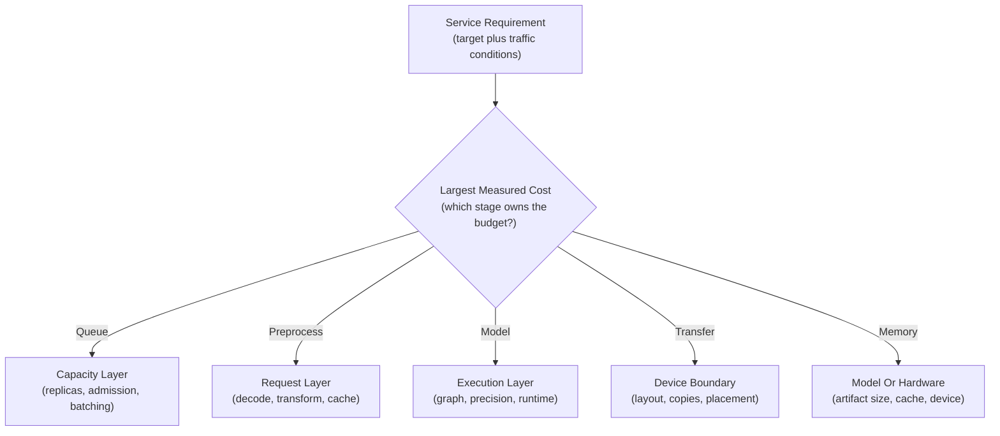
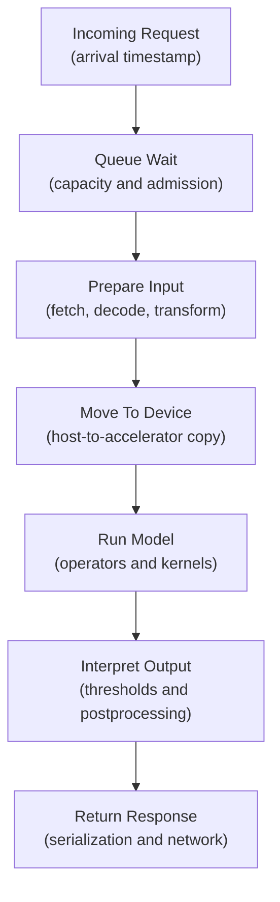
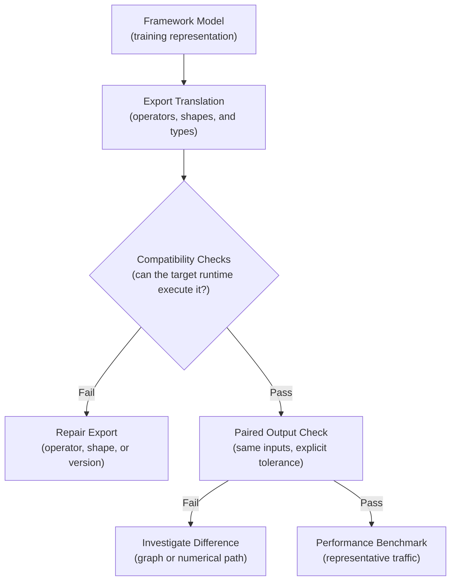
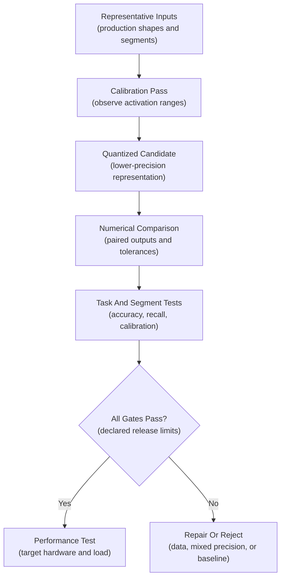
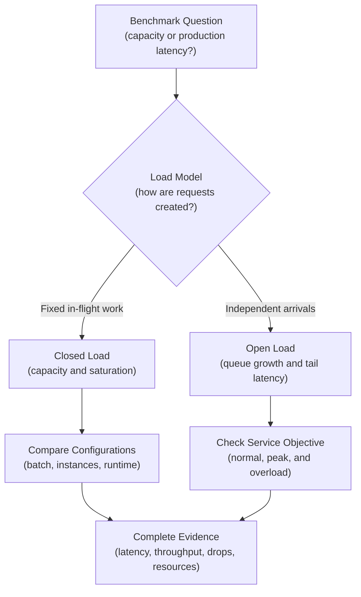
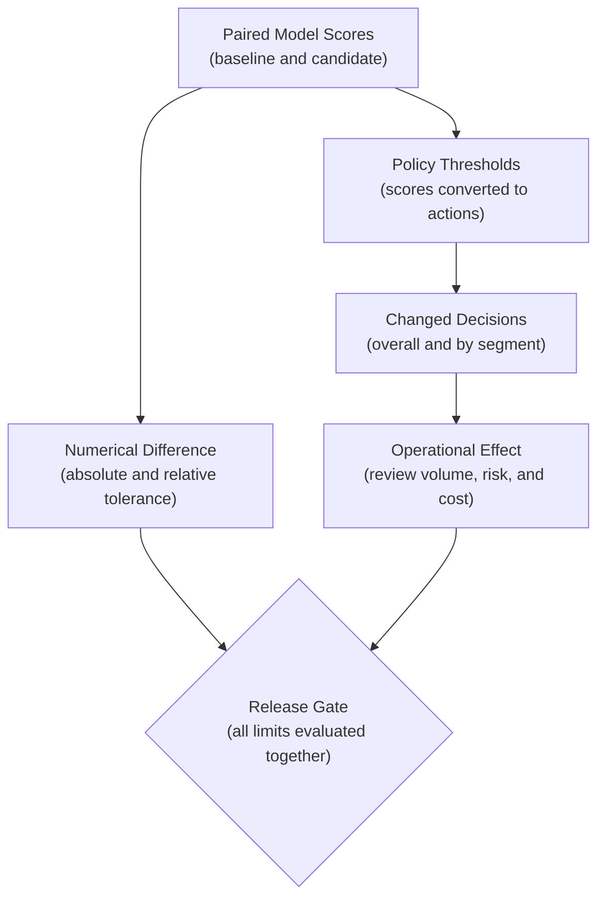
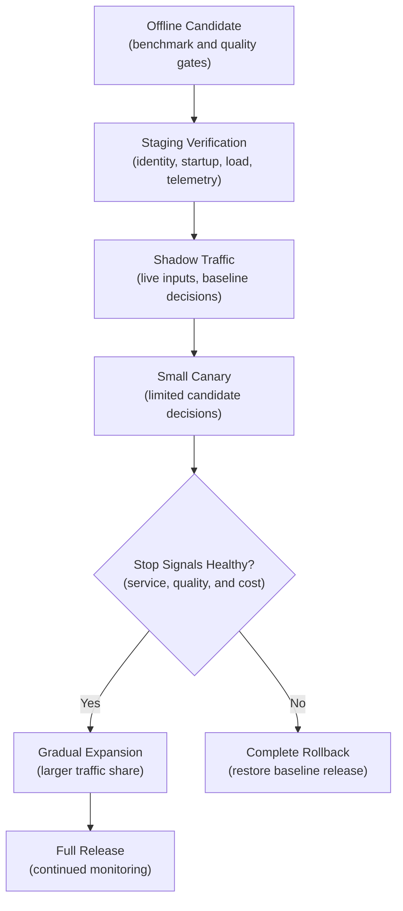
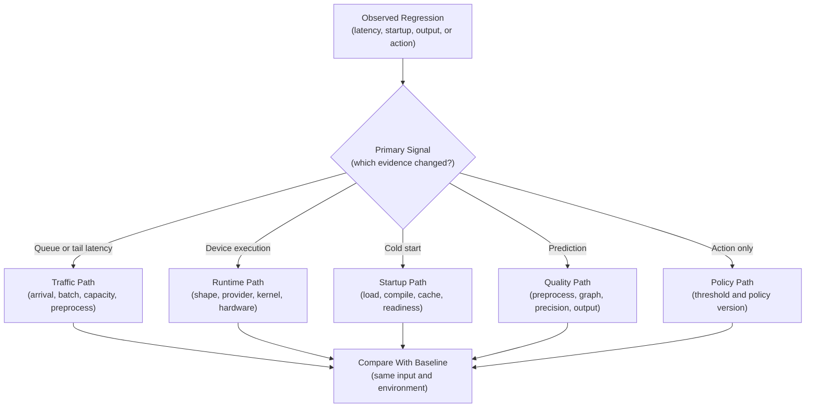

## Table of Contents

1. [What Inference Optimization Changes](#what-inference-optimization-changes)
2. [Define The Product Constraint And Measure The Bottleneck](#define-the-product-constraint-and-measure-the-bottleneck)
3. [Profile The Complete Request Path](#profile-the-complete-request-path)
4. [Optimize The Layer That Causes The Bottleneck](#optimize-the-layer-that-causes-the-bottleneck)
5. [Treat The Exported Model As A New Executable Candidate](#treat-the-exported-model-as-a-new-executable-candidate)
6. [Understand Which Operations Run In The Optimized Engine Or Fallback](#understand-which-operations-run-in-the-optimized-engine-or-fallback)
7. [Measure How Kernel Fusion And Engine Caches Affect Runtime](#measure-how-kernel-fusion-and-engine-caches-affect-runtime)
8. [Calibrate Lower Precision With Representative Data](#calibrate-lower-precision-with-representative-data)
9. [Build Benchmarks Across Representative Workloads](#build-benchmarks-across-representative-workloads)
10. [Use Open And Closed Load Tests For Different Questions](#use-open-and-closed-load-tests-for-different-questions)
11. [Check Numerical, Model, And Product Quality](#check-numerical-model-and-product-quality)
12. [Check Whether Optimization Moves Decision Thresholds](#check-whether-optimization-moves-decision-thresholds)
13. [Release The Optimized Model Through Shadow, Canary, And Rollback Stages](#release-the-optimized-model-through-shadow-canary-and-rollback-stages)
14. [Use Benchmark Evidence To Diagnose Regressions](#use-benchmark-evidence-to-diagnose-regressions)
15. [The Main Idea](#the-main-idea)
16. [References](#references)

## What Inference Optimization Changes

<!-- section-summary: Inference optimization changes request handling, model representation, numerical precision, runtime execution, or hardware to improve a measured production constraint. -->

An accurate model may still be too slow, memory-hungry, or expensive for its production deadline. **Inference optimization** changes the serving path so the model delivers predictions with less delay, more capacity, less memory, or lower cost. The work can happen before the model runs, inside the model, inside the serving runtime, or on the hardware that executes it.

Consider an image classifier behind an API. One request may wait in a queue,
download an image, decode it, resize it, copy a tensor to a GPU, run the neural
network, convert scores into a decision, and serialize the response. Replacing
the model runtime can accelerate only part of that path. If downloading and
decoding consume most of the request time, a faster GPU kernel produces a small
service-level improvement.

Optimization can also change predictions. An exported graph may use a different
operator implementation. A compiler may combine several operations. FP16 or INT8
arithmetic stores fewer numerical details than FP32. Those changes are often
small, but a small score change near a business threshold can send a request
down a different route.

The production question therefore has two parts:

- Did the candidate improve the required performance or cost constraint?
- Did it preserve the model behaviour and product decisions the service depends
  on?

This framework keeps a speed experiment connected to the production problem it
is supposed to solve.

## Define The Product Constraint And Measure The Bottleneck

<!-- section-summary: An optimization target combines a service-level requirement, representative traffic, and an explicit quality boundary. -->

“Make inference faster” gives an engineering team no finish line. A measurable
target describes the user-facing constraint and the traffic conditions around
it. For example: keep p95 latency below 100 milliseconds at 80 requests per
second, hold error rate below 0.1%, preserve the recall of the high-risk class
within 0.5 percentage points, and fit one replica inside 8 GiB of accelerator
memory.

**p95 latency** is the duration that 95% of requests finish within. It exposes
slow requests that an average can hide. The traffic rate matters because a
service may meet the latency target at ten requests per second and miss it after
the queue grows at eighty. The quality limit matters because the fastest
candidate has no value if it changes an important decision beyond the accepted
boundary.

After defining the target, measure where the budget goes. Suppose p95 latency is
140 milliseconds. Tracing shows 15 milliseconds in authentication and
networking, 60 in image decoding and resizing, 35 in GPU execution, 20 in
queueing, and 10 in postprocessing. A 30% improvement in GPU execution saves
about 10 milliseconds. Moving image decoding away from the request path or
optimizing preprocessing has far more room to help.

The same arithmetic applies to cost. Low GPU utilization may come from a small
model, serial CPU preprocessing, insufficient concurrency, variable shapes, or
an oversized accelerator. Buying a newer GPU treats very different causes as one
hardware problem.



A candidate earns further work only if its chosen layer can materially improve
the stated constraint.


*The profile gives optimization a finish line: target the stage with enough measured budget to change the product constraint, then reprofile the complete path rather than assuming the bottleneck stayed put.*

## Profile The Complete Request Path

<!-- section-summary: End-to-end profiling separates queueing, application work, device transfers, model execution, and response work before the team changes the model runtime. -->

A request-level timer tells the team that the service is slow. It does not
identify the cause. Add trace spans or structured timers around the major
stages: queue wait, request parsing, feature retrieval, decoding, preprocessing,
host-to-device transfer, model execution, device-to-host transfer,
postprocessing, and serialization.

For a tabular model, feature retrieval can dominate the request. For an image
model, decoding and resizing may dominate. An LLM profile separates queue wait
from prompt processing and token generation. It also tracks pressure on the
key-value cache, which stores attention state from earlier tokens. The profile
must reflect the actual service instead of only timing `model(input)` in a
notebook.

GPU timing needs extra care because GPU operations usually run asynchronously.
The CPU launches work and continues before the GPU finishes. A normal wall-clock
timer around a kernel can therefore measure launch time instead of completed
execution. Dedicated microbenchmarks should use device events or synchronize
around the measured region. Production request handlers should avoid adding
synchronization to every request because forced waiting can reduce concurrency.

Measure cold and warm behaviour separately. A cold request may load weights,
compile kernels, create memory pools, or build an engine. Warm measurements
describe steady traffic after those activities settle. Record p50, p95, and p99
latency, achieved throughput, offered load, queue depth, batch-size
distribution, CPU and accelerator utilization, memory, errors, timeouts, and
fallbacks.



If GPU execution falls from 40 to 20 milliseconds but p95 service latency barely
moves, inspect the other spans. The optimization may have shifted the bottleneck
into queueing, preprocessing, or transfers.

## Optimize The Layer That Causes The Bottleneck

<!-- section-summary: Request, batching, model, graph, precision, runtime, and hardware changes solve different bottlenecks and carry different risks. -->

Inference systems have several optimization layers. Each layer changes a
different part of the request path and carries its own release risk. A
preprocessing change affects the input contract, a batching change affects queue
delay, and a precision change affects arithmetic. The measured bottleneck
indicates which layer deserves investigation first.

### Request And Preprocessing Layer

This layer controls payload size, decoding, feature retrieval, tokenization,
resizing, and other preparation. Common changes include canonical input shapes,
vectorized transforms, caching deterministic features, avoiding duplicate
serialization, and moving expensive preparation into an upstream pipeline.

Caching needs a stable key, an explicit freshness policy, access controls, and
invalidation rules. A cached embedding from an older model or preprocessing
version can silently feed incompatible data into the current model. Include the
model and preprocessing versions in the key if those versions affect the value.

### Queue And Batch Layer

Batching combines several requests into one model call. Accelerators can process
a batch more efficiently than many tiny calls, so throughput often rises. Each
request waits while the batch forms, which spends part of the latency budget.

Dynamic batching uses a maximum queue delay and preferred batch sizes. A
synchronous risk decision with a strict latency objective may allow only a tiny
delay. An offline embedding job can use larger batches because throughput
matters more than per-item response time. NVIDIA Triton exposes dynamic batching
and instance-group controls; its Perf Analyzer and Model Analyzer help compare
the resulting latency, throughput, and GPU-memory tradeoffs.

### Model And Graph Layer

Architecture changes include choosing a smaller backbone or a task-specific
model. Pruning removes selected weights or structures, while distillation trains
a smaller model to imitate a larger one. Early-exit models can stop computation
after reaching sufficient confidence. These changes can deliver large gains.
They also change the learned function and therefore require full training and
evaluation evidence.

Graph optimization keeps the learned weights but changes their executable
representation. Exporters and compilers can remove constant work, select
optimized operators, and fuse operations. ONNX Runtime, TensorRT, OpenVINO, and
`torch.compile` are common choices in this layer.

### Precision Runtime And Hardware Layers

Precision changes the numerical format used for weights or calculations. FP16,
BF16, FP8, and INT8 can reduce memory traffic and unlock faster hardware paths.
Runtime configuration chooses thread pools, execution providers, memory arenas,
streams, and compiled engines. Hardware selection chooses the CPU, GPU,
accelerator family, and instance size.

The practical rule is to choose the smallest change that can address the
measured bottleneck. Reprofile after every major change because improving one
layer can expose the next limiting stage.

## Treat The Exported Model As A New Executable Candidate

<!-- section-summary: Export translates a framework model into another graph and tensor contract, so compatibility and output validation precede performance claims. -->

Training frameworks can execute flexible Python logic. Production runtimes
usually want a more constrained computation graph. **Model export** translates
the trained model into that graph, including its operators, weights, inputs,
outputs, data types, and supported shapes.

ONNX is a common exchange format. An ONNX graph describes operations such as
matrix multiplication, convolution, normalization, and activation through
versioned operator definitions. The **opset** identifies the version of those
operator definitions. A runtime must support the operators and opset used by the
exported model.

Shapes also form part of the contract. A static graph might accept only batch
size 1 and images of 224 by 224 pixels. A dynamic dimension permits a declared
axis, such as batch size, to vary at runtime. Dynamic shapes add flexibility and
can limit compiler optimization or require shape ranges for engines such as
TensorRT. Declare only the dimensions the service genuinely needs.

PyTorch’s current ONNX path uses the `torch.export`-based exporter through
`dynamo=True`. `dynamic_shapes` is the preferred shape declaration for that
path. A focused export looks like this:

```python
import torch

model = model.eval().cpu()
example = torch.randn(1, 3, 224, 224)

onnx_program = torch.onnx.export(
    model,
    (example,),
    input_names=["pixel_values"],
    output_names=["logits"],
    dynamic_shapes=({0: "batch"},),
    dynamo=True,
    verify=True,
)
onnx_program.save("image_classifier.onnx")
```

`verify=True` asks the exporter to check the exported program with ONNX Runtime
if the required dependency is available. The release pipeline still needs its
own comparison on representative inputs. Exporter verification cannot prove
product quality. The generic example lets the exporter choose its recommended
opset. Pin an explicit opset only if the tested target runtime or deployment
contract requires one, and record the emitted opset with the release artifact.

Operator compatibility failures tend to appear in three forms. The exporter
cannot translate an operation. The runtime can load the graph but sends an
unsupported operation to a slower provider. The graph runs, but an operator or
numerical order produces outputs outside the accepted tolerance. Pin the
framework, exporter, opset, runtime, and preprocessing versions so the artifact
can be reproduced.



Boundary inputs deserve special attention: minimum and maximum supported shapes,
empty or padded sequences, unusual image sizes, rare classes, missing-value
patterns, and examples close to decision thresholds.

## Understand Which Operations Run In The Optimized Engine Or Fallback

<!-- section-summary: A runtime assigns supported parts of an exported graph to execution providers, and unsupported parts may fall back to another device. -->

An **execution provider** connects a runtime to a hardware-specific
implementation. ONNX Runtime can register providers such as TensorRT, CUDA,
OpenVINO, and CPU. Provider order expresses priority. For example, TensorRT may
receive supported subgraphs, CUDA may execute other GPU-compatible nodes, and
CPU may handle the remainder.

The assignment process is called **graph partitioning**. Think of the exported
model as a chain of operations. The runtime groups operations that a provider
supports into subgraphs and sends each group to that provider. A graph split
across TensorRT, CUDA, and CPU can still return the correct answer, but it may
copy data between devices several times. Those transfers can erase the expected
speedup and create unstable tail latency.

Provider availability proves only that the runtime loaded the provider. It does
not prove that the important graph regions executed there. Enable runtime
profiling, inspect optimized subgraphs or provider logs, and treat unexpected
CPU placement as benchmark evidence.

```python
import json
import onnxruntime as ort

required = {"TensorrtExecutionProvider", "CUDAExecutionProvider"}
available = set(ort.get_available_providers())
missing = required - available
if missing:
    raise RuntimeError(f"Missing execution providers: {sorted(missing)}")

options = ort.SessionOptions()
options.enable_profiling = True
session = ort.InferenceSession(
    "image_classifier.onnx",
    sess_options=options,
    providers=[
        ("TensorrtExecutionProvider", {"trt_fp16_enable": True}),
        "CUDAExecutionProvider",
        "CPUExecutionProvider",
    ],
)

session.run(None, {"pixel_values": representative_batch})
profile_path = session.end_profiling()
profile = json.loads(open(profile_path, encoding="utf-8").read())
cpu_nodes = [
    event.get("name")
    for event in profile
    if event.get("args", {}).get("provider") == "CPUExecutionProvider"
]
print({"providers": session.get_providers(), "cpu_nodes": cpu_nodes})
```

The provider assertion catches a packaging error, such as installing a CPU-only
runtime inside a GPU image. The profile supports the second question: where did
the graph actually run? Production pipelines usually store the profile as an
artifact and enforce a reviewed allowlist for expected fallback nodes instead of
requiring zero CPU nodes for every model.

```mermaid
flowchart TD
    A["Exported Graph<br/>(all model operations)"] --> B["Runtime Partitioning<br/>(provider support decides placement)"]
    B --> C["TensorRT Subgraph<br/>(compiled supported operations)"]
    B --> D["CUDA Subgraph<br/>(remaining GPU operations)"]
    B --> E["CPU Subgraph<br/>(fallback operations)"]
    C --> F["Combined Output<br/>(copies connect each partition)"]
    D --> F
    E --> F

    class A,F graph;
    class B runtime;
    class C,D,E provider;
```

OpenVINO fills a similar role for Intel CPUs, GPUs, and NPUs. Its executable
graph and performance counters help reveal actual device placement. Choose the
runtime from the deployment hardware and supported operator set, then validate
the resulting executable path.

## Measure How Kernel Fusion And Engine Caches Affect Runtime

<!-- section-summary: Kernel fusion reduces launches and memory traffic, while engine caches preserve expensive compilation results for compatible deployments. -->

A neural-network graph often contains many small operations. Each operation can
launch a separate hardware **kernel**, which is the function executed on a CPU
or accelerator. Launching kernels and writing intermediate tensors to memory
costs time.

**Kernel fusion** combines compatible operations into one optimized kernel. A
matrix multiplication followed by bias addition and an activation may execute as
one unit. Fusion reduces launch overhead and can keep intermediate values in
fast device memory. It also changes operation order and rounding, so fused
output still passes numerical and task gates.

TensorRT goes further by building an **engine** for a particular graph,
precision, supported shape range, and target GPU. During the build, it evaluates
implementation strategies, often called tactics, and chooses an execution plan.
This compilation may take seconds or minutes.

An **engine cache** stores that compiled result so a new replica can start
without repeating the full build. A **timing cache** stores measured tactic
information that can accelerate later builds. These caches are deployable
artifacts, not universal binaries. Their validity can depend on the model graph,
TensorRT and CUDA versions, precision options, shape profiles, plugins, and GPU
compatibility.

The release process should build or warm the engine in a controlled environment,
record its compatibility identity, and test startup on the target hardware. If a
cache is missing or invalid, the service must follow a declared policy: rebuild
within a startup budget, fall back to another reviewed provider, or fail
readiness and keep traffic on the previous release.

For OpenVINO, model caching serves a comparable startup purpose on supported
devices. For ONNX Runtime, offline graph optimization can serialize an optimized
model. The exact cache mechanism differs, but the operational questions stay the
same: what produced the cached artifact, which environment can reuse it, and
what happens after a cache miss?

## Calibrate Lower Precision With Representative Data

<!-- section-summary: Lower-precision execution improves memory and compute efficiency, while calibration and mixed precision protect sensitive outputs. -->

Numbers inside a model use a finite format. FP32 provides a wide range and
relatively high detail. FP16 uses fewer bits and can run faster on many GPUs,
but it has a smaller numerical range. BF16 keeps a range similar to FP32 with
fewer precision bits. FP8 and INT8 reduce storage and memory traffic further and
require stronger hardware support and validation.

**Quantization** maps weights or activations into a lower-precision
representation. Weight-only quantization reduces model memory while leaving more
of the calculation at higher precision. Dynamic quantization chooses some
activation scaling during execution. Static post-training quantization
calculates activation ranges ahead of deployment.

Static quantization uses a **calibration dataset**: a representative collection
of real model inputs passed through the model to estimate useful numerical
ranges. In this context, calibration selects those ranges. Probability
calibration is a separate quality property discussed later. Labels are usually
optional for numerical range selection. Every sample must still pass through the
exact production preprocessing.

Suppose an image model usually sees well-lit images and occasionally receives
dark, high-contrast images from older devices. A calibration set containing only
the common bright images may choose activation ranges that clip important values
from the rarer group. Include ordinary traffic, important segments, supported
shapes, and difficult boundary cases. Keep final evaluation data separate so the
same examples do not choose quantization ranges and judge the result.

OpenVINO’s current NNCF flow wraps representative inputs in an `nncf.Dataset`
and supplies it to `nncf.quantize`. TensorRT and ONNX Runtime provide their own
quantization and calibration paths. Artifact formats and supported operators
vary, so the team should build a candidate for the exact target runtime instead
of treating one INT8 file as portable across every provider.



If a small set of layers causes most of the error, **mixed precision** keeps
those layers at a higher precision and quantizes the rest. TensorRT exposes
layer-level precision controls, and NNCF can exclude sensitive scopes. Rebuild
and rerun the complete gate after changing the precision plan.

## Build Benchmarks Across Representative Workloads

<!-- section-summary: A benchmark matrix compares complete serving candidates across real inputs, load levels, shapes, hardware, and startup states. -->

A production benchmark compares complete candidates. “ONNX is 2× faster” omits the
model version, runtime, provider, precision, shape, batch size, hardware,
traffic, and measured boundary. Record all of them.

Start with a small matrix driven by the deployment requirement:

- Baseline framework runtime and candidate runtime.
- Required precision modes, such as FP32 and FP16, plus INT8 only if it has a
  real hardware path.
- Common input shapes and the largest supported shape.
- Batch sizes or concurrency levels that the service can actually produce.
- The production hardware SKU, driver, accelerator libraries, runtime image, and
  power mode.
- Cold startup, warm steady state, and any engine-cache miss path.
- Ordinary traffic, expected peak traffic, and a controlled overload point.

Change one major variable per diagnostic comparison. First compare baseline and
exported FP32 on the same device. Then add graph compilation. Then change
precision. Then tune batching. This sequence reveals the source of each gain or
regression. Run the final combined candidate afterward because optimizations
interact.

Input data affects both performance and quality. Variable-length text changes
padding and compute. Image resolution changes tensor size. Object detection can
spend different time in postprocessing according to the number of proposed
boxes. LLM benchmarks need representative prompt lengths, output lengths,
streaming behaviour, and request cancellation.

For conventional models served with Triton, Perf Analyzer can sweep concurrency
or request rate and report latency and throughput. Model Analyzer can explore
batch sizes and instance counts while collecting GPU memory and utilization.
OpenVINO’s `benchmark_app` helps compare latency and throughput hints on target
Intel hardware. These tools measure the model or server configuration supplied
to them; an application-level load test still covers authentication, feature
calls, payload work, and network boundaries.

For vLLM, measure time to first token, inter-token latency, end-to-end request
latency, output-token throughput, and request throughput. Prompt length,
generated length, KV-cache capacity, prefix reuse, quantization, and continuous
batching all affect the result. **KV cache** stores attention state from earlier
tokens. **Prefix caching** can reuse matching prompt prefixes. A benchmark with
repeated prompts can therefore overstate production performance if real users
rarely share prefixes.

## Use Open And Closed Load Tests For Different Questions

<!-- section-summary: Closed-load tests study capacity under fixed concurrency, while open-load tests reveal queue growth under a fixed arrival rate. -->

Load generators answer different questions according to how they send work. The
difference matters because a fixed number of active clients reacts to a
slowdown, while independent user arrivals continue at their scheduled rate. A
benchmark plan uses both behaviours to expose capacity and queueing risk.

A **closed-load model** keeps a fixed number of requests in flight. A client
sends another request after one completes. Triton Perf Analyzer’s concurrency
mode follows this pattern. It is useful for finding saturation throughput and
comparing how many simultaneous requests a configuration can process. A slower
server also slows the rate at which the client creates new work, so queue growth
can look controlled.

An **open-load model** sends requests according to an external arrival schedule,
independent of response completion. Request-rate mode with a constant or Poisson
distribution is one practical implementation. It resembles an online service
whose users continue arriving during a slowdown. If arrival rate exceeds
sustainable capacity, queue depth and tail latency rise sharply.

Run both. Closed load helps compare capacity across batch sizes, model
instances, and runtimes. Open load checks the production objective at the
expected and peak arrival rates. Record offered requests, completed requests,
rejected requests, timeouts, and fallback responses. Completed throughput alone
can reward a candidate that drops difficult work.



Warm-up and repetition are part of the protocol. Declare the warm-up condition,
run several trials, and report variation. Store the configuration, raw results,
environment identity, and quality report together so another engineer can
reproduce the decision.

## Check Numerical, Model, And Product Quality

<!-- section-summary: Numerical, task, calibration, segment, and product-decision gates protect different consequences of an optimization. -->

Performance evidence answers whether the system improved. Quality gates examine
whether the candidate still performs the intended job. A small numerical
difference can preserve the final action, change a class, distort a probability,
or affect only one important segment. Separate gates make each consequence
visible.

A **numerical gate** compares baseline and candidate outputs on identical
inputs. Absolute tolerance limits the raw difference, while relative tolerance
scales the allowance with the reference value. For an output value `b` from the
baseline and `c` from the candidate, a common rule accepts the pair if
`|c - b| <= absolute_tolerance + relative_tolerance × |b|`.

A **tolerance** is the predeclared amount of numerical difference the system
accepts. It should come from output scale, downstream sensitivity, baseline
nondeterminism, and product risk. Choosing it after seeing the candidate turns
the gate into an explanation for a preferred result.

Numerical closeness cannot replace a task metric. A **task gate** recomputes the
metrics that describe model performance: macro-F1 and per-class recall for
classification, NDCG for ranking, mean absolute error for regression,
intersection over union for segmentation, or a task-specific evaluation for
generation.

Probability-producing classifiers also need a **calibration gate**. Probability
calibration asks whether predictions labelled around 0.8 succeed about 80% of
the time. Brier score, expected calibration error, and reliability plots can
reveal a probability shift even if class labels remain similar.

Finally, evaluate important segments. Overall accuracy may stay flat while one
language or device type regresses. The same risk applies to a region, an
input-size band, or a rare class. Define protected slices before candidate
evaluation. Each slice also needs enough examples to make its result meaningful.

This focused gate uses paired baseline and candidate probabilities for a binary
classifier. The same rows feed every comparison, so changed decisions can be
inspected directly:

```python
import numpy as np
import pandas as pd
from sklearn.metrics import brier_score_loss, recall_score

rows = pd.read_parquet("paired_predictions.parquet")
threshold = 0.70

rows["baseline_decision"] = rows.baseline_probability >= threshold
rows["candidate_decision"] = rows.candidate_probability >= threshold
rows["decision_changed"] = (
    rows.baseline_decision != rows.candidate_decision
)

max_error = np.abs(
    rows.candidate_probability - rows.baseline_probability
).max()
recall_delta = recall_score(
    rows.label, rows.candidate_decision
) - recall_score(rows.label, rows.baseline_decision)
brier_delta = brier_score_loss(
    rows.label, rows.candidate_probability
) - brier_score_loss(rows.label, rows.baseline_probability)
changed_rate = rows.decision_changed.mean()

assert max_error <= 0.02
assert recall_delta >= -0.005
assert brier_delta <= 0.002
assert changed_rate <= 0.001
```

The four assertions protect different risks. The numerical limit catches broad
output divergence. Recall protects missed positive cases. Brier score protects
probability calibration. Changed-decision rate measures the direct effect of the
existing threshold.

Add per-segment assertions around the same calculations for protected groups.
Store the identifiers of changed cases for review, subject to data-access and
privacy rules. Unit-test the gate with deliberately altered fixtures so a
rare-class miss, calibration shift, and threshold crossing each cause the
expected failure.

## Check Whether Optimization Moves Decision Thresholds

<!-- section-summary: Scores close to a product threshold can change actions even if aggregate model metrics remain stable. -->

Many models do not expose a prediction directly to a user. A policy converts the
score into an action. A probability above 0.70 may trigger manual review; a
lower score may continue automatically. This threshold is part of the production
decision system.

Suppose the baseline produces 0.701 and an FP16 candidate produces 0.699 for the
same input. The absolute difference is only 0.002, yet the action changes.
Thousands of inputs near the threshold can alter review volume, user delay, and
downstream cost without causing a large change in aggregate accuracy.

Measure the changed-decision rate overall and by protected segment. Plot or
count score movement in bands around every operational threshold. Recompute
action rates, manual-review volume, false-positive cost, missed-positive cost,
and capacity limits for downstream teams.

Silently retuning the threshold to match the old action rate hides a second
production change. Treat a new threshold as a new policy candidate. Evaluate it
against the product outcome and downstream capacity. Give the approved policy
its own version and release record. Separate model and policy versions let
incident responders trace a changed action to arithmetic, model quality, or
policy.



For ranking and generation systems, the corresponding product gate may compare
reordered items, tool choices, safety routes, refusal decisions, or human-review
outcomes. The exact gate follows the action produced by the model.


*Export, provider placement, compilation, and reduced precision create a new executable candidate; even a small paired-score difference must pass the product-action gate before faster execution can advance.*

## Release The Optimized Model Through Shadow, Canary, And Rollback Stages

<!-- section-summary: Shadow and canary stages expose the optimized candidate to current traffic while a complete baseline release remains ready for recovery. -->

Offline gates cannot reproduce every production shape, driver interaction, queue
pattern, or downstream effect. Progressive release adds live evidence without
sending all traffic to an unproven candidate.

Start in staging. Verify the model digest, preprocessing version, runtime image,
execution-provider order, engine or model cache, supported shapes, startup time,
readiness behaviour, telemetry, and paired golden fixtures. Run the
representative load test on the same class of hardware used in production.

**Shadow traffic** copies real requests to the candidate while the baseline
response remains authoritative. Compare provider placement and unsupported
shapes first. Then compare prediction differences, memory, queueing, and
latency. Shadowing may need redaction, sampling, and strict retention because
copied requests still carry production data. Side effects such as writes,
notifications, and billing must stay disabled.

A **canary** sends a small controlled share of real decisions to the candidate.
Increase exposure only after the observation window covers normal load and
important segments. Service stop signals cover latency, errors, timeouts,
fallback, and resource use. Quality stop signals cover output divergence,
decision changes, task proxies, and downstream action volume.

Rollback restores the complete baseline release: model artifact, preprocessing,
runtime image, precision plan, execution-provider configuration, batching
policy, policy threshold, and compatible cache. Reverting only the model file
can leave the faulty runtime or precision setting in place.



Record the baseline and candidate as immutable release identities. The evidence
packet should connect benchmark results, quality reports, approval, runtime
configuration, and rollback target.

## Use Benchmark Evidence To Diagnose Regressions

<!-- section-summary: Incident diagnosis starts with the failing signal and follows it back to the optimization layer that can produce it. -->

An optimized release can fail through performance, correctness, compatibility,
or operations. Start with the observed signal, compare the candidate with the
baseline, and follow the evidence toward the changed layer.

If latency rises while model execution time stays stable, inspect arrival rate,
queue depth, batch formation, preprocessing, transfers, and downstream calls. If
GPU execution rises, inspect shape distribution, provider placement, kernel
selection, thermal state, and competing workloads. A sudden CPU increase
alongside slower GPU inference often points to graph fallback or additional
host-side work.

If only the first requests are slow, inspect model loading, engine compilation,
cache identity, memory-pool creation, and warm-up. A cache built for a different
GPU, runtime, graph, or shape profile may be rejected or rebuilt. Readiness
should prevent traffic from reaching an unprepared replica.

If predictions diverge, reproduce the same input against both immutable
releases. Compare preprocessing first, then exported outputs, provider path,
precision, and postprocessing. Broad small differences suggest precision or
operator ordering. Large differences limited to certain shapes suggest export or
dynamic-shape behaviour. Segment-specific failures can point to poor calibration
coverage or a sensitive layer.

If model scores remain close but product actions change, inspect threshold
crossings and policy versions. The model may have passed a general numerical
tolerance while moving many cases clustered around the decision boundary.



Rollback first if a blocking limit is breached and the baseline is healthy.
Preserve profiles, traces, paired outputs, cache logs, shapes, and environment
identity for the follow-up investigation.

## The Main Idea

<!-- section-summary: Safe inference optimization connects one measured constraint to a targeted change, representative evidence, protected quality, and a complete recovery path. -->

Inference optimization is a controlled change to a production decision system.
The work starts with a service constraint and a measured bottleneck. The team
changes the layer that owns that bottleneck, benchmarks the complete candidate
under representative inputs and traffic, and applies numerical, task,
calibration, segment, and product-decision gates.

ONNX Runtime, TensorRT, OpenVINO, Triton, and vLLM provide valuable execution
and measurement capabilities. Their settings only make sense in relation to the
model contract, hardware, workload, and product decision. A production-ready
candidate carries enough evidence to explain the improvement, the accepted
numerical difference, the live stop signals, and the exact baseline release used
for recovery.


*Optimization is released as one measured production change: representative performance and behaviour gates travel with the candidate, and a breached limit restores the complete baseline model, runtime, policy, batching, and cache combination.*

## References

- [PyTorch ONNX exporter](https://docs.pytorch.org/docs/stable/onnx.html)
- [PyTorch export-based ONNX exporter](https://docs.pytorch.org/docs/main/onnx_export.html)
- [ONNX Runtime execution providers](https://onnxruntime.ai/docs/execution-providers/)
- [ONNX Runtime architecture and graph partitioning](https://onnxruntime.ai/docs/reference/high-level-design.html)
- [ONNX Runtime TensorRT execution provider](https://onnxruntime.ai/docs/execution-providers/TensorRT-ExecutionProvider.html)
- [ONNX Runtime quantization](https://onnxruntime.ai/docs/performance/model-optimizations/quantization.html)
- [TensorRT accuracy considerations](https://docs.nvidia.com/deeplearning/tensorrt/latest/inference-library/accuracy-considerations.html)
- [Triton Inference Server optimization](https://docs.nvidia.com/deeplearning/triton-inference-server/user-guide/docs/user_guide/optimization.html)
- [Triton Perf Analyzer load modes](https://docs.nvidia.com/deeplearning/triton-inference-server/user-guide/docs/perf_analyzer/docs/inference_load_modes.html)
- [Triton Model Analyzer metrics](https://docs.nvidia.com/deeplearning/triton-inference-server/user-guide/docs/model_analyzer/docs/metrics.html)
- [OpenVINO post-training quantization with NNCF](https://docs.openvino.ai/2026/openvino-workflow/model-optimization-guide/quantizing-models-post-training/basic-quantization-flow.html)
- [OpenVINO Benchmark Tool](https://docs.openvino.ai/2026/get-started/learn-openvino/openvino-samples/benchmark-tool.html)
- [vLLM optimization and tuning](https://docs.vllm.ai/en/latest/configuration/optimization.html)
- [NVIDIA GenAI-Perf](https://docs.nvidia.com/deeplearning/triton-inference-server/user-guide/docs/perf_analyzer/genai-perf/README.html)
