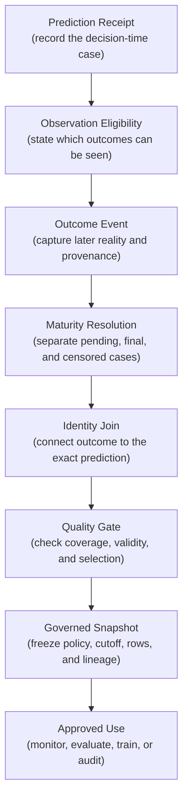
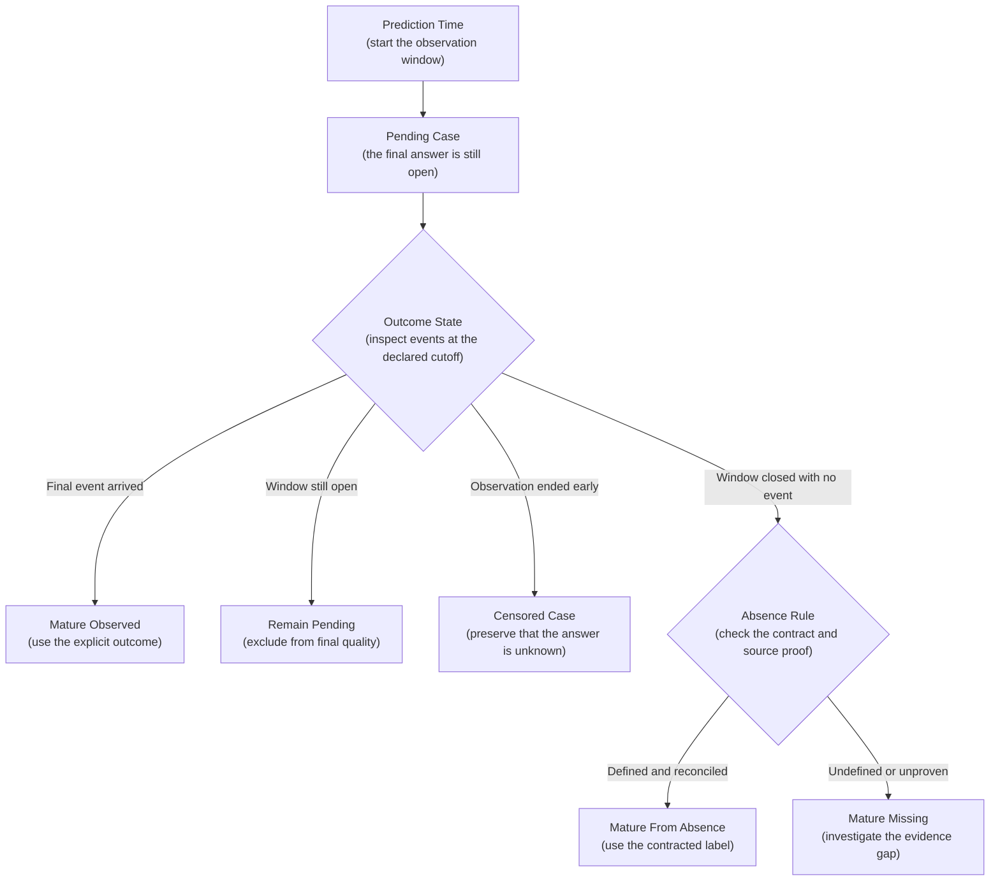
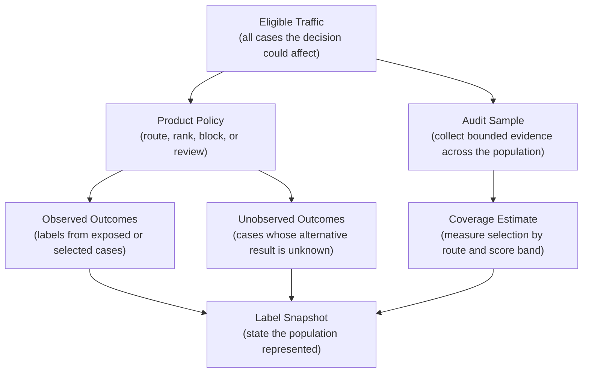
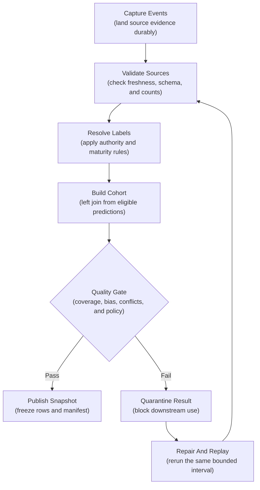

## Table of Contents

1. [What A Production Label Tells Us](#what-a-production-label-tells-us)
2. [How A Prediction Receives A Label Later](#how-a-prediction-receives-a-label-later)
3. [First Record The Prediction And Whether An Outcome Can Be Observed](#first-record-the-prediction-and-whether-an-outcome-can-be-observed)
4. [Record Outcome Events And Their History](#record-outcome-events-and-their-history)
5. [Wait Until Delayed Outcomes Are Mature](#wait-until-delayed-outcomes-are-mature)
6. [Join Labels Without Losing Missing Cases](#join-labels-without-losing-missing-cases)
7. [Check Whether The Label Pipeline Is Healthy](#check-whether-the-label-pipeline-is-healthy)
8. [Correct For Product Decisions That Shape Which Labels Exist](#correct-for-product-decisions-that-shape-which-labels-exist)
9. [Keep Label History And Reproducible Snapshots](#keep-label-history-and-reproducible-snapshots)
10. [Make The Label Pipeline Reproducible And Replayable](#make-the-label-pipeline-reproducible-and-replayable)
11. [Decide Whether Labels Can Be Used For Monitoring, Evaluation, Or Training](#decide-whether-labels-can-be-used-for-monitoring-evaluation-or-training)
12. [The Main Idea](#the-main-idea)
13. [References](#references)

## What A Production Label Tells Us
<!-- section-summary: A production label records a later outcome that can be connected back to a live prediction under a defined meaning and observation rule. -->

A **production label** is a recorded outcome used to judge a prediction made in the real world. A payment-risk score may later connect to a confirmed chargeback. A delivery estimate may connect to the actual arrival time. A support-routing prediction may connect to the team that ultimately resolved the case.

An offline training file often places the features and answer on the same row. Production separates them. The prediction happens now, the outcome may arrive weeks later, and another system usually owns that outcome. The model's action can even change whether the outcome will ever be observed.

Consider a model that predicts whether an invoice will remain unpaid thirty days after its due date. On the fifth day, the account has made no payment. That case still belongs in the pending state because twenty-five days remain in the observation window. If a data pipeline writes `unpaid = false` at this point, recent predictions will look unusually successful simply because reality has not had enough time to unfold.

This is the central production-label problem. A click, review action, payment, complaint, sensor reading, or database status starts as an **outcome event**. The system can admit it as ML evidence only after answering several questions:

- Which prediction and product action created this case?
- Was the outcome actually observable under that action?
- Which event defines success or failure?
- Has enough time passed for the answer to be final?
- Did the event arrive from an approved source under the expected policy?
- Are missing labels evenly distributed or concentrated in one route or segment?
- Is this evidence suitable for monitoring, evaluation, training, or audit?

Production label collection is therefore a data product with its own contracts, quality checks, access rules, and recovery path. The goal is a defensible account of what happened, including what remains unknown.

## How A Prediction Receives A Label Later
<!-- section-summary: The lifecycle preserves the decision-time case, observes later events, resolves their maturity and authority, and publishes a governed snapshot for an approved use. -->

The label lifecycle is the path from one live decision to evidence that another system can safely use. Each stage protects a different part of the meaning.



The lifecycle starts at prediction time because later events need a stable case to attach to. It keeps event time separate from arrival time because outcomes travel at different speeds. It preserves pending and missing cases because an inner join would quietly remove them. It ends with a named snapshot because a mutable “latest labels” table leaves earlier evaluations unreproducible.

The stages also have separate owners. A product team defines the outcome and observation policy, while source-system owners publish the events. A data or MLOps team builds the join and quality gates. Risk, privacy, and domain owners approve downstream use.

This separation directs incident response. Missing source events go back to the source owner. Orphaned events point to the identity join. A review backlog belongs to the review operation, and biased coverage may require a change to the product's sampling policy.

## First Record The Prediction And Whether An Outcome Can Be Observed
<!-- section-summary: A prediction receipt identifies the exact decision, while observation eligibility records whether the chosen action allowed the relevant outcome to be seen. -->

Label collection starts before any label exists. The prediction path must leave behind enough information to recognize the case later and explain what the product did with the model output.

### Record Which Prediction The Outcome Belongs To

A **prediction receipt** is the durable record for one live prediction. At minimum, it carries a stable `prediction_id`, prediction time, model version, feature or preprocessing version, model output, policy version, product action, and approved join key. Route and segment fields help the team locate failures, while a trace reference connects operational investigation without turning high-cardinality IDs into metric labels.

The prediction ID matters because one entity can receive many predictions. A courier may receive a new arrival estimate every few minutes. Joining the final arrival to the courier ID alone gives every estimate the same outcome and hides which estimate was visible at each decision point. A stable prediction ID plus an explicit attribution rule preserves the intended comparison.

The receipt also separates the model output from the action. A risk score of `0.72` may be approved under one threshold and sent to manual review under another. The later outcome can evaluate the score, the threshold policy, or the complete decision system. Those are different questions, so the receipt keeps the fields separate.

### Record Whether An Outcome Could Be Observed

**Observation eligibility** states whether a case had a genuine opportunity to produce the outcome being measured. The pipeline can then preserve an unobservable case as unknown, with no negative outcome inferred from the missing event.

Suppose a recommendation model scores 500 products and the product displays only the top ten. A click can occur only for a displayed product. The other 490 candidates have no click event, yet `clicked = false` would misrepresent them as 490 rejected recommendations. The receipt should record the displayed items, their positions, the ranking policy, and any sampling probability used to expose lower-ranked items.

A fraud decision creates a harder boundary. Blocking a payment closes the path that could have produced a later chargeback because the transaction never completed. The action changed the world being measured. The receipt records `action = blocked` and marks the approval outcome as unobservable for that case. Review results, appeals, or controlled expert samples may provide other evidence, although they answer a different question from an observed chargeback.

Eligibility rules belong in the outcome contract. They name the target population, the actions that permit observation, the sampling design, and the approved alternative evidence for cases outside the normal outcome path. This information will later define the denominator for coverage and quality.

## Record Outcome Events And Their History
<!-- section-summary: Outcome events preserve what happened, who or what observed it, when it happened, and which policy gave the event its meaning. -->

An outcome source produces events from the real process the model tried to support. Payment settlement, delivery completion, subscription cancellation, case resolution, an appeal, or a reviewed document can all be sources. The important question is which event answers the model's target.

### Define The Outcome Before Building The Feed

A support-routing system illustrates the difference between available events and useful labels. The first agent may move a ticket, a second team may resolve it, a manager may audit it, and the customer may reopen it. Each event describes part of the journey. None automatically means “correct initial route.”

The outcome contract could define success as “the specialist queue that resolved the case under routing policy version 12, excluding transfers made only to balance workload.” That statement identifies the target, observation window, exclusions, policy version, and authoritative source. Engineers can then implement the rule and domain owners can challenge it.

Different decisions may use different outcomes. An agent correction within ten minutes can warn that routing quality changed. A final resolution after the reopen window can support release evaluation. A customer-satisfaction response can measure a broader product effect. Combining all three into one `label` column would hide their timing and authority.

### Record When The Outcome Happened, Arrived, And Where It Came From

An outcome event needs two clocks. **Event time** says when the real-world event occurred. **Available time** says when the label pipeline could first use it. A chargeback may belong to Monday's transaction and reach the analytics system on Thursday. Monday is part of the outcome; Thursday explains its absence from Tuesday's report.

The event also records a unique event ID, prediction or entity reference, label name and value, source system, policy version, actor type, authority level, and an approved reference to source evidence. Sensitive text, medical records, and direct identifiers stay in restricted source systems unless policy explicitly permits their duplication. The label table uses a governed reference for that evidence.

Corrections are appended as new events. An appeal that reverses a moderation decision points to the event it supersedes. The old event remains available for audit, and a resolved view selects the authoritative state known at a declared cutoff. Overwriting the original row would make an earlier model evaluation impossible to reconstruct.

### Choose How Outcome Events Enter The Pipeline

A small batch product may load outcome rows directly from an operational database into its warehouse each night. A high-volume service may publish events through Apache Kafka or a managed event stream, then land them in object storage, a warehouse, or a lakehouse. Change-data capture can move committed database changes without adding a second write to the application path.

The ingestion layer transports evidence. Authority comes from the outcome contract and source policy. Producers still need stable event IDs, schema validation, and a retry-safe write. Consumers deduplicate by event ID and send malformed records to quarantine. The source owner reconciles published event counts with the source system, which exposes events lost before the consumer received them.

## Wait Until Delayed Outcomes Are Mature
<!-- section-summary: Maturity rules keep recent, incomplete, and censored cases separate from final labels. -->

Many production outcomes need time. A delivery arrives later in the day. A subscription-churn label needs the full cancellation horizon. A loan or invoice outcome may require months. The label pipeline must represent this waiting period explicitly.

### Define When An Outcome Is Final Enough To Use

A **maturity rule** states how much observation time a case needs and which source events can finalize it earlier. Consider a prediction of whether an invoice will still be unpaid thirty days after its due date. A confirmed payment during those thirty days supplies an explicit answer: the invoice was paid within the window, so the case can close early. The opposite answer needs more care. An empty payment history proves “unpaid” only after the thirty-day window and the agreed ingestion allowance have passed.

Some targets deliberately use the absence of an event. “No payment by day thirty” is one example. In that case, the outcome contract must name `unpaid` as the label produced by absence, and the source history must be reconciled through the cutoff. Reconciliation may compare source totals, freshness markers, and completed partitions with the records landed in the label store. If that proof fails, no payment event still means missing evidence. It does not yet mean the customer failed to pay.



The pipeline publishes explicit states such as `pending`, `mature_observed`, `mature_from_trusted_absence`, `censored`, and `mature_missing`. The state records how the answer was obtained. An explicit payment event and a reconciled absence may both produce valid labels, but they carry different evidence.

### Keep Unobserved Outcomes As Unknown

A case is **right-censored** if observation ended before the outcome window completed. A customer may leave the study, an account may be deleted, or the dataset cutoff may arrive before the ninety-day horizon closes. The final answer remains unknown, and the available evidence cannot prove a negative outcome.

Censored rows can support survival analysis or other methods designed for incomplete follow-up. A standard binary classifier usually excludes them from final evaluation and training. The snapshot records the exclusion count by cohort and segment, so the missing population remains visible.

Some outcomes arrive after the normal ingestion allowance. The event still keeps its original event time and later available time. A new snapshot can incorporate the late evidence and record a metric revision. The earlier snapshot remains valid as the evidence available at its own cutoff.

### Use Streaming Watermarks For Late-Arriving Data

Spark Structured Streaming can use an event-time watermark to bound the state kept for late streaming data. Records older than the watermark may be dropped according to the query's semantics. This watermark controls streaming state. The outcome contract supplies the business maturity rule for a label.

A thirty-day chargeback definition therefore needs its own maturity rule beyond a two-hour streaming watermark. The stream can land events quickly, while a durable raw table retains late arrivals and a scheduled cohort job resolves business maturity. Teams that discard late stream events need a dead-letter or reconciliation path capable of recovering them from the source.

## Join Labels Without Losing Missing Cases
<!-- section-summary: A label cohort preserves every eligible prediction, attaches the authoritative outcome available at a cutoff, and keeps pending or missing cases in the result. -->

The join is where prediction-time evidence meets later reality. Its safest starting point is the complete set of eligible predictions. A left join then attaches the resolved outcome events. An inner join would remove predictions without labels and make coverage look perfect by construction.

### Join On Stable IDs And A Fixed Cutoff Time

The preferred key is `prediction_id`. If the source can provide only an entity ID, the contract must define the allowed time relationship and how repeated predictions are resolved. A delivery outcome, for example, may attach to the last estimate shown before arrival. The join should encode that rule and fail on ambiguous matches.

The dataset also needs an **as-of cutoff**. The cutoff means “use only outcome evidence available by this time.” It makes an evaluation reproducible even after appeals, late events, or corrections arrive.

This focused BigQuery query applies that rule to the invoice outcome. A final payment event inside the thirty-day window can resolve the case immediately. After the window closes, `@absence_label_value` supplies `unpaid` only if the contract defines that result and `@source_history_reconciled` confirms complete source history. A production job should derive that reconciliation flag from a source-quality gate for the same cohort rather than from an unchecked manual setting.

```sql
WITH predictions_in_scope AS (
  SELECT prediction_id, prediction_time, model_version, model_route, action
  FROM mlops.prediction_receipts
  WHERE prediction_time >= @cohort_start
    AND prediction_time < @cohort_end
    AND observation_eligible = TRUE
), resolved_events AS (
  SELECT e.prediction_id, e.label_value, e.label_event_id, e.available_time
  FROM mlops.label_events AS e
  JOIN predictions_in_scope AS p
    ON e.prediction_id = p.prediction_id
  WHERE e.available_time <= @as_of_time
    AND e.event_time >= p.prediction_time
    AND e.event_time <= TIMESTAMP_ADD(p.prediction_time, INTERVAL 30 DAY)
    AND e.label_policy_version = @label_policy_version
    AND e.is_authoritative = TRUE
    AND e.finalizes_outcome = TRUE
  QUALIFY ROW_NUMBER() OVER (
    PARTITION BY e.prediction_id
    ORDER BY e.available_time DESC, e.label_event_id DESC
  ) = 1
)
SELECT
  p.*,
  CASE
    WHEN e.prediction_id IS NOT NULL THEN e.label_value
    WHEN @as_of_time >= TIMESTAMP_ADD(p.prediction_time, INTERVAL 30 DAY)
      AND @absence_label_value IS NOT NULL
      AND @source_history_reconciled
      THEN @absence_label_value
    ELSE NULL
  END AS label_value,
  e.label_event_id,
  CASE
    WHEN e.prediction_id IS NOT NULL
      THEN 'mature_observed'
    WHEN @as_of_time < TIMESTAMP_ADD(p.prediction_time, INTERVAL 30 DAY)
      THEN 'pending'
    WHEN @absence_label_value IS NOT NULL
      AND @source_history_reconciled
      THEN 'mature_from_trusted_absence'
    ELSE 'mature_missing'
  END AS label_state
FROM predictions_in_scope AS p
LEFT JOIN resolved_events AS e USING (prediction_id);
```

The result has four visible states. `mature_observed` rows carry an accepted final event. `pending` rows are still inside the observation window. `mature_from_trusted_absence` rows use the absence label declared by the contract after source reconciliation. `mature_missing` rows reached the horizon without enough evidence and count against coverage. The two mature label states can enter the next quality gate; pending and missing rows cannot. A production version would also apply per-source reconciliation, censoring rules, correction links, and the ingestion allowance defined by the outcome contract.

### Rebuild Prediction-Time Inputs Separately

The label join answers what happened after the decision. A training dataset also needs the feature values available at the original prediction time. Joining today's customer profile to an old label leaks later information into the model.

Production pipelines read an immutable feature snapshot or perform a point-in-time join using entity identity and event time. The output records the feature-table version, transformation revision, label-policy version, cohort bounds, and as-of cutoff. These identifiers let another run recover the same rows and the same meaning.

## Check Whether The Label Pipeline Is Healthy
<!-- section-summary: Label quality combines structural validity, source freshness, cohort coverage, timing, agreement, and segment balance. -->

A valid label value can still come from an unhealthy label system. Quality monitoring therefore measures the path that produced the labels as well as the values themselves.

### Measure Label Coverage Against All Eligible Predictions

**Label coverage** is the share of eligible mature predictions with an accepted label. Prediction receipts supply the complete denominator. Coverage is calculated by prediction cohort, model route, product action, source, and approved segment.

Suppose the global dashboard reports 96 percent coverage. A mobile application release stopped sending the prediction ID for one language route, and coverage for that route fell to 38 percent. The overall number still looks healthy because the route carries little traffic. Segment-level coverage reveals the join failure and prevents the remaining 38 percent from representing the full route.

Freshness answers a different question: how recently did each source publish events? Time-to-label shows the delay from prediction to available outcome. Orphan events have no matching receipt. Duplicate authoritative events claim two final answers. Correction and disagreement rates reveal unstable policy or review quality. Class and source mix can reveal an unexpected workflow change.

### Use Data Tests To Enforce Label Rules

Warehouse teams often use dbt data tests for structural and business assertions. Built-in tests cover uniqueness, nulls, accepted values, and relationships. A custom SQL test can return cohorts whose mature coverage falls below an approved threshold. For the BigQuery path shown above, the test can express the mature coverage ratio with `SAFE_DIVIDE`:

```sql
SELECT cohort_date, model_route
FROM {{ ref('production_label_snapshot') }}
WHERE observation_eligible = TRUE
  AND label_state IN (
    'mature_observed',
    'mature_from_trusted_absence',
    'mature_missing'
  )
GROUP BY cohort_date, model_route
HAVING SAFE_DIVIDE(
  COUNTIF(label_state IN (
    'mature_observed',
    'mature_from_trusted_absence'
  )),
  COUNT(*)
) < 0.95
```

dbt treats the returned rows as failures. For this particular decision, the job would withhold a snapshot if any route falls below 95 percent. Product and risk owners choose that threshold for this label. Another label may need 99.9 percent coverage or may publish a clearly marked partial result.

The gate also checks unique event IDs, valid state transitions, source freshness, policy compatibility, and the absence of unresolved authoritative conflicts. Failed rows should enter a quarantined audit table with enough identifiers for repair. Training and release-evaluation jobs remain blocked until the snapshot passes or an approved exception records the limitation.

### Quality Metrics Need Owners And Responses

A fall in source freshness belongs to the source owner. Orphan events belong to the identity or integration owner. A growing pending queue may indicate normal label delay, while a growing mature-missing queue points to lost evidence or incorrect eligibility. Reviewer disagreement belongs to the review-policy owner.

Each alert should identify the affected cohort and source, the failing assertion, the last successful snapshot, and the safe response. A “label job failed” page without this context forces responders to reconstruct the entire lifecycle during an incident.

## Correct For Product Decisions That Shape Which Labels Exist
<!-- section-summary: The model and product policy influence which outcomes are observed, so production labels rarely form a neutral sample of all possible cases. -->

Production labels reflect the path that created them. A ranking model determines which items receive exposure. A risk threshold determines which cases enter review. Users report severe or visible problems more often than ordinary ones. This creates **selection bias**: the labelled population differs systematically from the population the team wants to understand.

### Record Exposure And Routing With Each Outcome

Imagine a search system that learns from clicks. Results shown in the first position receive more clicks simply because people see them first. Training on raw clicks can reinforce the existing ranking: yesterday's top result produces more labels, so tomorrow's model treats that exposure as proof of relevance.

The prediction receipt records candidate eligibility, displayed position, route, action, and any exploration probability. Analysis compares like positions or uses an approved experimental design to estimate behaviour beyond the current ranking. Google describes this feedback-loop risk through positional features: position affects interaction, while the model later scores candidates before the final display position exists.



The diagram keeps unobserved outcomes visible. No weighting formula can recover information that the product never collected without assumptions.

### Keep A Representative Measurement Path

A practical design reserves a bounded audit sample across model-score bands, routes, and important segments. The sampling service records eligibility and selection probability. A risk owner defines which cases may enter the sample, the maximum exposure, the review capacity, and a stop condition.

If every sampled case has a known selection probability, an analyst may use inverse-probability weighting to estimate the eligible population. A case selected with probability `0.1` receives more weight than a case selected with probability `0.5`. Large weights also create unstable estimates, so the report checks effective sample size and keeps score bands with no coverage marked unknown. Weighting repairs a documented sampling design. Outcomes remain unknown for any part of the population that never entered the sample.

Active learning can send informative or uncertain cases to review, which is useful for improving a model. That sample is intentionally selective. A separate random or stratified sample protects population-level monitoring. Combining both queues without recording their selection rules would make the final dataset impossible to interpret.

Safety rules may forbid randomization for some decisions. A payment team may refuse to approve high-risk transactions solely to learn their chargeback rate. It can use expert review, appeals, later reports, and carefully bounded samples from an approved risk range. The published evidence must state the population it covers and the counterfactual outcomes that remain unknown.

## Keep Label History And Reproducible Snapshots
<!-- section-summary: A production label system separates restricted source events, resolved label views, and immutable snapshots with explicit access, lineage, and retention. -->

Label storage serves three different needs. Investigators need the original history. Current applications need a resolved view of the latest approved label state. Evaluation and training need a frozen snapshot that stays fixed throughout an experiment.

### Separate Raw Events, Corrected History, And Approved Datasets

The **event layer** is append-only and restricted. It retains outcome events, corrections, source references, policy versions, event time, and available time. Access is narrow because this layer may contain identifiers or references to sensitive source evidence.

The **resolved layer** applies one versioned label policy at one cutoff. It selects authoritative events, exposes pending and censored states, and preserves conflicts for adjudication. Rebuilding this layer under another policy publishes a new version and retains the earlier history.

The **snapshot layer** freezes the rows admitted to one use. Its manifest records the source table versions, query or transformation revision, cohort bounds, as-of cutoff, label-policy version, eligibility rule, quality results, exclusions, and row counts. The snapshot ID is what a monitoring report or training run references.

### Choose Storage That Fits The Existing Data Platform

A warehouse-first team can keep events and snapshots in BigQuery or Snowflake and use dbt for transformations and tests. BigQuery table snapshots can preserve a read-only table state beyond the ordinary time-travel window. A lakehouse team can use Delta Lake or Apache Iceberg tables with Spark for large histories and backfills. Delta and Iceberg table versions support historical queries, although retained metadata and data files set the recovery boundary.

Object storage can retain raw events economically, while governed catalog tables expose approved columns to analytics and training. A smaller system may start with PostgreSQL and scheduled SQL. Kafka, Spark, and a lakehouse become worthwhile after event volume, replay cost, or shared ownership exceeds that simpler design.

Native catalog and identity controls protect the layers. Production jobs receive write access to their own tables. Analysts receive approved read views. Training identities receive only eligible snapshots. Retention, deletion, legal hold, and correction policies apply to label data just as they apply to the source system.

### Use MLflow To Record Which Dataset A Model Used

MLflow's dataset APIs can connect a training or evaluation run to a named dataset and its digest. They can also record its schema, profile, and source reference. This gives a model result a traceable link to the label snapshot it used.

The source may differ from the final transformed dataset. The durable manifest therefore keeps the exact snapshot identity and transformation lineage alongside the rows.

For a Delta snapshot, an MLflow run can record the table name and version. For a BigQuery snapshot, it can record the governed table name plus the snapshot manifest. MLflow supplies experiment lineage; the warehouse or lakehouse remains responsible for row retention, access, corrections, and replay.

## Make The Label Pipeline Reproducible And Replayable
<!-- section-summary: A production workflow uses explicit cohort and cutoff parameters, blocks unsafe publication, monitors every stage, and can rebuild past evidence after a repair. -->

Label collection is a recurring production workflow. New outcomes arrive, recent predictions mature, corrections appear, and older cohorts need revisions. The workflow must produce the same answer again from the same inputs.

### Record Every Run's Time Window And Policy

An orchestrator such as Airflow, Dagster, Lakeflow Jobs, or a provider-managed workflow runs the stages in dependency order. A typical run captures events, validates sources, resolves authority, calculates maturity, joins predictions, evaluates quality, writes a snapshot, and publishes its manifest.

Every run receives explicit `cohort_start`, `cohort_end`, `as_of_time`, and `label_policy_version` parameters. Airflow data intervals can define the cohort window, while the maturity rule determines which older outcomes are eligible at that run's cutoff. Lakeflow Jobs can pass the same parameters through its tasks. A replay reuses the original values and leaves the wall clock out of the calculation.



The orchestrator coordinates work. The outcome contract and versioned transformations supply label semantics. A job marked successful proves only that its tasks finished, so the final publication task also checks record counts and quality results.

### Monitor Labels From Source To Consumer

Pipeline health includes source freshness, source-to-event reconciliation, invalid and duplicate event counts, event lag, pending age, mature coverage, orphan joins, conflicts, correction rate, snapshot age, and the identity of the latest successful run. Dashboards split these measures by source and model route.

dbt source freshness and data tests suit warehouse transformations. Spark suits distributed joins and durable reprocessing of large event histories. The existing cloud scheduler and alerting service are often enough for a smaller pipeline. Kafka or another event stream adds value for high-volume, low-latency capture, although the mature-label build can still run as a bounded batch job.

A controlled probe can test the full path. The team inserts a synthetic prediction and an approved synthetic outcome, then expects a known label state in a non-training monitoring cohort. The probe confirms capture, resolution, joining, quality calculation, publication, and alert delivery without placing fake evidence in a production training snapshot.

### Replay Missing Outcomes Without Hiding The Gap

Suppose a source deployment omits prediction IDs for six hours. The pipeline should mark affected cohorts unavailable and pause retraining or release gates that depend on them. The source owner repairs the event mapping and backfills the missing records from the authoritative system. The data owner reruns validation and rebuilds the same cohort using the original cutoff.

Recovery requires more than a green rerun. Source counts must reconcile, orphan events must return to their expected range, coverage must recover for every affected route, and a sample of joined cases must point to the correct predictions. The repaired output receives a new snapshot revision with lineage to the incident and backfill. Downstream automation resumes only after those checks pass.

## Decide Whether Labels Can Be Used For Monitoring, Evaluation, Or Training
<!-- section-summary: A resolved outcome can support one purpose while remaining too early, biased, sensitive, or weak for another. -->

The final lifecycle decision is **use eligibility**. It states which downstream jobs may consume a label state and under which restrictions.

### Use Early Labels Carefully For Monitoring

A provisional signal can reveal a problem before final outcomes mature. A sudden increase in support-ticket reroutes may warn that a classifier or policy changed. The monitoring dashboard can show that signal with its source and provisional status. It should remain separate from the final resolution metric.

Operational response may use early evidence for reversible containment, such as reducing a candidate route or increasing review. A permanent quality claim waits for the agreed mature outcome.

### Use Comparable Labels For Evaluation

Release evaluation needs a stable cohort, compatible label policy, sufficient coverage, and a population that supports comparison. A random audit sample may stay separate from training so repeated model changes cannot consume its independence. Historical and candidate results must use the same cutoff and inclusion rules.

Incident cases are valuable regression tests because they preserve known failures. A representative evaluation set still provides the population-level comparison, and deliberately oversampled incident cases keep their separate weighting.

### Apply The Strongest Label Checks Before Training

Training usually admits only mature labels from an authoritative source. The dataset also needs point-in-time features and a compatible policy era. Privacy and domain owners confirm the legal basis or consent, while quality gates check selection probabilities and segment coverage.

A quick agent correction can support monitoring and review sampling. Training waits for adjudication and completion of the appeal window.

The training snapshot manifest records all of these decisions. MLflow or a managed experiment tracker can then link the snapshot identity to the training run and evaluation results. If a policy changes, the team publishes another snapshot and measures the effect while the earlier labels remain reproducible.

## The Main Idea
<!-- section-summary: Production label collection turns delayed and selective outcome events into governed evidence whose meaning, coverage, and history remain visible. -->

A production label is a claim about what happened after a live prediction. That claim is trustworthy only if the system preserves the prediction, states whether the outcome was observable, defines the authoritative event, waits for maturity, retains missing cases, and measures coverage across the population.

The complete lifecycle carries events into governed history, resolves them under a versioned policy, joins them from the full prediction cohort, blocks weak snapshots, and records the exact evidence admitted to each use. Explicit run parameters and durable source history then make repair and replay possible.

This design keeps unknown outcomes visible and prevents the current product policy from quietly writing its own answer key. Monitoring, evaluation, and training can then use production feedback with a clear account of what the data represents and where its limits remain.

## References

- [Google Rules of ML](https://developers.google.com/machine-learning/guides/rules-of-ml)
- [Apache Kafka introduction](https://kafka.apache.org/intro/)
- [Apache Spark Structured Streaming programming guide](https://spark.apache.org/docs/latest/streaming/index.html)
- [dbt data tests](https://docs.getdbt.com/docs/build/data-tests)
- [dbt source freshness](https://docs.getdbt.com/docs/deploy/source-freshness)
- [Apache Airflow timetables](https://airflow.apache.org/docs/apache-airflow/stable/authoring-and-scheduling/timetable.html)
- [Databricks table history and time travel](https://docs.databricks.com/aws/en/tables/history)
- [Databricks Lakeflow Jobs](https://docs.databricks.com/aws/en/jobs/)
- [BigQuery table snapshots](https://cloud.google.com/bigquery/docs/table-snapshots-intro)
- [BigQuery GoogleSQL query syntax](https://cloud.google.com/bigquery/docs/reference/standard-sql/query-syntax)
- [MLflow dataset tracking](https://mlflow.org/docs/latest/api_reference/python_api/mlflow.data.html)
