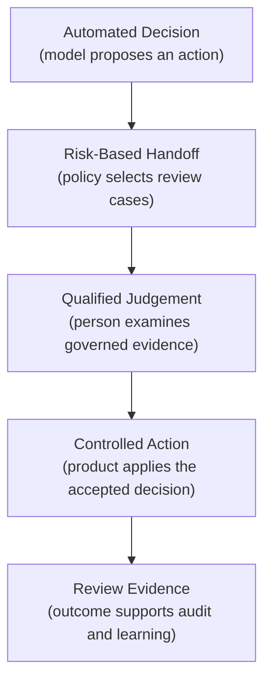
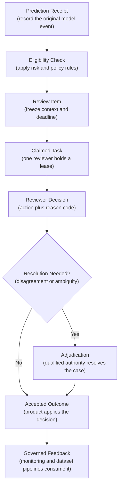
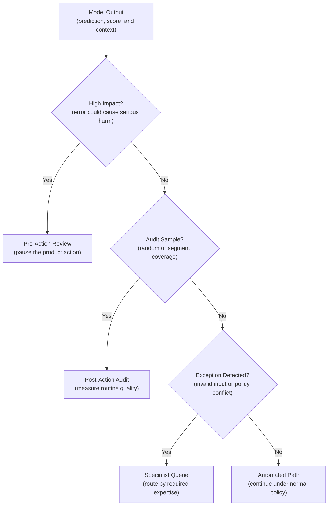
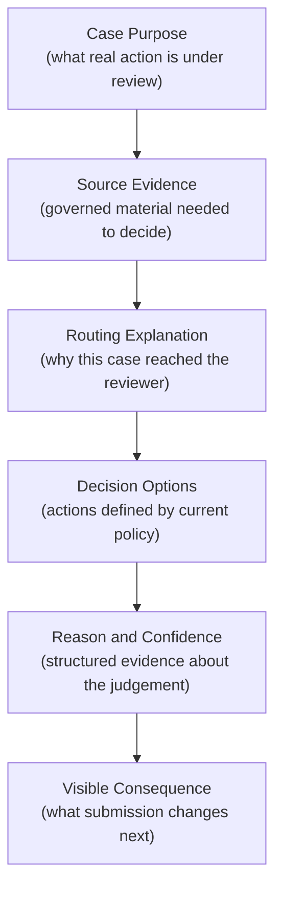
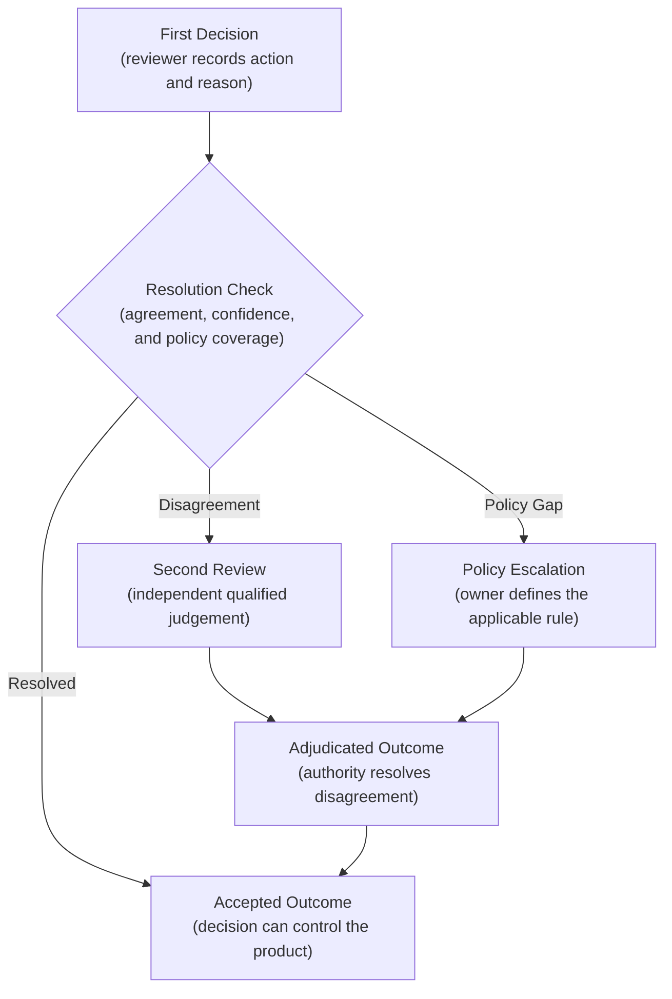
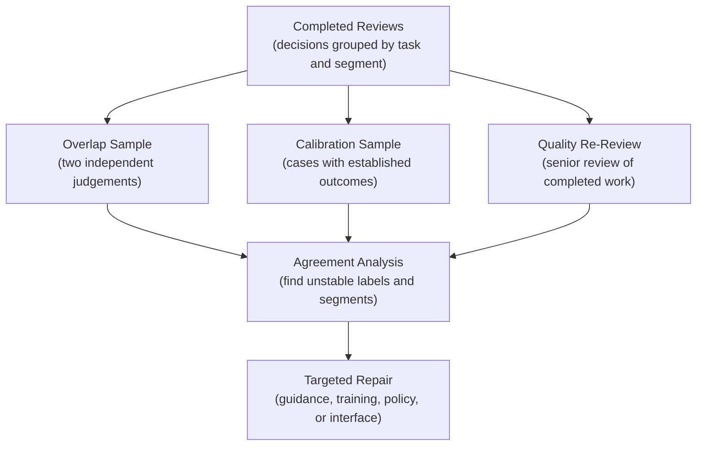
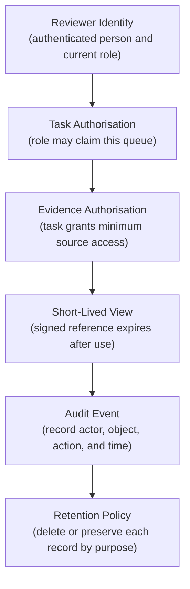
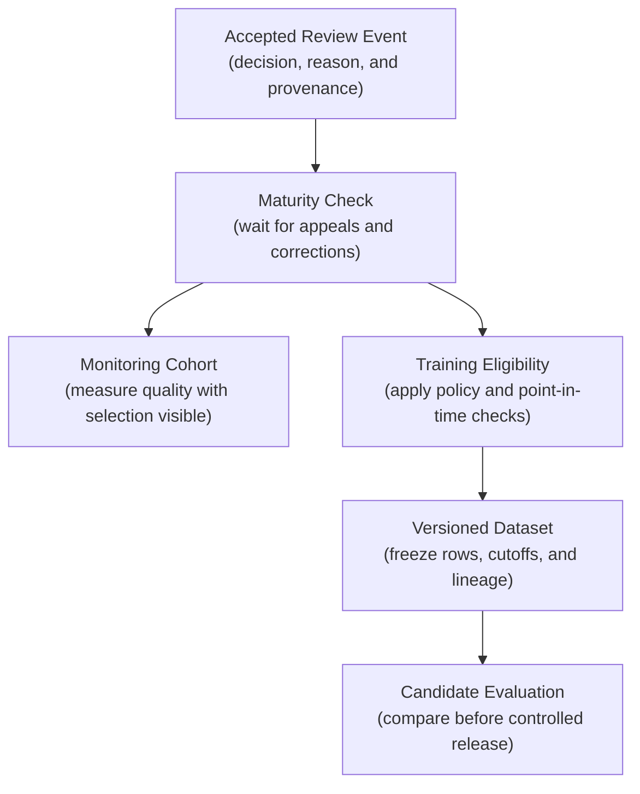
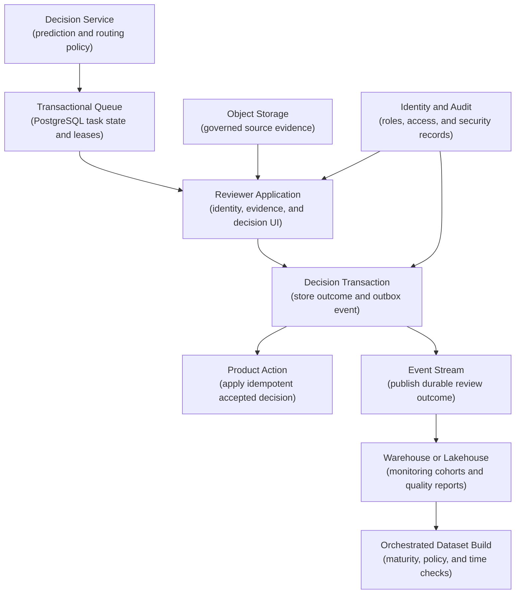

## Table of Contents

1. [What a Human Review Workflow Means](#what-a-human-review-workflow-means)
2. [How A Case Moves Through Human Review](#how-a-case-moves-through-human-review)
3. [Choose Which Cases Need Human Review](#choose-which-cases-need-human-review)
4. [What Information A Reviewer Needs](#what-information-a-reviewer-needs)
5. [How Reviewers Claim Work Without Duplicating It](#how-reviewers-claim-work-without-duplicating-it)
6. [Design The Interface For An Independent Human Decision](#design-the-interface-for-an-independent-human-decision)
7. [Define Review Decisions And Resolve Disagreement](#define-review-decisions-and-resolve-disagreement)
8. [Measure And Improve Reviewer Quality](#measure-and-improve-reviewer-quality)
9. [Limit Review Data By Privacy, Access, And Retention Rules](#limit-review-data-by-privacy-access-and-retention-rules)
10. [Set Queue Targets For Capacity And User Delay](#set-queue-targets-for-capacity-and-user-delay)
11. [Use Review Outcomes Safely In Monitoring And Retraining](#use-review-outcomes-safely-in-monitoring-and-retraining)
12. [How Human Review Fits Into Production](#how-human-review-fits-into-production)
13. [The Main Idea](#the-main-idea)
14. [References](#references)

## What a Human Review Workflow Means
<!-- section-summary: Human review is a controlled handoff from an automated decision to a qualified person who has the evidence and authority to act. -->

At a high level, **a human review workflow is the controlled handoff from an automated system to a qualified person.** The model still supplies a prediction, score, or extracted value. A person receives selected cases and examines the relevant evidence. Their decision then returns to the product through a controlled action.

Consider an invoice-processing system. A model reads a supplier's bank details from a PDF so the payment system does not require manual data entry for every invoice. Most documents match the supplier record and move through automatically. One invoice contains a new bank account and the scan is difficult to read. An accounts-payable specialist receives the case. Money stays inside the organisation until that person confirms the change against approved supplier evidence.

The person needs more than a button labelled **Approve**. The screen should show the source document and the existing supplier record. It should also explain the model's extracted value and the routing reason. The reviewer's role determines whether they may approve, correct, reject, or escalate the case. The workflow must prevent conflicting actions and preserve what each person saw.

This produces four connected responsibilities:



Human review does not make every automated decision safe. A poor interface can encourage rubber-stamping. An overloaded queue can delay urgent cases. An unqualified reviewer can add another source of error. The production design therefore covers the handoff, the person, the queue, the decision, and the later use of that decision.

## How A Case Moves Through Human Review
<!-- section-summary: The lifecycle moves one selected prediction through routing, evidence capture, assignment, decision, optional adjudication, and governed downstream use. -->

The review lifecycle follows one case from the model to a final, traceable outcome. Each stage answers a different question. The stages share stable identifiers, so the product can connect the model event, human decision, and final action. A missing stage leaves a practical gap. For example, a reviewer decision has little authority if no product transition consumes it. A product action cannot support a later audit if its review evidence was never preserved.

### The Seven Stages From Prediction To Final Outcome

1. **Eligibility** asks whether the case is allowed and required to enter review.
2. **Routing** selects the queue, priority, reviewer qualification, and deadline.
3. **Evidence capture** freezes the identifiers and context needed to understand the original decision.
4. **Assignment** gives one reviewer temporary ownership of the task.
5. **Decision** records the selected action and reason.
6. **Adjudication** resolves disagreement or ambiguity through a more authoritative review.
7. **Downstream use** applies the decision to the product and publishes a governed event for monitoring or model development.



### Choose Whether Review Happens Before Or After The Action

Two paths often share this lifecycle. **Pre-action review** pauses a product action until a person decides. The invoice bank-account change belongs on this path because the payment has not happened yet. **Post-action review** inspects a sample after the product has acted. A search-ranking team might ask assessors to judge a random sample of completed searches so it can measure relevance without delaying every user query.

The distinction matters because the workflow has different authority. A pre-action queue controls a live product decision and needs a safe fallback if reviewers are unavailable. A post-action queue produces audit evidence and can usually tolerate a longer deadline.

## Choose Which Cases Need Human Review
<!-- section-summary: Eligibility defines the handoff policy, while routing sends an eligible case to a queue with the right priority, skills, and deadline. -->

**Eligibility** is the rule that decides whether a prediction enters human review. **Routing** takes an eligible case and chooses who should see it, how urgent it is, and which review path applies.

### Route Cases According To The Source Of Risk

Teams commonly route cases for four reasons:

- **Impact:** an error could cause financial, safety, legal, or access harm.
- **Uncertainty:** the model has weak evidence or several plausible outputs.
- **Novelty:** the input differs materially from the data covered by validation.
- **Policy:** organisational or regulatory rules require a person with named authority.

Uncertainty needs careful treatment. A low confidence score can identify some difficult cases, although a model can also be confidently wrong.

### Sample Cases Outside The Model-Selected Queue

A stable random sample of ordinary traffic gives the team evidence outside the model's own uncertainty rule. Segment sampling adds coverage for important languages, devices, regions, or customer groups that overall traffic may hide.

Suppose a content-moderation model assigns a risk score to a post. The routing policy could send very high-risk content to a rapid pre-publication queue. A small proportion of medium- and low-risk content enters a blinded audit. Threats involving immediate physical harm go to a specially trained escalation group. Those paths support different actions and require different expertise.



A routing policy should identify the policy version and the selection probability for sampled work. The version explains why a case entered review. The selection probability supports weighted estimates later, because a queue that deliberately oversamples risky cases does not represent production traffic directly.

### Define What Happens If The Review Queue Is Overloaded

Queue capacity belongs in the policy. If an urgent queue reaches its safe limit, the system needs an explicit fallback. It may hold the action, apply a conservative rule, or page an authorised responder. Silently dropping review or raising the confidence threshold transfers risk to users without recording the change.

## What Information A Reviewer Needs
<!-- section-summary: A review item is an immutable record that connects the original prediction, routing rule, governed evidence, deadline, and permitted reviewer actions. -->

A **review item** is the durable record a queue gives to a reviewer. It should let another authorised person reconstruct the original decision later, even after the model, source data, or policy has changed.

### Link The Review Task To The Original Decision

At minimum, the item needs:

- a stable `review_task_id` and `prediction_id`;
- the model, feature, and routing-policy versions;
- the prediction, score, and decision timestamp;
- the reason for review, priority, deadline, and required reviewer role;
- governed references to the source evidence;
- the allowed decisions and active label-policy version;
- assignment, submission, escalation, and adjudication timestamps.

### Reference Sensitive Evidence Instead Of Copying It

The phrase **governed reference** is important. A review database rarely needs another unrestricted copy of a medical image, identity document, or customer conversation. It can store an object identifier. The interface then obtains short-lived access through the source system's normal authorisation path.

For a document-extraction case, one review item might look like this:

```json
{
  "review_task_id": "rvw_01J...",
  "prediction_id": "pred_01J...",
  "model_version": "invoice-extractor-27",
  "policy_version": "bank-change-review-4",
  "review_reason": "supplier_bank_account_changed",
  "priority": "high",
  "due_at": "<ISO-8601 deadline>",
  "evidence": {
    "invoice_object_id": "obj_8f...",
    "supplier_record_version": 312
  },
  "proposal": {
    "field": "bank_account",
    "value": "GB29..."
  },
  "allowed_actions": ["confirm", "correct", "reject", "escalate"]
}
```

The example contains identifiers and the proposed field. It avoids storing the full invoice in the task record. The interface resolves the object ID after checking the reviewer's role. The stored record also freezes the supplier record version, so an investigator does not unknowingly compare the review with a later edited supplier profile.

### Add Corrections Without Replacing Earlier Decisions

Immutability applies to decision evidence. A correction creates a new event linked to the original review. The original row remains intact. This preserves the first judgement and the later correction, together with each actor and authorising policy.

## How Reviewers Claim Work Without Duplicating It
<!-- section-summary: An atomic claim gives one reviewer temporary ownership, and a lease allows abandoned work to return safely to the queue. -->

Several reviewers may request work at the same time. A plain query such as `SELECT the oldest open task` can give the same task to two people before either request updates it. Both reviewers might then submit different answers or trigger the product action twice.

A **claim** is the atomic transition that assigns one task to one reviewer. A **lease** is the limited period for which that assignment remains valid. The reviewer can renew an active lease, submit a decision, or release the task. An expired lease allows the queue to recover work abandoned after a closed browser, lost connection, or crashed worker.

### Use One Transaction To Prevent Duplicate Ownership

PostgreSQL is a practical default for a moderate review queue because the task state and claim can share one transaction. The key operation is small:

```sql
BEGIN;

WITH next_task AS (
  SELECT review_task_id
  FROM mlops.review_tasks
  WHERE status = 'open'
    AND reviewer_role = 'payments-specialist'
  ORDER BY priority DESC, due_at, created_at
  FOR UPDATE SKIP LOCKED
  LIMIT 1
)
UPDATE mlops.review_tasks AS task
SET status = 'assigned',
    assigned_reviewer_id = $1,
    assigned_at = CURRENT_TIMESTAMP,
    assignment_expires_at = CURRENT_TIMESTAMP + INTERVAL '10 minutes'
FROM next_task
WHERE task.review_task_id = next_task.review_task_id
RETURNING task.*;

COMMIT;
```

`FOR UPDATE` locks the selected row until the transaction finishes. `SKIP LOCKED` tells another claimant to move past that row and choose different work. PostgreSQL documents this option for multiple consumers of a queue-like table. The query sees an inconsistent view because it skips rows held by other transactions, so it is unsuitable for ordinary analytics.

### Recover Expired Work And Guard Final Submission

Lease expiry needs a compare-and-set update. The recovery worker should reopen only an `assigned` task whose lease has expired and whose decision is still absent. Submission follows the same rule: update `assigned` to `submitted` only if the reviewer owns the active lease.

The submission request also carries an **idempotency key**, which identifies one logical action across retries. A repeated request with the same key returns the stored decision. A different second decision receives a conflict and enters the resolution path.

Tests should run simultaneous claims and confirm that each reviewer receives a different task. Another test should expire a lease and reclaim the task once. A submission retry should still produce exactly one product action.

PostgreSQL does not need to own every later use of the data. The transaction database can run the live queue, while completed review events flow to a warehouse or lakehouse for analytics and dataset construction.

## Design The Interface For An Independent Human Decision
<!-- section-summary: The interface gives reviewers the source evidence, task purpose, label definitions, and permitted actions without pushing them toward the model's answer. -->

The interface determines what judgement a reviewer can actually make. It should present the task as a real product decision, identify the evidence, and explain the consequence of each permitted action. A complete screen answers five questions in ordinary language:

1. What case am I reviewing?
2. Why did it reach this queue?
3. What evidence may I use?
4. Which decisions am I authorised to make?
5. What happens after I submit?

### Show The Evidence And The Effect Of Each Action

For the invoice example, the reviewer could see the original PDF beside the extracted bank account. The approved supplier account and the change that triggered review appear beside it. The screen offers confirm, correct, reject, and escalate as separate actions. A short policy definition explains what each action does. **Correct** requires a replacement value. **Reject** requires an applicable reason. **Escalate** records the missing evidence or authority that prevented a decision.

### Control How The Model Suggestion Influences The Reviewer

The model answer can either appear immediately or remain hidden for the first judgement. The choice follows the task. A time-sensitive operational review may need the proposal because the person is validating a specific action. A blinded quality audit should hide it until submission. The resulting audit measures an independent judgement with less influence from the screen.



Visual design can introduce automation bias. A large green model recommendation beside a small neutral alternative signals approval before the reviewer reads the evidence. Interfaces should use balanced choices and accessible colour. Keyboard navigation and explicit loading states also matter. A score such as `0.91` needs a defined meaning. The interface should present it as a probability only if calibration evidence supports that interpretation.

Tools such as Label Studio can provide configurable annotation screens and references to task data. They can also expose reviewer assignments and webhooks. A custom review application is often appropriate if the submission directly controls a product action or needs complex domain permissions. The surrounding system still owns durable task state, authority checks, and the product transition.

## Define Review Decisions And Resolve Disagreement
<!-- section-summary: A decision taxonomy defines the actions and reasons a reviewer can record, while adjudication resolves disagreement without erasing it. -->

A **decision taxonomy** is the controlled set of outcomes a reviewer may select. It prevents several situations from collapsing into a vague label such as `reviewed`. The product can then apply the right action, and the quality team can understand the reason behind it.

### Define The Actions A Reviewer Can Take

Reviewers usually need these distinct actions:

- **confirm** the proposed action;
- **correct** the output and supply the accepted value;
- **reject** the proposal without a replacement;
- **abstain** because the evidence cannot support a decision;
- **escalate** because a more qualified role or policy owner is required.

These outcomes describe different situations. Combining abstention and rejection into one label makes missing evidence look like a model error. Combining correction and escalation hides whether the first reviewer had enough authority to solve the case.

### Use Reason Codes To Measure Recurring Failures

A **reason code** records why the reviewer chose an outcome. For an extracted address, reasons might include `source_unreadable`, `wrong_field_boundary`, `supplier_record_conflict`, or `policy_exception`. The code supports reliable grouping. A short note can add case-specific detail. Free text alone produces many spellings and descriptions for the same recurring problem.

### Keep The Original Decisions During Adjudication

**Adjudication** is a second decision that resolves disagreement or ambiguity under a defined authority. Two assessors may disagree about whether a support message contains a threat. A specialist may also find that the current policy does not cover a new type of document. The workflow preserves both original judgements and adds the adjudicated outcome with its own actor, reason, and policy version.



Disagreement is valuable evidence. Repeated disagreement on one category may reveal vague instructions, insufficient source material, or a problem whose correct answer is genuinely subjective. Retraining a model on forced consensus would hide that uncertainty. The team should repair the policy or label definition first if people cannot apply it consistently.

## Measure And Improve Reviewer Quality
<!-- section-summary: Agreement, calibration tasks, sampled re-review, and segment analysis test whether human decisions are consistent and suitable for downstream use. -->

Human decisions vary. Expertise, fatigue, unclear guidance, difficult source material, and the interface can all affect a review. Throughput alone cannot show whether the decisions are trustworthy.

### Use Several Checks To Measure Reviewer Quality

Teams usually combine several quality controls:

- **overlap sampling** sends a controlled subset to two independent reviewers;
- **adjudication rate** shows how often ordinary review cannot settle a case;
- **calibration tasks** use cases with a carefully established answer to test guidance and training;
- **sampled re-review** asks a senior or quality team to inspect completed work;
- **segment analysis** compares quality across task type, language, source, reviewer group, and time;
- **reason-code review** finds categories that reviewers apply inconsistently.

**Inter-rater agreement** measures how often reviewers make compatible decisions on the same cases. Raw agreement is simple to explain: 90 matching decisions out of 100 overlapping tasks gives 90 percent agreement. It can overstate consistency if one label dominates. Cohen's kappa adjusts two-reviewer agreement for matches expected by chance. It still depends on label prevalence and does not prove that either reviewer is correct.

### Investigate Disagreement By Task And Segment

Suppose two assessors agree on 98 percent of ordinary support messages but only 61 percent of messages labelled as coercion. The lower result identifies the category that needs investigation. The team can inspect the source evidence, label definition, examples in the guidance, and interface. A blanket average would hide the weak category.



Quality checks should also guard against model copying. Assisted operational reviews and blinded audit reviews serve different purposes and need separate metrics. A fast assisted decision may be valid. One suspicious pattern combines near-universal acceptance with unusually fast completion on comparable tasks. Poor results on blinded or calibration cases strengthen that evidence.

## Limit Review Data By Privacy, Access, And Retention Rules
<!-- section-summary: Reviewers receive the minimum evidence their role needs, and every access and decision follows an auditable retention policy. -->

Review evidence can contain personal, financial, medical, or commercially sensitive information. The workflow should minimise exposure before the first task reaches a person.

**Least privilege** means that a reviewer receives only the permissions needed for their assigned work. A payments reviewer may view the invoice and approved supplier record for one task without gaining access to the entire finance bucket. A language specialist may see the text needed for a classification without seeing account fields that do not affect the decision.

### Authorise Access To The Task And Evidence Separately

The operational pattern usually includes:

- identity from the organisation's single sign-on provider;
- role and queue membership checked on every claim and evidence request;
- short-lived signed access to source objects;
- field masking or redaction before display;
- audit events for view, claim, decision, export, and escalation;
- separate retention rules for source evidence, review metadata, and free-text notes;
- a controlled break-glass path for exceptional access.



Free-text rationales deserve special attention because people may copy sensitive material into them. Structured reason codes reduce that pressure. If free text is necessary, the interface can state what belongs there and apply redaction controls. The field stays under the same access and deletion policy as the task.

### Keep Audit Records Without Copying Sensitive Content

Audit logs need protection from ordinary task editing. Each event should identify the actor, action, object, timestamp, and result. The events then flow to the organisation's security monitoring and retention path. A log entry containing the full sensitive document creates another uncontrolled copy and defeats data minimisation.

## Set Queue Targets For Capacity And User Delay
<!-- section-summary: Arrival rate, handling time, queue age, missed deadlines, and reviewer availability show whether the human layer can meet its product promise. -->

A review queue is a production service. Work arrives, waits, consumes specialist time, and must finish before the product's decision deadline. The team therefore needs both a user-facing objective and the capacity to support it.

A **service-level objective**, or **SLO**, is a measurable reliability target. An urgent payment-review queue might set an objective that 99 percent of eligible cases receive a decision within ten minutes. A post-action audit queue might target completion within two business days. The target should describe the whole path from eligibility to accepted decision, including adjudication if it blocks the product action.

### Measure Work Volume And User Delay

Five measurements give an operational picture:

- **arrival rate:** new tasks per minute or hour;
- **completion rate:** accepted decisions per minute or hour;
- **oldest-task age:** the wait of the task closest to harm;
- **deadline-miss rate:** the share completed after the SLO boundary;
- **available qualified capacity:** reviewers who can legally and practically handle each queue.

Queue depth alone can mislead. One hundred two-second checks may clear quickly. Twenty specialist investigations may take hours. Oldest-task age and expected handling time reveal the user impact.

### Estimate Reviewer Capacity From Arrival And Handling Time

Capacity planning can start with a simple relationship:

**required reviewer hours per hour = arrival rate × average handling time**

Suppose 120 tasks arrive each hour and the average review takes two minutes. The queue needs four reviewer-hours of work every hour. Staffing exactly four people leaves no room for breaks, case variation, training, or sudden traffic. At a target occupancy of 70 percent, the calculation suggests about six available reviewers: `4 / 0.70 = 5.7`.

The calculation is a starting estimate. Teams should split it by reviewer skill, priority, and time of day, then test it against observed tail wait and deadline misses. A senior-only escalation queue can fail despite spare capacity in a general queue because the available people lack the required authority.

An overload policy must protect the real action. Options include pausing the action, applying a conservative deterministic fallback, shedding low-priority audits, borrowing qualified capacity, or paging an incident owner. The dashboard should record which fallback is active so later outcome analysis does not treat the period as ordinary model behaviour.

## Use Review Outcomes Safely In Monitoring And Retraining
<!-- section-summary: Review decisions enter monitoring and model development with provenance, sampling information, maturity, and point-in-time boundaries intact. -->

A completed review provides feedback, although it is not automatically a clean training label. The queue selected the case for a reason. Uncertain, high-risk, and disputed predictions may be heavily overrepresented. Assisted reviewers may also have seen the model answer.

### Record Why Each Case Was Sent For Review

The feedback event should preserve:

- prediction, review, model, and policy identifiers;
- routing reason and sampling probability;
- assisted or blinded review mode;
- original decision, reviewer decision, and adjudicated outcome;
- reason code, reviewer qualification, and timestamps;
- correction, appeal, and maturity state.

Monitoring can use mature reviewed outcomes to estimate error rates for the reviewed population. A representative random audit supports broader production estimates. Analysts should report the coverage and selection route beside each metric. Risk-routed cases and ordinary traffic need separate views.

### Check Outcome Maturity And Point-In-Time Correctness Before Training

Training adds another boundary. The dataset builder must freeze an as-of cutoff and resolve corrections and appeals. It also reconstructs features from information available at the original prediction time. This prevents **label leakage**. Leakage occurs if later information enters an earlier training example and makes offline performance look unrealistically strong.



Review feedback can also reveal a non-model repair. Repeated `source_unreadable` outcomes may point to a scanning problem. A high `policy_exception` rate may call for new guidance. Rising queue age may require capacity or routing changes. The reason taxonomy helps send evidence to the team that owns the actual failure.

## How Human Review Fits Into Production
<!-- section-summary: The live review path uses transactional state and identity controls, while durable events feed analytical and model-development systems. -->

Most production designs separate the **operational path** from the **analytical path**. The operational path claims tasks and applies decisions. It needs low-latency transactions, strict authorisation, and idempotent product actions. The analytical path stores history, calculates quality metrics, and builds versioned datasets.

This separation prevents a slow dashboard query from blocking an urgent claim. It also keeps the source of truth for live task state small and transactional. The event path copies completed outcomes into systems designed for large scans and scheduled processing. Stable task and event IDs connect both sides.

### Use The Operational Path For Live Decisions



A practical default uses PostgreSQL or a managed PostgreSQL service for the live queue. An existing identity provider supplies reviewer identity and group membership. Sensitive evidence remains in governed object storage or the source application. The queue stores object references and policy versions.

The decision transaction can write the final state and an **outbox record** together. An outbox is a table of events waiting to be published. A relay sends those events to Apache Kafka or the organisation's managed event bus. This avoids a fragile dual write in which the database commits but the event publish fails. Consumers still use event IDs for idempotency because delivery and retries cross several systems.

### Use The Analytical Path For History And Dataset Preparation

Completed events land in the established warehouse or lakehouse for operational metrics, reviewer-quality analysis, and feedback cohorts. Airflow, Dagster, or a managed pipeline service can schedule audit sampling and build matured datasets. The orchestrator should not sit inside the synchronous claim transaction; the transactional database already owns that small state transition.

Label Studio can supply a configurable review interface for annotation-oriented tasks. Its official webhook documentation states that failed webhook deliveries are not retried. A production integration should use an idempotent receiver and reconciliation. Another safe design treats the durable review database and export path as the source of truth. Direct product actions need an application path with explicit authority and transaction controls.

The smallest useful stack may be one application and PostgreSQL. Kafka earns its place after several consumers need durable review events. A warehouse or lakehouse addresses large analytical history. A workflow orchestrator supports scheduled governance work. The architecture should grow from observed failure boundaries. A product checklist is a poor substitute.

## The Main Idea
<!-- section-summary: Human review works as a production control only if the handoff, evidence, authority, queue, quality, and feedback path are designed together. -->

Human review is a production decision system. Eligibility selects the cases that need people. Routing supplies the right priority and expertise. Immutable review items preserve the original context. Claims and leases prevent conflicting work. The interface supports an informed judgement, while decision taxonomies and adjudication keep disagreement visible.

The same system needs privacy controls and capacity targets. Quality measurement and tested fallbacks keep the human layer dependable. Its outcomes can improve monitoring and future models after the pipeline applies provenance, sampling, maturity, and point-in-time rules. These controls turn a person's click into accountable evidence that the product and MLOps lifecycle can safely use.

## References

- [NIST AI Risk Management Framework Core](https://airc.nist.gov/airmf-resources/airmf/5-sec-core/)
- [PostgreSQL: SELECT and `SKIP LOCKED`](https://www.postgresql.org/docs/current/sql-select.html)
- [Apache Kafka design: message delivery semantics](https://kafka.apache.org/43/design/design/)
- [Label Studio: import and reference task data](https://labelstud.io/guide/tasks.html)
- [Label Studio: configure webhooks](https://labelstud.io/guide/webhooks.html)
