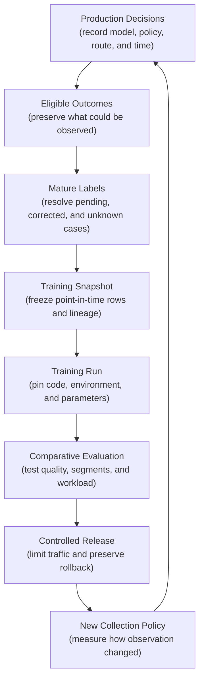
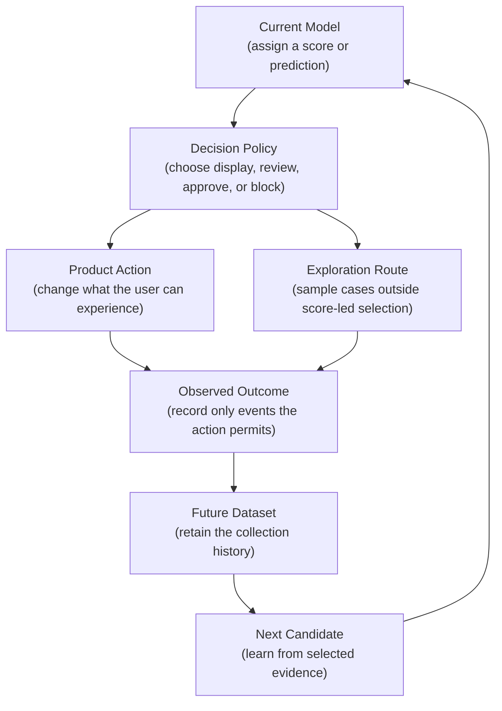
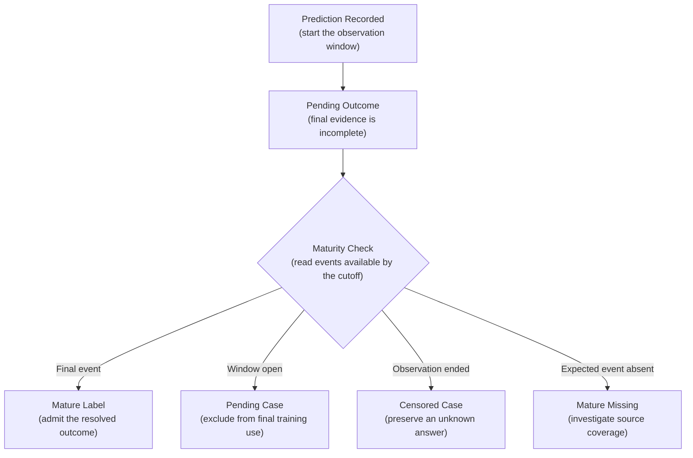
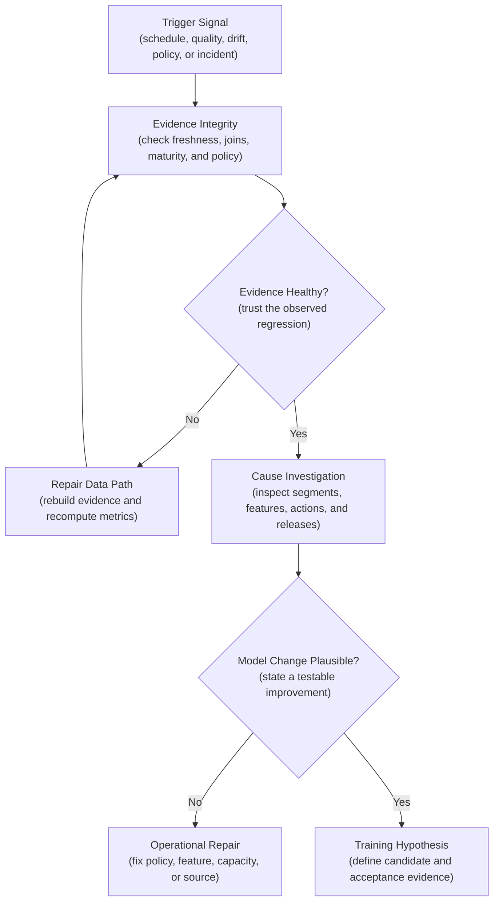
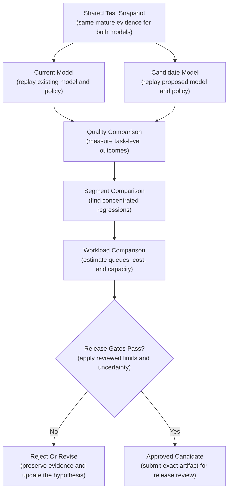
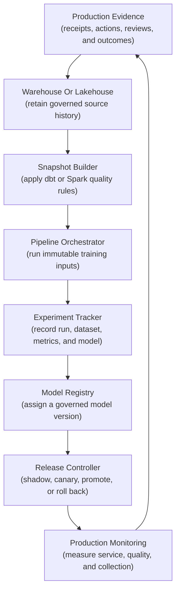

## Table of Contents

1. [What Retraining From Production Feedback Means](#what-retraining-from-production-feedback-means)
2. [Why Production Feedback Must Be Checked Before Retraining](#why-production-feedback-must-be-checked-before-retraining)
3. [Collect Approved Feedback Before Building The Training Dataset](#collect-approved-feedback-before-building-the-training-dataset)
4. [Wait Until Outcomes Are Complete Enough To Use](#wait-until-outcomes-are-complete-enough-to-use)
5. [Freeze The Exact Data Used For Training](#freeze-the-exact-data-used-for-training)
6. [Treat Every Retraining Trigger As A Claim To Investigate](#treat-every-retraining-trigger-as-a-claim-to-investigate)
7. [Run Reproducible Training](#run-reproducible-training)
8. [Compare The Candidate With The Current Model](#compare-the-candidate-with-the-current-model)
9. [Register The Model With Its Evaluation Evidence](#register-the-model-with-its-evaluation-evidence)
10. [Release The New Model Gradually](#release-the-new-model-gradually)
11. [Monitor How The New Model Changes Future Feedback](#monitor-how-the-new-model-changes-future-feedback)
12. [How The Complete Retraining Loop Works](#how-the-complete-retraining-loop-works)
13. [The Main Idea](#the-main-idea)
14. [References](#references)

## What Retraining From Production Feedback Means
<!-- section-summary: Retraining from production feedback turns governed production outcomes into a reproducible candidate and gives that candidate production authority only after comparative evaluation and a controlled release. -->

At a high level, **retraining from production feedback is the controlled process that uses real outcomes to develop the next model version.** The process selects suitable production evidence, freezes a reproducible dataset, trains a proposed model called a **candidate**, compares it with the model already serving users, and releases it under a limited blast radius.

Consider a support-routing model that chooses which specialist queue should receive each new case. Several weeks after deployment, the operations team sees a rise in billing disputes that were sent to the general-support queue. Resolved cases contain useful evidence about the correct destination. The team still cannot pour those recent outcomes straight into a training job.

Some cases are still open. The current routing policy sent difficult cases to senior reviewers, so those cases have better labels than routine traffic. Several records contain features updated after the original routing decision. A newly trained model might fix the billing-dispute problem while sending far more work to an already overloaded specialist queue.

The retraining loop controls each of those risks:



Each stage produces evidence for the next one. No stage grants authority by itself. A large label table proves that outcomes were collected; it says nothing about point-in-time correctness. A successful training job proves that an artifact was produced; it says nothing about product value. A registry entry gives the artifact a durable identity; the release system still decides whether that version receives traffic.

In essence, this is a learning loop with deliberate checkpoints. The checkpoints preserve the meaning of the data and keep one promising offline result from silently replacing a production decision system.

## Why Production Feedback Must Be Checked Before Retraining
<!-- section-summary: The deployed model and its surrounding policy influence which outcomes are observed, so production feedback carries the history of the system that collected it. -->

Production feedback differs from a clean classroom dataset because the deployed system helps create the data it later learns from. The model assigns a score, a policy turns that score into an action, and the action changes which outcomes people can observe.

Imagine a payment-risk system. Approved payments can later produce a chargeback outcome. Blocked payments never complete, so they cannot produce that same outcome. If the next training dataset treats every blocked payment as “no chargeback,” it teaches the model that blocking caused a safe outcome. The dataset has confused an unobserved outcome with a negative label.

Recommendation systems create a similar effect. A user can click only an item that was displayed. Search systems receive richer interaction data near the top of the ranking. Human-review queues collect more labels for cases the current model already considers risky. These are **feedback loops** because earlier predictions influence the evidence available to later models.



### Record Which Cases Entered The Feedback Data

**Selection bias** means the observed examples differ systematically from the population the model serves. A review queue filled by high risk scores contains many difficult cases. Its labels can be accurate and still provide a distorted picture of all traffic.

The data therefore needs the collection route beside the label. A natural product outcome differs from a case deliberately chosen by model score or random audit. User reports, appeals, and specialist escalations add their own selection rules.

That reason affects interpretation. The model and policy versions explain which rules selected the case. The product action explains which outcome remained observable. A sampling probability states how much of the eligible population the route represented.

A controlled random audit can provide evidence outside the model-selected queue. For example, a team may review a small approved sample of low- and medium-score documents in addition to every high-score document. That sample helps estimate how many errors the normal route misses. Safety, privacy, and legal constraints decide whether exploration is acceptable; some decisions permit no random exposure at all.

Analysts sometimes use **inverse propensity weighting** to compensate for unequal sampling. Each row receives a weight based on the inverse of its probability of selection. A case sampled at 5 percent represents more of the population than a case selected with certainty. This method needs trustworthy probabilities and population coverage. A route with zero chance of selection leaves no evidence to reweight, while tiny probabilities can create unstable weights. The snapshot should preserve the raw routes and probabilities even if the team chooses a different correction method.

### Keep Unobserved Alternative Outcomes Unknown

Some missing outcomes describe a world that never happened. A rejected loan reveals no future repayment behaviour for that decision. A blocked payment reveals no chargeback outcome for a completed transaction. A removed recommendation reveals no user response under continued exposure.

These are **counterfactual** questions: what would have happened under another action? Ordinary supervised retraining cannot recover the answer from the observed label alone. Approved experiments, expert audits, causal methods, or separate policy evaluation may add evidence. If those paths are unavailable, the limitation belongs in the evaluation report rather than being hidden through a guessed label.

The first gate therefore asks whether each row represents an observable, correctly attributed outcome. More data cannot repair a broken observation rule.

## Collect Approved Feedback Before Building The Training Dataset
<!-- section-summary: Training admission starts from the full population of prediction receipts and attaches outcomes under an explicit eligibility and use policy. -->

The feedback pipeline starts from prediction receipts rather than a table of successful label joins. A receipt uses `prediction_id` and prediction time to identify one production decision. It also records the model, policy, score, action, route, and an approved join key. Starting from the receipts keeps missing and pending cases visible.

Suppose a document classifier processed 100,000 files. Only 8,000 reached human review, and 7,600 received a final decision. A dataset built from the 7,600 reviewed rows reports perfect join coverage because every row already has a label.

Starting from all 100,000 receipts reveals the real structure. Another observation path covered 92,000 cases, while 400 review cases still lack a final decision. The training policy can now admit only the routes suitable for the intended target.

### Define Which Predictions Belong In The Dataset

**Observation eligibility** states whether a case had a real opportunity to produce the target outcome. **Training eligibility** adds stricter rules for admission to a model-development snapshot. A case may be useful for operational monitoring and still lack the maturity, consent, provenance, or point-in-time features required for training.

The eligibility policy answers concrete questions:

- Which production actions leave the target outcome observable?
- Which label sources carry enough authority for training?
- Which policy versions share the same meaning?
- Which rows require exclusion under privacy or retention rules?
- Which selection routes need separate reporting or weighting?
- Which cases remain pending, censored, disputed, or missing?

Warehouse SQL or Spark commonly implements the cohort join. The left side contains all prediction receipts in scope. The right side contains the authoritative outcome known by the declared cutoff. A left join preserves receipts with no outcome, so the pipeline can classify them explicitly instead of dropping them.

### Use Data Tests To Enforce Feedback Rules

The written policy needs executable checks. dbt data tests fit warehouse transformations, while Spark assertions, Deequ, Great Expectations, or platform-native expectations fit lakehouse and distributed pipelines. The tool matters less than the failing rows and the action taken after failure.

This dbt fragment checks three structural promises after the snapshot builder has applied the domain rules:

```yaml
models:
  - name: feedback_candidate_cohort
    columns:
      - name: prediction_id
        data_tests: [unique, not_null]
      - name: label_state
        data_tests:
          - accepted_values:
              arguments:
                values: [mature_observed, censored, mature_missing]
      - name: selection_route
        data_tests: [not_null]
      - name: training_eligible
        data_tests:
          - accepted_values:
              arguments:
                values: [true, false]
```

The `unique` and `not_null` tests protect the identity of each cohort member. The label states prevent an immature `pending` case from entering this published cohort. `training_eligible` then separates mature labeled rows from censored or mature-missing evidence without deleting the excluded cases. The selection route preserves the collection mechanism for evaluation.

Domain checks still need custom queries. These queries find group overlap across splits and feature timestamps later than prediction time. They also confirm that labels follow the approved policy and route totals reconcile with the source cohort.

A failed gate quarantines the candidate snapshot and records the offending rows. The data owner repairs the upstream transformation or policy mapping, rebuilds from the same source cutoff, and reruns the checks. Deleting failed rows merely to make the pipeline green would change the eligible population without review.

## Wait Until Outcomes Are Complete Enough To Use
<!-- section-summary: A maturity policy separates unfinished outcomes from final labels and preserves cases whose answer remains unknown. -->

Many labels arrive after the prediction. A chargeback can take weeks. An invoice labeled “unpaid after thirty days” needs the full thirty-day period. A moderation decision may remain open until an appeal window closes. Recent silence is therefore weak evidence.

Consider an invoice predicted to remain unpaid thirty days after its due date. Ten days later, no payment event exists. Writing `unpaid = 1` would declare failure too early. Writing `unpaid = 0` would treat missing evidence as success. The correct state is `pending` until the observation window closes or an authoritative event settles the outcome earlier.



### Do Not Treat Unknown Outcomes As Negative Labels

A case is **right-censored** if observation ended before the outcome window completed. An account may close, a sensor may stop reporting, or the dataset cutoff may arrive before a ninety-day target resolves. The available evidence leaves the final answer unknown.

Binary classifiers usually exclude censored rows from final supervised training unless the modeling method explicitly handles censoring. The snapshot still records their count by cohort, route, and segment. A sudden increase can reveal a source failure or a product change that removed observation opportunities.

**Mature missing** describes a different problem. The observation window closed and the system expected an outcome event, yet none arrived. The first investigation checks source freshness, ingestion success, join coverage, and policy versions. Retraining pauses until the team knows whether those rows represent a real absence or a broken feed.

### Rebuild Corrected Labels As They Were Known At A Chosen Time

Production labels can change. An appeal can reverse a review decision, a late payment can correct an invoice state, and an upstream system can repair a mistaken event. Overwriting the old row destroys the evidence used by an earlier training run.

Append-only outcome events preserve the sequence. A resolved view chooses the authoritative event available by a declared cutoff. A snapshot built today can include a correction received today; a past snapshot still reflects only the evidence available at its own cutoff. This is the **as-of rule** for labels.

Maturity and correction policy belong beside the dataset version. Otherwise, two teams can read the same outcome table on different days and silently train from different answers.

## Freeze The Exact Data Used For Training
<!-- section-summary: A training snapshot freezes eligible labels, prediction-time features, split rules, and lineage under one immutable identity. -->

After the labels are eligible and mature, the pipeline reconstructs the inputs that existed at each original prediction. This protects the model from **data leakage**, which occurs if training receives information unavailable to the production decision.

Suppose an account-risk prediction ran at 10:00. The account balance was £400 at that moment and changed to £40 at 11:30 after a payment. A training query that joins by account ID alone may attach the £40 balance to the 10:00 prediction. Offline evaluation then rewards the model for using a future event.

Point-in-time correctness adds time to the join. For each training observation, the feature builder selects the latest feature value available at or before the prediction timestamp. Databricks Feature Engineering supports point-in-time joins for time-series feature tables. Feast historical feature retrieval provides the same responsibility in an independent feature-store architecture. Warehouse teams can implement temporal joins in SQL, and Spark can construct them at distributed scale.

### Record When Events Happened And When They Became Available

One timestamp rarely covers the whole problem. **Event time** records the moment something happened in the source domain. **Available time** records the moment the training pipeline could have known it.

A bank transfer may occur at 09:55 and reach the feature table at 10:07. A prediction at 10:00 cannot use that transfer, even though its event time is earlier. Systems with material ingestion delay need both clocks or a conservative availability rule. The point-in-time join uses the clock that matches the actual serving path.

Feature values also need their transformation and source versions. Reconstructing the right raw rows with today's corrected feature logic can still produce a dataset different from the original logic. Teams either preserve versioned feature code and source snapshots or publish durable feature-table versions with enough retention for the required investigation period.

### Treat Every Training Snapshot As A Versioned Data Release

The pipeline writes a stable snapshot into the organisation's existing analytical platform. This may be a warehouse table, a Delta or Iceberg snapshot on object storage, or a versioned export with an immutable manifest. dbt is a strong fit for SQL-centered warehouse transformations. Spark fits large distributed joins. Delta and Iceberg provide table snapshots, although retention policies must preserve the files needed for future reconstruction.

The snapshot manifest records the facts a reviewer needs to reproduce the rows:

```yaml
snapshot_id: feedback-routing-v1842
source_cutoff: outcome-window-42
label_policy: routing-resolution-v7
feature_contract: routing-features-v11
split_policy: grouped-time-split-v4
collection_routes: [product_outcome, random_audit, human_review]
source_versions:
  prediction_receipts: 731
  resolved_outcomes: 418
  historical_features: 1264
quality_report: reports/feedback-routing-v1842.json
```

`snapshot_id` gives the training job one stable input. The three source versions identify the exact table states. The policy IDs preserve how labels, features, and splits were interpreted. The quality report contains row counts, exclusions, label maturity, join coverage, route proportions, segment coverage, and failed-record locations.

A useful rebuild test starts from an empty output location and reads the manifest. It reconstructs the snapshot, then compares the row count, schema, key set, split membership, and content digest with the published version. A version number without retained data files fails this test, so storage retention must cover the organisation's audit and rollback horizon.

## Treat Every Retraining Trigger As A Claim To Investigate
<!-- section-summary: A trigger starts an investigation and states the improvement the candidate must prove; it never guarantees that another model is the right repair. -->

A retraining trigger is a reason to investigate a new candidate. It can come from a schedule, confirmed prediction-quality decline, feature or traffic drift, a policy change, a new product population, or an incident. Each trigger carries a different hypothesis.

A batch demand forecast may need a planned seasonal refresh. A document classifier may need new labels after the organisation changes its taxonomy. A fraud model may show a sustained rise in mature false negatives for one payment route. The trigger should name the observed evidence, the affected population, and the expected improvement.

“Drift exceeded 0.2” is too weak on its own. Drift says the data changed according to a chosen statistic. That result cannot establish a prediction-quality decline or prove that fresh training data will repair the problem. The feature pipeline may have broken, the label feed may be late, or the decision threshold may need adjustment.

### Check Feedback Data Before Retraining

The first investigation checks the evidence system: snapshot freshness, schema changes, label volume, join coverage, maturity states, selection routes, and policy versions. The next pass compares affected segments, model routes, feature health, product action rates, and recent releases.

Suppose a dashboard reports a sudden fall in precision. The apparent decline starts on the same day that confirmed-positive labels arrive, while confirmed-negative labels retain a thirty-day delay. Recent cases therefore contain a one-sided label population. Retraining on that cohort would amplify the reporting problem. The correct response repairs the maturity view and recomputes the metric from a complete cohort.

Another incident may reveal stable labels and features, plus a genuine quality loss concentrated in a new document format. That evidence supports a training hypothesis: adding mature examples of the new format and improving its features should reduce misses without increasing false positives or review volume beyond agreed limits.



The trigger record travels into the training run and evaluation report. Reviewers can then ask whether the candidate solved the problem that justified its cost and risk.

## Run Reproducible Training
<!-- section-summary: Reproducible training pins the snapshot, code, environment, parameters, and outputs so a retry or investigation follows the same path. -->

The training pipeline converts the approved snapshot into a candidate model. Reproducibility means another run can identify and recover the same inputs and logic. Exact floating-point equality across hardware is a stricter goal that some regulated or high-risk systems may require.

### Use A Workflow Tool To Run And Record Training

A retraining run contains dependent steps: validate the snapshot, train the model, evaluate it, and publish the approved outputs. A workflow tool starts those steps in the required order, records their status, and retries work according to an explicit policy. This coordinating role is called **orchestration**, and the workflow tool is often called an **orchestrator**.

Airflow, Dagster, Prefect, or a managed ML pipeline commonly coordinates the cycle. Airflow fits organisations with an established task-orchestration estate and explicit data intervals. Dagster fits asset-oriented systems that treat snapshots, models, and reports as partitioned data products. SageMaker AI Pipelines, Vertex AI Pipelines, Azure Machine Learning pipelines, and Lakeflow Jobs reduce platform integration inside their respective environments.

The orchestrator owns run order, retries, parameters, and status. The warehouse or lakehouse owns the data rows. The training service owns compute. MLflow or a managed tracker owns experiment and model evidence. Keeping those boundaries clear prevents the orchestrator database from turning into an accidental artifact store.

A typical run resolves immutable inputs and validates the snapshot before training. It evaluates every candidate against the same baseline, writes the model and report, and submits the passing artifact for registration. A retry reads the same snapshot ID and container image digest. It never reruns a query against a moving `latest_feedback` table.

### Record Exactly What Produced Each Model

The run record links the trigger, snapshot, source revision, environment, configuration, random seeds, output model, and evaluation plan. Git identifies the training code. An OCI image digest identifies the packaged environment. MLflow Tracking can record parameters, datasets, metrics, artifacts, and the Logged Model created by the run.

Suppose a model's precision changes after a training retry. The team compares the two manifests. A different snapshot points to moving input data; a different image points to dependency drift; the same inputs with different results points toward stochastic training or nondeterministic compute. The manifest turns “we reran the notebook” into an investigation with named evidence.

Data validation runs before expensive training, and output validation runs before evaluation. A failed step leaves the candidate without release authority. The pipeline preserves logs, failure records, and partial artifacts according to retention policy, then resumes from the last trustworthy boundary or starts a clean run with a new identity.

## Compare The Candidate With The Current Model
<!-- section-summary: Comparative evaluation tests the candidate and current model on the same evidence across overall quality, important segments, and operational consequences. -->

A candidate earns consideration by improving the stated hypothesis without creating unacceptable regressions. Comparing it only with a fixed threshold such as “accuracy above 90 percent” misses the practical question: does this version improve the current production decision system?

Both models should receive the same untouched, mature test snapshot. Training and tuning data remain outside that comparison. A time-based split protects the evaluation from learning the future, while grouped splits keep closely related accounts, devices, sellers, patients, or documents inside one side of the boundary.

### Check Overall Metrics First

The metric must match the supported decision. A fraud detector may need recall at an acceptable false-positive rate. A demand forecast may need error by forecast horizon and business unit. A probability model may need calibration, so a score near `0.8` corresponds to roughly eight positive outcomes among ten comparable cases.

Uncertainty also matters. A one-point improvement on a small test set may reflect sampling noise. Confidence intervals, repeated temporal backtests, or statistical tests help reviewers judge whether the evidence supports a durable improvement.

### Check Segments For Hidden Regressions

An overall result can improve while one important group deteriorates. The evaluation therefore repeats the comparison across important segments. Routes and label sources reveal collection effects. Regions, languages, devices, and risk bands reveal concentrated product effects. Approved protected or operationally critical groups receive the same scrutiny.

Consider a ticket-routing candidate that reduces overall misroutes from 12 percent to 9 percent. The same candidate sends 40 percent more cases to the database-specialist queue because its threshold shifted. The queue already operates near capacity, so response time would rise even though the model metric improved.

This is an **operational workload** regression. The evaluation replays the decision policy around each score and estimates action volume, manual-review demand, capacity, cost, and fallback use. Threshold selection belongs in the comparison because the production system acts on thresholds rather than raw metrics alone.



MLflow's classic model-evaluation APIs can generate standard classification or regression metrics and artifacts. Custom evaluators or ordinary Python/SQL calculations still carry business-specific gates such as queue capacity, monetary loss, calibration by route, and policy compliance. The evaluation report links every result to the candidate model ID, baseline version, dataset snapshot, and threshold configuration.

## Register The Model With Its Evaluation Evidence
<!-- section-summary: Registration gives the candidate a governed identity and links its evidence; a separate release decision grants production authority. -->

A trained artifact needs a stable identity before another system can review or deploy it. A model registry supplies that identity through a registered name and immutable version.

The version points back to the source run and model signature. Tags and descriptions carry reviewed facts such as the problem type and validation status. Aliases give consumers a movable name for a selected version, while evaluation artifacts preserve the evidence behind that selection.

MLflow Model Registry is a common independent choice. Managed registries in SageMaker AI, Vertex AI, Azure Machine Learning, and Unity Catalog serve the same responsibility inside their platforms. Current MLflow workflows favor model versions, aliases, and tags; fixed lifecycle stages are deprecated.

Registration records which model passed evaluation. Production authority comes from a separate release decision. An alias such as `candidate` or `champion` helps software find a version. The release record preserves the approval, deployment target, traffic plan, evidence links, owner, and rollback version. A mutable alias alone would lose that history after reassignment.

Imagine that run `r-918` logs two checkpoints. Only the second passes the segment and workload gates. The registry version points to that exact Logged Model rather than the run in general. The release record then identifies the registered version, serving image, feature contract, threshold policy, and previous stable version. Reviewers can trace one production decision back through every boundary.

Signature validation and a representative input example catch interface mismatches before deployment. Security scanning, dependency policy, license checks, and access controls apply to the model package just as they do to other release artifacts. A failed gate leaves the version registered for investigation without granting it traffic.

## Release The New Model Gradually
<!-- section-summary: Progressive release limits exposure, measures fast safety signals, and keeps the previous model and compatible data path ready for rollback. -->

Offline evaluation cannot reproduce every production dependency, traffic pattern, or user response. A controlled release exposes the candidate to a bounded part of the live system and watches the evidence needed for a safe decision.

The first production step may be **shadow evaluation**, where the candidate receives copied requests and produces no user-facing action. Shadowing tests input compatibility, latency, resource use, and score behaviour. It cannot fully measure outcomes created by real candidate actions because the current model still controls the product.

A **canary** gives the candidate authority over a small, well-defined share of eligible traffic. Managed endpoints often provide weighted traffic splitting. Kubernetes teams can use Argo Rollouts with an ingress or service mesh for controlled weights and analysis-driven promotion or abort. A simple batch system may publish candidate output to a separate table and compare it with the stable job before consumers switch.

### Watch Fast Signals During The First Release Stage

Many outcome labels mature too slowly for the first rollout decision. The release therefore combines fast guardrails with later quality evidence. Fast signals include request errors, latency, feature-contract failures, score distribution, product action rate, queue volume, fallback use, and segment exposure. They can stop a harmful release before final labels arrive.

Suppose a candidate preserves offline recall yet doubles the number of cases sent to manual review during a 5 percent canary. Queue age starts rising and the review service approaches its capacity limit. The release controller pauses or aborts the canary. The team examines threshold behaviour and workload estimates before producing another release proposal.

### Restore The Last Approved Release If Gates Fail

Rollback needs more than the previous model file. The serving system preserves the stable model version, compatible feature path, preprocessing image, threshold policy, and routing configuration. The release record identifies that complete path.

After an abort, traffic returns to the stable route. The team verifies service recovery, action rates, queue depth, and decision logging. Candidate evidence remains available for investigation. Deleting the failed version would remove the link between affected predictions and the artifact that produced them.

Delayed quality metrics continue to mature after traffic returns. They can reveal a problem missed by the fast guardrails and improve the next evaluation plan.

## Monitor How The New Model Changes Future Feedback
<!-- section-summary: A new model changes routing, actions, and observation coverage, so the team monitors the feedback process as part of the release. -->

Every release changes the environment that will train its successor. A new score distribution moves cases across thresholds. A new threshold changes review volume. A new recommendation changes exposure. The next label population therefore belongs to a new collection policy.

Suppose a fraud candidate sends twice as many payments to review. Confirmed fraud rises during the same period. That rise could describe a more dangerous population, stronger detection, broader inspection, or a change in reviewer behaviour. Comparing raw label counts across the boundary cannot separate those explanations.

The prediction receipt records the model version and decision-policy version for every case. Monitoring breaks label coverage, maturity, selection route, action rate, audit allocation, and join success down by those versions. The team can then see whether a quality change arrived with the model, the policy, or the evidence system.

### Keep A Representative Sample Outside Score-Based Selection

A stable random audit or another approved measurement route protects visibility outside the model's preferred cases. Its allocation, sampling probabilities, reviewer capacity, and segment coverage need monitoring. A model that captures more high-risk cases may still reduce the audit sample if both routes compete for one fixed review budget.

If exploration coverage falls below its approved floor, the team can pause training admission, restore audit capacity, and rebuild the snapshot after enough representative outcomes mature. This containment prevents a candidate from training mainly on cases selected by its own predecessor.

### Repair Feedback Data Distorted By Earlier Decisions

An investigation starts by locating the boundary where evidence changed: prediction logging, routing policy, outcome source, maturity logic, snapshot builder, or release. The team freezes affected snapshots, marks their training eligibility, and keeps the raw governed evidence available.

A repaired cycle replays from the earliest trustworthy source. The new snapshot receives a new identity and a reconciliation report that compares row counts, route proportions, missingness, maturity, and segments with the affected version. Training resumes only after the collection policy and dataset gates return to their intended state.

This monitoring work closes the loop. Production quality, data quality, and collection quality are separate signals, and all three shape the next candidate.

## How The Complete Retraining Loop Works
<!-- section-summary: Industrial retraining connects existing data, orchestration, tracking, registry, release, and monitoring systems through immutable evidence. -->

Most teams can build this lifecycle from the platforms they already operate. Prediction receipts and outcomes land in a warehouse or lakehouse on object storage. dbt or Spark resolves eligibility, maturity, and point-in-time joins. Airflow, Dagster, or a managed pipeline coordinates the snapshot, training, and evaluation steps. MLflow or a managed experiment tracker records the run and trained artifact. A registry gives the passing candidate a governed version. Managed endpoint traffic controls or Argo Rollouts limit production exposure. Existing telemetry and ML monitoring measure the new release and its collection policy.



Teams select only the components their scale and existing platform justify. A small implementation can keep evidence and snapshot SQL in one warehouse. A managed training job supplies compute, MLflow records the model, and a managed endpoint controls release.

A larger estate may move snapshot joins to Spark and coordinate partitions through dedicated orchestration. It may reuse temporal features through a feature platform and run progressive delivery on Kubernetes. Both designs still provide trustworthy evidence, reproducible inputs, comparative proof, bounded authority, and a measurable next collection cycle.

## The Main Idea
<!-- section-summary: Production feedback supports safe learning only after the system preserves how the evidence was observed and proves each new candidate against the current production decision. -->

Production feedback carries two stories. It records what happened after a model decision, and it records which decisions the current model and policy allowed the team to observe.

A reliable retraining process preserves both stories. It admits eligible mature outcomes, freezes point-in-time inputs, records the training run, compares the candidate with the current model, and limits production authority through a reversible release. After release, it measures the changed collection policy so the next dataset has an honest provenance.

That is the difference between repeatedly fitting fresh data and operating a production learning system.

## References

- [Google Rules of Machine Learning](https://developers.google.com/machine-learning/guides/rules-of-ml)
- [Google Research: Hidden Technical Debt in Machine Learning Systems](https://research.google/pubs/hidden-technical-debt-in-machine-learning-systems/)
- [Databricks Point-in-time feature joins](https://docs.databricks.com/aws/en/machine-learning/feature-store/time-series)
- [Feast Point-in-time joins](https://docs.feast.dev/getting-started/concepts/point-in-time-joins)
- [Delta Lake table batch reads and writes](https://docs.delta.io/delta-batch/)
- [dbt data tests](https://docs.getdbt.com/docs/build/data-tests)
- [Apache Airflow timetables](https://airflow.apache.org/docs/apache-airflow/stable/authoring-and-scheduling/timetable.html)
- [Dagster partitioning assets](https://docs.dagster.io/guides/build/partitions-and-backfills/partitioning-assets)
- [MLflow Experiment Tracking](https://mlflow.org/docs/latest/ml/tracking/)
- [MLflow Model Evaluation](https://mlflow.org/docs/latest/ml/evaluation/)
- [MLflow Model Registry workflows](https://mlflow.org/docs/latest/ml/model-registry/workflow/)
- [Argo Rollouts Analysis and Progressive Delivery](https://argo-rollouts.readthedocs.io/en/stable/features/analysis/)
