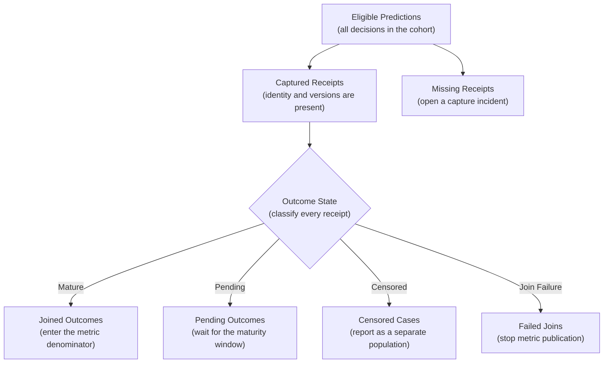

## Table of Contents

1. [What Prediction Quality Means After Deployment](#what-prediction-quality-means-after-deployment)
2. [Record Every Important Prediction](#record-every-important-prediction)
3. [Wait For Real Outcomes Before Calculating Final Quality](#wait-for-real-outcomes-before-calculating-final-quality)
4. [Compare Predictions From The Same Time, Release, And Population](#compare-predictions-from-the-same-time-release-and-population)
5. [Choose a Metric That Matches the Real Mistake](#choose-a-metric-that-matches-the-real-mistake)
6. [A Global Average Can Hide a Local Failure](#a-global-average-can-hide-a-local-failure)
7. [How Teams Build the Monitoring Loop](#how-teams-build-the-monitoring-loop)
8. [Respond To Quality Alerts Without Causing More Harm](#respond-to-quality-alerts-without-causing-more-harm)
9. [How The Complete Quality-Monitoring Loop Works](#how-the-complete-quality-monitoring-loop-works)
10. [References](#references)

## What Prediction Quality Means After Deployment
<!-- section-summary: Prediction-quality monitoring checks whether live model outputs still agree with real outcomes and still support the product decision they were built for. -->

**Prediction-quality monitoring** is the ongoing practice of checking whether a deployed model's predictions remain accurate and reliable enough for the decisions they support. During development, you can evaluate a model on a test dataset whose answers are already known. Production is different. New cases arrive every day. Correct answers often arrive later. The people or systems using the prediction may also change how they act on it.

Imagine a model that estimates the sale price of a home. It returns a price for every request, the API stays fast, and every response has the expected JSON shape. Six months later, the estimates are regularly £80,000 above the final sale price in city-centre neighbourhoods. From a software-health point of view, the service is working. From the buyer's point of view, the model has stopped being reliable.

This quiet gap between a successful response and a useful prediction is why prediction-quality monitoring exists. The direct evidence comes from comparing a prediction with the outcome it tried to predict. For the home-price model, that means joining each estimate to the later sale and measuring the size and pattern of the errors.

**Drift** provides a different kind of evidence. Data drift reports that live inputs have moved away from a reference distribution. Concept drift describes a change in the relationship between inputs and outcomes. Both can warn that quality is at risk, especially during the weeks before enough outcomes mature. Neither one proves that the model has become inaccurate. A change in property size may leave price errors unchanged. Buyer preferences can also change prediction quality even though the input distribution still looks familiar.

Quality can also fall because a feature pipeline serves stale values. A new threshold may change the product action, or the outcome data may stop joining correctly. A useful monitor separates these causes. Retraining is one possible response among several; a broken label join, stale feature, or policy change needs a different repair.

The job therefore follows a loop from one prediction to its later outcome, comparable measurement, and a controlled response. What did the model predict? What did the product do with that prediction? What actually happened? Are we comparing the same kind of cases? Is the difference large enough to matter? What should the team change? The rest of the article builds that loop one part at a time.

## Record Every Important Prediction
<!-- section-summary: A prediction record preserves enough information to explain which model produced an output and how the product used it. -->

A production prediction needs a durable **prediction record**. You can think of this record as a receipt. It preserves the information required to reconstruct the decision after the real outcome arrives and gives every later investigation a stable place to start.

Assume the serving path already emits a privacy-controlled prediction record through a reconciled asynchronous capture path. Prediction-quality monitoring begins after that evidence is trustworthy. Its concern is narrower: does the receipt contain the fields needed to attach a later outcome and compare like with like?

For that job, `prediction_id` and decision time identify the case and place it in the correct production window. Model and preprocessing versions explain which implementation produced the output. The output, policy version, and product action separate model behaviour from the rule that used it. Approved segment keys let the report find important differences inside the population. The join key for the later outcome must keep the same meaning for the full outcome window. A segment such as region belongs here only when the team has a legitimate reason and enough examples to measure it safely.

The distinction between prediction and action matters. Suppose a fraud model returns a risk score of `0.72`. One policy approves scores below `0.80`, while a later policy sends scores above `0.65` to manual review. The model output stayed the same and the action changed. A quality report that records only the score can wrongly blame the model for a policy change; `policy_version` and `action` preserve the separation.

A compact monitoring row makes that separation concrete:

```json
{
  "prediction_id": "pred_01K0Q7H7T8Z6M3X2",
  "prediction_time": "<RFC 3339 timestamp>",
  "model_version": "price-v18",
  "preprocessing_version": "property-features-v12",
  "policy_version": "listing-v4",
  "prediction": {"sale_price_gbp": 485000},
  "action": "show_estimate",
  "segment": {"region_group": "city-centre"},
  "outcome_join_key": "sale_8F31"
}
```

Store this row in a governed decision table. Metric labels are too small for request-level evidence. Broad application logs rarely provide the retention, schema, and access rules required for a months-later outcome join. The later sale outcome joins through the controlled key, while the prediction, policy, and action remain separate fields. A privacy review decides whether the segment and join key may be retained and who can query them.

Before computing quality, the monitoring job checks the selected prediction IDs for uniqueness and required versions. It verifies the outcome key and reconciles receipt coverage with the complete service-level prediction count. If the capture feed is incomplete, the job publishes a data-quality incident and withholds the quality claim. This protects later calculations from producing precise metrics over an untrustworthy population.

The receipt forms the stable left side of the outcome join. The remaining work decides whether the right side is mature and which predictions belong in the same cohort. It then asks whether the evidence is strong enough to change production.

## Wait For Real Outcomes Before Calculating Final Quality
<!-- section-summary: Outcomes turn predictions into measurable evidence, and maturity rules prevent incomplete recent cases from distorting the result. -->

An **outcome**, often called a ground-truth label, is the real event used to judge a prediction. A home-price prediction can be compared with the final sale price. A delivery estimate can be compared with the actual arrival time. A fraud prediction may have to wait for a confirmed chargeback.

Some outcomes arrive in minutes, while others take weeks or months. The monitor therefore needs an **outcome maturity rule**. This rule states how long a case must remain open before its outcome is reliable enough for a final quality measure.

### Exclude Recent Cases Until Outcomes Are Complete

Consider a model that predicts whether a customer will cancel a subscription within 90 days. After two weeks, most customers have neither cancelled nor completed the full 90-day period. Counting every active customer as a successful negative prediction would make the model appear unusually accurate. The honest status for those cases is **pending**. Early evidence such as a cancellation request can appear on a separate panel, while the final metric waits for the full maturity window.

The same principle applies when labels arrive late or receive corrections. A disputed payment may first appear legitimate and later turn into a confirmed chargeback. The monitoring data should retain the original outcome, the correction, and the time each state became known. That history lets the team recompute the same prediction group without pretending that the final answer was available earlier.

Production teams usually make these rules explicit in a **label contract**. The contract identifies the source event and the key that connects it to a prediction. It separates an early useful signal from the rule for a final mature label, then states how corrections and arrival delays are handled. A named owner resolves changes to those rules. For a delivery estimate, `delivered_at` may be final within hours. For a credit decision, a delinquency label may need 90 days plus a short ingestion allowance. Giving both labels the same daily freshness target would create a false expectation for one and a dangerously slow response for the other.

### Record When Outcomes Happened And When They Arrived

The outcome pipeline keeps event time and observation time separate. Event time says when the outcome happened; observation time says when the monitoring system learned about it. This distinction matters during backfills. A chargeback created on Monday and imported on Thursday still belongs to Monday's business event. Thursday's observation time explains its absence from earlier monitoring runs. Versioned outcome rows or a warehouse snapshot preserve this history. The cohort job selects the newest outcome state known as of its run time.

In a warehouse-first implementation, product events or change-data capture land in BigQuery with both timestamps. A dbt incremental model turns those events into versioned label states, and Airflow passes an explicit `as_of_time` into the cohort build. Suppose Thursday's load contains a correction for Monday. The workflow rebuilds the affected Monday cohort as a new metric revision, while the earlier published run remains available for audit. The revision history reveals whether reality changed or the monitoring system received better evidence.

### Some Product Decisions Prevent Outcomes From Being Observed

There is a harder problem when the product action changes whether an outcome can ever be observed. If a payment is blocked, nobody gets to see whether approving it would have caused a chargeback. If only high-risk cases receive human review, the reviewed labels describe a model-selected group rather than all traffic. This missing view of the alternative action is called **censoring**.

Teams handle censoring carefully because measurement never justifies exposing users to unacceptable risk. A low-risk recommendation system may use a small random holdout to learn what happens without the normal ranking rule. A payment team may send a bounded sample to trained reviewers and combine that evidence with later disputes. The product and risk owners define the eligible cases, sampling rate, safety budget, and stop condition before the measurement starts.

The decision service records which cases entered the sample and the probability of selection. Once outcomes mature, the measurement owner checks whether the observed sample matches the intended design and whether important segments received enough coverage. If the review queue, loss estimate, or customer impact crosses its approved limit, the sampling policy rolls back immediately. Some outcomes will remain unknowable, and the published metric should say which population it genuinely represents.

For example, a payment team may review a random sample of low-risk approvals because blocking a payment hides the outcome that approval would have produced. The sampling service records eligibility, selection probability, reviewer result, and final dispute status. The monitor reports both the raw result and the weighted estimate for the eligible population, with the sampling assumptions visible. If reviewers fall behind, the sample shrinks before the queue changes which cases receive labels. This keeps the measurement process from creating an operational problem of its own.


*Decision time, event time, and observation time describe different moments. Only a mature outcome enters the final quality result; pending, censored, and missing states remain visible.*

## Compare Predictions From The Same Time, Release, And Population
<!-- section-summary: A cohort groups predictions by time, version, policy, and maturity so the resulting quality comparison has a stable meaning. -->

A **cohort** is the exact group of predictions included in one result. In ordinary language, it means “the cases we are grading together.” Production traffic, model versions, policies, and label availability all change over time. The cohort definition fixes those moving boundaries for one measurement.

### Use Prediction Time To Select The Model Version

Suppose a home-price model version changes on 1 June. A sale completed on 15 June may belong to a prediction made in March by the previous version. Grouping results by sale date would mix the two versions. The cohort should begin with prediction time, then attach outcomes when they mature.

A useful cohort definition starts with the prediction window and the outcome maturity period. It then identifies the model, policy, and segment being measured. These boundaries tell the reader exactly which production decisions the result describes.

Coverage is reported beside the metric. The report separates predictions with a mature outcome from cases that remain pending. It also shows censored cases and records whose outcome failed to join. Those counts protect the metric from a common failure: a broken outcome feed can remove difficult cases and make quality appear to improve.

### Define Exactly Which Predictions Belong In Each Comparison

The following warehouse query shows the central idea. The SQL dialect may change, while the time and version boundaries remain the important part:

```sql
SELECT
  model_version,
  policy_version,
  region,
  COUNT(*) AS mature_predictions,
  AVG(ABS(predicted_price - sale_price)) AS mean_absolute_error
FROM monitoring.property_price_outcomes
WHERE prediction_time >= :cohort_start
  AND prediction_time < :cohort_end
  AND prediction_time < :as_of_time - INTERVAL '60 days'
  AND outcome_status = 'mature'
GROUP BY model_version, policy_version, region;
```

This query grades only predictions old enough to have a mature sale outcome. It keeps model and policy versions visible and calculates the error by region. A production job also reconciles the rows around this query: eligible predictions, matched outcomes, duplicates, orphan outcomes, and pending cases. The final error value is trustworthy only when those surrounding counts make sense.

The cohort table is normally an incremental, reproducible data product. A one-off query behind a dashboard cannot provide the same revision history. For source data already in a warehouse, dbt can build and test the cohort in SQL. Spark fits lakehouse-scale histories and large backfills. The transformation writes a candidate partition for a specific `cohort_start`, `cohort_end`, and `as_of_time`. Data tests then check key uniqueness, accepted maturity states, outcome relationships, and coverage limits before that partition is published.

Late outcomes make idempotency important. A rerun after a backfill should update each affected prediction once. It should also preserve the earlier run for audit and produce a visible metric revision. A practical table keeps `cohort_definition_version`, `metric_definition_version`, `computed_at`, and the source snapshot identifiers beside the result. Investigators can then answer whether a chart moved because production changed or because a corrected label arrived.

### Track Missing Labels And Cohort Coverage

Suppose an orchestrated job expects 600,000 eligible predictions. It finds 599,700 unique receipts and 520,000 mature outcomes. Another 77,000 cases remain pending, 1,900 are censored, and 800 have failed joins. Those numbers tell a coherent story. If the next run still has 520,000 mature outcomes but only 260,000 matches, metric publication should stop. The orchestrator opens a data incident. Publishing the resulting MAE would give a precise number built from a damaged population.

Every eligible prediction should end in one named evidence state. That accounting rule prevents missing rows from disappearing between capture and metric calculation.



In the numeric example, the 300 missing receipts indicate a capture problem and the 800 failed joins indicate an outcome-linking problem. Pending and censored cases have known meanings, so they stay visible outside the final denominator. An unexpected change in any state triggers an evidence investigation before the team interprets MAE, recall, or another model metric.


*The cohort accounts for every eligible prediction. Missing receipts open a capture incident, and failed joins stop metric publication instead of disappearing from the denominator.*

## Choose a Metric That Matches the Real Mistake
<!-- section-summary: Quality metrics should reflect the type of prediction, the cost of each error, and the capacity of the process that acts on the result. -->

A **quality metric** turns many prediction errors into a number that can be tracked. The team can compare time windows, model versions, and segments using the same definition. The size and reliability of the change then guide the response.

The choice carries real product meaning because different metrics reward different behaviour. A measure that treats every error equally may suit one decision and hide the expensive mistakes in another. The team therefore starts with the prediction task and the harm created by each kind of error.

### Regression Metrics Measure the Size of a Miss

For a home-price model, **mean absolute error**, or MAE, answers a direct question. On average, how many pounds separate the estimate from the sale price? **Root mean squared error**, or RMSE, gives extra weight to large misses. A stable MAE can hide a growing number of extreme errors, so teams often inspect error percentiles and regional error alongside the average.

The unit keeps the result understandable. An MAE of `£24,000` has direct product meaning. An RMSE of `£51,000` beside that result says a smaller number of very large misses are pulling the squared-error measure upward. The investigation should inspect those cases before anyone changes the model solely to improve the average.

### Classification Metrics Describe Different Error Types

Classification models need a different view. For a fraud model, **precision** asks how many flagged payments were actually fraudulent. **Recall** asks how much fraud the model found. Raising the review threshold may improve precision because analysts see fewer weak cases, while recall falls because more fraud passes through. Neither number can choose the threshold alone.

The product process supplies the missing context. If investigators can review 1,200 cases each day, a threshold that produces 1,700 cases creates a growing queue even when recall improves. The team may choose an intermediate threshold, add review capacity, or apply the more sensitive threshold only to high-loss segments. Queue size and wait time belong beside the model metric because the decision depends on both.

### Ranking and Forecasting Need Their Own View

A recommendation or search model usually ranks items instead of making one yes-or-no decision. **Precision at k** asks how many of the first `k` results were relevant. **Recall at k** asks how much of the available relevant material appeared in those positions. The value of `k` should match the product surface. A three-card home screen and a fifty-result search page do not expose the same decision space.

A forecasting model needs error by horizon. A demand forecast can look healthy one day ahead and fail badly four weeks ahead. Teams report MAE or a scale-aware forecasting metric for each useful horizon and inspect seasonal periods separately. Combining all horizons into one number can hide the exact period used for purchasing or staffing.

### Calibration Checks Whether a Score Behaves Like a Probability

Probability scores also need **calibration**. A calibrated risk score of `0.8` means that roughly eight out of ten comparable cases with that score eventually produce the event. A model can rank cases in the right order while its probabilities grow too high or too low. That failure matters when the score drives prices, credit limits, staffing, or another decision that treats the number as a probability.

### Version Metric Definitions And Release Rules

Metric definitions need versions just like model code. Libraries can use different averaging rules, class handling, and thresholds. Teams keep a small fixture containing known predictions and outcomes. The monitoring job must reproduce the expected denominator and result before a metric change reaches production.

Metrics also need a decision rule. Teams often combine an absolute guardrail with a relative comparison and a minimum sample size. For example, mature recall below `0.82` can block a release. A drop of more than five percentage points against the approved route can also block it after at least 5,000 positives have matured. The absolute rule protects the minimum acceptable service. The relative rule catches a candidate that is materially worse even though both routes remain above that minimum.

Uncertainty belongs in the decision as well. A bootstrap interval can show how much MAE might vary across resampled cases, while a binomial interval can describe uncertainty around a classification rate. The exact method depends on the metric and sampling design. In simple terms, a monitoring number is an estimate from a finite group of cases. The alert should reveal whether the apparent movement is larger than normal variation.

Threshold changes receive their own evaluation. A fraud classifier can keep the same ranking quality while a new review threshold sends twice as many cases to investigators. Teams replay candidate thresholds on mature recent cohorts. They estimate precision, recall, expected loss, and queue volume, then canary the chosen policy separately from a model release. This prevents a policy incident from being recorded as a model-quality failure.

One practical metric job reads a tested cohort table into a pinned Python environment and uses scikit-learn for the statistical calculation. The warehouse has already decided which rows belong in the cohort; the Python task receives mature labels and the decision generated at prediction time.

```python
from sklearn.metrics import precision_score, recall_score

y_true = cohort["mature_fraud_label"]
y_decision = cohort["sent_to_review"]

metrics = {
    "precision": precision_score(y_true, y_decision, zero_division=0),
    "recall": recall_score(y_true, y_decision, zero_division=0),
    "sample_count": len(cohort),
    "positive_count": int(y_true.sum()),
}
```

The job writes these values with the scikit-learn version, metric-definition version, cohort ID, model version, policy version, and uncertainty interval. The same container also runs a small fixture whose expected denominator and result live in source control. A library upgrade or averaging-rule change therefore fails before it silently rewrites the production history.

## A Global Average Can Hide a Local Failure
<!-- section-summary: Segment results and uncertainty reveal where a model is failing and whether the available evidence is strong enough to act on. -->

A **segment** is a meaningful slice of production traffic, such as region, device type, new customers, model route, or fallback path. Segment monitoring answers a simple question: is the overall result hiding a serious problem for one group?

Imagine that property-price error stays close to £25,000 across the whole country. In one newly added region, the error has risen to £110,000 because local leasehold rules were never represented in training. The national average can remain calm because that region handles only a small share of requests. Regional monitoring reveals the problem while it is still concentrated.

Teams choose important segments from product risks, release routes, previous incidents, and regulated analysis. Searching every possible column creates thousands of noisy comparisons and may expose sensitive data without a clear purpose. A smaller reviewed set gives responders signals they understand and can act on.

Every result should show its sample count and uncertainty. Perfect recall based on two positive cases provides weak evidence. A five-point recall drop across thousands of mature cases carries much more weight. Confidence intervals, sustained-window rules, and minimum sample sizes help the alert distinguish a real movement from ordinary variation.

Segment rules are reviewed like other production configuration. Each segment has a reason, an owner, a minimum volume, and an intended action. A region may exist because data sources differ by country. A `new_customer` slice may exist because the model has less behavioural history for those users. A `fallback_path` slice exists because a degraded data route can change the input meaning. This small catalog helps responders understand why a result is present instead of facing hundreds of automatically generated cuts.

The monitor usually computes the overall result first, then the governed segments, and finally release-specific comparisons. A comparison between the champion and canary routes is especially useful because both routes saw traffic during the same period. The report keeps the model version, preprocessing version, and policy version visible, so a route difference has an identifiable owner.

A segment query can stay small because the cohort table already contains trusted labels and version identity. This PostgreSQL-compatible example produces the confusion-matrix counts for each governed slice:

```sql
SELECT
  model_version,
  policy_version,
  region_group,
  COUNT(*) AS sample_count,
  COUNT(*) FILTER (
    WHERE predicted_fraud = true AND mature_fraud_label = true
  ) AS true_positives,
  COUNT(*) FILTER (
    WHERE predicted_fraud = true AND mature_fraud_label = false
  ) AS false_positives,
  COUNT(*) FILTER (
    WHERE predicted_fraud = false AND mature_fraud_label = true
  ) AS false_negatives
FROM monitoring.mature_fraud_cohort
WHERE cohort_id = :cohort_id
GROUP BY model_version, policy_version, region_group;
```

The metric task derives precision and recall from these confusion-matrix counts. The query also demonstrates the operational boundary: one governed cohort, grouped by the route and segment fields captured at decision time. Minimum-volume and uncertainty rules run before any group can open an alert.

The alert policy also accounts for the number of comparisons or requires sustained evidence, so one random fluctuation among many slices does not page the team. Low-volume but high-harm segments can use longer windows, pooled evidence, or manual review. Those populations remain visible even though the evidence needs more time to mature.

## How Teams Build the Monitoring Loop
<!-- section-summary: A practical monitoring stack captures prediction records, joins mature outcomes, computes versioned metrics, publishes results, and checks that the evidence pipeline itself is healthy. -->

A dashboard cannot measure prediction quality until several systems have connected the original decision with its later outcome. The production loop has five jobs: capture each decision, obtain the outcome, build a trustworthy cohort, calculate a task-specific metric, and send accepted results into an owned alert. Teams often use several tools because these jobs operate on different data shapes and time scales.

### Define The Prediction And Outcome Records First

The application owns prediction identity. The product or source system owns the real outcome. The data platform owns the reproducible join between them. The statistical job owns the metric calculation. The monitoring system owns publication, freshness, and alert delivery. Assigning these responsibilities prevents a dashboard from quietly becoming the only place that knows how quality was calculated.

For example, an endpoint may emit a fraud score in milliseconds, while a confirmed chargeback arrives weeks later through a payment processor. Kafka or a managed event service can carry the prediction receipt. The payment event can land through change-data capture. Both records eventually reach object storage, a warehouse, or a lakehouse. The quality workflow reads those durable records.

### Build the Labeled Cohort in the Data Platform

dbt is a practical default for warehouse-resident data because its incremental models can encode the join, maturity window, and cohort version in SQL. Its tests can reject duplicate prediction IDs, invalid outcome states, and missing relationships. Spark serves the same role for lakehouse-scale histories or large backfills. Great Expectations can add richer cross-table and distribution checks where the SQL test layer no longer expresses the rule cleanly.

Airflow, Dagster, or a managed pipeline runs the steps in order. A typical run verifies input partitions and builds a candidate cohort. It then executes data tests, calculates metrics, writes a versioned result, and publishes a small set of alertable time series. A failed validation blocks publication. The dashboard keeps the last accepted value and displays its age. A separate freshness alert tells the team that new evidence is unavailable.

This design also supports repairs. If Monday's outcomes arrive with a broken join key, the data owner fixes the adapter and rebuilds Monday's cohort under the same cohort definition. The result receives a new computation revision. The incident record can attribute the metric movement to evidence repair because the earlier result and model identity remain available.

### Calculate Quality After Data Checks Pass

scikit-learn works well for familiar regression and classification metrics inside a pinned Python environment. Evidently can produce classification or regression reports and compare a current labeled cohort with an approved reference cohort. Its classification preset expects prediction and target columns, which means the team must complete the outcome join and data validation first. Evidently then helps with calculation, visualization, and pass/fail tests. The application's label contract remains the source for chargeback maturity, receipt coverage, and join rules.

MLflow 3 fits a different boundary. After the cohort and metric pass validation, MLflow can link a metric to a specific Logged Model and dataset reference. That link answers which trained artifact produced the measured production result and which evaluated population supported it. The long-lived cohort still belongs in governed data storage, and the alert policy still belongs in the monitoring system. MLflow provides model-level evidence for later comparison and release review.

### Send Fast And Delayed Signals To The Right Systems

Outcome-based quality often moves slowly because labels need time to mature. Prometheus or the cloud monitoring service should still track fast evidence-health signals. Prediction volume and capture coverage compare serving traffic with durable receipts. Outcome-job freshness and join coverage describe the label path. Fallback rate and publication age expose degraded serving or a stalled report. These metrics can page an owner within minutes without placing request identifiers or raw predictions in the time-series system.

The warehouse or lakehouse retains the detailed cohort rows and longer history used during investigation. A responder can move from a compact alert to the governed cohort ID, then inspect the affected versions, segments, and cases under the normal access policy. This split protects both operational speed and evidence depth.

### Know What Managed Monitoring Does And Does Not Cover

Cloud platforms can supply capture, scheduled jobs, dashboards, and alert integrations for models that use their supported serving paths. Their usefulness depends on the signal and product lifecycle.

Azure Machine Learning's established tabular signals cover data drift, prediction drift, and data quality. Feature-attribution drift and the classification and regression model-performance signals are Public Preview. A hard release gate should use those Preview signals only after the team has explicitly accepted their lifecycle risk. Threshold events can flow through Azure Event Grid, while the application's label contract continues to define outcome maturity and cohort membership.

Google's Model Monitoring v2 supports scheduled or on-demand monitoring for registered tabular model versions and includes distribution and attribution monitoring. V2 remains Preview. The older v1 path is generally available for supported platform endpoints. A production design should check the documented support for its model type and serving path. Region, required signal, and service version also need confirmation before the release gate relies on the service.

Databricks AI Gateway-enabled inference tables capture requests and responses from supported Model Serving endpoints into Unity Catalog Delta tables. The Delta rows can join to labels and enter a Lakeflow Jobs workflow. SQL or Spark can then build the cohort. Legacy inference tables are retired, so new work should use the AI Gateway path. Inference tables for route-optimized endpoints remain Public Preview. Delivery also has documented size, latency, sampling, and error-path limits. Serving counts still need reconciliation with captured rows.

SageMaker Model Monitor remains available to existing customers, while access is closed to new customers and no new features are planned. Existing installations can continue under AWS's stated maintenance policy. New AWS implementations need an alternative quality path built from governed prediction capture, processing or established data-platform jobs, and CloudWatch for operational signals.

Managed services remove useful plumbing. The business meaning stays with the application and data owners. The platform cannot decide that a delinquency label needs a 90-day window. It also cannot determine whether a reviewed sample represents all traffic or explain a policy threshold change. Those rules must remain visible in versioned contracts and cohort code.

### Check That The Monitoring Pipeline Is Healthy

The quality job records its last successful run, input window, code version, row counts, rejected records, metric revision, and publication time. Serving counts are reconciled with captured prediction IDs. Outcome counts are reconciled with joined labels. The dashboard shows the age of the last accepted result. If the job stops, the stale timestamp and pipeline alert expose the failure even though the previous quality value still looks healthy.

## Respond To Quality Alerts Without Causing More Harm
<!-- section-summary: A quality alert first verifies the evidence, then locates the failing boundary, limits harm, repairs the cause, and proves recovery. -->

The quality alert should say which cohort moved, how much it moved, how many cases support the result, and whether label coverage stayed healthy. It also includes the model, policy, segment, recent releases, owner, and investigation link. This context lets the responder understand what the number claims before changing production.

The first investigation checks the measuring system: did the job run, did the schema change, did the expected outcomes arrive, and did the join coverage fall? The second pass checks model routes, feature health, policy changes, action rates, and affected segments. This order saves the team from rolling back a model because a label column was renamed.

Suppose recall falls from `0.88` to `0.63`, while outcome join coverage falls from `97%` to `46%` at the same time. The monitoring owner freezes promotion and automatic retraining because their evidence is incomplete. The data owner updates the source adapter or dbt model, reprocesses the affected outcome partitions into a candidate table, and checks eligible predictions, duplicates, orphan outcomes, and maturity states.

The corrected job recomputes the original cohorts beside the published results. When coverage returns to its expected range and sampled prediction IDs lead to the intended outcomes, the team promotes the corrected table and records the metric revision. A controlled outcome then travels through ingestion, cohort building, dashboard publication, and alert delivery. Release automation resumes only after that complete path works.

With dbt and Airflow, the failed relationship or coverage test stops the downstream publication task. dbt can store the failing records in its audit schema, which gives the data owner the exact prediction IDs that missed an outcome instead of only a failed task name. Airflow reruns the repaired partition and starts the publish task only after the same tests pass. Prometheus continues showing the last accepted metric together with a stale timestamp, and Alertmanager routes the pipeline-freshness alert until the controlled outcome proves that publication and notification work again.

If the evidence path is healthy and the decline belongs to one new model route, the response changes. The release owner can shift that route to the approved model, pause the affected automated action, or send a risky score range to review. Early signals such as action rate, queue size, and fallback use confirm that the containment is active. Mature outcomes later confirm whether prediction quality recovered. The incident stays open until the evidence that justified the action has caught up.

Consider a second case in which join coverage stays at 98%, feature checks pass, and recall falls only for model version 18 on mobile traffic. The release owner routes that segment back to version 17 through the endpoint traffic configuration or feature-flag service. The model owner compares false negatives from the affected cohort with the candidate's training coverage and discovers that a mobile acquisition channel introduced a type of case missing from the candidate dataset.

The repair follows the normal release path. The data team builds a point-in-time-correct training snapshot containing the new channel, the training platform produces a candidate, and the registry links the model to its data and code versions. Offline evaluation checks global and mobile results. Shadow traffic verifies execution and feature parity, followed by a small canary with explicit recall, latency, action-rate, and queue limits. Any breach returns the segment to version 17. Promotion continues only after the immediate signals and the first mature outcome window support the same conclusion.

## How The Complete Quality-Monitoring Loop Works
<!-- section-summary: Prediction-quality monitoring connects live predictions to trustworthy outcomes and turns that evidence into a controlled production response. -->

Prediction quality answers a direct question: do the model's live predictions still agree with reality well enough for the decision they support? Answering it requires more than a metric chart. The team needs a receipt for each prediction, an honest rule for when outcomes are ready, a fair group of cases to compare, a metric tied to real harm, and enough segment and sample context to judge the result.

That evidence also has to lead somewhere. A broken label join calls for data repair. A policy change calls for policy analysis. Stale features call for feature-path recovery. A model-specific decline can justify containment, evaluation, and a controlled release. A strong prediction-quality monitor identifies the responsible part of the system and supplies the evidence required to prove recovery.


*A quality alert first tests the evidence path. Broken measurement is repaired and revised; a real model decline enters containment, comparison, shadowing, canary release, and mature confirmation.*

## References

- [Google Rules of ML: monitoring](https://developers.google.com/machine-learning/guides/rules-of-ml#monitoring)
- [scikit-learn model evaluation](https://scikit-learn.org/stable/modules/model_evaluation.html)
- [Evidently classification quality](https://docs.evidentlyai.com/metrics/preset_classification)
- [MLflow 3 model and dataset metric links](https://mlflow.org/docs/latest/ml/tracking/#linking-metrics-to-models-and-datasets)
- [dbt data tests](https://docs.getdbt.com/docs/build/data-tests)
- [Great Expectations Checkpoints and Actions](https://docs.greatexpectations.io/docs/core/trigger_actions_based_on_results/create_a_checkpoint_with_actions/)
- [Azure Machine Learning model monitoring](https://learn.microsoft.com/en-us/azure/machine-learning/concept-model-monitoring?view=azureml-api-2)
- [Google Model Monitoring overview](https://docs.cloud.google.com/gemini-enterprise-agent-platform/machine-learning/model-monitoring/overview)
- [Databricks AI Gateway inference tables](https://docs.databricks.com/aws/en/ai-gateway/inference-tables-serving-endpoints)
- [Amazon SageMaker Model Monitor availability change](https://docs.aws.amazon.com/sagemaker/latest/dg/model-monitor-custom-monitoring-schedules.html)
- [NIST AI Risk Management Framework](https://www.nist.gov/itl/ai-risk-management-framework)
