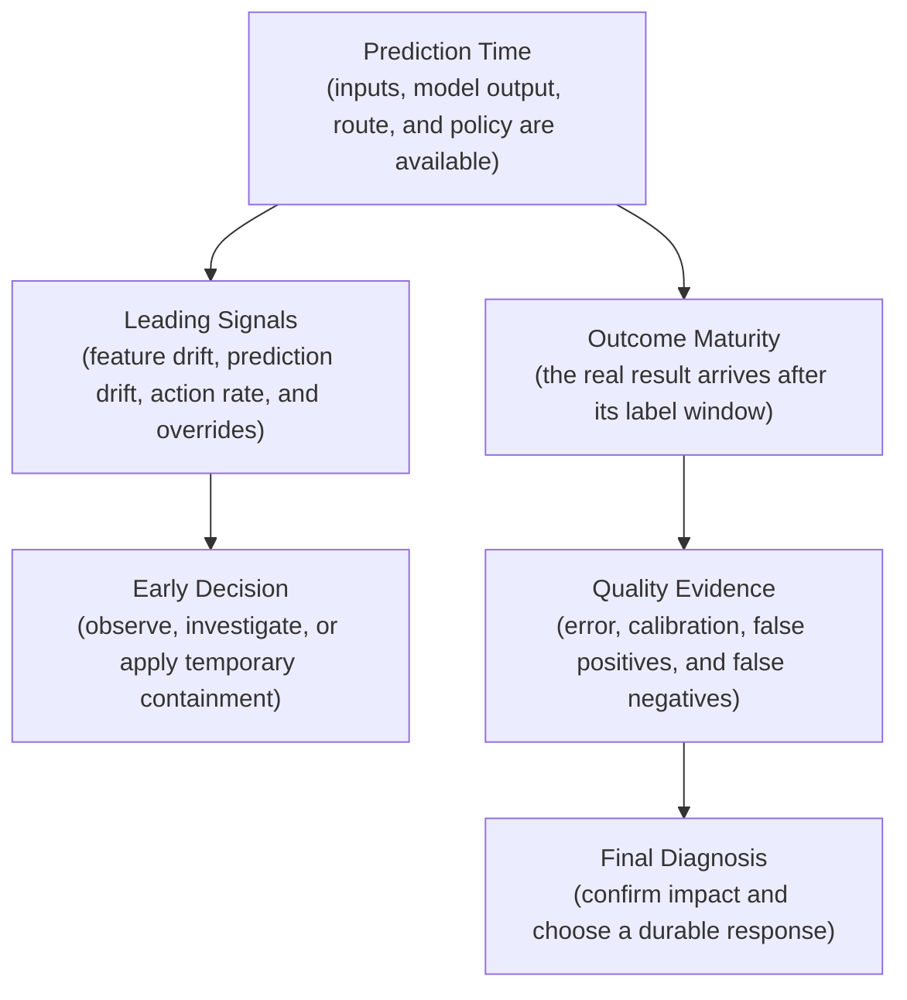
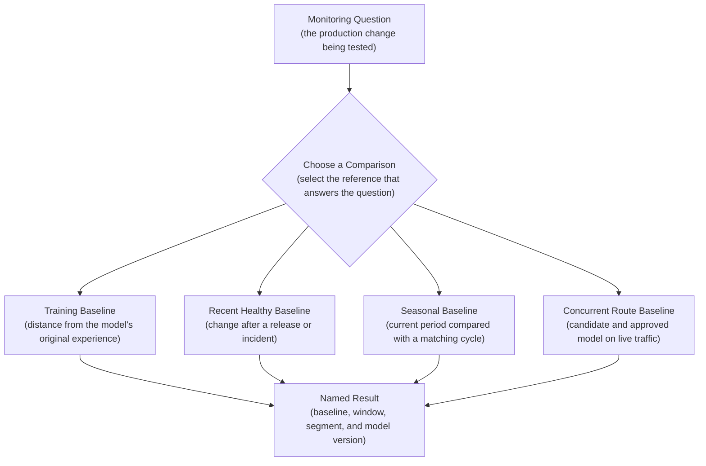
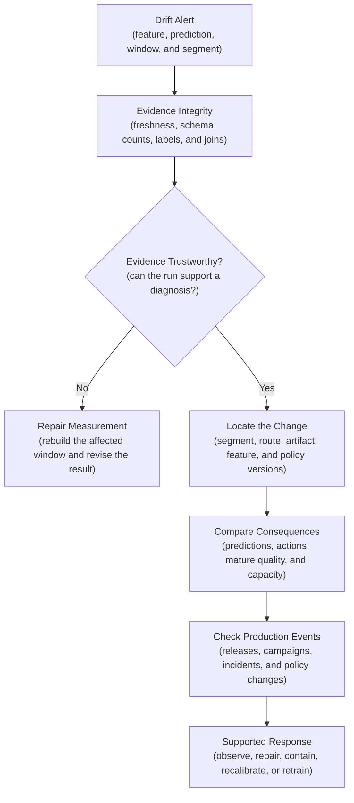

## Table of Contents

1. [Why Models Decay in Production](#why-models-decay-in-production)
2. [The Four Types Of Drift](#the-four-types-of-drift)
3. [Use Outcome Labels To Confirm Whether Drift Harmed Quality](#use-outcome-labels-to-confirm-whether-drift-harmed-quality)
4. [Choose The Baseline And Comparison Time Windows](#choose-the-baseline-and-comparison-time-windows)
5. [Interpret Drift Scores With Statistical And Product Context](#interpret-drift-scores-with-statistical-and-product-context)
6. [Use Segments And Release Versions To Locate Drift](#use-segments-and-release-versions-to-locate-drift)
7. [Investigate the Evidence in the Right Order](#investigate-the-evidence-in-the-right-order)
8. [Run Drift Monitoring as a Production Data Job](#run-drift-monitoring-as-a-production-data-job)
9. [Choose a Response That Matches the Cause](#choose-a-response-that-matches-the-cause)
10. [The Main Idea](#the-main-idea)
11. [References](#references)

## Why Models Decay in Production
<!-- section-summary: Model decay describes the loss of production usefulness that can follow changes in data, behaviour, policy, or the surrounding system. -->

A machine-learning model learns from a snapshot of the past. Production continues to change after training finishes. Customers develop new habits, prices move, sensors age, products add new categories, policies change, and data pipelines receive new sources. The model can keep returning valid-looking predictions throughout all of those changes.

This gradual loss of usefulness is often called **model decay**. The phrase describes the operational problem: a model that once supported good decisions now supports them less reliably. Drift describes possible changes behind that problem. Some drift affects the inputs, some affects the outcomes, and some changes the relationship the model was built to learn.

Consider a house-price model trained on bedrooms, floor area, property type, and neighbourhood. The model performs well on its test set and enters production. Several months later, its estimates miss final sale prices more often.

One explanation is a new mix of properties. The service now receives many more four-bedroom homes, which were rare in training. Another explanation is a change in buyer preferences. Familiar city-centre homes no longer command the premium seen in historical sales. A third explanation is a pipeline error that converts square feet as though the values were square metres. All three cases can move a drift chart, yet they call for different actions.

The production question is therefore broader than “did a statistic cross a threshold?” The team needs to identify what moved, establish whether the evidence is trustworthy, measure the effect on predictions and outcomes, and connect the change to a safe response.


*A reference and a current window create the comparison. Feature health, prediction behaviour, and outcomes explain the change and guide the response.*

A drift score answers one bounded question: how different are these two groups of data? It does not prove that accuracy declined, identify a broken feature pipeline, or decide that retraining is necessary.

## The Four Types Of Drift
<!-- section-summary: Data, target, concept, and prediction drift describe different production changes and require different evidence. -->

The word drift is used for several related ideas. Separating them gives the team a shared vocabulary and prevents one visible movement from becoming an unsupported diagnosis.

### Data Drift Changes the Inputs: `P(X)`

**Data drift** means that the distribution of model inputs has changed. In probability notation, this is a change in `P(X)`. The `X` represents the input features, and `P(X)` describes which values appear and how frequently they appear.

Return to the house-price model. Training mostly contained studios and one-bedroom flats. Production now contains far more four-bedroom houses. The distribution of `bedroom_count` has changed, so `P(X)` has changed. The rule connecting bedrooms, location, and sale price may still be valid. The model is operating in a part of the input space represented by few training examples.

That difference can matter in several ways. A tree-based model may have weak or unstable splits for large homes. A linear model may extrapolate beyond the range it learned. A model can also handle the new mix perfectly well if the relevant relationship was learned from enough examples. Data drift therefore raises a question; it does not prove that prediction quality fell.

**Covariate shift** is a more specific statistical situation. It usually means `P(X)` changed while the relationship `P(Y|X)` remained stable. People sometimes use data drift and covariate shift as synonyms, but the extra assumption matters. Production teams rarely know that the relationship stayed stable until outcomes arrive.

Data drift can come from the real world or from the data system. A marketing campaign may attract a different customer group. A new country launch may introduce currencies and categories that were absent from training. A producer can also rename a category, change a unit, or start filling missing values with zero. The first two examples describe genuine population movement. The last examples describe feature-health failures that need repair.

The first production action follows the source of the change. A deliberate campaign that brings in larger homes leads to a coverage and segment-quality review. A producer that changes square feet to square metres without updating the contract leads to quarantine, transformation repair, and partition rebuild. Retraining on the damaged values would teach the model from a pipeline defect.

Every input-drift result needs basic feature evidence beside it. Schema and feature-definition versions establish meaning. Null rate, freshness, category coverage, range checks, and training-serving parity establish whether the data path remained healthy. Distribution monitoring shows that the population moved. Contract checks show that a known rule broke.

In a BigQuery stack, dbt can test the current production model for required columns, accepted categories, range rules, and missing entities before an Evidently task compares distributions. Suppose a currency adapter multiplies one region's values by 100. The dbt range test returns the affected rows and blocks publication, while the Evidently report shows the resulting shape change for investigation. The team repairs and rebuilds the partition before publishing another drift result. This ordering gives a known contract violation priority over a statistical comparison.

### Target Shift Changes the Outcome Mix: `P(Y)`

The **target** is the outcome the model tries to predict. For a fraud model, the target might be whether investigators later confirm a transaction as a chargeback. For a demand model, it might be the number of units sold. **Target drift** means that the overall distribution of this outcome has changed: `P(Y)` has moved.

In classification research, **label shift** usually names the narrower case where `P(Y)` changes while `P(X|Y)` remains stable. The extra assumption says that the inputs observed inside each class still follow the same distribution. Production monitoring can measure the new label mix directly after outcomes arrive, but it needs further evidence before claiming that this narrower assumption holds.

Suppose confirmed fraud rises from 0.5% of transactions to 1.2% during a new scam wave. The proportion of positive labels has changed. That fact matters to staffing, thresholds, and calibration, but it does not explain the cause. The customer population may have changed, criminals may have changed their behaviour, or the investigation policy may now confirm more cases.

Monitoring can see target drift after trustworthy outcomes mature. The result must therefore show label volume, join coverage, and the label-definition version. A jump in positive labels caused by a new investigation rule is a policy change in the evidence system. The monitor records that version change and leaves the real-world conclusion open.

### Concept Drift Changes the Relationship: `P(Y|X)`

**Concept drift** means that the relationship between the inputs and the outcome has changed. The probability notation is a change in `P(Y|X)`: the chance of an outcome `Y`, given the same input `X`.

For the house-price model, consider a two-bedroom city-centre home. The feature values remain common and valid. After a large shift toward remote work, buyers may pay less for the city-centre location and more for suburban space. The same kind of home now produces a different sale price. `P(X)` can remain fairly stable while `P(Y|X)` moves.

Input values can look completely ordinary during concept drift. The evidence usually arrives through mature outcomes: prediction errors rise, calibration changes, or one segment develops a consistent residual pattern. A regulation, market change, new competitor, or change in customer behaviour can provide the domain explanation.

A **residual** is the difference between a numerical prediction and the observed outcome. Suppose the price model now estimates city-centre homes £70,000 above their final sale price after buyer preferences move toward suburban space. The residual distribution for that segment moves below zero even though the input values remain familiar. Classification teams inspect calibration by score band, false negatives, false positives, and threshold-specific results for the same purpose.

Concept drift can be sudden, gradual, recurring, or limited to one segment. A new regulation can change approval outcomes on a single date. Customer preferences may move over several months. Holiday fraud can return every year. A supplier change may affect one device family. The monitor keeps time and segment identity visible because one global monthly accuracy number would flatten these different shapes into the same vague decline.

Delayed labels create an early view and a final view. Reviewer disagreement, override rate, or a short-term proxy can raise an investigation quickly. The final view uses the outcome contract and mature cohort from the prediction-quality monitor. A useful proxy has a measured relationship to the final outcome and a named owner. Without those controls, the proxy can drift independently and give the team false confidence.

A common implementation stores reviewer actions and later outcomes beside the prediction ID in a Delta table. dbt builds the mature cohort after the label window closes, and a pinned scikit-learn task calculates calibration and error by score band. Prometheus may show the override rate within minutes, while the cohort result appears weeks later. Movement in both measures for the same model route and segment provides an early warning followed by direct evidence that the learned relationship changed.


*Data drift changes which inputs arrive. Target shift changes the overall outcome mix. Concept drift changes what familiar inputs imply about the outcome.*

### Prediction Drift Changes the Model Output: `P(Ŷ)`

**Prediction drift** means that the distribution of model outputs has changed. The symbol `Ŷ` represents the model's prediction, so the change can be written as a movement in `P(Ŷ)`. A classifier may produce far more high-risk scores. A regression model may produce longer delivery estimates. A ranking model may concentrate recommendations among fewer items.

Prediction drift is available immediately because the service creates predictions at decision time. It is a symptom whose cause still needs investigation. Inputs may have moved, a new model may score the same inputs differently, a policy may route a different population to the model, or a preprocessing release may have changed the values before inference.

Suppose the high-risk share from a fraud model doubles after a canary begins. The baseline route stays stable on comparable traffic. That pattern points toward the candidate artifact or its preprocessing path. If both routes move together, the team looks toward the population, shared features, or policy. Mature chargebacks later show whether prediction quality also changed.

## Use Outcome Labels To Confirm Whether Drift Harmed Quality
<!-- section-summary: Inputs and predictions provide fast leading signals, while mature outcomes establish whether the model still supports accurate decisions. -->

Input features and predictions are available at decision time, so teams can compare their distributions within minutes or hours. These are **leading signals**. They provide early warning while saying little by themselves about final accuracy.

Concept drift is often **hidden** until outcomes arrive. A churn model may need 90 days before an account can receive a final label. A payment model may wait weeks for disputes.

During that delay, score distributions show whether the model's outputs moved. Action rates show whether the product is treating more cases differently. Reviewer overrides and complaints provide early evidence that those decisions may be wrong. These signals can justify investigation or temporary containment. The final quality claim still depends on mature labels.

Suppose a fraud model's high-risk score share doubles overnight, while input distributions and model versions remain stable. The team checks the policy version and upstream feature path first. If those remain healthy, the movement may describe a real change in fraud behaviour or a relationship the monitor cannot yet see. Review decisions can provide early evidence, and mature chargebacks later confirm whether model recall changed.

The dashboard keeps three claims separate: input distribution moved, prediction distribution moved, and mature quality declined. One generic health score would hide which evidence is available and which conclusion still depends on future outcomes.



The upper path supports fast detection. The lower path supports claims about accuracy and concept drift. A proxy can shorten the delay, but the monitor keeps its result separate from the final outcome metric.

The production stack follows the same separation. Prometheus carries low-cardinality score shares, action rates, feature age, and fallback use for fast response. Governed Delta tables retain prediction records and delayed labels. dbt builds the mature cohort. Grafana links the fast alert to the slower cohort report through route, version, segment, and prediction-time window. The evidence arrives at different speeds, so the monitoring paths do too.

## Choose The Baseline And Comparison Time Windows
<!-- section-summary: A drift result needs an explicit reference, current production window, and reason that the comparison represents a useful expectation. -->

A drift monitor compares two groups of data. The **reference window** represents the earlier state, and the **current window** represents the production state being examined. Choosing the reference defines what “different” means and determines which production change the result can reveal.

### Start With The Monitoring Question

Training data answers how far production has moved from the model's original experience. A recent healthy production period answers whether something changed after a release. The same week last year can help with seasonal behaviour. A canary comparison can use baseline and candidate model routes over the same time window.

Consider a retail demand model during December. Comparing holiday traffic with an average week in March will produce obvious drift every year. That alert teaches the team very little. Comparing this December with the same holiday period last year can reveal an unusual change while respecting the expected seasonal pattern.

A mature system can keep several baselines because they answer different questions. The immutable training baseline asks how far production moved from the model's original experience. A recent approved baseline asks whether production changed after a release. Seasonal baselines compare like with like. A canary baseline compares candidate and approved routes during the same live period. The dashboard labels these questions directly instead of combining their scores.



The monitoring question sits at the top because each reference creates a different interpretation. A training comparison may show that the model serves unfamiliar inputs. It cannot tell the team whether a release from yesterday caused the movement. A concurrent route comparison can isolate release behaviour, yet it says little about long-term movement from training.

### Account For Seasonality And Traffic Volume

Window size changes the signal. A short window reacts quickly and may contain too few examples. A longer window is more stable and can hide a short incident inside mostly healthy traffic. Monitoring frequency should follow traffic volume and response speed. A busy payment model may support hourly windows, while a low-volume medical workflow may need weeks of carefully governed evidence.

Seasonality extends beyond annual holidays. Weekends, payroll dates, school terms, sales campaigns, and weather cycles can change input and outcome distributions. Teams map these known cycles before setting thresholds. A seasonal baseline and a recent healthy baseline can run together: one catches unusual calendar behaviour, while the other catches a release-related break.

Managed monitors expose these choices as window settings. Azure Machine Learning supports fixed or rolling reference windows, production lookback sizes, and offsets. A weekly production window can use a seven-day lookback, while the reference offset keeps the comparison window from overlapping it. The service schedules and calculates the monitor. The organization still owns the reason for choosing those periods and the decision attached to the result.

### Version and Approve the Baseline

Reference data needs an identity. Teams assign a `baseline_id` and record the exact time range. A table or dataset version identifies the rows. Filters and feature definitions explain how the comparison was built. An approval reason states why this period represents a useful expectation. This record makes the result reproducible and exposes any later baseline change.

Baseline promotion follows a controlled workflow. The monitor runs the proposed reference beside the current reference through a complete business cycle. Owners review the alert volume under both references and confirm that mature quality remains healthy for important segments.

The approved record points to the exact data snapshot and stores the filters used to build it. Its feature definitions preserve the meaning of each comparison. The record also keeps the approval reason and reviewers. Rolling back means selecting the previous `baseline_id`; it should not require rebuilding history from an undocumented query.

## Interpret Drift Scores With Statistical And Product Context
<!-- section-summary: Statistical tests and distances describe distribution changes, while effect size, sample count, feature meaning, and quality evidence determine their production importance. -->

A drift method compares two distributions and returns evidence about their difference. Numerical features and categorical features need different methods because their distributions have different shapes, while every method still needs product context before it can drive an alert.

### Know What Statistical Tests And Distance Measures Show

For a number such as house area or delivery distance, teams may use the Kolmogorov–Smirnov test, Wasserstein distance, Jensen–Shannon distance, or Population Stability Index. For a category such as property type or device family, they may use a chi-squared test, Jensen–Shannon distance, or a change in category shares. Each method answers a bounded question about whether the distribution moved or how large the movement was.

A **p-value** measures how surprising the observed difference would be under a statistical assumption. With millions of rows, a tiny harmless change can produce a very small p-value. With a few dozen rows, a meaningful change may remain uncertain.

Production alerts also need an **effect size**, which describes how large the movement is. The sample count shows how much evidence supports that estimate. These values prevent statistical sensitivity from being mistaken for product importance.

Different methods emphasize different shapes. The Kolmogorov–Smirnov statistic focuses on the largest gap between two numerical cumulative distributions and is sensitive to sample size. Wasserstein distance describes how far probability mass would have to move to turn one numerical distribution into the other. For an unscaled feature, the result uses that feature's original unit. Jensen–Shannon distance works with numeric histograms or categorical shares and gives a bounded comparison. Chi-squared tests suit category counts if expected counts are adequate.

Population Stability Index, or PSI, is widely used in credit and other tabular monitoring because it is straightforward to compute from bins. Its result depends heavily on where those bins were defined. Recomputing bins from every current window changes the ruler during the measurement. Teams usually derive bin edges from the approved reference, preserve missing and unseen categories explicitly, and version the binning rule with the baseline.

A small SciPy check shows the difference between a hypothesis test and a distance:

```python
from scipy.stats import ks_2samp, wasserstein_distance

ks = ks_2samp(reference_area, current_area)
distance_m2 = wasserstein_distance(reference_area, current_area)

result = {
    "ks_statistic": ks.statistic,
    "ks_p_value": ks.pvalue,
    "wasserstein_m2": distance_m2,
    "reference_count": len(reference_area),
    "current_count": len(current_area),
}
```

The K–S result describes evidence that the numerical distributions differ. The Wasserstein result describes the movement in the feature's original unit, square metres in this example. Neither result states whether the price predictions became less useful. The monitoring job stores both values beside the before-and-after quantiles and the affected segment.

### Use Multivariate Checks For Changes Across Features

Most production monitors start with one feature at a time. These **univariate** checks are interpretable: an investigator can see that `bedroom_count` or `property_type` moved. They can still miss a change in the joint pattern between features. Bedrooms and floor area might each keep the same overall distribution while an unusual combination—many four-bedroom homes with very small floor areas—appears more often.

Teams address this gap selectively. They may monitor a few domain-approved feature combinations, compare embeddings for unstructured inputs, or train a classifier to distinguish reference rows from current rows. A classifier that separates the windows well is evidence of multivariate drift. It still needs feature attribution, segments, and quality evidence before the result can guide a response.

### Set Thresholds From History And Product Consequence

No universal score of `0.2` or p-value of `0.05` carries the same meaning for every feature. A two-millimetre sensor shift can matter in one system and be irrelevant in another. Teams replay the candidate method and threshold across known healthy periods, seasonal events, and previous incidents. That backtest reveals expected alert volume and shows whether the rule would have caught a change the organization actually cared about.

Suppose the average floor area changes from 82 to 82.3 square metres across two million predictions. A test may call the difference statistically significant, while the change has no practical effect on price error. A shift from 82 to 118 square metres in one high-volume region has a much clearer operational meaning. The monitor should show the before-and-after distribution or quantiles so the investigator can see the movement behind the score.

Hundreds of feature tests also create a multiple-comparison problem: some alerts appear by chance even in healthy data. Common controls include false-discovery-rate correction, persistence across several windows, a minimum effect size, and a smaller set of decision-critical features. Dataset-level summaries can guide triage, but feature-level evidence remains available so responders can see what moved.

A feature tied to a safety decision may have a strict contract threshold. A weakly used feature may receive a dashboard annotation unless predictions or mature quality move with it. The threshold expresses the cost of missing the change and the cost of waking responders for harmless variation.

## Use Segments And Release Versions To Locate Drift
<!-- section-summary: Segment and version fields turn a fleet-wide drift number into a bounded question about a route, release, population, or fallback path. -->

A global distribution can hide a concentrated change because a high-volume healthy group can outweigh a smaller failing group. Drift monitoring therefore uses the same product and system segments as prediction-quality monitoring, including regions, customer stages, serving routes, and fallback paths.

### Use Product Segments To Find Who Is Affected

Suppose the overall share of the `unknown` category rises from 2% to 5%. The global movement seems moderate. A regional view shows that one route jumped to 48% immediately after an upstream release. That pattern points toward a mapping or schema failure. A gradual increase across every route may describe a real new category entering the product.

Version identity gives another useful boundary. During a canary release, candidate and baseline models may receive similar traffic. Prediction drift isolated to the candidate suggests a model or preprocessing difference. A shift shared by both versions points toward the population, features, or policy around them.

Counts remain visible beside every slice. A dramatic score from 20 examples can guide investigation and rarely deserves the same alert as a sustained movement across 200,000 decisions. Sensitive segments need controlled access and a clear monitoring purpose, especially if they involve protected or personal attributes.

### Use System Versions To Find Where The Change Entered

Segment selection combines domain risk and system architecture. Product segments include region, customer stage, device class, or risk tier. System segments include model route, feature version, policy version, data source, and fallback path. The first group shows who or what is affected. The second group often shows where the change entered. Monitoring both prevents the team from seeing a harmed population without seeing the release or pipeline that serves it.

The monitor limits combinatorial growth. It computes approved one-dimensional segments and a few reviewed intersections that have a real operating purpose. `region × model_route` can isolate a canary problem. Every possible combination of five customer attributes creates noise and privacy risk. Low-volume segments use longer windows or manual analysis, with sample size shown openly.

The prediction record needs the dimensions used by the investigation. Event time and model route locate the serving path. Artifact, feature, and policy versions locate the deployed components. Approved product segments locate the affected population. The serving layer can write these fields directly or link them through a prediction ID to a governed decision record. Missing identity is a monitoring-data failure because the team cannot locate a production change without it.

A BigQuery-backed dbt model can materialize the reviewed cohorts before the drift library runs:

```sql
select
  model_route,
  region_group,
  count(*) as prediction_count,
  safe_divide(countif(prediction_score >= 0.8), count(*)) as high_score_share
from {{ ref('production_predictions') }}
where predicted_at >= timestamp('{{ var("window_start") }}')
  and predicted_at < timestamp('{{ var("window_end") }}')
  and model_route is not null
group by model_route, region_group
having count(*) >= {{ var("minimum_segment_count", 500) }}
```

The query does not decide which segments deserve monitoring. Product risk and system architecture define the approved dimensions and the minimum usable count. The drift job receives those governed cohorts instead of inventing arbitrary slices after an alert.

## Investigate the Evidence in the Right Order
<!-- section-summary: Drift diagnosis begins with evidence integrity, then narrows the change by segment, version, prediction behaviour, outcomes, and recent production events. -->

A drift alert begins an investigation. The investigation first establishes whether the monitor observed production correctly. It then locates the affected population and system path. Only then does the team decide whether the pattern supports data repair, observation, containment, recalibration, or a new model.

### Check Monitoring Data First

The first pass checks the monitoring job itself: partition freshness, schema version, rejected rows, reference identity, sample count, label volume, join coverage, and policy version. A failed outcome join can make quality appear to improve because difficult cases disappeared from the measured cohort. A stale reference partition can manufacture a distribution change. Those problems invalidate the interpretation before anyone investigates the model.

For example, suppose mature accuracy rises while label coverage falls from 92% to 41%. The monitoring owner marks the quality result unavailable and freezes release promotion. The data owner samples prediction IDs, finds the broken outcome join, repairs it, and recomputes the same cohort. The corrected metric replaces the original result through a recorded revision.

### Locate The Change Before Classifying The Drift

The next pass compares product segments, model routes, feature versions, policy versions, and recent releases. A movement isolated to one route after a canary points toward that route's artifact or preprocessing package. A movement shared across baseline and candidate routes points toward a shared feature, population, or policy. A movement concentrated in one region may reveal a local source or a genuinely different population.

The team then compares input drift, prediction drift, action rates, and mature quality for the same window and segment. These patterns create hypotheses:

- Moved inputs with stable predictions and mature quality often describe a population the model still handles.
- Moved inputs and predictions with stable quality may describe correct adaptation to a seasonal or product change. Downstream capacity still needs review because action volume can rise.
- Moved inputs, predictions, and quality can come from a feature-path failure or from a changed real-world relationship. Contract and parity results separate those paths.
- Falling quality with stable input distributions can point toward concept drift, a label-definition change, an unmonitored feature, or a downstream policy change.
- Prediction drift isolated to a candidate route points toward the model release. Shared prediction drift pushes the investigation toward common inputs or routing.

A population shift can expose a model weakness without changing the underlying concept. Suppose larger homes make up more production traffic and error rises only beyond the floor-area range represented in training. The model owner can limit automated estimates for that unsupported range, collect more examples, and train a candidate with broader coverage. The cause is input drift with weak generalization, even though the eventual response includes model work.



The order protects the team from confident action based on broken evidence. It also gives the final decision a traceable path from alert to cause.

### Record The Exact Investigation Inputs And Method

Many teams create an evidence mart for incident analysis. A dbt model joins feature-health results, drift outputs, prediction summaries, policy versions, and mature quality by time window, model route, and governed segment. The detailed source tables remain separate. The mart aligns facts such as feature freshness failed, input drift rose, and quality unavailable for the same route.

Airflow or Dagster publishes the mart after every input reports freshness and coverage. The pipeline records a missing quality table as an explicit unavailable status. It never renders an empty chart that resembles healthy quality. The incident dashboard links each summary back to the source rows and the run manifest.

## Run Drift Monitoring as a Production Data Job
<!-- section-summary: A production drift job builds governed windows, validates them, computes versioned comparisons, stores reproducible evidence, and emits bounded alerts. -->

Drift monitoring is a data pipeline with a statistical step inside it. A warehouse or lakehouse stores the reference and current datasets. dbt, Spark, or scheduled SQL builds the windows. Evidently, TensorFlow Data Validation, or reviewed application code calculates the comparison. Airflow, Dagster, or a managed ML workflow schedules the run and handles retries.

### Validate Both Time Windows Before Comparing Them

The run waits for complete input partitions and checks schema, row count, missingness, category rules, and required identity fields. It also confirms that the reference and current windows do not overlap accidentally. The selected `baseline_id`, feature definitions, filters, and segment rules become part of the run configuration.

A validation failure marks the comparison unavailable and stops publication. This status is different from no drift. The first means the monitor could not make a trustworthy comparison; the second means a valid comparison stayed within its reviewed threshold.

### Use A Versioned Drift Method

The current Evidently API can compare a production DataFrame with a reference DataFrame through `DataDriftPreset`:

```python
from evidently import Report
from evidently.presets import DataDriftPreset

report = Report([DataDriftPreset()])
evaluation = report.run(
    current_data=current_window,
    reference_data=reference_window,
)
```

The library performs the statistical comparison. The surrounding job provides the production meaning: it chooses the approved windows, validates their contracts, pins the library and method configuration, and attaches segment and version identity.

One stored result can carry that context:

```json
{
  "run_id": "drift_run_7F2A",
  "baseline_id": "seasonal-reference-v3",
  "current_window_id": "production-week-42",
  "feature": "bedroom_count",
  "method": "jensen_shannon",
  "score": 0.18,
  "alert_threshold": 0.12,
  "reference_count": 184000,
  "current_count": 51700,
  "segment": {"region_group": "north", "model_route": "primary"},
  "feature_contract_status": "pass",
  "mature_quality_status": "pending",
  "decision": "investigate"
}
```

The alert links to this record through `run_id`. An investigator can see the exact comparison, evidence volume, contract status, and label maturity before opening the detailed distributions.

### Store Drift Results And Revisions

Each run writes a manifest with its input snapshots, row counts, rejected rows, baseline ID, code revision, configuration version, start and finish times, and status. Feature-level results retain before-and-after quantiles or category shares. Sensitive examples stay in governed storage with bounded access and never enter alerts or metric labels.

Late partitions require a backfill of the exact affected window with the same baseline and configuration. The corrected run records a revision and links to the earlier result. Historical evidence remains visible, so release reviewers can see that the metric changed after its original publication.


*The production job validates its windows before calculating drift, stores the detailed evidence in governed data, and publishes a bounded alert for investigation.*

Prometheus or the cloud monitor receives low-cardinality signals such as dataset drift status, run freshness, and affected feature count. The warehouse or lakehouse retains the detailed per-feature and per-segment results. This boundary keeps high-cardinality values and sensitive samples out of operational metrics.

### Choose Tools That Fit The Existing Data Platform

An open implementation commonly combines Delta Lake, BigQuery, or Snowflake for evidence storage; dbt or Spark for window construction; Evidently for transparent drift reports; Airflow or Dagster for orchestration; and Prometheus with Grafana or cloud monitoring for bounded alerts. TensorFlow Data Validation is a natural fit for a TFX pipeline that already produces and validates dataset statistics.

Managed platforms package more of this path. Azure Machine Learning includes built-in tabular signals for data drift, prediction drift, and data quality, with scheduled jobs, configurable reference data, metrics, and thresholds. It can collect data from Azure online endpoints or consume production data gathered elsewhere.

Databricks Data Profiling can apply an inference profile to a governed request log, compare time windows or an optional baseline table, and write profile and drift metrics as Delta tables in a Unity Catalog schema. This fits a Databricks estate whose prediction and outcome evidence already lives in governed Delta tables.

The platform choice changes integration effort while the monitoring responsibilities remain constant. Every implementation needs a meaningful baseline and complete production identity. Reviewed segments and label-maturity rules define the measured population. Versioned methods preserve interpretation, and a named owner handles the result.

## Choose a Response That Matches the Cause
<!-- section-summary: The response depends on whether the evidence shows broken measurement, a damaged data path, a healthy new population, or a changed input-to-outcome relationship. -->

The drift alert should name the feature or prediction, both windows, the method, the size of the movement, sample counts, affected segments, versions, and related quality signals. The owner receives an investigation with evidence instead of a generic drift warning.

### Repair a Damaged Data Path

Suppose an upstream release maps every new category to `unknown`. The source or transformation owner restores the reviewed mapping and reprocesses the affected partitions into a candidate table. Schema, category, freshness, and parity checks run again. The drift job compares the corrected window with the same baseline, and the quality job recomputes the same mature cohort. Retraining remains frozen until this evidence separates the pipeline defect from any genuine new category.

Live impact requires immediate containment. The product can route the affected category to an approved fallback or hold a high-risk action for review. A serving route can also return to the last compatible feature version. The repaired path runs in shadow. Representative records are traced from source to prediction. A canary then checks data freshness and parity, followed by latency and action rates, before normal traffic returns.

### Observe Or Approve An Expected Population Change

A valid new population may leave model quality healthy. The monitoring owner observes it through a complete operating cycle. Model and product owners check error, calibration, action volume, and downstream capacity across the affected segments.

Suppose a seasonal increase in risky transactions leaves fraud precision and recall stable but doubles the manual-review queue. The model remains useful. The product owner may adjust routing, add reviewer capacity, or reserve manual review for the highest-loss cases. Drift monitoring revealed a production consequence that accuracy alone would miss.

An approved baseline update follows evidence from the new population. The proposed reference runs beside the existing baseline through a full cycle. Reviewers document the reason, data snapshot, filters, and feature definitions. The previous reference remains available for historical interpretation and rollback.

### Recalibrate, Change Policy, or Retrain for Concept Drift

Confirmed concept drift enters the normal model-release path. The data team builds a point-in-time-correct training set that contains the new relationship. A managed training job or the established compute platform produces a candidate. The model registry links the artifact to its data, code, feature definitions, and evaluation results.

Retraining is one possible response. Strong ranking with probabilities that are consistently too high may call for a versioned recalibration step. A threshold that no longer matches loss or queue capacity may call for a replayed and canaried policy change. Relationship changes across several important segments may justify a newly trained model.

Offline segment evaluation measures whether the candidate addresses the observed failure. Shadow or canary traffic then compares it with the approved model on live inputs. Promotion requires explicit quality and product thresholds. A breach returns traffic to the previous artifact. Drift starts the investigation; release evidence controls promotion.


*Contract failures stay at the data boundary. Healthy population changes may justify observation or a reviewed baseline. Changed relationships enter a controlled recalibration, policy, or model-release path.*

## The Main Idea
<!-- section-summary: Drift monitoring describes change, while feature health and mature quality evidence explain its cause and consequence. -->

Data drift means the model is seeing a different mix of inputs. Target shift means the outcome mix changed. Concept drift means the relationship between inputs and outcomes changed. Prediction drift means the model's output distribution moved. A production system can experience several of these changes at once.

The drift score provides the first clue. A meaningful reference, visible distributions, segments, versions, feature-health checks, and mature outcomes turn that clue into a supported diagnosis. The response can then follow the cause: restore measurement, repair a damaged pipeline, observe a healthy change, approve a new baseline, recalibrate scores, change policy, or evaluate a new model.

## References

- [Evidently data drift preset](https://docs.evidentlyai.com/metrics/preset_data_drift)
- [Evidently Report API](https://docs.evidentlyai.com/docs/library/report)
- [Evidently drift methods and defaults](https://docs.evidentlyai.com/metrics/explainer_drift)
- [TensorFlow Data Validation](https://www.tensorflow.org/tfx/guide/tfdv)
- [SciPy two-sample Kolmogorov–Smirnov test](https://docs.scipy.org/doc/scipy/reference/generated/scipy.stats.ks_2samp.html)
- [SciPy Wasserstein distance](https://docs.scipy.org/doc/scipy/reference/generated/scipy.stats.wasserstein_distance.html)
- [Detecting and Correcting for Label Shift with Black Box Predictors](https://proceedings.mlr.press/v80/lipton18a.html)
- [Azure Machine Learning model monitoring](https://learn.microsoft.com/en-us/azure/machine-learning/concept-model-monitoring?view=azureml-api-2)
- [Databricks data profiling](https://docs.databricks.com/aws/en/data-governance/unity-catalog/data-quality-monitoring/data-profiling/)
- [Google Rules of ML: monitoring](https://developers.google.com/machine-learning/guides/rules-of-ml#monitoring)
