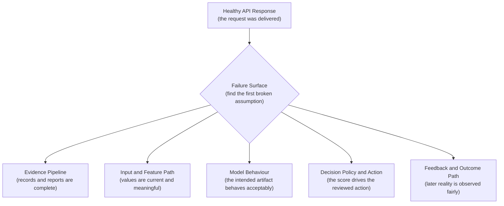
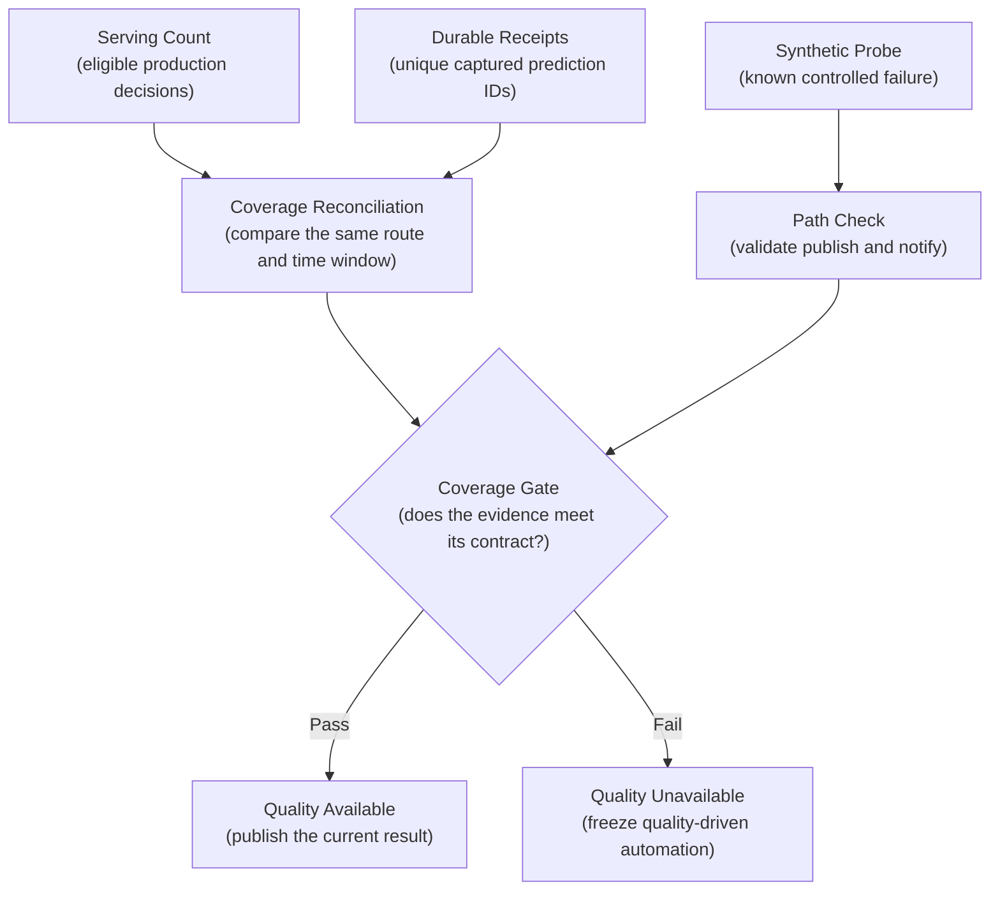
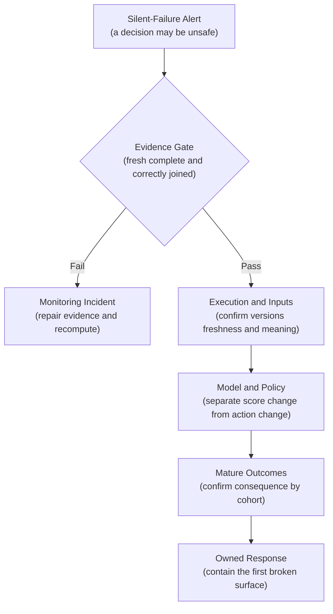
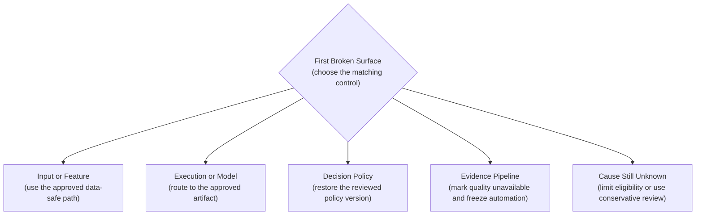
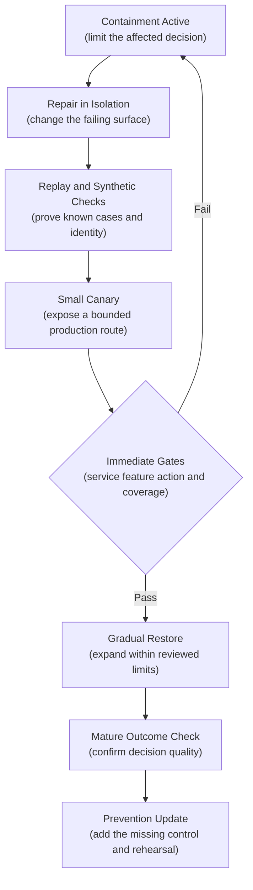

## Table of Contents

1. [A Model Can Fail While the API Stays Healthy](#a-model-can-fail-while-the-api-stays-healthy)
2. [The Five Places Silent Failure Can Begin](#the-five-places-silent-failure-can-begin)
3. [Record The Complete Path Behind Each Decision](#record-the-complete-path-behind-each-decision)
4. [Use Fast Warnings First And Confirm Them With Outcomes](#use-fast-warnings-first-and-confirm-them-with-outcomes)
5. [Correlate Signals Before Declaring A Silent Failure](#correlate-signals-before-declaring-a-silent-failure)
6. [Check That Monitoring Itself Is Working](#check-that-monitoring-itself-is-working)
7. [Investigate in a Fixed Order](#investigate-in-a-fixed-order)
8. [Contain The First Confirmed Failure](#contain-the-first-confirmed-failure)
9. [Repair, Verify, and Prevent Recurrence](#repair-verify-and-prevent-recurrence)
10. [How To Build The Monitoring Loop With Current Tools](#how-to-build-the-monitoring-loop-with-current-tools)
11. [The Main Idea](#the-main-idea)
12. [References](#references)

## A Model Can Fail While the API Stays Healthy
<!-- section-summary: Silent failure happens when a model service keeps returning successful responses while the resulting decisions grow less useful or more harmful. -->

A **silent model failure** happens when an ML system keeps returning normal-looking responses while the decisions built from those responses lose quality, safety, or business value. The API can remain fast and available throughout the failure.

### What API Health Can Confirm

Traditional service metrics answer important delivery questions. Did the request reach the service? Did the service respond before the deadline? Did it return a valid payload? Did the compute stay within its limits? A crash, timeout, or malformed response normally appears in those signals.

Imagine a delivery-time model that returns an estimate in 40 milliseconds for every request. The endpoint has no errors, CPU use is normal, and the deployment is stable. A traffic feature stopped updating three hours ago, so the model now promises delivery times that are consistently too short. Customers see the failure long before the infrastructure dashboard does.

The service metrics were accurate: requests really did finish in 40 milliseconds. Their scope ended at delivery; result meaning required separate evidence. The stale traffic value passed schema validation, the model produced a valid number, and the product turned that number into a bad promise.

### Why Valid Responses Can Still Be Wrong

An ML decision carries a second production promise. The intended model must run on inputs with the expected meaning. Its output must still describe reality well enough for the product action. The policy after the model must use that output as reviewed. The monitoring system must also collect enough current evidence to support any green quality claim.

This creates several places for a quiet failure to enter. A route can execute an old artifact. A feature can use the wrong unit. Model probabilities can lose calibration. A threshold can double the number of rejected cases. A label pipeline can stop joining difficult outcomes and leave the quality chart looking better than reality.

The path can be read as a sequence of claims:


*The endpoint can stay green while meaning fails deeper in the path. Each checkpoint makes a different claim, and monitoring coverage determines whether the evidence is current and complete.*

Each level depends on the level above it. A successful request cannot prove that the intended model version ran. The intended model cannot produce a trustworthy decision from stale inputs. A plausible prediction cannot prove that a new threshold used it safely. A healthy outcome chart cannot be trusted when half of the labels stopped joining.

## The Five Places Silent Failure Can Begin
<!-- section-summary: Five connected surfaces show where a healthy-looking ML request can first diverge from the reviewed production design. -->

A **failure surface** is one part of the decision path whose assumptions can break independently. The first broken surface matters because it identifies the evidence to inspect, the owner who can act, and the safest temporary control.

The five surfaces describe evidence, inputs, model behaviour, product action, and later reality. They are connected, so a failure in an earlier surface can appear as a symptom farther downstream. The framework asks the responder to move upstream from the symptom until the first reviewed assumption fails.



### 1. Monitoring Data Can Stop Representing Production

The evidence pipeline includes prediction capture, durable storage, validation, cohort jobs, metric publication, dashboards, and alert delivery. A failure here changes what the team can see. It may leave the decision path untouched while making a quality claim unreliable.

Suppose an outcome source renames `chargeback_confirmed_at`. The join job still runs, yet coverage falls from 97% to 42% because the new field never reaches the label model. Difficult cases disappear from the cohort and recall appears to improve. The correct response is to mark the result unavailable, repair the label transformation, and recompute the same cohort. A model rollback would act on damaged evidence.

Evidence-pipeline checks include receipt coverage against independent serving counts, schema rejection counts, job freshness, outcome-join coverage, publication age, and a controlled alert test. A failed check freezes quality-driven automation until a full replay proves recovery.

### 2. The Input and Feature Path Can Change Meaning

The input and feature path covers schema, units, categories, missing values, source time, freshness, and training-serving parity. Type checks catch only part of the problem. A value of `120` can be valid data and still be wrong if the producer changed the unit from seconds to minutes.

Consider an inventory model that recommends replenishment quantities. A stock feature remains numeric and non-null, yet an upstream job now publishes yesterday's closing balance throughout the day. Both the approved model and the canary begin under-ordering the same products. The shared decline points to the feature path. The data owner restores the current materialization, replays the missing period, and verifies source timestamps and entity counts before traffic returns to the normal action.

Feature contracts turn these assumptions into checks. A time-sensitive feature can carry a maximum age. A monetary field can carry a currency and scale. A categorical field can carry an allowed vocabulary. Point-in-time parity tests compare online values with the offline calculation for the same entity and event time.

### 3. Model Behaviour Can Deteriorate

The model-behaviour surface starts with execution identity. The team confirms the model artifact, preprocessing package, feature-set version, and route that actually handled the request. Only then can it ask whether scores, rankings, probabilities, or errors still behave acceptably.

A regional traffic rule can quietly route requests to version 23 even though the deployment page shows version 25 as healthy. Both artifacts return the same response shape, so latency and error metrics remain normal. Decision records and trace attributes reveal the old version. The platform owner repairs the traffic rule and sends a synthetic request that records the approved artifact identity.

The intended model can also run correctly and still lose quality. A recommendation model may keep producing plausible scores after the catalogue shifts toward items absent from training. Score distributions, fallback use, calibration, and segment behaviour provide early clues. Mature clicks, purchases, or other outcomes later confirm whether the change harmed the supported decision.

### 4. Decision Policy and Action Can Misuse a Good Score

The decision surface begins after inference. Thresholds, ranking rules, eligibility filters, caps, feature flags, and human-review policies decide what the product does with a score. A model can remain stable while one of these rules creates a harmful action.

Suppose a loan model continues producing the same risk distribution. A policy release lowers the manual-review threshold and sends twice as many low-risk applications to an already full queue. Decisions now wait for days, even though the model did not change. Policy version and action counters locate the problem. The owner restores the previous threshold, verifies queue recovery, and replays the proposed policy on a mature cohort before another canary.

The decision record therefore keeps prediction and action as separate fields. The score explains the model. The policy version and action explain the product. Mixing them into one “model result” hides the surface that actually changed.

### 5. Outcome Data Can Give A False Picture Of Quality

The feedback surface covers the later evidence used to judge the decision: labels, reviewer outcomes, complaints, returns, chargebacks, conversions, safety events, and other business outcomes. It also covers maturity, censoring, corrections, and selection bias.

Imagine a fraud team that labels only transactions sent to review. A stricter model creates more reviewed cases, so the new label set contains more high-risk traffic than the old one. Comparing the raw reviewed populations can make one model look worse because the sampling policy changed. The monitoring design must preserve selection probability, action, and eligibility, then state which population the metric represents.

Outcome evidence usually arrives later than feature or execution evidence. That delay does not make it less important. It gives the strongest confirmation that a production decision helped or harmed the user. The team keeps leading warnings and mature outcomes connected through prediction identity, route, versions, and decision time.

The framework has one operating rule: locate the first broken surface. A shared stale feature will survive a model rollback. A broken label join will survive retraining. A changed threshold will survive a feature repair. The response should target the surface whose evidence first diverged from the reviewed design.

## Record The Complete Path Behind Each Decision
<!-- section-summary: A decision record ties one request to the exact model, features, policy, action, and later outcome used during investigation. -->

A **decision record** tells the story of one production decision from request to action. In ordinary terms, it is the case file for that decision: what the model returned, what the product did, and which operating conditions shaped the path. It lets an investigator move from a fleet-wide alert to representative cases without guessing which versions or fallbacks were involved.

Stable prediction identity, reconciled record delivery, and propagated trace context provide the evidence foundation. Silent-failure response uses that foundation to locate the first broken surface.

### Record What Actually Ran

Record the versions that actually executed, the output and action, input-freshness evidence, fallback state, route or region, and a trace reference where one was retained. Consider a delivery estimate of 34 minutes that became a 35-minute promise. The record also shows that the traffic feature was 22 minutes old and a traffic-cache timeout activated a fallback. Those facts point toward the input and dependency surfaces before the team changes the model.

The corresponding decision record might contain:

```json
{
  "prediction_id": "pred_01K0Q7H7T8Z6M3X2",
  "trace_id": "9f8c4f0c9d9b47f5ad7c5f922cf176a3",
  "model_version": "eta-v25",
  "feature_set_version": "traffic-v19",
  "policy_version": "promise-v6",
  "route": "west",
  "input_health": {"traffic_age_seconds": 1320},
  "prediction": {"eta_minutes": 34},
  "action": {"promised_minutes": 35},
  "fallback": {"used": true, "reason": "traffic_cache_timeout"}
}
```

Store this case record in governed durable storage. Prometheus keeps bounded aggregate dimensions such as route and version. The prediction ID and trace ID connect an authorized investigator to request-level evidence. A later delivery outcome joins to the same prediction ID and shows whether the fallback protected the promise.

### Use Metrics, Traces, And Decision Records For Different Questions

The responder starts with the affected prediction IDs from a quality cohort or action-rate alert. A governed warehouse or inference-table query groups those records by model, feature, policy, fallback, and route. Representative trace IDs then reveal whether the suspected dependency or branch actually ran slowly. Aggregate Prometheus or cloud metrics show how widely the same condition affected the service. The record narrows the population, the trace explains selected paths, and the metrics size the incident.

If one region reports the old model version in its records, the team checks release routing and confirms the running artifact with a synthetic request. If many bad outcomes share a stale feature age and fallback while baseline and candidate models decline together, the team contains the feature path first. The investigation reuses the same metrics, traces, and decision records produced by the normal observability and logging paths.

### Check Evidence Coverage Before Interpreting Results

The monitoring feed still has to prove its own coverage before the team trusts this analysis. The responder checks the reconciliation and schema-health signals defined in Prediction Logging. A gap there moves the incident to the evidence surface and stops a weak dataset from justifying a rollback.

## Use Fast Warnings First And Confirm Them With Outcomes
<!-- section-summary: Leading evidence exposes broken assumptions quickly, while mature outcomes confirm whether the production decision helped or harmed the user. -->

Silent failures create a timing problem. Teams need evidence early enough to limit harm, yet the strongest answer may arrive weeks later. The solution is to give early and mature evidence different jobs.

### Use Fast Signals To Detect Broken Assumptions

**Leading signals** arrive around prediction time and describe what the system is doing right now. They include feature age, missing-value rate, fallback share, score distribution, model-route identity, and action volume. These signals can expose a broken contract before final outcomes exist.

If a safety-related feature exceeds its maximum age for 35% of requests, the reviewed input contract has already failed. The product owner can route those cases to manual review before a one-month outcome window closes. The team records the affected prediction IDs so a mature cohort can later measure the fallback.

Leading evidence supports a reversible response. Its claim stops at the broken production assumption. A feature-age breach proves that the feature contract failed. Mature outcomes later show how many decisions were wrong.

### Use Outcome Data To Measure Product Harm

**Confirming outcomes**, often called lagging signals, arrive after the decision. They include prediction error, calibration against mature labels, customer complaints, reviewer overrides, cancellations, financial loss, and safety events. These outcomes carry stronger product meaning and often arrive after the best containment window.

The mature cohort answers what the early warning could not. Did the stale feature actually increase error? Did manual review reduce the harmful action? Did the conservative fallback protect the supported outcome? Prediction identity connects those later answers to the exact route and control used during the incident.

### Match Response Urgency To The Product Decision

A prediction-distribution change with stable mature quality deserves a lighter response. The model owner checks traffic mix, policy versions, and important segments, then observes through the relevant business cycle. A model rollback would add release risk without evidence that decisions are worse.

Quality can also decline while every existing leading signal stays inside its limit. The team first verifies label definitions and coverage, then examines calibration, residuals, policy behaviour, and inputs that the monitor does not yet cover. This incident can reveal concept drift or a missing leading signal. The final fix may include a new segment or invariant so the next occurrence appears earlier.

Signal selection starts from a failure the team could act on. A maximum feature age protects a time-sensitive input. Artifact identity protects a deployment promise. Fallback share protects a degraded serving path. Action rate protects the process that consumes model output. Each signal has an owner, a normal range, an affected decision, and a safe response. A collection of convenient metrics without those links gives the team more charts and little additional safety.

Thresholds come from contracts and healthy history. A hard safety invariant can page as soon as a sustained minimum volume crosses the limit. A noisy behavioural measure may require a longer window, a relative change against the approved route, and a minimum sample count. Teams replay proposed alerts over known healthy periods and previous incidents, then test their delivery. The goal is a rule that responds quickly enough for the consequence and quietly enough that responders still trust it.

For example, a loan-decision system may send a case to manual review whenever a required income feature is older than its contract. That path acts immediately because the approved feature contract has failed. A recommendation system seeing a small score-distribution movement may open a ticket, compare segments, and wait for engagement outcomes. Both are monitoring responses; their urgency differs because the decisions and available containment differ.

### Combine Fast Signals With Delayed Outcomes

In the loan example, the inference service increments Prometheus counters for total decisions, stale required features, and manual-review actions by stable route and region. Alertmanager pages when the stale share breaches the reviewed contract and the review queue still has capacity. The service also writes the affected prediction IDs to a governed warehouse table. Weeks later, dbt builds the mature repayment cohort for those IDs and the quality job compares the fallback path with normal decisions. The fast stack activates a safe response; the delayed stack tests whether that response protected the product outcome.


*Leading signals buy time for a reversible safety action. Prediction identity connects those early warnings to the later outcomes that confirm harm and prove whether recovery worked.*

## Correlate Signals Before Declaring A Silent Failure
<!-- section-summary: Detection connects related evidence by route, version, segment, and time so responders can distinguish a broken contract from an isolated movement. -->

One moving chart rarely identifies a silent failure. Related evidence about the same production path strengthens the case. At a high level, detection first checks hard contracts, then looks for sustained behavioural change and route-specific differences. A controlled probe separately proves that the monitoring path can still carry a known failure to the responder.

### Correlate the Same Route, Version, and Time

**Multi-signal detection** looks for related changes along the same decision path and asks whether they support one coherent failure story. A stale-feature signal carries more consequence when fallback use rises on the same route and later quality worsens for those prediction IDs.

The time boundaries still need care. A five-minute freshness window and a thirty-day mature outcome cohort describe different groups. The dashboard links them through prediction time and version identity without pretending that both are available at the same moment.

### Choose A Detector That Supports The Monitoring Claim

A **hard invariant** protects an assumption with an approved limit. Maximum feature age, allowed units, artifact identity, and minimum receipt coverage fit this pattern. Crossing the limit proves that the reviewed contract failed.

A **change detector** looks for sustained movement in behaviour such as fallback use, action rate, score distribution, or feature values. It opens an investigation because ordinary product change can move the same signal.

A **route comparison** places a canary beside the approved route during the same traffic period. A model-specific movement isolated to the canary gives stronger release evidence than comparing two unrelated calendar windows. A **synthetic probe** asks a different question: can a known failure still travel through capture, dashboard, and alert delivery?

### Use A Prometheus Rule For Fast Operational Detection

Prometheus can implement the fast part of a cross-signal rule. This example pages only when stale feature age and a high fallback ratio persist on the same region and model route:

```yaml
groups:
  - name: ml-decision-safety
    rules:
      - alert: StaleFeatureFallbackSpike
        expr: |
          max by (region, model_route) (
            max_over_time(ml_feature_age_seconds{feature="traffic"}[10m])
          ) > 300
          and on (region, model_route)
          (
            sum by (region, model_route) (rate(ml_feature_fallback_total[5m]))
            /
            sum by (region, model_route) (rate(ml_prediction_total[5m]))
          ) > 0.20
        for: 10m
        labels:
          severity: page
        annotations:
          summary: "Stale traffic feature and fallback spike in {{ $labels.region }}"
```

The expression first reduces each signal to one series per region and route. The `and on` clause then matches the two conditions using those labels. The ten-minute `for` period requires the problem to persist before the alert fires. Alertmanager handles grouping and notification routing, while the annotation can include a runbook link and owner.

Before release, `promtool check rules` validates the file. A staging replay or controlled metric series confirms that the alert reaches the intended receiver. Request IDs stay out of metric labels because they would create unbounded cardinality; the alert links the responder to traces and stored prediction records for representative cases.

### Test For Missing Metrics And Mismatched Labels

Production rules also handle missing data explicitly. The fallback ratio in the example has no meaning when the prediction counter is absent or zero. A separate alert checks that expected routes continue exporting `ml_prediction_total`, and a recording rule can calculate a guarded ratio for reuse across dashboards and alerts. This separates “the ratio is healthy” from “the exporter or route disappeared.”

Label matching is another common failure. The two sides of `and on (region, model_route)` must produce the same labels. If one metric uses `route` and the other uses `model_route`, the alert can return no result while both conditions are bad. Unit tests built from input series and expected alerts catch this before deployment. Staging then proves the complete Alertmanager route, including grouping, inhibition, receiver credentials, and the on-call destination.

High-volume systems often precompute expensive or repeated expressions as Prometheus recording rules. The recorded stale share and fallback ratio create stable, inspectable series, while the final alert combines them. This keeps query cost predictable and lets dashboards show the exact signals that drove the page. The warehouse still holds request-level evidence for delayed analysis; Prometheus remains the fast aggregate layer.

## Check That Monitoring Itself Is Working
<!-- section-summary: Monitoring coverage verifies that collection, storage, outcome joins, metric jobs, dashboards, and notifications still represent live production. -->

**Monitoring coverage** asks whether the evidence pipeline can support the claims shown on the dashboard. It protects every other signal because a broken monitor can freeze an old healthy result while production continues to change.

In essence, a green dashboard is a production claim. The team needs proof that the dashboard saw enough traffic and that fresh evidence can still reach the alert destination.

### Reconcile Counts from Independent Sources

The service and the monitoring consumer should count the same production window independently. The service reports eligible decisions. The governed table reports unique prediction receipts. A difference reveals dropped, duplicated, rejected, or delayed records.



The two production counts originate from different components. A broken consumer cannot report its own incomplete count as both numerator and denominator. Product action counts receive the same treatment: compare recorded actions with the product system that executed them. Compare source outcome counts with mature joined labels.

A gap creates a monitoring incident even if the last model metric looks healthy. The investigation checks duplicates, missing partitions, rejected schemas, retention gaps, and join failures. Quality-driven retraining and promotion stay frozen until the repaired data passes the same reconciliation.

### Test The Monitoring Path End To End

A synthetic probe is a controlled record with a known expected result. One probe can contain a deliberately stale feature that should activate a fallback and alert. Another can represent a mature outcome whose denominator and metric are already known. Synthetic IDs stay visibly separated from real quality cohorts.

The stale-feature probe should reach durable storage, validation, the aggregate metric, dashboard, and notification receiver. A test that stops at the database proves capture only. A test notification that bypasses the metric calculation proves the receiver only. The full path proves that known evidence can still produce the expected operating response.

An Airflow workflow can publish `ml_monitor_last_success_timestamp_seconds` only after capture reconciliation, dbt validation, metric storage, dashboard publication, and the required notification check succeed. Prometheus compares that timestamp with the permitted delay. Alertmanager routes an overdue run as a monitoring incident.

### Publish Data Freshness And Monitoring Objectives

Every panel should show the production window and outcome-maturity cutoff behind the result. “Updated at 10:02” only describes the dashboard render. A cohort ending three days earlier still contains three-day-old evidence. The panel also shows the last successful job, receipt coverage, outcome-join coverage, sample count, and metric version.

The monitoring pipeline receives explicit objectives. A team might require at least 99.9% prediction-receipt coverage for an automated decision, a documented join-coverage range for mature outcomes, publication within two hours of the source window, and successful paging tests within the agreed interval. These limits come from the risk and timing of the decision.

An absent time series receives explicit treatment. It can mean zero events, a disabled route, a failed exporter, or a query that stopped matching after a label change. The dashboard should show the state as unknown until another signal establishes which explanation is true.


*Controlled probes test path liveness and metric logic. Independent count reconciliation tests production completeness. Both forms of evidence must pass before the dashboard can publish a current quality claim.*

## Investigate in a Fixed Order
<!-- section-summary: A fixed investigation order verifies the evidence first, then narrows execution, data, model, policy, and outcome causes before production changes are made. -->

A silent-failure alert often arrives with several plausible causes. A fixed order protects the team from changing the model before it knows whether the measuring system, feature path, or policy has failed.

Each pass removes one class of explanation. Evidence integrity comes first because every later conclusion depends on it. The investigation then follows the live decision from execution and inputs through model behaviour and product policy. Mature outcomes provide the final consequence check.



### Step 1: Verify the Evidence

Start with monitoring-job freshness, schema changes, receipt coverage, label volume, join coverage, and metric-definition version. Confirm that the alert and dashboard describe the same route, time window, and cohort. Mark the quality result unavailable if this evidence does not meet its contract.

Suppose mature recall falls from `0.87` to `0.61` while outcome-join coverage falls from 96% to 44%. The monitoring owner freezes quality-driven retraining and promotion. The data owner repairs the join, rebuilds the same cohort, and compares representative prediction IDs with source outcomes. The team interprets recall only after coverage returns to its approved range.

### Step 2: Confirm Execution and Input Meaning

Next, confirm the model artifact, preprocessing version, feature-set version, route, and fallback that actually executed. Then inspect schema, units, categories, freshness, missing values, and online-offline parity for the affected inputs.

This step separates a routing error from a shared feature failure. One region executing model version 23 while all other routes execute version 25 points to traffic configuration. A simultaneous decline across versions 23 and 25, combined with the same stale inventory feature, points to the shared feature path.

### Step 3: Compare Model Behaviour with Product Action

After execution and features pass, compare predictions by model version, route, and governed segment. Look at score or residual movement, calibration, fallback use, and sample size. Then compare policy versions, thresholds, action rates, caps, and review-queue behaviour.

Suppose the score distribution remains stable while manual-review volume doubles directly after a policy release. That evidence places the first change after inference. Restoring the earlier policy is safer than rolling back an unchanged model. If only the canary model loses recall under the same feature and policy versions, the model or its preprocessing package is the leading hypothesis.

### Step 4: Use Mature Outcomes to Confirm the Consequence

Finally, inspect mature quality by route, segment, policy, and decision time. Check outcome maturity, censoring, and selection changes before comparing rates. Link the affected prediction IDs to complaints, overrides, losses, conversions, or other outcomes that represent the supported product decision.

A deterministic high-risk contract failure can trigger containment before mature outcomes arrive. Mature evidence has a later job: confirm the harm, measure the fallback, decide whether retraining or policy redesign is justified, and prove that the repaired path recovered.

### Treat An Alert As The Start Of Investigation

The alert should name the affected decision, likely surface, route, time window, versions, evidence coverage, sample count, recent changes, primary owner, and reversible control. It links directly to filtered metrics, representative decision records, traces, and the runbook.

Severity follows consequence and available containment. A missing safety-critical feature can page immediately because its contract has failed. A small score-distribution movement can create a ticket. A confirmed outcome regression can page even though the existing leading signals stayed inside their ranges.

Automated containment belongs only to deterministic, reviewed failures with a tested fallback. An artifact checksum mismatch or a missing required feature can fit that rule. A noisy statistical signal should open an investigation. Retraining requires fresh data and a completed evaluation. Full promotion also requires registry evidence and a staged release.

## Contain The First Confirmed Failure
<!-- section-summary: Containment applies a prepared, reversible control to the first broken surface so the team can limit harm during diagnosis and repair. -->

**Containment** is a temporary, reversible production change that limits harm while diagnosis and repair continue. It gives the team a safer operating state before every cause is known. The safest control targets the first broken surface and keeps the rest of the service available where possible.

Teams prepare reversible controls before an incident. A feature-flag service, versioned policy store, or managed endpoint traffic rule can send a bounded route to an approved baseline, conservative fallback, or review queue. The incident record preserves the previous configuration, affected population, activation time, owner, and restore action.

The control follows the failure surface. This keeps the response small enough to reverse and avoids changing components whose evidence remains healthy.



### Use Safe Fallbacks For Input And Feature Failures

For a stale online feature, the product owner activates the approved fallback only for requests that fail the freshness contract. Depending on the decision, that control may use a recent safe value, a simple reviewed rule, manual review, or refusal to automate. The review queue and downstream capacity receive their own limits so containment does not create a second incident.

The service records every prediction that received the fallback. Feature age, fallback share, action volume, latency, and queue depth confirm that the control is active and operationally safe. Mature outcomes later measure the fallback's decision quality.

### Route Traffic Away From Broken Runtime Or Model Releases

An artifact-specific failure calls for traffic routing. The release owner sets the candidate route to zero and the approved model to full traffic for the affected population. Decision records and OpenTelemetry route attributes confirm which artifact now executes. Prometheus action counts confirm that the change reached the product path.

This control fits a candidate whose model or preprocessing package is isolated as the first broken surface. A shared stale feature will follow traffic into the approved model, so a model rollback cannot contain that mechanism.

### Roll Back Broken Decision Policies

Suppose a threshold release sends twice as many low-risk transactions to review while scores remain unchanged. The policy owner restores the previous version and watches action volume and queue age return to their expected range. The model remains in place because its behaviour did not create the change.

### Pause Evidence-Driven Automation If Monitoring Data Is Broken

A broken outcome join changes the reliability of the quality claim. The monitoring owner marks the result unavailable and freezes automated retraining and promotion. Serving can continue if the leading safety signals and product controls remain healthy. This containment protects production from an automated decision based on incomplete evidence.

### Use Conservative Operation For Unknown High-Risk Failures

An uncertain cause does not prevent the product owner from limiting exposure. The system can reduce eligibility, cap the automated action, route to trained reviewers, or use a simple approved rule with known behaviour. The control stays within reviewed capacity and records every affected prediction.

Containment ends only after immediate evidence proves that the safe path is active. Recovery takes longer: the team still has to repair the cause, test the replacement path, and confirm the later outcome.

## Repair, Verify, and Prevent Recurrence
<!-- section-summary: Recovery repairs the failing surface in isolation, replays known cases, canaries the change, confirms mature outcomes, and strengthens the missing control. -->

Repair changes the component that failed. Verification proves that the changed component and the complete decision path now behave as intended. Prevention adds the missing contract, test, or operating control that would reveal the same failure earlier.

The recovery path moves from isolation toward production. The team first repairs and replays known cases outside the live route. A small canary then proves immediate service, identity, feature, action, and coverage gates. Mature outcomes provide the final quality confirmation after their defined window.



### Repair The Confirmed Failure In Isolation

For a stale feature, the data owner repairs the stream or materialization job in a shadow target. Source offsets, entity counts, and source timestamps prove that the replay is complete. Point-in-time parity compares repaired online values with the offline calculation for the same entities and event times.

For an artifact problem, the model owner builds a new immutable image and links it to the evaluated model, preprocessing package, data, and code versions. For a policy problem, the owner evaluates a versioned threshold configuration on mature recent cohorts and checks the downstream queue. For an evidence problem, the data owner repairs the adapter or join in a candidate table and recomputes the original cohort definition.

### Replay Known Failures Through The Complete System

A replay uses historical or synthetic cases whose expected result is already known. The stale-feature incident should include a case that activates the fallback and one fresh case that follows the normal path. An artifact repair should include a synthetic request that records the expected model digest and preprocessing version. A label repair should include controlled prediction and outcome IDs with a known denominator.

The replay continues beyond the fixed component. It checks the decision record, trace, aggregate metric, dashboard, and alert route. A local unit test can prove the transformation logic; the end-to-end replay proves that production evidence still crosses component boundaries.

### Release The Repair Gradually With Explicit Gates

The release owner sends a small, low-risk production route through the repaired path. OpenTelemetry confirms feature, model, and policy identity. Prometheus watches service errors, latency, feature age, fallback share, action volume, queue pressure, and receipt coverage. The governed table confirms that complete decision records arrive.

Each gate has a limit and a restore action. A breach returns the route to the last approved control version. A passing canary expands in reviewed stages. The previous endpoint or policy configuration stays recorded in Git or the deployment system so restoration uses a known version.

### Confirm Recovery After Outcomes Are Complete

Immediate gates prove execution and contract health. They cannot prove a month-later repayment or chargeback outcome. The monitoring job keeps canary prediction IDs in a governed cohort and waits for the defined maturity window. It then compares the repaired path with the approved route by important segment and includes sample size and uncertainty.

The incident can close operational containment after immediate evidence passes, while the mature-quality follow-up remains owned and scheduled. The model or policy receives full promotion only under the release rules defined for that decision.

### Add Controls That Prevent The Same Failure

The prevention step asks which reviewed assumption lacked evidence. A stale feature may need a source-time contract and a fallback rehearsal. An artifact mismatch may need route identity on every decision record and a deployment probe. A policy incident may need action-rate gates beside model metrics. A label failure may need independent source reconciliation and a publication block.

The team adds the control to normal delivery, tests its alert with known input, and assigns an owner. It also preserves representative incident fixtures. Future releases can replay the exact failure family instead of relying on memory or a prose-only postmortem.

## How To Build The Monitoring Loop With Current Tools
<!-- section-summary: Managed services and open tools can automate collection and analysis, while decision identity, outcome joins, coverage, and containment remain architectural responsibilities. -->

Tools should follow the five failure surfaces. The request-time path needs fast aggregate evidence. The delayed path needs durable, governed records. The workflow layer needs repeatable ordering and publication gates. Managed monitoring can automate parts of those responsibilities for supported models.

### Use OpenTelemetry And Prometheus For Fast Signals

OpenTelemetry traces preserve the path of selected requests through feature retrieval, preprocessing, inference, policy, and downstream calls. Trace and span attributes can record bounded identifiers such as model route, model version, feature-set version, policy version, and fallback state. A prediction ID links the trace to the governed decision record.

Prometheus or the cloud monitoring service carries fleet-wide signals that need minute-level response. Feature age and missing required features describe the input surface. Fallback share and action rate describe the degraded path and product decision. Queue pressure reveals whether the containment path has capacity. Receipt coverage and monitor freshness describe the evidence surface. Labels stay bounded by route, region, version, and result. Request IDs remain in traces and durable records.

Alertmanager groups, routes, silences, and delivers Prometheus alerts. The alert rule identifies the unsafe decision and likely surface; the runbook provides the reversible control. Rule files receive syntax checks, unit tests, and an end-to-end receiver test before production use.

### Use Governed Storage For Long-Term Evidence

Kafka or a managed event stream can move decision receipts away from the synchronous request path. Object storage, a warehouse, or a lakehouse retains prediction, model, feature, policy, action, and outcome identity under access and retention controls. High-volume systems benefit from asynchronous capture, while a smaller batch service may write through a simpler reconciled path.

For warehouse-resident evidence, dbt can build outcome joins and versioned cohorts in SQL. Its tests can reject duplicate IDs, invalid maturity states, and missing relationships. Spark fits large lakehouse histories and backfills. Airflow, Dagster, or a managed workflow runs capture checks, cohort construction, validation, metric calculation, publication, and the monitoring-path probe in dependency order.

scikit-learn or Evidently can calculate task-specific quality after the cohort passes. Evidently's classification and regression reports expect predictions and targets; the application still owns outcome maturity and join meaning. MLflow 3 can then link an accepted metric to a specific Logged Model and dataset reference. The durable cohort and alert history remain in their governed systems.

### Start With A Complete Monitoring Loop

A team with one batch model can begin with a protected warehouse table, dbt tests, a scheduled Python metric job, and the existing cloud alerting service. That design is complete if it preserves decision identity, reconciles coverage, blocks bad publication, and provides a tested containment path.

A larger real-time fleet may add Kafka, OpenTelemetry Collector infrastructure, Prometheus recording rules, distributed Spark jobs, and a shared investigation platform. Throughput, latency, repeated integration work, and ownership across teams justify those components. The five failure surfaces stay constant as the machinery grows.

### Know What Each Managed Monitoring Platform Covers

Azure Machine Learning's established tabular signals cover data drift, prediction drift, and data quality. Feature-attribution drift and the classification and regression model-performance signals are Public Preview. A hard release gate should use those Preview signals only after the team has explicitly accepted their lifecycle risk. Threshold events can flow through Azure Event Grid.

Google's Model Monitoring v2 supports scheduled or on-demand monitoring for registered tabular model versions and includes distribution and attribution monitoring. V2 remains Preview. The older v1 path is generally available for supported platform endpoints. A production design should confirm its model type, serving path, region, and required signal against the selected version.

Databricks AI Gateway-enabled inference tables are the current path for capturing requests and responses from supported Model Serving endpoints into Unity Catalog Delta tables. Legacy inference tables are retired. Teams can join the Delta rows to outcomes and run Lakeflow Jobs, SQL, or Spark for later analysis. Route-optimized endpoint inference tables remain Public Preview. Delivery also has documented latency, sampling, payload-size, and error-path limits, so independent serving-count reconciliation and fast request-time telemetry remain necessary.

SageMaker Model Monitor remains available to existing customers. Access is closed to new customers, and AWS says no new features are planned. Existing installations can continue under the stated maintenance policy. A new AWS implementation needs an alternative built from governed prediction capture, processing or the established data platform, and CloudWatch for operational signals.

Provider services can reduce capture, scheduling, and dashboard work. The application still has to record decision identity, define outcome maturity, preserve policy and action, and expose a reversible control. Those responsibilities decide whether the team can explain and contain a silent failure after the platform raises an alert.


*The recovery framework stays stable across tools: locate the first broken surface, contain it with a reversible control, repair in isolation, and expand only after immediate and mature evidence support the change.*

## The Main Idea
<!-- section-summary: Silent model failure is detected by connecting successful computation to execution identity, healthy inputs, expected decisions, mature outcomes, and monitoring coverage. -->

Silent model failure lives in the space between “the request succeeded” and “the decision helped.” Ordinary service metrics protect the request. Execution identity, feature health, prediction behaviour, product actions, and mature outcomes protect the meaning of that request.

The monitoring system completes the chain by proving that its own evidence is current. Several signals can point to the same surface. The team can then contain the affected decision, repair the cause, verify the replacement path, and restore traffic gradually. The final prevention change exposes the same failure family earlier. That connected evidence turns a quiet model failure into an incident the organization can understand and control.

## References

- [Google Rules of ML: monitoring](https://developers.google.com/machine-learning/guides/rules-of-ml#monitoring)
- [Prometheus instrumentation practices](https://prometheus.io/docs/practices/instrumentation/)
- [Prometheus metric and label naming](https://prometheus.io/docs/practices/naming/)
- [Prometheus alerting rules](https://prometheus.io/docs/prometheus/latest/configuration/alerting_rules/)
- [Prometheus rule unit testing](https://prometheus.io/docs/prometheus/latest/configuration/unit_testing_rules/)
- [Prometheus operators and vector matching](https://prometheus.io/docs/prometheus/latest/querying/operators/)
- [OpenTelemetry traces](https://opentelemetry.io/docs/concepts/signals/traces/)
- [dbt data tests](https://docs.getdbt.com/docs/build/data-tests)
- [Evidently classification quality](https://docs.evidentlyai.com/metrics/preset_classification)
- [MLflow 3 model and dataset metric links](https://mlflow.org/docs/latest/ml/tracking/#linking-metrics-to-models-and-datasets)
- [Azure Machine Learning model monitoring](https://learn.microsoft.com/en-us/azure/machine-learning/concept-model-monitoring?view=azureml-api-2)
- [Google Model Monitoring overview](https://docs.cloud.google.com/gemini-enterprise-agent-platform/machine-learning/model-monitoring/overview)
- [Databricks AI Gateway inference tables](https://docs.databricks.com/aws/en/ai-gateway/inference-tables-serving-endpoints)
- [Amazon SageMaker Model Monitor](https://docs.aws.amazon.com/sagemaker/latest/dg/model-monitor.html)
- [Amazon SageMaker Model Monitor availability change](https://docs.aws.amazon.com/sagemaker/latest/dg/model-monitor-custom-monitoring-schedules.html)
- [NIST AI Risk Management Framework](https://www.nist.gov/itl/ai-risk-management-framework)
