## Table of Contents

1. [What Service Health Metrics Mean](#what-service-health-metrics-mean)
2. [Service Health And Model Health Are Different](#service-health-and-model-health-are-different)
3. [How A Metric Represents Service Behaviour](#how-a-metric-represents-service-behaviour)
4. [1. Traffic: How Much Work Is Arriving?](#1-traffic-how-much-work-is-arriving)
5. [2. Latency: How Long Does A Prediction Take?](#2-latency-how-long-does-a-prediction-take)
6. [3. Errors: How Much Work Fails?](#3-errors-how-much-work-fails)
7. [4. Saturation: How Close Is The System To Its Limit?](#4-saturation-how-close-is-the-system-to-its-limit)
8. [5. Availability: Can People Actually Use The Service?](#5-availability-can-people-actually-use-the-service)
9. [6. Dependencies: The Model Is One Part Of The Request](#6-dependencies-the-model-is-one-part-of-the-request)
10. [7. Batch Inference Needs Different Health Signals](#7-batch-inference-needs-different-health-signals)
11. [8. Every Release Needs Its Own Health View](#8-every-release-needs-its-own-health-view)
12. [9. SLI, SLO, And SLA Turn Metrics Into Expectations](#9-sli-slo-and-sla-turn-metrics-into-expectations)
13. [10. Good Alerts Ask For A Real Action](#10-good-alerts-ask-for-a-real-action)
14. [11. How These Metrics Reach A Dashboard](#11-how-these-metrics-reach-a-dashboard)
15. [12. A Useful Dashboard Tells A Story](#12-a-useful-dashboard-tells-a-story)
16. [13. Test The Monitoring And Recovery Path](#13-test-the-monitoring-and-recovery-path)
17. [The Main Idea](#the-main-idea)
18. [References](#references)

## What Service Health Metrics Mean
<!-- section-summary: Service health metrics are the vital signs of the production system that accepts work, runs a model, and returns a result. -->

**Service health metrics in MLOps are the vital signs of the production system running your model.** They answer a practical question: can the system accept work, return a usable prediction quickly, and continue doing so as demand changes?

Imagine a fraud-detection model behind an API. A request travels through several parts of the system before the caller sees an answer:

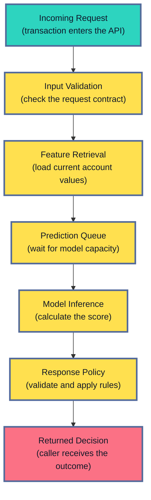

The user experiences this entire path. A model may need only 30 milliseconds to calculate a score, yet the request can still take two seconds because the feature service is slow. From the user's point of view, the service took two seconds.

This is why service health covers more than the model runtime. It includes the API, queues, feature lookups, preprocessing, inference, response validation, dependencies, and the compute underneath them.

For a batch system, the same idea applies to a different journey: did the job start, find the correct input, process all expected records, publish its output, and finish before the deadline?

You can think about the whole subject through five questions:

1. Can work enter the system?
2. Can it move through the system quickly enough?
3. Can the model and its dependencies process it?
4. Can a valid result leave the system?
5. Can the service continue under the current load?

Five core signals help answer those questions. **Traffic** measures incoming work. **Latency** measures time. **Errors** measure failed or unusable work. **Saturation** measures how close the system is to its limit. **Availability** measures whether valid users can actually use the service.


*The promise made to users sits at the top. The five service signals show whether that promise is being met. Component and resource metrics help explain any failure.*

## Service Health And Model Health Are Different
<!-- section-summary: Service health measures reliable delivery, while model health measures whether predictions remain accurate and useful. -->

An ML system can work perfectly in one sense and fail badly in another. Service health describes whether the production system delivers a result reliably. Model health describes whether that result is still accurate, safe, and useful.

Suppose an endpoint answers every request in 80 milliseconds and has 99.99 percent availability. Operationally, it looks excellent. Now suppose customer behaviour changes and the fraud model starts missing half of the fraud it used to catch. The service is reliable, while the model's predictions are poor.

The reverse can happen too. The model may still perform well on current labelled data, yet overloaded GPUs make requests wait in a queue until they time out. The prediction logic is still useful. The production system cannot deliver it.

This distinction matters because each failure needs a different investigation:

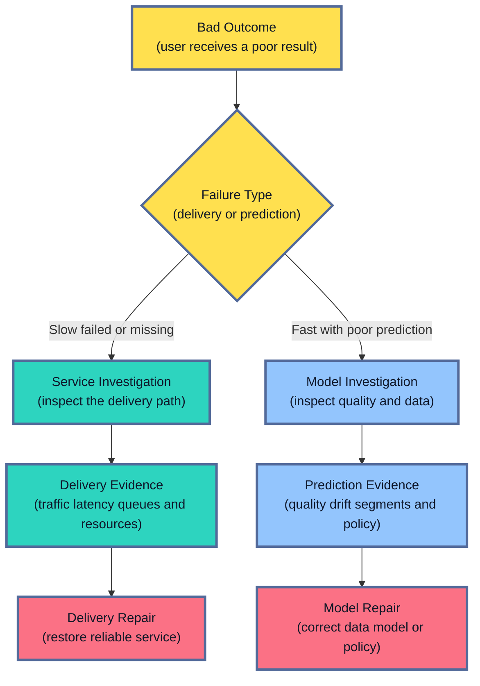

Some incidents cross both sides. A feature service might return stale values very quickly. The endpoint looks fast and available, although the predictions use old information. A fallback model might keep the API running, although its predictions are less accurate.

Production systems therefore record fallbacks, stale-data paths, and invalid predictions as visible outcomes. An HTTP `200 OK` status alone cannot tell you that the prediction was useful.

## How A Metric Represents Service Behaviour
<!-- section-summary: A metric records repeated numerical observations as counters, gauges, or distributions that can be compared over time. -->

At a high level, a **metric** is a numerical measurement recorded repeatedly. One value might say that the service has completed 24,810 requests, has 37 requests in progress, or took 0.18 seconds to answer one request. Recording those values over time reveals whether demand, speed, failures, or capacity are changing.

Prometheus represents each stream of measurements as a **time series**. A time series has a metric name and a set of labels. For example, `ml_inference_requests_total{model_route="candidate", result="success"}` is one series.

The name says what is being measured. The labels describe the group represented by that series. A request routed to the primary model or classified as a fallback belongs to a different series.

Three metric types cover most service-health questions:

- A **counter** is a cumulative total. It increases as events happen and may reset after a process restarts. Completed requests, timeouts, fallbacks, and generated tokens are common counters. Teams usually graph the rate of change, such as requests per second; the lifetime total mainly supports that calculation.
- A **gauge** is a current value that can move up or down. Requests in progress, queue depth, memory use, and loaded-model count are common gauges. A gauge answers, “What is the level right now?”
- A **histogram** collects many observations into a distribution. Request durations and payload sizes are common examples. The distribution supports questions such as, “How many requests met the 250-millisecond objective?” and “What are the p50, p95, and p99 latencies?”

One prediction request may update all three:

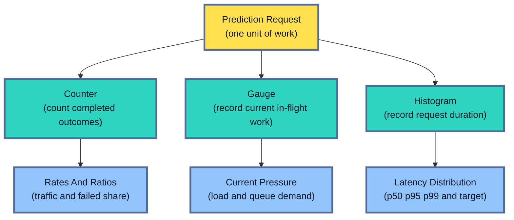

Consider a request that enters the service, waits in a queue, runs inference, and returns a fallback. The in-progress gauge rises by one as the request enters and falls by one after it finishes. The completed-request counter rises once with `result="fallback"`. The histogram records the full duration. These measurements describe different parts of the same experience, so replacing one with another would remove useful evidence.

Labels divide one metric into stable operational groups. A query grouped by `model_route` and `region`, for example, can reveal that candidate traffic is slow in one region while the other routes remain healthy.

Each distinct label combination creates another time series, so label values need controlled sets. Adding `prediction_id` or `customer_id` would create a new series for almost every request. That volume consumes monitoring resources and exposes sensitive identifiers. Exact request evidence belongs in a trace, structured log, or governed decision record.

### The instrumentation and the monitoring platform have different jobs

The application first records the measurement. A Prometheus client library can expose the current counters, gauges, and histograms on a `/metrics` endpoint. A Prometheus server scrapes that endpoint, stores timestamped samples, and evaluates queries and alert rules.

OpenTelemetry offers another common instrumentation path. Its APIs and SDKs create metrics in application code, and an OpenTelemetry Collector can receive, process, and export them. A managed cloud service may provide its own endpoint metrics automatically while also accepting custom Prometheus or OpenTelemetry data.

The dashboard is the last part of the path. Grafana can query Prometheus or another compatible backend and turn the stored series into charts. CloudWatch, Google Cloud Monitoring, and Azure Monitor provide collection, storage, queries, dashboards, and alerts within their cloud platforms.

In essence, the application knows what happened, the instrumentation represents it as a metric, the monitoring backend keeps the time series, and the dashboard helps a person read it. Separating these responsibilities identifies the failed layer during a telemetry incident, even if one product supplies several of them.

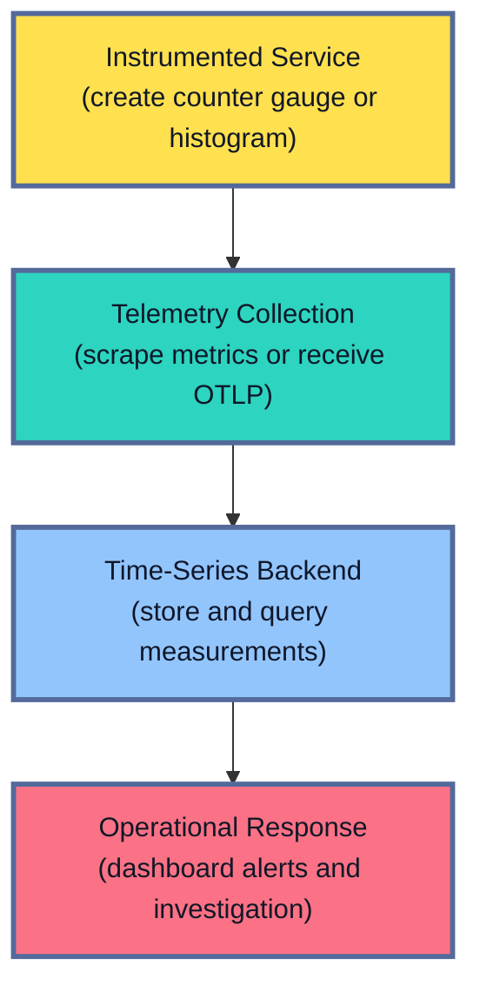

Traffic usually comes from counters and an in-progress gauge. Latency comes from histograms. Error ratios compare error and request counters. Saturation uses gauges such as queue depth, memory use, and active GPU work alongside counters for rejected demand.

## 1. Traffic: How Much Work Is Arriving?
<!-- section-summary: Traffic measures the demand entering an ML service in units that match the actual work. -->

**Traffic** is the amount of work sent to the service. It tells you how much demand the system is trying to handle, including work that is accepted, throttled, or rejected before inference starts.

For a normal prediction API, requests per second measures how quickly demand arrives. For a batch job, records processed per minute measures progress against the expected population and deadline.

An LLM service also needs input tokens, output tokens, active sequences, and generated tokens per second. Two requests can require very different amounts of compute, even if they look identical on a request-count graph.

Suppose an endpoint normally receives 100 requests per second. Traffic has now reached 480 requests per second, while load testing found a limit of about 500.

Nothing has failed yet. However, only 20 requests per second of tested capacity remain. One unavailable replica or one slow dependency could push the service beyond its limit.

The service also needs to count the work it refuses. Imagine callers send 480 requests per second, the service accepts 450, rejects 20, and throttles 10:

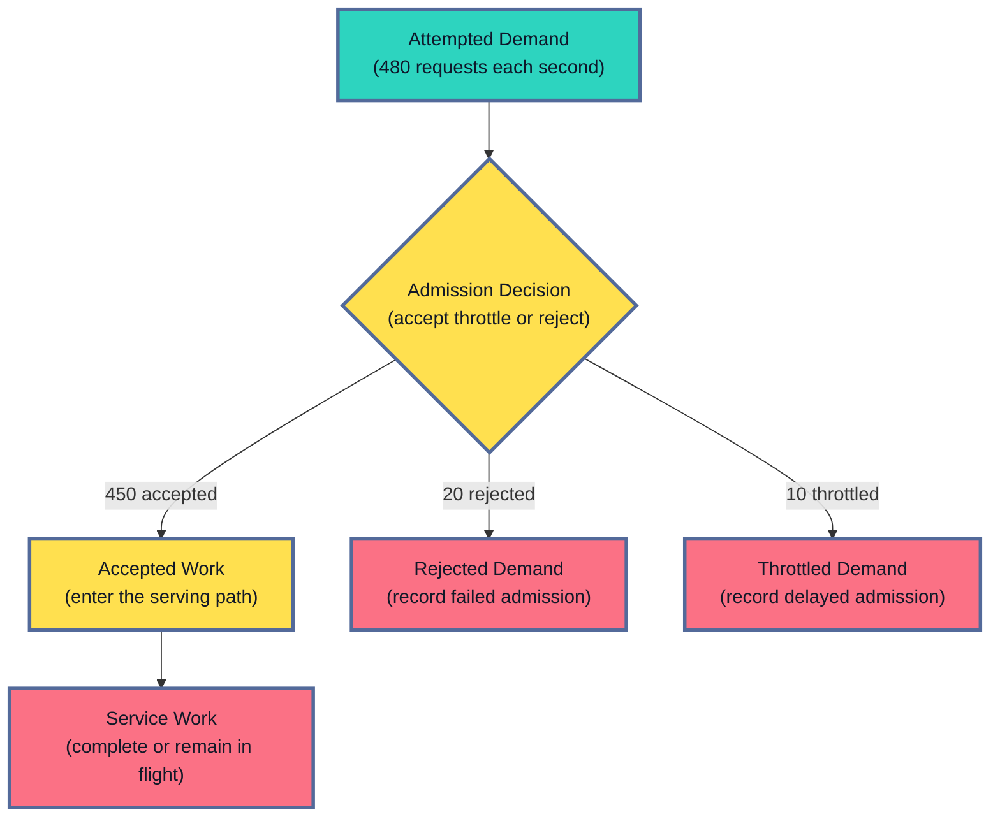

A chart containing only accepted requests reports 450. Callers actually attempted 480. The missing 30 requests are part of the user experience, so rejection and throttling need their own counters.

### Request rate and concurrency tell different stories

**Request rate** measures how quickly new requests arrive. **Concurrency** measures how many requests are inside the service at the same time. Looking at both explains a common puzzle: traffic can stay flat while the service suddenly carries much more work.

Suppose 100 requests arrive each second and each request takes 200 milliseconds. The service carries roughly 20 requests at once. If each request starts taking 800 milliseconds, the same arrival rate creates roughly 80 requests in progress.

A worker pool that supports 60 concurrent requests will now build a queue even though the traffic rate stayed at 100 requests per second. Concurrency reveals the extra pressure created by slower work.

### Use a traffic unit that matches the workload

Requests often represent unequal amounts of work. The traffic unit should describe the work that consumes capacity, so the useful unit changes across image inference, language generation, and batch scoring.

A vision endpoint may process thumbnails and 12-megapixel images. It needs request count plus input-size bands. An LLM endpoint may answer one request with ten tokens and another with two thousand. It needs request count plus token volume and active sequences. An overnight scoring job needs expected records, processed records, and remaining records.

Prometheus counters are a common choice for completed, rejected, and throttled requests. A gauge can record work currently in progress. Managed endpoints publish similar request and concurrency metrics through CloudWatch, Google Cloud Monitoring, or Azure Monitor.

Traffic gains meaning from the other signals. If traffic triples and latency, errors, and queues stay stable, scaling is probably keeping up. If traffic stays flat and latency rises, something inside the path has slowed down. If every failed request is retried three times, the extra traffic may be making the original outage worse.

## 2. Latency: How Long Does A Prediction Take?
<!-- section-summary: Latency measures the caller's total wait and the time spent in each important stage of the request. -->

**Latency** is the time between accepting work and finishing it. For an online prediction, it is the wait experienced by the caller. Measuring the full wait tells you whether the service met its promise; measuring the individual stages helps you find the slow part.

An ML request usually spends time in several places. In simple terms:

**Total latency = gateway time + queue wait + feature lookup + preprocessing + inference + post-processing + network time**

Suppose a request takes 420 milliseconds. Feature lookup uses 260 milliseconds, queueing uses 90, model inference uses 40, preprocessing uses 20, and post-processing uses 10.

The model uses less than ten percent of the total time. A faster model would save very little. The feature lookup and queue are the useful places to investigate.


*End-to-end latency shows what the caller experienced. The smaller measurements show where the request spent its time.*

This leads to two complementary measurements:

- **End-to-end latency** answers, “Did the user receive a result within the promised time?”
- **Stage latency** answers, “Which part of the request caused the delay?”

The end-to-end timer wraps the full request. Smaller timers cover queueing, feature retrieval, preprocessing, inference, and any other expensive dependency.

### Why averages hide slow users

An average combines fast and slow requests into one number, which can hide a small group of users having a terrible experience. Imagine 100 requests: ninety-nine finish in 100 milliseconds and one takes 10 seconds. The average is about 199 milliseconds.

That average sounds acceptable, yet it describes none of the requests well. Most users waited much less. One user waited dramatically longer.

Production dashboards therefore use **percentiles**:

- **p50** is the middle request. Half finish faster and half finish slower.
- **p95** is the time under which 95 percent of requests finish.
- **p99** is the time under which 99 percent finish.

Suppose the dashboard reports p50 at 75 milliseconds, p95 at 180 milliseconds, and p99 at 950 milliseconds.

Most callers get a quick answer. One request in every hundred takes almost a second. At 1,000 requests per second, that means ten very slow requests every second.

Successful and failed requests also need separate latency views. A failed request may return immediately because a database connection was refused. If those fast failures share one chart with successful requests, the service can appear faster during an outage.

Prometheus histograms are a common way to store latency distributions. Native histograms are stable in Prometheus 3.8 and later, although scraping and remote-write support still require explicit configuration and client-library support varies. Use them after confirming that instrumentation, collection, storage, and queries all preserve the native histogram.

Classic histograms remain widely used and require fixed buckets. Teams place useful bucket boundaries around the service objective, such as 200, 250, and 300 milliseconds for a 250-millisecond target.

## 3. Errors: How Much Work Fails?
<!-- section-summary: Error monitoring separates client mistakes, server failures, timeouts, rejected work, fallbacks, and unusable success responses. -->

**Errors** measure work that failed or produced an unusable result. The error rate tells you how common that experience is, while the error category tells you where to investigate. The basic calculation is:

**Error rate = failed requests ÷ total requests**

If 250 of 100,000 requests fail, the error rate is 0.25 percent and the success rate is 99.75 percent.

The harder question is deciding what counts as failure. An ML service can fail in several ways, and each one points toward a different solution.

### Client errors

A client error means the caller sent something the service cannot accept. Examples include invalid JSON, a missing required feature, an unsupported image format, an unknown model name, or an unauthorised request. These commonly appear as HTTP 4xx responses.

Some client errors originate from a service release. Suppose a new API version replaces `age` with `customer_age`. Older clients continue sending `age`, so thousands of requests fail validation. The containers are running normally, yet the release broke compatibility.

The practical response is to compare errors by API version and release. The team can restore the old field, accept both names during a migration window, or roll back the change.

### Server errors

A server error comes from inside the serving path. The model runtime may crash, model weights may be missing, a process may run out of memory, or a feature request may raise an exception. These commonly appear as HTTP 5xx responses.

Metrics should use a small set of stable causes such as `model_runtime`, `feature_timeout`, `out_of_memory`, and `dependency_unavailable`.

A structured error event can add a sanitised error class and the operation that failed. A retry count shows whether repeated attempts amplified the problem, while a trace ID connects the event to one request path.

Raw exception text is risky because it may contain input data, credentials, file paths, or other sensitive values. Production logging normally removes or redacts those values before export. A rare investigation that genuinely needs sensitive evidence uses a restricted store with explicit access and retention rules.

### Timeouts and rejected work

A timeout means the work did not finish before its deadline. The request might have waited too long in a queue, stalled during feature retrieval, or run a model that could not finish in time.

The service should record the stage that reached its deadline wherever possible. `feature_timeout` leads to a different investigation from `queue_timeout`.

Rejected work needs its own count as well. A bounded queue or admission controller may refuse new work to protect requests already in progress. That can be the safest overload response. The rejected caller still experienced a failed request.

### A `200 OK` response can still be a failure

HTTP status describes the request transport, so it cannot prove that the prediction itself is usable. One of the quietest ML failures returns a normal success status with a body like this:

```json
{
  "prediction": null,
  "probability": "NaN",
  "route": "primary"
}
```

The HTTP request succeeded. The caller received an unusable result.

This is why many ML services track **semantic success**. In simple terms, the service checks the meaning of the response before calling the request successful. Required fields must exist, numeric values must be finite, classes must be allowed, and any fallback must follow product policy.

A focused Prometheus example can record the final outcome after response validation:

```python
from time import perf_counter

from prometheus_client import Counter, Histogram

REQUESTS = Counter(
    "ml_inference_requests_total",
    "Completed inference requests",
    ("route", "model_route", "result"),
)

LATENCY = Histogram(
    "ml_request_duration_seconds",
    "End-to-end inference duration",
    ("route", "model_route", "result"),
)

started_at = perf_counter()
result = "error"

try:
    response = handle_prediction(request)
    result = validate_and_classify(response)
except TimeoutError:
    result = "timeout"
    raise
finally:
    labels = ("/v1/predict", "primary", result)
    REQUESTS.labels(*labels).inc()
    LATENCY.labels(*labels).observe(perf_counter() - started_at)
```

`validate_and_classify` can return `success`, `fallback`, `rejected`, or `error`. The metric is recorded after the service knows what it actually returned. A fallback can then appear separately from a normal prediction.

## 4. Saturation: How Close Is The System To Its Limit?
<!-- section-summary: Saturation shows where the service has little spare capacity, often before users see widespread failures. -->

**Saturation** means that some part of the system has little spare capacity. It is the warning that the service is approaching a limit, often before most users see errors.

A restaurant offers a familiar comparison. Traffic is the number of customers arriving. Latency is how long they wait. Errors are cancelled or incorrect orders. Saturation appears after the tables, chefs, or ovens have no room for more work.

An ML service has its own tables, chefs, and ovens: request queues, worker pools, memory, GPUs, database connections, and external quotas.

### Queue growth is an early warning

A queue grows after work arrives faster than workers can finish it. This gives the team an early view of overload before a large number of requests time out. Suppose 200 requests arrive each second and the service completes 180. The queue grows by 20 requests every second.

After one minute, roughly 1,200 requests are waiting.

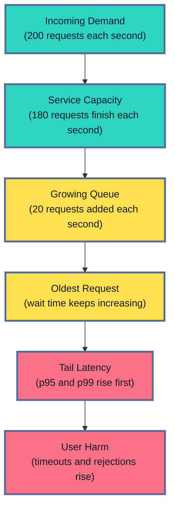

The model may still run at its normal speed. New requests spend longer waiting. Tail latency rises first, followed by timeouts and errors.

Queue depth needs the age of the oldest request beside it. A queue with 1,000 tiny requests might clear in one second. A queue with 100 large requests might keep its oldest item waiting for five minutes. Age shows whether the backlog is moving quickly enough.

### CPU and memory show different limits

CPU and memory can both limit a service, although they leave different clues. CPU pressure can appear as high worker occupancy, CPU throttling, longer preprocessing time, or a growing run queue.

Memory pressure often appears through a rising working set, longer garbage-collection pauses, container restarts, and out-of-memory kills. Model services are particularly sensitive because every worker may load a large copy of the model. Preprocessing can also create large temporary images, tensors, or token buffers.

Suppose a deployment doubles its worker count to increase throughput. If each worker loads a four-gigabyte model, memory use may also double. The new configuration can make every Pod restart and add no usable capacity.

### GPU compute and GPU memory answer different questions

GPU compute and GPU memory measure different constraints. One shows how busy the processing units are; the other shows how much room remains for model weights, batches, and runtime state. Consider a GPU with 35 percent compute utilisation and 98 percent memory utilisation. Idle compute cycles remain, yet the runtime may be unable to load another model or increase its batch size because memory is nearly full.

At 95 percent compute utilisation and 40 percent memory utilisation, the processing units carry nearly all the available work while memory still has room. Queue growth or rising token latency would confirm a compute limit.

High utilisation alone describes busy hardware. A GPU at 95 percent compute can be healthy if the queue is empty and latency is stable. Waiting, rejection, or timeouts confirm that extra demand has crossed the service limit.

LLM services split latency into two experiences. **Time to first token** measures how long the user waits before any generated text appears. **Inter-token latency** measures the delay between later tokens, so it describes how smoothly the answer streams after it starts.

The runtime also reports how much work it is carrying. **Active sequences** are requests currently generating text. **Token throughput** is the number of tokens produced each second. The **KV cache** keeps attention data from earlier tokens so the model can reuse it for each new token. A nearly full cache leaves less room for new or long-running requests.

Suppose time to first token rises from 300 milliseconds to three seconds while inter-token latency stays stable. Users are waiting before generation starts, so queueing or admission is the likely problem. If inter-token latency also rises and token throughput stops increasing, the GPU is more likely at its compute limit. If the runtime rejects new sequences while KV-cache use is near its limit, memory or batching is the more useful place to investigate.

On NVIDIA GPU nodes, DCGM Exporter exposes Prometheus telemetry for GPU activity, framebuffer memory, temperature, and hardware health. A vLLM server adds workload signals such as `vllm:num_requests_waiting`, `vllm:time_to_first_token_seconds`, `vllm:inter_token_latency_seconds`, and `vllm:kv_cache_usage_perc`. Reading both layers separates “the GPU is busy” from “requests are waiting because this runtime has exhausted a specific serving resource.”

### The fix depends on the saturated resource

Solving saturation starts by identifying the resource that has run out of room. More replicas help only if that resource can scale with them; otherwise, the new replicas may add pressure to the same bottleneck.

A CPU preprocessing bottleneck may need more preprocessing workers or cheaper transforms. GPU memory pressure may require smaller batches or a smaller approved model.

Another option is **quantisation**, which stores and calculates model numbers with fewer bits so the model uses less memory. It can change prediction quality, so the quantised artifact needs the same evaluation, safety checks, and release controls as another model candidate.

A full database connection pool needs work on the database path, connection reuse, or a safe fallback. Adding model replicas can make the incident worse because every new replica opens more connections to the same overloaded dependency.

## 5. Availability: Can People Actually Use The Service?
<!-- section-summary: Availability measures the share of valid work that receives an acceptable result. -->

**Availability** describes whether people can actually use the service. It is the proportion of valid work that receives an acceptable result:

**Availability = successful valid requests ÷ all valid requests**

The phrase **valid requests** matters. A caller sending broken JSON usually should not count as service downtime. A valid request that reaches the service and times out should count.

Suppose one million requests reach an endpoint. Ten thousand contain invalid client input, and 500 valid requests fail inside the service.

The service evaluates 990,000 valid requests and succeeds for 989,500. Dividing 989,500 by 990,000 gives approximately 99.949 percent availability.

The word **acceptable** also needs a product decision. A cached recommendation may be acceptable during a short dependency outage. A conservative fallback might be unsafe for a medical or financial decision. Record fallback use separately, then decide whether it counts as available for that particular service.

### A health endpoint proves only what it checks

Health checks answer smaller questions about one instance. A single `GET /health → 200 OK` response proves that some code answered a small request. It may say nothing about model loading, GPU access, available workers, feature retrieval, or the ability to produce a valid prediction.

Kubernetes separates three questions:

- A **startup probe** asks whether the application has finished starting.
- A **readiness probe** asks whether this Pod should receive production traffic.
- A **liveness probe** asks whether restarting the container can repair a stuck process.

Large models make this separation especially useful. A container can be alive while it downloads weights and warms the runtime. Readiness stays false, so traffic continues going to workers that can answer.

```yaml
startupProbe:
  httpGet:
    path: /health/startup
    port: 8080
  periodSeconds: 5
  failureThreshold: 60

readinessProbe:
  httpGet:
    path: /health/ready
    port: 8080
  periodSeconds: 5
  failureThreshold: 2

livenessProbe:
  httpGet:
    path: /health/live
    port: 8080
  periodSeconds: 10
  failureThreshold: 3
```

This configuration allows up to five minutes for startup. Two failed readiness checks remove the Pod from service traffic. Three failed liveness checks restart the container. Real values come from measured model-loading and recovery times.

Liveness deserves care. Imagine that every liveness check calls a remote feature store. The feature store fails, so Kubernetes restarts every healthy model Pod. The remaining Pods receive more traffic while restarted Pods reload their models. One dependency outage has now spread into a serving outage.

A liveness probe should focus on problems a restart can repair. Readiness can reflect a critical dependency if the service truly cannot produce an acceptable result without it. A reviewed fallback or circuit breaker may protect users better than removing every instance from service.

An external synthetic check adds the user's view. It sends a safe request through DNS, TLS, authentication, routing, dependencies, inference, and response validation. This can catch a broken certificate or gateway rule even if all internal process metrics look healthy.

## 6. Dependencies: The Model Is One Part Of The Request
<!-- section-summary: Dependency metrics reveal slow or failing feature services, databases, queues, caches, and external APIs. -->

Most production model endpoints depend on other systems. The model can run at its normal speed while one of those dependencies makes the whole request slow or unavailable. Common dependencies include an online feature service, database, cache, vector store, authentication service, message queue, or external model provider.

Suppose end-to-end latency rises from 100 to 600 milliseconds. API work and validation use 35 milliseconds, feature lookup uses 480, model inference uses 45, and the remaining work uses 40.

The model still takes 45 milliseconds. The feature lookup now takes 480. Replacing or optimising the model would address the wrong part of the request.

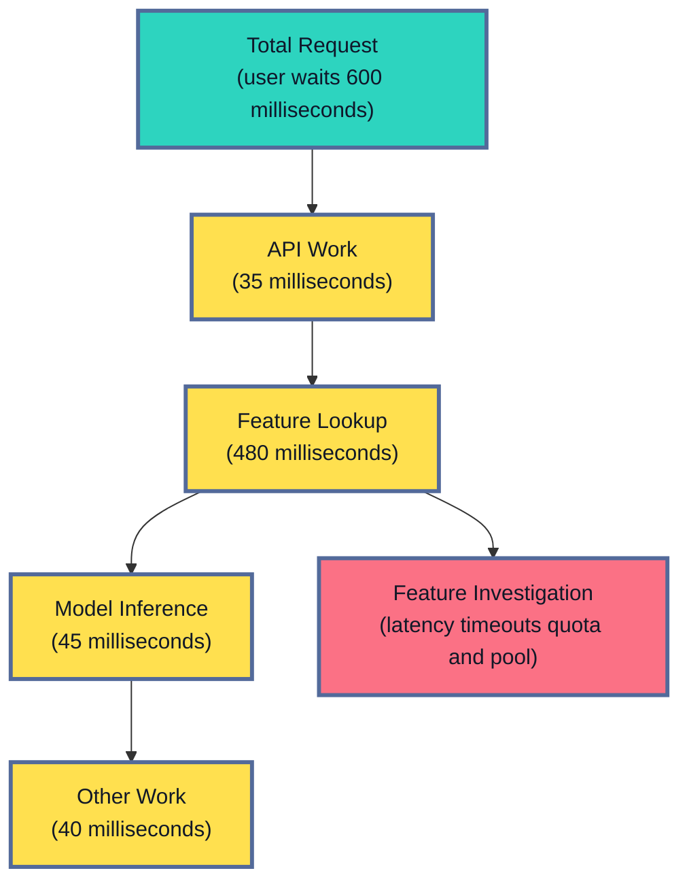

Each critical dependency needs a few familiar signals: call rate, latency, errors, timeouts, and retries. The exact resource signals depend on the system. A database client exposes connection-pool use. A queue exposes backlog and oldest-message age. An external API exposes rate-limit responses and quota.

Retries need special attention. If one dependency call fails and retries twice, one prediction creates three dependency requests. During a large outage, retries send more work to a system that is already struggling.

The usual protection uses a small retry limit and one overall request deadline. **Exponential backoff** increases the pause after each failed attempt. **Jitter** adds a small random difference to that pause and spreads retries across time. The policy must still leave enough time for the service to return a controlled response before the caller gives up.

A **circuit breaker** pauses calls after repeated failures. You can think of it as an automatic safety switch. After a dependency is clearly unavailable, the service fails quickly, uses an approved cache, chooses a fallback, or rejects the request.

Metrics show whether a dependency is slow across many requests. A trace can then show the detailed path of one slow request, while logs provide the exact failure or retry event.

## 7. Batch Inference Needs Different Health Signals
<!-- section-summary: Batch health measures timely starts, progress, completeness, freshness, publication, and deadlines. -->

Many ML systems run scheduled batches. They score customers overnight, process documents each hour, or create forecasts before the business day. Their health is mainly about progress, completeness, freshness, and meeting a deadline.

For these systems, p99 API latency tells very little. The important questions are:

- Did the job start near its scheduled time?
- Did it read the expected input?
- Are records still moving through the pipeline?
- Did every expected entity receive a valid result?
- Was the output published before the deadline?

Suppose a nightly scoring job expects five million customers and must publish by 06:00. It produces 4.23 million predictions, rejects 2,000 records, and reports a `SUCCESS` status.

The process exited with code zero, so the orchestration system reports success. The business is missing 770,000 predictions. Dividing 4.23 million produced predictions by five million expected predictions gives 84.6 percent coverage.

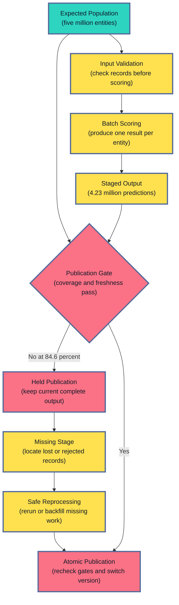

Three ideas catch this kind of partial success:

- **Completeness** compares produced output with expected work.
- **Coverage** checks which expected entities received a valid result.
- **Freshness** measures the age of the input or newest published output.

Stage counts help locate the missing records. If five million records enter validation and only 4.3 million leave, the problem is probably an input or schema issue. If five million pass validation and only 4.23 million predictions reach storage, the problem sits later in scoring, joining, or writing.

Each important stage therefore reports records received, accepted, rejected, and produced.

Airflow, Dagster, managed ML pipelines, and Databricks Jobs can report job state and duration. Spark and cloud batch endpoints expose execution progress and failures.

These tools cannot guess the expected business population. The pipeline still needs application-level counts, freshness, and coverage.

Deadline alerts also need remaining work and tested catch-up speed. If one million records remain at 05:30 and the job can process only 20,000 per minute, it cannot meet a 06:00 deadline even though the workers are still running.

In this example, the 4.23 million rows stay in a staging location and the current complete output remains active. Stage counts reveal where the missing records disappeared. The team then reruns the failed partition or backfills the missing entities.

That rerun should be **idempotent**, meaning the same partition or entity can be processed again without creating duplicate predictions. Stable run, entity, and scoring-time keys help the writer replace or merge the repeated work safely.

After the rerun, the publication gate checks coverage, rejected-record policy, input freshness, output freshness, and the deadline again. Passing output is promoted in one atomic step, such as switching a table alias or version pointer. Downstream readers then see the previous complete version or the new complete version, never a half-written mixture.

If the deadline is missed, the fallback follows the product's policy. Some use cases may continue serving the last complete output with an explicit staleness indicator. Other decisions are unsafe with old data and must publish nothing, stop downstream action, or move to manual review.

## 8. Every Release Needs Its Own Health View
<!-- section-summary: Release-level metrics expose a candidate that aggregate service graphs can hide. -->

An overall service graph mixes old and new versions together, so a healthy stable version can hide a failing candidate. Every controlled release therefore needs a separate health view for each route.

A **canary release** sends a small share of real traffic to the candidate first. A **blue-green release** keeps the stable and new environments running side by side, then moves traffic after the new environment passes its checks. Both approaches need separate measurements for the stable and candidate paths.

Suppose the stable model receives 90 percent of traffic and a candidate receives 10 percent. The overall error rate is 0.6 percent. Split by route, the stable error rate is 0.1 percent and the candidate error rate is 5.1 percent.

The overall number looks fairly small because the healthy stable route handles most requests. The candidate fails much more often.

Canary releases compare the stable and candidate routes separately. Useful service checks include request volume, invalid-output rate, fallback use, p95 and p99 latency, queueing, memory, and accelerator pressure.

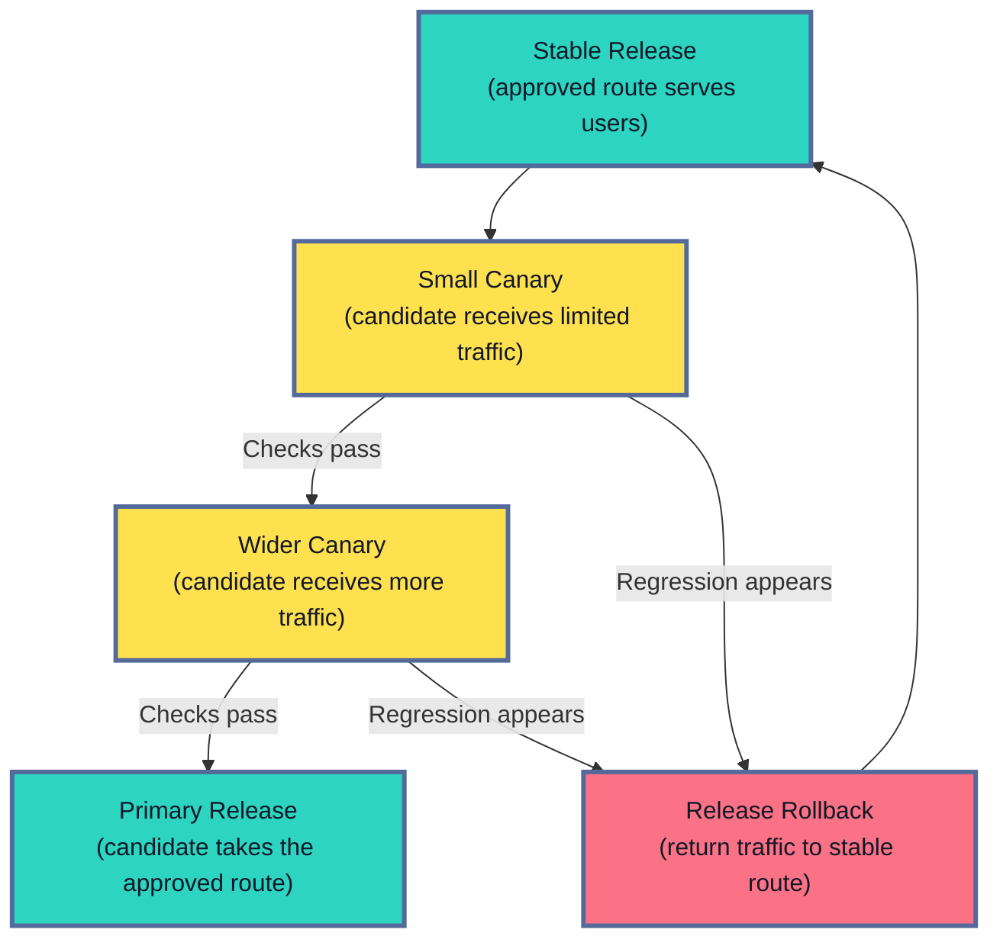

The candidate needs enough representative work. Ten small requests say very little about a model serving many request shapes. A busy endpoint may gather evidence quickly. A low-volume endpoint may need a longer observation period or a controlled staging replay.

Metrics can use stable route labels such as `primary` and `candidate`. The release system keeps the exact model artifact, container image, configuration, and policy behind each route. This avoids putting every unique artifact identifier into every time series.

An automated rollout might stop after the candidate error rate exceeds the stable route by one percentage point for ten minutes, p99 latency crosses the service limit, or invalid outputs exceed policy. Real thresholds come from traffic volume, service objectives, and risk.

Service health is one release decision. Model-quality and safety checks are another. A candidate may run quickly and reliably while making worse predictions.

After a rollback, verify that the original symptoms recover. If latency and errors remain high, the release may only have exposed a shared dependency or capacity problem.

## 9. SLI, SLO, And SLA Turn Metrics Into Expectations
<!-- section-summary: SLIs measure the user experience, SLOs set the target, and SLAs describe an external commitment. -->

A dashboard can contain hundreds of graphs and still leave one question unanswered: is the service reliable enough for its users? SLIs, SLOs, and SLAs give the measurements a clear meaning by connecting them to an expectation.

The three terms assign separate roles to the measurement, the internal target, and any external commitment.

### SLI: what are we measuring?

A **Service Level Indicator**, or **SLI**, is the actual measurement of a user-facing experience. It might measure successful requests, timely responses, or batch jobs that met their publication deadline.

Examples include the percentage of valid requests that return a usable prediction, the percentage that finish within 300 milliseconds, or the percentage of scheduled jobs that publish before their deadline.

### SLO: what target are we trying to meet?

A **Service Level Objective**, or **SLO**, applies a target to the indicator over a stated period. It turns “latency looks high” into a testable promise such as “99 percent of successful requests finish within 300 milliseconds.”

For example, one service might set these objectives:

- 99.9 percent of valid inference requests return an acceptable result.
- 99 percent of successful requests finish within 300 milliseconds.
- 99.9 percent of scheduled scoring jobs publish before their deadline.

The definition needs details. Does an approved fallback count as success? Are malformed requests outside the denominator? Does latency cover the entire request or only the model runtime? Those choices should match the experience promised to users.

### SLA: what have we promised externally?

A **Service Level Agreement**, or **SLA**, is usually a customer-facing or contractual commitment. It tells an external customer what the provider promises and may include service credits or other consequences after the provider misses it.

Many internal services have SLIs and SLOs without an external SLA.

### Error budgets turn reliability into a decision

An SLO intentionally allows a small amount of failure. If the target is 99.9 percent availability across one million valid requests, the service can miss its objective for 1,000 requests before using the full allowance.

That allowance is the **error budget**:

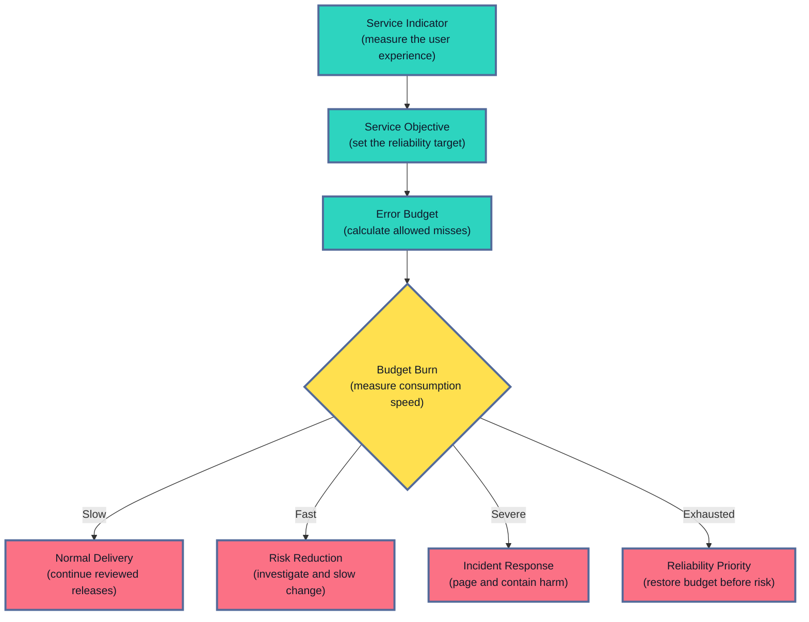

A five-minute error spike might use only a small part of a monthly budget. A severe outage could consume the same amount in two hours.

**Burn rate** measures that speed. Production alerting often combines a short window for fast outages with a longer window for sustained problems. This catches severe incidents quickly without paging someone for every tiny fluctuation.

## 10. Good Alerts Ask For A Real Action
<!-- section-summary: Useful alerts focus on user harm or an approaching hard limit and provide enough context for a clear response. -->

A dashboard supports exploration. A page interrupts someone, so it should describe a problem that needs action. A page-ready alert connects a user-visible symptom to an owner, a severity, and a first-response guide.

An alert stating that more than two percent of inference requests have failed for ten minutes is usually useful. It describes user harm and a sustained duration.

An alert stating only that CPU utilisation is above 80 percent is often noisy.

Some services run safely at 80 percent CPU all day. If latency, errors, and queue age remain normal, users may see no problem. CPU still helps explain the cause after a user-facing alert.

A strong alert answers four questions:

1. What user-facing symptom crossed its limit?
2. Which service or route is affected?
3. Who owns the response?
4. Where is the runbook?

Here is a focused Prometheus rule for a service whose fallback counts as an unavailable prediction:

```yaml
groups:
  - name: inference-service
    rules:
      - alert: InferenceUnavailableRatioHigh
        expr: |
          (
            sum(rate(ml_inference_requests_total{
              result=~"error|timeout|rejected|fallback"
            }[5m]))
            /
            sum(rate(ml_inference_requests_total[5m])) > 0.02
          )
          and
          sum(rate(ml_inference_requests_total[5m])) > 0
        for: 10m
        keep_firing_for: 5m
        labels:
          severity: page
          owner: model-serving
        annotations:
          summary: "Unavailable prediction ratio is above 2%"
          runbook_url: "https://runbooks.example/inference-unavailable"
```

The numerator counts errors, timeouts, rejections, and fallbacks. The second condition confirms that traffic exists. The ratio must remain above two percent for ten minutes before the alert fires.

Prometheus evaluates the rule. Alertmanager groups related alerts, removes duplicates, applies silences, and routes the page to its owner. The runbook gives the first useful checks, safe containment options, and the measurement that will confirm recovery.

Production services often use SLO burn-rate alerts because one static ratio captures neither fast budget loss nor a slow sustained problem. Batch services use deadline risk, remaining work, and catch-up capacity because a five-minute request ratio cannot describe a scheduled job.


*The alert identifies user harm. Release, dependency, queue, and resource evidence then helps the responder choose a safe action.*

## 11. How These Metrics Reach A Dashboard
<!-- section-summary: Applications and runtimes create measurements, a collection layer moves them, and a time-series backend powers dashboards and alerts. -->

Follow one metric from the application to the responder to identify every production responsibility. The application creates the measurement. Collection moves it, the backend stores it, a dashboard displays it, and an alert rule evaluates it against an operational limit.

Suppose the API records `ml_inference_requests_total` after every completed request. A Prometheus server can **scrape** the service by reading its `/metrics` endpoint at regular intervals.

The service can also send measurements to an OpenTelemetry Collector. **OTLP**, the OpenTelemetry Protocol, is the standard format used to carry that telemetry. The Collector receives it, applies approved processing, and forwards it to the monitoring backend.

The backend stores each metric value with a timestamp. This is why it is called a **time-series** system: it can show how request rate or latency changed over time. Grafana or a cloud dashboard reads those stored values, while alert rules check them for harmful conditions.

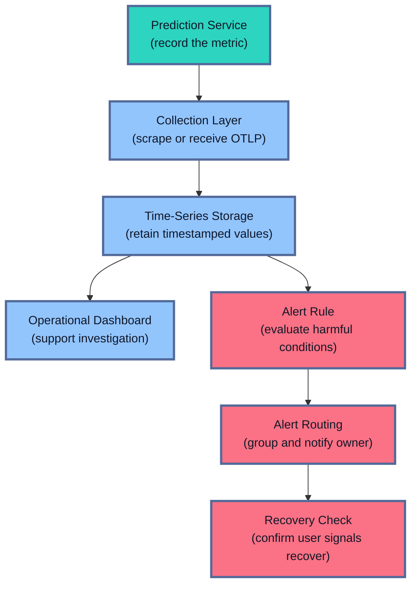

For Kubernetes, the application layer uses a Prometheus client or OpenTelemetry SDK to record request outcomes and latency. Prometheus-compatible storage retains the time series, while Grafana and Alertmanager support investigation and notification routing.

The cluster layer needs separate evidence. kube-state-metrics reports the desired and observed state of Kubernetes objects such as Deployments and Pods. Node and container metrics cover CPU, memory, and restarts. NVIDIA DCGM Exporter adds GPU telemetry on NVIDIA nodes.

These sources answer different questions. Application metrics expose user impact, Kubernetes object metrics expose scheduling and readiness gaps, and resource exporters expose the capacity underneath each worker.

OpenTelemetry provides one cross-language way to produce metrics. For production OTLP pipelines, the OpenTelemetry project recommends placing a Collector between SDKs and Prometheus. The Collector can centralise routing, enforce approved resource attributes, remove disallowed attributes, and deliver approved signals to several backends. A small service with a direct Prometheus scrape path may need no Collector.

If this collection path breaks, the model service may continue serving requests while the dashboard stops receiving new points. Scrape success, Collector queue and export failures, and the timestamp of the newest metric make that loss visible.

Managed serving platforms already expose many operational measurements. SageMaker AI publishes invocation, model and platform latency, 4xx and 5xx errors, concurrency, CPU, memory, and GPU metrics through CloudWatch. Its detailed inference observability uses an OpenTelemetry Collector to scrape node, DCGM, vLLM, and SGLang endpoints, then exports OTel metrics to CloudWatch over OTLP. CloudWatch supports PromQL queries for those metrics; no Prometheus server sits in that managed path.

Azure Machine Learning online endpoints connect request rate, latency, response status, CPU, GPU, memory, logs, dashboards, and alerts through Azure Monitor. Vertex AI publishes prediction counts, response codes, errors, latency distributions, replica counts, and accelerator signals through Cloud Monitoring. These provider metrics cover the managed boundary, while application metrics still classify semantic success and fallback use.

The platform still cannot decide whether your response makes sense. It can see HTTP `200`, while only the application knows that `prediction=null` is unusable or that a particular fallback violates product policy. Application metrics add result class, fallback use, and model route.

### Keep metric labels small and predictable

A label splits a metric into useful groups. `region="eu-west"` and `model_route="candidate"` let you isolate a problem. Labels stay useful only while their possible values remain small and predictable.

Every combination creates another time series. Five endpoints, four result classes, three regions, two environments, and two routes already produce 240 combinations for one metric. Adding a customer ID can create millions.

Good metric labels come from small, reviewed sets: normalised route, result class, region, environment, workload class, and active route.

User IDs and request IDs can appear in sanitised, access-controlled logs or traces if the investigation requires them.

Raw URLs, prompts, feature values, and exception text may contain sensitive data. General telemetry excludes them by default. A policy-approved raw-evidence path uses a restricted store and applies redaction before storage. Access controls, retention policy, and audit records then govern who can inspect that evidence and how long it remains available.

In essence, each observability signal has a different job. Metrics reveal patterns across many requests. Logs explain individual events. Traces show the path of one request. Prediction records preserve model decisions for later quality analysis.

## 12. A Useful Dashboard Tells A Story
<!-- section-summary: A production dashboard moves from user impact to queues, dependencies, releases, and infrastructure. -->

A useful dashboard helps a responder move from “users are having a problem” to “this is the part of the system causing it.” It should read like an investigation, with selected metrics arranged from user impact to likely cause.

The top row shows traffic, availability, success and fallback rates, p50, p95, and p99 latency, timeouts, and error-budget consumption. It tells the responder what users are experiencing.

The next row shows queue depth, oldest-request age, in-flight work, rejected requests, ready and desired replicas, and autoscaling activity. It tells the responder whether the service can keep up.

Dependency rows show feature-store latency, database errors, cache hit rate, external API timeouts, and connection-pool use. Release rows compare stable and candidate traffic. Infrastructure rows show CPU, memory, GPU compute, GPU memory, restarts, and out-of-memory kills.

The order matters because the first graph should describe the problem users feel. The lower graphs should explain it.

### Work through a concrete incident

At 14:00, an image-classification endpoint receives a sharp traffic increase. Request rate rises from 200 to 500 requests per second. p99 latency rises from 300 milliseconds to 4.2 seconds, the error rate rises from 0.1 to 8 percent, and the queue grows from zero to 9,000. The autoscaler requests twenty replicas, although only ten are ready. Model runtime stays at its normal value.

Model runtime stayed normal. Traffic rose, the current replicas reached capacity, and the queue grew. Requests waited until some crossed their timeout. Autoscaling asked for twenty replicas, yet only ten were ready.

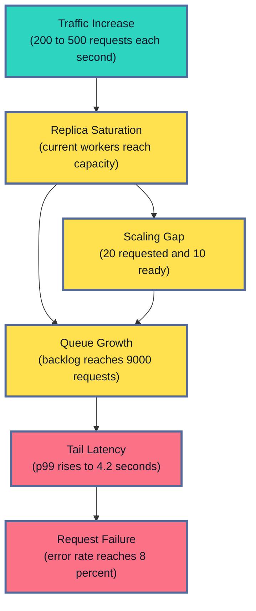

The immediate response may restore GPU capacity, limit new work, or route approved traffic to a tested fallback. Rolling back the model has no supporting evidence because model runtime is unchanged.

After capacity returns, the responder checks the original symptoms: queue age falls, p99 latency returns to its normal range, and errors stop. Traffic should increase gradually while the queue continues to drain.

The follow-up investigation asks why ten requested replicas failed to reach readiness. The cause could be unavailable GPU capacity, failed image pulls, model-loading failures, an autoscaling signal that reacts too late, or a cluster quota.

The longer-term solution follows that cause. It might reserve accelerator capacity, scale from queue age or concurrency, bound the queue, add load shedding, or test a smaller fallback model.

The dashboard should also prove that monitoring itself is fresh. A broken scraper or Collector can produce an empty graph that looks like zero errors. Useful checks include scrape success, newest metric time, Collector queue pressure, exporter failures, and rule-evaluation errors.

## 13. Test The Monitoring And Recovery Path
<!-- section-summary: Metric tests, load tests, alert tests, synthetic checks, and failure exercises prove that service monitoring works. -->

Monitoring can fail quietly. A renamed metric empties a graph. A new label creates millions of time series. An alert routes to an abandoned channel. A Collector stops exporting while the prediction service continues answering requests.

Several focused tests cover different parts of the path.

**Application metric tests** send successful, failed, timed-out, rejected, and fallback requests. They check that every outcome increments the correct counter and records the correct duration. A separate test uses many request IDs and confirms that none of them appear as metric labels.

**Load tests** increase demand while recording traffic, concurrency, queue depth, p95 and p99 latency, errors, and resource pressure. The inputs should resemble production. A thousand thumbnails tell you very little about a service that normally receives large medical images.

**Alert-rule tests** provide sample time series and check the expected alert state. Prometheus users can run `promtool test rules` in CI. A staging notification then confirms the Alertmanager route, owner, severity, summary, and runbook link.

**Synthetic checks** send a safe request through the public endpoint and validate the response. They can detect a broken certificate, gateway rule, authentication path, or malformed success response even if internal component metrics remain green.

**Telemetry failure exercises** stop the Collector or make the backend reject writes while prediction traffic continues. Inference should continue, telemetry buffers should stay bounded, and a monitoring-loss alert should fire. After recovery, a known request confirms that fresh metrics arrive again.

The final check returns to the original user symptom. A rollback is successful after candidate errors and latency recover. A scaling repair is successful after the queue drains and spare capacity returns. A dependency fallback is successful after the product confirms that the degraded result is safe.


*A service has recovered after the same user-facing measurements that exposed the incident return to an acceptable state.*

## The Main Idea
<!-- section-summary: Service health metrics show whether work can enter, move through, and leave an ML system reliably under real demand. -->

Service health metrics answer whether a production model can actually serve its users. They connect the user's request to the queues, dependencies, compute, release, and recovery work behind it.

Traffic shows how much work arrives. Latency shows how long it takes. Errors show failed and unusable results. Saturation shows where capacity is running out. Availability shows whether valid work receives an acceptable result.

ML services add their own important details: model loading, feature retrieval, queueing, GPU and KV-cache pressure, batch completeness, and candidate releases. End-to-end metrics describe the user's experience. Stage and resource metrics explain why that experience changed.

A useful production setup connects these measurements to an SLO, a clear dashboard, an alert with an owner, and a tested recovery path. That is what turns a collection of graphs into something a team can use during a real incident.

## References

- [Google SRE: Monitoring Distributed Systems](https://sre.google/sre-book/monitoring-distributed-systems/)
- [Google SRE: Service Level Objectives](https://sre.google/sre-book/service-level-objectives/)
- [Google SRE Workbook: Alerting on SLOs](https://sre.google/workbook/alerting-on-slos/)
- [Prometheus instrumentation practices](https://prometheus.io/docs/practices/instrumentation/)
- [Prometheus data model](https://prometheus.io/docs/concepts/data_model/)
- [Prometheus metric types](https://prometheus.io/docs/concepts/metric_types/)
- [Prometheus histograms and summaries](https://prometheus.io/docs/practices/histograms/)
- [Prometheus native histograms](https://prometheus.io/docs/specs/native_histograms/)
- [Prometheus metric and label naming](https://prometheus.io/docs/practices/naming/)
- [Prometheus alerting rules](https://prometheus.io/docs/prometheus/latest/configuration/alerting_rules/)
- [Prometheus Alertmanager](https://prometheus.io/docs/alerting/latest/alertmanager/)
- [Prometheus rule unit testing](https://prometheus.io/docs/prometheus/latest/configuration/unit_testing_rules/)
- [OpenTelemetry Python status](https://opentelemetry.io/docs/languages/python/)
- [OpenTelemetry metrics](https://opentelemetry.io/docs/concepts/signals/metrics/)
- [OpenTelemetry Collector](https://opentelemetry.io/docs/collector/)
- [OpenTelemetry Protocol](https://opentelemetry.io/docs/specs/otlp/)
- [OpenTelemetry Collector internal telemetry](https://opentelemetry.io/docs/collector/internal-telemetry/)
- [Kubernetes liveness, readiness, and startup probes](https://kubernetes.io/docs/concepts/workloads/pods/probes/)
- [kube-state-metrics](https://github.com/kubernetes/kube-state-metrics)
- [NVIDIA DCGM Exporter metrics](https://docs.nvidia.com/datacenter/dcgm/latest/reference/dcgm-exporter-metrics.html)
- [vLLM production metrics](https://docs.vllm.ai/en/latest/usage/metrics/)
- [SageMaker AI metrics in CloudWatch](https://docs.aws.amazon.com/sagemaker/latest/dg/monitoring-cloudwatch.html)
- [SageMaker AI detailed observability for inference endpoints](https://docs.aws.amazon.com/sagemaker/latest/dg/monitoring-cloudwatch-detailed-observability.html)
- [Vertex AI metrics in Cloud Monitoring](https://cloud.google.com/monitoring/api/metrics_gcp_i_o)
- [Azure Machine Learning online endpoint monitoring](https://learn.microsoft.com/en-us/azure/machine-learning/how-to-monitor-online-endpoints?view=azureml-api-2)
