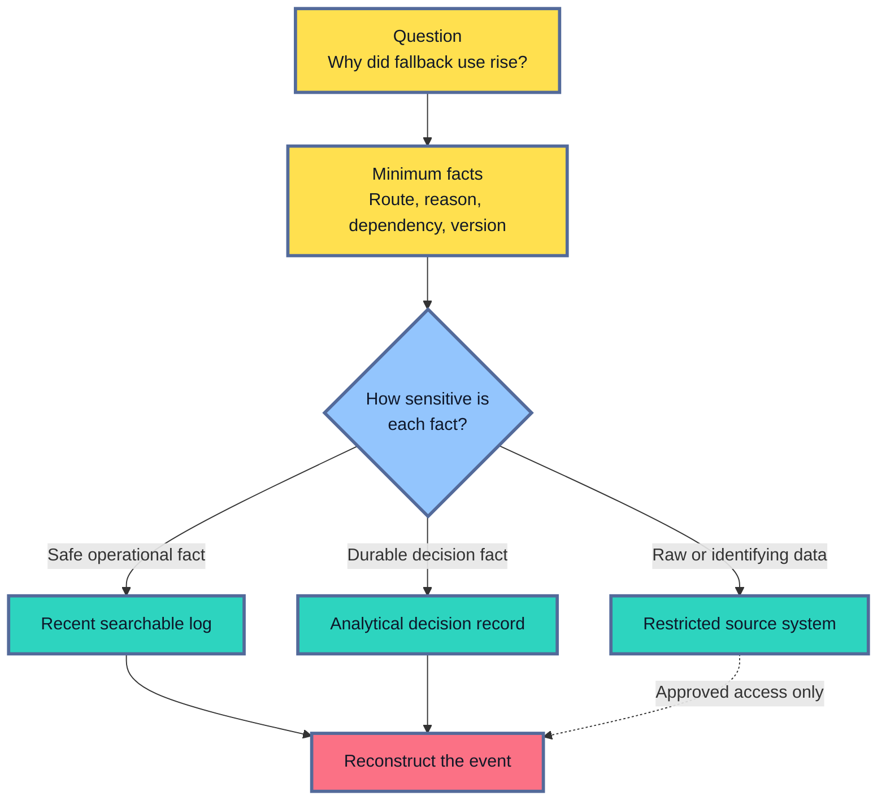
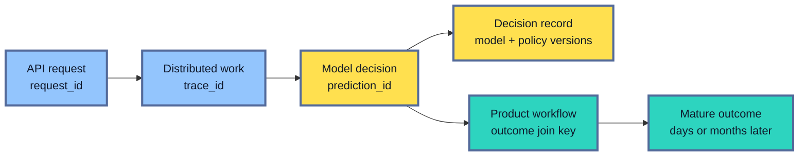
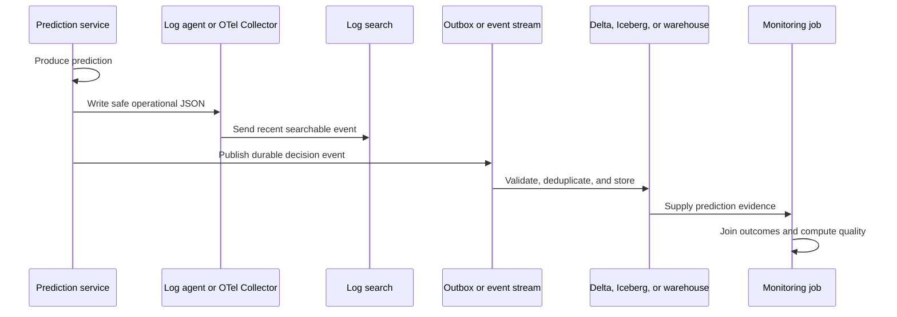
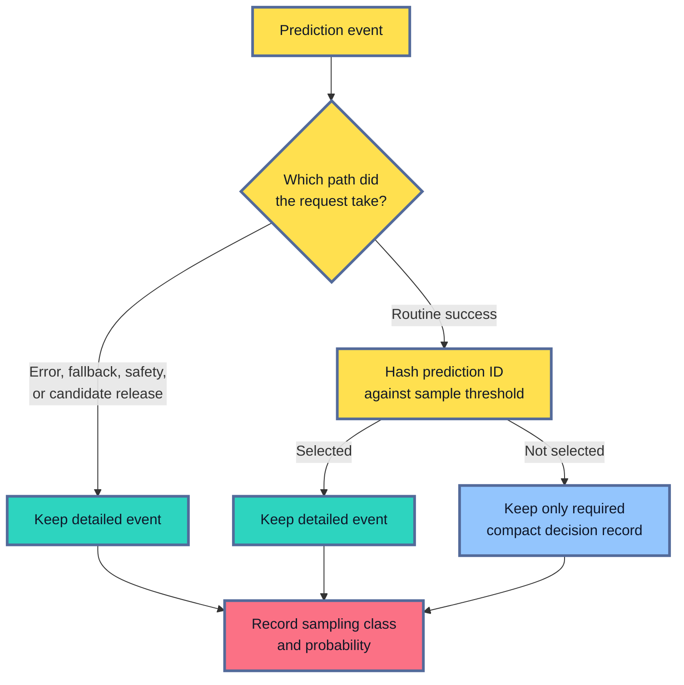

## Table of Contents

1. [What Prediction Logging Means](#what-prediction-logging-means)
2. [Decide What The Team Needs To Explain](#decide-what-the-team-needs-to-explain)
3. [Give Each Prediction A Stable Identity](#give-each-prediction-a-stable-identity)
4. [Write A Structured Event That People And Systems Can Read](#write-a-structured-event-that-people-and-systems-can-read)
5. [Keep Raw Inputs And Secrets Outside General Telemetry](#keep-raw-inputs-and-secrets-outside-general-telemetry)
6. [Move Prediction Evidence Through A Production System](#move-prediction-evidence-through-a-production-system)
7. [Control Volume, Retention, And Access](#control-volume-retention-and-access)
8. [Investigate A Production Problem With Prediction Evidence](#investigate-a-production-problem-with-prediction-evidence)
9. [Prove That The Logging Path Works](#prove-that-the-logging-path-works)
10. [The Main Idea](#the-main-idea)
11. [References](#references)

## What Prediction Logging Means
<!-- section-summary: Prediction logging records a safe history of each production decision so teams can explain, monitor, and improve deployed models. -->

**Prediction logging is the practice of recording what happened around a model prediction.** It gives the production system a memory.

Imagine a loan application receives a `manual_review` decision. Two weeks later, the applicant challenges the result. The support team needs to answer several ordinary questions:

- Which model produced the score?
- Which version of that model was running?
- Which decision policy turned the score into `manual_review`?
- Did the service use fresh features or a fallback?
- Can the final repayment outcome be connected to this prediction later?

A normal web-server log rarely answers those questions. It may contain a line like this:

```json
{
  "method": "POST",
  "path": "/predict",
  "status": 200,
  "duration_ms": 86
}
```

This record proves that the API accepted a request and returned a successful HTTP response in 86 milliseconds. It says nothing about the model decision inside the response.

A useful prediction record adds the missing decision context:

```json
{
  "event_name": "prediction_completed",
  "prediction_id": "pred_01K0Q7H7T8Z6M3X2",
  "model_version": "application-risk-42",
  "policy_version": "approval-thresholds-12",
  "model_route": "primary",
  "score": 0.73,
  "decision": "manual_review",
  "fallback_used": false
}
```

The second record still avoids the applicant's name, address, income documents, and full feature vector. It preserves the facts needed to understand the decision without copying the original application into a general log system.

This distinction is the foundation of prediction logging. The goal is to preserve useful evidence, rather than to save every byte that passed through the model.

Prediction evidence supports four common jobs:

1. **Operational debugging** — find a failed dependency, timeout, fallback, or bad release.
2. **Model monitoring** — compare scores, decisions, segments, and routes over time.
3. **Feedback joins** — connect a prediction to an outcome that arrives days or months later.
4. **Review and audit** — identify the approved model, feature, prompt, and policy versions behind a decision.

Those jobs need different levels of detail, access, and retention. A short-lived operational log is useful during an incident. A compact decision record may need to remain available until labels mature. A raw document or prompt may require much stronger controls and may have no place in the logging platform at all.

The full design follows the life of the evidence:

```mermaid
flowchart LR
    A["Production prediction"] --> B["Choose the questions<br/>the evidence must answer"]
    B --> C["Create stable<br/>identifiers"]
    C --> D["Write a safe,<br/>versioned event"]
    D --> E["Collect and route<br/>the event"]
    E --> F["Store each evidence<br/>type appropriately"]
    F --> G["Use it for monitoring,<br/>feedback, and investigation"]
    G --> H["Test coverage,<br/>privacy, and recovery"]

    classDef source fill:#2DD4BF,stroke:#536A9A,stroke-width:3px,color:#0F172A
    classDef design fill:#FFE04F,stroke:#536A9A,stroke-width:3px,color:#111827
    classDef operate fill:#93C5FD,stroke:#536A9A,stroke-width:3px,color:#0F172A
    classDef verify fill:#FB7185,stroke:#536A9A,stroke-width:3px,color:#111827
    class A source
    class B,C,D design
    class E,F,G operate
    class H verify
```




*A trustworthy prediction record has a clear purpose, stable identity, safe fields, a known destination, and a tested path into real investigations.*

## Decide What The Team Needs To Explain
<!-- section-summary: Production questions determine which fields are useful, who owns them, and how long the evidence needs to remain available. -->

The easiest logging mistake is to start with fields. A team opens the request object, chooses twenty values that look interesting, and sends them to a logging backend. Months later, the logs are expensive and sensitive, yet they still cannot answer the questions that matter.

A better design starts with future investigations.

Suppose a recommendation service has started using its fallback more often. The team needs to discover whether the increase comes from feature timeouts, empty candidate sets, low model confidence, or a new policy threshold. That investigation needs:

- a stable prediction identifier;
- the model route and version;
- the policy version;
- a bounded fallback reason;
- the dependency result;
- enough time information to locate the release window.

It does not need the user's complete profile or the full list of recommendations.

Now consider a different question: did the model remain accurate after deployment? The team needs the prediction, the model version, a safe segment, and a key that can later join to the real outcome. It may need those records for 90 days because the outcome arrives slowly. A seven-day log index cannot support that job.

These examples lead to three evidence surfaces.

### Operational logs explain recent service events

Operational logs help responders inspect recent failures and unusual paths. They usually contain status, duration, error class, dependency result, request or trace identity, and a bounded fallback reason.

They are optimized for fast search. Loki, OpenSearch, Elasticsearch, and managed cloud logging services are common destinations. Their retention is often shorter because indexing a large volume of detailed records is expensive.

### Decision records preserve the model decision

A **decision record** is a durable, structured account of one prediction. It carries the model, feature or prompt, policy, and serving versions needed to reconstruct the decision. It may also contain a score, class, confidence band, safe input summary, and outcome join key.

Decision records are usually stored in analytical systems: a Delta or Iceberg table, a warehouse table, or a managed inference table. These stores handle long retention, reliable joins, schema checks, and aggregate analysis better than a log-search index.

### Restricted source data supports rare deeper review

Some investigations genuinely need the original document, image, prompt, or feature values. Those values should remain in a governed source system or a dedicated restricted store. General operational access should not reveal them.

The decision record can carry an approved reference. A reviewer follows that reference through an access-controlled workflow that records who opened the source data and why.

Consider a document-classification endpoint. The operational log records `dependency="ocr"` and `failure_class="timeout"`. The decision table records document type, page-count band, model version, score, decision, and prediction ID. The original document stays in the document system with its existing encryption, access, and deletion policy.

That separation gives each team the evidence it needs without granting every log user access to the original document.

| Evidence surface | Main question | Common destination | Typical access |
|---|---|---|---|
| Operational log | What failed or slowed down recently? | Cloud logging, Loki, OpenSearch | Service responders |
| Decision record | Which model decision occurred, and how does it join to later outcomes? | Warehouse, Delta, Iceberg, managed inference table | Model and data teams |
| Restricted source | What did the original governed input contain? | Protected source system or restricted object store | Approved reviewers |

The table summarizes the division. The design work still happens in prose and policy: each field needs a question, an owner, a sensitivity class, a destination, and a retention reason.



## Give Each Prediction A Stable Identity
<!-- section-summary: Stable request, trace, prediction, and outcome keys connect evidence across services and over time. -->

One prediction can leave evidence in several systems. The API writes a service log. A tracing backend records calls across dependencies. A decision table stores the model result. A product database receives the real outcome weeks later.

Those records need reliable keys. Timestamps alone are too weak. At a rate of 1,000 predictions per second, many records share the same second. Payload matching is unreliable and can expose sensitive data.

The main identifiers have different jobs:

- A **request ID** helps support and service teams find one API request.
- A **trace ID** connects timed operations across several services.
- A **prediction ID** identifies the durable model decision.
- An **outcome join key** connects that decision to a later real-world result.
- A **batch run ID** identifies the job that produced a group of offline predictions.

For a simple endpoint, one request may produce one prediction. It can be tempting to use a single value everywhere. The meanings separate as the system grows.

Imagine an API request that ranks twenty products. The request has one request ID and one trace ID. The system may produce twenty scored decisions, each with its own prediction ID. A retry creates a new request path, while an idempotency key prevents the same business decision from being counted twice.

An asynchronous loan outcome adds another time scale. The trace may be kept for seven days, while the repayment label arrives after 90 days. The model-quality join must depend on the durable prediction ID or approved outcome key, not on the tracing backend.

The application creates the prediction ID at the trusted serving boundary. It stores the same value in the decision record and returns or propagates it to the system that will later produce the outcome. If a public client supplies its own correlation value, the edge validates its length and allowed characters or replaces it. Untrusted values should never serve as arbitrary index keys.

Model identity needs the same precision. A label such as `fraud-model` is too broad if several artifacts served traffic. The decision record normally carries:

- a stable model name;
- an immutable model or artifact version;
- the deployment or serving route;
- the feature-set or prompt version;
- the policy version that turned the model output into an action.

Suppose two identical scores lead to different decisions. The first record shows `policy_version="thresholds-11"` and the second shows `policy_version="thresholds-12"`. The team can explain the change without blaming the model artifact.



The diagram also explains why one identifier should not carry every meaning. The trace describes a short execution path. The prediction ID describes a durable decision. The outcome key describes a later business event.

## Write A Structured Event That People And Systems Can Read
<!-- section-summary: A versioned event contract gives every prediction field a stable name, type, unit, and meaning. -->

A human-readable sentence such as “the candidate model returned low confidence and used fallback” is easy to print. It is difficult to analyze across ten million requests. The same fact needs stable fields:

```json
{
  "model_route": "candidate",
  "confidence_band": "low",
  "fallback_used": true,
  "fallback_reason": "confidence_below_policy"
}
```

This is **structured logging**. Important facts use named fields instead of being buried inside free-form text. Search tools can filter the fields, validation code can check them, and analytical jobs can group them.

OpenTelemetry defines a stable log data model with fields for the event timestamp, observed timestamp, severity, body, resource, attributes, event name, trace ID, and span ID. A team can use that shared model even if its applications keep their existing logging libraries. For Python, OpenTelemetry traces and metrics are stable while the logs SDK remains under development, so many production teams emit structured JSON through a mature logging library and let an agent or Collector translate it.

### Give the event an explicit contract

The contract describes more than field names. It defines:

- required and optional fields;
- data types and units;
- allowed values for fields such as route or fallback reason;
- sensitivity and access classification;
- producer and owner;
- schema version;
- compatibility rules for future changes.

Units deserve explicit names. If one producer writes latency in seconds and another writes milliseconds, both values are valid numbers. A dashboard may quietly report the wrong result. A field named `duration_ms` removes the guess.

Time also has several meanings. `decision_time` records the moment the service made the prediction. `event_time` records the source event's time if the prediction describes an earlier event. `observed_at` records the time the collection system received the event. Comparing these values reveals late delivery.

A timestamp such as `decision_time` should use RFC 3339. RFC 3339 is a standard text format that records the date, clock time, and time-zone offset, so producers and consumers interpret the same instant consistently.

A compact event can look like this:

```json
{
  "event_name": "prediction_completed",
  "schema_version": 3,
  "prediction_id": "pred_01K0Q7H7T8Z6M3X2",
  "request_id": "req_01K0Q7H6Y4W1P9VN",
  "trace_id": "9f8c4f0c9d9b47f5ad7c5f922cf176a3",
  "decision_time": "<RFC 3339 timestamp>",
  "service": "risk-scoring-api",
  "model_version": "application-risk-42",
  "model_route": "primary",
  "feature_set_version": "application-v7",
  "policy_version": "approval-thresholds-12",
  "input_summary": {
    "region_group": "eea",
    "feature_count": 37,
    "missing_required_count": 0
  },
  "output": {
    "score": 0.73,
    "decision": "manual_review"
  },
  "fallback_used": false,
  "duration_ms": 84.6
}
```

The record uses a coarse region group and feature counts. It leaves out names, exact addresses, and feature values.

### Change the schema without surprising consumers

Production schemas evolve. A team may add a new fallback reason, replace `model_id` with `model_version`, or split one decision class into two.

Adding an optional field is usually safe. Renaming a required field or changing its meaning can break dashboards, monitors, and label joins even though the event still parses.

A controlled change uses an overlap period:

1. Publish the new schema and consumer changes.
2. Allow consumers to read both versions.
3. Send a small production canary with the new version.
4. Compare counts, rejection rates, and downstream outputs.
5. Move full traffic only after all required consumers report coverage.
6. Remove the old version after its retention and replay windows have passed.

Retries also affect the contract. A producer may send the same event twice after losing an acknowledgement. The durable table can use `prediction_id` plus `event_name` as a deduplication key. Duplicate count remains visible as a pipeline-health signal.

This is why event versioning and idempotency belong to logging design. They protect monitoring from quiet double-counting and partial migrations.

## Keep Raw Inputs And Secrets Outside General Telemetry
<!-- section-summary: A field-level safety boundary preserves useful summaries while raw payloads and direct identifiers stay in governed systems. -->

Prediction systems often handle the most sensitive data in an application. A healthcare model may receive clinical notes. A fraud model may use account activity. An LLM service may process private code or customer conversations.

Copying those inputs into a broad logging system creates another sensitive database. It may have different users, exports, backups, retention rules, and deletion behavior. The copy can outlive the original source.

The safer default is an **allowlist**: the application emits only fields that have been reviewed. A later redaction processor provides a second line of defense, rather than the primary privacy control.

Useful safe summaries often include:

- schema or template version;
- item, page, token, or feature count;
- size or confidence band;
- coarse region or language;
- missing-field count;
- model route and version;
- decision class;
- bounded error or fallback reason.

Fields that usually stay out of ordinary logs include:

- raw prompts and responses;
- full feature vectors;
- images and documents;
- names, email addresses, account numbers, and exact locations;
- access tokens, signed URLs, credentials, and encryption keys;
- unrestricted exception messages;
- customer-controlled values used as field names or log templates.

OWASP's logging guidance specifically warns against recording access tokens, passwords, connection strings, encryption keys, sensitive personal data, and other secrets directly. It also recommends recording access to the logs and enforcing retention and disposal.

### Hashing is not automatic anonymity

A team may replace an email address with a hash and assume the value is safe. Email addresses come from a guessable set. An attacker can hash likely addresses and compare the results.

A keyed **Hash-based Message Authentication Code (HMAC)** combines the original value with a secret key to create a stable pseudonymous join value. An attacker needs that key to reproduce the value. The result still counts as sensitive under many policies because the organization can connect it back to a person. The key needs controlled storage, rotation, access, and a version field.

Suppose a model-quality report compares outcomes over six months. Rotating the HMAC key without a migration plan breaks the historical join. The team can use a short dual-write window or a protected crosswalk, then remove the old value after the agreed join period.

### Managed capture still needs a data boundary

Managed platforms can record request and response data with little application code. Azure Machine Learning's data collector can log payloads or custom pandas DataFrames from online endpoints into Azure Blob Storage. It also supports a sampling rate. The collector initializes after traffic first reaches an endpoint, so some early request and response records can be missing or unmatched. A rollout should send warm-up requests, compare endpoint request counts with stored rows, and reconcile unmatched request and response records before the captured data supports a monitoring decision.

Databricks Unity AI Gateway inference tables write serving requests and responses into Delta tables governed through Unity Catalog. The feature is Beta and delivery is best effort. It is useful for supported monitoring and debugging workflows. A decision process that cannot tolerate missing evidence still needs an application-owned event or transactional outbox, a governed durable table, and reconciliation against accepted predictions.

These managed features reduce collection and storage work. The team still decides whether a raw prompt, medical document, or direct identifier is appropriate to retain, and it measures whether the captured rows are complete enough for the intended use.

For an endpoint carrying sensitive data, the team may choose custom safe summaries instead of automatic full-payload capture. It then verifies storage permissions, encryption, retention, deletion, sampling, and downstream table access.

Managed features also have lifecycle and availability constraints. Databricks has retired its legacy inference-table path in favor of AI Gateway-enabled tables. AWS has announced restricted new-customer access for SageMaker Model Monitor, so that path suits existing estates more than a greenfield default. Platform selection includes a check of current support status, regional availability, delivery guarantees, and migration guidance.


*Operational systems receive reviewed summaries. Original payloads remain behind the stronger controls of their source or a purpose-built restricted store.*

## Move Prediction Evidence Through A Production System
<!-- section-summary: Production logging separates fast operational search from durable analytical evidence and isolates telemetry failures from inference. -->

After the application creates an event, the event has to reach storage without slowing or breaking the prediction service.

A beginner-friendly way to picture the design is to follow two copies of the evidence:

1. a small operational event goes to recent log search;
2. a durable decision event goes to analytical storage.

The records share identifiers, yet they serve different jobs.



### The operational path

Containers commonly write structured JSON to standard output. A node agent, cloud logging agent, Fluent Bit, or OpenTelemetry Collector reads the stream and attaches trusted service metadata.

The destination may be Cloud Logging, Azure Monitor Logs, CloudWatch Logs, Loki, OpenSearch, or another search backend. Google Cloud Logging, for example, stores JSON objects as structured payloads and can correlate them with traces through trace and span fields.

The application owns the first allowlist because it knows the meaning of the data. A Collector processor can remove unexpected attributes as a second protection layer. If the application suddenly emits a raw prompt under a new field name, a generic downstream filter may miss it.

### The durable decision path

A low-volume service can send compact decision records through a managed queue or asynchronous writer into a warehouse table. A high-volume platform may publish them to Kafka or a managed event stream, validate them with Spark Structured Streaming, and write an append-only Delta or Iceberg table.

Kafka is useful if several downstream systems need the event or if the throughput justifies an event platform. It also brings partitioning, retention, consumer lag, schema compatibility, and operational ownership. A small endpoint that produces a few hundred records per hour may fit a managed collector or database writer better.

The analytical table usually feeds dbt or Spark models for:

- event freshness;
- prediction counts by route and version;
- label join coverage;
- score and decision distributions;
- fallback and policy analysis;
- training-data or evaluation extracts.

Databricks AI Gateway inference tables and Azure Machine Learning data collection provide convenient capture paths for supported endpoints. Their stored rows need the same freshness, count, and join-coverage checks as a custom pipeline. Azure endpoints also need warm-up and request-response reconciliation; Databricks inference tables use best-effort delivery. An application-owned outbox or durable event stream remains the stronger design for decisions whose evidence must be complete.

### Avoid a fragile dual write

Suppose the service writes the business decision to a database and then sends the decision event to Kafka. The database write succeeds, but the process crashes before Kafka acknowledges the event. The user received a decision with no durable evidence.

A **transactional outbox** addresses this gap. The service writes the business result and a pending evidence row in one database transaction. A separate publisher reads the outbox and sends the event. After acknowledgement, it marks the row as delivered.

The outbox does not guarantee exactly one delivery. A crash after publication may cause a retry. The consumer therefore deduplicates by event identity.

For a model service without a business database, a bounded local queue, sidecar, or managed capture path can isolate telemetry delivery. The correct choice depends on how serious evidence loss is.

### Define behavior during an evidence outage

Telemetry must not consume unlimited memory or block inference forever.

For a low-risk recommendation service, the team may allow predictions to continue during a logging outage. A bounded queue fills, routine operational events are dropped, and an alert reports the loss. Durable decision events may spool to disk for a limited period.

For a regulated high-impact decision, required evidence may be part of the product control. If the system cannot preserve it, the safe response may route the decision to manual review or stop new automated decisions.

That choice belongs in policy before the incident. The implementation needs:

- a maximum queue or spool size;
- retry and timeout limits;
- counters for accepted, retried, rejected, and dropped events;
- a documented degraded mode;
- a recovery process for replay and deduplication.


*The prediction ID connects recent operational events, long-lived decision records, and approved source review without copying every payload into every system.*

## Control Volume, Retention, And Access
<!-- section-summary: Sampling, retention, and access policies preserve valuable evidence while controlling cost and exposure. -->

A busy endpoint can create millions of events each day. Keeping every detailed event in a fast search index may cost more than the evidence is worth. Blindly dropping 99 percent of events can erase the rare failures the team cares about.

**Sampling** selects which events retain detailed diagnostic information.

Uniform random sampling gives a representative view of common traffic. Rule-based sampling gives more attention to rare, important paths. A practical policy may keep:

- every error;
- every reviewed fallback;
- every safety-policy intervention;
- every candidate-route event during a canary;
- one percent of routine successful operational events;
- every compact decision record required for monitoring and feedback.

Consider a fallback used for only 0.2 percent of predictions. A one-percent uniform sample may preserve too few fallback events for investigation. Keeping every fallback event and sampling normal successes solves that problem.

Each retained event should record its sampling class and probability. Analysts can then distinguish complete counts from samples. A dashboard must not multiply a deliberately complete error stream by the inverse of a normal-success sample rate.



### Retention follows the question

Operational logs may need a few weeks of fast search for incident response. Decision records may need several months because labels mature slowly. Restricted payloads may deserve a shorter period because they carry greater risk.

Suppose a repayment outcome arrives after 90 days. Deleting the compact prediction record after seven days makes model-quality measurement impossible. Keeping the complete application payload in a general log index for 90 days adds risk without analytical value.

The team chooses each period from:

- incident lookback;
- label delay;
- appeal or review window;
- regulatory and contractual obligations;
- storage and indexing cost;
- deletion requirements.

Table maintenance needs careful wording. Deleting old decision rows controls business-data retention. Delta `VACUUM` and Iceberg snapshot expiration clean up unreferenced historical files and snapshots. Those maintenance operations do not automatically apply the business retention policy to active rows. Generic object-store deletion can damage a table if it removes files without updating table metadata.

### Access follows job responsibility

Service responders need sanitized errors, latency, route, and correlation values. Model teams need approved decision attributes and aggregate segments. A narrow review group may access original payloads through a purpose-bound workflow.

**Identity and Access Management (IAM)** roles define which people and services may perform actions on a resource. IAM roles, Unity Catalog grants, warehouse row or column policies, encryption keys, and query audit logs enforce the separation. Exports and notebooks count as additional copies and need the same retention and deletion plan.

The most important rule is simple: retention and access belong to fields and purposes, rather than to a vague category called “logs.”

## Investigate A Production Problem With Prediction Evidence
<!-- section-summary: Prediction evidence narrows a broad monitoring symptom to the route, version, dependency, or policy that needs action. -->

An alert usually describes a population. It may say that fallback use doubled in one region or that manual reviews increased after a release. A prediction record helps the team inspect the decisions inside that population.

Suppose fallback use rises from 2 percent to 18 percent for European traffic. The model service still returns `200 OK`, so the error-rate dashboard remains quiet.

The investigation proceeds in layers:

1. Confirm that decision events are fresh and complete.
2. Group affected predictions by fallback reason, model route, feature version, and policy version.
3. Open recent operational events and traces for the dominant group.
4. Compare the timing with deployment records.
5. Contain the responsible release or dependency.
6. Verify both service recovery and evidence recovery.

A short warehouse query exposes the first split:

```sql
select
  feature_set_version,
  fallback_reason,
  count(*) as predictions
from monitoring.prediction_events
where decision_time >= current_timestamp - interval '30 minutes'
  and region_group = 'eea'
  and fallback_used = true
group by 1, 2
order by predictions desc;
```

Assume the result shows that nearly every fallback uses `feature_set_version="application-v8"` with `fallback_reason="feature_timeout"`. The model routes are mixed.

The result points away from one model artifact and toward the feature path. Operational logs show timeouts for the same prediction IDs. Traces place the delay in the online-feature call. The release system confirms that version 8 received traffic just before the fallback increase.

The feature owner routes traffic back to the reviewed version. Recovery needs more than a successful deployment:

- fallback ratio returns to the expected range;
- feature-call latency recovers;
- recent decision events use the intended version;
- durable event count matches accepted predictions;
- the delayed-event backlog drains without duplicate decisions.

The investigation can reveal a different problem. Request traffic may remain steady while decision-event volume drops by half. Before drawing a conclusion about model behavior, the team checks producer rejection, Collector or stream delivery, consumer lag, table freshness, and schema-version counts. A broken evidence path can make a healthy service look as if traffic disappeared.


*Metrics locate the affected population. Prediction records identify the route and version. Logs, traces, and release evidence support the cause and recovery decision.*

## Prove That The Logging Path Works
<!-- section-summary: Contract, privacy, delivery, reconciliation, and reconstruction tests verify that prediction evidence stays safe and useful. -->

Prediction logging can fail silently. The service keeps answering requests while a renamed field breaks label joins, a stalled consumer delays every record, or a new exception path leaks a secret.

Testing therefore covers the entire evidence path.

### Test the event before deployment

Contract tests validate required fields, types, allowed values, timestamps, identifiers, and units. Privacy tests send representative inputs containing names, tokens, and other forbidden values. They then assert that those values never appear in application output, Collector output, log search, or decision tables.

The test uses realistic error paths too. Exception objects often contain URLs, query values, file paths, or input fragments. The application should map known failures to bounded classes such as `feature_timeout` or `model_runtime_error`.

### Test the analytical table

dbt data tests can protect the curated decision model:

```yaml
models:
  - name: prediction_events
    columns:
      - name: prediction_id
        data_tests: [not_null, unique]
      - name: schema_version
        data_tests:
          - accepted_values:
              arguments:
                values: [3]
```

This example assumes one terminal `prediction_completed` row per prediction. A table holding several event types would test a compound key instead.

The dbt test runs after ingestion and deduplication. Producer tests still validate the complete JSON contract before publication. These layers catch different failures.

### Reconcile service work with stored evidence

If the service accepted 100,000 predictions, the durable store should explain how many rows arrived, how many were rejected, and how many remain in flight.

A useful reconciliation reports:

**coverage = unique stored prediction records / accepted predictions**

The comparison uses the same route and time window on both sides. It also allows for documented delivery delay. A healthy ratio close to one is more trustworthy than a single “pipeline succeeded” flag.

### Exercise failure and recovery

Stop the stream consumer or make the storage sink unavailable in a safe environment. Observe:

- application latency;
- queue or spool growth;
- retries and drops;
- schema rejection;
- consumer lag;
- dataset freshness;
- duplicate records after replay.

Suppose a Spark consumer is stopped for twenty minutes. Kafka lag rises, the newest decision time in Delta ages, and the monitoring job reports stale evidence. Inference continues within its latency objective because publication is asynchronous.

After the consumer restarts, success requires the backlog to drain, event freshness to recover, counts to reconcile, and replayed events to deduplicate correctly. A green service dashboard alone does not prove evidence recovery.

Finally, run a reconstruction exercise. Start from one prediction ID and locate:

- the operational event;
- the exact model and policy versions;
- a trace if it was retained;
- the durable decision row;
- the later outcome;
- the restricted source reference, if the reviewer is authorized.

The exercise measures whether the system can answer the questions it promised to answer. A record with fifty fields still fails if the identifiers disagree or one store deleted its side of the join.

## The Main Idea
<!-- section-summary: Prediction logging gives a deployed model a safe, durable, and testable history of its decisions. -->

Prediction logging gives production ML systems a trustworthy memory. It records enough information to explain a decision, connect it to service behavior, join it to a later outcome, and support monitoring over time.

The design starts with questions. Stable identifiers connect the evidence. A versioned structured event gives fields consistent meaning. Safe summaries enter operational and analytical systems, while sensitive source data remains under stronger controls.

Current production stacks divide the work. Structured application logs and OpenTelemetry-compatible collection support recent debugging. Warehouses, Delta or Iceberg tables, and managed inference tables support durable analysis. dbt or Spark validates and transforms the evidence. IAM, catalog policy, retention, sampling, and deletion keep the data proportionate to its purpose.

The logging path is part of the production system. Teams monitor freshness, rejection, lag, loss, and duplicate delivery. They test privacy boundaries, backend outages, replay, reconciliation, and full decision reconstruction. Those practices turn a pile of log lines into evidence that people can safely trust.

## References

- [OpenTelemetry logs](https://opentelemetry.io/docs/concepts/signals/logs/)
- [OpenTelemetry log data model](https://opentelemetry.io/docs/specs/otel/logs/data-model/)
- [OpenTelemetry Python status](https://opentelemetry.io/docs/languages/python/)
- [OpenTelemetry Collector](https://opentelemetry.io/docs/collector/)
- [OpenTelemetry Collector internal telemetry](https://opentelemetry.io/docs/collector/internal-telemetry/)
- [W3C Trace Context](https://www.w3.org/TR/trace-context/)
- [OWASP Logging Cheat Sheet](https://cheatsheetseries.owasp.org/cheatsheets/Logging_Cheat_Sheet.html)
- [Google Cloud structured logging](https://cloud.google.com/logging/docs/structured-logging)
- [Google Cloud log and trace correlation](https://cloud.google.com/trace/docs/trace-log-integration)
- [Azure Machine Learning production data collection](https://learn.microsoft.com/en-us/azure/machine-learning/concept-data-collection)
- [Azure Machine Learning online endpoint monitoring](https://learn.microsoft.com/en-us/azure/machine-learning/how-to-monitor-online-endpoints)
- [Databricks AI Gateway inference tables](https://docs.databricks.com/en/ai-gateway/inference-tables)
- [Databricks inference-table migration guidance](https://docs.databricks.com/en/machine-learning/model-serving/inference-tables.html)
- [AWS SageMaker AI data capture](https://docs.aws.amazon.com/sagemaker/latest/dg/model-monitor-data-capture.html)
- [Apache Kafka documentation](https://kafka.apache.org/documentation/)
- [Delta Lake documentation](https://docs.delta.io/)
- [Delta Lake table utility and VACUUM](https://docs.delta.io/delta-utility/)
- [Apache Iceberg documentation](https://iceberg.apache.org/docs/latest/)
- [Apache Iceberg maintenance](https://iceberg.apache.org/docs/latest/maintenance/)
- [dbt data tests](https://docs.getdbt.com/docs/build/data-tests)
