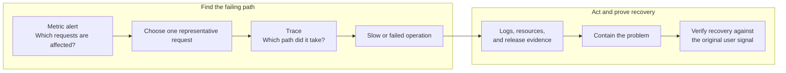
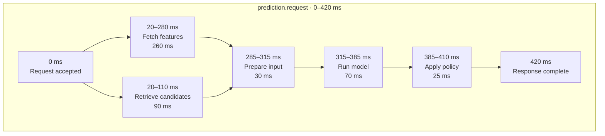
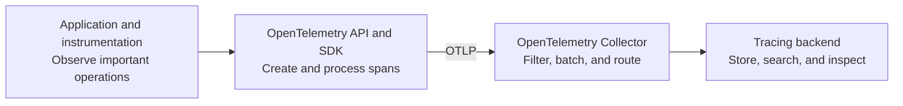
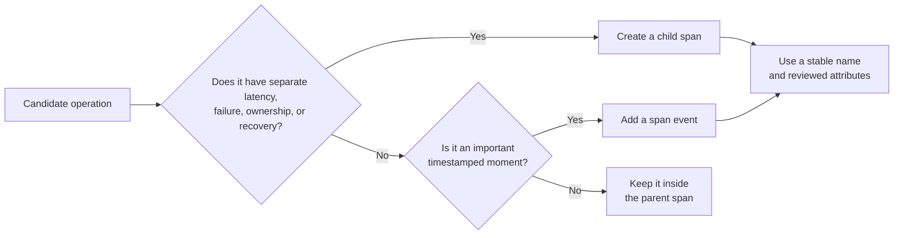
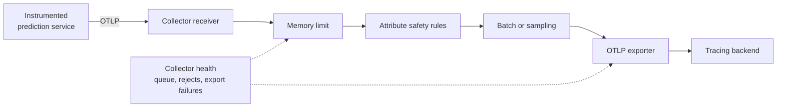
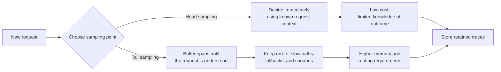
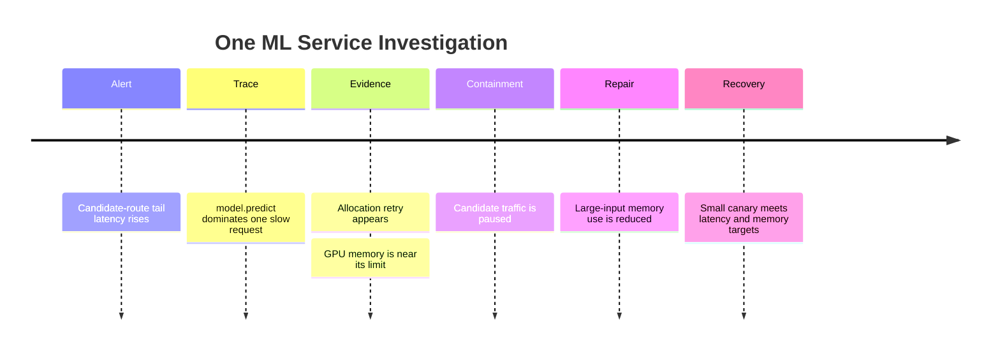
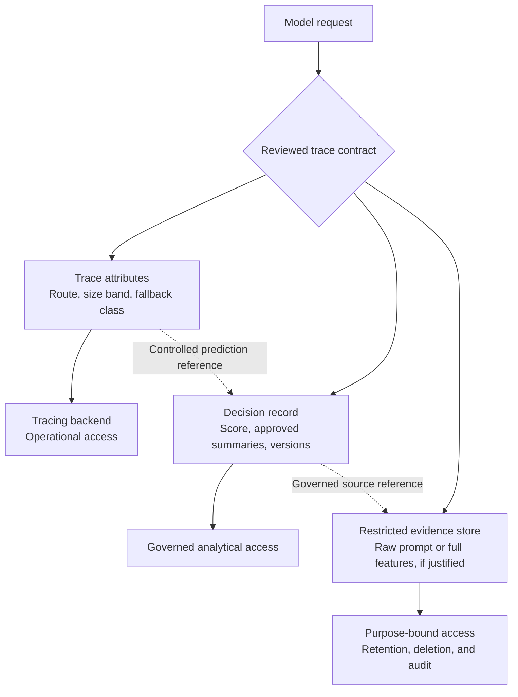
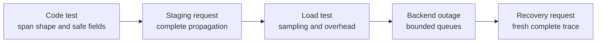

## Table of Contents

1. [What ML Service Tracing Means](#what-ml-service-tracing-means)
2. [How A Trace Shows One Request Over Time](#how-a-trace-shows-one-request-over-time)
3. [How OpenTelemetry Standardises Tracing](#how-opentelemetry-standardises-tracing)
4. [Choose Spans That Support A Real Investigation](#choose-spans-that-support-a-real-investigation)
5. [How Trace Context Crosses Service Boundaries](#how-trace-context-crosses-service-boundaries)
6. [Combine Automatic And Manual Instrumentation](#combine-automatic-and-manual-instrumentation)
7. [How The Collector Sends Traces To A Backend](#how-the-collector-sends-traces-to-a-backend)
8. [How To Reduce Trace Volume And Cost](#how-to-reduce-trace-volume-and-cost)
9. [Use A Trace To Investigate A Slow Prediction](#use-a-trace-to-investigate-a-slow-prediction)
10. [Keep Traces Safe And Searchable](#keep-traces-safe-and-searchable)
11. [Test Failure And Recovery Paths](#test-failure-and-recovery-paths)
12. [Choose A Tracing Stack For The Serving Platform](#choose-a-tracing-stack-for-the-serving-platform)
13. [The Main Idea](#the-main-idea)
14. [References](#references)

## What ML Service Tracing Means
<!-- section-summary: ML service tracing records the route and timing of one prediction as it moves through several components. -->

**ML service tracing follows one prediction from the start of a request to the final result.** It shows which components handled the request, the order in which they ran, and how long each part took.

Imagine a recommendation endpoint with a target of 250 milliseconds. One user waits 900 milliseconds. The service metric proves that the response was slow, but it cannot tell the team where the time went.

A trace can show a breakdown like this:

- 25 milliseconds inside the API;
- 610 milliseconds waiting for online features;
- 130 milliseconds running model inference;
- 20 milliseconds applying ranking policy;
- the remaining time crossing network and gateway boundaries.

Feature retrieval contributed 610 milliseconds and caused most of the delay. That single fact changes which team investigates and which system needs repair.

The same trace can expose a hidden fallback. A request may return `200 OK`, although a feature timeout caused the service to skip the primary model and use a simpler backup. The caller received a valid response. The path that produced it was degraded.

This is especially important in ML systems. A production prediction often depends on more than one model call:


*A recommendation request can run feature and candidate work in parallel before model inference and policy. The separate 900-millisecond example shows why the longest dependent chain, not the sum of overlapping spans, controls the caller’s wait.*

The user experiences this whole journey. The API, network, feature service, retrieval system, queue, model runtime, and policy can each add delay or change the result.

Tracing works with other production evidence:

- **Metrics** summarize many requests and show the size of a problem.
- **Logs** record events such as a timeout, retry, or rejected request.
- **Traces** connect the timed work belonging to one request.
- **Decision records** preserve the model, policy, result, and later outcome for longer-lived analysis.

You can think of metrics as the aerial view and a trace as one street-level journey. A metric may show that the 99th-percentile latency rose for candidate traffic. A trace reveals that one affected request waited in the GPU queue. Logs and resource metrics can then explain why that queue was slow.



The rest of the tracing system exists to make this journey complete, safe, affordable, and useful during a real incident.

## How A Trace Shows One Request Over Time
<!-- section-summary: A trace contains connected spans, and each span measures one meaningful operation inside the request. -->

A tracing screen usually looks like a waterfall. Time runs from left to right. Each row shows one piece of work, and the row's width shows how long that work took.

The full waterfall is the **trace**. Each individual row is a **span**.

Suppose a prediction request runs these operations:



The outer `prediction.request` span covers the caller's complete wait. The smaller spans explain the work inside it.

A span normally records:

- a stable operation name such as `features.fetch`;
- start and end times;
- a success or error status;
- the service that performed the work;
- a small set of reviewed attributes, such as model route, cache result, or worker pool;
- a relationship to the span that caused it.

The first span is the **root span**. Work created inside it uses **child spans**. The feature and candidate calls in the example are sibling spans because the API started them in parallel.

This parent-and-child structure explains cause. The incoming request caused the feature lookup. The feature result allowed model preparation to continue. The policy step used the model output to choose the final path.

A span also has a **kind**, which describes its role at a system boundary. A `SERVER` span receives a request, while a `CLIENT` span represents an outgoing call. A `PRODUCER` span sends work to a queue, and a `CONSUMER` span receives it. An `INTERNAL` span measures work inside one process, such as preprocessing or model inference. These roles help a tracing backend distinguish time spent serving, calling, publishing, consuming, and computing.

### Read Parallel Spans By Their Overlap

The feature and candidate calls overlap. Adding every row would report more than 420 milliseconds, even though the caller waited only 420 milliseconds.

The path of dependent work that controls the finish time is the **critical path**. In this request, feature retrieval finishes later than candidate retrieval, so it holds up model preparation. Improving the already-fast candidate call would not reduce total latency.

For a beginner, the practical rule is simple: follow the chain that reaches the end of the request last. That chain usually shows the first useful performance target.

### Use Span Events To Record Important Moments

Some things matter but have almost no duration. A retry begins. A circuit breaker opens. A fallback is selected.

A **span event** records that timestamped moment inside an operation. A remote database or feature call deserves a child span because its duration and owner matter independently. A retry attempt may fit as an event on the dependency span.

Tracing every function creates noise. A helper that converts a list into an array rarely needs its own span. The reader should see the system's important operations, rather than the source file's complete call tree.

## How OpenTelemetry Standardises Tracing
<!-- section-summary: OpenTelemetry defines how applications create, identify, transport, process, and export trace data while a separate backend stores and displays it. -->

**OpenTelemetry**, often shortened to **OTel**, is an open-source observability framework. It gives applications and platform tools a shared way to create and move traces, metrics, and logs. For tracing, it defines the concepts and interfaces behind spans, trace context, common attributes, export, and collection.

You can think of OpenTelemetry as the common language and delivery system for telemetry. A backend such as Grafana Tempo, Jaeger, Google Cloud Trace, AWS X-Ray, or Azure Monitor Application Insights handles long-term storage, search, and the investigation screen.

OpenTelemetry grew from the merger of OpenTracing and OpenCensus. The practical goal is portability: application teams can instrument important work through standard APIs and conventions, then send the resulting telemetry to a compatible backend without redesigning every span.

The complete path looks like this:



### Use Instrumentation To Create Telemetry

**Instrumentation** is the part that recognizes an operation and asks OpenTelemetry to represent it as a span. Automatic instrumentation already understands common framework boundaries such as an incoming FastAPI request, an HTTPX call, a database query, or a message sent through a supported client.

Manual instrumentation covers application-specific work. A generic Python library cannot know that one block performs feature preparation, another runs a model, and a third selects a fallback. The service owner adds spans around the few operations whose duration, result, or ownership would matter during an incident.

This gives teams a useful division of responsibility. Framework integrations cover standard network and library calls. Product code describes the ML operations that only the product team understands.

### What The OpenTelemetry API And SDK Do

The OpenTelemetry **API** is the interface used by application code and instrumentation libraries. It provides operations such as obtaining a tracer, starting a span, adding an attribute, and recording an event.

The **SDK** is the runtime implementation behind that interface. It creates span data, attaches information about the service, applies sampling and processing rules, and passes finished spans to an exporter. A library can depend on the API without forcing every application to use one specific SDK configuration.

Two kinds of information appear throughout this path:

- **Resource attributes** describe the entity producing telemetry, such as service name, service version, deployment environment, cloud region, or Kubernetes pod.
- **Span attributes** describe one operation, such as HTTP route, model route, cache result, input-size band, or fallback reason.

Suppose ten replicas run the prediction API. `service.name="prediction-api"` belongs to the resource because it describes every span from that service. `app.model.route="candidate"` belongs to the inference span because it describes one request path.

### Use Semantic Conventions For Consistent Fields

OpenTelemetry **semantic conventions** provide shared names and meanings for common operations and attributes. HTTP instrumentation can agree on how to represent request method, route, response status, client calls, and server calls. Messaging and database instrumentation have their own conventions.

This consistency matters in a mixed-language system. A Python API and a Java feature service can still produce recognizable spans that a backend groups correctly.

Product-specific ML fields usually need an application namespace because the standard does not define every concept in a serving system. A team might use reviewed attributes such as `app.model.route`, `app.fallback.reason`, and `app.input.size_band`. The names should stay stable and their values should come from bounded sets.

### Use OTLP To Export Completed Telemetry

The **OpenTelemetry Protocol**, or **OTLP**, is the standard protocol commonly used to export telemetry from an SDK or Collector. It supports transport over gRPC and HTTP.

OTLP carries completed span records toward a Collector or backend. Trace-context headers perform a different job during the live request: they carry the trace and parent identifiers from one service to the next so both services create spans in the same trace. Later sections explain that propagation path in detail.

For example, the API forwards W3C Trace Context to the feature service during the request. Each service finishes its own spans and exports them through OTLP. The backend receives those records and reconstructs the connected waterfall from their identifiers and relationships.

### Use The Collector To Process And Route Telemetry

The **OpenTelemetry Collector** is a separate service that receives telemetry, processes it, and exports it. It gives platform teams one place to apply shared rules such as batching, memory limits, redaction, sampling, routing, or delivery to several backends.

The Collector is optional for a small managed setup because an SDK may export directly to a supported backend. Across many services, a shared Collector removes repeated routing and safety rules from individual application processes.

The tracing backend still owns storage, indexes, query behavior, retention, access control, and the waterfall interface. The Collector owns movement and processing. The application owns meaningful spans and safe attributes.

Instrumentation observes the work, the API describes it, and the SDK turns it into telemetry. Trace context connects services, OTLP transports the finished records, the Collector applies shared policy, and the backend gives engineers an investigation view. The following sections connect each part to production design and failure investigation.

## Choose Spans That Support A Real Investigation
<!-- section-summary: Span boundaries separate work with its own latency, failure mode, owner, or recovery action. -->

Each span should represent one operation that an engineer may need to inspect separately. Too few spans hide the slow or failing component. Too many spans fill the trace with internal helper calls that lead to the same owner and response.

The design question is deciding which work deserves its own span.

A useful span separates an operation that could send the investigation in a different direction. Feature retrieval, model inference, policy evaluation, and result persistence often deserve separate spans because different systems and owners control them.

Suppose preprocessing contains tokenization, normalization, tensor conversion, and twelve helper functions. If all of that code runs inside one process and shares one owner, a single `input.prepare` span may be enough.

Now suppose tokenization calls a remote service. That call has a network boundary, its own latency, and a separate owner. A child span makes the boundary visible.

Four questions help:

1. Can this operation wait, fail, or retry independently?
2. Does another service or team own it?
3. Would a slow result lead to a different response?
4. Does it choose a model, policy, fallback, or route that changes the meaning of the prediction?

If one answer is yes, a span is often useful.



### Use Stable Span Names

The name `model.predict` creates one useful family of spans. A name such as `model.predict/customer-184729/request-9832` creates a different operation for every request. That naming pattern makes the backend expensive and difficult to query.

Put the category in the span name and the approved detail in attributes. For example, the span name can remain `model.predict`, while `app.model.route="candidate"`, `app.hardware.pool="gpu-a10"`, `app.input.size_band="large"`, and `app.fallback.reason="none"` describe the operational group.

The important distinction is one stable name plus a few bounded fields. Customer identity, raw input, and a full prediction ID do not need to be indexed as ordinary trace attributes.

OpenTelemetry publishes **semantic conventions**, which are shared names for common operations and attributes. HTTP clients, databases, and messaging systems can then use consistent fields across languages. Teams should use stable conventions where they apply and place reviewed ML-specific attributes under an application namespace.

Some semantic conventions remain experimental. A production trace contract should record which convention version it uses and avoid depending on unstable names without a migration plan.

### Use Attributes That Support Safe Grouping

An attribute earns its place if it helps an operator compare or route a problem.

`app.model.route="candidate"` lets the team isolate canary traffic. `app.cache.result="miss"` helps explain slow feature reads. `app.fallback.reason="feature_timeout"` identifies a degraded path.

A raw score of `0.728319483` creates many unique values and rarely helps trace search. A reviewed confidence band such as `medium` may be more useful. Exact scores belong in the governed decision record.

This is the boundary between tracing and prediction logging: the trace explains the execution path; the decision record preserves the detailed model decision.

## How Trace Context Crosses Service Boundaries
<!-- section-summary: Context propagation carries trace identity through HTTP calls, queues, and workers so the backend can rebuild one request journey. -->

Each service can record its own timing. Without shared identity, the tracing backend receives separate fragments and cannot tell that they belong to the same request.

**Context propagation** carries trace identity across a boundary.

You can think of the trace ID as a journey number. The prediction API, feature service, and model gateway perform different work and create their own span IDs. They all carry the same trace ID, so the backend can assemble one journey.

For HTTP, the common industry standard is the **World Wide Web Consortium (W3C) Trace Context** specification. The client sends a `traceparent` header. The receiving service extracts the context, creates its own child span, and passes updated context to the next service.

Application code usually should not parse the header. OpenTelemetry framework and client instrumentation handles the injection and extraction.

The example also includes **gRPC**, a high-performance protocol for calling a function on another service. OpenTelemetry propagates the same trace identity across supported HTTP and gRPC clients.


*Parent-child context preserves direct cause across HTTP and gRPC calls. A link set connects all contributing request contexts to shared asynchronous batch work without pretending that one request caused the others.*

The shared trace ID lets the backend group all three services into one journey. Each service creates a fresh span ID, and the parent value preserves the order of the calls.

### How Broken Context Propagation Appears

Suppose the API trace ends at an outgoing feature call. The feature service has a separate root trace at the same time.

The work happened, but the journey split. The team checks the boundary:

- Was the outgoing HTTP client instrumented?
- Did a proxy remove the header?
- Did the receiving framework extract context before creating the server span?
- Did an asynchronous task lose the active context?

The repair is tested with one known request. Success means one trace contains both the API and feature spans in the correct parent-child order.

### Carry Trace Context In Queue Metadata

Asynchronous systems need the same idea. A Kafka producer injects trace context into message headers. The consumer extracts it before processing the message.

A worker handling one message can continue the original trace. A worker building one GPU batch from many requests needs a different relationship.

Imagine ten requests entering a dynamic batch. One batch execution should not pretend that request 1 caused requests 2 through 10. OpenTelemetry **span links** connect the shared batch span to all contributing request contexts.

Each request keeps its own trace and prediction ID. The `batch.execute` span links to the ten request spans. If queue delay rises, an operator can inspect the batch and return to the affected requests.

### Limit What Baggage Can Carry

OpenTelemetry **baggage** carries arbitrary key-value data across service boundaries. This sounds convenient, but downstream libraries may forward it again.

Credentials, customer identity, prompts, feature values, and authorization decisions do not belong in baggage. Teams use a strict allowlist, remove internal baggage before untrusted calls, and never treat baggage as a trusted authorization source.

Trace context connects telemetry across services. Business authorization uses a separate authenticated identity mechanism.

## Combine Automatic And Manual Instrumentation
<!-- section-summary: Automatic instrumentation covers common frameworks and clients, while a small number of manual spans reveal ML-specific work. -->

**Instrumentation** is the code and library support that creates tracing data. Framework integrations can observe standard operations such as HTTP requests or database calls. Product code must describe ML-specific work such as model inference, policy evaluation, or fallback selection because a generic library cannot know that meaning.

Most teams get the first useful trace in two layers:

1. automatic instrumentation covers HTTP, gRPC, databases, and supported messaging clients;
2. manual instrumentation adds a few ML-specific operations such as model inference, policy evaluation, and fallback selection.

This order keeps the first change small. It also prevents teams from manually recreating spans that a well-tested library already provides.

### Use Automatic Instrumentation For The Request Journey

OpenTelemetry supports zero-code or library-based instrumentation for common languages and frameworks. Python traces are stable, and current OpenTelemetry Python supports actively maintained Python versions.

For a FastAPI service using HTTPX, a compact setup can install the distribution, OTLP exporter, and integrations:

```bash
uv add opentelemetry-distro opentelemetry-exporter-otlp \
  opentelemetry-instrumentation-fastapi opentelemetry-instrumentation-httpx

OTEL_SERVICE_NAME=prediction-api \
OTEL_EXPORTER_OTLP_ENDPOINT=http://otel-collector:4317 \
uv run opentelemetry-instrument uvicorn app:app
```

FastAPI instrumentation creates the incoming request span. HTTPX instrumentation creates outgoing HTTP spans. OTLP, the OpenTelemetry Protocol, sends the spans to a Collector or compatible backend.

Send one known staging request and inspect its trace in the backend. If the feature call appears but model inference is an unexplained gap, add one manual span around inference.

### Add Manual Spans Around Important ML Work

Automatic framework instrumentation exposes the HTTP request and supported library calls. A manual span exposes application-specific work such as model artifact selection and inference.

A focused manual span can expose that operation:

```python
from opentelemetry import trace
from opentelemetry.trace import Status, StatusCode

tracer = trace.get_tracer("prediction-api.serving")

with tracer.start_as_current_span(
    "model.predict",
    record_exception=False,
    set_status_on_exception=False,
) as span:
    span.set_attribute("app.model.route", model_route)
    span.set_attribute("app.hardware.pool", worker_pool)
    try:
        prediction = model.predict(features)
    except ModelRuntimeError:
        span.set_attribute("error.type", "model_runtime")
        span.set_status(Status(StatusCode.ERROR))
        raise
```

`start_as_current_span` creates a child of the active request span and closes it after the block finishes. The attributes use bounded operational categories.

The example disables automatic exception recording because raw exception text can contain model inputs, file paths, URLs, or secrets. A known failure receives a reviewed error class. Deeper diagnostic detail can go to a restricted log channel under a separate policy.

The feature vector and complete prediction stay outside the trace. The decision record is the correct home for governed model evidence.

### Release And Test Instrumentation Like Serving Code

Tracing adds CPU work, memory use, network traffic, and backend cost. Automatic instrumentation can also create duplicate spans if another agent already traces the same library.

A safe rollout uses:

1. local verification with a console or in-memory exporter;
2. staging through the real Collector;
3. a small production canary;
4. comparison of request latency, CPU, memory, trace volume, and exporter errors;
5. fast disablement if overhead or duplication exceeds the agreed limit.

The serving path should continue if tracing export fails. Bounded queues and timeouts protect inference from a slow observability backend.

## How The Collector Sends Traces To A Backend
<!-- section-summary: The OpenTelemetry Collector receives spans, applies shared policy, and exports retained traces to a managed or self-hosted backend. -->

The application creates spans. A tracing backend stores and displays them. The **OpenTelemetry Collector** is the common component between those two sides.

The Collector is a separate vendor-neutral service. It receives telemetry, processes it, and exports it.

Its configuration has three easy-to-understand parts. An **application performance monitoring (APM) backend** stores and explores service latency, errors, and traces.

- A **receiver** accepts data, commonly through OTLP.
- **Processors** batch, filter, enrich, limit memory, or sample the data.
- An **exporter** sends the result to an OTLP-compatible backend such as Tempo or to another supported destination.



A minimal pipeline looks like this:

```yaml
receivers:
  otlp:
    protocols:
      grpc:
        endpoint: ${env:MY_POD_IP}:4317

processors:
  memory_limiter:
    check_interval: 1s
    limit_percentage: 75
  batch: {}

exporters:
  otlp/traces:
    endpoint: ${env:TRACE_BACKEND_OTLP_ENDPOINT}

service:
  pipelines:
    traces:
      receivers: [otlp]
      processors: [memory_limiter, batch]
      exporters: [otlp/traces]
```

The receiver accepts OTLP over gRPC on the Collector pod's own address. In Kubernetes, the Downward API can place the pod IP in `MY_POD_IP`, while an internal Service gives applications the stable `otel-collector` name used in the earlier command. A NetworkPolicy should limit port 4317 to trusted workloads. A protected Docker network can use an explicitly exposed container address instead.

The memory limiter protects the Collector from uncontrolled pressure. The batch processor groups spans into efficient export requests. The exporter sends them to the configured backend.

Production deployment also needs authenticated transport, bounded sending queues, retries, secrets from the deployment platform, and explicit failure behavior.

### Choose Where The Collector Runs

A small service can export directly to a managed tracing backend. This gives the team value quickly and avoids operating a separate tier.

A Kubernetes platform with many services often runs a Collector near workloads and a gateway Collector for central policy. Local collectors receive spans close to applications. The gateway handles shared sampling, routing, and backend export.

The extra tier earns its place if central policy, volume, or multi-backend routing needs it. It also needs capacity planning and an owner.

For a self-managed open-source stack, OpenTelemetry SDKs and Collectors commonly send traces to Tempo. Grafana can connect Tempo traces with Prometheus metrics and Loki logs. Jaeger remains another tracing backend. Managed-cloud teams use each provider's supported integration. Google Cloud supports OpenTelemetry collection for Cloud Trace. Microsoft recommends the Azure Monitor OpenTelemetry Distro or its standalone exporter for Application Insights; Microsoft does not officially support the community Collector exporter for Azure Monitor. AWS documents its supported OpenTelemetry paths for services such as X-Ray.

OTLP keeps application instrumentation portable. It does not remove differences in backend queries, pricing, retention, access, or feature support.

### Monitor The Collector

If the trace backend slows down, the Collector's sending queue grows. Export failures rise. Eventually, new spans may be refused or dropped.

OpenTelemetry exposes internal metrics for queue capacity, queue size, enqueue failures, and failed exports. These metrics need dashboards and alerts because a healthy model service can keep running while its traces disappear.

Suppose queue use reaches 85 percent during a backend slowdown. The observability owner reduces routine trace retention or scales the gateway. The backend owner restores ingestion. Recovery appears as falling queue pressure, stopped export errors, and a complete known trace arriving end to end.

## How To Reduce Trace Volume And Cost
<!-- section-summary: Sampling keeps representative healthy traces and higher-value slow, failed, fallback, and release-transition traces. -->

A high-traffic endpoint can create thousands of complete traces every second. Retaining all of them increases application export work, Collector memory, network traffic, backend ingestion, storage, and query cost.

**Sampling** chooses which traces are stored.

The team usually needs two groups:

- a representative baseline of healthy requests;
- a much higher share of errors, slow requests, fallbacks, rare routes, and candidate releases.

The durable prediction record can still cover every decision. The trace provides detailed execution evidence for a selected subset.

### Head sampling decides early

**Head sampling** decides near the start of the request. A one-percent head sampler may keep one request out of every hundred.

It is simple and cheap. Dropped traces create little downstream work. The limitation is timing: at the start, the sampler does not yet know that a request will time out near the end.

If one percent of all traces are kept, about one percent of late failures may remain unless the request already carries a known priority signal.

### Tail sampling decides after seeing the journey

**Tail sampling** waits for most or all spans, then uses the completed trace. It can keep every trace with an error status, a latency above the service objective, a fallback attribute, or a candidate route.

This gives better incident evidence and adds operational cost. The Collector holds trace data during the decision window. Several gateway replicas need trace-aware routing so all spans from one trace reach the same sampling decision.

OpenTelemetry's Collector tail-sampling processor is currently beta. Teams should test its memory, routing, incomplete-trace, and upgrade behavior before relying on it at high scale.



A practical policy might retain:

- all error traces;
- all reviewed fallbacks;
- all requests slower than the latency objective;
- all candidate-route traces during a limited canary;
- one percent of routine primary-route successes.

“Keep every error” also needs a ceiling. During a widespread outage, error volume can exceed backend capacity. The emergency policy may cap detailed traces per service while complete error metrics and durable decision records preserve the size of the incident.

### Change Sampling Gradually And Monitor Its Cost

In staging, replay representative trace sizes and peak request rates. Measure Collector memory, decision latency, incomplete traces, and backend volume.

A production canary compares expected and observed retention by category. If the gateway approaches its limit, the fallback can use simpler head sampling or reduce healthy-trace retention. Metrics and decision records continue to protect detection and model monitoring.

Sampling is successful only if responders can still find the traces promised by the policy.

## Use A Trace To Investigate A Slow Prediction
<!-- section-summary: A trace narrows an aggregate service symptom to the specific operation, owner, and release that need action. -->

Consider a model release whose candidate route receives ten percent of traffic. Soon after the release, the 99th-percentile latency rises for candidate requests while the primary route remains healthy.

Prometheus and Grafana show the affected population. An **exemplar** is a sampled trace ID attached to a metric observation. Selecting that exemplar, or another trace link, opens one slow candidate request in Tempo.

The trace shows:

- feature retrieval completed in 40 milliseconds;
- preprocessing completed in 15 milliseconds;
- `model.predict` took 1.4 seconds;
- the span attribute identifies `app.hardware.pool="gpu-l4-b"`;
- a span event reports a memory-allocation retry.

The trace gives the investigation a specific boundary: candidate inference on one GPU pool.

Logs for the same trace show a bounded `allocation_retry` event. GPU memory metrics for pool B rise close to the configured limit. The release record shows that the candidate artifact uses a larger input tensor for one size band.

The team can now act:

1. The release owner pauses candidate traffic.
2. The serving owner drains pool B and preserves a few affected traces.
3. The model team reproduces the large-input band in staging.
4. The deployment returns through a smaller canary after memory use is reduced.
5. Recovery checks end-to-end latency, GPU memory, fallback ratio, and fresh candidate traces.



The response follows evidence from broad to specific. The trace identifies the slow operation first, so containment and repair stay focused on candidate inference and its GPU pool.

Tracing can also clarify a model-quality problem. Suppose labelled outcomes worsen for one policy version. Sampled traces show that affected requests often hit a feature timeout and select a fallback before the primary policy runs. The model artifact may still be accurate. The serving path changed the decision.

Trace absence needs an explanation too. A decision record may point to a trace removed by sampling or retention. That is expected if the sampling class and retention window are known. Missing recent error traces together with Collector export failures indicates a telemetry incident.

## Keep Traces Safe And Searchable
<!-- section-summary: A trace data contract keeps sensitive values and unbounded identifiers out of broadly accessible tracing systems. -->

Tracing data leaves the model process and travels through Collectors, networks, storage, dashboards, exports, and support workflows. A value placed on a span can reach many more people than the original request.

A **trace data contract** defines the allowed span names, attributes, events, error classes, owners, access rules, and retention period.

Two risks deserve special attention.

### Keep Sensitive Data Out Of Traces

Raw prompts, feature vectors, customer identity, documents, credentials, signed URLs, and unrestricted exception messages can reveal protected information.

The trace should use bounded operational summaries. Fields such as `app.model.route="candidate"`, `app.input.size_band="large"`, `app.fallback.reason="feature_timeout"`, and `app.result.class="degraded"` let responders group similar paths without exposing the original payload.

The governed decision store keeps prediction identity, exact scores, versions, and approved feature summaries. These fields support model monitoring and review without copying the original input.

Raw prompts and full feature payloads require a separate, purpose-built restricted evidence store, and only if the investigation or regulatory purpose justifies retaining them. Security owners classify the data and grant access to the small set of roles that need it. Platform owners apply the approved retention and deletion periods. Access audit logs show who opened or exported the evidence.

Suppose an authorized engineer needs a complete feature payload to reproduce a slow request. The restricted store holds one governed copy. The decision record carries a controlled source reference, while the trace carries the feature schema version, size band, and prediction reference.

### Control High-Cardinality Trace Attributes

**Cardinality** describes how many distinct values a field can have.

`model_route` may have three values: `primary`, `candidate`, and `fallback`. That is low cardinality and easy to group.

`customer_id` may have ten million values. `prediction_id` may have a different value for every request. Indexing these values broadly can increase cost and slow search.

Exact trace ID remains essential because it identifies the trace itself. Application attributes should favor small reviewed sets. A protected prediction reference can be searchable only in a restricted path if the investigation workflow needs it.

Exception handling follows the same rule. A known dependency failure can use `error.type="feature_timeout"`. Raw exception text belongs in a restricted diagnostic channel only if policy allows it.



Collector filters and redaction processors provide a secondary control. The application still needs the primary allowlist because it understands the data before export.

## Test Failure And Recovery Paths
<!-- section-summary: Trace tests verify topology, propagation, privacy, sampling, overhead, failure isolation, and recovery. -->

A tracing backend can display attractive waterfalls while telling an incomplete story. One client may lose context. A fallback span may never appear. A sampling rule may discard every canary trace. An exporter may consume enough memory to hurt inference.

Testing starts with one known request and expands outward.

### Test Span Relationships In Code

An in-memory exporter can assert that a request creates:

- one server span;
- the expected dependency spans;
- one `model.predict` span;
- a policy span or fallback event;
- approved attributes only.

A forced feature timeout should produce the expected error class and fallback evidence. Tests reject raw prompts, secrets, direct identifiers, and unsupported attribute names.

### Test Context Propagation In Staging

Send a known request through the real proxy, service, queue, Collector, and backend. Confirm that all expected services share one trace ID and appear in the correct order.

Also confirm that:

- the trace opens from the relevant metric or log link;
- the prediction ID reaches the governed decision store;
- the candidate and fallback paths appear as designed;
- the Collector reports no rejection or export error.

This test separates an application instrumentation defect from a Collector, backend, or dashboard-linking defect.

### Test Sampling And Overhead Under Load

Generate healthy, slow, failed, fallback, and candidate traces. Compare observed retention with policy. Add peak traffic and representative trace sizes.

Measure application CPU, memory, and latency. Measure Collector queue use, refused spans, export failures, and backend ingestion. A trace design that overwhelms the serving system has failed its purpose.

### Test A Tracing-Backend Outage

Make the backend reject exports in a safe environment. The service should keep serving predictions within its objective.

The exporter queue fills only to its configured bound. Retries use timeouts and backoff. Collector metrics report the problem. After the backend returns, fresh traces should arrive again.

Trying to preserve every old routine trace can recreate the overload. The recovery policy may discard old low-value traces and prioritize current health. Durable prediction records and metrics continue to preserve coverage during the trace outage.



Broken propagation has its own focused runbook. Find the last connected span, inspect the next transport boundary, repair client injection or server extraction, and repeat the known request. One complete trace proves the handoff is restored.

## Choose A Tracing Stack For The Serving Platform
<!-- section-summary: Managed tracing suits ordinary services, while Collector gateways and self-hosted backends fit platforms with clear scale or control needs. -->

Tracing provides the most value for prediction paths that cross several places where work can wait, fail, or change direction.

An endpoint calling an online feature service, vector store, model runtime, policy engine, and fallback has many useful boundaries. A single-process batch script may get enough evidence from job metrics, structured logs, and a durable run record.

The smallest practical stack is often the best starting point.

### Use Managed Application Monitoring

Use the provider's supported OpenTelemetry or application performance monitoring integration for a straightforward managed endpoint. Cloud Trace, Azure Monitor Application Insights, and AWS observability integrations can store and display distributed traces without a team operating the backend.

The provider reduces storage and backend work. The application team still owns useful span boundaries, safe attributes, propagation across custom boundaries, sampling requirements, and decision records.

### Use The Existing Kubernetes Observability Platform

OpenTelemetry SDKs create spans. Collectors receive and route them. Tempo or Jaeger stores traces. Prometheus handles metrics, and Loki or another logging backend stores recent events. Grafana links the signals.

This stack fits teams that already operate Kubernetes observability and need control over retention, routing, or backend choice. The platform team now owns more of the service.

Platform engineers upgrade the Collectors and backend. They plan enough ingestion and storage capacity for traffic peaks, and they protect write and query access. Their on-call response also covers a trace pipeline that falls behind.

### Use A Central Collector Gateway

A gateway fits a platform that needs one place for redaction, tail sampling, or routing to several destinations. Tail sampling requires all spans from the same trace to reach the same decision point, so the load-balancing design must understand trace identity.

The gateway also needs peak-volume tests and its own internal metrics. A tested degraded mode decides which low-value traces can be dropped if the gateway approaches its limit, while the prediction service continues serving requests.

OTLP and World Wide Web Consortium Trace Context provide portable boundaries across these choices. They reduce instrumentation changes during a backend migration. Query languages, pricing, retention, access, and operational behavior still vary by backend.

The ownership split should remain clear:

- product teams define meaningful ML spans and safe attributes;
- platform teams operate collection, routing, sampling, and storage;
- service owners use traces in alerts, investigations, and release checks;
- security and privacy owners approve sensitive-data boundaries and retention.

## The Main Idea
<!-- section-summary: ML service tracing explains how one prediction travelled through a distributed system and where its path slowed, failed, or changed. -->

ML service tracing turns one production prediction into a readable journey. A trace contains spans, and each span measures one important operation. Parent-child relationships explain direct cause. Span links describe shared asynchronous work. Context propagation keeps the journey connected across services and queues.

The most useful trace stays selective. Automatic instrumentation covers common request and dependency boundaries. A few manual spans reveal model inference, policy, batching, and fallbacks. Safe low-cardinality attributes help responders compare meaningful groups.

OpenTelemetry provides the common instrumentation, OTLP transport, and Collector pipeline. Managed tracing services reduce operational work for ordinary teams. Tempo or Jaeger fits platforms that already own the surrounding observability stack. Sampling controls cost, and the decision record preserves complete model evidence outside the trace store.

A trustworthy tracing system survives failure. Teams test span shape, propagation, privacy, sampling, overhead, backend outages, and recovery. During an incident, they use metrics to find the affected population, open one representative trace, follow its critical path, confirm the cause with logs and resource evidence, contain the problem, and verify the original user-facing signal.


*Metrics locate the affected population; one trace identifies candidate inference as the slow operation; logs, resources, and release evidence support repair. A small canary must pass the original latency, memory, fallback, and trace checks before staged rollout continues.*

## References

- [What is OpenTelemetry?](https://opentelemetry.io/docs/what-is-opentelemetry/)
- [OpenTelemetry components](https://opentelemetry.io/docs/concepts/components/)
- [OpenTelemetry traces](https://opentelemetry.io/docs/concepts/signals/traces/)
- [OpenTelemetry context propagation](https://opentelemetry.io/docs/concepts/context-propagation/)
- [OpenTelemetry sampling](https://opentelemetry.io/docs/concepts/sampling/)
- [OpenTelemetry semantic conventions](https://opentelemetry.io/docs/concepts/semantic-conventions/)
- [OpenTelemetry Python](https://opentelemetry.io/docs/languages/python/)
- [OpenTelemetry Python instrumentation](https://opentelemetry.io/docs/languages/python/instrumentation/)
- [OpenTelemetry Python instrumentation libraries](https://opentelemetry.io/docs/languages/python/libraries/)
- [OpenTelemetry Collector](https://opentelemetry.io/docs/collector/)
- [OpenTelemetry Collector configuration](https://opentelemetry.io/docs/collector/configuration/)
- [OpenTelemetry Collector deployment patterns](https://opentelemetry.io/docs/collector/deploy/)
- [OpenTelemetry Collector processors and stability](https://opentelemetry.io/docs/collector/components/processor/)
- [OpenTelemetry Collector internal telemetry](https://opentelemetry.io/docs/collector/internal-telemetry/)
- [OpenTelemetry Collector tail-sampling processor](https://github.com/open-telemetry/opentelemetry-collector-contrib/tree/main/processor/tailsamplingprocessor)
- [W3C Trace Context](https://www.w3.org/TR/trace-context/)
- [Grafana Tempo](https://grafana.com/docs/tempo/latest/)
- [Grafana Tempo with OpenTelemetry Collector](https://grafana.com/docs/tempo/latest/set-up-for-tracing/instrument-send/set-up-collector/otel-collector/)
- [Jaeger documentation](https://www.jaegertracing.io/docs/latest/)
- [Google Cloud Trace](https://cloud.google.com/trace/docs)
- [Azure Monitor OpenTelemetry](https://learn.microsoft.com/en-us/azure/azure-monitor/app/opentelemetry-enable)
- [Azure Monitor Application Insights FAQ](https://learn.microsoft.com/en-us/azure/azure-monitor/app/application-insights-faq)
