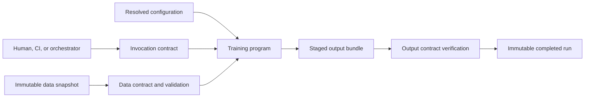

## A Training Script Is A Stable Program Boundary
<!-- section-summary: A training script gives notebooks, CI, containers, and schedulers one reviewed command with explicit inputs, outputs, and exit behaviour. -->

A **training script** is a versioned program that loads declared inputs, trains and evaluates a model, writes required outputs, and exits with a meaningful status. It gives people and automation one stable command instead of requiring a notebook kernel with hidden state.

This article owns that program boundary. The script should have clear functions, one entrypoint, a command-line interface, injectable dependencies, an output contract, and tests. The next article owns the detailed training configuration. The artifact article owns publication and review bundles. Later pipeline and infrastructure articles own containers, Kubernetes Jobs, and orchestrators.

The distinction keeps the design portable. A good script can run from a laptop, CI fixture, container, managed training job, or scheduler because those systems call the same entrypoint.

## Separate The Four Contracts Hidden Inside A Notebook
<!-- section-summary: A production training program separates invocation, data, computation, and output contracts so each boundary can be reviewed and tested. -->

A notebook often blends four contracts because one person controls the whole session:

1. The **invocation contract** says which command starts the run, which arguments are required, what exit codes mean, and how cancellation behaves.
2. The **data contract** says which immutable snapshot is read, which schema and point-in-time rules apply, and what validation stops the run.
3. The **computation contract** says how features, splits, seeds, training, and evaluation turn inputs into a candidate.
4. The **output contract** says which files and metadata prove completion and where they are published.

The script is the boundary that joins these contracts without hiding them. The scheduler owns *when* and *where* the command runs. Configuration owns declared run choices. Functions own transformations and training logic. The artifact bundle owns evidence. If the script also queries “latest data,” invents its run ID, chooses production credentials, and promotes the model, then a retry can perform different work or cross a release boundary without review.



This layout also makes failure legible. Argument or configuration failure happens before expensive work. Data validation failure produces evidence but no model candidate. Training failure leaves an incomplete attempt, not a success marker. Output verification failure prevents publication. The caller can retry only when the failure class and idempotency policy allow it.

Reproducibility allows for legitimate hardware-level variation. The command must record enough identity and state for another engineer to reconstruct the intended computation and compare results within declared tolerances. The script should therefore print and persist the resolved configuration, input snapshot, code and image identity, library environment, seed policy, output location, and final status. This turns hidden notebook state into explicit evidence.

## Apply The Program Boundary To A Clinic Model
<!-- section-summary: The clinic scenario turns a useful notebook into a command another engineer can run from a clean checkout. -->

Imagine **CareBridge Clinics**, which predicts whether a patient may miss an appointment so staff can offer reminders or rescheduling help. A data scientist has a notebook that reads an extract, fills missing values, trains a scikit-learn model, calculates validation metrics, and saves `model.joblib`.

The notebook proves the idea, but its execution depends on cell order, local paths, variables left in memory, and manual choices. The production question is narrower than deployment: can another engineer clone the repository and run one reviewed command that produces the same kinds of outputs from declared inputs?

CareBridge chooses this package shape:

The package keeps `data.py`, `features.py`, `model.py`, and `evaluate.py` beside the coordinating `train.py` entrypoint. The `tests` directory holds readable fixtures, focused feature tests, and one training smoke test. This layout makes ownership visible without giving the command-line module every responsibility.

Each module has one responsibility. `train.py` coordinates the workflow and avoids owning feature logic, metric formulas, or storage clients.

## Move Notebook Cells Into Named Functions
<!-- section-summary: Named functions expose inputs and outputs, remove hidden state, and let tests isolate data, feature, training, and evaluation behaviour. -->

The first rewrite extracts notebook cells into functions whose arguments show what they need.

```python
from dataclasses import dataclass
from pathlib import Path

import pandas as pd
from sklearn.base import ClassifierMixin


@dataclass(frozen=True)
class TrainingResult:
    model: ClassifierMixin
    metrics: dict[str, float]
    feature_names: list[str]


def load_examples(path: Path) -> pd.DataFrame:
    return pd.read_parquet(path)


def build_features(examples: pd.DataFrame) -> tuple[pd.DataFrame, pd.Series]:
    feature_names = [
        "appointment_hour",
        "days_since_booking",
        "previous_no_show_count_180d",
        "reminder_confirmed",
    ]
    return examples[feature_names], examples["missed_appointment"]


def train_and_evaluate(
    train_examples: pd.DataFrame,
    valid_examples: pd.DataFrame,
    seed: int,
) -> TrainingResult:
    X_train, y_train = build_features(train_examples)
    X_valid, y_valid = build_features(valid_examples)
    model = fit_classifier(X_train, y_train, seed=seed)
    metrics = evaluate_classifier(model, X_valid, y_valid)
    return TrainingResult(model, metrics, list(X_train.columns))
```

The functions receive paths, dataframes, and a seed instead of reading globals. `TrainingResult` makes the output shape explicit. Feature construction and evaluation remain independently testable. A storage implementation can change without changing the training calculation.

The script should also avoid import-time work. Importing `carebridge_no_show.train` should not connect to a warehouse, parse production credentials, create directories, or start training. Side effects belong inside called functions after argument validation.

## Create One Training Entrypoint
<!-- section-summary: The entrypoint coordinates validation, loading, training, output writing, and failure reporting without hiding business logic. -->

The entrypoint assembles the functions and returns a small result that tests and callers can inspect.

```python
import json
import uuid
from collections.abc import Callable
from pathlib import Path

import joblib


def run_training(
    train_path: Path,
    valid_path: Path,
    output_dir: Path,
    seed: int,
    model_writer: Callable[[object, Path], object] = joblib.dump,
) -> dict[str, object]:
    if output_dir.exists():
        raise FileExistsError(f"refusing to overwrite committed run: {output_dir}")

    output_dir.parent.mkdir(parents=True, exist_ok=True)
    attempt_id = uuid.uuid4().hex
    staging_dir = output_dir.parent / f".{output_dir.name}.attempt-{attempt_id}"
    staging_dir.mkdir()

    train_examples = load_examples(train_path)
    valid_examples = load_examples(valid_path)
    result = train_and_evaluate(train_examples, valid_examples, seed)

    model_path = staging_dir / "model.joblib"
    metrics_path = staging_dir / "metrics.json"
    schema_path = staging_dir / "feature-schema.json"

    model_writer(result.model, model_path)
    metrics_path.write_text(json.dumps(result.metrics, indent=2))
    schema_path.write_text(json.dumps({"features": result.feature_names}, indent=2))
    commit_output(staging_dir=staging_dir, output_dir=output_dir)
    verify_output_bundle(output_dir)

    return {
        "model_path": str(output_dir / model_path.name),
        "metrics_path": str(output_dir / metrics_path.name),
        "schema_path": str(output_dir / schema_path.name),
        "metrics": result.metrics,
    }
```

`output_dir` now names a committed bundle rather than a work directory. The attempt writes under a hidden, run-scoped staging path. Only `commit_output` can expose it at the final path. Writing to this directory boundary keeps the program independent from a particular tracker or object store. The training-artifacts article will expand this small bundle into resolved config, data manifest, environment record, segment report, and review packet.

Exceptions should carry the failed layer and input identity. A missing required feature should name the column and dataset path. The command should exit nonzero after an unrecoverable failure. A successful exit means the required output contract exists, rather than only meaning the Python process reached its final line.

The output write needs a commit boundary. If `joblib.dump` succeeds and metric serialization fails, the directory contains a model that looks complete to a downstream process. A safer implementation writes into a run-scoped staging directory, verifies every required file, writes a manifest last, and then publishes the directory or a `_SUCCESS` marker atomically within the storage system.

:::expand[Implement a verified local bundle commit]{kind="pattern"}
The fuller helper below shows the pattern experienced teams use for a local filesystem. It computes digests, requires a success marker, rejects changed files, and publishes with a same-filesystem rename. The visible article only requires the lifecycle: stage, verify, mark complete, publish, and verify again before loading.

```python
import hashlib
import json
import os
from pathlib import Path


def sha256(path: Path) -> str:
    digest = hashlib.sha256()
    with path.open("rb") as handle:
        for chunk in iter(lambda: handle.read(1024 * 1024), b""):
            digest.update(chunk)
    return digest.hexdigest()


class BundleVerificationError(RuntimeError):
    pass


def read_manifest(bundle_dir: Path) -> dict[str, object]:
    if not (bundle_dir / "_SUCCESS").is_file():
        raise BundleVerificationError("bundle has no _SUCCESS marker")
    try:
        return json.loads((bundle_dir / "manifest.json").read_text())
    except (FileNotFoundError, json.JSONDecodeError) as error:
        raise BundleVerificationError("bundle manifest is missing or invalid") from error


def verify_manifest_files(bundle_dir: Path, manifest: dict[str, object]) -> None:
    for name, expected in manifest["files"].items():
        path = bundle_dir / name
        if not path.is_file():
            raise BundleVerificationError(f"manifest file is missing: {name}")
        actual_digest = sha256(path)
        if actual_digest != expected["sha256"]:
            raise BundleVerificationError(
                f"digest mismatch for {name}: {actual_digest}"
            )


def verify_output_bundle(bundle_dir: Path) -> None:
    verify_manifest_files(bundle_dir, read_manifest(bundle_dir))


def commit_output(staging_dir: Path, output_dir: Path) -> None:
    required = ["model.joblib", "metrics.json", "feature-schema.json"]
    missing = [name for name in required if not (staging_dir / name).is_file()]
    if missing:
        raise RuntimeError(f"incomplete training output: {missing}")
    if output_dir.exists():
        raise FileExistsError(f"run is already committed: {output_dir}")

    manifest = {
        "files": {
            name: {"sha256": sha256(staging_dir / name)} for name in required
        }
    }
    (staging_dir / "manifest.json").write_text(json.dumps(manifest, indent=2))
    verify_manifest = json.loads((staging_dir / "manifest.json").read_text())
    if verify_manifest != manifest:
        raise BundleVerificationError("manifest changed while it was written")
    verify_manifest_files(staging_dir, verify_manifest)
    (staging_dir / "_SUCCESS").write_text("")
    os.rename(staging_dir, output_dir)
```

The local-filesystem implementation uses a rename on the same filesystem as its commit operation. Downstream code calls `verify_output_bundle` before loading the model: it requires both `manifest.json` and `_SUCCESS`, then recomputes every digest. The marker gives the scheduler a clear distinction between a completed bundle and files left by a killed worker. Object stores have different rename and consistency behaviour, so production code should use the store's conditional create or commit-table primitive, or write to an immutable final prefix only after validation.
:::

## Define The Command-Line Contract
<!-- section-summary: A command-line interface gives humans and automation the same typed input surface and predictable exit behaviour. -->

Python's `argparse` module can provide the first command contract:

```python
import argparse
from pathlib import Path


def parse_args() -> argparse.Namespace:
    parser = argparse.ArgumentParser(prog="carebridge-train")
    parser.add_argument("--train-path", type=Path, required=True)
    parser.add_argument("--valid-path", type=Path, required=True)
    parser.add_argument("--output-dir", type=Path, required=True)
    parser.add_argument("--seed", type=int, default=20260712)
    return parser.parse_args()


def main() -> int:
    args = parse_args()
    run_training(
        train_path=args.train_path,
        valid_path=args.valid_path,
        output_dir=args.output_dir,
        seed=args.seed,
    )
    return 0


if __name__ == "__main__":
    raise SystemExit(main())
```

A local run and a scheduled job can now call the same interface:

```bash
python -m carebridge_no_show.train \
  --train-path data/no_show_train.parquet \
  --valid-path data/no_show_valid.parquet \
  --output-dir runs/no-show-2026-07-12 \
  --seed 20260712
```

Paths and seeds are appropriate for this first article. The next article replaces a growing list of flags with a validated config file and controlled overrides.

The command contract should define expected exit states. Argument parsing returns a usage error before data access. Contract validation errors identify the dataset and missing field. Training failures preserve logs and the staging directory for diagnosis. Publication failures leave the output uncommitted and safe to retry. Infrastructure termination, such as an evicted worker, produces no success marker, so an orchestrator can retry the same immutable inputs under a new attempt ID.

A useful command output is short and machine-readable. It should print the run ID, train and validation snapshot IDs, output URI, and terminal status. Large logs belong in structured log storage, while this short summary helps a human and scheduler locate the run evidence. The command should avoid printing patient records or credentials during validation failures.

## Make The Script Testable
<!-- section-summary: Focused unit tests protect feature logic, while a tiny smoke test proves the real entrypoint writes a loadable output bundle. -->

Unit tests should cover deterministic feature and evaluation rules. A smoke test runs the real entrypoint on a tiny, readable fixture:

```python
import joblib

from carebridge_no_show.train import run_training


def test_training_entrypoint_writes_required_outputs(tmp_path):
    output_dir = tmp_path / "run-42"
    result = run_training(
        train_path="tests/fixtures/no_show_train.parquet",
        valid_path="tests/fixtures/no_show_valid.parquet",
        output_dir=output_dir,
        seed=17,
    )

    assert (output_dir / "_SUCCESS").exists()
    assert (output_dir / "manifest.json").exists()
    verify_output_bundle(output_dir)
    assert "roc_auc" in result["metrics"]
    joblib.load(output_dir / "model.joblib")
```

The fixture should include a missing optional value, a rare category, both target classes, and a row that protects a known feature bug. The metric assertion stays loose because the smoke test checks mechanics. Production model-quality gates belong in the evaluation and delivery modules.

Tests can pass fake readers or temporary directories when external systems sit behind small adapters. Pull-request tests should avoid production warehouses, registries, and buckets.

The smoke test should also cover the failure boundary. The required cases are an interrupted model write, a corrupted committed model, and a retry after an incomplete attempt. Each case exercises the real entrypoint rather than only testing a helper.

:::expand[Test interruption, corruption, and retry through the entrypoint]{kind="example"}
This complete test group is useful when implementing the pattern. The first test proves partial output never gains a success marker. The second proves a digest mismatch blocks loading. The third proves a later attempt can publish one verified bundle without deleting evidence from the interrupted attempt.

```python
import pytest


TRAIN = "tests/fixtures/no_show_train.parquet"
VALID = "tests/fixtures/no_show_valid.parquet"


def interrupted_writer(_model, path):
    path.write_bytes(b"partial-model")
    raise OSError("worker terminated during model write")


def test_partial_attempt_never_appears_committed(tmp_path):
    output_dir = tmp_path / "run-42"
    with pytest.raises(OSError, match="terminated"):
        run_training(
            Path(TRAIN), Path(VALID), output_dir, seed=17,
            model_writer=interrupted_writer,
        )

    assert not output_dir.exists()
    attempts = list(tmp_path.glob(".run-42.attempt-*"))
    assert len(attempts) == 1
    assert not (attempts[0] / "_SUCCESS").exists()


def test_corrupt_committed_model_is_rejected(tmp_path):
    output_dir = tmp_path / "run-42"
    run_training(Path(TRAIN), Path(VALID), output_dir, seed=17)
    (output_dir / "model.joblib").write_bytes(b"corrupt")

    with pytest.raises(BundleVerificationError, match="digest mismatch"):
        verify_output_bundle(output_dir)


def test_retry_can_publish_after_an_interrupted_attempt(tmp_path):
    output_dir = tmp_path / "run-42"
    with pytest.raises(OSError):
        run_training(
            Path(TRAIN), Path(VALID), output_dir, seed=17,
            model_writer=interrupted_writer,
        )

    result = run_training(Path(TRAIN), Path(VALID), output_dir, seed=17)

    verify_output_bundle(output_dir)
    assert Path(result["model_path"]) == output_dir / "model.joblib"
    assert len(list(tmp_path.glob(".run-42.attempt-*"))) == 1
```
:::

Remove `previous_no_show_count_180d` from a separate fixture, run the command, and assert a nonzero exit, no `_SUCCESS` marker, and an error that names the missing column. These tests guard the two states that commonly confuse orchestration: training code failed, or training finished while publication remained incomplete.

Idempotency matters during retries. The script should never overwrite an already committed run directory. The orchestrator can reuse the same logical run ID with a new attempt-specific staging prefix, then let exactly one verified attempt publish the immutable result. This prevents two retried workers from interleaving model and metric files.

## Hand Off To Later Pipeline Layers
<!-- section-summary: The stable script hands a command, inputs, outputs, exit status, and resource expectations to configuration, packaging, and orchestration layers. -->

Later layers need a small handoff contract:

| Layer | What it receives from this article |
|---|---|
| Training configuration | Supported inputs, defaults, and validation surface |
| Artifact publication | Output directory and required files |
| Container packaging | Module command, dependency lock, and filesystem expectations |
| Kubernetes or managed training | Command, resource needs, exit code, and durable output location |
| Orchestration | Step inputs, outputs, timeout, retry safety, and failure state |

Those articles can change the runtime without rewriting training logic. A container runs `python -m carebridge_no_show.train`. A Kubernetes Job or managed service invokes that same command. An orchestrator passes versioned paths and checks the output contract.

## Putting It Together
<!-- section-summary: A training script converts notebook exploration into one reviewed, callable, testable program boundary. -->

CareBridge moved hidden notebook state into named functions. One entrypoint loads declared data, trains and evaluates the model, writes a required bundle, and reports failure through exceptions and exit status. The CLI gives people and automation the same surface. Unit and smoke tests protect the important mechanics.

This narrow boundary prepares the next steps without teaching them early. Training config will control run choices. Artifact publication will preserve evidence. Containers and schedulers will provide runtime isolation and compute. Orchestration will coordinate the script with data validation, evaluation, and registry handoff.

## References

- [Python documentation: `argparse`](https://docs.python.org/3/library/argparse.html)
- [Python documentation: `dataclasses`](https://docs.python.org/3/library/dataclasses.html)
- [pytest documentation](https://docs.pytest.org/en/stable/getting-started.html)
- [scikit-learn: Developing scikit-learn estimators](https://scikit-learn.org/stable/developers/develop.html)
