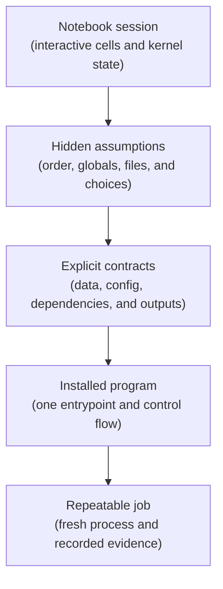
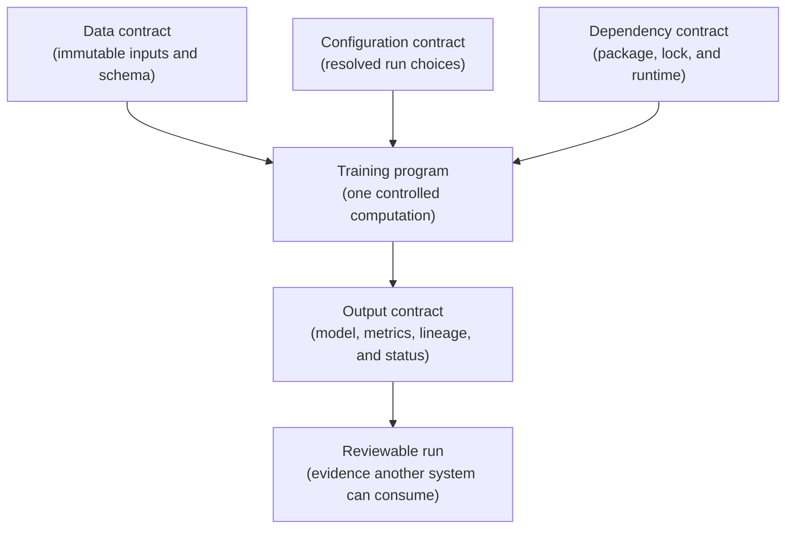
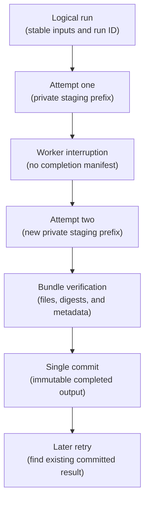
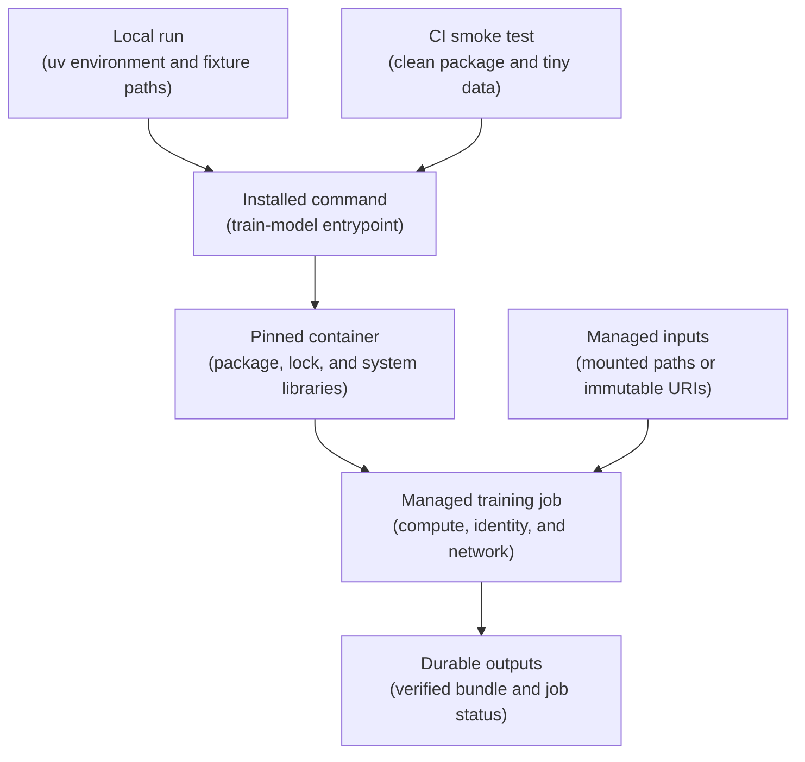

## Table of Contents

1. [A Notebook Can Succeed While Its Job Fails](#a-notebook-can-succeed-while-its-job-fails)
2. [Why Notebooks Work Well For Exploration](#why-notebooks-work-well-for-exploration)
3. [Make Every Training Input And Output Explicit](#make-every-training-input-and-output-explicit)
4. [Move Stable Notebook Logic Into Functions](#move-stable-notebook-logic-into-functions)
5. [Create One Command For The Full Training Run](#create-one-command-for-the-full-training-run)
6. [Keep Command-Line Arguments And Training Settings Separate](#keep-command-line-arguments-and-training-settings-separate)
7. [Package the Code as a Python Project](#package-the-code-as-a-python-project)
8. [Make Retries Safe](#make-retries-safe)
9. [Report Progress And Return A Clear Result](#report-progress-and-return-a-clear-result)
10. [Test the Program at Three Levels](#test-the-program-at-three-levels)
11. [Run The Same Training Program As A Managed Job](#run-the-same-training-program-as-a-managed-job)
12. [The Main Idea](#the-main-idea)
13. [References](#references)

## A Notebook Can Succeed While Its Job Fails
<!-- section-summary: A notebook result is ready for automation after explicit inputs, dependencies, outputs, and one repeatable command replace hidden state. -->

A data scientist finishes a churn-model experiment before the scheduled retraining window. The final notebook cell reports a useful improvement, and the release owner must decide whether the candidate is ready for an automated training job.

A platform engineer restarts the notebook kernel and runs all cells from the top. Training now fails because one feature table was loaded manually in an earlier session. After that is fixed, the score changes because a cell that sets the random seed runs after model construction. The saved artifact lands in a personal directory that the job runner cannot access.

If the team sends this notebook directly to scheduled compute, the job may fail after consuming expensive resources or publish an artifact with unclear inputs. The visible consequences are a missed retraining window, an absent candidate, and no reliable evidence for the release decision.

Success has a concrete shape. From a clean checkout, another engineer can install the declared environment and run one command against a named data snapshot. The process produces a verified model bundle, structured metrics, and exit status `0`. A second run with the same declared inputs follows the same computation and never overwrites the first completed result.

This transition is about creating a **program boundary**. At a high level, the boundary states everything the training program receives, everything it controls, every external service it may call, and every result it promises to produce.

## Why Notebooks Work Well For Exploration
<!-- section-summary: Notebooks support exploration through interactive state, while automated jobs need a clean process that reconstructs all required state from declared inputs. -->

Notebooks are designed for exploration. A data scientist can inspect a dataframe, change one transformation, rerun two cells, draw a chart, and keep useful objects in memory. That feedback loop is valuable because model development involves questions whose answers shape the next step.

The same flexibility creates risks for automation. The kernel remembers variables from earlier executions. Cells can run in a different order from the document. A local file or credential may exist on one laptop. A chart can look correct even though the saved model came from an older object still held in memory.

An automated job starts in a fresh process. It has no helpful memory from yesterday's session. It follows one control flow, receives a fixed environment, writes to declared locations, and communicates success through process state. You can think of the rewrite as turning the notebook's working memory into a program that can explain itself.


```mermaid
flowchart TD
    N["Notebook session<br/>(interactive cells and kernel state)"] --> H["Hidden assumptions<br/>(order, globals, files, and choices)"]
    H --> C["Explicit contracts<br/>(data, config, dependencies, and outputs)"]
    C --> P["Installed program<br/>(one entrypoint and control flow)"]
    P --> J["Repeatable job<br/>(fresh process and recorded evidence)"]
```

The notebook can remain as an exploration surface. Its durable contribution is the understood algorithm, feature logic, metric choice, and plots that informed the decision. Reusable computation moves into importable modules, and the notebook calls those modules if interactive analysis continues.

## Make Every Training Input And Output Explicit
<!-- section-summary: Data, configuration, dependency, and output contracts make every important training assumption visible to callers and tests. -->

A **contract** is an agreement at a program boundary. It describes valid inputs, expected behavior, and the evidence produced after success or failure. Four contracts capture most of the state that notebooks hide.

### Define The Training Data

The data contract identifies the exact training and validation inputs. It includes snapshot or manifest identity, schema, required columns, types, label definition, and time boundaries. The program validates these properties before expensive training starts.

For a weekly fraud retrain, `transactions_features@1842` is a useful input identity. `warehouse.latest_features` is fragile because a retry may read different rows. If the label column is missing, the process should fail before allocating a GPU and report the snapshot plus missing field.

### Define The Training Settings

The configuration contract records choices for this run: model family, feature set, split policy, seed, hyperparameters, and evaluation thresholds. The program writes the resolved configuration as an output artifact so a reviewer can see the values after defaults and approved overrides were applied.

### Define The Software Environment

The dependency contract defines the Python version, project package, libraries, system dependencies, and external service interfaces required by the program. A lockfile and container image digest make the software environment inspectable. Credentials remain runtime secrets; the program receives clients or secret-backed configuration instead of reading a developer's home directory.

### Define The Training Outputs

The output contract defines which evidence marks a successful run. A minimal bundle might contain the serialized model, `metrics.json`, `run.json`, an input-output signature, and a completion manifest. The caller supplies the output destination. The program writes an attempt in a staging location and exposes the completed bundle after verification.


```mermaid
flowchart TD
    D["Data contract<br/>(immutable inputs and schema)"] --> T["Training program<br/>(one controlled computation)"]
    C["Configuration contract<br/>(resolved run choices)"] --> T
    E["Dependency contract<br/>(package, lock, and runtime)"] --> T
    T --> O["Output contract<br/>(model, metrics, lineage, and status)"]
    O --> R["Reviewable run<br/>(evidence another system can consume)"]
```

These contracts also classify failure. Invalid arguments fail at invocation. A schema mismatch fails data validation. A library import failure identifies the runtime environment. A missing completion manifest means publication never completed. The caller can decide whether a retry is safe from the failure class and committed output state.

## Move Stable Notebook Logic Into Functions
<!-- section-summary: Small functions expose data flow and isolate deterministic model logic from storage, tracking, and other side effects. -->

Notebook cells often mix dataframe mutation, model fitting, metric calculation, plotting, and file writes. The first engineering step gives each responsibility a named function with explicit arguments and returns.

**Preparation** converts validated examples into model inputs. **Training** receives prepared data and a resolved configuration. **Evaluation** compares the fitted model with declared validation data. A **pure function** determines its result from explicit arguments and avoids changing external state. Preparation and evaluation can usually follow that pattern. Training also receives its seed because randomized fitting depends on it.

Saving is a side-effect boundary. It receives a completed result and an output adapter, then writes the declared bundle. Keeping this effect visible allows a unit test to exercise model logic in memory and an integration test to use temporary storage.

```python
from dataclasses import dataclass

@dataclass(frozen=True)
class TrainConfig:
    seed: int
    regularization: float


def prepare(examples):
    features = ("account_age_days", "sessions_30d", "support_tickets_30d")
    return examples.loc[:, features], examples["churned"]


def train(train_examples, config: TrainConfig):
    X_train, y_train = prepare(train_examples)
    return fit_classifier(X_train, y_train, config)


def evaluate(model, valid_examples) -> dict[str, float]:
    X_valid, y_valid = prepare(valid_examples)
    return calculate_metrics(model, X_valid, y_valid)


def save(model, metrics, output, run_record, writer) -> None:
    writer.commit(model=model, metrics=metrics, output=output, run_record=run_record)
```

This structure makes data flow readable. `prepare` receives a dataframe and returns features plus labels. `train` has no reason to find a dataset or invent hyperparameters. `evaluate` calculates the declared metrics. The storage adapter handles persistence after those calculations finish.

Importing the package should never start training, connect to a warehouse, create directories, or initialize a cloud client. Imports define functions and types. The entrypoint performs side effects after it has validated invocation and configuration.

## Create One Command For The Full Training Run
<!-- section-summary: One entrypoint coordinates adapters and pure functions while returning a structured result that tests and callers can inspect. -->

The **entrypoint** is the function that coordinates one complete training attempt. It loads declared data, validates contracts, calls the model functions, saves the bundle, and returns a structured summary.

The entrypoint receives external capabilities through **dependency injection**. In another term, it accepts the data reader, bundle writer, and tracker that it needs instead of constructing fixed production clients inside the function. A local run can use filesystem adapters. A managed job can use mounted object-storage paths and MLflow tracking. Tests can use in-memory readers and temporary directories.

```python
from pathlib import Path

def run_training(
    *,
    run_id: str,
    train_uri: str,
    valid_uri: str,
    output: Path,
    config: TrainConfig,
    reader,
    writer,
):
    train_examples = reader.read(train_uri)
    valid_examples = reader.read(valid_uri)
    validate_examples(train_examples, valid_examples)
    model = train(train_examples, config)
    metrics = evaluate(model, valid_examples)
    save(
        model,
        metrics,
        output,
        build_run_record(run_id, config, train_uri, valid_uri),
        writer,
    )
    return {"run_id": run_id, "output": output, "metrics": metrics}
```

`run_training` contains workflow order while domain logic remains in focused functions. The logical `run_id` arrives from the caller, which lets an orchestrator correlate retries. The writer owns the output commit protocol. A tracking adapter can log the same metrics and artifacts to MLflow after the bundle is verified, while the training calculation stays independent from the tracking vendor.

## Keep Command-Line Arguments And Training Settings Separate
<!-- section-summary: The CLI tells a process how to invoke one run, while the configuration file carries the model and evaluation choices for that run. -->

The **command-line interface**, or **CLI**, is the process invocation contract. It should stay small and stable. The configuration file selects the approved training behavior. Immutable input references identify the data, while the output destination and run ID tie the process to its evidence.

The training configuration holds the larger set of modeling choices. Putting every tree depth, feature switch, threshold, and optimizer setting into CLI flags creates a long command that is hard to review. A versioned config file gives those related values one validated document. A few controlled overrides can remain available for approved operational needs.

Python's standard-library `argparse` is a strong default for one training command because it adds help, type conversion, required arguments, and standard usage errors without another runtime dependency. Typer can improve a larger human-facing CLI with subcommands and rich typing, though a single job entrypoint rarely needs that extra layer.

```python
import argparse
from pathlib import Path


def build_parser() -> argparse.ArgumentParser:
    parser = argparse.ArgumentParser(prog="train-model", allow_abbrev=False)
    parser.add_argument("--config", type=Path, required=True)
    parser.add_argument("--train-uri", required=True)
    parser.add_argument("--valid-uri", required=True)
    parser.add_argument("--output", type=Path, required=True)
    parser.add_argument("--run-id", required=True)
    return parser


def main() -> int:
    args = build_parser().parse_args()
    config = load_and_validate_config(args.config)
    summary = run_training(
        run_id=args.run_id,
        train_uri=args.train_uri,
        valid_uri=args.valid_uri,
        output=args.output,
        config=config,
        reader=build_reader(),
        writer=build_writer(),
    )
    emit_event(
        "training_completed",
        run_id=summary["run_id"],
        output=str(summary["output"]),
    )
    return 0
```

The executable boundary ends with `raise SystemExit(main())`. This passes the returned integer to the operating system, container runtime, and managed job service. Argument errors from `argparse` produce a usage message and status `2` before training starts.

## Package the Code as a Python Project
<!-- section-summary: An importable project with pyproject metadata, a console entrypoint, and a committed lockfile gives local and remote jobs the same installable code. -->

A production training program should be an importable Python project. This keeps functions available to notebooks and tests while giving automation an installed console command. A `src/` layout places `churn_training` under `src/`, separate from the project-level `pyproject.toml`, `uv.lock`, and `tests/` directories. That layout reduces accidental imports from the repository root and exercises the installed package during tests.

`pyproject.toml` declares project metadata, supported Python, runtime dependencies, and the console entrypoint. Development-only tools belong in a dependency group.

```toml
[build-system]
requires = ["hatchling"]
build-backend = "hatchling.build"

[project]
name = "churn-training"
version = "0.1.0"
requires-python = ">=3.12"
dependencies = ["mlflow", "pandas", "pyarrow", "scikit-learn"]

[project.scripts]
train-model = "churn_training.cli:main"

[dependency-groups]
dev = ["pytest", "ruff"]
```

`uv.lock` records the exact resolved dependency versions and should be committed. `uv run --locked` verifies that the lockfile matches `pyproject.toml` before running the installed command. CI should fail if a dependency change left the lock stale.

```bash
uv lock --check
uv sync --locked
uv run --locked train-model --help
uv run --locked pytest
```

The project metadata expresses compatible dependency ranges. The lockfile identifies the concrete environment used by the application. A container build can install the project from the same lock and record the resulting image digest. This creates a traceable path from source revision to installed package to managed training job.

## Make Retries Safe
<!-- section-summary: Retry-safe training separates a logical run from its attempts, stages outputs privately, and commits one verified result without overwriting history. -->

Managed jobs can stop because of spot interruption, node failure, network loss, or a platform timeout. An orchestrator may retry automatically. The training boundary must define what repeated invocation means.

**Idempotency** means repeating an operation with the same logical identity avoids conflicting committed effects. Training itself may consume compute again, especially with non-deterministic hardware. The publication boundary still ensures that one logical run produces at most one committed result.

Use a stable logical `run_id` and a separate attempt identity. Each attempt writes to a private staging prefix. After training, the writer validates required files and digests, writes the manifest last, and atomically exposes the completed result through the storage system's supported commit primitive. A completed output is immutable. A retry that finds it reports the existing result or stops according to policy.


```mermaid
flowchart TD
    R["Logical run<br/>(stable inputs and run ID)"] --> A1["Attempt one<br/>(private staging prefix)"]
    A1 --> F["Worker interruption<br/>(no completion manifest)"]
    F --> A2["Attempt two<br/>(new private staging prefix)"]
    A2 --> V["Bundle verification<br/>(files, digests, and metadata)"]
    V --> C["Single commit<br/>(immutable completed output)"]
    C --> X["Later retry<br/>(find existing committed result)"]
```

Local filesystems can use a same-filesystem atomic rename. Object stores have different semantics and may use conditional object creation, immutable prefixes, transaction tables, or a manifest pointer. The writer adapter owns those details. Downstream consumers read bundles carrying a completion manifest and verify them before loading the model.

Side effects outside the output bundle need the same care. Metric logging should use the stable run and attempt identity. Registry promotion belongs after evaluation and approval, far outside the training function. Sending notifications or changing aliases inside `train()` would make an infrastructure retry repeat a release action.

## Report Progress And Return A Clear Result
<!-- section-summary: Structured events explain what the job attempted, while exit status gives the runtime one unambiguous success or failure signal. -->

Humans and automation observe training through different surfaces. A human needs enough context to diagnose a failure. A scheduler needs a terminal process status. Structured logs and exit codes serve those needs together.

A **structured log** records an event name plus named fields. Instead of a sentence such as “loading data,” emit an event with `run_id`, `attempt_id`, `snapshot`, and elapsed time. Log records should identify phases, counts, metrics, output URIs, and failure classes. They should exclude raw training records, access tokens, and secret values.

```jsonl
{"event":"data_validated","run_id":"retrain-1842","attempt":2,"rows":8204419}
{"event":"model_evaluated","run_id":"retrain-1842","roc_auc":0.8421}
{"event":"bundle_committed","run_id":"retrain-1842","output":"s3://ml-runs/retrain-1842"}
```

Exit status `0` means the required output contract was committed and verified. A nonzero status means the job failed. Teams can define a small documented taxonomy, such as usage error, data-contract failure, training failure, or publication failure. The structured terminal event carries the detailed reason because schedulers often display only “failed” plus the integer status.

The outer `cli()` function can translate `DataContractError` into status `3` and an unexpected execution failure into status `1`. It emits `training_failed` with the failure class before returning. The module then calls `raise SystemExit(cli())`, which forwards that result to the runtime.

The program should allow termination signals to end the process and leave the staging attempt uncommitted. A success event belongs after bundle verification. Reaching the end of model fitting is an intermediate state because serialization or publication can still fail.

## Test the Program at Three Levels
<!-- section-summary: Unit, integration, and smoke tests cover model logic, boundary adapters, and the installed command without turning CI into a full training platform. -->

**Unit tests** exercise focused functions in memory. They protect feature selection, schema validation, metric calculation, and configuration parsing. These tests run quickly and explain failures precisely.

**Integration tests** join real internal components across a boundary. A test can read a tiny Parquet fixture, train a lightweight model, commit a bundle to a temporary directory, and verify every required file. External warehouses and production buckets stay behind test adapters.

A **smoke test** invokes the installed `train-model` command from a clean environment. It first proves that packaging and imports work outside the source tree. The same run then exercises argument parsing and control flow. Its final assertions check the exit status and output bundle. The fixture stays small because program viability is the target. Production model quality requires representative evaluation data.

```python
import subprocess


def test_installed_training_command(tmp_path):
    completed = subprocess.run(
        [
            "train-model",
            "--config", "tests/fixtures/config.yml",
            "--train-uri", "tests/fixtures/train.parquet",
            "--valid-uri", "tests/fixtures/valid.parquet",
            "--output", str(tmp_path / "run"),
            "--run-id", "smoke-run",
        ],
        capture_output=True,
        text=True,
    )

    assert completed.returncode == 0
    assert (tmp_path / "run" / "manifest.json").is_file()
    assert (tmp_path / "run" / "metrics.json").is_file()
```

The test suite also needs negative cases. Remove a required feature and assert a data-contract failure with no committed output. Interrupt the writer and assert that staging files never appear as a successful bundle. Invoke the same run twice and assert that the committed result stays immutable.

Model-quality gates need representative evaluation data and belong in a separate validation workflow. Pull-request smoke tests prove the training program can execute its contract; they should avoid claiming that a tiny fixture validates production performance.

## Run The Same Training Program As A Managed Job
<!-- section-summary: A managed job supplies compute, mounted inputs, secrets, and durable outputs while invoking the same packaged command tested locally. -->

The move from laptop to managed training should change adapters and resource configuration, while the program contract remains stable. The container acts as a portable runtime envelope for the installed package, dependency lock, and required system libraries. The managed service supplies compute and workload identity. It also maps durable data into paths or URIs that the CLI receives. The container starts the same `train-model` command exercised by the local and CI smoke tests.


```mermaid
flowchart TD
    L["Local run<br/>(uv environment and fixture paths)"] --> C["Installed command<br/>(train-model entrypoint)"]
    CI["CI smoke test<br/>(clean package and tiny data)"] --> C
    C --> IM["Pinned container<br/>(package, lock, and system libraries)"]
    IM --> MJ["Managed training job<br/>(compute, identity, and network)"]
    IN["Managed inputs<br/>(mounted paths or immutable URIs)"] --> MJ
    MJ --> OUT["Durable outputs<br/>(verified bundle and job status)"]
```

Azure Machine Learning command jobs substitute declared inputs and outputs into a command running in an environment. SageMaker training containers expose input channels beneath `/opt/ml/input/data`. They collect final model artifacts from `/opt/ml/model` and other outputs from `/opt/ml/output/data`. In both systems, the managed service owns resources and workload identity, while the training command owns data validation and the model-output contract.

A small adapter can translate provider paths into the CLI contract. For SageMaker, the container entrypoint can pass `SM_CHANNEL_TRAIN`, `SM_CHANNEL_VALID`, and `SM_MODEL_DIR` as CLI values. For Azure Machine Learning, the job definition can substitute `${{inputs.train}}` and `${{outputs.model}}` into the command. The training functions stay unaware of either provider.

Before the scheduled job runs, the platform engineer performs a local container smoke test with the same command and a tiny mounted fixture. The managed job then records the image digest, code revision, input asset versions, resolved config, and output URI. Success evidence includes process status `0`, a verified bundle in durable storage, and searchable logs carrying the same run ID.

## The Main Idea
<!-- section-summary: Notebook exploration reaches production training after explicit contracts, importable functions, one entrypoint, safe outputs, and layered tests replace hidden state. -->

Notebooks are valuable for interactive discovery. Automated training needs a fresh process that can reconstruct every required choice from declared evidence. The program boundary makes that transition possible.

Data, configuration, dependency, and output contracts replace kernel memory. Preparation, training, and evaluation functions expose the calculation. An injected writer owns publication side effects. One CLI invokes a testable entrypoint. `pyproject.toml` and a committed `uv.lock` make the code installable and the dependency resolution traceable.

Retry-safe staging prevents partial artifacts from appearing complete. Structured logs explain each phase, while exit status tells the runtime whether the output contract succeeded. Unit tests protect logic, integration tests protect boundaries, and a smoke test proves the installed command works from a clean environment.

The result is a training program that runs the same way on a laptop, in CI, inside a container, and on managed compute. The platform around it can change without rewriting the model calculation or inventing hidden state.

## References

- [uv: Project Structure and Files](https://docs.astral.sh/uv/concepts/projects/layout/) - Official guidance for `pyproject.toml`, project environments, and committed `uv.lock` files.
- [uv: Locking and Syncing](https://docs.astral.sh/uv/concepts/projects/sync/) - Official behavior for locked runs, lockfile checks, exact syncing, and dependency groups.
- [Python Packaging User Guide: Writing `pyproject.toml`](https://packaging.python.org/en/latest/guides/writing-pyproject-toml/) - Official project metadata, build-system, dependency, and console-script guidance.
- [Python Packaging User Guide: `src` Layout Versus Flat Layout](https://packaging.python.org/en/latest/discussions/src-layout-vs-flat-layout/) - Official explanation of installed-package testing and accidental import risks.
- [Python: `argparse`](https://docs.python.org/3/library/argparse.html) - Official parsing, required argument, usage error, and exit behavior.
- [pytest Documentation](https://docs.pytest.org/en/stable/) - Official fixtures, temporary paths, parametrization, and integration-testing guidance.
- [MLflow: Experiment Tracking](https://mlflow.org/docs/latest/tracking) - Official run, metric, artifact, model, and dataset tracking concepts.
- [Azure Machine Learning: Train Models](https://learn.microsoft.com/en-us/azure/machine-learning/how-to-train-model?view=azureml-api-2) - Official command-job inputs, environments, code, and submission workflow.
- [Amazon SageMaker AI: Training Storage Paths](https://docs.aws.amazon.com/sagemaker/latest/dg/model-train-storage-env-var-summary.html) - Official container paths for training inputs, outputs, model artifacts, and checkpoints.
- [Amazon SageMaker AI: Training and Inference Toolkits](https://docs.aws.amazon.com/sagemaker/latest/dg/amazon-sagemaker-toolkits.html) - Official training-container structure, entrypoint, stdout, stderr, and model-output guidance.
