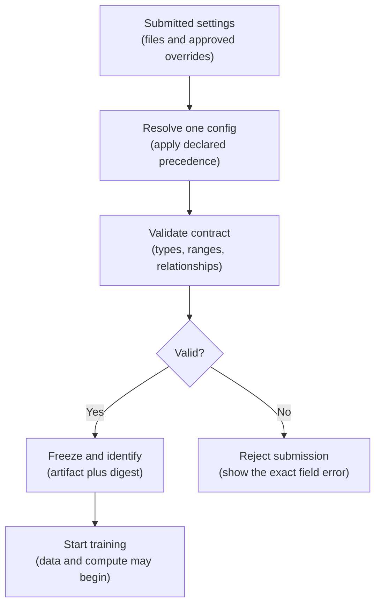
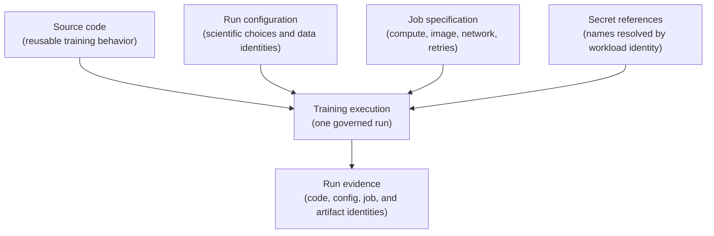
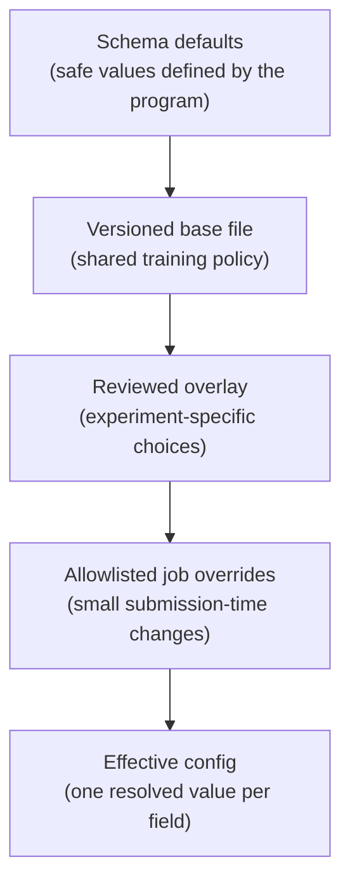
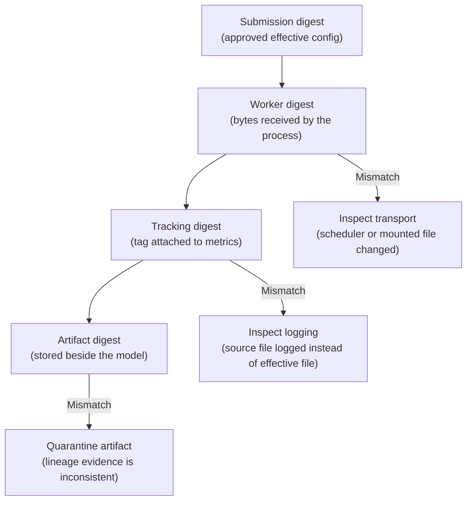

## Table of Contents

1. [A Typo Can Waste A Full Training Run](#a-typo-can-waste-a-full-training-run)
2. [What A Training Configuration Controls](#what-a-training-configuration-controls)
3. [Keep Four Kinds Of Training Settings Separate](#keep-four-kinds-of-training-settings-separate)
4. [Design A Small And Stable Training Configuration](#design-a-small-and-stable-training-configuration)
5. [Validate Before Data Access And Compute](#validate-before-data-access-and-compute)
6. [Define Which Configuration Layer Wins](#define-which-configuration-layer-wins)
7. [Create And Record The Final Configuration](#create-and-record-the-final-configuration)
8. [Keep Runtime Details And Secrets Out Of The Training Recipe](#keep-runtime-details-and-secrets-out-of-the-training-recipe)
9. [Choose A Configuration Library That Fits The Design](#choose-a-configuration-library-that-fits-the-design)
10. [Evolve Configuration Without Breaking Old Runs](#evolve-configuration-without-breaking-old-runs)
11. [Test Configuration Locally And In The Managed Job](#test-configuration-locally-and-in-the-managed-job)
12. [Investigate Why Two Runs Used Different Settings](#investigate-why-two-runs-used-different-settings)
13. [The Complete Configuration Workflow](#the-complete-configuration-workflow)
14. [References](#references)

## A Typo Can Waste A Full Training Run
<!-- section-summary: A configuration error can launch a valid job with an unintended training recipe, so the job must validate its effective config before spending compute. -->

A platform engineer is about to approve an overnight GPU training job. The submitted YAML contains `learningRate: 0.0001`, while the Python program expects `learning_rate`. The loader silently drops the unfamiliar key and uses its default value of `0.01`. The job finishes, uploads a model, and reports metrics. Every system appears healthy, yet the team trained a different recipe from the one the reviewer approved.

This failure is expensive because configuration mistakes often produce valid computations. A misspelled data snapshot can train on the wrong population. A string such as `"false"` can turn into a truthy value in careless Python code. An unrecorded command-line override can make a promising result impossible to reproduce. The training service may return success in all three cases.

The safe path is to turn configuration into a checked input contract. The job first combines the allowed inputs and rejects invalid fields. It then creates one final configuration and records its identity. Data access and accelerator reservation wait until that contract passes.



Configuration safety moves mistakes to the cheapest point in the run: before data access, compute allocation, and model production.

## What A Training Configuration Controls
<!-- section-summary: Run configuration stores the reviewed choices for one execution while the training program keeps the reusable behavior. -->

A **training configuration** is a structured set of values that selects the inputs and settings for one execution of a training program. You can think of it as the recipe card attached to a run. The Python package provides the cooking method; the config names the ingredients, quantities, and acceptance checks chosen for this attempt.

This separation exists because training code and run choices change at different speeds. The implementation of average precision may remain stable for months. A dataset snapshot, feature-set version, seed, or learning rate may change for every experiment. Keeping those values in Python would turn each experiment into a code edit. Passing dozens of loose command-line flags would hide the complete recipe across a scheduler, shell history, and CI variables.

### Compare The Proposed Settings With The Settings The Job Used

The source file captures the choices proposed by the author. The **effective config** captures every value that reached the process after defaults and overrides. That distinction matters in scheduled and managed training. An orchestrator may add a smoke-test overlay. A release pipeline may select a pinned dataset version. A managed service may pass values through its job API.

A useful run record therefore contains both provenance and content:

- the source config path and Git revision;
- every applied overlay or override, in precedence order;
- the fully resolved configuration artifact;
- a stable digest calculated from that artifact;
- the training-code revision, container image digest, and managed-job identifier.

With this record, two runs sharing a source file can still reveal different effective settings. Two files producing the same effective settings can also reveal that equivalence through the digest.

## Keep Four Kinds Of Training Settings Separate
<!-- section-summary: Source code, run configuration, deployment configuration, and secret values have different owners, review paths, and security needs. -->

Configuration works best after the team separates four kinds of decisions. They travel through different review paths and change for different reasons. Mixing them creates oversized YAML files that let an experiment edit quietly change infrastructure or expose credentials.

At submission time, the training execution receives one reviewed version of each input. The code defines the operation. The run config selects the experiment. The job specification places that work on an execution platform. Secret references grant narrowly scoped access. The run record keeps the identities of all four inputs together.



### Keep Training Behavior In Source Code

Source code implements the repeatable path from input data to model artifacts. It contains data loading, feature transformations, model construction, metric calculations, artifact writing, and failure handling.

If a choice changes the meaning of an algorithm or requires unit tests, code is usually its proper home. The function that prevents target leakage belongs in code. The specific immutable training snapshot selected for one run belongs in configuration.

### Keep Experiment Choices In The Run Configuration

The run config names data and feature versions, model family, hyperparameters, random seeds, evaluation metrics, and promotion thresholds. These values describe the experiment. A reviewer should be able to inspect them without opening the cloud job definition.

Some runners transport a selected dataset through a dedicated CLI or managed-job input. The mounted path is an execution detail; the immutable snapshot identity still belongs in the effective run record. The resolver can combine the submitted identity with the path supplied by the platform before it freezes and hashes the config.

Some teams also include a portable compute intent such as `compute_profile: gpu-medium`. The cloud binding for that profile still lives in the job specification. This keeps an experiment meaningful across Azure Machine Learning, Amazon SageMaker AI, Gemini Enterprise Agent Platform, Databricks Jobs, or an internal Kubernetes platform.

### Keep Compute And Deployment Settings In The Job Specification

The job specification selects the container image digest, machine type, accelerator count, network, identity, retry policy, timeout, storage mounts, and queue. These settings influence cost and reliability, and platform teams often own them. Record their resolved values beside the run config because numerical reproducibility can depend on hardware and library versions.

### Use References For Secrets

A run may need access to a warehouse, tracking server, or artifact store. The config should carry a secret reference or credential scope, such as `secret://ml-training/warehouse-reader`. The workload identity receives permission to resolve that reference at runtime.

The fetched credential remains inside the protected runtime boundary. Git stores the reference. The run digest covers the reference. Logs, tracking tags, and resolved artifacts omit the credential value.


*The four inputs have different owners, yet their identities meet in the evidence for one training execution.*

## Design A Small And Stable Training Configuration
<!-- section-summary: A compact hierarchy helps reviewers find data identity, feature identity, model choices, evaluation rules, and reproducibility controls. -->

A useful schema follows the questions a reviewer asks before approving training. The first group establishes the identity of the training and validation data. The second identifies the features and model recipe. The final groups define evaluation and reproducibility controls.

Each group should remain small enough to review as a coherent decision. The following config is complete enough to launch one tree-model training run, while the cloud job specification supplies its image, compute, identity, and network.

```yaml
schema_version: 2
data:
  train_snapshot: warehouse://credit_events/train@43
  validation_snapshot: warehouse://credit_events/validation@18
  label: default_within_90_days
features:
  feature_set: credit_risk_features@12
model:
  family: lightgbm
  learning_rate: 0.03
  num_boost_round: 400
  early_stopping_rounds: 30
evaluation:
  primary_metric: average_precision
  minimum_primary_metric: 0.41
seed: 23
```

The identifiers matter more than the YAML format. `train_snapshot` points to an immutable dataset version. `feature_set` identifies a reviewed feature definition. `schema_version` tells the loader how to interpret the document. The seed records one source of training randomness. A value such as `latest` would move over time and weaken the evidence trail, so production runs should use immutable versions.

### Use Names That Explain Each Setting

A field name should communicate the choice it controls. `minimum_primary_metric` gives a reviewer more context than `threshold_1`. `train_snapshot` communicates immutability more clearly than `train_path`. Units belong in names where ambiguity is possible, such as `timeout_seconds` or `memory_gib`.

Avoid turning the config into a second programming language. Conditional logic, loops, arbitrary expressions, and embedded Python make review and migration difficult. A small amount of composition can reduce duplication; training behavior still belongs in tested source code.

## Validate Before Data Access And Compute
<!-- section-summary: Schema validation checks structure, types, ranges, and cross-field rules before the program performs expensive or irreversible work. -->

Parsing YAML only proves that the text has valid YAML syntax. **Schema validation** checks whether those parsed values form a training configuration the program understands. In other words, the schema is the agreement between the author of the config and the code that consumes it.

A production validator should cover four layers. Structural rules require fields such as `data.train_snapshot`. Type rules keep `num_boost_round` as an integer. Constraint rules keep values inside meaningful ranges. Relationship rules compare fields, such as requiring early stopping to occur before the maximum boosting round.

### Reject unknown keys

Many configuration libraries ignore unfamiliar keys by default. That behavior turns a typo into a silent fallback. Strict configs should reject `learningRate`, `learnng_rate`, or any unapproved field and point to its exact location. The author then receives a clear correction before the job consumes resources.

Pydantic provides a concise runtime schema for Python training services. This focused model uses strict types, forbidden extra keys, immutable model instances, field constraints, and a cross-field validator:

```python
from typing import Literal, Self
from pydantic import BaseModel, ConfigDict, Field, model_validator
class ModelConfig(BaseModel):
    model_config = ConfigDict(extra="forbid", strict=True, frozen=True)
    family: Literal["lightgbm"]
    learning_rate: float = Field(gt=0, le=1)
    num_boost_round: int = Field(ge=1, le=10_000)
    early_stopping_rounds: int = Field(ge=1)
    @model_validator(mode="after")
    def early_stopping_fits_run(self) -> Self:
        if self.early_stopping_rounds >= self.num_boost_round:
            raise ValueError("early_stopping_rounds must be smaller than num_boost_round")
        return self
model_config = ModelConfig.model_validate(parsed_yaml["model"])
```

The root `TrainingConfig` can combine similarly strict models for `data`, `features`, `evaluation`, and the seed. The validator then reports errors in the vocabulary of the config. A misspelled key should produce a path such as `model.learningRate`, and an invalid range should name `model.learning_rate`. The job runner can print the full validation report, mark the submission as rejected, and avoid retrying it as an infrastructure failure.

### Check That Referenced Data And Features Exist

Schema validation cannot prove that `warehouse://credit_events/train@43` exists or that it carries the expected columns. Add a preflight stage after schema validation. It resolves immutable data and feature references, checks access, compares their schemas with the training contract, and estimates size before provisioning costly compute.

This creates two useful failure classes. A malformed field fails as `CONFIG_INVALID`. A well-formed reference that cannot be resolved fails as `INPUT_PREFLIGHT_FAILED`. Separate classes direct the first problem to the config author and the second to the data or platform owner.

## Define Which Configuration Layer Wins
<!-- section-summary: Layered configuration stays predictable when every layer has a declared purpose and later layers can change only approved fields. -->

Teams need a small amount of layering. A base file may hold reviewed defaults. An experiment overlay may select a candidate recipe. CI may reduce the training rounds for a smoke test. The risk comes from hidden precedence: two places set the same field, and nobody knows which value reached training.

Use one documented order from lowest to highest priority:



Later layers win only for fields they are allowed to change. A smoke-test job may reduce `model.num_boost_round`, point at small fixture snapshots, and add tracking labels. It should have no permission to weaken a production evaluation threshold or select an unreviewed feature set.

A command can keep the change visible:

```bash
train-model \
  --config configs/base.yaml \
  --overlay configs/experiments/lower-learning-rate.yaml \
  --set model.num_boost_round=20 \
  --set data.train_snapshot=fixtures://credit/train@7
```

The loader parses override values through the same typed schema as the file. A service such as SageMaker supplies hyperparameters as strings, so the boundary adapter must convert each allowlisted value to its declared type before validation. Arbitrary dot-path assignment gives a scheduler too much power and weakens review.

### Keep defaults in one place

Repeated defaults create drift. Imagine `learning_rate` appearing in Python, `base.yaml`, and the scheduler template. A reader must search three systems to predict the run. Choose one authoritative layer for each default. Required scientific choices often deserve an explicit value in the reviewed file, while harmless implementation defaults can live in the schema.

## Create And Record The Final Configuration
<!-- section-summary: The runner should resolve every approved input once, freeze the result, serialize it consistently, and attach its digest to the run. -->

After layering, the runner should produce one **effective config**. This object contains a single value for every field and no unresolved placeholders. You can think of it as the signed recipe that the training process has agreed to follow.

Resolution should finish before any training worker loads data. The runner applies layers in declared order, resolves supported references, validates the final structure, and freezes the object. Training functions receive that frozen object through their arguments. They should never reload YAML in the middle of a run or read a second set of modeling values from process-wide environment variables.

### Give Identical Final Configurations The Same Identity

A digest is a short identity calculated from the full effective configuration. Stable calculation requires a canonical representation: the same field order, scalar encoding, enum representation, and treatment of optional values every time. Serializing the validated Pydantic model as sorted JSON produces the exact bytes that SHA-256 hashes:

```python
import hashlib
import json
resolved = effective_config.model_dump(mode="json")
payload = json.dumps(
    resolved,
    sort_keys=True,
    separators=(",", ":"),
    ensure_ascii=False,
).encode("utf-8")
config_digest = hashlib.sha256(payload).hexdigest()
output_dir.joinpath("resolved-config.json").write_bytes(payload)
```

Store the serialization format, schema version, and digest algorithm with the digest. A future serializer may encode the same values differently. Those identifiers let the team reproduce the original calculation and distinguish content changes from serialization changes.

### Link The Final Configuration To The Training Run

The resolved file should travel with the run's metrics and artifacts. MLflow can log it as an artifact and record the digest as a run tag. A managed platform can also store the digest in job labels or metadata. Useful lineage links include the Git commit, source config URI, ordered override list, data snapshot IDs, feature-set version, container digest, and cloud job ID.

This record helps a reviewer connect a metric to the approved configuration. The reviewer compares the submitted digest with the tracking tag and the artifact digest. A match ties the evidence to one exact recipe.


*A shared digest proves that every boundary used the same resolved training recipe.*

## Keep Runtime Details And Secrets Out Of The Training Recipe
<!-- section-summary: Environment variables carry runtime facts, while secret managers supply credential values through identities and reviewed references. -->

Environment variables are useful for facts supplied by the execution platform. Examples include the managed-job ID, mounted input path, tracking URI, output directory, and distributed-worker rank. These values describe where the process is running. Hyperparameters and dataset choices describe what the experiment is testing, so they belong in the effective config.

This boundary prevents a common investigation problem. If `LEARNING_RATE` can silently override the YAML, the recorded config may say `0.03` while the process uses `0.1`. An engineer examining the run artifact sees the approved value and misses the operational override. Keeping scientific choices in the validated config leaves one source of truth inside the process.

### Let The Training Job Receive Short-Lived Credentials

A secret reference names a credential without containing it:

```yaml
connections:
  feature_store:
    secret_ref: secret://ml-training/feature-store-reader
```

At startup, the workload identity asks the platform's secret manager for that reference. AWS commonly pairs IAM with Secrets Manager. Azure pairs managed identity with Key Vault, while Google Cloud uses service identity with Secret Manager. Databricks jobs can use governed connections or secret scopes according to the workspace design.

The resolved config artifact keeps `secret_ref` and removes any fetched value. Logging filters should also redact credential-shaped environment variables and command arguments. The training process should hold credentials only for the period needed, while the platform controls rotation and access auditing.

## Choose A Configuration Library That Fits The Design
<!-- section-summary: Pydantic, dataclasses, Hydra, and OmegaConf solve different parts of configuration, so the required behavior should determine the choice. -->

The framework comes first: boundaries, schema, precedence, freezing, identity, and lineage. A library implements part of that framework. Selecting one by popularity can leave gaps around override policy, migrations, or evidence capture.

### Use Dataclasses For Small Internal Programs

Python dataclasses provide typed objects with low ceremony, and frozen dataclasses prevent attribute assignment. Type annotations alone leave parsed YAML unchecked at runtime. A small internal trainer can pair a dataclass with an explicit parser and validator. This choice fits a stable shape with limited composition needs.

### Use Pydantic For Runtime Validation

Pydantic models provide runtime type checking, constraints, cross-field validators, JSON Schema generation, rejection of extra keys, and frozen instances. This is a strong default for a Python training service that receives YAML, JSON, API payloads, or managed-job parameters. The team still owns layering, allowed overrides, secret handling, migrations, and canonical artifact generation.

### Use Hydra And OmegaConf For Composed Experiment Settings

Hydra suits projects with several interchangeable config groups, such as model family, dataset family, and training profile. Its Defaults List composes those groups, and its override grammar supports command-line selection and multirun workflows. OmegaConf provides the underlying hierarchical configuration, interpolation, structured configs, merge operations, missing-value checks, struct mode, and read-only mode.

Composition adds power and review surface. Declare `_self_` deliberately in Hydra defaults so the merge order remains visible. Enable structured or struct mode so unknown keys fail. Convert the composed config to a resolved primitive container with missing-value checks, freeze it, and save the exact result before training. A composed source tree is provenance; the resolved artifact is the run recipe.

```python
resolved = OmegaConf.to_container(
    cfg,
    resolve=True,
    throw_on_missing=True,
)
OmegaConf.set_readonly(cfg, True)
```

Choose Hydra once config groups and experiment sweeps create genuine composition needs. For a single modest schema, Pydantic plus a small explicit merge layer usually gives reviewers fewer moving parts.

## Evolve Configuration Without Breaking Old Runs
<!-- section-summary: Schema versions and deterministic migrations let new code interpret old run recipes without guessing their original meaning. -->

Configuration schemas change as training systems mature. A field may receive a clearer name, one section may split into two, or a new value may require a unit. Old resolved configs remain part of the lineage record, so future code needs a deliberate interpretation path.

Add a required integer `schema_version` at the root. The loader reads this field before normal validation. It accepts the current version, migrates specifically supported older versions through pure functions, and rejects unknown future or retired versions with a clear error.

```python
from copy import deepcopy
def migrate_v1_to_v2(raw: dict) -> dict:
    migrated = deepcopy(raw)
    migrated["model"]["learning_rate"] = migrated["model"].pop("eta")
    migrated["schema_version"] = 2
    return migrated
MIGRATIONS = {1: migrate_v1_to_v2}
```

A migration should preserve meaning, avoid I/O, and produce deterministic output. Record the original artifact digest, source schema version, migration steps, and final digest. If an old field cannot map safely, stop and ask for a reviewed replacement config. Guessing converts a compatibility problem into an experiment-integrity problem.

### Introduce Configuration Changes In Stages

Start by teaching the loader to accept both the current and previous version. Update versioned configs through review, then update scheduled jobs and templates. Observe validation failures and usage counts. Remove the older migration path only after active callers and reproducibility commitments permit it. This staged path gives teams a recovery window without keeping every historical schema alive forever.

## Test Configuration Locally And In The Managed Job
<!-- section-summary: Configuration tests should cover invalid and boundary values, precedence, stable identity, migrations, secret leakage, and provider-specific parameter adapters. -->

Configuration code deserves tests because it decides which experiment the platform runs. Happy-path loading proves very little. The valuable cases are malformed, ambiguous, and close to the accepted boundary.

Start with a valid minimal config, then remove required fields and add unknown keys. Exercise wrong scalar types, numeric boundaries, and invalid relationships between fields. Separate tests should cover override allowlists, precedence conflicts, digest stability, migration output, and secret redaction. A focused parameterized test keeps the failure behavior visible:

```python
import pytest
from pydantic import ValidationError
@pytest.mark.parametrize(
    ("learning_rate", "rounds", "patience"),
    [
        (0.0, 400, 30),
        (1.01, 400, 30),
        (0.03, 20, 20),
    ],
)
def test_invalid_model_settings(learning_rate, rounds, patience, valid_model):
    valid_model.update(
        learning_rate=learning_rate,
        num_boost_round=rounds,
        early_stopping_rounds=patience,
    )
    with pytest.raises(ValidationError):
        ModelConfig.model_validate(valid_model)
```

### Validate Parameters Supplied By The Managed Job

Cloud services expose different parameter channels. Azure Machine Learning command jobs can declare typed inputs and interpolate them into the command. SageMaker training containers receive hyperparameters in `/opt/ml/input/config/hyperparameters.json`, where values arrive as strings. Databricks Jobs can pass job parameters into compatible task types and expose dynamic value references such as a run ID.

The adapter at this boundary should accept a small allowlist and parse each value explicitly. It also attaches the value's origin. The merged result then passes through the same schema validator. A separate cloud-only validation path would let local and managed runs accept different recipes.

Here is a compact Azure Machine Learning job definition. It mounts a versioned config file and exposes one bounded smoke-test override:

```yaml
$schema: https://azuremlschemas.azureedge.net/latest/commandJob.schema.json
type: command
code: ./src
command: >-
  python -m trainer
  --config ${{ inputs.training_config }}
  --set model.num_boost_round=${{ inputs.num_boost_round }}
inputs:
  training_config:
    type: uri_file
    path: azureml:credit-training-config:12
  num_boost_round: 20
environment: azureml:credit-trainer:8
compute: azureml:cpu-training
```

The job API supplies the file and the override; the training program still owns precedence, allowlisting, parsing, validation, freezing, and digest creation. A full training submission would use the reviewed round count, while this bounded override supports a fast integration check.

## Investigate Why Two Runs Used Different Settings
<!-- section-summary: Comparing the same configuration digest at submission, process startup, tracking, and artifact storage pinpoints where a run recipe changed. -->

**Configuration drift** means different stages believe the run used different settings. A submitter may hash one config before a scheduler adds an override. A worker may later read a mutable file again, while the tracker logs the original source. The final metric then lacks a trustworthy recipe.

Record the effective-config digest at each important boundary: after submission resolution, at worker startup, in the experiment tracker, and beside the model artifact. These values should match for one run.



Suppose the submission and worker digests differ. The investigation focuses on the job adapter, override resolver, or mounted config asset. If the worker and tracker differ, the training process probably logged the source file or recalculated the digest with another serializer. If the artifact differs, keep the model out of promotion until the storage or packaging path is understood.

The operational response should preserve evidence. Save the submitted layers, ordered overrides, resolved bytes, serializer metadata, and job event log. Repair the faulty boundary, rerun a low-cost validation job, and compare all four digests before restoring full training. Rewriting the tracking tag after the fact would hide the original inconsistency.

## The Complete Configuration Workflow
<!-- section-summary: A reliable runner resolves, validates, freezes, records, executes, and verifies one configuration through every stage of training. -->

A production training configuration system follows one continuous path. It loads a versioned run config and applies reviewed layers in declared order. It accepts only allowlisted job overrides, then validates structure and meaning. Finally, it resolves immutable inputs, freezes the effective object, writes canonical bytes, calculates a digest, and attaches that evidence to the job and artifacts.

The design gives each concern a clear home. Source code defines training behavior. The run config defines scientific choices. The job specification defines compute and execution policy. Secret managers provide credential values through workload identity. The resolved artifact joins those identities into a reproducible run record without copying secrets.

This foundation supports local scripts, CI smoke tests, scheduled retraining, managed cloud jobs, and experiment sweeps with the same contract. The platform may change how it transports values, while the training program keeps one validated recipe from process startup through artifact publication.


*Run settings, runtime resources, and secret resolution remain separate while one validated recipe follows the job.*

## References

- [Pydantic Documentation: Configuration](https://docs.pydantic.dev/latest/api/config/)
- [Pydantic Documentation: Validators](https://docs.pydantic.dev/latest/concepts/validators/)
- [Pydantic Documentation: Serialization](https://docs.pydantic.dev/latest/concepts/serialization/)
- [Hydra Documentation: The Defaults List](https://hydra.cc/docs/advanced/defaults_list/)
- [OmegaConf Documentation: Usage](https://omegaconf.readthedocs.io/en/latest/usage.html)
- [MLflow Documentation: Tracking](https://mlflow.org/docs/latest/ml/tracking/)
- [Azure Machine Learning Documentation: Command Job YAML Schema](https://learn.microsoft.com/en-us/azure/machine-learning/reference-yaml-job-command?view=azureml-api-2)
- [Amazon SageMaker AI Documentation: How Training Information Reaches A Container](https://docs.aws.amazon.com/sagemaker/latest/dg/your-algorithms-training-algo-running-container.html)
- [Gemini Enterprise Agent Platform serverless training overview](https://docs.cloud.google.com/gemini-enterprise-agent-platform/machine-learning/training/overview)
- [Databricks Documentation: Job Parameters](https://docs.databricks.com/aws/en/jobs/job-parameters)
- [Databricks Documentation: Dynamic Value References](https://docs.databricks.com/aws/en/jobs/dynamic-value-references)
