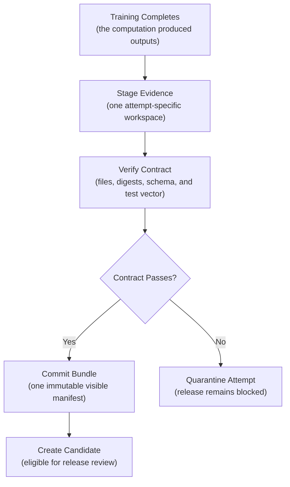
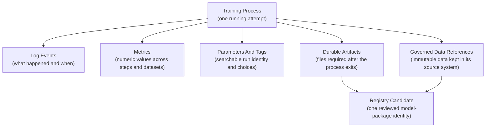
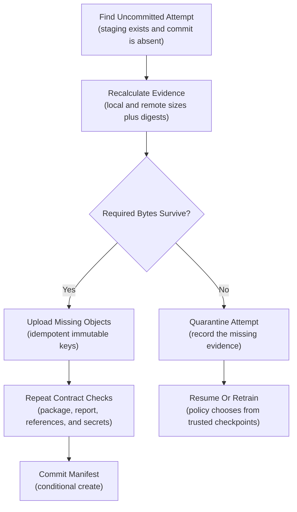

## Table of Contents

1. [A Successful Job Can Still Leave No Usable Model](#a-successful-job-can-still-leave-no-usable-model)
2. [Understand The Outputs A Training Job Must Produce](#understand-the-outputs-a-training-job-must-produce)
3. [Put Each Output In The Right Store](#put-each-output-in-the-right-store)
4. [Define The Files Every Successful Training Run Must Produce](#define-the-files-every-successful-training-run-must-produce)
5. [Publish The Model Bundle Safely](#publish-the-model-bundle-safely)
6. [Give The Training Run And Each Retry Separate IDs](#give-the-training-run-and-each-retry-separate-ids)
7. [Record Where The Model And Its Data Came From](#record-where-the-model-and-its-data-came-from)
8. [Implement The Output Structure With MLflow 3](#implement-the-output-structure-with-mlflow-3)
9. [Implement The Output Structure With W&B Artifacts](#implement-the-output-structure-with-wb-artifacts)
10. [Protect, Retain, And Delete Training Outputs](#protect-retain-and-delete-training-outputs)
11. [Select One Trained Model For Release Review](#select-one-trained-model-for-release-review)
12. [Recover After A Model Bundle Fails To Publish](#recover-after-a-model-bundle-fails-to-publish)
13. [The Main Idea](#the-main-idea)
14. [References](#references)

## A Successful Job Can Still Leave No Usable Model
<!-- section-summary: Training success and evidence publication are separate outcomes, so release waits for a complete verified artifact bundle. -->

An overnight training job exits successfully. The experiment page contains a final accuracy score and two files named `model.pkl`. One file came from the last epoch and the other came from the best validation checkpoint, yet neither filename says which is which. The resolved configuration is missing. The dataset field says `latest`. No input schema or sample prediction proves that either model can load and score data.

The release reviewer now faces a concrete decision: select one file for shadow testing or hold the candidate. Choosing would mean guessing which model produced the reported metric. The reviewer holds the release, even though the training calculation finished and the compute platform reported success.

This situation exposes two outcomes that need separate states. **Training success** means the algorithm completed its computation. **Publication success** means the required evidence was staged, validated, and committed as one identifiable bundle. A production pipeline needs both outcomes before it can create a model candidate.



A model file is one result of training. A committed artifact bundle supplies the evidence needed to evaluate, reproduce, and release that result safely.

## Understand The Outputs A Training Job Must Produce
<!-- section-summary: An evidence system preserves the model, its meaning, its origin, and the checks that make it usable after the training process ends. -->

A **training artifact** is a durable output that another person or system needs after the training process ends. Model weights and the evaluation report belong in this category.

The input-output signature, resolved configuration, dependency record, and bundle manifest are artifacts too. Together they explain what the model is, how it was produced, and whether it passed the expected checks.

The word “output” is broader than “artifact.” A job also emits log events, metric points, parameters, tags, and references to governed data. Those signals belong to the evidence system, while each has a different storage job. Treating every output as a file creates a large bundle that is difficult to search. Treating every output as a tracking metric strips away structure and context.

### Follow Training Outputs From Computation To Review

The lifecycle starts inside the training process and ends at a control boundary. The process reports progress while it runs. It writes durable files for review and reuse. The publisher verifies those files and commits a manifest. A registry can then point to one immutable model package and its evidence. Deployment remains a separate decision.

This design gives each consumer a stable entry point. An on-call engineer searches events. A data scientist compares metrics. A reviewer opens reports and test samples. A serving system reads the model signature and package. A governance process follows dataset, code, and dependency identities from the manifest.

## Put Each Output In The Right Store
<!-- section-summary: Events, metrics, metadata, artifacts, governed data references, and registry candidates differ in volume, mutability, access, and query patterns. -->

The storage boundary should match the question a consumer asks. An operator searching for the cause of an upload failure has a different need from a release process fetching an immutable model package.

During one attempt, the training process emits several output types at the same time. Events and metrics describe execution and results. Parameters and tags make those records searchable. Artifacts and governed data references preserve evidence across process boundaries. The registry later points to one reviewed model identity without absorbing every source object.



### Use Log Events To Explain Execution

A **log event** records a discrete fact such as `checkpoint_saved`, `evaluation_started`, or `artifact_upload_failed`. Useful events carry a timestamp, severity, event name, `run_id`, `attempt_id`, and relevant fields. Structured JSON works well because a log backend can filter by state or failure class without parsing free-form sentences.

Events serve diagnosis and audit of the execution path. They can be numerous, and many organizations retain verbose events for a shorter period than model evidence. A final metric should still exist as a metric and report artifact; finding it inside thousands of log lines would make comparisons fragile.

```json
{"event":"artifact_verified","run_id":"fraud-ranker-1842","attempt_id":"a2","path":"model/model.skops","sha256":"7b3a...","severity":"INFO"}
```

### Use Metrics For Comparable Numbers

A **metric** is a named numeric measurement associated with a step, dataset, model, or evaluation slice. Training loss over epochs belongs in a metric series. Final average precision on validation snapshot `184` also belongs as a metric. Metric stores support plots, comparisons, filtering, and alerting across runs.

The metric name and context must travel together. `average_precision=0.43` is ambiguous until the record identifies the validation dataset, evaluation code version, model identity, and any segment. Detailed confusion matrices, calibration curves, and per-segment rows usually belong in a report artifact, with selected headline values copied into the metric store for search.

### Use Parameters And Tags To Find Runs

A **parameter** records a choice used by the run, such as `learning_rate=0.03`. A **tag** records descriptive identity or lifecycle metadata, such as an owner, source commit, purpose, or config digest. Tracking systems index these small values so teams can filter and compare runs.

The full resolved config still belongs as a durable artifact. Flattening a nested config into hundreds of tracking parameters loses types, structure, and migration information. Mutable tags also make poor release identities. Use them as an index, then follow immutable IDs and digests for decisions.

### Store Reusable Files As Durable Artifacts

A **durable artifact** is a versioned file or bundle that must survive the training process. Model packages, signatures, evaluation reports, resolved configs, dependency locks, and manifests belong here. Artifact storage optimizes for byte integrity, versioning, access control, and longer retention.

Artifact files can be large and may require restricted access. A report containing misclassified customer records deserves a different policy from a public aggregate metric. The manifest can point to each object and record its digest without granting every tracker user access to the content.

### Reference Large Datasets In Their Governed Store

Training datasets and full prediction tables are often too large or sensitive for an experiment tracker. Keep them in the lake, warehouse, feature platform, or governed object store. The run records an immutable table version, snapshot ID, object version, schema identity, and digest or manifest reference.

For example, a Delta table version or Iceberg snapshot ID identifies a fixed dataset state. A mutable table name alone identifies a moving collection. Reproducibility also depends on retention: the table platform must preserve that version for at least as long as the model evidence requires it.

### Use A Registry Record To Identify A Model For Review

A **registry candidate** points to one immutable deployable model package and its review evidence. It adds ownership, intended use, approval state, and lifecycle history. The registry is a control plane for selecting versions. It should avoid serving as a duplicate home for training datasets or verbose logs.

Candidate status means the model is eligible for downstream release checks. It carries no authority to receive production traffic. A deployment workflow still needs environment-specific validation, approval, rollout, and rollback controls.


*Each output uses a store suited to its query and retention needs; the registry identifies the reviewed model package rather than duplicating every record.*

## Define The Files Every Successful Training Run Must Produce
<!-- section-summary: The artifact contract names required objects, their responsibilities, validation rules, and the evidence that marks a bundle complete. -->

An **artifact contract** states which outputs a successful publication must contain. It also defines the format, validation rule, and ownership of each output. You can think of it as the return type of the training job: callers can rely on the contract instead of learning the private details of each trainer.

### Keep Training State And Serving Packages Separate

The raw model or checkpoint preserves framework-native training state. A deep-learning checkpoint may include weights, optimizer state, scheduler state, and training step so a compatible trainer can resume. This object is valuable for recovery and investigation. Framework-native serialization can also execute code during loading, so access and provenance checks matter.

The **deployable model package** targets inference. It combines the selected model with the files and metadata needed by a specific serving contract. Common forms include an MLflow Model, an OCI image, or a serving repository accepted by Triton or another model server. The package should identify its format and loader, while the raw checkpoint remains available only when the recovery policy requires it.

### Define Model Inputs, Outputs, And A Test Example

An **input-output signature** describes required fields, types, shapes, optional values, and prediction structure. A sample input helps humans understand the contract. A **test vector** adds an expected output or bounded tolerance, so publication validation can load the package and prove that inference still works after serialization.

Use synthetic or de-identified examples whenever real records would expose personal or restricted data. For a probabilistic classifier, the test vector can include three representative inputs and expected probability ranges. The test vector validates package behavior. Full evaluation remains a separate requirement.

### Save The Information Needed To Reproduce And Evaluate The Model

The bundle should carry the resolved config and its digest, source commit, dependency lock, runtime or container digest, random seeds, and immutable dataset references. The evaluation report should identify the model package, dataset snapshots, metric implementation, segment definitions, thresholds, and observed results. Selected predictions or a governed error-sample reference support human review.

For containerized training or serving, attach a software bill of materials in SPDX or CycloneDX format when the platform requires supply-chain review. Build provenance can connect the package digest to its source and builder through an attestation such as SLSA provenance. A package lock and container digest answer different questions: the lock describes intended dependencies, while the built image digest identifies the actual runtime artifact.

### Use A Manifest To Index The Bundle

The **manifest** lists every committed object with its role, media type, size, and cryptographic digest. It also holds external references and lineage identities. Large reports stay in their own objects; the manifest remains a small machine-readable index.

```yaml
contract_version: 1
run_id: fraud-ranker-1842
attempt_id: a2
objects:
  - path: model/model.skops
    role: deployable_model
    media_type: application/octet-stream
    size_bytes: 4812032
    sha256: 7b3a8f...
  - path: reports/evaluation.json
    role: evaluation_report
    media_type: application/json
    size_bytes: 18422
    sha256: f12cd9...
external_inputs:
  - catalog: main.risk.features
    role: training_dataset
    table_format: delta
    table_version: 184
lineage:
  source_commit: 34d7a1f...
  config_digest: c91e40...
  container_digest: sha256:4ae72c...
```

Contract validation must reject a missing required role, duplicate path, unsupported contract version, or digest mismatch. Optional checkpoints and debug plots need explicit optional status. Otherwise a consumer cannot distinguish an intentional omission from a failed upload.

## Publish The Model Bundle Safely
<!-- section-summary: Attempt-specific staging keeps partial uploads invisible until verification succeeds and one manifest commits the complete bundle. -->

Publishing several files creates a consistency problem. Object stores upload each object independently, and they offer no atomic rename for a directory-sized bundle. A reader could see the model before the signature or see an evaluation report from another retry if the publisher writes directly to a shared final prefix.

Solve this with three states. **Staging** contains attempt-specific files that consumers ignore. **Verified** means every required object passes the contract. **Committed** means a small manifest or commit pointer makes exactly one verified attempt visible.

### Write Each Attempt To A Separate Temporary Location

The training process writes to local scratch space or a mounted attempt directory first. The publisher uploads those bytes under a path such as `runs/fraud-ranker-1842/attempts/a2/`. Another attempt uses a separate prefix. Files from concurrent retries never overwrite each other.

### Verify Files And Model Behavior

Existence is the first check. The publisher then verifies file size and SHA-256 digest, parses JSON or YAML schemas, checks the resolved-config digest, and confirms that required dataset references resolve. Model validation should load the deployable package in an isolated environment, inspect its signature, and run the test vector.

Evaluation evidence needs semantic checks as well. The report must name the same model digest and dataset identities as the manifest. Required segments must be present, sample counts must meet policy, and metric values must be finite. Secret scanning should run before reports, configs, and environment records leave the job boundary.

### Publish The Manifest Last

Readers treat the committed manifest as the visibility gate. The publisher uploads all content first, verifies the remote bytes, then creates the manifest or a small `committed.json` pointer with an object-store precondition. Amazon S3 can use `If-None-Match: *`; Google Cloud Storage can use a generation-match precondition of zero; Azure Blob Storage supports conditional headers.

This operation makes the decision atomic from the consumer's perspective. The object store still holds several independent objects. Consumers gain a simple rule: bundles without a committed manifest remain invisible.


*The manifest is published last, so readers discover only a complete, verified attempt.*

## Give The Training Run And Each Retry Separate IDs
<!-- section-summary: A logical run groups one intended computation while attempt identities separate retries, publication workspaces, and failure evidence. -->

A **run ID** identifies the intended training computation: one config digest, input set, code revision, and requested output. An **attempt ID** identifies one physical execution or publication try. A retry keeps the run ID and receives a new attempt ID.

This distinction prevents retries from mixing files. Suppose the first worker trains successfully and loses network access during publication. A second worker can reconcile the first attempt or start `a2` without writing over `a1`. Logs and publication events include both identities, so an operator can reconstruct the sequence.

### Make Repeated Uploads Safe

An idempotent upload produces the same stored state after one call or several calls. Use immutable object keys and content digests. If a retry finds the same key with the expected digest, it can skip the transfer. If the bytes differ, the retry stops and quarantines the attempt. Silent overwrite would hide a determinism or identity failure.

The commit step also needs idempotency. Repeating a conditional create with the same manifest digest can return the already committed result. A different digest for the same logical run requires policy: keep the existing commit, or record a superseding candidate through an explicit new run. Arrival order should never select the winner silently.

### Record Resumed Training Explicitly

A training retry may resume from a checkpoint produced by an earlier attempt. The final manifest should name that checkpoint digest and parent attempt. This lineage distinguishes a clean rerun from a resumed computation and helps reviewers interpret runtime, randomness, and optimizer state.

## Record Where The Model And Its Data Came From
<!-- section-summary: Lineage links immutable code, configuration, data, environment, and parent-model identities while governed source systems retain large or sensitive content. -->

**Lineage** is the chain of identities that explains where an artifact came from. For a model candidate, that chain connects source code, effective config, training and validation data, feature definitions, runtime environment, parent model or checkpoint, evaluation, and the final package digest.

The manifest should store identifiers that remain resolvable. A Git commit is stronger than a branch name. A container digest is stronger than an image tag. A Delta version, Iceberg snapshot ID, or versioned warehouse table is stronger than `latest`. If a source exposes its own manifest or digest, record that identity as well.

### Reference Large Tables At Their Governed Source

Copying a multi-terabyte training table into an experiment tracker wastes storage and weakens catalog controls. Keep the table in the platform that owns its access policies, schema, lineage, deletion procedures, and retention. The training bundle records its catalog name, immutable version, query or split definition, schema digest, and row-count evidence.

References need retention agreements. Delta time travel, Iceberg snapshots, warehouse clones, and versioned objects can disappear after vacuum or lifecycle cleanup. The model owner and data owner should align retention before a candidate depends on the version. A manifest pointing to expired data preserves history, yet it cannot support reproduction or audit.

### Keep Sensitive Review Rows Behind A Narrower Boundary

Per-record predictions and error examples can contain personal data, protected attributes, text, images, or labels with limited access. Store these rows in a governed table or restricted object prefix and place only an immutable reference in the general artifact bundle. Aggregate evaluation reports can remain available to a broader review group.

## Implement The Output Structure With MLflow 3
<!-- section-summary: MLflow 3 can represent runs, first-class Logged Models, dataset-linked metrics, signatures, and supporting evidence after the artifact contract is defined. -->

MLflow Tracking organizes execution evidence around runs. MLflow 3 also treats logged models as first-class entities with model IDs. One run can produce several checkpoints, each with its own model identity, metrics, and dataset context. This fits the distinction between a training execution and the model outputs it creates.

The training publisher should still validate its local or staged contract first. MLflow records and indexes the verified result. `name` is the current model-logging argument; `artifact_path` is deprecated in the current Python API. An input example can generate a signature automatically, while an explicit signature gives the team tighter control.

```python
import mlflow
import mlflow.sklearn
from mlflow.models import infer_signature

signature = infer_signature(validation_X, validation_predictions)
with mlflow.start_run(tags={"config_digest": config_digest}) as run:
    model_info = mlflow.sklearn.log_model(
        model,
        name="fraud-ranker-candidate",
        signature=signature,
        input_example=validation_X.head(3),
    )
    mlflow.log_artifact(manifest_path, artifact_path="evidence")
    mlflow.log_metric(
        "average_precision",
        average_precision,
        model_id=model_info.model_id,
        dataset=validation_dataset,
    )
```

The `validation_dataset` object carries the validation source and digest into MLflow. Supplying it with the metric connects the score to the evaluated dataset instead of leaving that relationship in a tag or naming convention.

The returned model ID supports an immutable `models:/<model_id>` URI. Record that ID in the candidate handoff together with the external bundle manifest digest. If several checkpoints are logged, choose the candidate through the evaluation policy and record the selected model ID. The most recently logged checkpoint has no automatic claim to candidate status.

MLflow can log parameters, tags, metrics, reports, and model packages. It should keep large governed datasets by reference through dataset metadata and source identity. Sensitive row-level reports may also remain in restricted storage, with a reference artifact or manifest entry available to reviewers.

## Implement The Output Structure With W&B Artifacts
<!-- section-summary: W&B Artifacts can version a verified model bundle, reference external data, preserve manifests, and link an immutable version into a registry collection. -->

W&B Artifacts represent versioned collections of files and references. Each logged artifact has a manifest and logical digest. Logging finalizes that artifact version, so later changes create another version. This maps well to a verified artifact bundle.

```python
import wandb

with wandb.init(project="risk-models", job_type="train") as run:
    artifact = wandb.Artifact(
        name="fraud-ranker",
        type="model",
        metadata={"run_id": run_id, "config_digest": config_digest},
    )
    artifact.add_dir(bundle_dir)
    artifact.add_reference(
        "s3://governed-ml-data/fraud/train/manifest.json",
        name="inputs/training-data",
        checksum=True,
    )
    logged = run.log_artifact(artifact)
    logged.wait()
```

`add_reference` keeps the external object at its governed URI and adds its metadata to the artifact manifest. Versioned object storage strengthens this pattern because the reference can retain an object version and checksum. A broad bucket prefix with mutable contents gives weaker lineage than a versioned manifest object.

After review, the exact artifact version can be linked into a W&B Registry collection and assigned a candidate alias. Aliases are mutable pointers, so release automation should resolve the alias to an immutable version and record that version before acting. Linking makes the artifact available through the registry without copying its bytes into another artifact.

## Protect, Retain, And Delete Training Outputs
<!-- section-summary: Artifact governance applies data minimization, access boundaries, retention classes, deletion workflows, and supply-chain evidence according to each output's risk. -->

Artifact bundles can contain more sensitive information than model binaries suggest. Resolved configs may expose internal paths. Reports may contain small segments or example records. Pickled models may execute code during deserialization. Dependency files reveal the software supply chain. Governance should classify each object by sensitivity and purpose before publication.

### Minimize And Separate Sensitive Content

Use aggregate metrics for broad comparison. Keep row-level predictions, error samples, and restricted labels in a narrower governed store. Synthetic test vectors usually provide enough evidence for package validation. Secret values, access tokens, connection strings, and private keys should fail a pre-publication scan.

### Apply Role-Based Access To Each Stored Object

The experiment-tracking group may need metrics and aggregate reports. A model-review group may need restricted error examples. The serving platform needs the deployable package and signature. Separate objects and prefixes let the platform grant each role the smallest useful scope. Access to a manifest should never imply access to every referenced object.

### Define Retention For Each Kind Of Output

Verbose logs and intermediate checkpoints often have short retention. Failed-attempt evidence may remain long enough for incident review. Committed candidate bundles, evaluation reports, configuration, lineage, and approval records usually follow the model's supported lifetime plus the required audit period. Legal holds, regulated decisions, and retraining obligations can extend that period.

Dataset retention must match the claim of reproducibility. If policy allows the source snapshot to expire earlier, describe the remaining evidence accurately: the team can inspect the manifest and evaluation, while a complete retrain from identical rows is unavailable.

### Record And Control Deletion

Deletion may come from retention expiry, privacy requests, license changes, security response, or model retirement. The workflow should identify affected candidates and descendants before removing bytes. Preserve a non-sensitive tombstone containing the deleted object identity, reason class, authority, and deletion event when policy permits. A registry must prevent future promotion of a candidate whose required artifact or dataset was deleted.

## Select One Trained Model For Release Review
<!-- section-summary: Candidate handoff selects one immutable model package and connects its evidence, limitations, owner, and requested next state without serving traffic. -->

Training may produce many checkpoints and experimental packages. The handoff should select exactly one candidate for the next release boundary. That decision compares the required evaluation report, guardrails, package validation, and review policy. It never relies on a filename such as `best.pkl` or a mutable `latest` tag alone.

A useful candidate record contains the logical run ID, committed manifest URI and digest, deployable package digest, MLflow model ID or W&B artifact version, signature identity, evaluation report identity, owner, intended use, known limitations, and requested next state. It also identifies the decision policy and reviewer or automated gate that selected the candidate.

Registration and deployment remain separate actions. Registration makes the candidate discoverable and governed. Release validation can then test the package in a target environment, check infrastructure and policy constraints, and choose a rollout strategy. Release controls continue to govern every registry event, even after training metrics pass.

## Recover After A Model Bundle Fails To Publish
<!-- section-summary: A reconciler inspects attempt state, verifies surviving bytes, completes safe uploads, and commits or quarantines the bundle without retraining blindly. -->

Publication can fail after expensive training has finished. The worker may upload the model and lose connectivity before the report. A process may crash after every object arrives and before the commit pointer is written. The tracking server may accept metrics while the object store rejects the model package.

The absence of a committed manifest keeps all three cases out of candidate selection. A reconciler can then inspect the attempt without guessing what downstream consumers have already seen.



### Complete Publication From Surviving Files

If the attempt workspace or durable staging prefix still contains every required object, the reconciler recalculates digests and compares them with the attempt records. Matching remote objects remain in place. Missing objects upload to immutable keys. The full validation suite runs again before the conditional commit.

### Quarantine Conflicting Or Incomplete Files

A digest mismatch means the same identity refers to different bytes. The reconciler should preserve the conflict for investigation, block the candidate, and avoid overwriting either object. If a required file disappeared, the attempt remains incomplete. A trusted checkpoint may support a resumed attempt; otherwise the pipeline retrains under a new attempt identity.

### Show The Current Publication Status

The job state should distinguish `TRAINING_SUCCEEDED`, `PUBLICATION_PENDING`, `COMMITTED`, and `QUARANTINED`. Structured events record every transition with run and attempt IDs. Operators can alert on attempts stuck in publication, while release systems query only committed manifests.

This recovery path saves expensive recomputation when the verified bytes survived. It also preserves the stronger rule: a partial collection of plausible files never turns into a candidate through operator intuition.

## The Main Idea
<!-- section-summary: A training result earns candidate status after its evidence is classified, verified, committed, linked, governed, and handed to a separate release boundary. -->

A reliable training job leaves more than a model file. It emits operational events, comparable metrics, searchable metadata, durable artifacts, and immutable references to governed inputs. An artifact contract turns those pieces into one expected result.

The publisher writes into an attempt-specific staging area, verifies bytes and behavior, and exposes the bundle by committing its manifest last. Run and attempt identities keep retries separate. Content digests make uploads idempotent. Lineage connects code, configuration, data, environment, evaluation, and parent models without copying large governed datasets.

MLflow 3 Logged Models and W&B Artifacts can implement this evidence model. The final handoff selects one immutable candidate and sends it to a separate release process. Training success supplies a result; committed evidence makes that result safe to evaluate and govern.


*The committed bundle gives a reviewer one trusted identity for the model and the evidence used to select it.*

## References

- [OpenTelemetry Specification: Logs Data Model](https://opentelemetry.io/docs/specs/otel/logs/data-model/)
- [OpenTelemetry Specification: Metrics Data Model](https://opentelemetry.io/docs/specs/otel/metrics/data-model/)
- [MLflow Documentation: Tracking And Logged Models](https://mlflow.org/docs/latest/ml/tracking/)
- [MLflow Documentation: Model Signatures And Input Examples](https://mlflow.org/docs/latest/ml/model/signatures/)
- [MLflow Python API: `mlflow.sklearn.log_model`](https://mlflow.org/docs/latest/api_reference/python_api/mlflow.sklearn.html#mlflow.sklearn.log_model)
- [Weights & Biases Python API: Artifact](https://docs.wandb.ai/models/ref/python/experiments/artifact)
- [Weights & Biases Documentation: Link An Artifact Version To A Registry Collection](https://docs.wandb.ai/models/registry/link_version)
- [Delta Lake Documentation: Time Travel](https://docs.delta.io/delta-batch/#query-an-older-snapshot-of-a-table-time-travel)
- [Apache Iceberg Documentation: Snapshot Maintenance](https://iceberg.apache.org/docs/latest/maintenance/)
- [Amazon S3 Documentation: Conditional Writes](https://docs.aws.amazon.com/AmazonS3/latest/userguide/conditional-writes.html)
- [Google Cloud Storage Documentation: Request Preconditions](https://cloud.google.com/storage/docs/request-preconditions)
- [Microsoft Azure Storage Documentation: Conditional Headers For Blob Operations](https://learn.microsoft.com/en-us/rest/api/storageservices/specifying-conditional-headers-for-blob-service-operations)
- [SLSA Specification: Provenance](https://slsa.dev/spec/v1.2/provenance)
- [SPDX Specification](https://spdx.github.io/spdx-spec/)
- [CycloneDX Specification](https://cyclonedx.org/specification/overview/)
