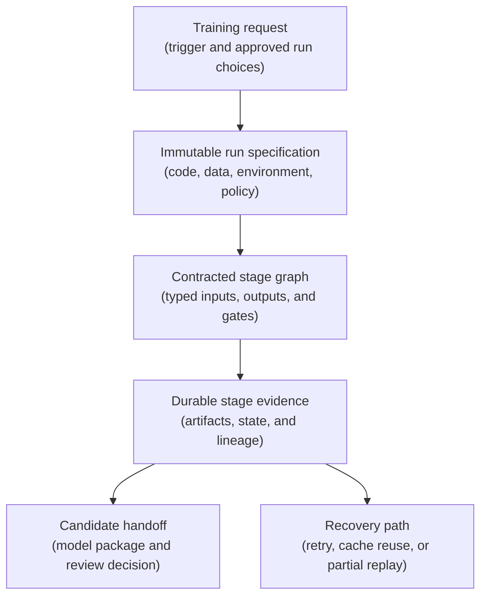
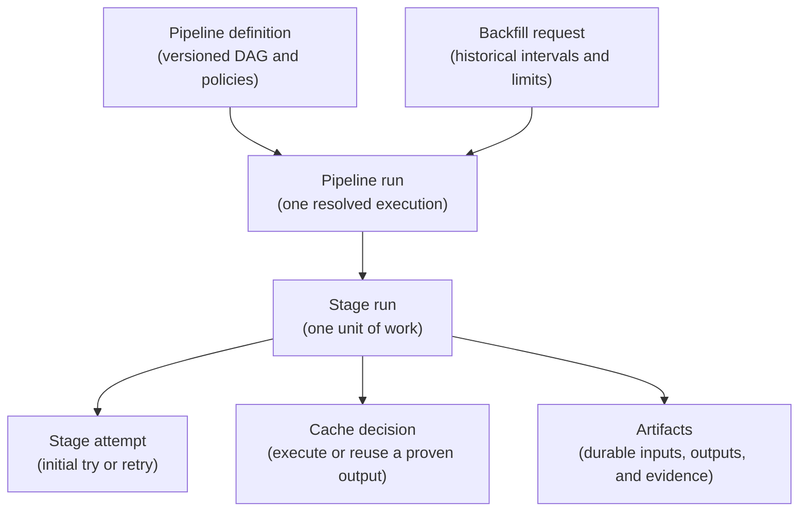
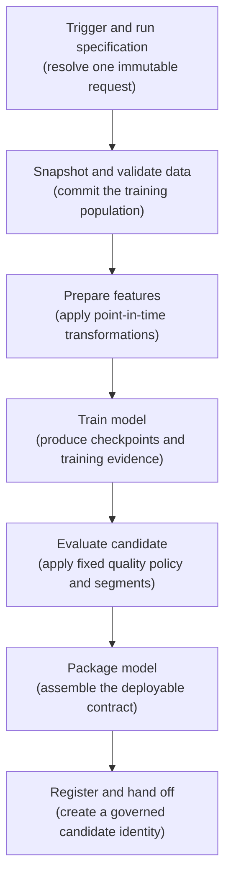
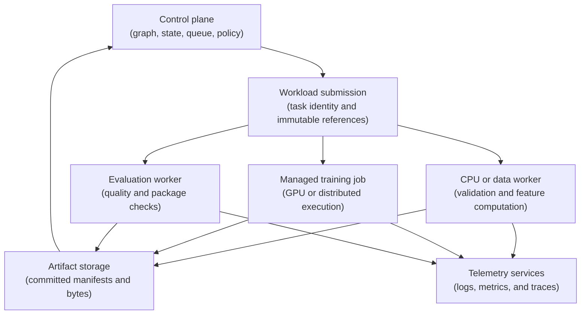
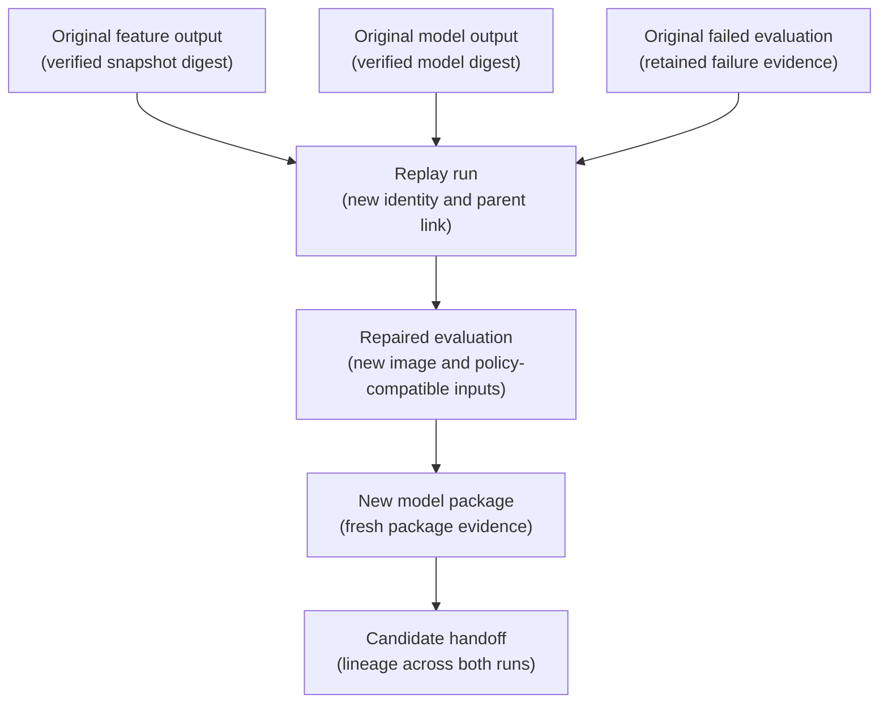
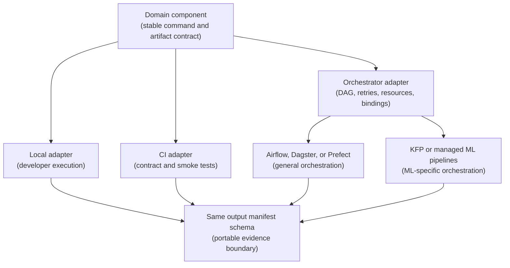

## Table of Contents

1. [A Training Pipeline Makes a Rerun Safe](#a-training-pipeline-makes-a-rerun-safe)
2. [Understand The Parts Of A Training Pipeline](#understand-the-parts-of-a-training-pipeline)
3. [Record Exactly What Each Training Run Uses](#record-exactly-what-each-training-run-uses)
4. [Define The Input And Output Of Every Pipeline Step](#define-the-input-and-output-of-every-pipeline-step)
5. [The Steps In A Repeatable Training Pipeline](#the-steps-in-a-repeatable-training-pipeline)
6. [How The Pipeline Scheduler Runs Each Step](#how-the-pipeline-scheduler-runs-each-step)
7. [Handle Retries, Reused Results, And Repeated Requests Separately](#handle-retries-reused-results-and-repeated-requests-separately)
8. [Rerun Only The Failed Part Of The Pipeline](#rerun-only-the-failed-part-of-the-pipeline)
9. [Rerun The Pipeline For Past Data](#rerun-the-pipeline-for-past-data)
10. [Keep Training Logic Independent Of The Orchestrator](#keep-training-logic-independent-of-the-orchestrator)
11. [Run The Same Pipeline Locally, In CI, And On Managed Compute](#run-the-same-pipeline-locally-in-ci-and-on-managed-compute)
12. [Test How The Pipeline Handles Failures](#test-how-the-pipeline-handles-failures)
13. [Main Idea](#main-idea)
14. [References](#references)

## A Training Pipeline Makes a Rerun Safe
<!-- section-summary: A repeatable training pipeline preserves the exact inputs and stage outputs required to resume work safely after failure. -->

An overnight risk-model workflow spends several hours preparing features and training a candidate. The evaluation worker then loses its network connection while uploading the segment report. The morning operator must decide whether to rerun evaluation, rerun training, or restart the entire workflow. That decision is dangerous if feature preparation reads a mutable `latest` table or several stages write to the same model path. A restart could evaluate a different population or overwrite the trained model that investigators need.

Rerunning one training command does not reproduce a result if the data pointer moved, feature logic changed, or a failed publication left half of the outputs behind. A **training pipeline is a versioned workflow that turns an approved training request into a traceable model candidate.** It connects data resolution, validation, feature preparation, training, evaluation, packaging, and registry handoff. Each step receives identified inputs and publishes identified outputs, while the workflow engine records which work ran, which evidence passed, and where recovery can continue.

Repeatability means more than running the same Python file twice. A reliable rerun uses the same pipeline definition, source code, environment, resolved configuration, data snapshots, and evaluation policy. It creates a fresh execution identity while preserving links to the original attempt. That design lets an operator replay the failed evaluation step while reusing the exact model and feature artifacts already proven by upstream stages.



The graph supplies order. Stage contracts supply meaning. Immutable identities keep both tied to the evidence that produced the candidate.

## Understand The Parts Of A Training Pipeline
<!-- section-summary: Pipeline terminology separates workflow structure, execution units, durable outputs, and the mechanisms used to repeat work. -->

Before reading a pipeline graph, learn the different objects that describe the requested run, each unit of work, and the files passed between them. Those differences determine what the platform can reuse or recover after a failure.

A **pipeline** is the versioned workflow definition plus the rules for running it. One definition can create many pipeline runs. Each run receives concrete inputs and develops its own state.

A **stage**, also called a **task** or **component** by different platforms, is one independently observable unit of work. A useful stage has a focused responsibility and a declared interface. Preparing features, training a model, and evaluating a model are separate stages because each produces a durable result with a different failure policy.

A **DAG** is a directed acyclic graph. Directed means arrows show dependency order. Acyclic means those arrows never loop back to an earlier stage. Iterative optimization can happen inside a training task, while another training attempt receives a new run or a bounded mapped task. The DAG stays inspectable because every stage has a finite route toward completion.

An **artifact** is a durable input or output such as a dataset snapshot, validation report, model checkpoint, evaluation result, or release package. Large artifacts belong in object storage, a lakehouse, or an artifact service. The orchestrator carries their immutable references and metadata through the graph.

Three repetition mechanisms solve different problems:

- **Idempotency** means that processing the same logical stage request several times produces one accepted effect. A retried package stage may upload the same digest again, while candidate registration uses an idempotency key to avoid duplicate registry versions.
- A **retry** is another attempt at the same stage with the same inputs, usually after a transient failure such as lost capacity or a temporary service error.
- A **cache hit** reuses the successful output of an earlier stage execution whose declared fingerprint matches the current request. The task body never runs for that hit.

A **backfill** creates pipeline runs for historical data intervals or partitions. Teams use it after late data, corrected labels, pipeline repairs, or a deliberate historical recomputation. Every interval still receives an independent run identity and evidence trail.



This vocabulary gives operators precise questions. They can ask whether one attempt deserves a retry, whether an output qualifies for cache reuse, or whether the team intends to create a historical backfill.

## Record Exactly What Each Training Run Uses
<!-- section-summary: A resolved run specification freezes the identities that every stage must use and gives duplicate triggers a stable deduplication key. -->

The trigger starts a request. The **run specification** resolves that request into concrete identities before expensive work starts. A schedule might say “train weekly,” and an event might say “labels are ready.” Neither message identifies the exact rows, code, image, or evaluation policy required for a reproducible run.

A production run specification records a unique `run_id` for this execution and a stable `request_id` for the logical trigger. A uniqueness constraint on the request ID prevents two delivered copies of the same event from creating duplicate training runs. A deliberate replay receives a new run ID plus a `parent_run_id` that preserves the relationship.

The specification also pins the pipeline-definition digest. It identifies the code commit and each container image by digest. Data inputs use snapshot or table-version identities. The resolved configuration contains the actual training choices after overrides. The evaluation-policy version freezes metric definitions and guardrails for the run.

```yaml
run:
  run_id: "train-01JQ7R5N6M"
  request_id: "labels-ready-window-184"
  parent_run_id: null
  pipeline_definition_digest: "sha256:8d41..."
  code_commit: "4bf19a7"
  images:
    feature_stage: "sha256:51c2..."
    training_stage: "sha256:9aa4..."
  data:
    source_snapshot: "catalog://risk/events@snapshot-184"
    label_snapshot: "catalog://risk/labels@version-73"
  resolved_config_uri: "s3://ml-runs/train-01JQ7R5N6M/run-config.yaml"
  evaluation_policy: "risk-review-v6"
  trigger:
    type: "data_ready"
    logical_interval: "label-window-184"
```

Human-readable names remain useful for search, yet they cannot carry identity by themselves. A name such as `weekly-risk-training` points at a family of runs. Digests, versions, and run IDs identify one evidence trail within that family.

The submission service marks the run specification read-only after accepting it. A corrected data snapshot, new threshold, or rebuilt image creates another run. This preserves a clean answer to a basic review question: which exact conditions produced the candidate?

## Define The Input And Output Of Every Pipeline Step
<!-- section-summary: A stage contract defines inputs, outputs, execution identity, state, repetition policy, and evidence before orchestration code is written. -->

Drawing arrows between functions creates a workflow shape. A **stage contract** makes that shape operational. It tells the author, orchestrator, and operator what one stage accepts and what a successful execution must publish.

The input contract names types and immutable identities. A feature stage accepts a source snapshot reference and a feature-definition version. A training stage accepts a feature snapshot plus resolved training configuration. Credentials and mutable environment variables stay outside the data contract because they grant access without defining the evidence.

The output contract describes durable artifacts. A URI locates the bytes, and a media or schema type tells the consumer how to read them. A digest verifies content identity. Producer identity links the artifact to its stage attempt, while creation state reveals whether publication finished. A stage writes into an attempt-specific temporary location first. It verifies the output, then publishes a small manifest as the commit point. Downstream tasks consume only committed manifests. A worker crash therefore leaves an abandoned temporary prefix without exposing a half-written dataset as a valid output.

The execution contract pins code and environment. It declares the image digest, command, resource class, timeout, and workload identity. Repetition rules state which failures qualify for automatic retry and which fields build the cache fingerprint. The evidence contract records logs, validation results, runtime metadata, and lineage links.


*The downstream task receives only a committed manifest. Logs and attempt state describe execution, while the validation report records why publication was accepted.*

```yaml
stage:
  name: "prepare_features"
  contract_version: 7
  inputs:
    source_snapshot:
      type: "DatasetSnapshot"
      identity: "catalog://risk/events@snapshot-184"
    feature_definition:
      type: "CodeVersion"
      identity: "feature-set-v11"
  output:
    name: "feature_snapshot"
    type: "DatasetSnapshot"
    commit_rule: "publish_manifest_after_validation"
  execution:
    image_digest: "sha256:51c2..."
    command: ["python", "-m", "training.prepare_features"]
    timeout_minutes: 90
  repetition:
    cache: "allowed_for_matching_fingerprint"
    retry_classes: ["worker_lost", "capacity_unavailable"]
    max_attempts: 3
  evidence:
    required: ["output_digest", "row_count", "schema_digest", "event_time_range"]
```

Stage state also needs one source of truth. Queued and running describe active work. Succeeded, failed, and cancelled describe terminal outcomes. Skipped records an unmet branch condition, while cached records accepted reuse of an earlier output. Attempt state belongs to the orchestrator metadata store. Business evidence belongs in durable artifacts. A dashboard can disappear and rebuild from metadata; the model package and its lineage still survive in governed storage.

## The Steps In A Repeatable Training Pipeline
<!-- section-summary: A production training workflow moves from one resolved request through data, features, training, evaluation, packaging, and governed candidate handoff. -->

Most batch-training systems can start from the same seven-stage framework. The path first freezes the request and training population. It then turns that population into features and a model before applying an independent evaluation policy. Packaging creates the inference boundary, and registration gives the accepted package a governed candidate identity. Teams may combine lightweight steps or split expensive work further, but every boundary should preserve the contracts described above.

Each arrow carries an artifact reference or a small resolved parameter. A successful stage commits its output manifest before downstream work starts. A failed validation or evaluation gate leaves its evidence in place and blocks candidate creation. This arrangement gives the operator a precise recovery boundary: preserve the valid manifests, repair the failed contract or runtime, and create a traceable replay for the affected subgraph.



### Start The Run And Record Its Settings

The trigger proposes a logical request. It may come from a schedule, a data-ready event, a code release, or an authorised manual action. The first stage validates the trigger, deduplicates its request ID, resolves approved defaults, and writes the immutable run specification.

Consider two identical data-ready events delivered seconds apart. The submission service attempts to claim the same `request_id` in a transactional store. One claim creates the run; the other receives the existing run identity. This is idempotency at the pipeline boundary. A human-requested replay uses a distinct request ID and records the original run as its parent.

### Snapshot And Validate The Data

The data stage resolves source partitions and labels into an immutable snapshot manifest. The manifest may point to an Iceberg snapshot, Delta table version, BigQuery table snapshot, warehouse clone, or versioned object-store files. The storage system varies; the contract always names an immutable population.

Validation checks that population before training consumes it. Typical evidence includes schema compatibility, row counts, event-time coverage, label completeness, key uniqueness, and join coverage. Leakage checks verify that features respect the prediction timestamp. A failed freshness check blocks the run because repeating the same check against the same snapshot will produce the same result. A corrected source creates a new snapshot identity and another run.

### Prepare The Features

Feature preparation applies reviewed transformations to the validated population. Its output manifest identifies the feature schema and entity keys. It records the event-time range and row count so reviewers can understand the population. The transformation version and file digests tie that population to the exact computation and bytes. Point-in-time joins need explicit cut-off semantics so historical rows never see future facts.

This stage often deserves caching because feature computation can dominate cost. Cache safety depends on a complete fingerprint. The source snapshot, label snapshot, feature code, image digest, configuration, and engine settings must all participate. A hidden dependency on a mutable lookup table invalidates that promise; the lookup receives its own versioned input identity.

### Train The Model

The training stage consumes the feature snapshot and resolved training configuration. It emits model checkpoints, training metrics, the final raw model, and an environment record. Random-seed policy, distributed topology, accelerator type, library lock, and container digest explain the conditions around the output.

Recovery depends on the framework. A long distributed job may resume from a committed checkpoint. A short tree-model job may start another attempt from the same inputs. Each attempt gets its own logs and runtime state. The final output manifest points to the accepted model digest and records which attempt produced it.

Training cache reuse deserves a stricter policy than feature reuse. A fully deterministic training stage with pinned inputs may qualify. Stochastic or hardware-sensitive training usually creates a new output so the run records observed variation. The organisation's reproducibility claim should decide this policy explicitly.

### Evaluate The Trained Model

Evaluation consumes one exact model digest and one exact evaluation dataset. The policy version defines metrics, thresholds, segments, denominators, and uncertainty rules. The output is a review artifact with both overall and segment-level evidence.

For example, a classifier can clear its overall recall target while failing recall for a low-volume region. The evaluator writes both results and returns a policy-failed state. Retries serve transient compute failures; they cannot repair a genuine guardrail failure. A changed threshold creates a new policy version and another evaluation lineage record.

### Package The Model

Packaging assembles the files required by inference. A complete package may contain weights, preprocessing code, tokenizer or label mappings, input-output signature, dependency lock, loader metadata, and a small test vector. It receives an immutable digest after validation.

The package test loads the artifact in a clean runtime and scores the test vector. This catches missing custom classes and preprocessing dependencies before registry handoff. Security workflows may attach a software bill of materials and scan results to the same package evidence.

### Register The Model For Review

The registration stage creates a governed candidate identity and links it to the pipeline run. It carries the model-package digest, evaluation report, data lineage, code identity, owner, and policy result. An idempotency key built from the package digest plus target registry prevents duplicate candidate versions after a lost response.

Registration records a candidate. Production traffic stays under the release workflow, where approval, deployment configuration, rollout, monitoring, and rollback have their own state. This boundary prevents a successful training job from changing a live endpoint as an incidental side effect.

## How The Pipeline Scheduler Runs Each Step
<!-- section-summary: The control plane owns workflow decisions and state, while workers perform computation and publish durable outputs. -->

Pipeline systems have two architectural roles. The **control plane** stores the graph and run state. It evaluates dependencies, queues ready tasks, applies concurrency limits, decides retries and cache hits, and exposes operational history. The **execution plane** consists of workers that run stage code on local processes, containers, Kubernetes pods, batch services, or managed ML jobs.

Keeping those roles separate prevents the scheduler from turning into a training server. A GPU job may run for hours and produce hundreds of gigabytes. The control plane needs the job ID, state, logs reference, and artifact manifests. Model bytes and datasets travel through governed storage between workers.



Airflow illustrates this split through its scheduler and pluggable executors. Airflow tasks can run locally, on queued workers, or in task-specific containers. Kubeflow Pipelines converts a compiled component graph into Kubernetes workloads. Gemini Enterprise Agent Platform Pipelines runs KFP-compatible graphs as a managed service. SageMaker Pipelines and Azure Machine Learning pipelines submit managed processing and training jobs through provider control planes. Prefect flows and tasks can dispatch work through configured worker infrastructure.

Credentials follow the same boundary. The run specification carries resource identities and locations. The worker receives a short-lived workload identity with the minimum permissions for its stage. Secret values stay in a secret manager or platform connection and remain absent from run manifests, task arguments, and cache keys.

## Handle Retries, Reused Results, And Repeated Requests Separately
<!-- section-summary: Reliable repetition depends on classifying failures, building complete fingerprints, and committing side effects exactly once. -->

Automatic retry is appropriate for failures that may disappear while inputs remain unchanged. Examples include temporary API unavailability, lost workers, capacity shortages, and throttling. Exponential backoff with jitter reduces synchronized retry storms. A maximum attempt count and time budget keep a blocked dependency from consuming capacity forever.

A schema or freshness failure requires an upstream data correction. A failed evaluation guardrail requires model investigation or a reviewed policy change. Invalid configuration and deterministic code errors require a new run definition. Another identical attempt repeats the same result and can hide the real incident. The stage records a terminal failure class so the operator sees whether replay requires new inputs, new code, or only another worker.

Idempotency protects side effects across all attempts. A worker submitting a remote training job writes the returned job ID into durable task state before polling. After a worker crash, the next attempt looks up that ID and resumes observation. It searches by the stage idempotency key before creating a remote job whenever the first submission response may have been lost.

Caching solves a different problem. A cache key should fingerprint the stage contract version, code or component specification, container image, immutable input artifacts, resolved parameters, and relevant policy versions. A cache hit is accepted only after the output manifest still exists and its digest verifies. Freshness checks and mutable external reads usually bypass cache reuse.

Prefect 3 exposes these choices through task retry settings and composable cache policies. The following focused example shares validation results across flow runs because the key includes task source plus declared inputs. A distributed deployment also configures shared result storage so another worker can retrieve the cached reference.

```python
from prefect import flow, task
from prefect.cache_policies import INPUTS, TASK_SOURCE


@task(
    retries=3,
    retry_delay_seconds=[30, 120, 300],
    cache_policy=TASK_SOURCE + INPUTS,
    persist_result=True,
)
def validate_snapshot(
    snapshot_uri: str,
    snapshot_digest: str,
    contract_version: str,
) -> str:
    return validate_and_publish_report(
        snapshot_uri=snapshot_uri,
        snapshot_digest=snapshot_digest,
        contract_version=contract_version,
    )


@flow
def validation_flow(run_spec_uri: str) -> str:
    spec = load_run_spec(run_spec_uri)
    return validate_snapshot(
        spec.snapshot_uri,
        spec.snapshot_digest,
        spec.data_contract_version,
    )
```

The platform feature never discovers hidden dependencies by magic. Imported library code, mutable database reads, undeclared environment variables, or a floating container tag can make a cache key incomplete. Pass those dependencies as versioned inputs or disable reuse for the stage.

Current managed systems implement the same idea through different fingerprints. Kubeflow Pipelines and Gemini Enterprise Agent Platform Pipelines consider component and input identities. SageMaker Pipelines reuses successful step output after matching step-specific attributes within a configured lifetime. Azure Machine Learning reuses deterministic component output after checking code, environment, inputs, parameters, output settings, and run settings. The team still owns the claim that these declared fields fully determine the output.

## Rerun Only The Failed Part Of The Pipeline
<!-- section-summary: A partial replay creates a new traceable run while reusing verified upstream artifacts and rerunning only invalid or failed work. -->

Suppose feature preparation and training succeed, then evaluation fails because its container lacks a required metrics package. The repaired pipeline definition changes the evaluation image. Recomputing the feature snapshot and model would add cost and could introduce unrelated variation.

A safe partial replay creates a new run ID and links it to the failed run. It imports the committed feature and model manifests as upstream artifacts. Their digests are verified, and the new lineage records the source run that produced them. Evaluation executes with the repaired image, followed by packaging and candidate registration.



The reuse decision occurs per stage. A changed feature definition invalidates feature preparation and every downstream output. A changed evaluation implementation leaves the model eligible for reuse. A changed dataset invalidates feature preparation and training. The system computes the affected subgraph from artifact dependencies and explicit compatibility rules.

Partial replay also helps after infrastructure interruption. SageMaker Pipelines supports retrying from a failed step, while other managed and open orchestrators expose repair, selective execution, task clearing, or cache-driven reuse. Product controls vary, so the pipeline's own lineage must record which previous execution supplied each reused artifact.


*The replay keeps the failed evaluation as evidence, creates a new run with a parent link, and recomputes only the repaired downstream path.*

## Rerun The Pipeline For Past Data
<!-- section-summary: Backfills apply one declared pipeline policy across historical data intervals while controlling identity, concurrency, and release side effects. -->

A backfill is a batch of runs over past logical intervals. One common case appears after a label pipeline repairs several historical partitions. Another appears after the feature team fixes a transformation and needs comparable model evidence across earlier windows.

The backfill request names its interval range, reprocessing policy, pipeline-definition version, code version, evaluation policy, concurrency cap, and owner. Every interval produces a separate run specification. This keeps a failed interval isolated and gives each model a precise data boundary.

There are two valid historical questions. A **reproduction backfill** asks what the original pipeline would have produced, so it pins the historical definition and dependencies. A **recomputation backfill** asks what the corrected pipeline produces on old data, so it pins the new definition and links results to the superseded runs. Mixing these purposes makes comparisons difficult to interpret.

Backfills need stricter operational controls because they multiply load. Limit active runs, training jobs, warehouse queries, and registry writes. Run a small interval first and estimate artifact growth. Candidate registration is commonly disabled until review because a historical batch can create dozens of technically valid models with no release purpose.

Airflow models a backfill as runs across historical logical dates and provides reprocessing plus concurrency controls. Partition-aware data orchestrators express the same concept through asset partitions. Managed ML pipelines can receive a sequence of historical run parameters from a bounded controller. In every case, the pipeline contract owns interval identity and lineage.

## Keep Training Logic Independent Of The Orchestrator
<!-- section-summary: Portable stage components keep domain logic behind stable command and artifact interfaces while thin adapters express platform control flow. -->

An orchestrator should coordinate the training program. Domain logic remains inside versioned stage components with ordinary entrypoints. A feature component reads a snapshot manifest and writes a feature manifest. A training component reads that feature manifest plus configuration and writes a model manifest. Each can run from a shell, a unit test, or a managed worker.

The platform adapter stays thin. It declares dependencies, task resources, timeouts, retry policy, cache settings, and artifact bindings. Airflow can express the graph as tasks in a Dag. Dagster can model durable datasets and models as assets. Prefect can wrap the same entrypoints as tasks. KFP and managed ML systems can package them as typed components.

This separation prevents orchestration metadata from leaking into model code. The trainer never needs to query the scheduler for an upstream task's output path. It receives a manifest URI through its interface. The evaluator never discovers the “latest” model from a registry. It receives the exact model digest selected by the run specification.



Portability has limits. Identity systems, artifact metadata, cache rules, conditional syntax, and repair controls differ among platforms. The goal is portable stage semantics and evidence, which keeps migration or coexistence bounded. Recreating every orchestration feature behind a custom abstraction would add another platform to operate.

## Run The Same Pipeline Locally, In CI, And On Managed Compute
<!-- section-summary: Environment parity comes from shared component code and artifact contracts, with progressively stronger infrastructure tests in local, CI, and managed execution. -->

Local execution gives developers a short feedback loop. A stage runs against a small immutable fixture and writes the same manifest schema used in production. Container execution is valuable for dependency-sensitive components. A local object-store emulator can exercise URI handling, while pure transformations can use a temporary directory through the same storage interface.

CI tests the contract boundary. Unit tests cover transformation and metric logic. Contract tests reject missing manifest fields, wrong schema versions, unpinned images, and digest mismatches. The pipeline definition compiles or loads, graph tests verify expected dependencies, and a small end-to-end run proves that one stage can consume another stage's committed output.

Managed integration tests exercise the controls unavailable on a laptop. They verify workload identity, network access, remote artifact storage, resource requests, cancellation, retry classification, and telemetry. A tiny training fixture is enough. The test proves the execution boundary; model-quality assessment happens in the evaluation workflow.

Parity means that the same code and contract move through all three environments. Infrastructure naturally changes. Kubeflow Pipelines local execution, for example, omits production caching, retry, resource, and authentication behaviour. Those differences belong in remote integration tests and recovery drills.

Promoting one tested container digest through CI and production gives stronger evidence than rebuilding an image per environment. Environment-specific values such as bucket roots and workload identities arrive through deployment configuration. Training choices remain in the resolved run specification.

## Test How The Pipeline Handles Failures
<!-- section-summary: Pipeline tests should prove duplicate-trigger handling, stage isolation, cache validity, failure recovery, lineage, and bounded historical execution. -->

A pipeline can pass a happy-path smoke run and still fail during the first incident. Operational tests target the promises that make reruns safe.

Send the same trigger twice and confirm that both responses resolve to one logical run. Kill a worker after it submits a remote job, then verify that the next attempt resumes observation through durable job state. Interrupt artifact publication before the manifest commit and confirm that downstream stages ignore the temporary output.

Change one input digest and verify that the cache misses for the affected stage. Corrupt a cached artifact and confirm that digest verification forces execution. Repair an evaluation image and perform a partial replay that reuses the original model. The lineage view should show the reused model's source run and the new evaluator attempt.

Exercise a small backfill under its concurrency cap. Confirm that historical runs cannot flood accelerator quota or create registry candidates without review. Restore the orchestrator metadata store and artifact manifests in a recovery environment, then trace a candidate back through package, evaluation, model, features, and source data.

These tests turn repeatability into an observable engineering property. Operators gain evidence for the exact recovery choices they will face under time pressure.

## Main Idea
<!-- section-summary: Repeatable training comes from immutable run identity, explicit stage contracts, durable artifacts, and controlled repetition across the whole graph. -->

A production training pipeline is a versioned graph of contracts. The run specification freezes code, environment, data, configuration, and evaluation policy. Each stage consumes immutable references, publishes a committed artifact manifest, records evidence, and declares its repetition semantics.

The control plane coordinates state and worker execution. Retry handles eligible transient failures. Idempotency prevents duplicate effects. Caching reuses a proven output under a complete fingerprint. Partial replay creates a new lineage-aware run from valid upstream evidence, while backfills create bounded runs across historical intervals.


*The run specification and stage contracts create the main path. Retry, cache, replay, and backfill remain separate recovery choices with different identities.*

This structure works across Airflow, Dagster, Prefect, Kubeflow Pipelines, and managed ML pipeline services. Product syntax changes. The durable design remains the same: one identified request, one inspectable graph, explicit stage boundaries, and enough evidence to recover safely.

## References

- [Apache Airflow: Architecture overview](https://airflow.apache.org/docs/apache-airflow/stable/core-concepts/overview.html)
- [Apache Airflow: Dags](https://airflow.apache.org/docs/apache-airflow/stable/core-concepts/dags.html)
- [Apache Airflow: Executors](https://airflow.apache.org/docs/apache-airflow/stable/core-concepts/executor/index.html)
- [Apache Airflow: Task and Asset State Store](https://airflow.apache.org/docs/apache-airflow/stable/core-concepts/task-and-asset-state-store.html)
- [Apache Airflow: Backfill](https://airflow.apache.org/docs/apache-airflow/stable/core-concepts/backfill.html)
- [Prefect: Task caching](https://docs.prefect.io/v3/concepts/caching)
- [Prefect: Task API](https://docs.prefect.io/v3/api-ref/python/prefect-tasks)
- [Prefect: Result persistence](https://docs.prefect.io/v3/advanced/results)
- [Kubeflow Pipelines: Pipeline concepts](https://www.kubeflow.org/docs/components/pipelines/concepts/pipeline/)
- [Kubeflow Pipelines: Component specification](https://www.kubeflow.org/docs/components/pipelines/reference/component-spec/)
- [Kubeflow Pipelines: Pipeline roots](https://www.kubeflow.org/docs/components/pipelines/concepts/pipeline-root/)
- [Kubeflow Pipelines: Local execution](https://www.kubeflow.org/docs/components/pipelines/user-guides/core-functions/execute-kfp-pipelines-locally/)
- [Amazon SageMaker AI: Pipeline step caching](https://docs.aws.amazon.com/sagemaker/latest/dg/pipelines-caching.html)
- [Amazon SageMaker AI: Pipeline retry policies](https://docs.aws.amazon.com/sagemaker/latest/dg/pipelines-retry-policy.html)
- [Google Cloud: Visualize and analyze Agent Platform pipeline results](https://docs.cloud.google.com/gemini-enterprise-agent-platform/machine-learning/pipelines/visualize-pipeline)
- [Azure Machine Learning: Component concepts](https://learn.microsoft.com/en-us/azure/machine-learning/concept-component?view=azureml-api-2)
- [Azure Machine Learning: Pipeline output reuse](https://learn.microsoft.com/en-us/azure/machine-learning/how-to-debug-pipeline-reuse-issues?view=azureml-api-2)
