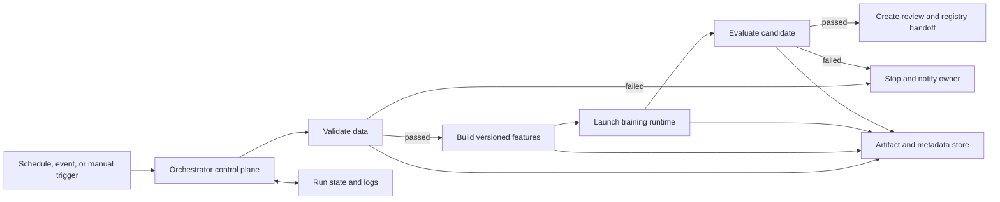
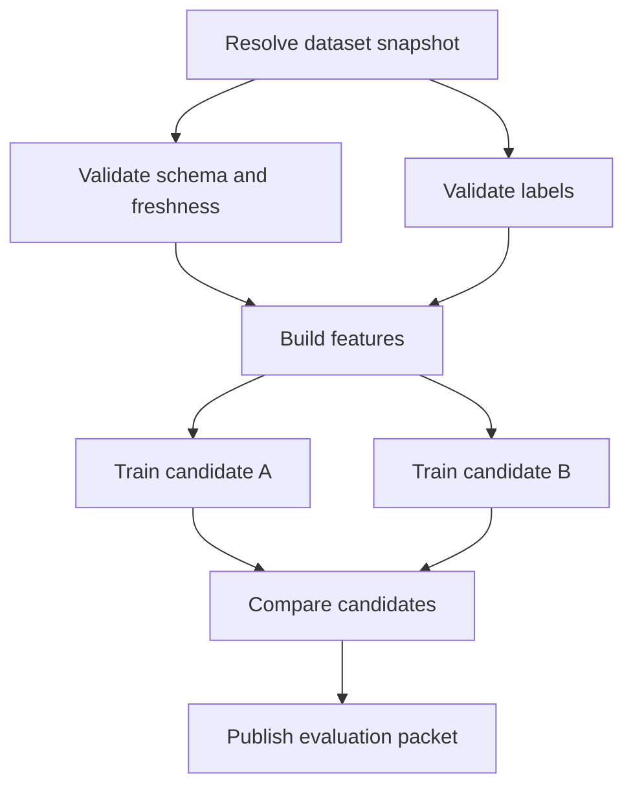

## Training Orchestration Coordinates the Whole Run
<!-- section-summary: A training orchestrator coordinates dependencies, run state, compute, retries, artifacts, and handoff across a multi-step workflow. -->

**Training orchestration** is the control system that moves a training workflow from one step to the next. A training script fits a model. A pipeline defines stages such as data validation, feature building, training, and evaluation. The orchestrator creates a run, schedules those stages in the correct order, tracks their state, launches the required compute, and records what happened.

The distinction matters when a workflow leaves one developer's machine. A scheduled run may wait for a warehouse partition, launch a CPU validation task, submit a GPU training job, retry a network failure, stop after a data-quality failure, and hand an approved model to a registry. Different workers can execute each stage, and the original process may disappear before the run finishes.



The diagram separates the **control plane** from the **workload plane**. The orchestrator's scheduler, API, metadata database, and user interface form the control plane. Containers, warehouse queries, Spark jobs, Kubernetes Pods, and managed training jobs perform the workload. The orchestrator records where the work runs; it does not need to move large datasets through its own process.

This framework is more useful than starting with a product comparison. Airflow, Prefect, Dagster, Kubeflow Pipelines, Argo Workflows, and managed cloud platforms emphasize different authoring and execution styles. All of them still need answers for dependencies, state, inputs, compute, failure, artifacts, identity, and operations.

## The Workflow Graph Defines Dependencies
<!-- section-summary: A workflow graph describes which tasks depend on which outputs and therefore which work can run, wait, branch, or run in parallel. -->

Most training pipelines form a **directed acyclic graph**, usually shortened to **DAG**. A node represents a task or component. A directed edge says that one node depends on another. Acyclic means the graph has no path that loops back to an earlier node inside the same run.

The graph describes dependency rather than a script's line-by-line execution. Feature statistics and label checks can run in parallel after the dataset snapshot is ready. Training waits for both. Evaluation waits for the model and test data. The orchestrator schedules each node as soon as its dependencies and resource rules allow.



The graph is only one part of orchestration. A diagram can show that training waits for features, while it cannot decide whether a failed feature task should retry, which image it should use, or where its output lives. Those details belong to task contracts and run policy.

A training pipeline may contain loops at a higher level. Hyperparameter optimization launches many trial tasks and collects their results. A weekly schedule creates a new DAG run. A failed model can lead the team back to code or data work. The individual orchestrated run can still use an acyclic dependency graph.

## A Task Contract Makes Handoffs Explicit
<!-- section-summary: Each task needs versioned inputs, outputs, runtime, resources, retry policy, and ownership so another worker can execute it safely. -->

A task needs a clear **contract**. The contract tells the orchestrator and the next task what enters, what leaves, which runtime performs the work, and how failure should be handled. Without it, tasks share hidden local files, environment variables, or in-memory objects that disappear when workers change.

The following contract is representative rather than tied to one orchestrator:

```yaml
task: train_eta_model
inputs:
  dataset_manifest: s3://clearclaim-ml/runs/run-418/dataset.json
  feature_schema: restaurant-eta-v7
  training_config: configs/eta-xgb-v12.yaml
runtime:
  image: ghcr.io/clearclaim/train@sha256:8d5a4f7c
  command: ["python", "-m", "training.run"]
resources:
  cpu: 8
  memory: 32Gi
outputs:
  model: s3://clearclaim-ml/runs/run-418/model/
  metrics: s3://clearclaim-ml/runs/run-418/metrics.json
retry:
  attempts: 2
  retry_on: ["worker_lost", "object_store_timeout"]
owner: eta-ml-team
```

The manifest uses stable storage paths because the next task may run on another machine. The image digest pins the environment. The config path identifies the training choices. Resource requests help the scheduler place the workload. The retry policy names failure classes that are safe to repeat. The owner gives the operations team a clear escalation target.

Real tools express these fields differently. Airflow tasks may launch containers or provider jobs. Prefect flows and tasks wrap Python functions and deployments. Kubeflow components compile into pipeline specifications that execute on Kubernetes-backed infrastructure. Managed platforms may store job definitions through an API. The concepts stay the same across those syntaxes.

Large values should pass through object storage, a warehouse, a lakehouse, or another durable data system. Orchestrator metadata channels fit small references and status. Sending a model file or a large DataFrame through the control-plane database can overload the scheduler and make recovery expensive.

## Run State Tells Operators What Is Happening
<!-- section-summary: The orchestrator records the state and attempt history of every run and task so workers and operators can coordinate. -->

A **pipeline definition** describes possible work. A **pipeline run** is one execution of that definition with specific inputs. Every task instance inside the run moves through states such as queued, running, succeeded, failed, skipped, cancelled, or waiting.

The orchestrator persists those states in its metadata system. A worker claims runnable work, reports heartbeats and results, and may disappear. The scheduler can then classify the task, retry it under policy, or mark it for human attention. This persisted state lets the run outlive one worker.

State also needs version context. A useful run page should show the pipeline version, trigger, parameters, dataset identity, task image, resource request, worker or external job ID, timestamps, attempts, logs, outputs, and final handoff. Otherwise, a green graph confirms completion without proving what completed.

Different systems expose state through different terms. Airflow stores DAG and task state in its metadata database and uses a scheduler plus executors or workers. Prefect tracks a flow run lifecycle and task states through its server, with workers polling work pools for deployments. Kubeflow Pipelines records pipeline runs and component execution around containerized tasks. A learner should recognize the shared lifecycle underneath the product vocabulary.

## Retry, Resume, Cache, and Backfill Solve Different Problems
<!-- section-summary: Retry, resume, caching, and backfill each repeat work for a different reason and need different safety rules. -->

These four operations can all cause a task to run again, yet they solve different problems.

A **retry** repeats a failed task under a bounded policy. A temporary object-store timeout may justify a retry. Invalid schema, missing labels, and a deterministic code error need correction before another attempt. Classifying failures prevents a pipeline from spending hours repeating work that cannot succeed.

A **resume** continues a partially completed run after infrastructure interruption or an operator action. The orchestrator preserves successful upstream tasks and schedules only the remaining work when the platform supports that path. External systems still need stable operation identities if a task may have committed an effect before its state update was lost.

A **cache hit** reuses an earlier output because the task inputs and implementation identity match a previous execution. Cache keys should include every input that can change the output: data version, code or image digest, configuration, dependency versions where relevant, and task parameters. A weak cache key can silently attach a model to the wrong dataset.

A **backfill** creates runs for historical time intervals or partitions. Airflow's data interval is important here because a run processes a defined slice of data rather than simply "the data available now." Backfills require capacity controls, versioned logic, and output isolation so historical work does not overwhelm current production runs or overwrite newer artifacts.

| Operation | Why work repeats | Safety requirement |
|---|---|---|
| Retry | One attempt failed | Failure class is retryable and side effects are idempotent |
| Resume | The run was interrupted | Completed state and ambiguous effects are reconciled |
| Cache | Identical work already produced a valid output | Cache identity includes every material input |
| Backfill | Historical intervals need processing | Interval, code version, capacity, and output paths stay explicit |

Training tasks often write immutable outputs under the run ID. This makes retries and comparisons safer. A separate promotion step can update a registry alias or approved pointer after evaluation. Writing every candidate directly to `models/latest/` would mix execution with release authority and make concurrent runs overwrite one another.

## Artifact Handoff Connects Orchestration to MLOps
<!-- section-summary: Each task produces durable artifacts and metadata that the next task, reviewer, registry, and incident responder can identify. -->

The orchestrator knows that a task succeeded. MLOps needs to know what the task produced. A training task should write a model artifact, metrics, logs, environment identity, and a manifest that connects them to the dataset, code, and configuration.

The evaluation task consumes those exact outputs and creates a versioned report. A registry handoff receives the model URI, signature, input example, evaluation report, lineage, and approval status. The orchestrator records references to these artifacts instead of treating task completion as proof that a model is ready.

This design creates a clean ownership boundary. The orchestrator owns execution state. Object storage or a lakehouse owns large artifacts. An experiment tracker owns run-level ML metadata. A model registry owns reviewed model versions and lifecycle controls. An observability platform owns operational signals. Products can combine some of these roles, but the architecture should still say which system is authoritative for each record.

Artifact checks belong at the handoff. The next task can verify that a manifest exists, checksums match, the model signature is present, and required metrics have valid values. A successful process exit with a missing report should fail the pipeline because the declared output contract was not satisfied.

## Four Orchestration Styles
<!-- section-summary: Tool selection depends on workflow shape, execution environment, platform ownership, and the operational model the team can support. -->

### Data-centric schedulers

Apache Airflow represents workflows as DAGs of tasks and has a mature scheduling, backfill, dependency, and provider ecosystem. It fits organizations that already coordinate warehouse, data engineering, and ML work through shared scheduled workflows. Airflow 3 separates components such as the scheduler, DAG processor, API server, metadata database, and optional workers, which matters for deployment and security design.

Airflow works well when interval-based processing and broad system integration are central. Teams need platform ownership for the metadata database, workers or executors, DAG deployment, upgrades, secrets, and capacity. Long-running GPU training can run as an external Kubernetes or managed ML job while Airflow tracks the job rather than holding the computation inside a scheduler process.

### Python-native flows and assets

Prefect lets developers define flows and tasks around Python functions, then attach deployments, schedules, workers, work pools, retries, and state tracking. Dagster centers strongly on software-defined assets, their dependencies, partitions, materializations, and lineage. These styles fit teams that want local Python development and close integration between ML code and orchestration concepts.

The convenience of Python authoring does not remove production boundaries. Tasks still need durable outputs, pinned environments, remote execution, concurrency controls, secrets, and deployment discipline. Passing a local object between functions during development should eventually turn into a stable artifact or data reference when tasks run on separate workers.

### Kubernetes-native pipelines

Kubeflow Pipelines defines reusable components and pipelines that execute containerized work in a Kubernetes-oriented environment. Argo Workflows offers a broader Kubernetes-native workflow engine. These systems fit teams that already operate Kubernetes, need per-step container isolation, and want direct access to cluster scheduling, secrets, volumes, node pools, and accelerator resources.

The tradeoff is platform complexity. The team owns Kubernetes capacity, upgrades, identity, storage integration, observability, queueing, and workload security. A Kubernetes-native orchestrator solves workflow control; it does not automatically create a usable internal ML platform.

### Managed cloud and lakehouse workflows

SageMaker Pipelines, Vertex AI Pipelines, Azure Machine Learning pipelines, and Databricks Workflows or Lakeflow Jobs integrate orchestration with their platform's compute, data, identity, tracking, and registry services. They can reduce control-plane operations and give teams a supported path through one provider.

The main design question is how much of the workflow already lives in that ecosystem. A managed orchestrator can simplify identity and artifact handoff when training, data, and deployment share the platform. Cross-cloud dependencies, custom runtimes, portability requirements, or an existing enterprise scheduler may favour another control plane.

## Choose From Responsibilities, Not Feature Lists
<!-- section-summary: A useful selection compares workflow shape, execution targets, operations, tenancy, lineage, and team ownership against real requirements. -->

Start with the workflow and failure model. Write down how runs start, which systems they call, which tasks need GPUs, how data partitions work, how backfills behave, where artifacts live, and who responds at 02:00. Then evaluate products against those requirements.

| Decision area | Questions to ask |
|---|---|
| Workflow shape | Scheduled intervals, events, assets, dynamic fan-out, or mostly fixed DAGs? |
| Execution | Local processes, containers, Kubernetes, Spark, managed training jobs, or several targets? |
| Data semantics | Are partitions, assets, and backfills first-class requirements? |
| ML metadata | How will runs connect to datasets, experiments, evaluation, and registries? |
| Operations | Who runs the control plane, upgrades it, backs it up, and handles scheduler incidents? |
| Security | How are author, operator, worker, and workload identities separated? |
| Scale and tenancy | How are queues, quotas, priorities, and team boundaries enforced? |
| Portability | Which provider-specific integrations are acceptable? |

A proof of concept should exercise a real failure rather than only a successful demo. Kill a worker during training, retry an object-store timeout, block on a failed schema check, rerun one partition, inspect task logs, and verify that the final model links to the exact inputs. The result shows how the platform behaves under the conditions the team will actually operate.

## Operate the Orchestrator as a Production Service
<!-- section-summary: The orchestration control plane needs reliability, security, capacity, observability, and runbooks because every training workflow depends on it. -->

The orchestrator itself needs monitoring. Teams watch scheduler heartbeat, queue age, task start delay, worker capacity, metadata database health, API errors, stuck states, and failure rates by task. A healthy training cluster cannot compensate for a scheduler that stopped creating runs.

Security boundaries need attention because workflow definitions often execute code and reach sensitive data. Separate platform administrators, workflow authors, operators, and workload identities where the product supports it. Use secret managers and workload identity rather than embedding credentials in DAG files or task parameters. Restrict the control-plane database and preserve audit logs for manual retries, cancellations, and parameter changes.

Capacity policy prevents one experiment from starving production pipelines. Queues, pools, concurrency limits, priorities, namespaces, and cluster quotas can divide resources. GPU tasks may wait in an admission queue while data checks continue on CPU workers. The orchestrator should show this as a waiting or queued state rather than a mysterious delay.

A basic incident runbook asks four questions. Is the control plane scheduling work? Is a worker or external compute target available? Did the task fail because of its inputs or runtime? Are any external effects ambiguous? The operator then retries only safe failures, reconciles uncertain outputs, and records the reason for any manual override.

## How the Pieces Work Together
<!-- section-summary: Training orchestration combines a dependency graph, explicit task contracts, persisted run state, safe repetition, artifact handoff, and an operated control plane. -->

Training orchestration gives a multi-step ML workflow a durable control layer. The graph describes dependencies. Task contracts name inputs, outputs, runtime, resources, and failure policy. Persisted state coordinates workers and gives operators an accurate view. Retry, resume, cache, and backfill repeat work under different rules. Artifact handoff connects execution to experiment tracking, evaluation, registries, and release.

Tool choice follows the surrounding system. Airflow fits many data-centric scheduled workflows. Prefect and Dagster offer Python-native flow or asset models. Kubeflow Pipelines and Argo fit Kubernetes-oriented execution. Managed platforms reduce control-plane work inside their ecosystems. The right option is the one whose operating model and failure behaviour match the team's real workflow.

## References

- [Apache Airflow: Architecture overview](https://airflow.apache.org/docs/apache-airflow/stable/core-concepts/overview.html)
- [Apache Airflow: Best practices](https://airflow.apache.org/docs/apache-airflow/stable/best-practices.html)
- [Prefect: Flows](https://docs.prefect.io/v3/concepts/flows)
- [Prefect: Deployments](https://docs.prefect.io/v3/deploy/index)
- [Dagster: Concepts](https://docs.dagster.io/getting-started/concepts)
- [Kubeflow Pipelines: Overview](https://www.kubeflow.org/docs/components/pipelines/overview/)
- [Argo Workflows: Concepts](https://argo-workflows.readthedocs.io/en/latest/workflow-concepts/)
- [MLflow: Tracking](https://mlflow.org/docs/latest/ml/tracking/)
