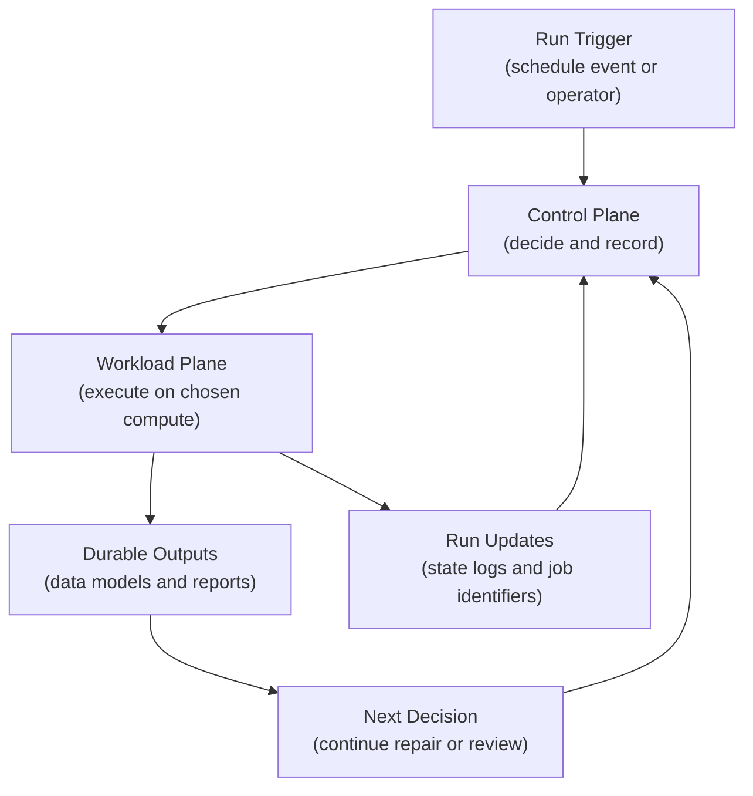
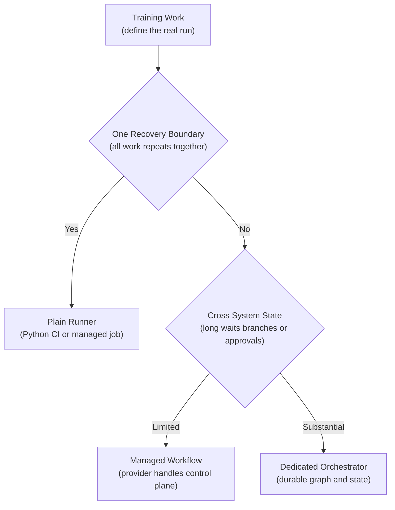
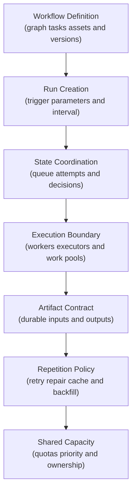
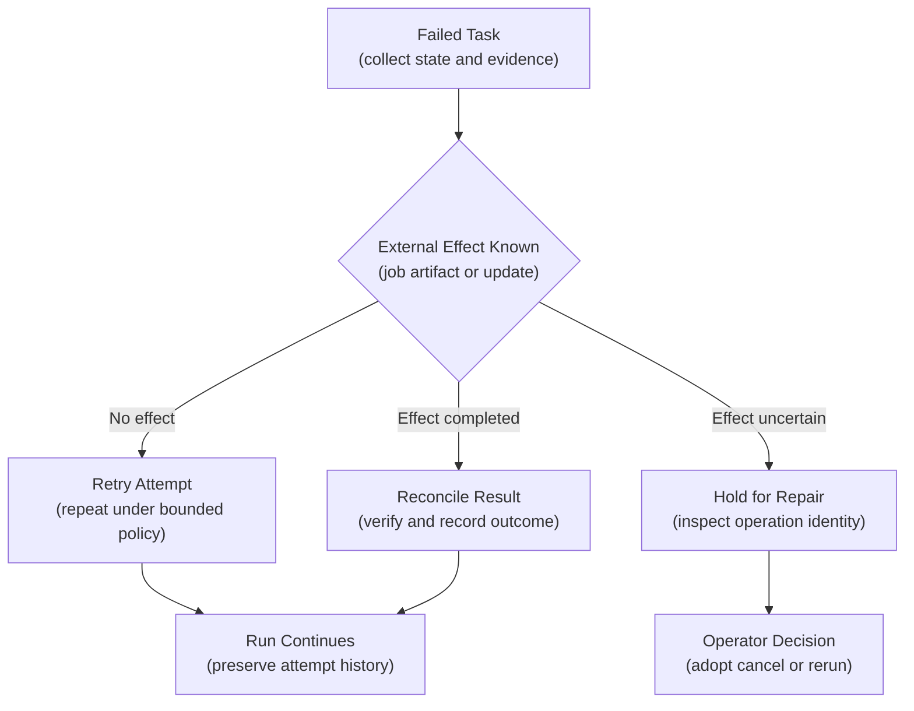
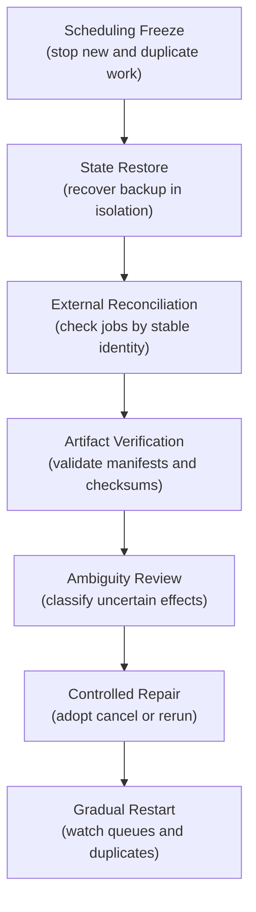
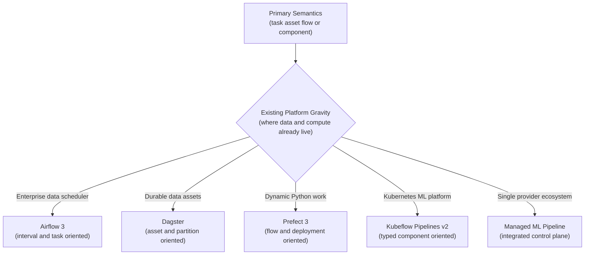
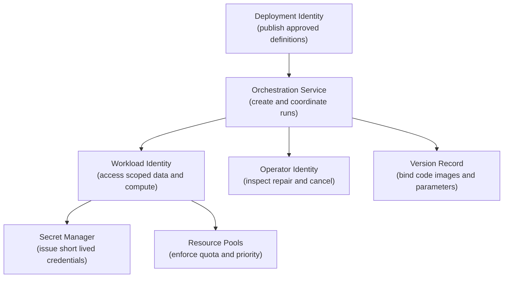
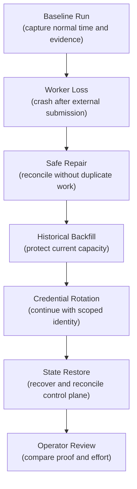

## Table of Contents

1. [How To Coordinate A Multi-Step Training Workflow](#how-to-coordinate-a-multi-step-training-workflow)
2. [Choose The Simplest Way To Coordinate Training](#choose-the-simplest-way-to-coordinate-training)
3. [The Seven Jobs Of A Training Orchestrator](#the-seven-jobs-of-a-training-orchestrator)
4. [Recover Failed Work Without Duplicating It](#recover-failed-work-without-duplicating-it)
5. [Protect The Database That Records Workflow Progress](#protect-the-database-that-records-workflow-progress)
6. [Choose The Orchestrator That Fits The Workflow](#choose-the-orchestrator-that-fits-the-workflow)
7. [Protect Credentials, Compute Capacity, And Workflow Versions](#protect-credentials-compute-capacity-and-workflow-versions)
8. [Test The Orchestrator With Failure Drills](#test-the-orchestrator-with-failure-drills)
9. [Main Idea](#main-idea)
10. [References](#references)

## How To Coordinate A Multi-Step Training Workflow
<!-- section-summary: A training orchestrator coordinates dependencies, workers, run state, and recovery across work that may continue after the original process exits. -->

A training workflow may validate data in a warehouse, launch a GPU job elsewhere, and publish artifacts only after evaluation passes. No single worker sees the whole journey. A **training orchestrator** is the control system that decides which step may start, asks the appropriate compute system to perform the work, records progress, and chooses the next action after success or failure.

That role is broader than scheduling. A scheduler can start a script every night. An orchestrator follows the run after it starts. It blocks training until validation succeeds and then submits work to the appropriate compute service. Evaluation receives the exact model produced by that job. A failure leads to a retry, repair, or human review according to policy.

Consider a common production workflow. A new warehouse partition arrives and two data checks run on CPU workers. A managed training job then runs for several hours. Evaluation compares its candidate with the production model. The process that submitted the training job might restart halfway through. The GPU job can continue, so the control layer needs a durable record of the external job identifier and the expected output. Without that record, an automatic retry could launch a second expensive job while the first one is still running.

```mermaid
flowchart TD
    A["Run Trigger<br/>(schedule event or operator)"] --> B["Control Plane<br/>(decide and record)"]
    B --> C["Workload Plane<br/>(execute on chosen compute)"]
    C --> D["Durable Outputs<br/>(data models and reports)"]
    C --> E["Run Updates<br/>(state logs and job identifiers)"]
    E --> B
    D --> F["Next Decision<br/>(continue repair or review)"]
    F --> B
```

This gives an ML platform two distinct areas of responsibility. The **control plane** contains the workflow definitions, scheduler, API, run-state database, and operator interface. The **workload plane** contains the Python processes, containers, Spark applications, Kubernetes Pods, warehouse queries, and managed training jobs that do the computation.

Large datasets and model files live in durable systems such as object storage, a warehouse, a lakehouse, or a model registry. The orchestrator keeps references, status, and small metadata. This boundary keeps the control plane responsive and allows another worker to continue the run after an earlier worker disappears.

## Choose The Simplest Way To Coordinate Training
<!-- section-summary: Ordinary Python or a managed training job is often sufficient until a workflow gains independent stages, long waits, partial recovery, or historical reprocessing. -->

An orchestrator adds value after the workflow develops orchestration problems. Many teams can begin with ordinary Python. A single program can load one prepared dataset, train one model, evaluate it, and write the outputs. The operating boundary is clear: one process succeeds or fails as a unit.

A managed training job is another sensible starting point. The platform accepts a container, input locations, resource requirements, and an output location. A CI workflow, cloud scheduler, or small service submits the job and checks its final state. This arrangement often covers periodic training with one main compute stage and a modest amount of preparation.

The need for a dedicated orchestrator grows as the workflow develops several independent recovery boundaries. Parallel checks and different compute systems create work that can fail separately. Long waits, human approval, and historical backfills require durable state. Shared quotas and selective reruns add coordination that a single process cannot preserve reliably.

```mermaid
flowchart TD
    A["Training Work<br/>(define the real run)"] --> B{"One Recovery Boundary<br/>(all work repeats together)"}
    B -->|Yes| C["Plain Runner<br/>(Python CI or managed job)"]
    B -->|No| D{"Cross System State<br/>(long waits branches or approvals)"}
    D -->|Limited| E["Managed Workflow<br/>(provider handles control plane)"]
    D -->|Substantial| F["Dedicated Orchestrator<br/>(durable graph and state)"]
```

Suppose data preparation already runs as a reliable warehouse transformation and training is one managed job. Adding a self-hosted workflow platform could create more backups, upgrades, alerts, and credentials than the run requires. A provider pipeline or a scheduled submission may be enough.

Now add a label-quality gate, two training routes, an evaluation branch, a delayed compliance approval, and monthly reprocessing of historical partitions. These stages fail and recover independently. A durable graph gives operators a precise place to inspect the run and restart the affected work.

The decision therefore starts with workflow shape and failure boundaries. Product familiarity matters later, after the team can explain which state must survive and which work must repeat.

## The Seven Jobs Of A Training Orchestrator
<!-- section-summary: Production orchestration combines a graph, execution boundary, triggers, persisted state, artifact contracts, repetition policy, and shared capacity controls. -->

Every orchestration product must satisfy the same architectural responsibilities, even if it uses different terminology. Responsibility-level vocabulary gives the team a stable basis for comparison and exposes weak recovery boundaries that a familiar user interface or programming language might hide.

The responsibilities form a chain. A trigger creates a run from a versioned definition. Persisted state records each decision, while the execution layer sends work to the appropriate compute. Durable artifact references feed the next decision. Repetition and capacity policies constrain what the control plane may do during recovery and periods of high demand.

```mermaid
flowchart TD
    A["Workflow Definition<br/>(graph tasks assets and versions)"] --> B["Run Creation<br/>(trigger parameters and interval)"]
    B --> C["State Coordination<br/>(queue attempts and decisions)"]
    C --> D["Execution Boundary<br/>(workers executors and work pools)"]
    D --> E["Artifact Contract<br/>(durable inputs and outputs)"]
    E --> F["Repetition Policy<br/>(retry repair cache and backfill)"]
    F --> G["Shared Capacity<br/>(quotas priority and ownership)"]
```

### 1. Define The Steps And Their Order

A workflow definition explains the steps and their dependencies. The usual term is a **directed acyclic graph**, or **DAG**. A node represents a unit of work, and an edge says that one unit depends on another. “Acyclic” means one run has no dependency path that circles back to an earlier node.

The node vocabulary reveals what a platform emphasizes. A **task** usually represents an action such as validating a dataset or submitting a training job. A **component** packages a reusable action with declared inputs, outputs, runtime, and parameters. An **asset** represents a durable result such as a feature table, model, or evaluation report, plus the computation that materializes it.

These are related abstractions, yet they lead to different operator questions. A task-oriented system asks, “Did this action complete?” An asset-oriented system also asks, “Which partition of this durable result exists, and which upstream materializations produced it?” A component-oriented ML pipeline pays close attention to portable container interfaces and typed artifacts.

The graph captures dependencies. It still needs versioned runtime details: code revision, container digest, parameters, resource requests, and input identities. A run graph without those identities can show green boxes while leaving the actual computation unclear.

### 2. Decide When A Run Starts

A **trigger** creates a run. It can be a schedule, an event, an API request, or an operator action. Every trigger should establish the inputs and business meaning of that run.

For a daily workflow, the run often represents a specific data interval or partition. “Start at 02:00” gives the timing instruction. “Process the data partition for the previous business day” gives the semantic instruction. This distinction is critical during backfills because the same definition must process an older interval without accidentally reading today’s latest data.

Event triggers need equivalent care. An object-created event should carry a stable dataset or manifest identity. Duplicate delivery is common in distributed systems, so the run-creation path needs a deduplication key or an idempotent policy.

### 3. Decide Which Steps Are Ready

The **scheduler** examines run state and dependencies, then decides which task instances are ready. The wider **control plane** also includes APIs, workflow-definition processing, metadata persistence, authentication, and the operator interface.

This layer coordinates work; it should avoid performing heavy training inside the scheduler process. A long GPU job can be submitted to SageMaker AI, Gemini Enterprise Agent Platform, Azure Machine Learning, Databricks, Kubernetes, or another compute service. The control plane records the external operation and watches its progress.

Separating coordination from computation protects the scheduler from memory-heavy code and long network calls. It also lets platform teams scale orchestration and training capacity independently.

### 4. Start Work On The Right Compute

A **worker** is a service or process that receives runnable work. An **executor** is the mechanism that launches or manages task execution. A **work pool** groups an execution environment and its policy, such as a Kubernetes cluster, a serverless job service, or a group of virtual machines.

The exact boundary varies by product. Airflow uses executors to run task instances, sometimes through a worker fleet. Prefect workers poll work pools and provision the infrastructure described by deployments. Dagster uses a run launcher to create a run worker, then an executor coordinates steps within that run. Kubeflow Pipelines hands compiled component tasks to a Kubernetes-backed pipeline runtime.

The practical question stays constant: which service accepts work, which identity it uses, which infrastructure it can create, and who owns failures at that boundary?

### 5. Record Progress So A Run Can Recover

The orchestrator’s **state store** records run and task states such as scheduled, queued, running, completed, failed, cancelled, or waiting. It also records attempts, timestamps, parameters, and links to logs or external jobs.

This database acts as the control plane’s memory. A worker can disappear, and another control-plane process can still determine what happened. The record needs enough evidence to distinguish “the task never started” from “the external job started and the reporting worker disappeared.”

State has several layers. Orchestration state answers whether a task may proceed. External compute state answers whether a cloud job or Kubernetes workload is active. Artifact state answers whether a declared model, table, or report exists and passes integrity checks. Reliable recovery reconciles all three.

### 6. Pass Durable Outputs Between Steps

An **artifact contract** defines the durable inputs and outputs of a task. A feature-building step may accept a dataset manifest and produce a feature-table version. Training may accept that version plus a configuration and produce a model URI, metrics, and lineage manifest.

The control plane carries small references. The artifact system carries the large values. This lets training and evaluation run on separate machines, and it gives an incident responder something durable to inspect after both workers have stopped.

Completion should include output validation. A process exit code of zero proves that the process ended successfully. It says little about a missing model file, an empty metrics report, or an incompatible model signature. The task contract can require each output and verify its checksum, schema, or metadata before the next task starts.

### 7. Protect Shared Compute And Services

Production workflows compete for database connections and external API quotas. They also share CPU, memory, and accelerators. A global run limit protects the control plane. Per-workflow limits, task pools, team queues, and within-run limits then protect each scarce resource at the relevant boundary.

For example, twenty historical backfill runs may each request four GPU jobs. Creating all eighty jobs could starve current production training. A dedicated GPU pool with a global limit keeps the historical work progressing at a controlled rate. Priority rules can reserve capacity for urgent releases or freshness-sensitive pipelines.

Capacity also has an owner. Every workflow, queue, and alert should route to a team that can interpret its failures. Without ownership, the central platform team serves as the accidental responder for domain errors such as invalid labels or an unacceptable evaluation result.

## Recover Failed Work Without Duplicating It
<!-- section-summary: Retry, repair, cache, and backfill repeat work for different reasons, so each requires its own identity and safety rules. -->

Orchestration matters most during failure, yet recovery can be more dangerous than the original error. Repeating a pure validation query is usually safe. Repeating a task that already submitted a costly training job can duplicate work. Repeating a promotion step can change a production alias twice.

The foundation is **idempotency**. An idempotent operation can receive the same request more than once and still produce one intended effect. Common techniques include deterministic output paths, provider idempotency tokens, unique run-and-task identifiers, compare-and-set updates, and immutable artifacts followed by a separate promotion action.

```mermaid
flowchart TD
    A["Failed Task<br/>(collect state and evidence)"] --> B{"External Effect Known<br/>(job artifact or update)"}
    B -->|No effect| C["Retry Attempt<br/>(repeat under bounded policy)"]
    B -->|Effect completed| D["Reconcile Result<br/>(verify and record outcome)"]
    B -->|Effect uncertain| E["Hold for Repair<br/>(inspect operation identity)"]
    C --> F["Run Continues<br/>(preserve attempt history)"]
    D --> F
    E --> G["Operator Decision<br/>(adopt cancel or rerun)"]
```

### Retry One Failed Step

A **retry** gives the same task another attempt after a retryable failure. Temporary network errors, a lost worker before submission, and short-lived service throttling can fit this policy. Invalid schema, missing labels, and deterministic code errors require a correction first.

Retry policies need a maximum attempt count, delay or backoff, and a clear set of eligible failures. They also need side-effect safety. Imagine a worker submits a managed training job and crashes before updating task state. A blind retry launches another job. A safer task persists the external operation identifier in retry-stable state, then checks that operation during the next attempt.

Airflow 3 provides a Task and Asset State Store for information such as external job identifiers or progress watermarks that must survive worker crashes and retries. Similar designs can use an orchestrator’s durable run metadata or a domain database. The key property is persistence across attempts; ordinary in-process variables and worker-local files lose that evidence.

### Resume From Completed Work

A **repair** creates a controlled continuation after the cause has been understood. It reuses valid upstream outputs and runs the selected failed or downstream steps. **Resume** is a broader product term, so teams should document its exact semantics: which task states carry forward, which definition version runs, and how uncertain external effects are handled.

Suppose validation and feature generation succeeded, training failed because its container requested an unavailable GPU type, and the feature output remains valid. After correcting the resource request, a repair can rerun training and evaluation from the same immutable feature version. Recreating the feature table adds cost and may produce a different input if the source query reads mutable data.

Repair deserves a new audit record. It should capture the operator, reason, changed configuration, reused outputs, and new attempts. This keeps “the run eventually succeeded” from hiding the intervention that made it succeed.

### Reuse An Existing Result

A **cache hit** skips computation because an earlier execution already produced an equivalent valid output. Equivalence requires a complete identity. Data version and upstream artifact identities describe the inputs. A code or image digest, component version, parameters, and dependency environment describe the implementation.

Kubeflow Pipelines can cache component outputs according to the task inputs and component definition, and its open-source runtime enables caching by default. SageMaker Pipelines offers opt-in step caching based on a step signature and expiration period. Azure Machine Learning pipeline reuse depends on deterministic components plus unchanged code, environment, inputs, parameters, outputs, and run settings. Product defaults vary, so a production pipeline should state which tasks permit reuse and which identities invalidate it.

Training with a random seed illustrates the boundary. If nondeterministic training is intentional, reuse may conceal a desired new trial. The team can disable caching for that component or include a trial identity in the inputs. Data validation or deterministic feature transformation often benefits more clearly from caching.

### Run The Workflow For Past Data

A **backfill** processes past intervals or partitions through a workflow definition. It supports missing-day repair, late labels, logic corrections, and rebuilding derived assets.

Historical execution needs explicit answers for code version, source snapshot, output namespace, concurrency, and release effects. Running today’s code against an old event date may be correct for a full rebuild. An audit reproduction may require the original code and environment. Those are different jobs and should have different run policies.

Airflow exposes backfill runs with reprocessing and concurrency controls. Dagster can backfill selected asset partitions. Managed pipeline services can create parameterized historical runs even if they use different terminology. In every case, promotion should remain a separate governed action so a historical run cannot accidentally replace the current production model.

## Protect The Database That Records Workflow Progress
<!-- section-summary: Orchestrator metadata, external jobs, and durable artifacts fail independently, so control-plane recovery must reconcile all three. -->

The state database is one of the most important parts of an orchestrator. It contains the scheduler’s view of runs, attempts, queues, parameters, and external references. Losing it can make active work invisible even though cloud jobs continue and artifacts remain intact.

State-store recovery requires reconciliation. Restoring a database backup recovers the control plane’s last durable view, while the outside world may have advanced after that backup. Some jobs may have completed, some outputs may exist, and some manual actions may have occurred.

```mermaid
flowchart TD
    A["Scheduling Freeze<br/>(stop new and duplicate work)"] --> B["State Restore<br/>(recover backup in isolation)"]
    B --> C["External Reconciliation<br/>(check jobs by stable identity)"]
    C --> D["Artifact Verification<br/>(validate manifests and checksums)"]
    D --> E["Ambiguity Review<br/>(classify uncertain effects)"]
    E --> F["Controlled Repair<br/>(adopt cancel or rerun)"]
    F --> G["Gradual Restart<br/>(watch queues and duplicates)"]
```

A practical recovery first pauses new scheduling. Operators restore the metadata database to an isolated control plane, then compare its records with external compute systems using stable operation identifiers. They verify durable outputs through manifests, checksums, and expected metadata. Ambiguous tasks stay paused until the team can adopt the existing result, cancel the external job, or approve a fresh attempt.

*The control-plane database remembers decisions and job identities. Recovery checks the workload system and artifact system before repairing that orchestration record.*

This process explains why model files should remain outside the orchestration database. Object storage, a lakehouse, or a registry can preserve the expensive result even if the scheduler loses recent state. The restored control plane then rebuilds trustworthy references through reconciliation.

Self-hosted products make the platform team responsible for database backups, restore drills, schema migrations, scheduler availability, and remote log retention. Airflow production guidance, for example, recommends an external PostgreSQL or MySQL database, database monitoring and backup, and remote logging for disposable nodes. Prefect’s self-hosted production architecture uses PostgreSQL and may use Redis for event and background-service coordination. Kubeflow Pipelines also depends on persistent metadata and artifact stores alongside Kubernetes.

A managed service transfers much of the control-plane operation to the provider. The ML team still needs stable run identifiers, artifact manifests, retention policy, exported audit evidence where required, and a response for a regional or platform outage. “Managed” changes who restores the scheduler; it leaves workflow-level reconciliation and business decisions with the user.

## Choose The Orchestrator That Fits The Workflow
<!-- section-summary: Airflow, Dagster, Prefect, Kubeflow Pipelines, and managed platforms fit different workflow objects, execution boundaries, and operating responsibilities. -->

Choose a product whose primary abstraction matches the workflow’s main object, whose execution model fits the workload plane, and whose control-plane ownership fits the team’s operating capacity. Evaluate its features against the real run and failure model.

Four questions turn that model into a practical decision:

1. Is the primary object a scheduled task graph, a set of durable assets and partitions, a Python flow, or a containerized ML component graph?
2. Does work run mainly in an existing data platform, on dynamically provisioned infrastructure, on Kubernetes, or inside one managed ML ecosystem?
3. Who will operate the scheduler, state database, workers, upgrades, and incident response?
4. How much provider-specific behavior can the workflow accept?

The answers should describe the existing environment as well as the desired developer experience. A platform already trusted for data scheduling or Kubernetes operations changes the cost of adoption. The team also needs to decide whether provider-native integration or cross-platform control deserves greater weight.

```mermaid
flowchart TD
    A["Primary Semantics<br/>(task asset flow or component)"] --> B{"Existing Platform Gravity<br/>(where data and compute already live)"}
    B -->|Enterprise data scheduler| C["Airflow 3<br/>(interval and task oriented)"]
    B -->|Durable data assets| D["Dagster<br/>(asset and partition oriented)"]
    B -->|Dynamic Python work| E["Prefect 3<br/>(flow and deployment oriented)"]
    B -->|Kubernetes ML platform| F["Kubeflow Pipelines v2<br/>(typed component oriented)"]
    B -->|Single provider ecosystem| G["Managed ML Pipeline<br/>(integrated control plane)"]
```

*The selection starts with the workflow's primary object, the execution environment, and the team that will operate the control plane; no option is universally preferred.*

### Use Airflow 3 For Scheduled Work Across Many Systems

Airflow’s central object is a Dag containing task instances, often tied to schedules and data intervals. It has a broad provider ecosystem and mature backfill behavior, which makes it common for organizations that already coordinate warehouse, Spark, data-quality, and ML jobs through one enterprise scheduler.

Airflow 3 separates the Dag processor, scheduler, API server, metadata database, and execution layer. The executor launches task instances through local processes, queues, containers, or Kubernetes, depending on the deployment. Heavy training usually belongs in an external managed job or container runtime; the Airflow task submits it, persists its identity, and observes its result.

This choice carries an operating decision. A self-managed deployment needs database care and control-plane scaling. The platform team also owns worker capacity, secrets, logs, upgrades, and high-availability design. A managed Airflow service transfers part of that platform work to a cloud provider while preserving the Dag and task model.

Versioned definitions matter during long runs. Airflow 3 Dag Bundles let deployments load workflow definitions from configured sources. A Git-backed bundle can pin the selected bundle version for a run, which prevents later source changes from silently altering its remaining tasks. Teams still need immutable task images and versioned data contracts because the Dag file is one part of the executable definition.

Airflow is a strong fit for an existing data-scheduling estate with cross-system dependencies. It is a heavier starting point for one or two self-contained training jobs.

### Use Dagster For Data Assets, Partitions, And Lineage

Dagster treats tables, files, models, and reports as **software-defined assets**. An asset definition explains how to materialize a durable object and which upstream assets it depends on. Partitions represent repeated slices such as dates, regions, or model routes. Materialization records and asset checks give operators a direct view of which result exists and whether it is healthy.

This model is useful for ML workflows whose main questions concern data and model lineage: Which feature-table partition fed this model? Which evaluation report belongs to that materialization? Which partitions need a backfill after a transformation change?

Dagster also separates execution responsibilities. A run launcher allocates a process, container, Kubernetes job, or another environment for each run. An executor controls the steps inside the run. Concurrency limits can apply to the run queue, shared pools, and step execution.

Dagster Open Source leaves the deployment and its storage, compute, and operations with the team. Dagster+ provides managed deployment choices. In both forms, the durable assets still live in systems such as object storage, a warehouse, or a lakehouse; Dagster records their orchestration and materialization metadata.

### Use Prefect 3 For Python Workflows And Flexible Execution

Prefect’s primary abstractions are **flows**, **tasks**, **deployments**, and **states**. A deployment records how and where a flow should run, plus schedules or event triggers. A work pool describes an execution environment, and a worker polls that pool to provision or submit flow-run infrastructure.

This structure works well for Python-heavy teams that want a small local programming model and several production targets. A researcher can run the flow locally, then a deployment can send production runs to Kubernetes, a cloud job service, or another supported environment. Dynamic branches and mapped work fit naturally into normal Python authoring.

The operating boundary depends on the work-pool type. A hybrid pool uses a worker that the team operates. A push pool submits work to a supported provider without a polling worker. Prefect Cloud manages the orchestration service, while self-hosted Prefect makes the team responsible for the API, database, event services, upgrades, security, and availability.

The friendly Python surface still needs production contracts. Results shared across separate workers need durable storage, deployments need versioned code and environments, and retries need idempotent effects.

### Use Kubeflow Pipelines V2 For Containerized ML Work On Kubernetes

Kubeflow Pipelines uses **components** with declared parameters and typed input or output artifacts. The v2 SDK compiles a Python pipeline definition into an intermediate-representation YAML file. A compatible backend turns the graph into Kubernetes-backed work and records the pipeline run.

This model suits teams that already operate Kubernetes as an ML platform and want container isolation, accelerator scheduling, component reuse, conditions, loops, retries, caching, and lineage around typed ML artifacts. The pipeline root points to durable artifact storage, while runtime metadata connects components and their outputs.

Open-source Kubeflow Pipelines brings a substantial platform boundary: Kubernetes clusters, the pipeline API and UI, metadata persistence, object storage, workload identity, multi-tenancy, networking, upgrades, and observability. Gemini Enterprise Agent Platform Pipelines can run KFP graphs as a managed service and removes much of that control-plane operation. Platform-specific extensions can still reduce portability between backends.

New Kubeflow pipeline work should use the v2 SDK and intermediate representation. The v1 SDK reached its final release and no longer receives new releases.

### Use Managed ML Pipelines For Work In One Cloud Ecosystem

Managed ML services provide the orchestration control plane beside managed training, identity, metadata, registries, and deployment. This can reduce integration and operations work if most of the ML lifecycle already lives in that provider.

SageMaker Pipelines offers a step graph with retry policies, step caching, parallelism controls, and selective execution of connected steps. Gemini Enterprise Agent Platform Pipelines runs KFP-compatible graphs with managed execution and ML Metadata. Azure Machine Learning pipelines use reusable v2 components and pipeline jobs, with component reuse driven by deterministic definitions and unchanged inputs. Databricks Lakeflow Jobs coordinates notebook, Python, SQL, and Spark tasks close to lakehouse data; Declarative Automation Bundles keep job definitions in source control for CI/CD.

A managed option is especially attractive for a team already using the provider’s data, compute, IAM, and model lifecycle. Cross-cloud workflows or extensive on-premises dependencies may still use an enterprise orchestrator above provider jobs. In that design, the upper orchestrator owns the cross-system graph and each managed service owns execution inside its boundary.

Managed services preserve the same architecture rules. Large artifacts stay in governed storage. Task and component contracts remain versioned. External operation identifiers support reconciliation. The provider operates the control plane; the customer owns workflow meaning, data access, release policy, and proof that outputs are correct.

## Protect Credentials, Compute Capacity, And Workflow Versions
<!-- section-summary: Production orchestration separates identities, controls shared capacity, and preserves the exact workflow definition used by every run. -->

An orchestrator can start powerful workloads and reach sensitive data, so its security design separates identities. The person or CI service that deploys a workflow has different authority from the workload that reads training data. Operators who retry or cancel runs have a third role.

The same design must protect shared capacity and reproducibility. A workload identity limits what one task can reach. Resource pools limit what one run can consume. A version record explains exactly which workflow, code, image, configuration, and parameters the control plane authorized.

```mermaid
flowchart TD
    A["Deployment Identity<br/>(publish approved definitions)"] --> B["Orchestration Service<br/>(create and coordinate runs)"]
    B --> C["Workload Identity<br/>(access scoped data and compute)"]
    B --> D["Operator Identity<br/>(inspect repair and cancel)"]
    C --> E["Secret Manager<br/>(issue short lived credentials)"]
    C --> F["Resource Pools<br/>(enforce quota and priority)"]
    B --> G["Version Record<br/>(bind code images and parameters)"]
```

Workload identity or short-lived cloud credentials are preferable to long-lived secrets embedded in workflow files. The workload should receive the permissions required for its task: read one governed dataset, write under one run prefix, submit one class of training job, or publish one evaluation record. Secret values should stay out of task parameters and logs.

Capacity controls need similar layering. A global run limit protects the control plane. Per-workflow limits prevent overlapping schedules. Named pools protect scarce APIs, database connections, and GPUs. Priorities and queues keep a large research backfill from delaying a production freshness workflow. Cloud and Kubernetes quotas provide a second enforcement boundary below the orchestrator.

Every run should point to an immutable or recoverable workflow definition. That record includes source revision, compiled graph or bundle version, container image digests, parameters, and referenced configuration. Airflow can use versioned Dag Bundles, Prefect deployments carry execution configuration and Prefect Cloud can retain deployment versions, Kubeflow stores compiled IR YAML, and Databricks Declarative Automation Bundles keep job configuration in source control.

Versioning supports two different recovery goals. Operational repair usually continues the original definition and preserves successful outputs. A corrected rerun uses a new definition and records the relationship to the failed run. Mixing those paths makes incident review and model lineage difficult.

## Test The Orchestrator With Failure Drills
<!-- section-summary: A realistic pilot should demonstrate recovery, lineage, capacity control, and control-plane restoration alongside the successful path. -->

A successful demo proves that the API can launch work. A production pilot also needs to prove that the team can understand and recover the run under pressure.

Use one representative workflow with a data check, a long external training job, an evaluation gate, and a durable artifact handoff. Keep the same workflow and execution targets across candidate platforms. Then run focused failure drills.

```mermaid
flowchart TD
    A["Baseline Run<br/>(capture normal time and evidence)"] --> B["Worker Loss<br/>(crash after external submission)"]
    B --> C["Safe Repair<br/>(reconcile without duplicate work)"]
    C --> D["Historical Backfill<br/>(protect current capacity)"]
    D --> E["Credential Rotation<br/>(continue with scoped identity)"]
    E --> F["State Restore<br/>(recover and reconcile control plane)"]
    F --> G["Operator Review<br/>(compare proof and effort)"]
```

First, terminate the submitting worker immediately after the managed training service accepts the job. The recovered task should find the existing operation and avoid a duplicate. Next, cause a deterministic data-quality failure and confirm that retries stop while a useful error reaches the owning team. Correct one downstream configuration and repair the affected path while preserving the original feature artifact.

Run a historical backfill large enough to exercise queue and quota policy. Current scheduled runs should retain their agreed capacity. Change one material input and verify that the cache invalidates; repeat with identical inputs and verify a safe cache hit. Rotate the workload credential and confirm that active and new runs follow the intended policy.

Finally, restore a copy of the orchestration state database in an isolated environment and reconcile it with retained jobs and artifacts. This drill tests backup quality, external identifiers, manifests, logs, and the runbook at the same time.

The comparison should record operator time, duplicate effects, missing evidence, recovery granularity, control-plane effort, and clarity of ownership. Those results reveal more than a product feature list because they expose the daily operating model the team will inherit.

## Main Idea
<!-- section-summary: Choose an orchestrator from workflow semantics, recovery boundaries, execution targets, and operating ownership. -->

Training orchestration gives a multi-step ML workflow a durable memory and a controlled way to continue. The graph explains dependencies. Workers and executors connect the graph to compute. The state store records decisions and attempts. Artifact contracts preserve data, models, and reports outside the control plane. Retry, repair, cache, and backfill provide distinct forms of repetition.

Start with ordinary Python or a managed job if the workflow has one recovery boundary. Add a dedicated orchestrator after the workflow gains independent stages and long waits. Historical reprocessing, shared capacity, and cross-system coordination strengthen the case. Choose a product from the team’s selected semantics and operating boundary; Airflow, Dagster, Prefect, Kubeflow Pipelines, and managed services provide different versions of that contract.

*The main control loop sits inside a wider operating boundary with safe repetition, least-privilege identity, capacity controls, restore drills, and named ownership.*

The orchestrator coordinates work. Durable artifacts, domain correctness, and release authority remain in their own governed systems.

## References

- [Apache Airflow: Architecture overview](https://airflow.apache.org/docs/apache-airflow/stable/core-concepts/overview.html)
- [Apache Airflow: Dags](https://airflow.apache.org/docs/apache-airflow/stable/core-concepts/dags.html)
- [Apache Airflow: Executors](https://airflow.apache.org/docs/apache-airflow/stable/core-concepts/executor/index.html)
- [Apache Airflow: Dag Bundles](https://airflow.apache.org/docs/apache-airflow/stable/administration-and-deployment/dag-bundles.html)
- [Apache Airflow: Task and Asset State Store](https://airflow.apache.org/docs/apache-airflow/stable/core-concepts/task-and-asset-state-store.html)
- [Apache Airflow: Backfill](https://airflow.apache.org/docs/apache-airflow/stable/core-concepts/backfill.html)
- [Apache Airflow: Production deployment](https://airflow.apache.org/docs/apache-airflow/stable/administration-and-deployment/production-deployment.html)
- [Prefect: Workers](https://docs.prefect.io/v3/concepts/workers)
- [Prefect: Work pools](https://docs.prefect.io/v3/concepts/work-pools)
- [Prefect: Deployments](https://docs.prefect.io/v3/concepts/deployments)
- [Prefect: States](https://docs.prefect.io/v3/concepts/states)
- [Prefect: Self-hosted server](https://docs.prefect.io/v3/advanced/self-hosted)
- [Dagster: Defining assets](https://docs.dagster.io/guides/build/assets/defining-assets)
- [Dagster: Partitions and backfills](https://docs.dagster.io/guides/build/partitions-and-backfills/partitioning-assets)
- [Dagster: Run launchers](https://docs.dagster.io/deployment/execution/run-launchers)
- [Dagster: Run executors](https://docs.dagster.io/guides/operate/run-executors)
- [Dagster: Managing concurrency](https://docs.dagster.io/guides/operate/managing-concurrency)
- [Kubeflow Pipelines: Pipelines](https://www.kubeflow.org/docs/components/pipelines/concepts/pipeline/)
- [Kubeflow Pipelines: Runs](https://www.kubeflow.org/docs/components/pipelines/concepts/run/)
- [Kubeflow Pipelines: Artifacts](https://www.kubeflow.org/docs/components/pipelines/user-guides/data-handling/artifacts/)
- [Kubeflow Pipelines: Caching](https://www.kubeflow.org/docs/components/pipelines/user-guides/core-functions/caching/)
- [Kubeflow Pipelines: Migrating from v1 to v2](https://www.kubeflow.org/docs/components/pipelines/user-guides/migration/)
- [Amazon SageMaker Pipelines: Selective execution](https://docs.aws.amazon.com/sagemaker/latest/dg/pipelines-selective-ex.html)
- [Amazon SageMaker Pipelines: Retry policies](https://docs.aws.amazon.com/sagemaker/latest/dg/pipelines-retry-policy.html)
- [Google Cloud: Gemini Enterprise Agent Platform Pipelines](https://docs.cloud.google.com/gemini-enterprise-agent-platform/machine-learning/pipelines/introduction)
- [Azure Machine Learning: Pipeline components](https://learn.microsoft.com/en-us/azure/machine-learning/concept-component?view=azureml-api-2)
- [Azure Machine Learning: Pipeline reuse](https://learn.microsoft.com/en-us/azure/machine-learning/how-to-debug-pipeline-reuse-issues?view=azureml-api-2)
- [Databricks: Lakeflow Jobs configuration](https://docs.databricks.com/aws/en/jobs/configure-job)
- [Databricks: Declarative Automation Bundles](https://docs.databricks.com/aws/en/dev-tools/bundles/)
