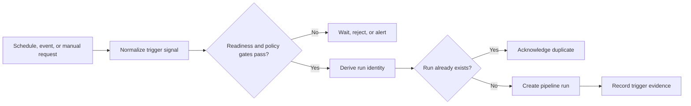
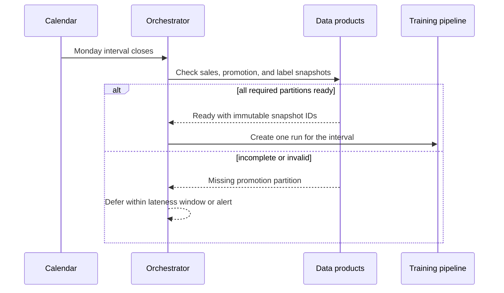
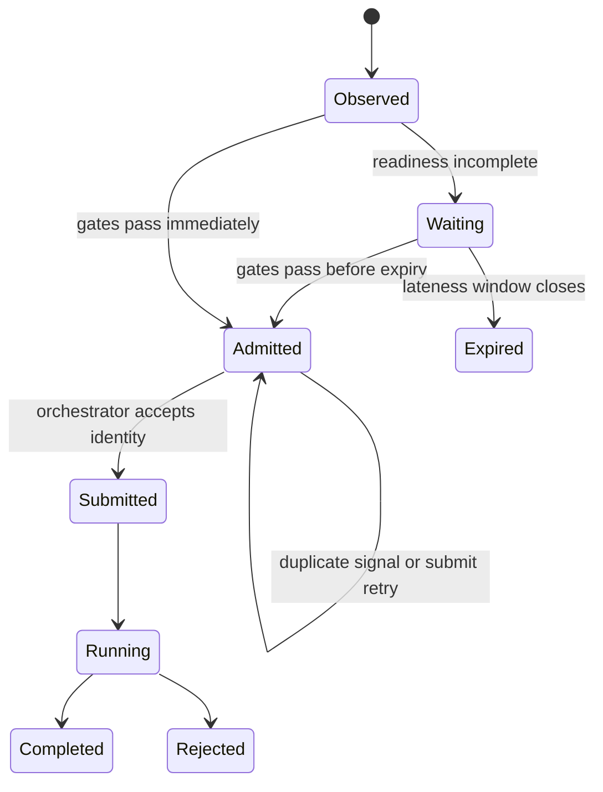
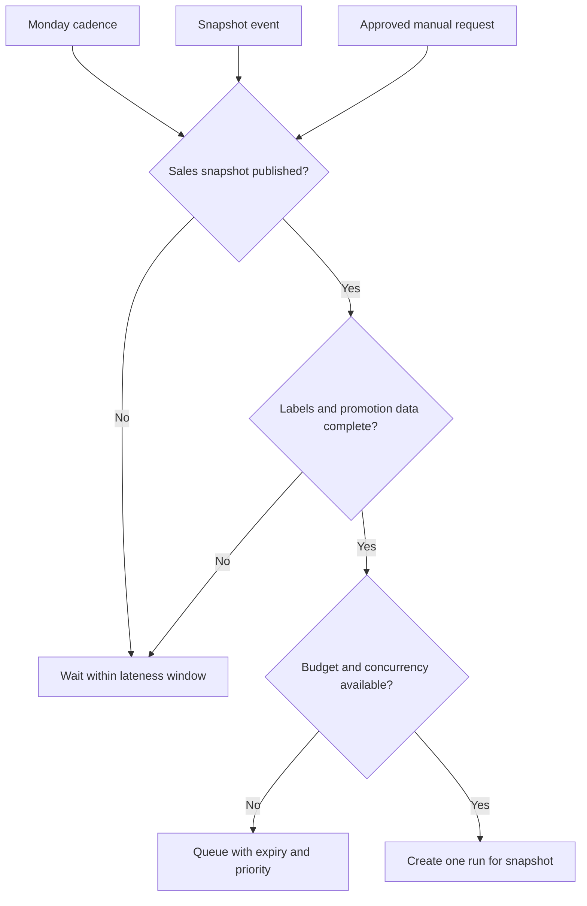

A training pipeline defines what happens during a run. A **training trigger** defines why a new run should exist now. It may be a calendar boundary, an upstream data event, a manual request, a drift alert, or several conditions joined together.

Trigger design matters because training is expensive and stateful. A duplicate event can create two candidates for one snapshot. A schedule can start before late labels arrive. A manual emergency run can bypass the evidence expected in ordinary releases. The correct abstraction is not a cron expression; it is a policy that turns signals into one attributable pipeline run.

## A Trigger Has A Signal, Gates, And A Run Identity
<!-- section-summary: A start policy observes a signal, evaluates readiness and authority, then creates one run with a stable reason and input identity. -->

Use FreshFleet, a grocery company that trains a demand-forecast model for store replenishment. Product managers want a new candidate every Monday. Sales data normally lands overnight, but supplier and promotion labels sometimes arrive late.



The **signal** says something happened. A **gate** checks whether training is allowed and useful. The **run identity** says which logical request this is. For FreshFleet, identity may combine pipeline version, data snapshot, training purpose, and backfill partition. Retries of the same logical request reuse that identity rather than creating competing model candidates.

Every run should record trigger type, observed event or schedule interval, requester, input snapshot, gate results, orchestration deployment version, and correlation or idempotency key. That evidence lets operators explain why two apparently similar runs differ.

## Scheduled Training Provides Cadence, Not Readiness
<!-- section-summary: A schedule expresses a business or data interval, while separate checks prove that the interval's inputs are complete enough to train. -->

A **scheduled trigger** starts work on a clock: hourly, nightly, weekly, or at a business-calendar boundary. It fits processes whose review and delivery cadence matters. FreshFleet's Monday run gives forecasting, merchandising, and store operations a predictable time to review a candidate.

Schedules are simple to reason about and easy to backfill by interval. They are also indifferent to reality. The scheduler reaches Monday even if the promotion table is incomplete. Therefore a scheduled run should name the data interval it intends to process and check readiness after it starts—or use a hybrid gate before run creation.



Understand the orchestrator's time semantics. A daily data-interval schedule often starts after the interval ends because the job processes the completed day; this can look “one day late” to a beginner. Time zone, daylight-saving changes, missed intervals, and **catchup** or backfill behaviour must be explicit.

Scheduled training is strong when data arrives on a stable cadence, a predictable review window matters, and moderate staleness is acceptable. It is weak when arrival is highly irregular or every meaningful source event should produce its own model candidate.

## Data Readiness Needs A Watermark And A Lateness Policy
<!-- section-summary: A readiness gate needs an explicit boundary for complete-enough data and a policy for records that arrive after that boundary. -->

A **watermark** says how far event time has advanced with acceptable completeness. It might state that sales through Sunday 23:59 UTC are available and that each expected store partition has published a manifest. The watermark is stronger than checking whether one table exists because the table can exist while important partitions are still loading.

FreshFleet can define readiness from several facts: the sales watermark reached the end of the interval, all active stores contributed data, the promotion snapshot matches the same interval, and label coverage exceeded the training threshold. Each fact needs a source and timestamp. The trigger records the values it evaluated so a later reviewer can understand why the run was admitted.

Late data still arrives after a watermark. The team needs a policy rather than pretending that "complete" means perfect. Small corrections may wait for the next weekly run. A material correction may create a new dataset version and a replay request. A severe upstream defect may invalidate the candidate entirely. That decision depends on affected rows, segments, target values, and business impact.

The lateness window also controls how long a scheduled signal waits. During the first twelve hours, the policy may defer quietly. Near the review deadline, it alerts the data owner. After the deadline, it can run with an approved partial-data exception or cancel the interval. Silent indefinite waiting hides missed training, while automatic partial training can turn a data incident into a model release.

## Event-Based Training Responds To A State Change
<!-- section-summary: An event-based trigger begins from a meaningful data or system transition, but the event still needs durable identity, completeness, deduplication, and ordering policy. -->

An **event-based trigger** reacts when something changes: a snapshot is published, a label batch is approved, a feature table completes, or an incident dataset is released. This can reduce waiting and avoid empty scheduled checks.

The event should describe a completed domain fact, not a low-level storage symptom. “Object created in a bucket” may fire for temporary files, retries, and partial multipart uploads. “Sales snapshot `2026-W28` published with manifest hash `…`” is a stronger contract.

Events are usually delivered **at least once**, meaning a consumer may see the same event more than once. Delivery order can also differ from creation order. The trigger handler needs an event ID and a domain identity such as dataset version. Store the decision durably before acknowledging the event. If run creation times out, reconcile by the idempotency key rather than blindly creating another run.

Event-based training should react to a meaningful state transition rather than every row. Aggregate low-level changes into versioned snapshots or readiness events. Otherwise a busy data source can launch a **trigger storm**: many overlapping runs that each see nearly the same data.

## A Trigger Ledger Makes Delivery And Run Creation Reconcilable
<!-- section-summary: A durable ledger records the signal, policy decision, logical run identity, and orchestrator result as separate states. -->

The trigger handler usually crosses two durable systems: the event or scheduling source and the orchestrator. A crash can happen after the handler records the event but before it creates a run, or after the orchestrator creates the run but before the handler records success. A single `processed=true` flag cannot describe those cases safely.

Use a small state machine. `observed` means the signal has been stored. `waiting` means one or more gates have not passed. `admitted` means the logical run identity is reserved. `submitted` means the orchestrator returned a run identifier. `running`, `completed`, `rejected`, and `expired` reflect later outcomes. Store the source event ID, snapshot identity, policy version, gate evidence, and orchestrator run ID on the record.



A reconciler periodically finds `admitted` records without orchestrator IDs and queries by idempotency key before submitting again. It also finds `submitted` records whose run status stopped updating. This design handles at-least-once events and ambiguous network outcomes without launching duplicate training.

The ledger also provides operational evidence. Teams can measure how long requests wait on data, how many events collapse into one run, which gate blocks most often, and whether manual exceptions create weaker candidates. Those questions cannot be answered from the pipeline run table alone because rejected and expired trigger requests never created runs.

Current orchestrators expose different versions of this idea. Airflow supports asset-aware and event-driven scheduling; Prefect uses deployments, schedules, and automations; Dagster uses schedules, sensors, and asset checks; Kubeflow Pipelines supports direct and recurring runs and can be called through its API. The product choice matters less than keeping the event contract separate from the tool's invocation syntax.

## Manual Triggers Preserve Human Authority
<!-- section-summary: A manual trigger is appropriate for experiments, incidents, or backfills when the requester, purpose, input version, and approval remain visible. -->

A person may need to launch a one-off experiment, replay a failed interval, respond to a critical correction, or rebuild history after pipeline code changes. Manual launches still need control and evidence.

Require the same immutable input references and validation as automated runs. Capture requester, reason, ticket or experiment link, intended environment, code and pipeline version, data interval or snapshot, and whether the result may enter the release path. Use role-based authorization for production-capable launches.

Separate **retries**, **replays**, and **backfills**. A retry continues one failed run. A replay creates a new attempt for the same logical input under a declared reason or changed pipeline version. A backfill creates runs for historical partitions. Concurrency and promotion policy should prevent a large backfill from starving current training or accidentally promoting an old-data candidate.

## Hybrid Policies Model Real Readiness
<!-- section-summary: Hybrid triggering combines cadence or events with data readiness, budget, concurrency, and approval so no single weak signal controls training. -->

Most production systems are hybrid. FreshFleet wants a weekly rhythm but only when required data is ready. It may also accept an approved manual hotfix after a supplier feed correction.



The policy can be represented as data rather than scattered callbacks:

```yaml
trigger_policy: weekly-demand-candidate-v4
signals:
  - monday_interval_closed
  - sales_snapshot_published
  - approved_manual_request
required_assets:
  sales: same_snapshot
  promotions: complete_for_interval
  labels: coverage_at_least_98_percent
controls:
  idempotency: pipeline_version + snapshot_id + purpose
  max_active_runs: 1
  lateness_window: 18h
  queue_expiry: 36h
manual:
  required_role: forecasting-oncall
  require_reason: true
```

This does not have to be the exact configuration format of the orchestrator. It is the application contract that adapters translate into schedules, sensors, assets, automations, or API calls.

Do not trigger training directly from a drift alert without a policy. Drift can reflect seasonality, a broken feature, an instrumentation change, or a population shift that needs investigation. An alert can open an investigation or request a candidate run; release still needs data and evaluation gates.

## Operate The Trigger Layer
<!-- section-summary: Trigger operations focus on missed work, duplicate work, late data, queue pressure, stale events, and the ability to pause or replay safely. -->

Monitor signals received, gate outcomes, runs created, duplicate suppressions, trigger-to-start delay, queue age, missed schedules, late assets, active concurrency, expired requests, and manual launches. Join those metrics to the final pipeline and release outcome so a trigger policy can be judged by useful candidates, not launch count.

A runbook should explain how to pause automated creation without killing healthy active runs; inspect the latest asset or event; determine whether a run already exists; replay one snapshot; backfill a range under bounded concurrency; and resume after checking queued signals. Test scheduler downtime, duplicate delivery, events arriving out of order, a time-zone change, incomplete labels, and run-creation timeouts.

Keep triggers and pipelines loosely coupled. The trigger submits a versioned pipeline with parameters and identity. The pipeline validates its inputs again. This defence matters because state can change between admission and execution, and a manual caller can make a mistake.


*FreshFleet keeps a weekly business rhythm while data readiness and idempotency determine whether one candidate run should actually start.*

## Choose The Signal That Represents The Work
<!-- section-summary: Scheduled, event-based, manual, and hybrid triggers are different ways to express why one attributable run should start. -->

Use a schedule when cadence and interval semantics lead. Use events when a durable state transition is the natural start signal. Use manual authority for experiments, incidents, and controlled replay. Combine them when real readiness depends on more than one condition.

In every design, normalize the signal, check readiness and policy, derive one logical run identity, suppress duplicates, and retain the evidence. The orchestrator executes that contract; it should not be the only place where the meaning of “train now” exists.

## References

- [Apache Airflow scheduling and timetables](https://airflow.apache.org/docs/apache-airflow/stable/authoring-and-scheduling/index.html)
- [Apache Airflow event-driven scheduling](https://airflow.apache.org/docs/apache-airflow/stable/authoring-and-scheduling/event-scheduling.html)
- [Apache Airflow asset-aware scheduling](https://airflow.apache.org/docs/apache-airflow/stable/authoring-and-scheduling/asset-scheduling.html)
- [Prefect deployments](https://docs.prefect.io/v3/concepts/deployments)
- [Prefect automations](https://docs.prefect.io/v3/concepts/automations)
- [Dagster schedules](https://docs.dagster.io/guides/automate/schedules)
- [Dagster sensors](https://docs.dagster.io/guides/automate/sensors)
- [Kubeflow Pipelines runs and recurring runs](https://www.kubeflow.org/docs/components/pipelines/concepts/run/)
