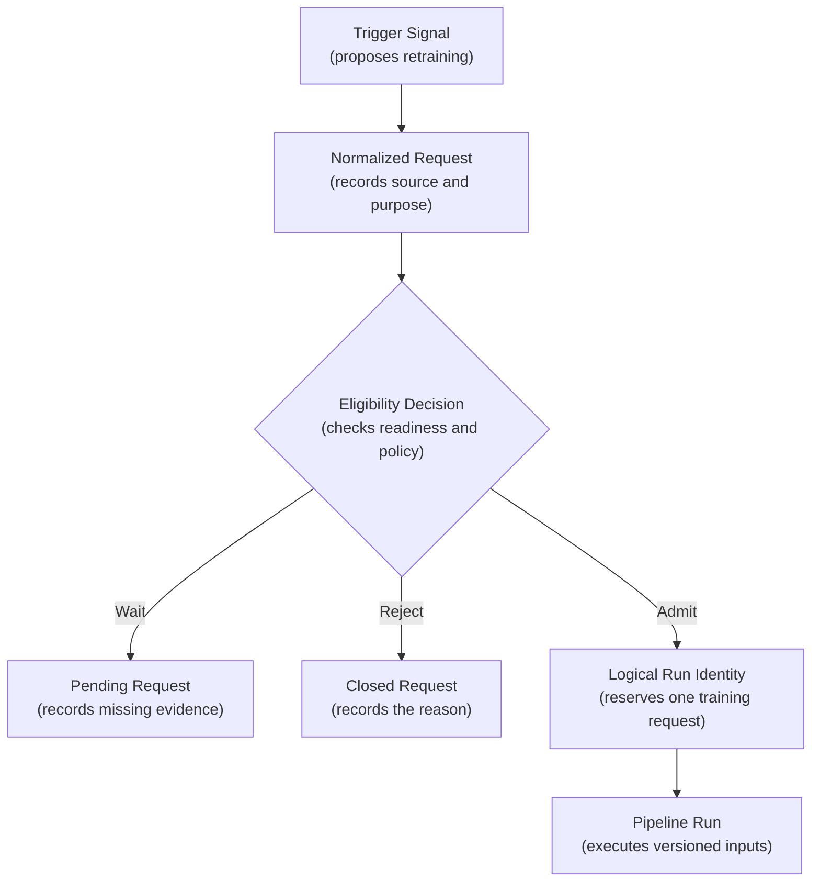
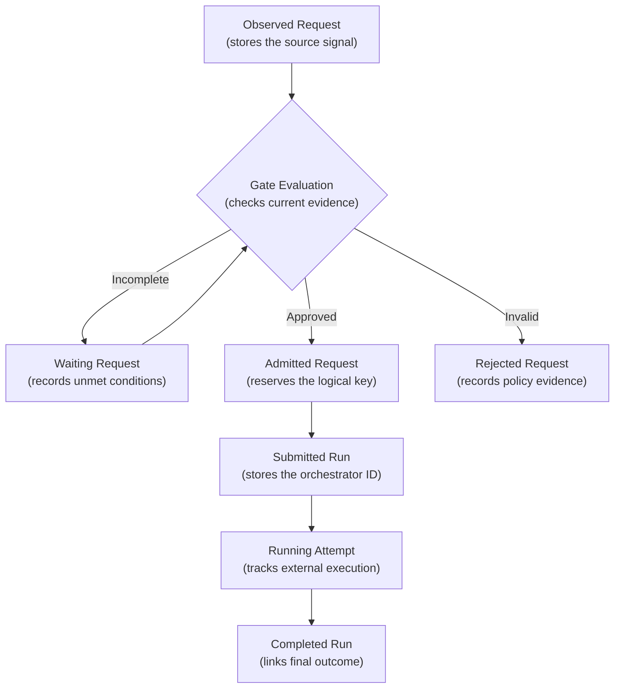
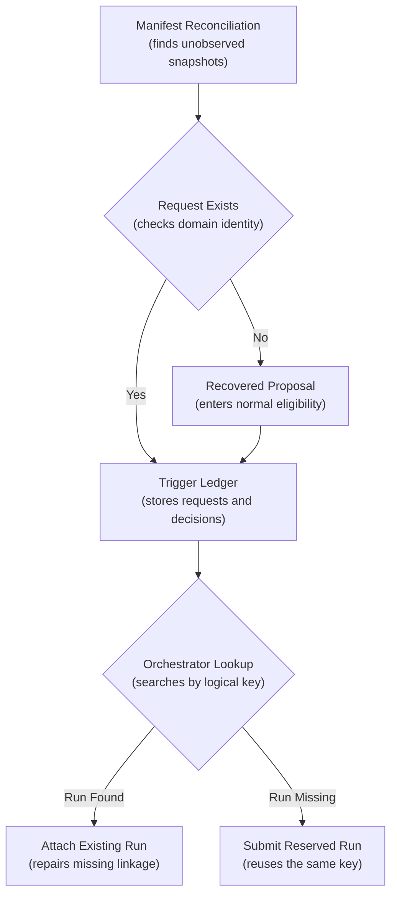

## Table of Contents

1. [A Trigger Can Arrive Before Training Is Safe](#a-trigger-can-arrive-before-training-is-safe)
2. [Four Ways To Start A Retraining Request](#four-ways-to-start-a-retraining-request)
3. [Define Which Time Period A Scheduled Run Covers](#define-which-time-period-a-scheduled-run-covers)
4. [Check That All Required Data Has Arrived](#check-that-all-required-data-has-arrived)
5. [Prevent Duplicate Events From Starting Too Many Runs](#prevent-duplicate-events-from-starting-too-many-runs)
6. [Use One Readiness Check For Every Trigger](#use-one-readiness-check-for-every-trigger)
7. [Give Retries And Replays A Stable Run ID](#give-retries-and-replays-a-stable-run-id)
8. [Define Separate Rules For Retries, Replays, And Backfills](#define-separate-rules-for-retries-replays-and-backfills)
9. [Use Manual Approval For Exceptional Retraining](#use-manual-approval-for-exceptional-retraining)
10. [Implement Training Triggers With Current Tools](#implement-training-triggers-with-current-tools)
11. [Recover From Duplicate And Missing Trigger Events](#recover-from-duplicate-and-missing-trigger-events)
12. [Monitor And Audit Training Triggers](#monitor-and-audit-training-triggers)
13. [The Main Idea](#the-main-idea)
14. [References](#references)

At a high level, a training trigger answers one practical question: **why should the system consider training a new model now?** A daily clock tick, a completed data partition, a batch of new labels, a drift investigation, or an approved incident request can all supply that reason.

That signal is only a proposal. The system still has to prove that training is safe and useful. Are the inputs complete? Are enough labels mature? Is another run already using the same snapshot? Is compute capacity available? Does this request need human approval? Separating the proposal from those checks is the foundation of reliable trigger design.

This separation also explains why a cron expression alone is too weak for production MLOps. A clock can say that midnight has passed. It cannot prove that the sales partition finished loading, that corrected labels were published, or that a duplicate delivery has already created the intended run.

## A Trigger Can Arrive Before Training Is Safe
<!-- section-summary: A signal proposes retraining, while eligibility checks decide whether one attributable run should start. -->

Imagine a forecasting pipeline scheduled shortly after the daily sales window closes. The schedule fires on time. One regional partition is still loading, and the newest labels cover only part of the prediction population. Starting immediately would create a model from a partial view of the day. Silently skipping the run would leave operators unsure whether training was delayed or lost.

A production trigger layer resolves this by handling three distinct decisions:

1. **Observe the signal.** Record the schedule tick, event, or approved request durably.
2. **Evaluate eligibility.** Check data readiness, labels, policy, capacity, and active work.
3. **Reserve one logical run.** Create a stable identity before asking the orchestrator to launch it.

In essence, the trigger says, “please consider this work.” Eligibility says, “the required evidence is ready.” The run identity says, “all retries and duplicate signals for this work refer to the same run.”


```mermaid
flowchart TD
    S["Trigger Signal<br/>(proposes retraining)"] --> N["Normalized Request<br/>(records source and purpose)"]
    N --> G{"Eligibility Decision<br/>(checks readiness and policy)"}
    G -->|Wait| W["Pending Request<br/>(records missing evidence)"]
    G -->|Reject| X["Closed Request<br/>(records the reason)"]
    G -->|Admit| I["Logical Run Identity<br/>(reserves one training request)"]
    I --> R["Pipeline Run<br/>(executes versioned inputs)"]
```

The trigger record should retain the source signal, observed time, intended data interval, dataset versions, requester, policy version, gate results, logical run key, and orchestrator run ID. This evidence supports a direct answer to “Why did this model train?” months after the run completed.

## Four Ways To Start A Retraining Request
<!-- section-summary: Scheduled, event-triggered, data-aware, and manually approved requests express different reasons for considering new training work. -->

Teams often use the words “scheduled” and “event-driven” as if they cover every design. Production systems usually need four proposal types.

### Start Retraining On A Schedule

A **scheduled run** starts from a clock or business calendar. Daily batch retraining, a weekly candidate for a review meeting, and a monthly regulatory refresh all fit this model.

You can think of the schedule as an alarm. It provides a predictable checkpoint, while the eligibility policy checks the room before work begins. A daily alarm may create a request for the previous day’s interval and then wait for all required partitions.

### Start Retraining After A Data Or System Event

An **event-triggered run** starts from a discrete occurrence such as a snapshot publication, a labeling batch approval, or a corrected dataset release. The event carries identity and context: which resource changed, which version became available, and which upstream process produced it.

An event is strongest if it describes a completed domain fact. “Training snapshot published” carries more meaning than “new object appeared in storage.” The second message might refer to a temporary file, one shard of a larger batch, or a retry.

### Start Retraining After Data Is Ready

A **data-aware run** starts after the system evaluates the state of one or more data products. The policy may require every partition for an interval, a successful quality suite, a minimum label count, and a compatible feature snapshot.

In other terms, an event reports that something changed; a data-aware policy asks whether the whole training input is ready. Asset-aware orchestrators can express some of this directly. Teams can also publish a manifest or readiness record from the data platform.

### Start Retraining After Approval

A **manually approved run** starts from a person or an approval workflow. It fits an emergency retrain, an incident investigation, a historical replay, or a high-cost candidate that needs explicit budget authorization.

Manual runs carry the same governance as automated runs. The request names immutable inputs, code and pipeline versions, purpose, owner, expiry, and release permissions. The approval adds authority to the shared eligibility process.

A production trigger layer can accept all four proposal types through one normalized request contract. The shared contract sends automation and operator actions through the same data checks, deduplication rules, concurrency limits, and audit record.

## Define Which Time Period A Scheduled Run Covers
<!-- section-summary: A schedule identifies a processing interval and cadence; data readiness remains a separate decision. -->

A cron entry looks precise, yet its meaning is incomplete until the team defines the interval behind it. A daily training request could mean “use data from the previous calendar day,” “use the latest twenty-four hours,” or “use everything since the last successful run.” Those choices produce different datasets after a delay or outage.

An explicit `[interval_start, interval_end]` preserves which source records belong to a batch request. A run submitted hours late still targets the original interval, and a replay next month resolves approved versions for those same boundaries. Delay, retry, and backfill therefore change execution time while the requested data window stays stable.

Time zone also belongs in the policy. Daylight-saving transitions create short or long local days. UTC avoids that ambiguity for many technical datasets. A business defined by local trading days may still need a regional time zone and a tested calendar library. Write the choice explicitly.

### Decide How To Handle Missed Scheduled Runs

Suppose the scheduler is unavailable for three daily intervals. On recovery, it needs one of three policies:

- create each missed interval as a bounded backfill;
- create only the latest interval;
- create a manual review item because historical runs would be expensive or misleading.

This policy is commonly called **catchup**. A catchup run should preserve the original logical interval, even if execution happens much later. Otherwise several missed intervals can all read the newest data and produce duplicate candidates.

Ordinary cron can launch a command at a chosen time, which is adequate for a small internal workflow with stable data and low recovery requirements. Add a durable request ledger and a process lock as soon as missed ticks, overlapping runs, or audit history matter. The shell schedule remains simple; the application owns the safety policy.

```text
15 3 * * *  submit-training-request --interval previous-day --source schedule
```

The command submits a request. It leaves dataset resolution and pipeline launch to the trigger service. That small boundary prevents a calendar tick from bypassing readiness checks.

## Check That All Required Data Has Arrived
<!-- section-summary: A useful data signal proves that the intended snapshot is complete enough for training and explains how late records will be handled. -->

Data rarely arrives as one atomic object. A daily snapshot may contain hundreds of files, partitions from several regions, a feature table, and labels from another system. The presence of one file proves very little.

A **completeness contract** states what “ready” means for the training interval. It usually includes:

- an immutable snapshot or table version;
- the expected partition set and a manifest of the partitions received;
- schema compatibility and required quality checks;
- label count, coverage, and maturity rules;
- a watermark and an accepted lateness window.

A **watermark** is the latest point in event time that the producer considers complete enough under its published policy. Think of it as a boundary drawn through the incoming stream. Records before the boundary are expected to be substantially complete; later records may still arrive as corrections.

### Wait For Every Required Data Partition

Consider hourly transactions written into regional partitions. The last file for one region appears at 01:12. A bucket event for the first file would be premature. A better producer writes a manifest only after all expected partitions have passed validation. The manifest includes the interval, partition list, row counts, schema version, and snapshot checksum. Its publication creates the retraining proposal.

The eligibility service reads that manifest and checks it against the active region registry. If a newly opened region is missing from the producer’s list, the mismatch blocks training and alerts the data owner. This protects the model from a “complete” snapshot defined with stale expectations.

### Check Label Count And Coverage

For supervised learning, a raw label count can hide poor coverage. Ten thousand new outcomes might all come from one customer segment. A stronger gate checks total count, join coverage to predictions, segment coverage, and label age.

For example, a fraud model may wait until at least a configured number of chargeback outcomes have matured, the prediction-to-outcome join rate exceeds its service target, and each high-risk region has enough examples for evaluation. An age ceiling can still create an investigation if the count remains below threshold for too long. This avoids a permanent wait during a quiet period.

### Create A New Dataset Version For Late Or Corrected Data

Late records should never mutate the meaning of a completed training run. Publish a new dataset version, measure the affected population, and choose a response. A tiny correction may roll into the next regular candidate. A material target correction may create a replay request. A severe quality defect may invalidate the existing candidate and pause release activity.

The trigger record retains both the original and corrected snapshot identities. This makes the relationship between candidates visible during review.

## Prevent Duplicate Events From Starting Too Many Runs
<!-- section-summary: Event systems may deliver duplicates, reorder messages, or emit bursts, so the trigger layer needs identity, deduplication, debounce, and coalescing. -->

Cloud event buses and message systems commonly provide **at-least-once delivery**. The service retries an event after an acknowledgement failure, so the handler may receive the same event again. Some systems can also deliver events out of order.

These delivery properties are normal. Four controls give the handler reliable behaviour:

1. **Deduplication** records the provider event source and event ID, then ignores an exact redelivery of that pair.
2. **Domain identity** groups different events that refer to the same snapshot or table version.
3. **Debounce** waits for a quiet period after the latest change, which helps a batch of files settle.
4. **Coalescing** combines several eligible changes into one training request, often for the newest approved snapshot.

For example, a feature pipeline commits five table updates within two minutes. Launching five training runs would waste compute and produce nearly identical candidates. A ten-minute debounce window resets after each update. At expiry, the trigger creates one request for the latest committed table version. The ledger keeps the five source event IDs as supporting evidence.

Rate control should preserve important boundaries. Updates for two different business intervals may require two requests. An emergency correction may carry a priority that bypasses the ordinary cooldown after approval. The coalescing key and exception policy need to be explicit.

Drift evidence deserves similar care. A drift alert can come from seasonality, an instrumentation change, a failed upstream feature, or a genuine population shift. The alert should create an investigation or retraining proposal. Eligibility then checks monitoring freshness, feature health, label availability, recent releases, and cooldown policy. A candidate run can proceed after the evidence supports retraining; release evaluation remains a separate gate.

## Use One Readiness Check For Every Trigger
<!-- section-summary: Every proposal type passes through a common policy for data, labels, capacity, concurrency, cost, and authority. -->

Eligibility turns many signals into one consistent operational decision. A shared policy gives scheduled, manual, and drift-driven requests the same quality and concurrency checks. It also prevents two proposal paths from starting candidates on the same snapshot.

The policy usually evaluates six areas:

- **Input readiness:** immutable versions exist, manifests agree, schema and quality checks pass.
- **Label readiness:** volume, join coverage, maturity, and required segments meet the training contract.
- **Change value:** enough new evidence exists to justify compute, or an approved purpose overrides the ordinary threshold.
- **Concurrency and capacity:** active runs, queue depth, quotas, accelerators, and budget fit the request.
- **Governance:** requester, environment, pipeline version, and intended release path are authorized.
- **Timing:** cooldown, debounce, lateness, and expiry rules remain satisfied.

Store the policy as versioned configuration and write its version into every trigger decision. A schedule, a data event, and a manual request then evaluate the same gate definitions. During an incident, the operator inspects that policy version and its recorded evidence. The decision no longer has to be reconstructed from several callback implementations.

```yaml
policy_id: demand-candidate-v5
eligibility:
  required_assets: [features, targets, training_manifest]
  minimum_label_join_coverage: 0.98
  maximum_active_runs: 1
  cooldown: 12h
  request_expiry: 36h
identity:
  fields: [pipeline_version, snapshot_id, purpose, partition]
manual_request:
  required_role: ml-production-operator
  require_reason: true
```

The format is application-owned. An adapter can translate parts of it into Airflow assets, Dagster automation conditions, Prefect automations, Databricks job triggers, or a managed pipeline API. Checks that carry model-specific meaning stay in the trigger service or pipeline entry gate.

## Give Retries And Replays A Stable Run ID
<!-- section-summary: A logical run key identifies the intended work, while attempt identifiers distinguish each execution effort. -->

A training request can reach the orchestrator even if the caller never receives the response. Suppose an event handler submits a run and loses its connection one second later. The event bus redelivers the source event, and the handler sees no orchestrator ID in its local record. Creating a fresh run at this point would train a second candidate from the same snapshot.

Run identity gives both systems a shared answer to “Is this the same work?” The retried handler sends the original identity again. The orchestrator can return the existing run, or the reconciler can find it and repair the missing link.

Two related identifiers carry that meaning:

- The **logical run key** describes the intended training work. It can combine pipeline version, immutable snapshot ID, purpose, and historical partition.
- The **attempt ID** describes one execution effort for that logical run.

The duplicate event in the scenario reuses the logical run key because its pipeline version, snapshot, purpose, and partition are unchanged. A worker failure later creates another attempt ID under that same logical run. Operators can count execution attempts while still seeing one intended candidate.

A database uniqueness constraint provides a simple and strong foundation:

```sql
create unique index one_training_request
on training_requests (
  pipeline_version,
  snapshot_id,
  purpose,
  coalesce(partition_key, '')
);
```

The trigger handler inserts or retrieves this record inside a transaction, then submits the reserved identity to the orchestrator. Side effects such as notifications and pipeline creation also carry the same idempotency key where the downstream API supports one.

The request ledger follows the work from signal to outcome. `observed` means the source signal has been stored durably. A request moves to `waiting` if labels, manifests, approval, or capacity are still missing; each re-evaluation records which evidence changed. It moves to `admitted` only after eligibility passes and the logical run key has been reserved. At this point training is authorized, though the ledger has no proof that the orchestrator accepted the run.

Submission crosses from the trigger database into the orchestrator. A successful response moves the record to `submitted` and adds the external run ID. A lost response leaves the record in `admitted`, even if the orchestrator created the run. That transition requires external reconciliation. The reconciler queries by logical key and attaches a matching run. It submits with the same key only after an empty lookup. `running` and `completed` mirror the external outcome. `rejected` and `expired` close requests that failed policy or outlived their usefulness before launch.


```mermaid
flowchart TD
    O["Observed Request<br/>(stores the source signal)"] --> G{"Gate Evaluation<br/>(checks current evidence)"}
    G -->|Incomplete| W["Waiting Request<br/>(records unmet conditions)"]
    W --> G
    G -->|Approved| A["Admitted Request<br/>(reserves the logical key)"]
    A --> S["Submitted Run<br/>(stores the orchestrator ID)"]
    S --> N["Running Attempt<br/>(tracks external execution)"]
    N --> C["Completed Run<br/>(links final outcome)"]
    G -->|Invalid| R["Rejected Request<br/>(records policy evidence)"]
```

## Define Separate Rules For Retries, Replays, And Backfills
<!-- section-summary: Retry, replay, and backfill describe different operational intentions and need separate identities, limits, and release rules. -->

A **retry** continues work for the same logical input after an execution failure. A **replay** runs the same logical interval again because code, configuration, or evidence changed. A **backfill** creates work for a range of historical partitions.

This vocabulary matters because each action carries different risk. A retry can usually reuse the same approved inputs. A replay should record the changed pipeline version, corrected snapshot, or investigation reason. A backfill can create hundreds of runs and compete with current production training.

For a historical label correction, first publish a corrected snapshot version and measure affected intervals. Create replay requests only for material partitions. Assign a backfill group ID, cap concurrency, reserve a separate compute pool or priority, and disable automatic promotion for historical candidates. Current-period training keeps its service priority.

Late events should be compared with the watermark and correction policy. An event for a partition already processed may create no action, amend monitoring evidence, or request a replay. Target changes and business impact drive the response; event age supplies supporting context.

Replay also needs a stable input record. Reading “latest” during a historical run can combine old features with current labels. Resolve every asset version before admission and pass those immutable references into the pipeline.

## Use Manual Approval For Exceptional Retraining
<!-- section-summary: Emergency and high-risk runs retain human authority through explicit scope, evidence, permissions, and expiry. -->

An incident may require an immediate candidate after a corrupted feature is repaired. The request names the corrected snapshot because the investigation and any replay must refer to the exact data reviewed by the operator. Its purpose explains the permitted outcome, such as “evaluate the feature repair,” and its expiry closes the emergency path after the incident window. These fields stop a temporary exception from turning into a reusable shortcut.

The incident link connects the request to repair evidence and the operational timeline. The pipeline version and expected scope fix what the approval covers. Urgency controls queue priority, while release permission limits the allowed follow-on action.

A production candidate may need a second reviewer because training approval and release approval answer different questions. The first authorizes compute against the supplied evidence. The second judges the resulting metrics, risks, and rollout plan.

The emergency flag can adjust cooldown or queue priority under a versioned exception policy. Input immutability still anchors the candidate to reviewed data. Schema compatibility still protects the training code, and active-run reconciliation still prevents duplicate work. Audit logging connects every deviation to its owner.

If the incident requires bypassing a quality threshold, the request records the failed check and why accepting it is reasonable. It also records the approver and expiry, so the exception closes after the incident window.

Manual requests also need an answer to “What may happen after training?” An experiment can produce metrics and artifacts without entering the registry. An incident candidate may enter evaluation while a separate release approval remains required. Encoding this permission blocks a one-off training action from silently starting deployment.

Role-based access control should keep four authorities separate. A requester proposes the work and supplies evidence. An exception approver accepts any temporary policy deviation. The pipeline service identity executes only the admitted configuration. A release approver decides whether the resulting candidate can reach production. This split prevents one urgent action from proposing, approving, executing, and releasing its own model. Short-lived credentials give each role only the permissions required for that stage.

## Implement Training Triggers With Current Tools
<!-- section-summary: Current orchestrators expose schedules, asset events, sensors, and automations, while application policy still defines model-specific eligibility. -->

Tool selection comes after the trigger contract. Each platform can represent parts of the framework, though names and maturity differ.

### Ordinary Cron

Cron supplies a clock signal. Pair it with a durable request API, explicit interval calculation, a uniqueness constraint, and an external monitor for missed ticks. It fits low-volume internal training where a full orchestrator would add more operational surface than value.

### Apache Airflow

A team already using Airflow for warehouse and feature pipelines can publish the training manifest as an **Asset**. Airflow records the update only after the producer task succeeds, and an asset-aware schedule can then create the consumer DAG run. Requiring both the feature and label Assets with `AND` expresses a basic completeness dependency; using `OR` creates a run after either Asset changes.

Current Airflow uses **Assets** for these logical data dependencies; older material and deployments may still use the former **Dataset** name. `AssetOrTimeSchedule` combines asset changes with a timetable, while asset watchers connect supported external event sources. Explicit timetable choice remains important because a cron trigger and a cron data interval carry different time meanings. Keep readiness checks inside the DAG or a policy service if an Asset update alone cannot prove label coverage or quality.

### Dagster

Suppose a Dagster project already represents feature tables, labels, and training snapshots as assets. The training asset should materialize only after its upstream partitions exist and their blocking checks pass. Declarative Automation evaluates that asset state and its dependencies through `AutomationCondition`; its built-in conditions cover cron cadence, eager dependency updates, and missing partitions.

An asset sensor handles more custom event logic. It can create a `RunRequest` after a selected materialization and use a stable `run_key` to suppress duplicate requests. The normalized training request still carries the snapshot identity and policy evidence because a Dagster run key only protects the scope defined by that sensor.

The core automation conditions are current supported features. Dagster currently marks automation through virtual-asset dependencies as Preview. Keep that extension outside a production contract until its lifecycle status fits the system's risk policy.

### Prefect

Suppose a labeling service emits `labels.batch-approved` with a snapshot ID after review. A Prefect deployment trigger can match that event, pass the snapshot ID into a deployment, and create the flow run. The trigger is a concise automation whose action is fixed to running that deployment.

Prefect 3 provides events and automations in the open-source product. Event triggers can react to matching events or their absence. They can also require a threshold inside a time window and group observations by resource fields. Those controls fit label thresholds and missing-snapshot alerts, while the normalized request retains the event ID and resource identity so application-level deduplication survives redelivery and operator replay.

### Databricks Lakeflow Jobs

Lakeflow Jobs supports scheduled, file-arrival, table-update, continuous, and manual triggers. File-arrival triggers expose a minimum interval and a wait-after-last-change setting, which map directly to cooldown and debounce. Table-update triggers can watch supported Unity Catalog tables and start after any or all selected tables update.

Table update is a useful data-aware signal, especially with commit version passed into the job. It still needs a training eligibility step for label coverage, cross-table consistency, and release policy. Databricks currently labels model-update triggers as Beta. Table-update triggers on OpenSharing objects and system tables are also Beta. The current documentation places no Beta label on ordinary supported Unity Catalog table updates or file-arrival triggers.

### Managed ML Pipelines And Cloud Event Buses

SageMaker Pipelines can be an EventBridge target for schedules or event patterns. Vertex AI provides recurring pipeline schedules with concurrency controls; an external Eventarc handler can submit an event-driven `PipelineJob`. Azure Machine Learning v2 provides time-based schedules, while external event-driven entry commonly uses Event Grid plus an adapter or external orchestrator. Azure ML’s native v2 schedule documentation explicitly excludes event-based triggers.

The shared delivery contract is simple: the handler must tolerate another copy of the event and must detect work that never reached it. It first stores the event source, event ID, and dataset version in one durable transaction. It then derives the logical run key and either creates the request or attaches the event to the existing request. Acknowledgement happens after this durable write. Exhausted deliveries move to a dead-letter store, and periodic reconciliation compares published snapshots with ledger entries to recover missing work.

Provider details change where failure can occur. Eventarc Standard explicitly uses at-least-once delivery, so duplicate events are expected. Azure Event Grid also provides at-least-once delivery and warns that events may arrive out of order. AWS service events reach EventBridge with a source-specific best-effort or durable delivery level. After EventBridge accepts an event, target delivery follows its configured retries and dead-letter queue. For AWS, reconciliation must cover both a missed source event and a failed target invocation.

## Recover From Duplicate And Missing Trigger Events
<!-- section-summary: A durable ledger and periodic reconciliation turn duplicate delivery, ambiguous submission, and missed events into routine recovery paths. -->

Consider an event handler that reserves a request and calls the orchestrator. The API accepts the run, yet the response is lost during a network failure. A blind retry can create a second candidate. The recovery path first queries the orchestrator by logical run key. It attaches an existing run ID to the ledger, and submits only after an empty result.

Now consider a missed storage event. A periodic reconciler compares published manifests or table versions with trigger ledger entries. Any eligible snapshot without a request gets a recovered proposal carrying source `reconciliation`. This gives event-driven systems a dependable safety net.


```mermaid
flowchart TD
    L["Trigger Ledger<br/>(stores requests and decisions)"] --> Q{"Orchestrator Lookup<br/>(searches by logical key)"}
    Q -->|Run Found| A["Attach Existing Run<br/>(repairs missing linkage)"]
    Q -->|Run Missing| S["Submit Reserved Run<br/>(reuses the same key)"]
    M["Manifest Reconciliation<br/>(finds unobserved snapshots)"] --> D{"Request Exists<br/>(checks domain identity)"}
    D -->|Yes| L
    D -->|No| N["Recovered Proposal<br/>(enters normal eligibility)"]
    N --> L
```

These recovery controls protect different boundaries and work as one system. The uniqueness constraint prevents two local request rows for the same logical work. A downstream idempotency key extends that protection across the orchestrator API. Retries carry the same key and stop at a bounded expiry. A dead-letter store retains deliveries that exhausted their attempts. The reconciler then compares source truth, the request ledger, and orchestrator state to find anything still missing.

The resulting recovery design contains five mechanisms:

- a uniqueness constraint for the logical request;
- idempotency keys passed to downstream APIs;
- retry with exponential backoff and bounded expiry;
- a dead-letter queue or failed-event store;
- a reconciler that compares source truth, ledger state, and orchestrator state.

Test these paths with duplicate events, reordered events, a timeout after run creation, scheduler downtime, and a dead-letter replay. Recovery should produce one logical candidate and a complete audit trail.

## Monitor And Audit Training Triggers
<!-- section-summary: Trigger operations focus on delayed evidence, duplicate suppression, missed work, queue pressure, manual authority, and safe replay. -->

Pipeline success metrics describe work that started. Trigger metrics also cover work that waited, expired, or was rejected. Track proposal volume by source and the outcome of each gate. Measure waiting time, trigger-to-start delay, queue pressure, and active concurrency. Count duplicate suppressions, coalesced events, missed intervals, reconciled snapshots, dead-lettered signals, expired requests, and manual exceptions.

A practical alert might fire because daily label readiness has remained false beyond its age ceiling. The on-call engineer first checks label-job freshness, join coverage, schema versions, and the intended interval. If the data is healthy and only the count threshold is low, the owner can approve a documented exception or wait for more outcomes. If the join feed is broken, training stays paused while the outcome pipeline is repaired.

The runbook follows the same lifecycle as the ledger. First pause new admissions so the incident stops creating more work. Establish the source snapshot, gate evidence, logical key, and external run state. Repair ambiguous linkage before any replay. Historical recovery then uses bounded concurrency and keeps promotion disabled until the team has reviewed the candidates. Once dead-lettered signals are reconciled, resume automation and observe the next normal interval.

The operational actions are:

- pause new admissions while active pipeline runs continue;
- inspect the latest signal, dataset manifest, gate evidence, and logical key;
- search the orchestrator before resubmitting an ambiguous request;
- replay one corrected snapshot through normal eligibility;
- launch a bounded historical backfill with promotion disabled;
- drain or replay dead-lettered events;
- resume automation and verify the next interval.

Audit records identify who or what proposed the run and which policy admitted it. They retain the evidence used by every gate, any approved exception, and the immutable inputs passed to the pipeline. The final link points to the release decision. Together, these records turn a scheduler event into a defensible model history.

## The Main Idea
<!-- section-summary: Reliable training uses a proposal, an eligibility decision, and one stable run identity. -->

Schedules, events, data-aware conditions, and manual approvals are ways to propose retraining. None of them proves readiness alone. A production trigger layer records the proposal and checks shared eligibility rules. It reserves one logical identity before asking the orchestrator to execute a versioned pipeline.

Use clocks for predictable intervals, domain events for meaningful state changes, data-aware checks for completeness, and approvals for exceptional authority. Add watermarks, lateness rules, rate control, idempotency, bounded backfills, and reconciliation. These controls turn “train now” from a fragile callback into an explainable operational decision.

## References

- [Apache Airflow asset-aware scheduling](https://airflow.apache.org/docs/apache-airflow/stable/authoring-and-scheduling/asset-scheduling.html)
- [Apache Airflow asset definitions](https://airflow.apache.org/docs/apache-airflow/stable/authoring-and-scheduling/assets.html)
- [Apache Airflow event-driven scheduling](https://airflow.apache.org/docs/apache-airflow/stable/authoring-and-scheduling/event-scheduling.html)
- [Apache Airflow timetables](https://airflow.apache.org/docs/apache-airflow/stable/authoring-and-scheduling/timetable.html)
- [Dagster Declarative Automation](https://docs.dagster.io/guides/automate/declarative-automation)
- [Dagster asset sensors](https://docs.dagster.io/guides/automate/asset-sensors)
- [Dagster virtual assets](https://docs.dagster.io/guides/build/assets/virtual-assets)
- [Prefect automations](https://docs.prefect.io/v3/concepts/automations)
- [Prefect deployment triggers](https://docs.prefect.io/v3/how-to-guides/automations/creating-deployment-triggers)
- [Databricks Lakeflow Jobs schedules and triggers](https://docs.databricks.com/aws/en/jobs/triggers)
- [Databricks file-arrival triggers](https://docs.databricks.com/aws/en/jobs/file-arrival-triggers)
- [Databricks table-update triggers](https://docs.databricks.com/aws/en/jobs/trigger-table-update)
- [SageMaker Pipelines EventBridge triggers](https://docs.aws.amazon.com/sagemaker/latest/dg/pipeline-eventbridge.html)
- [Vertex AI PipelineJob schedules](https://docs.cloud.google.com/python/docs/reference/aiplatform/latest/google.cloud.aiplatform.PipelineJobSchedule)
- [Azure Machine Learning pipeline schedules](https://learn.microsoft.com/en-us/azure/machine-learning/how-to-schedule-pipeline-job)
- [Google Eventarc event retries](https://docs.cloud.google.com/eventarc/docs/retry-events)
- [Azure Event Grid delivery and retry](https://learn.microsoft.com/en-us/azure/event-grid/delivery-and-retry)
- [Amazon EventBridge delivery levels](https://docs.aws.amazon.com/eventbridge/latest/ref/event-delivery-level.html)
- [Amazon EventBridge target retries and dead-letter queues](https://docs.aws.amazon.com/eventbridge/latest/userguide/eb-rule-retry-policy.html)
