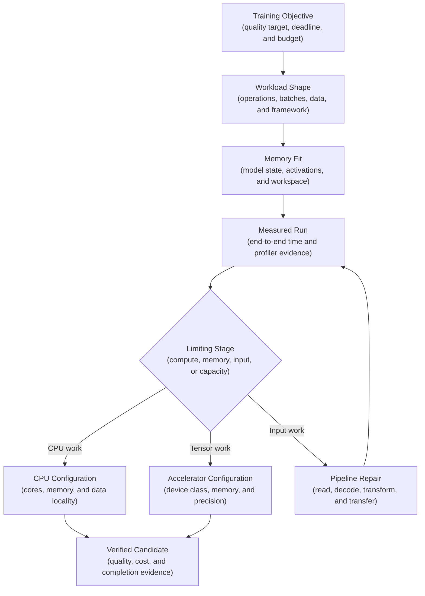
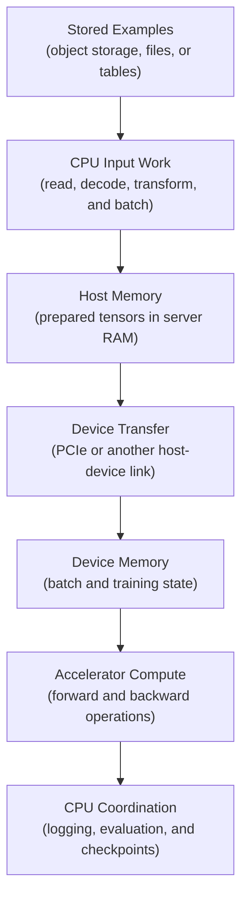
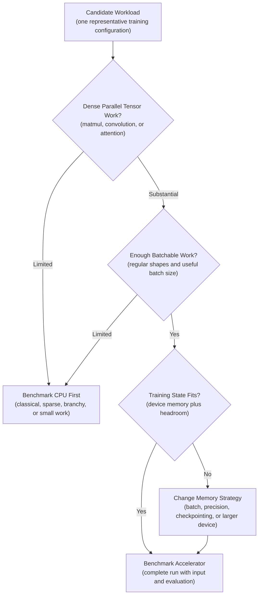
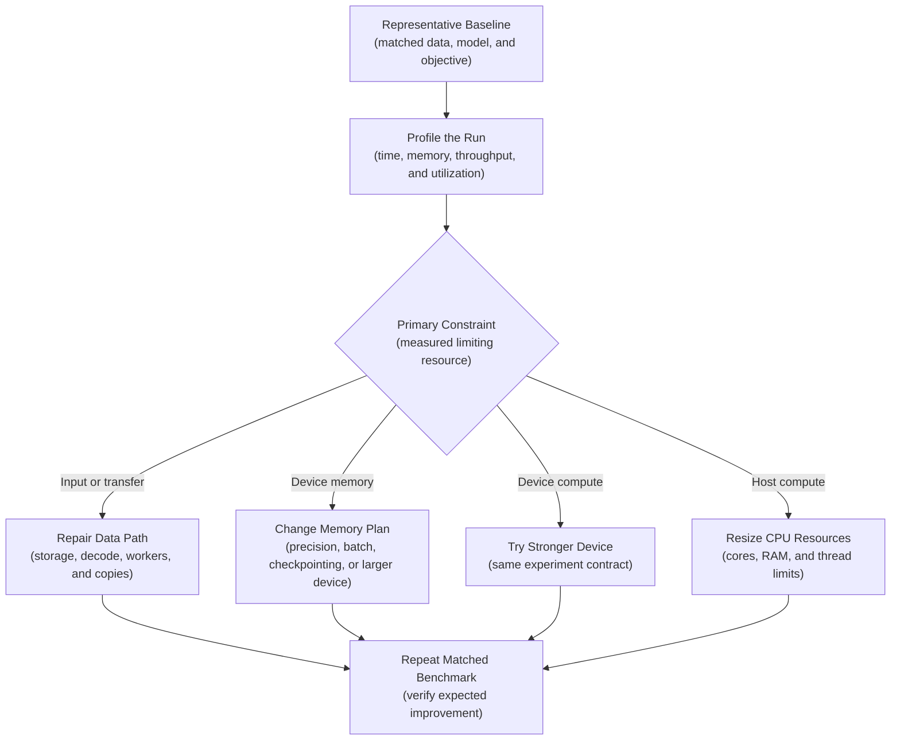

## Table of Contents

1. [Choose Hardware for a Training Objective](#choose-hardware-for-a-training-objective)
2. [Understand How Data And Computation Reach The Processor](#understand-how-data-and-computation-reach-the-processor)
3. [Match The Training Workload To The Hardware](#match-the-training-workload-to-the-hardware)
4. [Use CPU Training for the Work CPUs Handle Well](#use-cpu-training-for-the-work-cpus-handle-well)
5. [Use GPUs for Parallel Tensor Work](#use-gpus-for-parallel-tensor-work)
6. [Check Whether Training Fits In Accelerator Memory](#check-whether-training-fits-in-accelerator-memory)
7. [Choose Numeric Precision As Part Of The Experiment](#choose-numeric-precision-as-part-of-the-experiment)
8. [Benchmark the Complete Training Path](#benchmark-the-complete-training-path)
9. [Prevent Data Loading From Leaving The Accelerator Idle](#prevent-data-loading-from-leaving-the-accelerator-idle)
10. [Read Accelerator Utilization Together With Training Throughput](#read-accelerator-utilization-together-with-training-throughput)
11. [Place the Job on Managed Compute](#place-the-job-on-managed-compute)
12. [Schedule Accelerators on Kubernetes](#schedule-accelerators-on-kubernetes)
13. [Compare The Cost Of A Successful Training Run](#compare-the-cost-of-a-successful-training-run)
14. [Preserve Reproducibility Across Hardware](#preserve-reproducibility-across-hardware)
15. [Use Measurements To Decide Whether To Scale Up Or Out](#use-measurements-to-decide-whether-to-scale-up-or-out)
16. [The Main Idea](#the-main-idea)
17. [References](#references)

## Choose Hardware for a Training Objective
<!-- section-summary: The hardware decision is successful if a training job reaches its required model-quality evidence within its time, reliability, and cost limits. -->

At 08:30, an ML engineer receives the final label snapshot for an image classifier that detects damaged parts. A review meeting starts at 17:00. The engineer must choose among an available CPU pool, a single-GPU queue, and a scarce larger-memory GPU pool.

The wrong choice has practical consequences. A CPU run may miss the review window. A GPU with too little memory may fail after initialization. A large GPU may finish the tensor math quickly and spend most of its billed time waiting for image decoding. An unrecorded precision change could also produce a model that is faster to train yet unsuitable for comparison with the approved baseline.

Success has observable evidence. The job reaches the agreed validation objective and writes a usable checkpoint before the meeting. It stays within budget and produces a profile that explains where time and memory went. That evidence supports future scheduling decisions instead of leaving the team with “GPU was faster” as the only conclusion.

A slow training job does not automatically need a GPU. The input pipeline may be waiting on storage, preprocessing may use unsupported operations, or the model may be too small to keep an accelerator busy. CPU-versus-GPU selection is therefore a **bottleneck decision**. A bottleneck is the stage that limits the rate of the whole job, and faster hardware helps only if it accelerates that stage.



The training objective anchors the decision. Hardware is a means to produce the required model evidence, not the objective itself.

## Understand How Data And Computation Reach The Processor
<!-- section-summary: CPUs prepare and coordinate the job, accelerators execute supported parallel operations, and data crosses a host-to-device boundary before accelerator compute can begin. -->

A **central processing unit (CPU)** is a general-purpose processor. Its cores handle varied instructions, branching logic, operating-system work, file parsing, decompression, data joins, and the Python or C++ code that coordinates training. Modern CPUs also contain vector instructions and can train many models efficiently.

A **graphics processing unit (GPU)** is a type of accelerator. It contains many execution units designed to apply similar operations across large groups of values. Matrix multiplication, convolution, and attention contain the repeated numerical work that GPUs handle well.

The broader term **accelerator** includes GPUs, TPUs, AWS Trainium, and other purpose-built devices. Each accelerator depends on a supported framework and operator set. Its compiler and runtime must also match the hardware. Moving PyTorch code from CPU to an NVIDIA GPU commonly uses CUDA. A TPU follows a different execution path. Hardware capability and software support must agree.

Training also uses two memory domains. **Host memory** is the server’s ordinary RAM, directly accessible to the CPU. **Device memory** is memory attached to an accelerator, such as GPU high-bandwidth memory. Model parameters and batches must reside in device memory before GPU kernels can operate on them. Copying data across the host-to-device link takes time and bandwidth.

Three performance terms describe this path:

- **Parallelism** is the amount of work executed at the same time. A large matrix operation exposes far more parallel work than a row-by-row parser with many branches.
- **Throughput** is completed work per unit of time, such as training examples per second or tokens per second.
- **Utilization** measures activity in a hardware component over an interval. It needs throughput and profiler context because an active GPU may still be waiting on device memory.



A training job can use both processors heavily. Calling it “GPU training” means the main supported model operations execute on the GPU; CPU work still feeds and coordinates those operations.


*CPU and GPU are parts of one training path. The slowest read, transform, transfer, compute, or coordination stage sets end-to-end throughput.*

## Match The Training Workload To The Hardware
<!-- section-summary: Model operations, batchability, input work, memory footprint, precision, and framework coverage determine whether acceleration can improve the full job. -->

Hardware selection starts with the shape of the work. The model’s parameter count alone gives an incomplete answer. **Workload shape** is the pattern of computation and data movement produced by one representative training step. Equal parameter counts can hide different behavior: one model may perform dense matrix operations while another spends most of its time in sparse lookups or host-side preprocessing. The following questions locate that difference before hardware is requested.

### Examine the Model Operations

Dense matrix multiplications, convolutions, attention layers, and large embedding operations expose parallel tensor work. Deep neural networks usually contain many such operations. Tree traversal, irregular sparse operations, string processing, and branch-heavy feature logic may spend more time on CPU or gain less from a GPU.

Operator support matters too. A framework may place most of a model on the accelerator and fall back to the CPU for an unsupported custom operation. Repeated device transfers around that fallback can erase the expected gain. PyTorch Profiler or TensorFlow Profiler reveals actual device placement and operation time.

### Check Whether The Model Can Process Large Batches

**Batchability** describes whether many examples can share the same operation at once. Larger, regular batches usually expose more parallel work. Tiny models, highly variable shapes, and one-example-at-a-time processing can leave an accelerator underfilled.

The dataset path may dominate the job. Image decoding, text tokenization, data-frame joins, compression, remote reads, and Python augmentation all consume host resources. A GPU can shorten the model step enough to expose one of these stages as the new bottleneck.

### Confirm Memory, Precision, and Framework Support

Estimate the memory used by parameters, gradients, optimizer state, activations, temporary workspaces, and the batch. Then identify the supported precision modes. Finally, verify that the selected framework build, container, driver, and accelerator runtime support every important operation.



This framework produces candidates for measurement. The benchmark makes the decision.


*Workload shape suggests CPU or GPU candidates. A matched benchmark compares time to required quality, peak memory, queue-to-artifact time, and full cost before the team selects the operating default.*

## Use CPU Training for the Work CPUs Handle Well
<!-- section-summary: CPU training fits classical models, small experiments, feature-heavy pipelines, irregular operations, and baseline runs that finish within the required window. -->

CPU training is often the production default for linear models, many tree-based models, small neural networks, and experiments dominated by feature preparation. Libraries such as scikit-learn, XGBoost, LightGBM, Spark ML, and PyTorch provide optimized CPU implementations for many of these workloads.

Consider a churn model trained from a few million tabular rows. The pipeline performs categorical encoding, joins account history, builds sparse features, and trains gradient-boosted trees. A large share of elapsed time may sit in data preparation and tree construction. A well-sized CPU machine can finish sooner and cost less. The competing GPU job may wait in a queue and accelerate only part of the workflow.

A CPU run also provides a valuable baseline for deep learning. It confirms that data loading, loss calculation, checkpoint writing, and evaluation work before scarce GPU time is requested. For a model that trains in several minutes on CPU, GPU startup and transfer overhead may exceed the time saved.

CPU selection still needs measurement. Increase cores only while the library and data pipeline scale with them. Watch memory bandwidth, thread oversubscription, and non-uniform memory access on large hosts. More virtual CPUs can slow a job if several libraries each create their own thread pool. Record thread settings such as `OMP_NUM_THREADS` and the library-specific limits used by the run.

The CPU baseline is complete once it reports model quality, end-to-end time, peak memory, examples per second, and cost. Those values give the accelerator test a fair comparison target.

## Use GPUs for Parallel Tensor Work
<!-- section-summary: GPU training fits sufficiently large tensor workloads whose batches, operators, and input pipeline can keep the device productive. -->

GPU training earns its cost during repeated forward and backward passes over large tensors. Computer vision, language models, speech models, recommendation embeddings, and other deep networks commonly fit this pattern. The gain rises as a step exposes enough work to amortize kernel launch and transfer overhead.

A **kernel** is a function executed on the GPU. Frameworks launch kernels for operations such as matrix multiplication or an activation. Many tiny kernels and frequent CPU synchronization can produce low throughput even if the model technically runs on GPU. Compilers such as `torch.compile` or XLA may reduce overhead for compatible models, although compiled and eager runs should be benchmarked as separate configurations.

Batch size influences accelerator efficiency. A larger batch often fills more execution units and raises throughput, up to the point where memory runs out or model quality changes. Gradient accumulation can simulate a larger optimization batch while processing smaller device batches. It adds more steps and has different performance properties from a physically larger batch.

The damaged-parts classifier is a plausible GPU candidate because convolutions process regular image tensors in batches. The engineer should still run a representative profile. If each GPU step takes `35 ms` and fetching the next batch takes `60 ms`, a faster GPU deepens the idle gap. Input work owns the next improvement.

GPU use also introduces a compatibility contract: framework build, accelerator backend, driver, runtime libraries, and device capability. Pin the training image by digest and test it on the target device class before scheduling a full run.

## Check Whether Training Fits In Accelerator Memory
<!-- section-summary: GPU class selection starts with peak device-memory demand, then considers throughput, precision support, interconnect, availability, and cost. -->

Device memory decides whether a configuration can run. During training, memory holds more than the model weights. A useful estimate is:

`peak device memory ≈ parameters + gradients + optimizer state + activations + temporary workspaces + batch data`

For Adam training with float32 values, parameters, gradients, and two optimizer moments can consume roughly `16 bytes` per parameter before activations and temporary buffers. Mixed precision, master-weight copies, fused optimizers, quantization, and framework implementation details change that estimate. Measure the real peak with the target training code.

### Reduce Memory Use Before Choosing A Larger GPU

If the run is close to the limit, test one memory control at a time. Options include a smaller micro-batch, gradient accumulation, automatic mixed precision, activation checkpointing, and a memory-efficient optimizer. Each choice changes speed or numerical behavior and belongs in the experiment record. Clear accidental tensor references and verify that evaluation code releases temporary outputs.

If the model still does not fit, select a larger-memory accelerator. The decision starts from measured peak memory plus operational headroom for allocator variation and input shape. A configuration that peaks near the physical limit is fragile even if one benchmark succeeds.

### Choose A GPU That Meets The Measured Limit

After memory fit, compare tensor throughput, supported dtypes, memory bandwidth, host link, and availability. Cost-efficient accelerators such as L4- or A10-class devices can suit smaller vision models and fine-tuning. H100-, H200-, and newer Blackwell-class devices serve larger or more demanding training programs. Exact memory, topology, cloud availability, and pricing vary by product and region, so the platform catalog is the source of truth.

For a single-device job, more interconnect bandwidth between GPUs adds no value. For a later multi-GPU design, NVLink, PCIe topology, and network fabric can determine scaling efficiency. Establish the one-device result before choosing a distributed topology.

A concrete memory result makes the choice defensible. If the representative run peaks at `28 GiB`, a `24 GiB` device cannot host that configuration. The team can reduce the footprint or request the next suitable memory class. Theoretical compute throughput does not solve a capacity failure.

## Choose Numeric Precision As Part Of The Experiment
<!-- section-summary: Lower-precision training can reduce memory and increase accelerator throughput, while numerical range and model-quality checks determine whether it is acceptable. -->

**Precision** describes how floating-point values are represented. Float32 uses 32 bits. Float16 and bfloat16 use 16 bits with different numerical ranges. Lower precision reduces memory traffic and can unlock specialized accelerator units, while selected operations still need float32 for stability.

Automatic mixed precision (AMP) lets the framework choose lower precision for suitable operations and retain higher precision where needed. Current PyTorch uses `torch.autocast` with `torch.amp.GradScaler` for typical float16 training:

```python
scaler = torch.amp.GradScaler("cuda")

for inputs, targets in train_loader:
    inputs = inputs.to("cuda")
    targets = targets.to("cuda")
    optimizer.zero_grad(set_to_none=True)

    with torch.autocast(device_type="cuda", dtype=torch.float16):
        loss = loss_fn(model(inputs), targets)

    scaler.scale(loss).backward()
    scaler.step(optimizer)
    scaler.update()
```

Float16 gradient scaling reduces underflow risk, yet some models overflow or produce non-finite values in that range. Bfloat16 has a wider exponent range and often runs without gradient scaling on supported hardware. Framework documentation and model behavior decide the appropriate path.

Benchmark float32 and the chosen mixed-precision configuration with the same data and acceptance metrics. Record dtype policy, matmul precision settings, loss-scaler behavior, and non-finite checks. A higher examples-per-second result is useful only after the model reaches the required quality.

TensorFlow follows the same principle through Keras mixed-precision policies. Hardware support differs across GPUs, TPUs, and CPUs. Portability therefore requires a new benchmark for the chosen dtype policy.

## Benchmark the Complete Training Path
<!-- section-summary: Hardware comparison measures submission-to-artifact time and time-to-quality under matched training conditions, including input, evaluation, checkpoint, and queue effects. -->

Peak floating-point operations per second describe a device’s theoretical arithmetic capacity. Training jobs rarely sustain that peak across data loading, framework overhead, mixed operations, evaluation, and checkpoint output. The industrial comparison is an end-to-end benchmark.

Hold the experiment contract fixed: data snapshot, split, model code, hyperparameters, optimization batch, precision policy, evaluation, stopping rule, and checkpoint behavior. Change one hardware configuration at a time. Warm up the runtime before measuring steady-state steps because initial compilation, memory allocation, and cache filling can distort short tests.

GPU operations are asynchronous from the CPU caller. Synchronize the device around a focused timing region if the framework profiler is unavailable:

```python
torch.cuda.reset_peak_memory_stats()
torch.cuda.synchronize()
started = time.perf_counter()

for _ in range(measured_steps):
    train_one_step()

torch.cuda.synchronize()
elapsed = time.perf_counter() - started
peak_bytes = torch.cuda.max_memory_allocated()
```

Use PyTorch Profiler or TensorFlow Profiler for causal detail. They separate CPU operation time, device kernels, memory allocation, shapes, and traces. Profiler collection adds overhead, so use a bounded representative window and run an unprofiled measurement for final throughput.

Collect at least these outcomes:

- time from job submission to validated artifact;
- time to reach the target validation metric;
- examples or tokens per second after warm-up;
- input wait and device-step distributions;
- peak host and device memory;
- accelerator, CPU, storage, and network activity;
- failed attempts and usable checkpoint recovery;
- total compute spend for the accepted result.

Suppose CPU reaches the quality target in `7.5 hours` at low hourly cost. A queued GPU reaches it in `2.2 hours` from submission, while a larger GPU reaches it in `2.1 hours` because input loading dominates. The first GPU is the stronger operating choice despite the larger device’s higher theoretical throughput.

## Prevent Data Loading From Leaving The Accelerator Idle
<!-- section-summary: Input reads, decoding, transforms, batching, pinned host memory, and device transfer must deliver batches at least as fast as the accelerator consumes them. -->

An **input pipeline** turns stored examples into device-ready batches. For images, it reads objects, decodes compressed bytes, applies augmentations, collates tensors, and copies them into device memory. For language models, tokenization, sequence packing, shuffling, and storage reads can play the same role.

PyTorch `DataLoader` supports worker processes and pinned host memory:

```python
train_loader = DataLoader(
    train_dataset,
    batch_size=128,
    num_workers=8,
    pin_memory=True,
    persistent_workers=True,
    prefetch_factor=2,
)

for inputs, targets in train_loader:
    inputs = inputs.to("cuda", non_blocking=True)
    targets = targets.to("cuda", non_blocking=True)
```

`num_workers` controls parallel loading processes and must be tuned against available CPU, RAM, storage, and network bandwidth. `pin_memory=True` prepares tensor batches in page-locked host memory, which supports faster host-to-CUDA transfer. `non_blocking=True` permits asynchronous copies in supported circumstances; profiler evidence should confirm useful overlap.

More workers can reduce throughput after CPU contention, memory pressure, or too many remote reads appear. Test worker count, prefetch depth, batch size, data layout, local caching, and transform placement independently. For reproducible shuffling and augmentation, preserve worker seeding and sampler state.

TensorFlow teams use the equivalent `tf.data` controls: parallel `map`, parallel `interleave`, `prefetch`, and carefully placed `cache`. `tf.data.AUTOTUNE` can select parallelism, while the TensorFlow Profiler shows whether the input pipeline still starves the device.

A concrete diagnosis compares two durations. If median batch preparation is `55 ms` and median accelerator work is `30 ms`, the accelerator waits for input. If batch preparation falls to `12 ms` and accelerator work remains `30 ms`, the device can receive the next batch in time. The improvement came from the pipeline, not a larger GPU.

## Read Accelerator Utilization Together With Training Throughput
<!-- section-summary: Utilization metrics identify active hardware components, while throughput and profiler traces reveal whether compute, memory, transfer, or input work limits progress. -->

GPU utilization is a clue, not a verdict. A dashboard may report high activity during memory stalls or low average activity because short bursts are separated by input waits. Compare hardware counters with examples per second and per-step timing.

For NVIDIA fleets, Data Center GPU Manager (DCGM) and `dcgm-exporter` provide production telemetry for Prometheus and Grafana. Useful fields include graphics-engine or streaming-multiprocessor activity, tensor-pipe activity, device-memory activity, framebuffer memory, PCIe traffic, and NVLink traffic. PyTorch Profiler or Nsight Systems supplies the shorter operation-level trace needed to find the responsible code path.

The patterns lead to different actions:

- Low device activity plus long data waits points to storage, decode, transforms, or host scheduling.
- High device-memory activity with limited tensor activity suggests a memory-bandwidth-bound workload.
- Repeated host-to-device traffic may reveal misplaced tensors or CPU fallbacks.
- High tensor activity and rising throughput show that compute capacity is contributing useful work.
- Nearly full device memory plus allocation retries points to memory fit and fragmentation.

DCGM metrics are interval averages. Correlate them with the same representative training window and the same run identity. A cluster-wide average can hide one starved worker in a distributed job or mix setup time with steady-state training.

## Place the Job on Managed Compute
<!-- section-summary: Managed training services express the same decision through a versioned container, data inputs, CPU or accelerator resources, limits, quota, and monitored outputs. -->

Managed training jobs remove node administration from the ML team, yet they preserve the same hardware questions. The job needs a versioned image and a stable input-data path. Resource settings choose the hardware class and count. Storage, output location, timeout, and experiment identity complete the run contract.

Amazon SageMaker AI training jobs place instance type and count in the resource configuration. Service quota is checked before the job can run. CloudWatch and SageMaker profiling integrations expose resource behavior, and managed Spot training needs checkpoint configuration for interruption recovery.

Gemini Enterprise Agent Platform serverless training uses `CustomJob` worker-pool specifications to select the machine type plus accelerator type and count. Azure Machine Learning command jobs select a compute target and instance count, with the compute target providing the CPU or GPU node class. Both platforms need explicit versioned environments and data references for fair comparisons.

Databricks Runtime for Machine Learning provides established CPU and GPU cluster paths with framework libraries packaged together. Databricks AI Runtime and its serverless GPU interfaces are preview or beta capabilities in current documentation. Teams using those paths should apply organizational preview controls and record the exact environment because APIs and support boundaries can still change.

Provider instance names change faster than the decision framework. Select a currently available regional instance, capture its accelerator model and memory, then benchmark the job. A managed service cannot infer whether image decode or model math owns the bottleneck.

## Schedule Accelerators on Kubernetes
<!-- section-summary: Kubernetes allocates accelerators through vendor integrations, explicit pod resources, compatible nodes, quota, and device-aware monitoring. -->

Kubernetes needs a vendor integration before the scheduler can allocate GPUs. The established path uses a device plugin that advertises an extended resource such as `nvidia.com/gpu` to the kubelet. NVIDIA GPU Operator can manage the driver, container toolkit, device plugin, node labels, and DCGM monitoring for supported NVIDIA clusters.

A training container requests the GPU alongside the host resources that feed it:

```yaml
resources:
  requests:
    cpu: "8"
    memory: 48Gi
    nvidia.com/gpu: "1"
  limits:
    cpu: "8"
    memory: 48Gi
    nvidia.com/gpu: "1"
```

Kubernetes requires GPU requests and limits to match if both are present. The platform usually adds a node-pool label, taint, admission policy, or queue so the workload receives the intended GPU class. The generic `nvidia.com/gpu: 1` resource alone asks for one allocatable NVIDIA GPU; it does not express a memory size or product family.

Dynamic Resource Allocation (DRA) is stable in current Kubernetes and supports richer device selection through `DeviceClass` and `ResourceClaim` objects. Production use still depends on a compatible vendor DRA driver, cluster version, scheduler configuration, and security review. Extended resources remain a sound baseline for clusters whose device-plugin path already meets their allocation needs.

Namespace `ResourceQuota` and a workload queue prevent one experiment burst from consuming the full accelerator pool. Device-aware metrics should carry pod, namespace, and container labels so utilization can be joined with the training run and cost owner.

## Compare The Cost Of A Successful Training Run
<!-- section-summary: The economic comparison includes successful and failed attempts, billable runtime, queue delay, checkpoint recovery, and the number of experiments needed to reach the accepted model. -->

Hourly price answers only one part of the decision. The useful unit is **cost per completed training objective**: all compute and supporting spend required to produce an artifact that passes the defined quality and operational checks.

`cost per accepted candidate = spend across successful, failed, and resumed attempts ÷ accepted candidates`

Two more durations shape the team’s iteration speed:

`time to candidate = queue + provisioning + input staging + training + evaluation + artifact upload`

A scarce GPU can have excellent step time and poor time to candidate. If an available mid-range GPU finishes before a high-end queue starts the job, the smaller resource provides faster learning. Quota failures and long approval lead times belong in capacity planning before the experiment deadline.

The run record should include billed duration and the hardware rate. Add storage and transfer charges. Queue time completes the submission-to-start picture.

Interruption count and recovered steps explain whether cheaper capacity produced useful work. Failed-attempt spend completes the economic result. Cost allocation tags connect each amount to its model, team, experiment, and environment.

Spot or preemptible resources can reduce the compute rate for interruption-tolerant jobs. Use them after checkpoint save and resume behavior has been tested. A training job that restarts from zero may spend more across repeated attempts even at a lower hourly rate.

Cost also includes people’s waiting time and experiment capacity. A more expensive GPU can be justified if it moves a daily experiment loop to several useful iterations and the model-development process can consume that speed. A faster run adds little value if label availability or review remains the longer delay.

## Preserve Reproducibility Across Hardware
<!-- section-summary: Hardware and precision can change numerical execution, so comparisons record the environment and use matched runs with tolerance-based acceptance. -->

CPU and GPU executions can produce slightly different results under the same high-level training code. Floating-point operations are sensitive to order, kernels vary by device and library, and some algorithms are nondeterministic. PyTorch explicitly warns that identical results are not guaranteed across releases, platforms, or CPU and GPU executions.

For a hardware comparison, keep data, model code, configuration, seeds, and evaluation fixed. Record the CPU model or GPU SKU plus the device count. Capture the driver, accelerator runtime, and framework build together. Compiler settings, precision mode, matrix-multiplication policy, deterministic flags, and DataLoader configuration complete the environment record.

Deterministic settings are useful for diagnosis and regression tests. In PyTorch, `torch.use_deterministic_algorithms(True)` selects deterministic implementations where available and raises an error for covered operations without a deterministic path. Determinism may reduce performance, so the benchmark contract should state whether it is enabled.

Compare quality with an agreed tolerance and repeated runs. One CPU run and one GPU run cannot distinguish a hardware effect from normal training variation. If the GPU configuration uses mixed precision, inspect loss curves, non-finite values, calibration, and important cohorts in addition to the final aggregate metric.

Changing hardware may also change effective batch size or data order. Preserve the optimization batch, sampler semantics, checkpoint state, and evaluation implementation. A throughput improvement measured with a different training objective is a new experiment, not a hardware-only comparison.

## Use Measurements To Decide Whether To Scale Up Or Out
<!-- section-summary: Scale-up changes the resource only after a representative run identifies a compute or memory constraint and defines the expected improvement. -->

Scale up means moving to a stronger single device or more host resources. Scale out means adding devices or nodes. A single larger-memory GPU is usually the first response to a memory-fit problem if the budget and queue support it. Distributed training adds communication, topology, failure coordination, and changed optimization behavior, so it needs its own design.

The expected outcome separates a justified capacity change from an exploratory request. A compute-bound run should gain step throughput on a stronger device. A memory-bound configuration should fit safely or process a more useful micro-batch on a larger-memory device. The matched benchmark must confirm that result.



Write the expected result before requesting capacity. For example: “Moving from the current device to a larger-memory class should eliminate gradient accumulation, lower time to target by at least 25%, preserve the cohort metrics within tolerance, and keep cost per accepted candidate below the approved limit.” This claim can fail, which makes it useful.

Verify the new configuration with end-to-end time, time to quality, peak memory, profiler traces, input wait, utilization, queue time, recovery, and total cost. Keep the smaller configuration as the operating default if the larger one produces little improvement or unreliable access.

For the damaged-parts classifier, the engineer selects the smallest GPU that fits the representative batch. After repairing an image-decoding stall, the job completes a validated checkpoint before the review. The release record includes the device, precision, profile, and cost. Future jobs can reuse the evidence and re-benchmark after model or data shape changes.

## The Main Idea
<!-- section-summary: The right training hardware is the smallest reliable configuration that reaches the model objective within its time and cost constraints. -->

CPUs excel at general, irregular, and data-heavy work. GPUs excel at large batches of supported parallel tensor operations. Accelerator training still depends on CPU preparation, host memory, device transfer, device memory, framework support, and a fast input path.

Choose from workload shape, prove memory fit, benchmark the complete job, and identify the limiting stage. Then bring platform availability, quota, queue time, cost, precision, and reproducibility into the same decision. The result is a training configuration backed by completion and model-quality evidence instead of a hardware preference.

Repeat the decision after a material change in model architecture, dataset format, batch shape, or training software. Earlier evidence may no longer describe the current workload.


*The hardware choice starts with the training objective, then follows profiling, fit, bottleneck repair, and a matched benchmark. The run record keeps the evidence required to reproduce the decision.*

## References

- [PyTorch documentation](https://docs.pytorch.org/docs/stable/)
- [PyTorch Performance Tuning Guide](https://docs.pytorch.org/tutorials/recipes/recipes/tuning_guide.html)
- [PyTorch DataLoader](https://docs.pytorch.org/docs/stable/data.html)
- [PyTorch Profiler](https://docs.pytorch.org/docs/stable/profiler.html)
- [PyTorch automatic mixed precision](https://docs.pytorch.org/docs/stable/amp.html)
- [PyTorch reproducibility](https://docs.pytorch.org/docs/stable/notes/randomness.html)
- [TensorFlow: Better performance with the tf.data API](https://www.tensorflow.org/guide/data_performance)
- [TensorFlow mixed precision](https://www.tensorflow.org/guide/mixed_precision)
- [TensorFlow Profiler](https://www.tensorflow.org/guide/profiler)
- [NVIDIA DCGM profiling](https://docs.nvidia.com/datacenter/dcgm/latest/learn/modules/profiling.html)
- [NVIDIA DCGM Exporter](https://docs.nvidia.com/datacenter/dcgm/latest/gpu-telemetry/dcgm-exporter.html)
- [NVIDIA GPU Operator](https://docs.nvidia.com/datacenter/cloud-native/gpu-operator/latest/)
- [Kubernetes: Schedule GPUs](https://kubernetes.io/docs/tasks/manage-gpus/scheduling-gpus/)
- [Kubernetes device plugins](https://kubernetes.io/docs/concepts/extend-kubernetes/compute-storage-net/device-plugins/)
- [Kubernetes Dynamic Resource Allocation](https://kubernetes.io/docs/concepts/scheduling-eviction/dynamic-resource-allocation/)
- [Amazon SageMaker AI model training](https://docs.aws.amazon.com/sagemaker/latest/dg/train-model.html)
- [Gemini Enterprise Agent Platform serverless training jobs](https://docs.cloud.google.com/gemini-enterprise-agent-platform/machine-learning/training/create-custom-job)
- [Azure Machine Learning command job schema](https://learn.microsoft.com/en-us/azure/machine-learning/reference-yaml-job-command?view=azureml-api-2)
- [Databricks: Train AI and ML models](https://docs.databricks.com/aws/en/machine-learning/train-model/)
