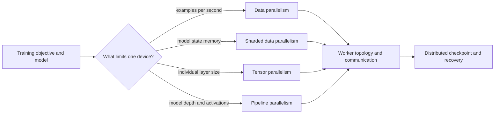
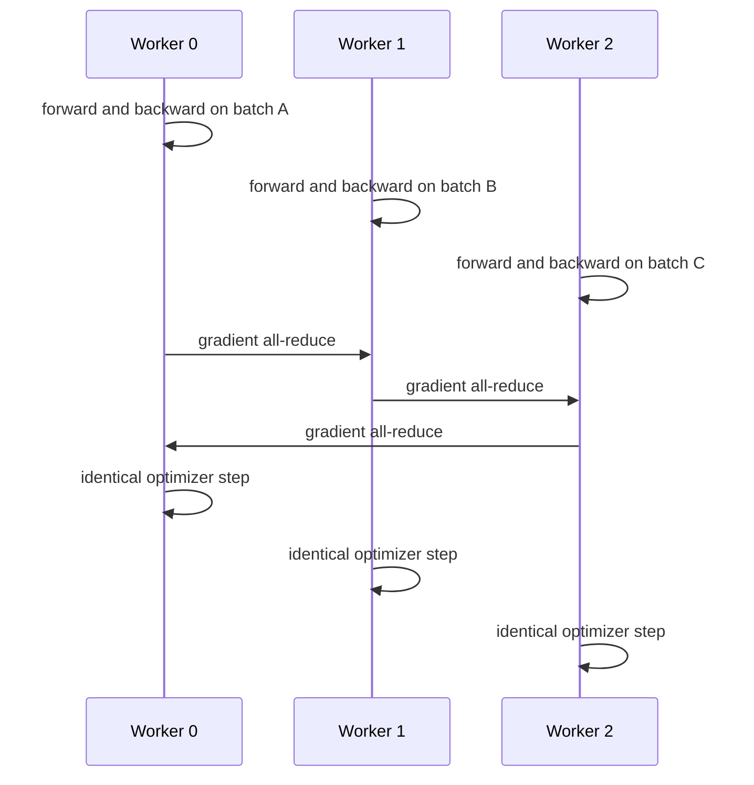
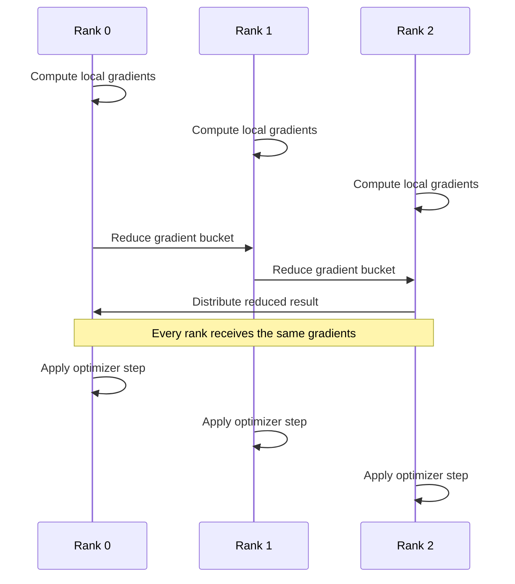
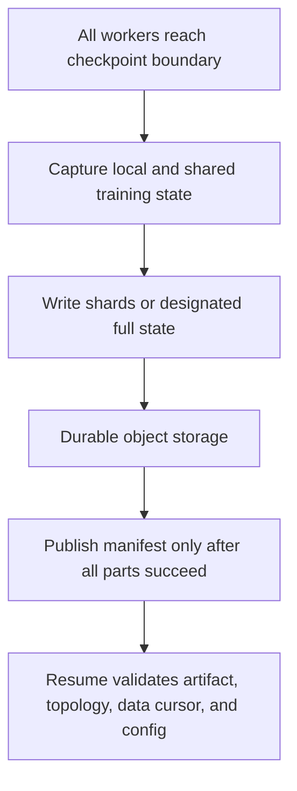

## Distribution Changes the Training System

<!-- section-summary: Distributed training coordinates several workers to optimize one model when one device is too slow or cannot hold the training state. -->

A single-device training job has one process, one model state, one stream of batches, and one failure boundary. **Distributed training** spreads the work across several processes or devices while trying to preserve the meaning of one optimization run. It is useful for two different reasons:

- **throughput scaling:** the model fits on one device, but one worker cannot process enough examples within the training window;
- **memory scaling:** the model, optimizer state, gradients, or activations do not fit on one device.

These needs lead to different parallelism strategies. Adding workers before identifying the constraint can increase cost without reducing completion time, or can silently change learning behaviour through a larger global batch.



The framework of this article is therefore strategy, topology, communication, data semantics, optimization semantics, checkpointing, and operations. PyTorch DistributedDataParallel is a concrete example of the most common first strategy, not the definition of distributed training itself.

## Choose the Parallelism Strategy From the Constraint

<!-- section-summary: Data, sharded, tensor, and pipeline parallelism divide different parts of the training state and create different communication patterns. -->

**Data parallelism** keeps a full model replica on each worker. Workers process different batches and synchronize gradients. It fits when the model and optimizer fit on each device and data throughput is the main constraint.

**Sharded data parallelism** divides parameters, gradients, and optimizer state across workers, gathering pieces when computation needs them. PyTorch Fully Sharded Data Parallel (FSDP) is one implementation. It reduces per-device state memory in exchange for more frequent communication and more complex checkpoints.

**Tensor parallelism** splits operations within large layers across devices. It helps when a layer is too large or expensive for one device, but requires high-bandwidth, low-latency communication and topology-aware placement.

**Pipeline parallelism** assigns consecutive groups of layers to stages and sends micro-batches through them. It reduces per-device model and activation load but introduces stage balancing, scheduling, and idle **pipeline bubbles**.

Large training systems combine strategies across dimensions. Hybrid designs can scale further, but they multiply configuration, communication, checkpoint, and failure complexity. Start with the simplest strategy that solves the measured constraint.

## Data Parallelism: One Model, Different Batches

<!-- section-summary: Data-parallel workers compute local gradients on different data, then combine them so every replica applies the same update. -->

In synchronous data parallelism, each worker begins a step with matching model parameters. Each reads a different mini-batch, performs the forward and backward pass, and computes local gradients. A collective communication operation combines those gradients—commonly an **all-reduce**, which reduces values across workers and returns the result to all of them. Each worker then applies the same optimizer update.



PyTorch DistributedDataParallel (DDP) wraps a model and synchronizes gradients during backward computation. It typically overlaps communication with computation by reducing each gradient bucket as soon as it is ready. The speedup depends on model compute, gradient volume, network bandwidth and latency, bucket behaviour, and whether workers remain balanced.

A slow worker is a **straggler** because synchronous workers wait at collective operations. Stragglers can come from uneven inputs, storage delays, hardware faults, background contention, or different preprocessing cost. Median step time can look healthy while tail step time limits the whole job.

## Ranks Describe the Worker Topology

<!-- section-summary: Global rank, local rank, world size, and process groups identify who participates in each collective operation. -->

Each process receives a **global rank**, a unique number in the job. **World size** is the number of participating processes. **Local rank** identifies a process on one node and commonly maps it to a local GPU. A **process group** names the workers participating in a set of collectives.

A launcher such as `torchrun`, a Kubernetes training operator, or a managed training service creates processes and supplies rendezvous information. **Rendezvous** is the step where workers discover each other and agree on membership before forming the communication group.

The training code should not hard-code ranks or node addresses. It reads them from the launcher environment, initializes the process group, binds the process to the correct device, and destroys the group cleanly. Launch configuration should be stored with the run:

```yaml
distributed:
  strategy: ddp
  nodes: 4
  processes_per_node: 8
  world_size: 32
  backend: nccl
  rendezvous: c10d
training:
  per_worker_batch: 16
  gradient_accumulation_steps: 2
  global_batch: 1024
```

The global batch follows `per-worker batch × world size × accumulation steps`. If this value changes, the optimization problem changes even when the dataset and model code do not.

## Preserve Data Semantics Across Workers

<!-- section-summary: Workers need disjoint, deterministic data partitions and coordinated epoch behaviour. -->

Every data-parallel worker should receive a different subset for a step. A distributed sampler or sharded input pipeline partitions the dataset by rank and world size. If every worker reads the same records, the cluster repeats the same signal while pretending to increase effective batch size.

Shuffling must remain coordinated. Workers usually share an epoch-dependent seed, then derive rank-specific partitions. Call the sampler’s epoch update at the start of each epoch so order changes consistently. Record dataset manifest, sampler version, seed policy, world size, dropped or padded samples, and steps completed.

World-size changes can affect which examples appear together, the number of steps, padding, and augmentation randomness. Exact replay after scaling may require the original topology and sampler state. If exact replay is not guaranteed, define acceptable metric tolerance rather than claiming bit-for-bit reproducibility.

Input imbalance can create stragglers. Variable-length sequences, expensive augmentations, corrupt files, or uneven shards make some workers slower. Use length-aware batching or balanced shards carefully, and measure data wait separately from compute and collective time.

## Scaling Changes Optimization Semantics

<!-- section-summary: A larger world size usually changes global batch size, step count, and possibly the learning-rate schedule. -->

Suppose one GPU uses a batch of 32. Eight workers with the same per-worker batch produce a global batch of 256. The optimizer now sees fewer updates per epoch and a lower-variance gradient estimate. That can change convergence and generalization.

Possible responses include adjusting the learning rate, warm-up, schedule, gradient accumulation, or per-worker batch. None is universally correct. Compare training and validation curves under a controlled experiment. Record effective global batch, optimizer, learning-rate schedule, accumulation, loss scaling, and precision with every result.

Distributed numeric reduction also changes operation order. Floating-point addition is not associative, so small differences can appear even with fixed seeds. Mixed precision and hardware kernels add more variation. Reproducibility should specify tolerances and outcome gates appropriate to the task.

## Communication Determines Scaling Efficiency

<!-- section-summary: Distributed speedup depends on useful compute relative to synchronization, data movement, and waiting. -->

Ideal linear scaling is rare. If one worker processes 100 samples per second, eight workers will usually deliver fewer than 800 because communication and coordination consume time. **Scaling efficiency** compares observed throughput with the ideal multiplier.

Measure step time as data loading, forward compute, backward compute, collective communication, optimizer, and checkpoint work. GPU traces and communication profiling can reveal whether collectives overlap compute or force long stalls. For NVIDIA GPU clusters, NCCL is the common collective backend; its performance depends on driver, CUDA, NCCL version, interconnect, network fabric, topology, and interface selection.

Use topology-aware placement. Workers that communicate heavily may need the same high-bandwidth network domain. Network policies, firewalls, incorrect interfaces, DNS, or mismatched libraries can cause hangs that look like training-code failures. Keep NCCL debug output for diagnosis, but do not leave extremely verbose settings enabled by default in high-volume runs.

The central collective in synchronous data parallelism is usually **all-reduce**. Each worker starts with its local gradients; the collective combines them and returns the same reduced result to every worker. No single worker is conceptually “the trainer” after that point. If one rank contributes a different tensor shape, skips the collective, or fails, the others cannot complete the same logical step.

Implementations commonly group gradients into buckets so communication can begin while backpropagation is still computing earlier layers. This **overlap** can hide part of the network cost. Buckets that are too small create overhead; buckets that are too large delay communication until late in the step. The useful measurement is a step timeline showing data wait, forward compute, backward compute, exposed collective time, and idle waiting—not GPU utilization alone.



The runtime may use a ring, tree, or hardware-aware algorithm; the simplified sequence shows the dependency. A straggler affects everyone because the collective cannot preserve one optimizer step if ranks advance independently.

Scale only while completion time and cost improve enough to justify more devices. The best worker count is an economic and scheduling decision, not the largest allocation available.

## Checkpoint the Whole Distributed State

<!-- section-summary: Recovery needs model, optimizer, scheduler, scaler, sampler, and progress state in a format compatible with the parallelism strategy. -->

A weights-only checkpoint can support inference but may not resume training faithfully. A resumable checkpoint often includes model state, optimizer state, learning-rate scheduler, mixed-precision scaler, epoch and step, sampler or data cursor, random-number generator states, and run configuration.

With DDP, every worker holds the full model, so one designated rank can often write a consolidated checkpoint while all workers coordinate around it. Sharded strategies may write one shard per rank plus metadata or use a distributed checkpoint API that can reshard during load.



Write to temporary locations and publish a completion manifest only after all required parts are durable. Otherwise, a job may discover a half-written checkpoint and fail again during recovery. Test restore on a separate run and compare the next steps with a continuous baseline.

## Treat Failure as a Group Event

<!-- section-summary: Synchronous jobs usually cannot make progress when one worker disappears, so the runtime needs coordinated restart and idempotent recovery. -->

In synchronous training, a lost worker can leave others blocked in a collective. The launcher or operator needs to detect failure, terminate or re-form the group, and restart from a known checkpoint. **Elastic** training can support membership changes under specific constraints, but it does not make arbitrary training state automatically correct after topology changes.

There are two different recovery promises. **Fault-tolerant restart** brings the same topology back from a durable checkpoint. **Elastic membership** permits the world size to change. The second promise is harder because sampler position, global batch size, scheduler progress, and optimizer interpretation can all move. A runtime that can technically reform a process group has not automatically preserved the experiment.

For most first production systems, restart the complete worker group from the last committed checkpoint with the same world size. Use changing membership only when the training algorithm and scheduler explicitly support it, and record membership epochs as part of the run. Duplicate data after restart or a changed global batch can otherwise produce a completed artifact whose lineage looks normal but whose optimization path is no longer the reviewed one.

Retries should use the same run identity with a new attempt number. Metrics, artifacts, and checkpoints need idempotent naming so a retry does not masquerade as an independent experiment. Bound retries and surface persistent infrastructure failures rather than consuming a GPU queue indefinitely.

Multi-worker jobs also need coordinated scheduling. Starting some workers while the rest wait can hold expensive GPUs without making progress. Gang scheduling or queue systems such as Kueue can admit the required resources together. Quotas and priorities should protect production and interactive workloads from one oversized training request.

## What a Production Distributed Run Records

<!-- section-summary: A mature distributed run preserves strategy, topology, optimization, software, hardware, data, and recovery evidence. -->

A production run records parallelism strategy, ranks and world size, global batch calculation, sampler and dataset manifest, optimizer and schedule, precision, checkpoint format, and restore test. It also records image digest, framework, driver, CUDA and collective-library versions, hardware and network topology, worker events, step-time breakdown, scaling efficiency, cost, and failure attempts.

Start with a single-worker baseline. Validate a small multi-worker smoke run, then scale through measured worker counts while watching convergence, throughput, communication, and cost. Distributed training is successful when several workers produce one trustworthy and recoverable optimization run—not merely when all GPUs show activity.

## References

- [PyTorch distributed overview](https://docs.pytorch.org/tutorials/beginner/dist_overview.html)
- [PyTorch DistributedDataParallel](https://docs.pytorch.org/docs/stable/generated/torch.nn.parallel.DistributedDataParallel.html)
- [PyTorch torchrun](https://docs.pytorch.org/docs/stable/elastic/run.html)
- [PyTorch Fully Sharded Data Parallel](https://docs.pytorch.org/docs/stable/fsdp.html)
- [PyTorch distributed checkpoint](https://docs.pytorch.org/docs/stable/distributed.checkpoint.html)
- [PyTorch DistributedSampler](https://docs.pytorch.org/docs/stable/data.html#torch.utils.data.distributed.DistributedSampler)
- [NVIDIA NCCL documentation](https://docs.nvidia.com/deeplearning/nccl/user-guide/docs/)
- [Kubernetes Jobs](https://kubernetes.io/docs/concepts/workloads/controllers/job/)
- [Kueue all-or-nothing scheduling](https://kueue.sigs.k8s.io/docs/tasks/manage/setup_wait_for_pods_ready/)
- [Ray Train PyTorch guide](https://docs.ray.io/en/latest/train/getting-started-pytorch.html)
