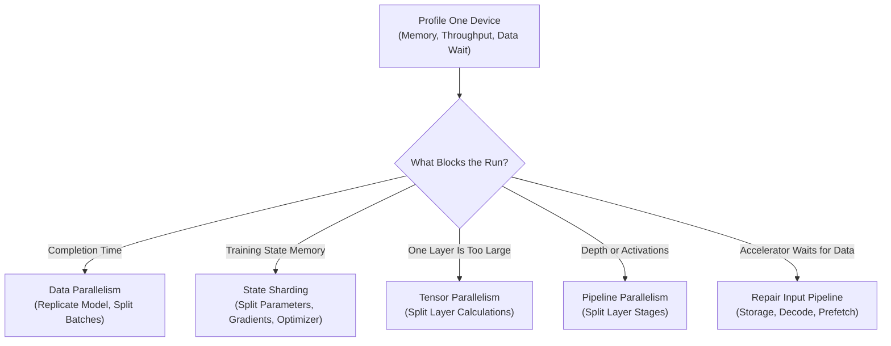
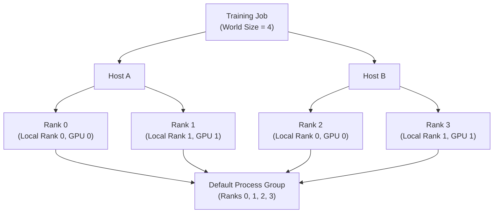
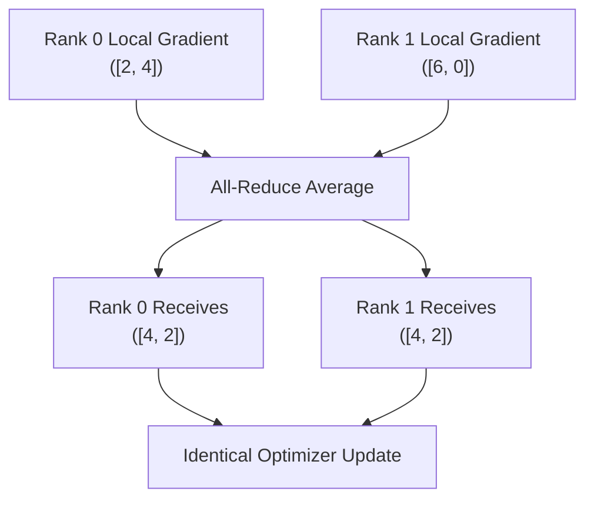
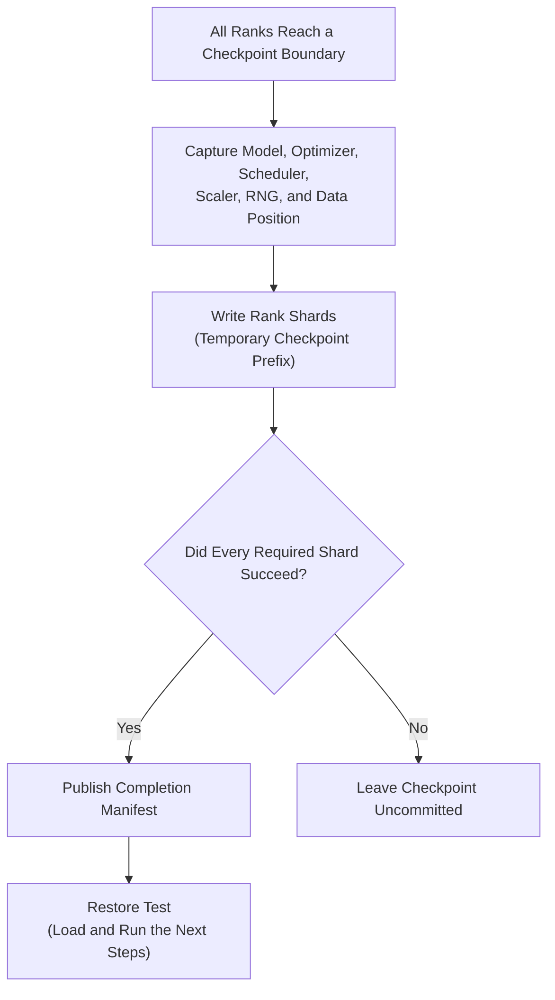

## Table of Contents

1. [What Distributed Training Means](#what-distributed-training-means)
2. [Start With the Single-Device Limit](#start-with-the-single-device-limit)
3. [Learn How Distributed Workers Are Identified](#learn-how-distributed-workers-are-identified)
4. [Understand How Workers Exchange Results](#understand-how-workers-exchange-results)
5. [Choose What To Divide Across Devices](#choose-what-to-divide-across-devices)
6. [Start By Splitting Data Across GPUs](#start-by-splitting-data-across-gpus)
7. [Give Each Worker A Different Part Of The Data](#give-each-worker-a-different-part-of-the-data)
8. [Keep Batch Size And Optimizer Behavior Consistent](#keep-batch-size-and-optimizer-behavior-consistent)
9. [Measure Communication Delays And Slow Workers](#measure-communication-delays-and-slow-workers)
10. [Split Training State Across GPUs To Reduce Memory Use](#split-training-state-across-gpus-to-reduce-memory-use)
11. [Split Very Large Models Across GPUs](#split-very-large-models-across-gpus)
12. [Understand The Different Jobs Of DeepSpeed And Ray Train](#understand-the-different-jobs-of-deepspeed-and-ray-train)
13. [Save Everything Needed To Resume Distributed Training](#save-everything-needed-to-resume-distributed-training)
14. [Restart The Worker Group After A Failure](#restart-the-worker-group-after-a-failure)
15. [Measure Scaling Efficiency](#measure-scaling-efficiency)
16. [How Managed Platforms Run Distributed Training](#how-managed-platforms-run-distributed-training)
17. [The Main Idea](#the-main-idea)
18. [References](#references)

## What Distributed Training Means
<!-- section-summary: Distributed training coordinates several worker processes so they complete one optimization run whose data, updates, checkpoints, and recovery remain trustworthy. -->

**Distributed training is the practice of using several processors or accelerators to train one model.** The devices may share the examples, the model state, the calculations inside a layer, or different sections of the model. They still have to agree on one sequence of optimizer updates and produce one recoverable result.

You can think of the workers as a team solving the same calculation. Giving each person a separate page can make the work faster. Splitting one very large page across several people can solve a memory problem. In both cases, the pieces must be combined in the correct order. A duplicated page, a missing result, or an old checkpoint changes the answer.

This coordination is the part that makes distributed training more than “use more GPUs.” The system has to answer six questions:

1. What prevents one device from completing the run?
2. Which data or model state should each worker hold?
3. What information must the workers exchange?
4. Does the distributed step still mean the same thing mathematically?
5. What state is needed to resume after a failure?
6. Did the extra devices improve time, cost, and model quality enough to justify them?

Consider a training job that takes five days on one GPU, even though the model fits comfortably in memory. The release window allows one day. Splitting each global batch across eight GPUs is a sensible experiment because throughput is the limit. Now consider a much larger model that runs out of memory before the first optimizer step. Eight ordinary data-parallel replicas would create eight copies of the same oversized state. This second problem needs sharding across devices.

A sound distributed design identifies the limit first, then defines how work is divided, which training semantics must remain stable, and how communication, checkpointing, recovery, and measurement keep the run trustworthy.

## Start With the Single-Device Limit
<!-- section-summary: The first design decision identifies whether the run is limited by time, model state, a single layer, activations, or input delivery. -->

A single accelerator can fall short for several reasons. The model may fit but finish too late. Its parameters may fit while gradients and optimizer state overflow memory. One large layer may exceed the device limit. Activations may consume most of the memory during long-sequence training. The input pipeline may also starve the accelerator, which means extra GPUs would spend more time waiting for data.

Start with evidence from a representative single-device run. Record peak device memory, examples or tokens per second, data-loading time, forward and backward time, optimizer time, and the estimated completion time. A memory snapshot should separate parameters, gradients, optimizer state, and activations because each category points toward a different remedy.


```mermaid
flowchart TD
    A["Profile One Device<br/>(Memory, Throughput, Data Wait)"] --> B{"What Blocks the Run?"}
    B -->|"Completion Time"| C["Data Parallelism<br/>(Replicate Model, Split Batches)"]
    B -->|"Training State Memory"| D["State Sharding<br/>(Split Parameters, Gradients, Optimizer)"]
    B -->|"One Layer Is Too Large"| E["Tensor Parallelism<br/>(Split Layer Calculations)"]
    B -->|"Depth or Activations"| F["Pipeline Parallelism<br/>(Split Layer Stages)"]
    B -->|"Accelerator Waits for Data"| G["Repair Input Pipeline<br/>(Storage, Decode, Prefetch)"]

    class A evidence
    class B decision
    class C,D,E,F,G strategy
```

This diagnosis also prevents a common cost mistake. If one GPU spends 45 percent of each step waiting for storage and preprocessing, four GPUs can create four times the demand on the same bottleneck. The first improvement may be data caching, parallel decoding, larger read buffers, or prefetching. Distribution should solve the measured limit.

Before moving to multiple machines, test multiple GPUs inside one machine. GPUs connected through NVLink or another high-bandwidth local fabric usually communicate faster than GPUs connected across hosts. A single multi-GPU node also removes part of the network, scheduling, and failure complexity. Use multi-node training after the local node can no longer meet the memory or completion target.

## Learn How Distributed Workers Are Identified
<!-- section-summary: A distributed runtime gives each worker an identity, a device, and membership in one or more communication groups. -->

Distributed frameworks use a small set of terms to describe who is doing the work. These identities tell you which process owns a GPU, which ranks must communicate, and which worker produced a log or failure.

### Identify Each Worker And Process

A **worker** is one participant in the training job. In PyTorch GPU training, a worker is usually a separate operating-system **process** running the training program on one GPU. Separate processes isolate device contexts and allow every GPU to execute the same program with different data.

A **rank** is the worker's unique number across the whole job. If a job has eight workers, their global ranks are usually 0 through 7. **World size** is the total number of workers in that group, so the world size is 8 in this example.

A **local rank** identifies the process inside one machine. Suppose two machines each have four GPUs. Global rank 5 might have local rank 1, which maps it to the second GPU on the second machine. Global rank identifies the worker across the job; local rank selects the device on its current host.

A **process group** is a set of ranks allowed to communicate through collective operations. Ordinary DDP commonly uses one group containing the whole world. Hybrid training can create smaller groups: one group for tensor parallelism inside a node and another for data-parallel synchronization across nodes.


```mermaid
flowchart TD
    A["Training Job<br/>(World Size = 4)"] --> B["Host A"]
    A --> C["Host B"]
    B --> D["Rank 0<br/>(Local Rank 0, GPU 0)"]
    B --> E["Rank 1<br/>(Local Rank 1, GPU 1)"]
    C --> F["Rank 2<br/>(Local Rank 0, GPU 0)"]
    C --> G["Rank 3<br/>(Local Rank 1, GPU 1)"]
    D --> H["Default Process Group<br/>(Ranks 0, 1, 2, 3)"]
    E --> H
    F --> H
    G --> H

    class A job
    class B,C host
    class D,E,F,G worker
    class H group
```

### Connect The Workers Into One Group

Before communication can begin, the workers need to find one another and agree on group membership. This step is called **rendezvous**. A launcher such as `torchrun` starts the processes. It supplies `LOCAL_RANK`, `RANK`, and `WORLD_SIZE`, along with the coordinator address and port. The training program reads those values instead of hard-coding a machine name or GPU number.

Rank 0 often handles coordination work such as logging one summary or publishing a consolidated artifact. Rank 0 is still a normal participant in training. If it disappears during a synchronous collective, the other ranks cannot continue as if the optimizer step were complete.

## Understand How Workers Exchange Results
<!-- section-summary: Collective operations move tensors across a process group so every worker receives the information required for the next calculation. -->

A **collective** is one communication operation performed by an entire process group. Every participating rank calls a compatible operation in the same logical order. The runtime then moves and combines tensors across the devices.

### Four Common Collective Operations

Four collectives appear often in distributed training:

- **All-reduce** combines a value from every rank and returns the combined result to every rank. DDP uses it to synchronize gradients.
- **All-gather** collects shards from the ranks so each participant can see the full value. Sharded training uses it before a layer needs full parameters.
- **Reduce-scatter** combines values and leaves each rank with one shard of the result. Fully sharded training uses it to keep gradient shards distributed.
- **Broadcast** sends one rank's value to the rest of the group. It can distribute initial state or a small coordination value.

### See How Two Workers Average Gradients

Suppose rank 0 calculates the local mean gradient `[2, 4]` and rank 1 calculates `[6, 0]`. Averaging the two local gradients gives `[4, 2]`. Both workers receive `[4, 2]`, so identical optimizers starting from identical parameters apply the same update.


```mermaid
flowchart TD
    A["Rank 0 Local Gradient<br/>([2, 4])"] --> C["All-Reduce Average"]
    B["Rank 1 Local Gradient<br/>([6, 0])"] --> C
    C --> D["Rank 0 Receives<br/>([4, 2])"]
    C --> E["Rank 1 Receives<br/>([4, 2])"]
    D --> F["Identical Optimizer Update"]
    E --> F

    class A,B local
    class C collective
    class D,E result
    class F update
```

The example assumes equal local batch sizes and a mean loss on each worker. If rank 0 averages two examples while rank 1 averages six, averaging the two local gradients gives each worker equal influence instead of each example equal influence. Fixed local batch sizes avoid this issue for most runs. Uneven batches require deliberate loss weighting or framework support.

Collectives also create a strict dependency. If one rank calls all-reduce for tensor A while another rank calls it for tensor B, or if one rank skips the operation after an exception, the group may hang or fail. Distributed debugging therefore compares rank-specific logs around the last completed collective, tensor shapes, and the training branch followed by each worker.

## Choose What To Divide Across Devices
<!-- section-summary: Each parallelism strategy divides a different object, so the measured memory or throughput constraint determines the useful choice. -->

At a high level, a parallelism strategy decides which object will be divided across devices. That object might be the batch, the persistent training state, the calculation inside a layer, or the model's sequence of layers. Dividing the correct object relieves the measured constraint. Dividing a different object adds communication while leaving the original limit in place.

### Four Ways To Divide The Work

**Data parallelism divides the batch.** Every worker keeps a full copy of the model and optimizer state. Each worker processes different examples, then the workers synchronize gradients. This is the usual starting point for a model that fits on one GPU and needs higher throughput.

**Model or state sharding divides the training state.** Parameters, gradients, and optimizer state are distributed across workers. Each GPU holds only part of the long-lived state, and the runtime gathers the pieces needed for current computation. PyTorch FSDP and DeepSpeed ZeRO belong to this family. This strategy helps if the full training state exceeds one device's memory.

**Tensor parallelism divides calculations inside a layer.** A large matrix multiplication or attention block is split across devices. It is useful if one layer is too large or computationally heavy for one GPU. Because workers exchange partial results inside many layers, tensor-parallel ranks usually need a fast local interconnect.

**Pipeline parallelism divides the model by layers.** Early layers run on one stage, later layers run on another, and micro-batches move through the stages. This can distribute a deep model and its activations. The stages need balanced work, and idle time appears while the pipeline fills and drains. That idle period is called a **pipeline bubble**.

Many large-model systems use a hybrid. For example, eight GPUs inside a host might form a tensor-parallel group, while several hosts form data-parallel groups. This can solve a genuine scale constraint, though it also creates multiple communication paths, several notions of rank, and a more demanding checkpoint format.

Choose the smallest combination that solves the measured problem. DDP is usually the first experiment for throughput. State sharding follows if training state memory is the limit. Tensor or pipeline parallelism enters after a layer, activation set, or full model still cannot fit efficiently.

## Start By Splitting Data Across GPUs
<!-- section-summary: DDP runs one model replica per worker, gives each replica different data, and synchronizes gradients during backpropagation. -->

PyTorch **DistributedDataParallel**, usually called **DDP**, is the standard starting point for synchronous GPU data parallelism. Each process owns one model replica and one optimizer. During the backward pass, DDP groups gradients into buckets and starts all-reduce operations as gradients become ready. Every replica then applies the same optimizer step.

### Set Up Distributed Data Parallel In Code

The important parts of a minimal training setup are visible below. The launcher provides the local rank. The process binds itself to that GPU. `DistributedSampler` gives the worker its data shard. DDP wraps the model and installs gradient-synchronization hooks.

```python
import os
import torch
import torch.distributed as dist
from torch.nn.parallel import DistributedDataParallel as DDP
from torch.utils.data import DataLoader, DistributedSampler

local_rank = int(os.environ["LOCAL_RANK"])
device = torch.device("cuda", local_rank)
torch.cuda.set_device(device)
dist.init_process_group(backend="nccl", device_id=device)

model = DDP(build_model().to(device), device_ids=[local_rank])
sampler = DistributedSampler(training_data, shuffle=True)
loader = DataLoader(training_data, batch_size=32, sampler=sampler)

for epoch in range(num_epochs):
    sampler.set_epoch(epoch)
    for features, labels in loader:
        optimizer.zero_grad()
        loss = loss_fn(model(features.to(device)), labels.to(device))
        loss.backward()
        optimizer.step()
```

### Launch One Worker Per GPU

Launchers create one process per device. A two-node job with eight GPUs on each node has a world size of 16:

```bash
torchrun \
  --nnodes=2 \
  --nproc-per-node=8 \
  --rdzv-id="$JOB_ID" \
  --rdzv-backend=c10d \
  --rdzv-endpoint="$COORDINATOR:29400" \
  train.py
```

For CUDA GPUs, PyTorch recommends NCCL as the distributed backend. A production image should pin compatible PyTorch, CUDA, driver, and NCCL versions. The launcher command, container digest, instance type, network placement, and environment variables belong in the run record because they affect reproducibility and performance.

DDP does not split input data automatically. It also does not reduce model memory because every worker holds a full replica. Those two boundaries explain why the sampler matters and why larger models eventually need a different strategy.

## Give Each Worker A Different Part Of The Data
<!-- section-summary: Data-parallel workers need disjoint, deterministic data partitions so the cluster processes the intended global batch. -->

The dataset still represents one training corpus, even though several workers read it. A **distributed sampler** maps records to ranks so each worker receives a different portion. In essence, it turns one logical stream of examples into coordinated local streams.

Suppose a dataset contains 10,000 examples and four workers train for one epoch. Each worker should process roughly one quarter of the records. If every worker reads all 10,000, the job repeats each example four times. GPU utilization may look excellent, yet the data semantics are wrong.

Shuffling also needs coordination. PyTorch's `DistributedSampler` uses the epoch as part of its deterministic shuffle. Calling `sampler.set_epoch(epoch)` gives the next epoch a new shared ordering before it is divided among ranks. Leaving out that call can repeat the same shuffle order across epochs.

Dataset sizes do not always divide evenly by world size. A sampler may drop the final records or add repeated indices so every rank executes the same number of steps. Record which policy was used. In evaluation, repeated records can bias a metric if the aggregation counts them as new observations.

Iterable and streaming datasets need extra care because no fixed index list exists for the sampler to divide. The reader often shards by rank and data-loader worker, stores a source cursor or file manifest, and defines restart behaviour. If the world size changes after recovery, the old cursor may no longer map cleanly to the new set of readers.

Variable-length examples can also create **data stragglers**. One GPU may receive short sequences while another receives several long sequences and takes twice as long. Length-aware batching or balanced input shards can reduce this gap. The batching policy must still preserve the intended sample distribution and should be stored with the run.

## Keep Batch Size And Optimizer Behavior Consistent
<!-- section-summary: World size, local batch, gradient accumulation, and loss reduction combine into the effective global batch seen by the optimizer. -->

Distribution can change the learning problem even if the model code stays the same. The key quantity is the **global batch size**: the total number of examples contributing to one optimizer update.

For equal data-parallel workers:

**global batch = per-device batch × data-parallel world size × gradient-accumulation steps**

A **per-device batch** is the number of examples one worker processes in one forward and backward pass. **Gradient accumulation** delays the optimizer update while a worker adds gradients across several local batches. The **global batch** covers every example represented in the synchronized update.

Suppose a single GPU uses a batch of 64. Moving to eight GPUs with 64 examples on each device changes the global batch to 512. The dataset now produces one eighth as many optimizer updates per epoch. The gradient has lower sampling noise, and the old learning-rate schedule may no longer produce the same convergence.

One controlled scaling experiment keeps the global batch at 64 by using eight examples per GPU. This isolates much of the systems speedup. Another experiment may deliberately increase the batch to 512 and tune learning rate, warm-up, and schedule for that regime. Both are valid studies. They answer different questions and need separate run records.

Loss reduction matters too. DDP synchronizes gradients across ranks; it has no knowledge of how many valid examples produced each local loss. Equal local batch sizes with a mean-reduced loss give the expected global mean gradient. Padding masks, dropped examples, token-level losses, or uneven local batches may require weighting by valid example or token count before synchronization.

Record at least the per-device batch, data-parallel world size, accumulation count, effective global batch, optimizer, learning-rate schedule, warm-up, precision, and loss reduction. Compare training and validation curves against the single-device baseline. Small floating-point differences are normal because collective reduction changes addition order, so reproducibility gates should use appropriate numerical and quality tolerances.

## Measure Communication Delays And Slow Workers
<!-- section-summary: Distributed speed is limited by tensor communication, network topology, input delays, and the slowest worker in each synchronous step. -->

Every distributed strategy trades local memory or compute for communication. A worker can only advance after it receives the tensors needed for the next calculation. The exposed communication time determines how much of the added hardware turns into useful speed.

DDP usually overlaps communication with backpropagation. As soon as a bucket of gradients is ready, NCCL can begin its all-reduce while the GPU continues computing gradients for earlier layers. Good overlap hides part of the network cost. Very small buckets create many launches; very large buckets delay communication until late in the backward pass.

Topology describes how the devices are connected. Communication inside one host may use NVLink or PCIe. Communication across hosts may use InfiniBand, RoCE, EFA, or ordinary Ethernet. Tensor parallelism exchanges partial values frequently and benefits strongly from the fastest local links. Data parallelism can often tolerate slower cross-host links because its collectives happen at a coarser level.

NCCL selects collective algorithms and transport paths for NVIDIA GPU clusters. Its logs can reveal the chosen network interface and communication setup. A wrong interface, blocked port, mismatched library, or weak network placement can create long stalls or hangs that resemble a training-code bug.

A synchronous step also runs at the speed of its slowest rank. That slow worker is called a **straggler**. Stragglers come from uneven sequence lengths, slow data reads, CPU preprocessing, thermal throttling, failing hardware, checkpoint writes, and other workloads sharing the host.

Measure a step as separate spans or profiler regions: data wait, forward compute, backward compute, collective communication, optimizer work, and checkpoint work. Compare p50 and p95 step time by rank. If rank 6 spends two extra seconds loading data on every step, optimizing the all-reduce will have little effect.

The useful operational response follows the evidence. Data wait points toward caching, prefetching, local storage, or balanced shards. Exposed collective time points toward topology, placement, bucket configuration, tensor sizes, or network configuration. One slow host points toward eviction, hardware inspection, or scheduler isolation.

## Split Training State Across GPUs To Reduce Memory Use
<!-- section-summary: State-sharded training reduces per-device memory by dividing parameters, gradients, and optimizer state across data-parallel workers. -->

DDP keeps full training state on every GPU. For an optimizer such as Adam, memory includes parameters, gradients, and multiple optimizer-state tensors, plus activations created during the forward pass. The optimizer state can therefore exceed the parameter memory by a large margin.

**Fully sharded data parallelism** divides that persistent state across workers. You can think of each rank as storing several pages of a large book. Before a layer runs, the ranks gather the parameter pages needed for that layer. After the calculation, the full copy can be released and the gradients reduced back into shards.

PyTorch's current per-parameter implementation is `fully_shard`, commonly called **FSDP2**. It represents sharded parameters as **DTensor** objects. A DTensor records a logical full tensor together with a `DeviceMesh` and a placement such as `Shard`, `Replicate`, or `Partial`. FSDP2 all-gathers parameters before computation, then reshards and frees the unsharded copies after computation. This lowers steady-state memory while adding communication and scheduling work.

The maturity boundary is important. PyTorch's current documentation encourages FSDP1 users to consider FSDP2, while it still labels FSDP2 as an RFC and DTensor as alpha. Teams should pin the PyTorch release, test the exact model and checkpoint path, and confirm the APIs supported by their training platform. FSDP1 remains documented and may still be the supported choice in an existing stack.

State sharding does not automatically solve activation memory. Activation checkpointing, shorter sequences, smaller micro-batches, lower precision, or activation offload may still be needed. CPU or NVMe offload expands capacity further, though it moves pressure to host memory, PCIe, and storage bandwidth. Profile step time after every memory-saving change.

## Split Very Large Models Across GPUs
<!-- section-summary: Tensor and pipeline parallelism divide computation inside or across layers after state sharding alone cannot satisfy the model constraint. -->

State sharding stores less state on each GPU, yet a layer may still need a large parameter all-gather or create an oversized activation. **Tensor parallelism** addresses this by splitting the layer's calculation itself.

For a large linear layer, one group of ranks can hold different columns or rows of the weight matrix. Each rank computes a partial result, then collectives combine or redistribute those results for the next operation. PyTorch's tensor-parallel APIs build on `DeviceMesh` and DTensor placements such as row-wise and column-wise sharding.

The communication happens inside the model's forward and backward paths, so tensor-parallel ranks are usually placed close together on high-bandwidth links. A tensor-parallel plan also follows the model architecture: attention projections, feed-forward layers, embeddings, and loss computation may need different layouts.

PyTorch currently labels `torch.distributed.tensor.parallel` experimental and `torch.distributed.pipelining` alpha. Production systems should pin the framework release and validate model support, numerical behaviour, checkpoint restore, and failure recovery before treating either API as a durable contract.

**Pipeline parallelism** places consecutive groups of layers on different stages. The input batch is divided into **micro-batches** so several stages can work at once. While stage 3 processes one micro-batch, stage 2 can process the next and stage 1 can begin another. The schedule determines forward passes, backward passes, activation storage, and communication between stages.

A pipeline has a bubble while stages fill and drain. It also slows down if one stage takes much longer than the others. Teams profile layer time and memory, then assign layers so the stages are balanced. More micro-batches can reduce the relative bubble, though they affect memory and scheduling overhead.

Tensor and pipeline parallelism are commonly combined with data parallelism or state sharding. A device mesh gives each dimension a role, such as `tp=8` inside a host and `dp=16` across hosts. This scale demands topology-aware placement and a checkpoint format that understands every sharding dimension.

## Understand The Different Jobs Of DeepSpeed And Ray Train
<!-- section-summary: DeepSpeed supplies memory and parallelism strategies, while Ray Train supplies worker orchestration around an underlying framework such as PyTorch. -->

Framework names can make distributed training look like a list of competing products. Their responsibilities sit at different layers: some change how tensors and state are divided, while others provision and supervise the worker processes.

### Use DeepSpeed To Reduce Memory Use

**DeepSpeed** is a distributed training system with memory, communication, and large-model optimizations. Its **ZeRO** family partitions the redundant state used by ordinary data parallelism:

- ZeRO Stage 1 shards optimizer state.
- ZeRO Stage 2 also shards gradients.
- ZeRO Stage 3 also shards model parameters and gathers them for computation.

The stages form a memory progression. A model that fits after optimizer-state sharding may use Stage 1. Stage 3 offers the largest state-memory reduction and performs more parameter communication. DeepSpeed also supports CPU and NVMe offload, which should be treated as a bandwidth tradeoff and benchmarked on the target hardware.

A focused ZeRO configuration makes the choice visible:

```json
{
  "train_micro_batch_size_per_gpu": 8,
  "gradient_accumulation_steps": 4,
  "zero_optimization": {
    "stage": 3
  }
}
```

The global batch still depends on micro-batch size, data-parallel world size, and accumulation. DeepSpeed configures the mechanism; the team still owns those optimization semantics and the checkpoint contract.

### Use Ray Train To Start And Coordinate Workers

**Ray Train** works at a different layer. `TorchTrainer` launches worker processes and creates the PyTorch distributed environment. It runs the training function on every worker and allocates resources through `ScalingConfig`. Ray's runtime then receives the reported metrics and checkpoints. The numerical strategy can still be DDP, FSDP, DeepSpeed, or a framework integration used inside that worker function.

Ray is useful if training already runs on a Ray cluster, data arrives through Ray Data, or the team wants Ray's scheduling and retry model around several training frameworks. Pin the Ray release and API generation because current documentation distinguishes the established API from the newer Ray Train V2 path.

In essence, DDP, FSDP2, and ZeRO describe how training state and communication behave. Ray Train, Kubernetes operators, and managed training services describe how worker processes receive resources, start together, report progress, and restart.

## Save Everything Needed To Resume Distributed Training
<!-- section-summary: A resumable distributed checkpoint stores every state that influences the next optimizer update and publishes only complete shard sets. -->

A model-weights file is enough for many inference tasks. Resuming training requires more. The checkpoint must recreate the state that determines the next batch, gradient, and optimizer update.

A complete training checkpoint stores the model parameters and optimizer state. It also stores the learning-rate scheduler and mixed-precision scaler so the next update uses the same numerical settings. Epoch, global step, random-number-generator state, and the sampler or streaming-data cursor recover the training position. The run configuration records how those pieces belong together. Large-model training may also need the device mesh and parallelism metadata used to interpret each shard.

DDP keeps full state on every rank, so one designated rank can often save a consolidated checkpoint after the workers reach a safe boundary. FSDP2, tensor parallelism, and ZeRO may write shards from several ranks. PyTorch Distributed Checkpoint supports distributed state dictionaries across DDP, FSDP/`fully_shard`, tensor parallelism, and combinations of these strategies.


```mermaid
flowchart TD
    A["All Ranks Reach a Checkpoint Boundary"] --> B["Capture Model, Optimizer, Scheduler,<br/>Scaler, RNG, and Data Position"]
    B --> C["Write Rank Shards<br/>(Temporary Checkpoint Prefix)"]
    C --> D{"Did Every Required Shard Succeed?"}
    D -->|"Yes"| E["Publish Completion Manifest"]
    D -->|"No"| F["Leave Checkpoint Uncommitted"]
    E --> G["Restore Test<br/>(Load and Run the Next Steps)"]

    class A,B,C state
    class D decision
    class E,G success
    class F failure
```

Write shard files under a temporary checkpoint prefix. Publish the manifest only after all required shards and metadata are durable in object storage. Readers should accept checkpoints through that manifest, so a preempted job cannot resume from a half-written set.

Restore testing is part of checkpoint validation. Start a separate run, load the checkpoint, execute several steps, and compare loss and progress with a continuous baseline. Also test the supported topology change, such as loading eight-way shards onto four workers, before relying on resharding during an incident.

## Restart The Worker Group After A Failure
<!-- section-summary: Synchronous workers recover as a group because one missing rank can leave the others blocked inside a collective. -->

A distributed worker can fail because its process crashes, its GPU resets, its host disappears, or the scheduler preempts it. The remaining workers may be blocked inside a collective and cannot know that their shared optimizer step is complete. Recovery therefore happens at the worker-group level.

PyTorch Elastic uses rendezvous for peer discovery and synchronization. Workers join a rendezvous, agree on membership, receive ranks, and form the process group. After a worker failure, the launcher stops and restarts the worker group. Progress after the latest committed checkpoint is lost.

`torchrun` can bound automatic restarts:

```bash
torchrun \
  --nnodes=2 \
  --nproc-per-node=8 \
  --max-restarts=3 \
  --rdzv-id="$JOB_ID" \
  --rdzv-backend=c10d \
  --rdzv-endpoint="$COORDINATOR:29400" \
  train.py
```

This is **fault-tolerant restart** if the group returns with the same world size. **Elastic membership** allows a range such as `--nnodes=1:4`. The second mode can resume with a different world size, which changes data partitions and possibly the global batch. PyTorch also warns that ranks are not stable across re-rendezvous, so durable state must not assume that rank 3 always represents the same host or shard.

Suppose a 16-worker job fails after step 42,900 and its latest complete checkpoint is step 42,000. The launcher restarts all workers from step 42,000. The sampler or data cursor must also return to that point. Reusing the model and optimizer while continuing the input at step 42,900 would create a training history that cannot be interpreted correctly.

Use one logical run ID with a new attempt number for each restart. Store checkpoints and metrics under idempotent names. Bound the retry count so a broken image, network policy, or checkpoint does not consume the GPU queue indefinitely.

Multi-worker jobs also benefit from coordinated scheduling. The scheduler should reserve the required worker group together; otherwise, a few allocated GPUs can wait while the rest remain queued. Kubernetes environments commonly use a training operator plus a queueing or gang-scheduling layer. Managed training services perform the same coordination behind their job API.

## Measure Scaling Efficiency
<!-- section-summary: A scaling study compares throughput, completion time, quality, and cost across worker counts using the same workload and optimization contract. -->

More devices do not guarantee a proportional speedup. Communication, input pressure, synchronization, checkpointing, and stragglers consume part of the potential gain.

Two formulas make the basic comparison clear:

**speedup(N) = throughput with N devices ÷ throughput with 1 device**

**scaling efficiency(N) = speedup(N) ÷ N**

Suppose one GPU processes 100 samples per second. Two GPUs process 185, four process 340, and eight process 560. The eight-GPU speedup is 5.6, so its scaling efficiency is 70 percent. The run finishes much sooner, but the cost per processed sample is about 21 percent higher on eight GPUs than on four if every GPU has the same hourly price.

A useful benchmark uses the same model, dataset slice, precision, input pipeline, checkpoint policy, and quality target at each worker count. Keep global batch constant for the first systems comparison, or clearly document any optimizer retuning. Include warm-up and enough steps for startup noise to become small.

Measure more than aggregate GPU utilization. Record examples or tokens per second, time to the target quality, peak memory, exposed collective time, data wait, p50 and p95 step time by rank, checkpoint duration, failure-recovery time, and total accelerator-hours.

The best cluster size is the smallest allocation that satisfies the completion objective with acceptable cost and reliability. An eight-GPU run may be worthwhile for a release deadline even at 70 percent efficiency. A routine nightly retrain may choose four GPUs because it still meets the window at lower cost.

## How Managed Platforms Run Distributed Training
<!-- section-summary: Managed training services provision workers, networks, images, logs, and storage around the same parallelism and recovery decisions. -->

At a high level, a managed training platform turns a job request into a running worker group. It finds the requested accelerator capacity and starts the selected image on each node. The service gives the workers enough connection information to form their process group. Logs and artifacts then return through the platform's storage and monitoring paths, while the job policy controls retries after a host failure.

Those services leave the learning contract in the team's hands. The training code still needs a correct data partition and global batch calculation. The team also chooses the parallelism strategy, defines the checkpoint, and compares model quality.

Amazon SageMaker AI supports framework-native distribution and its own data- and model-parallel libraries. Its current guidance recommends `ModelTrainer` for launching PyTorch and TensorFlow jobs. The AWS-optimized SMDDP collectives target SageMaker network topology, while SageMaker Model Parallel v2 adds sharded data parallelism, tensor parallelism, activation checkpointing, and offload for large-model workloads.

Vertex AI Custom Training describes the cluster through worker pools and replica counts. PyTorch code still initializes its distributed runtime from the environment created for those replicas. Vertex also offers Reduction Server for supported multi-worker all-reduce workloads.

Azure Machine Learning SDK v2 exposes distribution settings for PyTorch and DeepSpeed jobs and provisions the requested GPU cluster. Its distributed GPU guidance recommends DDP for the common data-parallel case and includes InfiniBand-aware setup for supported compute.

Databricks `TorchDistributor` launches PyTorch distributed code as a Spark job and uses `torch.distributed.run` under the hood. This is useful for teams whose data and training workflow already live on Databricks. The PyTorch program still owns DDP or another training strategy, sampler behaviour, optimization, and checkpointing.

Ray Train can serve a similar orchestration role on a Ray cluster. Kubernetes training operators do the same for Kubernetes-native environments. Choose the platform that fits the organisation's data, identity, networking, scheduling, and operations model. Then confirm its supported framework versions, accelerator types, topology controls, checkpoint storage, and restart semantics with a realistic recovery test.

## The Main Idea
<!-- section-summary: Distributed training succeeds after several workers preserve the meaning, recoverability, and economics of one optimization run. -->

Distributed training starts with a measured single-device limit. Throughput pressure usually leads to DDP. Training-state memory leads to FSDP2 or ZeRO. A layer or activation constraint may lead to tensor or pipeline parallelism. Extra strategies add communication and operational cost, so each one should solve a demonstrated problem.

The worker runtime gives every process a rank, device, and process-group membership. Collectives move gradients, parameters, and partial results between those workers. Data sharding and global-batch design preserve the learning problem. Distributed checkpoints and rendezvous make recovery possible. Scaling benchmarks show whether the additional devices improve completion time and cost while maintaining model quality.

The production standard is one trustworthy run: its data is accounted for, its optimizer semantics are explicit, its state can be restored, its failures are visible, and its scaling decision is supported by measurements.

## References

- [PyTorch DistributedDataParallel](https://docs.pytorch.org/docs/stable/generated/torch.nn.parallel.DistributedDataParallel.html)
- [PyTorch distributed communication and DeviceMesh](https://docs.pytorch.org/docs/stable/distributed.html)
- [PyTorch DistributedSampler](https://docs.pytorch.org/docs/stable/data.html#torch.utils.data.distributed.DistributedSampler)
- [PyTorch torchrun](https://docs.pytorch.org/docs/stable/elastic/run.html)
- [PyTorch rendezvous](https://docs.pytorch.org/docs/stable/elastic/rendezvous.html)
- [PyTorch FSDP2 `fully_shard`](https://docs.pytorch.org/docs/main/distributed.fsdp.fully_shard.html)
- [PyTorch DTensor](https://docs.pytorch.org/docs/stable/distributed.tensor.html)
- [PyTorch tensor parallelism](https://docs.pytorch.org/docs/stable/distributed.tensor.parallel.html)
- [PyTorch pipeline parallelism](https://docs.pytorch.org/docs/stable/distributed.pipelining.html)
- [PyTorch Distributed Checkpoint](https://docs.pytorch.org/docs/stable/distributed.checkpoint.html)
- [DeepSpeed ZeRO](https://deepspeed.readthedocs.io/en/stable/zero3.html)
- [Ray Train overview](https://docs.ray.io/en/latest/train/overview.html)
- [Ray Train checkpointing](https://docs.ray.io/en/latest/train/user-guides/checkpoints.html)
- [NVIDIA NCCL documentation](https://docs.nvidia.com/deeplearning/nccl/user-guide/docs/)
- [Amazon SageMaker AI distributed training](https://docs.aws.amazon.com/sagemaker/latest/dg/distributed-training-get-started.html)
- [Amazon SageMaker AI model parallelism v2](https://docs.aws.amazon.com/sagemaker/latest/dg/model-parallel-v2.html)
- [Vertex AI distributed training](https://cloud.google.com/vertex-ai/docs/training/distributed-training)
- [Azure Machine Learning distributed GPU training](https://learn.microsoft.com/en-us/azure/machine-learning/how-to-train-distributed-gpu)
- [Databricks TorchDistributor](https://docs.databricks.com/aws/en/machine-learning/train-model/distributed-training/spark-pytorch-distributor)
