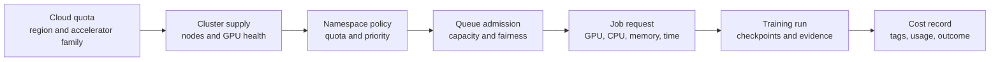

## Cost And Capacity Form One Control Chain
<!-- section-summary: A training job reaches hardware through cloud quota, cluster supply, namespace policy, queue admission, and its own resource request. -->

Training cost control is the practice of deciding which hardware a run may use, how long it may run, how it enters shared capacity, and what happens when spend or reliability crosses a limit. A cloud bill is the final result of several earlier decisions, so cost work needs to start before the scheduler launches a Pod.

Imagine **HarborLens**, a shipping company that trains a vision model to detect damaged cargo seals. Normal weekly runs use four NVIDIA L40S GPUs. A quarterly benchmark may use eight H100 GPUs after approval. The team shares a Kubernetes cluster with forecasting and document-understanding teams, and some training uses interruptible cloud instances.

HarborLens follows one capacity chain:



Each layer answers a separate question. Cloud quota says whether the account may create the hardware. Cluster supply says whether healthy nodes exist. Namespace policy limits one team's share. Queue admission decides when the full worker group can start. The job request says what one run needs. Cost records then show what the organisation received for the capacity it spent.

This map prevents common confusion. Increasing a Kubernetes `ResourceQuota` cannot create missing cloud GPU quota. Adding cloud quota cannot fix a Pending Pod whose node selector names the wrong pool. A budget alert can report spend, while it usually needs a separate automation or human decision to stop a run safely.

## Write The Run Plan Before Requesting GPUs
<!-- section-summary: A run plan records purpose, hardware, duration, checkpoint, budget, owner, and acceptance evidence before scarce capacity is admitted. -->

The first artifact is a **run plan**. It explains why the run exists and what it may consume. Routine training can use a reviewed template, while a large benchmark needs a stronger approval path.

```yaml
run_id: seal-vision-benchmark-2026-q3-01
owner: cargo-vision
reason: "Compare the approved L40S baseline with an H100 distributed run."
data_manifest: cargo-seals-2026-06-30-r3
image: registry.harborlens.example/seal-train@sha256:4a89c1e2
resources:
  workers: 8
  gpu_per_worker: 1
  gpu_class: NVIDIA-H100
  cpu_per_worker: 16
  memory_per_worker: 96Gi
limits:
  max_runtime_hours: 10
  max_gpu_hours: 80
  max_retries: 1
checkpoint:
  interval_minutes: 20
  uri: s3://harborlens-ml/checkpoints/seal-vision-benchmark-2026-q3-01/
approval:
  model_owner: cargo-vision-lead
  platform_owner: ml-platform-capacity
```

The plan uses **GPU-hours**, the number of GPUs multiplied by elapsed hours, as one easy capacity unit. Eight GPUs running for ten hours consume 80 GPU-hours. The financial cost still depends on provider, region, purchase model, node shape, storage, and network use, so the run record should capture the billing source instead of embedding a fragile price in the article or config.

Hardware choice should follow profiling. The team records model and optimizer memory, activation memory, input throughput, GPU utilisation, communication time, checkpoint size, and queue history. A larger GPU can shorten compute and still cost more per accepted candidate when the input pipeline stays idle or the queue delays the start.

The plan also names the output used to judge the spend. HarborLens expects a completed model artifact, evaluation report, runtime profile, and comparison with the L40S baseline. A failed or rejected run still records cost and failure evidence because the cluster consumed the capacity.

## Check Cloud And Cluster Capacity
<!-- section-summary: Capacity planning checks regional accelerator quota, actual node supply, software compatibility, storage, networking, and the time needed to acquire nodes. -->

Cloud providers organise accelerator limits differently. AWS uses service quotas for instance families and purchase models. Google Cloud exposes regional and project allocation quotas for accelerator resources. Azure Machine Learning applies regional quota by virtual-machine family and workspace or subscription scope. The exact quota name can change, so the platform owner should verify it in current provider documentation for the target region and account.

A useful quota request contains concrete demand:

| Field | HarborLens answer |
|---|---|
| Region | Same region as the dataset and training cluster |
| Hardware family | L40S for weekly work, H100 for approved benchmarks |
| Peak concurrency | Two four-GPU weekly jobs or one eight-GPU benchmark |
| Duration and cadence | Weekly for L40S, quarterly for H100 |
| Existing usage | Recent peak, queue time, utilisation, and failed admissions |
| Growth reason | Dataset growth and measured training-window breach |

Quota approval still leaves a cluster-supply question. The node pool needs compatible drivers, container runtime support, Kubernetes device plugins, network capacity, storage throughput, and a healthy GPU Operator configuration where the team uses it. The run packet records the GPU SKU, node pool, driver, CUDA runtime, NVIDIA Collective Communications Library (NCCL) version for distributed jobs, and container digest.

Before a large run, the platform owner checks:

```bash
kubectl get nodes -l accelerator=nvidia-h100
kubectl get pods -A -o wide | grep -i pending
kubectl get resourcequota -n cargo-vision
kubectl get events -n cargo-vision --sort-by=.lastTimestamp
```

These commands separate missing nodes, namespace limits, and scheduling failures. The cloud console or provider CLI then confirms regional quota and instance availability. Capacity review should include node acquisition time because autoscaled GPU pools can take several minutes to provision, and scarce capacity can remain unavailable even when quota exists.

## Request Resources And Join The Queue
<!-- section-summary: A job requests its real GPU, CPU, memory, and time shape, while queue admission starts the full workload only when policy and capacity allow it. -->

Kubernetes schedules GPUs as extended resources such as `nvidia.com/gpu`. A job should request the CPU and memory needed to feed those GPUs as well. An undersized CPU request can leave expensive accelerators waiting for decoding or data loading.

```yaml
apiVersion: batch/v1
kind: Job
metadata:
  name: seal-vision-weekly-2026-07-12
  namespace: cargo-vision
  labels:
    ml.harborlens/run-id: seal-vision-weekly-2026-07-12
    ml.harborlens/owner: cargo-vision
    ml.harborlens/cost-center: cargo-quality
spec:
  backoffLimit: 0
  activeDeadlineSeconds: 28800
  template:
    spec:
      restartPolicy: Never
      priorityClassName: ml-routine
      nodeSelector:
        accelerator: nvidia-l40s
      containers:
        - name: trainer
          image: registry.harborlens.example/seal-train@sha256:4a89c1e2
          resources:
            requests:
              cpu: "12"
              memory: 64Gi
              nvidia.com/gpu: "1"
            limits:
              cpu: "12"
              memory: 64Gi
              nvidia.com/gpu: "1"
```

`activeDeadlineSeconds` limits elapsed job time at the Kubernetes layer. The training code should still handle termination, upload the latest valid checkpoint, and mark the run incomplete. `backoffLimit: 0` prevents the Job controller from automatically spending another full run after failure; the workflow can decide whether the failure qualifies for the one approved retry.

A namespace `ResourceQuota` caps aggregate requests. A shared fleet also needs admission and fairness. **Kueue** is a Kubernetes-native batch queue that can admit workloads against quotas and resource flavours. It helps a multi-worker job wait until its required capacity can start together, rather than letting one distributed data parallel (DDP) worker occupy a GPU while the remaining workers stay Pending.

Priority should express business need. Routine retraining, release-blocking fixes, exploratory searches, and quarterly benchmarks need distinct queues or priority classes. High priority should require a clear owner and reason because every queue jump delays another team.

Fair admission is not always first-come, first-served. One eight-GPU job at the head of a queue can block several one-GPU jobs even when fragmented capacity could run the smaller work. A queue policy may reserve capacity by team, allow smaller jobs to backfill temporarily, or calculate fair shares over time. Backfill still needs a boundary so it releases resources when an admitted larger job can start.

Preemption is also a policy decision, not merely a scheduler feature. Evicting a low-priority job can free capacity for an urgent fix but destroy hours of compute when its last checkpoint is old. Admission needs the job's checkpoint interval, termination grace, and restartability before treating it as preemptible. Cost reporting should charge wasted recomputation to the interruption decision so discounted or high-priority capacity does not look artificially efficient.

Queue evidence should include requested and admitted resources, wait reason, age, priority, quota share, estimated duration, and checkpoint readiness. Those fields let operators distinguish true scarcity from unfair policy, an impossible resource shape, or a single blocked gang. They also make a capacity increase defensible: the organization can show sustained useful demand rather than a pile of oversized speculative requests.

## Use Interruptible Capacity Safely
<!-- section-summary: Spot, preemptible, and low-priority capacity save money only when training can checkpoint, resume, deduplicate work, and record interruptions. -->

Cloud providers offer discounted capacity that they can reclaim. AWS calls this Spot Instances, Google Cloud calls it Spot VMs, and Azure uses Spot Virtual Machines. Provider notices and eviction behaviour differ, so the current platform runbook should follow the official service documentation.

HarborLens uses interruptible nodes for routine training after the job proves four controls:

- Checkpoints include model, optimizer, scheduler, scaler, data position, and random state needed for the supported resume boundary.
- Checkpoints move to durable storage before the node disappears.
- A run ID and checkpoint pointer prevent two replacement jobs from publishing competing final artifacts.
- The retry budget counts interruptions and stops after the approved limit.

The team measures **effective cost per completed run**. A cheap hourly rate can lose its advantage when interruptions repeat long work, checkpoints take too long to upload, or scarce nodes spend most of their time pulling data. Validation and publish steps usually stay on stable capacity because they are short and control the model handoff.

## Record Cost And Enforce Budgets
<!-- section-summary: Cost records join estimated intent with measured usage, while budgets and workload controls create explicit responses before spend drifts. -->

Every run writes cost metadata to the tracking system and cloud resources. Useful fields include run ID, owner, cost centre, model, dataset, GPU class, requested GPUs, actual runtime, queue time, interruption count, outcome, and final artifact uniform resource identifier (URI).

```yaml
cost_result:
  run_id: seal-vision-weekly-2026-07-12
  requested_gpu_hours: 32
  measured_gpu_hours: 27.6
  queue_minutes: 18
  interruptions: 1
  outcome: candidate_rejected_segment_regression
  cloud_billing_tags:
    owner: cargo-vision
    cost_center: cargo-quality
    environment: ml-training
```

Cloud budget services can alert on actual or forecast spend. Kubernetes quotas and queue limits control workload admission. Training timeouts and retry limits control one run. These controls should work together because a billing alert alone may arrive after resources have already run, and an abrupt automated termination can corrupt an uncheckpointed job.

HarborLens uses three response levels. At 70 percent of the weekly GPU-hour plan, the dashboard warns the owner. At 90 percent, the queue blocks new exploratory work. At 100 percent, only release fixes and explicitly approved runs receive admission. The on-call engineer can still stop a runaway job immediately when active customer or security risk outweighs checkpoint recovery.

## Operate The Shared Fleet
<!-- section-summary: Fleet operations track queue time, utilisation, failed runs, checkpoint recovery, quota pressure, spend, and useful outcomes with named owners. -->

The shared-fleet dashboard should connect capacity and results. HarborLens watches:

| Signal | Why it matters | Response |
|---|---|---|
| Pending time by queue and GPU class | Shows missing supply or unfair admission | Review quota, priorities, node health, and demand |
| GPU and CPU utilisation | Shows whether jobs feed accelerators efficiently | Profile data loading before requesting larger hardware |
| Failure and interruption rate | Shows wasted capacity and weak recovery | Fix images, checkpoints, storage, or node pool health |
| GPU-hours by owner and outcome | Connects spend to completed, rejected, and failed runs | Review repeated low-value searches or unstable jobs |
| Quota usage and node-pool headroom | Warns before release work stalls | Request capacity with evidence or reschedule routine work |
| Checkpoint age and resume success | Proves interruptible training can recover | Move critical work to stable capacity when recovery fails |

The daily runbook starts with the layer that blocked progress. A cloud quota error goes to the cloud platform owner. A Pending Pod with available quota goes to cluster and queue evidence. A running job with low utilisation goes to the training owner. A cost spike goes to run tags, active workloads, and retry history. This routing keeps responders from changing every layer at once.

Capacity also needs cleanup. Finished Jobs, orphaned volumes, stale checkpoints, unused node pools, abandoned tuning studies, and old container images continue to create storage or operational cost. Retention rules should preserve approved models, audit evidence, and incident holds while removing temporary outputs on a known schedule.

## Putting It Together
<!-- section-summary: Controlled training cost follows one chain from run intent through quota, supply, admission, execution, checkpoints, measured usage, and outcome. -->

HarborLens controls training cost by following the capacity chain. A run plan states purpose, hardware, time, checkpoint, budget, and owner. Cloud quota allows the hardware family in the chosen region. Cluster supply provides healthy nodes and runtime compatibility. Namespace policy and Kueue manage a shared fleet. The Job declares its real resource and time shape. Checkpoints make approved interruptible work recoverable. Tags and cost records connect measured usage to the model outcome.

This framework gives every failure one layer. It also gives every large request a reason. The team can approve more capacity when data shows sustained demand and useful outcomes, improve utilisation when input work starves GPUs, or reduce experiments that repeatedly spend capacity without creating reliable evidence.

## References

- [Kubernetes: Schedule GPUs](https://kubernetes.io/docs/tasks/manage-gpus/scheduling-gpus/)
- [Kubernetes: Resource Quotas](https://kubernetes.io/docs/concepts/policy/resource-quotas/)
- [Kubernetes: Jobs](https://kubernetes.io/docs/concepts/workloads/controllers/job/)
- [Kueue overview](https://kueue.sigs.k8s.io/docs/overview/)
- [NVIDIA GPU Operator overview](https://docs.nvidia.com/datacenter/cloud-native/gpu-operator/latest/index.html)
- [NVIDIA GPU Operator platform support](https://docs.nvidia.com/datacenter/cloud-native/gpu-operator/latest/platform-support.html)
- [AWS EC2 instance type quotas](https://docs.aws.amazon.com/ec2/latest/instancetypes/ec2-instance-quotas.html)
- [AWS Spot Instance interruption notices](https://docs.aws.amazon.com/AWSEC2/latest/UserGuide/spot-instance-termination-notices.html)
- [AWS Budgets](https://docs.aws.amazon.com/cost-management/latest/userguide/budgets-managing-costs.html)
- [Google Cloud Compute Engine allocation quotas](https://docs.cloud.google.com/compute/resource-usage)
- [Google Cloud Spot VMs](https://docs.cloud.google.com/compute/docs/instances/spot)
- [Google Cloud budgets and budget alerts](https://docs.cloud.google.com/billing/docs/how-to/budgets)
- [Azure Machine Learning quotas](https://learn.microsoft.com/en-us/azure/machine-learning/how-to-manage-quotas?view=azureml-api-2)
- [Azure Spot Virtual Machines](https://learn.microsoft.com/en-us/azure/virtual-machines/spot-vms)
- [Azure Cost Management budgets](https://learn.microsoft.com/en-us/azure/cost-management-billing/costs/tutorial-acm-create-budgets)
