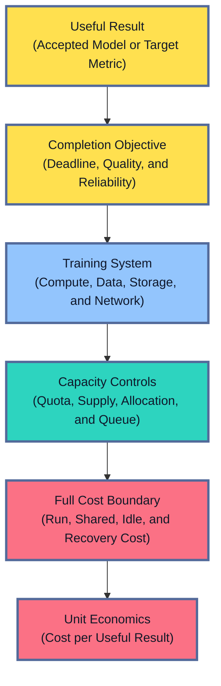
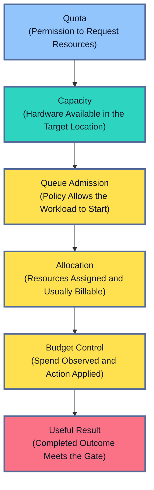
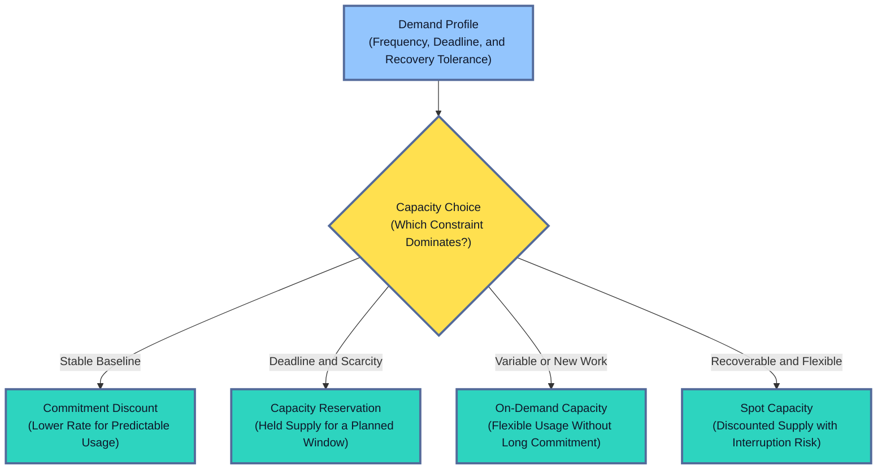
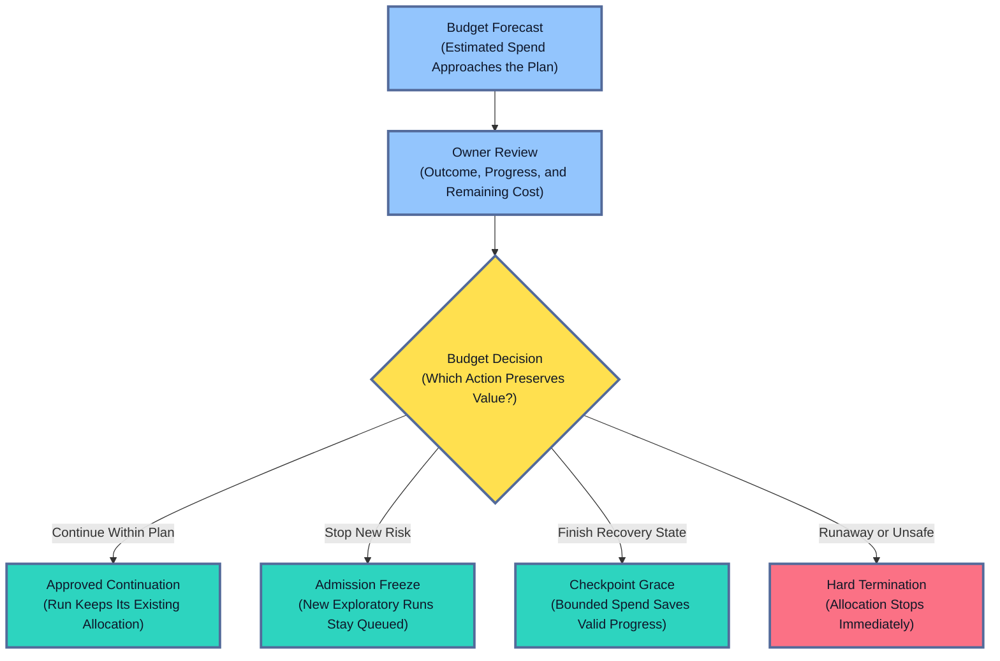
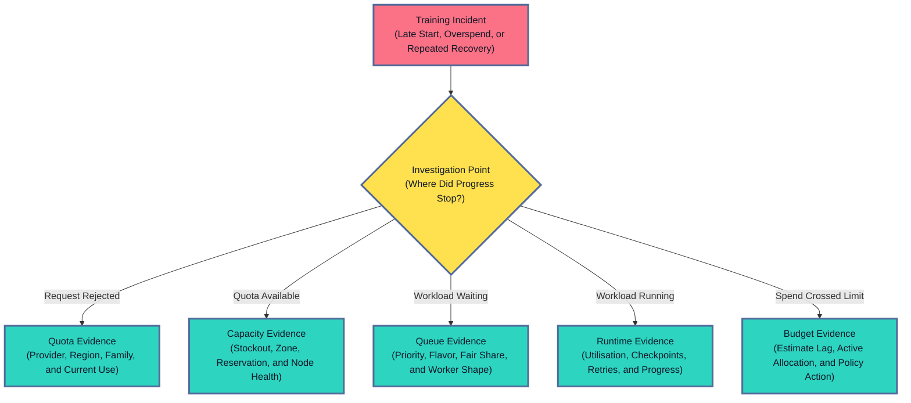

## Table of Contents

1. [What Training Cost and Quotas Mean](#what-training-cost-and-quotas-mean)
2. [Define the Unit of Useful Work](#define-the-unit-of-useful-work)
3. [Map the Full Cost Boundary](#map-the-full-cost-boundary)
4. [Separate Quota, Capacity, Allocation, Queue, and Budget](#separate-quota-capacity-allocation-queue-and-budget)
5. [Model Time to Result and Accelerator-Hours](#model-time-to-result-and-accelerator-hours)
6. [Choose Resources, Precision, and Parallelism](#choose-resources-precision-and-parallelism)
7. [Choose a Capacity and Purchase Model](#choose-a-capacity-and-purchase-model)
8. [Make Interruptible Training Recoverable](#make-interruptible-training-recoverable)
9. [Govern Cloud and Kubernetes Capacity](#govern-cloud-and-kubernetes-capacity)
10. [Attribute Spend to Training Outcomes](#attribute-spend-to-training-outcomes)
11. [Enforce Budgets Without Destroying Useful Work](#enforce-budgets-without-destroying-useful-work)
12. [Run Matched Cost and Scaling Experiments](#run-matched-cost-and-scaling-experiments)
13. [Investigate Cost and Capacity Incidents](#investigate-cost-and-capacity-incidents)
14. [Use an Operational Cost Checklist](#use-an-operational-cost-checklist)
15. [The Main Idea](#the-main-idea)
16. [References](#references)

## What Training Cost and Quotas Mean
<!-- section-summary: Training economics measures the full cost and completion time required to produce a useful model result under real capacity constraints. -->

**Training cost management is the practice of buying a useful ML result with an explicit amount of time, compute, and money.** A production retrain may count as useful after the model passes its release gate. Pretraining may use a target loss, while a tuning study may need to identify an approved configuration.

An hourly GPU price answers only one part of the problem. A lower-priced accelerator can take longer, require more devices, or wait several hours for capacity. A high-throughput cluster can also waste money. Poor data loading, frequent checkpoint pauses, or an oversized global batch may prevent it from reaching the quality target efficiently.

Cost and capacity therefore belong in one operating framework:


```mermaid
flowchart TD
    A["Useful Result<br/>(Accepted Model or Target Metric)"] --> B["Completion Objective<br/>(Deadline, Quality, and Reliability)"]
    B --> C["Training System<br/>(Compute, Data, Storage, and Network)"]
    C --> D["Capacity Controls<br/>(Quota, Supply, Allocation, and Queue)"]
    D --> E["Full Cost Boundary<br/>(Run, Shared, Idle, and Recovery Cost)"]
    E --> F["Unit Economics<br/>(Cost per Useful Result)"]

    classDef objective fill:#FFE04F,stroke:#536A9A,stroke-width:3px,color:#111827
    classDef system fill:#93C5FD,stroke:#536A9A,stroke-width:3px,color:#0F172A
    classDef control fill:#2DD4BF,stroke:#536A9A,stroke-width:3px,color:#0F172A
    classDef result fill:#FB7185,stroke:#536A9A,stroke-width:3px,color:#111827
    class A,B objective
    class C system
    class D control
    class E,F result
```

Suppose a model retrain must complete evaluation before the morning release window. Eight GPUs can finish training in six hours, yet the job normally waits four hours in a shared queue. The compute estimate says six hours. The product objective sees ten hours before evaluation even begins. Capacity planning has to include queue delay and evaluation, while cost planning has to include every allocated resource used during training and recovery.

The central question is therefore: **How much does it cost to produce an acceptable result by the required time, with a recovery path the team has tested?**

## Define the Unit of Useful Work
<!-- section-summary: A useful-work unit connects infrastructure spend to a completed training result that has passed a stated quality gate. -->

A cost metric needs a denominator. The denominator is the unit produced for the money spent. GPU-hours alone describe consumed capacity; they do not say whether the run created value.

For a routine retrain, one useful unit may be **one model candidate that completes evaluation and passes every release threshold**. For large-scale pretraining, the unit may be a fixed number of training tokens processed while reaching a target validation loss. For hyperparameter tuning, it may be one completed and comparable trial, followed by cost per winning candidate.

The quality condition matters. If ten low-cost runs all fail the segment regression gate, their cost per accepted candidate is still undefined because they produced zero accepted candidates. The spend belongs in failed-experiment or learning cost, and the team should record what decision that evidence enabled.

### Define the completion objective

A **completion objective** states how soon the result is needed and what counts as complete. “Train the model” leaves evaluation, artifact publication, and recovery outside the boundary. A stronger objective might say:

- complete training, evaluation, and registry publication within ten hours of submission;
- reach the approved validation and segment thresholds;
- preserve a resumable checkpoint no older than twenty minutes;
- keep total run cost within the approved amount.

A compact run-economics contract can travel with the pipeline configuration:

```yaml
economics:
  useful_unit: accepted_model_candidate
  completion_objective_hours: 10
  currency: USD
  max_total_cost: 1200
  checkpoint_grace_cost: 80
  hard_runtime_hours: 12
  max_recovery_attempts: 2
quality_gate:
  primary_metric_min: 0.86
  required_segments: [new_users, high_value, low_volume]
```

`checkpoint_grace_cost` reserves a small amount for a safe checkpoint and shutdown after the normal budget is exhausted. `hard_runtime_hours` protects against a stuck loop even if billing data arrives late. The quality gate gives the spend a concrete outcome.

### Separate exploration from production commitments

An exploratory run may produce useful evidence without creating a releasable model. Its useful unit can be a completed ablation or a rejected hypothesis with enough evidence to stop further spending. Production retraining has a stricter unit because it must finish evaluation and publish a governed artifact.

Using separate objectives prevents exploratory GPU-hours from appearing as failed production work. It also prevents an open-ended search from inheriting the release pipeline's capacity priority.

## Map the Full Cost Boundary
<!-- section-summary: The full cost boundary includes allocated infrastructure, platform charges, data movement, shared idle capacity, failures, and recovery work. -->

The **cost boundary** defines which charges belong to the training decision. A narrow boundary contains only accelerator runtime. A production boundary follows the complete path from queued job to evaluated artifact.

### Direct run costs

Accelerators are usually the largest direct charge. The worker also reserves CPU and memory for data loading. Datasets and checkpoints consume local or network storage, while distributed communication and cross-zone access consume network bandwidth. Managed platforms may add service units or control-plane charges on top of the underlying cloud compute.

The training image, logs, metrics, profiler traces, checkpoints, and final artifacts continue to use registry and object-storage capacity after compute has stopped. Retention policies should keep the evidence required for reproducibility and audit while expiring temporary shards and failed-run outputs.

### Shared and idle costs

A reserved GPU node incurs cost even if no workload is running on it. A Kubernetes cluster also has system Pods, networking, observability, and autoscaling overhead. Shared pools need an explicit policy for allocating those costs to teams or reporting them as platform overhead.

OpenCost provides a vendor-neutral Kubernetes allocation model. It separates workload cost, cluster idle cost, and shared overhead, and can aggregate allocation by namespace, workload, label, or annotation. For GPU workloads, allocation should follow the requested or allocated accelerator resource because the node is billed even during a data-loading stall.

### Failure and recovery costs

Failed attempts, Spot interruptions, repeated data downloads, and work since the last checkpoint consume real capacity. A retry does not erase the first attempt from the bill. Record every attempt under one logical run ID so cost per completed result includes recomputation.

Queue time has a different treatment. A queued job usually has no allocated compute charge, although it delays the result. Warm pools, persistent resources, and reservations may continue billing while the workload waits elsewhere. Completion metrics and financial metrics therefore need separate clocks.

## Separate Quota, Capacity, Allocation, Queue, and Budget
<!-- section-summary: Five different controls determine whether a job is permitted, physically available, assigned, waiting, and financially approved. -->

Several words describe “how many GPUs we have,” but they refer to different system states. Keeping them separate shortens capacity incidents.

**Quota** is the maximum amount of a resource an account, project, subscription, workspace, or namespace is allowed to request. Quota is permission. It does not prove that the provider has the hardware available.

**Capacity** is the physical supply that can satisfy the request in the selected region, zone, accelerator family, and network topology. A project may have quota for eight GPUs and still receive an insufficient-capacity error.

**Allocation** is capacity assigned to a workload. Billing for provisioned compute usually starts here, even if the training process is loading data or waiting at a distributed barrier.

**Queue** is the ordered set of approved workloads waiting for admission. A queue protects shared capacity and can apply priority, fair sharing, or all-or-nothing admission for distributed jobs.

**Budget** is the financial boundary assigned to a run, team, project, or billing scope. A budget alert reports a threshold. An admission policy, IAM action, job timeout, or human approval performs the actual control action.


```mermaid
flowchart TD
    A["Quota<br/>(Permission to Request Resources)"] --> B["Capacity<br/>(Hardware Available in the Target Location)"]
    B --> C["Queue Admission<br/>(Policy Allows the Workload to Start)"]
    C --> D["Allocation<br/>(Resources Assigned and Usually Billable)"]
    D --> E["Budget Control<br/>(Spend Observed and Action Applied)"]
    E --> F["Useful Result<br/>(Completed Outcome Meets the Gate)"]

    classDef permission fill:#93C5FD,stroke:#536A9A,stroke-width:3px,color:#0F172A
    classDef supply fill:#2DD4BF,stroke:#536A9A,stroke-width:3px,color:#0F172A
    classDef control fill:#FFE04F,stroke:#536A9A,stroke-width:3px,color:#111827
    classDef outcome fill:#FB7185,stroke:#536A9A,stroke-width:3px,color:#111827
    class A permission
    class B supply
    class C,D,E control
    class F outcome
```

Increasing namespace quota cannot create a missing cloud GPU. Purchasing a capacity reservation cannot bypass an account service quota. Raising a budget cannot fix an impossible node selector. Each control has a distinct owner and source of evidence.

## Model Time to Result and Accelerator-Hours
<!-- section-summary: Time to result includes waiting and recovery, while accelerator-hours measure the allocated devices consumed during running attempts. -->

Two measurements answer different questions. **Time to result** is the elapsed time from submission to the completed useful outcome. **Accelerator-hours** measure how much accelerator capacity the running attempts consumed.

Time to result includes queue wait, environment startup, data staging, training, checkpoint pauses, interruption recovery, evaluation, and artifact publication. A release owner cares about this full elapsed time because every stage can miss the deadline.

Allocated runtime begins after hardware is assigned and ends after it is released. It includes useful tensor computation, data waits, distributed communication, checkpointing, and recomputation after a restore. Accelerator-hours therefore measure provisioned capacity, not productive kernels.

After these terms are clear, the basic formulas are:

**accelerator-hours = allocated accelerators × allocated runtime hours across every attempt**

**time to result = queue wait + startup + running attempts + recovery gaps + evaluation and publication**

**cost per useful result = full cost boundary ÷ number of useful results**

Suppose an eight-GPU job waits two hours and then runs for five allocated hours. An interruption loses twenty minutes of progress, followed by one additional allocated hour after restart. The two attempts consume 48 GPU-hours. Time to result also includes the queue wait, restart gap, evaluation, and publication, so it exceeds the six allocated hours.

### Measure the time inside each allocated hour

Break training steps into input wait, forward compute, backward compute, collective communication, optimizer work, and checkpoint time. Low accelerator utilization can mean insufficient CPU, slow storage, uneven data, or synchronization stalls. It does not automatically justify a cheaper GPU.

For managed services, also record pending and provisioning states. SageMaker, Vertex AI, Azure Machine Learning, and Databricks use different status names. Map them to a shared lifecycle in the platform's run record: submitted, queued, provisioning, running, recovering, evaluating, and completed.

## Choose Resources, Precision, and Parallelism
<!-- section-summary: The lowest-cost configuration fits the workload, feeds the accelerator, reaches the quality target, and finishes within the objective. -->

A training job first needs enough device memory for its working state. That state includes model parameters, gradients, optimizer values, and the activations produced during a training step. Batch size and the chosen parallelism strategy change how much of that state each device holds.

Memory fit alone does not make a good training configuration. CPU workers must prepare batches quickly enough, RAM must hold the input buffers, storage must deliver data at the required rate, and the network must exchange distributed updates without leaving accelerators idle.

After fit, compare throughput and time to quality. A newer accelerator may cost more per hour and finish with fewer total accelerator-hours. A less expensive device may win for small models whose input pipeline or CPU preprocessing limits speed. Benchmark the complete training step on the intended node and interconnect.

### Use precision as a measured systems choice

**Precision** describes how many bits represent model values and calculations. FP32 offers a wide numerical range and is a common baseline. BF16 and FP16 use fewer bits, reduce memory traffic, and can use specialised accelerator units. PyTorch Automatic Mixed Precision selects lower precision for supported operations while keeping sensitive calculations at a safer precision.

A focused BF16 training region looks like this:

```python
optimizer.zero_grad()
with torch.autocast(device_type="cuda", dtype=torch.bfloat16):
    predictions = model(features)
    loss = loss_fn(predictions, labels)
loss.backward()
optimizer.step()
```

FP16 training may need gradient scaling to prevent small gradients from underflowing. BF16 has a wider exponent range and commonly avoids that scaling requirement on supported hardware. The team still compares loss curves, final metrics, overflow events, and checkpoint restore against the approved baseline.

FP8 can improve throughput and memory use for supported Transformer operations. NVIDIA Transformer Engine supports FP8 on Hopper, Ada, and Blackwell GPUs. Its value depends on model coverage, framework release, kernel path, and numerical validation. Treat FP8 as a model-and-hardware-specific optimisation with its own quality and checkpoint tests.

### Add parallelism only for a measured limit

Data parallelism can reduce completion time if the full training state fits on every device. FSDP or ZeRO can reduce per-device state memory. Tensor and pipeline parallelism solve larger model constraints but add communication and operational complexity.

Every scaling step should report throughput, exposed communication, peak memory, time to the target quality, total accelerator-hours, and full cost. More GPUs can reduce wall time while increasing cost per accepted model.

## Choose a Capacity and Purchase Model
<!-- section-summary: Commitments reduce rates, reservations secure supply, on-demand capacity handles variable work, and Spot capacity trades reliability for a discount. -->

Cloud purchase terms mix two separate benefits: price reduction and capacity assurance. A **commitment** promises a level of future usage or spend in return for a discount. A **capacity reservation** holds matching hardware for the customer. Some products combine parts of both, while others provide only one.

### Commitments cover predictable baseline usage

Savings Plans, reserved-instance discounts, and committed-use discounts suit stable demand with high utilisation. Unused commitment can still cost money. AWS and Azure distinguish these financial discounts from capacity reservations. A discounted rate therefore does not prove that a GPU will be available at launch time.

### Capacity reservations protect important windows

Reservations are useful for release-critical training, planned large-scale pretraining, or scarce accelerator families. They trade flexibility for a stronger capacity expectation and can charge for unused reserved time.

AWS provides EC2 Capacity Blocks for ML and SageMaker training plans for scheduled accelerated capacity. A SageMaker training plan can terminate a workload near the end of its reserved block. The reservation plan therefore needs enough time for a final checkpoint and orderly recovery.

Google Compute Engine reservations provide zonal capacity assurance. Vertex AI support for consuming GPU reservations in custom training is generally available. Vertex persistent resources keep a training cluster available across jobs and bill provisioned replicas even during idle periods.

Azure on-demand capacity reservations secure matching VM capacity in a region or zone. Azure Reserved VM Instances and savings plans provide billing discounts and do not by themselves guarantee capacity.

### On-demand capacity handles uncertain demand

On-demand resources suit irregular jobs, new workloads without a stable baseline, and overflow above committed capacity. They avoid a long financial commitment, yet launch still depends on quota and physical supply.

### Spot capacity handles recoverable work

AWS Spot, Google Cloud Spot VMs, and Azure Spot VMs use spare capacity that the provider can reclaim. They fit checkpointable training with flexible completion time. A blended fleet may keep the coordinator or critical workers on stable capacity. Replaceable workers can use Spot if the training framework supports that topology.


```mermaid
flowchart TD
    A["Demand Profile<br/>(Frequency, Deadline, and Recovery Tolerance)"] --> B{"Capacity Choice<br/>(Which Constraint Dominates?)"}
    B -->|"Stable Baseline"| C["Commitment Discount<br/>(Lower Rate for Predictable Usage)"]
    B -->|"Deadline and Scarcity"| D["Capacity Reservation<br/>(Held Supply for a Planned Window)"]
    B -->|"Variable or New Work"| E["On-Demand Capacity<br/>(Flexible Usage Without Long Commitment)"]
    B -->|"Recoverable and Flexible"| F["Spot Capacity<br/>(Discounted Supply with Interruption Risk)"]

    classDef input fill:#93C5FD,stroke:#536A9A,stroke-width:3px,color:#0F172A
    classDef decision fill:#FFE04F,stroke:#536A9A,stroke-width:3px,color:#111827
    classDef choice fill:#2DD4BF,stroke:#536A9A,stroke-width:3px,color:#0F172A
    class A input
    class B decision
    class C,D,E,F choice
```

## Make Interruptible Training Recoverable
<!-- section-summary: Spot savings survive real interruptions only if periodic checkpoints, durable storage, bounded retries, and tested restores prevent excessive recomputation. -->

Spot price is a potential saving. **Effective saving** is the difference in cost per completed useful result after interruption, recomputation, waiting, and failed recovery are included.

A resumable checkpoint stores more than model weights. It also records optimizer and scheduler state, training progress, the current data position, random state, and any precision scaler used by mixed-precision training. Without those values, a restarted job may repeat data, lose its learning-rate schedule, or continue along a different numerical path.

Distributed training may write one checkpoint shard per worker. A completion manifest tells the restore process that every required shard arrived successfully. Store these files in durable object storage outside the interruptible node, because its local disk may disappear with the instance.

### Choose the checkpoint interval from loss exposure

Frequent checkpoints spend more time writing state. Infrequent checkpoints risk more recomputation. Measure checkpoint duration, checkpoint size, interruption history, and storage throughput. A twenty-minute interval may be sensible for a multi-hour run if the write takes under a minute; the same interval may dominate a short job with a ten-minute checkpoint.

Provider notices are a final signal, not the primary checkpoint strategy. AWS EC2 Spot interruption notices are best effort and usually arrive two minutes before interruption. Azure Spot offers a best-effort notice of up to thirty seconds. Google Cloud's default Spot shutdown period is best effort and up to thirty seconds; its optional 120-second notice is currently Preview.

A large distributed checkpoint may not finish inside those windows. Use periodic committed checkpoints during normal training. The termination handler can stop new steps, complete a small manifest or pointer update, and report the interruption.

### Bound recovery attempts

After an interruption, the orchestrator should locate the latest complete checkpoint, acquire a supported worker topology, restore, and verify the next step. Record the previous attempt's allocated hours and the new attempt number under the same logical run ID.

Set a maximum wait and retry count. SageMaker Managed Spot Training exposes `MaxWaitTimeInSeconds` and can sync checkpoints between a local path and S3. Vertex AI Spot training can retry stockout failures, but the training application still needs checkpoints to preserve progress. Azure Machine Learning low-priority nodes can be preempted and require restartable training.

Test the interruption path before assigning routine work to Spot. Trigger a controlled termination, restore on a replacement worker group, and compare several steps with an uninterrupted baseline.

## Govern Cloud and Kubernetes Capacity
<!-- section-summary: Cloud quotas control permission, Kubernetes quotas limit tenant requests, and Kueue admits whole workloads against real accelerator pools. -->

Capacity governance needs controls at both the provider and cluster layers. The provider decides whether the account may request the resource and whether the hardware exists. Kubernetes decides which tenant and workload may use nodes already present or provisionable for the cluster.

### Verify provider quota and supply

SageMaker training quotas are regional and specific to training instance types. Reserved capacity in SageMaker training plans has additional quotas, and the training job or HyperPod quota still needs to cover the planned instance count.

Vertex AI custom-training accelerator quotas are project-and-region scoped and separate from Compute Engine quotas. Quota approval still leaves a capacity check. Reservations or persistent resources can provide stronger assurance for supported training patterns.

Azure Machine Learning compute quota is regional and divided by VM family, with subscription and optional workspace-level controls. Microsoft states that quota is a credit limit, not a capacity guarantee. Low-priority cores also use a separate quota.

A useful quota request describes the exact resource pressure instead of asking for a vague increase. State the accelerator type and count, region or zone, expected run duration, and required start window. Add measured utilisation and queue history so reviewers can see that the existing allocation is genuinely constrained.

The request should also explain how often the capacity is needed and why demand is growing. A recurring capacity window may justify a reservation, while occasional bursts may only require a quota increase and a queue policy.

### Use Kubernetes ResourceQuota for tenant ceilings

Kubernetes exposes GPUs as extended resources such as `nvidia.com/gpu`. A namespace `ResourceQuota` can cap the sum of requested GPUs, CPU, memory, Pods, and other resources. It limits a tenant's maximum request but does not order jobs, reserve nodes, or admit a multi-worker group together.

### Use Kueue for batch admission

Kueue adds queue admission around Kubernetes Jobs and supported training workloads. A namespaced **LocalQueue** points to a cluster-wide **ClusterQueue**. A **ResourceFlavor** maps a logical class such as H100 on-demand GPUs to node labels or taints. The ClusterQueue defines nominal quota, borrowing, lending, priority, and preemption policy.

Current Kueue examples use the `v1beta2` API, so teams should pin a compatible Kueue and Kubernetes release. Fair Sharing is stable in Kueue; advanced features still need their individual maturity checked before adoption.

```yaml
apiVersion: kueue.x-k8s.io/v1beta2
kind: ResourceFlavor
metadata:
  name: h100-on-demand
spec:
  nodeLabels:
    accelerator: nvidia-h100
---
apiVersion: kueue.x-k8s.io/v1beta2
kind: ClusterQueue
metadata:
  name: gpu-training
spec:
  namespaceSelector: {}
  resourceGroups:
    - coveredResources: ["nvidia.com/gpu"]
      flavors:
        - name: h100-on-demand
          resources:
            - name: nvidia.com/gpu
              nominalQuota: 16
```

A distributed job should remain queued until the required worker group can start. This avoids billing several allocated GPUs while the remaining workers stay Pending. Resource flavors can also separate on-demand and Spot pools, although fallback must preserve the job's recovery and completion objective.

Queue policy should account for useful work. Priority classes represent release impact or incident urgency. Fair-share weights prevent one tenant from consuming every borrowable GPU. Preemption policy should consider checkpoint age because evicting an uncheckpointed job can destroy more value than the incoming job creates.

## Attribute Spend to Training Outcomes
<!-- section-summary: Cost attribution joins billing records and shared-cluster allocation with run IDs, owners, datasets, attempts, and final outcomes. -->

Cost attribution answers who spent the money, which run consumed it, and what outcome the run produced. Cloud resource tags alone rarely contain enough ML context, while experiment tracking alone lacks final billed cost. Join the two through stable identifiers.

Every training attempt should carry a logical run ID, attempt ID, owner, team, cost centre, environment, model purpose, dataset version, and purchase model. Keep sensitive or personal data out of tags because billing exports and platform metadata can have broad visibility.

### Use billing exports for final cost

AWS Data Exports CUR 2.0 is the recommended detailed AWS cost export. It has a consistent schema, tag data, capacity-reservation fields, and optional EKS split cost allocation including accelerators. Google Cloud detailed billing export sends resource-level cost and labels to BigQuery. Azure Cost Management exports provide detailed cost records for analysis and chargeback.

Billing data is authoritative for invoiced cost but arrives later than runtime telemetry. Prometheus and the training platform provide near-real-time allocation and utilisation. OpenCost can attribute Kubernetes cost by a run label and include idle cost:

```bash
curl "$OPENCOST_URL/allocation/compute?window=7d&aggregate=label:ml_run_id&includeIdle=true"
```

Reconcile the fast estimate with the provider bill after discounts, credits, reservation allocation, and corrections arrive. Keep both `estimated_cost` and `billed_cost` instead of overwriting history.

### Include Databricks platform and cloud cost

Databricks records billable platform usage in `system.billing.usage`. Joining it with `system.billing.list_prices` produces list-cost estimates by job, workspace, product, or custom tag:

```sql
SELECT
  u.usage_metadata.job_id,
  u.custom_tags['team'] AS team,
  SUM(u.usage_quantity * p.pricing.effective_list.default) AS list_cost
FROM system.billing.usage AS u
JOIN system.billing.list_prices AS p
  ON u.sku_name = p.sku_name
 AND u.usage_end_time >= p.price_start_time
 AND (p.price_end_time IS NULL OR u.usage_end_time < p.price_end_time)
WHERE u.usage_metadata.job_id IS NOT NULL
GROUP BY u.usage_metadata.job_id, u.custom_tags['team'];
```

For classic Databricks compute, the DBU or platform charge covers only one part of the bill. The cloud account separately charges for virtual machines, disks, and network traffic. Shared tags connect the Databricks usage record to the provider's billing export, allowing the team to reconstruct the full run cost.

Serverless usage policies can apply attribution tags to serverless workloads. Databricks currently labels that capability Public Preview, so a production cost model should not depend on it without reviewing the maturity constraint.

Databricks compute policies can require custom tags, constrain node types and worker counts, and enforce job-oriented compute settings. They act before allocation, which makes them more useful for preventive governance than a delayed billing report.

## Enforce Budgets Without Destroying Useful Work
<!-- section-summary: Budget enforcement blocks new risk first, preserves a bounded checkpoint path, and uses hard termination for runaway or unsafe workloads. -->

A budget needs an action policy. Email alone creates awareness; it does not decide whether an active job should finish, checkpoint, or stop.

Use several thresholds with different actions. An early forecast can notify the owner and attach current completion evidence. A higher threshold can suspend new exploratory admissions. The approved limit can stop new training allocations while giving active recoverable jobs a bounded checkpoint grace. A hard runtime or runaway detector can terminate immediately.


```mermaid
flowchart TD
    A["Budget Forecast<br/>(Estimated Spend Approaches the Plan)"] --> B["Owner Review<br/>(Outcome, Progress, and Remaining Cost)"]
    B --> C{"Budget Decision<br/>(Which Action Preserves Value?)"}
    C -->|"Continue Within Plan"| D["Approved Continuation<br/>(Run Keeps Its Existing Allocation)"]
    C -->|"Stop New Risk"| E["Admission Freeze<br/>(New Exploratory Runs Stay Queued)"]
    C -->|"Finish Recovery State"| F["Checkpoint Grace<br/>(Bounded Spend Saves Valid Progress)"]
    C -->|"Runaway or Unsafe"| G["Hard Termination<br/>(Allocation Stops Immediately)"]

    classDef signal fill:#93C5FD,stroke:#536A9A,stroke-width:3px,color:#0F172A
    classDef decision fill:#FFE04F,stroke:#536A9A,stroke-width:3px,color:#111827
    classDef action fill:#2DD4BF,stroke:#536A9A,stroke-width:3px,color:#0F172A
    classDef stop fill:#FB7185,stroke:#536A9A,stroke-width:3px,color:#111827
    class A,B signal
    class C decision
    class D,E,F action
    class G stop
```

Cloud controls have different enforcement behaviour. AWS Budgets actions can apply IAM or service-control policies that deny new provisioning. They can also target selected EC2 resources. Azure budgets can notify action groups that run organisation-defined automation.

Google Cloud budget alerts provide notifications. Project spend-cap budgets can restrict new spend, although ongoing fixed resources such as compute and storage can continue accruing charges.

Databricks budgets primarily track usage and send alerts, and those notifications may arrive after the underlying usage occurred. General training control therefore needs earlier safeguards. Compute policies restrict allowed cluster shapes, and permissions control who may launch them. Job timeouts bound runtime, while workflow admission decides whether a new run may start.

Databricks provides blocking modes for specific AI Gateway and Genie budgets. Those controls do not act as a general stop mechanism for training workloads.

Billing signals can lag behind live use. Pair them with limits on allocated hours, retry attempts, worker count, and approved accelerator flavors. The controller should also check checkpoint age and be able to suspend new queue admissions. Preserve an emergency override with a named approver and an audit record.

## Run Matched Cost and Scaling Experiments
<!-- section-summary: A matched experiment changes one systems choice at a time and compares completion, quality, full cost, and recovery evidence. -->

Price calculators estimate rates. A **matched cost experiment** measures the workload under controlled conditions. Keep the code, data manifest, model initialisation, global batch, optimizer, and precision fixed. Apply the same quality gate, checkpoint policy, and evaluation path unless one of those is the variable under study.

Start with one accelerator. Test additional worker counts such as two, four, and eight. Record throughput, time to target quality, peak memory, communication, input wait, checkpoint time, allocated accelerator-hours, and billed cost. Scaling efficiency alone cannot choose the winner because a deadline may justify a higher unit cost.

Suppose four high-throughput GPUs finish an approved fine-tuning run in 3.2 allocated hours. Eight lower-cost GPUs take 5.1 hours because communication and data loading scale poorly. The second option has a lower per-GPU hourly rate and consumes 40.8 accelerator-hours, compared with 12.8 for the first option. The final decision uses the real bill, quality result, and queue delay for both configurations.

### Compare purchase models across repeated runs

Spot needs several observations because one uninterrupted run understates risk. Run controlled interruption tests and collect actual interruption rate, time since last checkpoint, restore duration, retry wait, and completion rate. Compare effective cost per completed result with on-demand.

Reservations need utilisation evidence. Measure reserved hours, used hours, idle hours, jobs delayed despite the reservation, and work that spilled to on-demand. A reservation with low utilisation can cost more than variable on-demand use even if every occupied hour looks inexpensive.

Promote a configuration only after it meets quality, completion, recovery, and cost gates. Store the benchmark environment and provider SKU with the decision because prices, availability, and framework performance change over time.

## Investigate Cost and Capacity Incidents
<!-- section-summary: Incident response identifies the failing control layer before changing quota, queue policy, workload configuration, or budget enforcement. -->

Cost incidents often arrive as a broad symptom: a run did not start, a job exceeded its budget, or Spot training kept restarting. Each symptom can come from several different controls. A quota rejection needs a different response from a regional hardware shortage. A queued job also needs a different response from a running job that has stopped making progress.

Start by locating the last stage that worked. The provider request and queue decision explain whether the job reached allocation. The allocation state then reveals whether capacity was actually created.

For a running job, inspect live training progress and the age of its latest checkpoint. Compare that evidence with the latest cost estimate under the same logical run ID. This sequence identifies the control layer that needs attention. It also prevents an unrelated quota or budget change from hiding the real failure.


```mermaid
flowchart TD
    A["Training Incident<br/>(Late Start, Overspend, or Repeated Recovery)"] --> B{"Investigation Point<br/>(Where Did Progress Stop?)"}
    B -->|"Request Rejected"| C["Quota Evidence<br/>(Provider, Region, Family, and Current Use)"]
    B -->|"Quota Available"| D["Capacity Evidence<br/>(Stockout, Zone, Reservation, and Node Health)"]
    B -->|"Workload Waiting"| E["Queue Evidence<br/>(Priority, Flavor, Fair Share, and Worker Shape)"]
    B -->|"Workload Running"| F["Runtime Evidence<br/>(Utilisation, Checkpoints, Retries, and Progress)"]
    B -->|"Spend Crossed Limit"| G["Budget Evidence<br/>(Estimate Lag, Active Allocation, and Policy Action)"]

    classDef incident fill:#FB7185,stroke:#536A9A,stroke-width:3px,color:#111827
    classDef decision fill:#FFE04F,stroke:#536A9A,stroke-width:3px,color:#111827
    classDef evidence fill:#2DD4BF,stroke:#536A9A,stroke-width:3px,color:#0F172A
    class A incident
    class B decision
    class C,D,E,F,G evidence
```

### Quota exists but hardware is unavailable

Confirm the exact region, zone, accelerator type, count, and purchase model. Check provider stockout events and autoscaler failures. The safe options are a supported alternative zone or flavor, an existing reservation, a later start, or a smaller topology that still meets the objective. A busy retry loop can create noisy failures without improving supply.

Moving to another region may violate data residency or add large transfer time and cost. Re-run the completion and cost model before changing location.

### Spot interruptions consume the saving

Group attempts by logical run ID and measure recomputation, checkpoint age, restore success, and wait for replacement capacity. Shorten the interval only if the write overhead remains acceptable. Move the job to on-demand after the retry boundary or if the release deadline no longer has enough recovery margin.

### A budget threshold fires near completion

Read live progress before stopping the job. If a valid checkpoint is recent and the run has little useful work remaining, a named owner can approve bounded continuation. If progress has stalled, stop after committing recoverable state. Freeze new exploratory admissions first so they do not compete with the recovery path.

### GPUs are allocated but mostly idle

Break down step time. Slow object storage, insufficient CPU, repeated data decoding, an imbalanced distributed worker, or long checkpoint writes can all lower utilisation. Fix the limiting path and rerun a matched benchmark before resizing the accelerator fleet.

## Use an Operational Cost Checklist
<!-- section-summary: A production checklist verifies useful outcome, cost boundary, capacity, recovery, attribution, and enforcement before and after allocation. -->

A checklist turns the cost model into repeatable admission and closure decisions. It gives the training owner and platform owner shared evidence before allocation, during active spend, and after cost reconciliation. Any exception should name its approver, scope, and expiry. This prevents a temporary deadline decision from quietly becoming the default policy.

### Before admission

- Define the useful-work unit, quality gate, completion objective, and owner.
- Estimate queue time, allocated runtime, accelerator-hours, and full cost boundary.
- Confirm provider quota, actual capacity path, region, zone, and accelerator family.
- Select commitment, reservation, on-demand, or Spot from measured demand and recovery tolerance.
- Validate the container, driver, framework, precision, batch, and parallelism configuration.
- Test checkpoint save and restore on the supported topology.
- Attach run, attempt, team, owner, cost-centre, and dataset identifiers.
- Set maximum runtime, retries, workers, spend, and checkpoint grace.

### During execution

- Monitor queue reason, allocation state, useful progress, and estimated completion.
- Track accelerator allocation and utilisation, input wait, communication, and checkpoint age.
- Record every interruption, recovery attempt, topology change, and budget action.
- Stop repeated failures after the approved retry boundary.
- Suspend new low-priority admissions before removing recovery capacity from active useful work.

### After completion

- Join all attempts into one logical run cost.
- Reconcile runtime estimates with provider billing and platform charges.
- Record accepted, rejected, failed, or cancelled outcome with the reason.
- Calculate time to result, accelerator-hours, full cost, and cost per useful result.
- Review reservation and commitment utilisation, queue delay, and idle capacity.
- Expire temporary checkpoints, volumes, logs, and pools under the retention policy.
- Update the approved resource profile only after a matched experiment supports the change.

## The Main Idea
<!-- section-summary: Training economics optimises the cost and completion time of trustworthy ML outcomes instead of chasing the lowest accelerator rate. -->

Useful training economics starts from the required result and its completion objective. The cost boundary covers the accelerator and the systems that keep it productive. It also includes storage, network traffic, platform charges, shared idle capacity, failed attempts, and recovery work.

Quota grants permission. Capacity supplies hardware. Queue policy decides admission. Allocation creates the running and usually billable resource. Budget policy decides which new risk may start and how active work should checkpoint or stop.

Commitments reduce rates for predictable demand, reservations protect scarce capacity windows, on-demand handles variable work, and Spot serves recoverable workloads. Matched experiments reveal the configuration that reaches the quality target within the required time at an acceptable total cost.

A mature platform can explain what every training run produced and how long the result took. It can also identify the capacity controls, reconstruct the complete cost, and prove whether interruption recovery succeeded.

## References

- [PyTorch Automatic Mixed Precision](https://docs.pytorch.org/docs/stable/accelerator/amp.html)
- [NVIDIA Transformer Engine](https://docs.nvidia.com/deeplearning/transformer-engine/)
- [OpenCost specification](https://opencost.io/docs/specification/)
- [OpenCost allocation API](https://opencost.io/docs/integrations/api/)
- [Kubernetes GPU scheduling](https://kubernetes.io/docs/tasks/manage-gpus/scheduling-gpus/)
- [Kubernetes ResourceQuota](https://kubernetes.io/docs/concepts/policy/resource-quotas/)
- [Kubernetes Jobs](https://kubernetes.io/docs/concepts/workloads/controllers/job/)
- [Kueue overview](https://kueue.sigs.k8s.io/docs/overview/)
- [Kueue ClusterQueue](https://kueue.sigs.k8s.io/docs/concepts/cluster_queue/)
- [Kueue ResourceFlavor](https://kueue.sigs.k8s.io/docs/concepts/resource_flavor/)
- [Kueue preemption and Fair Sharing](https://kueue.sigs.k8s.io/docs/concepts/preemption/)
- [AWS EC2 purchasing options](https://docs.aws.amazon.com/decision-guides/latest/ec2-purchasing-options-aws-how-to-choose/ec2-purchasing-options-aws-how-to-choose.html)
- [AWS EC2 Capacity Blocks for ML](https://docs.aws.amazon.com/AWSEC2/latest/UserGuide/ec2-capacity-blocks.html)
- [Amazon SageMaker AI training plans](https://docs.aws.amazon.com/sagemaker/latest/dg/reserve-capacity-with-training-plans.html)
- [Amazon SageMaker AI Managed Spot Training](https://docs.aws.amazon.com/sagemaker/latest/dg/model-managed-spot-training.html)
- [AWS Spot interruption notices](https://docs.aws.amazon.com/AWSEC2/latest/UserGuide/spot-instance-termination-notices.html)
- [AWS Data Exports CUR 2.0](https://docs.aws.amazon.com/cur/latest/userguide/what-is-data-exports.html)
- [AWS Budgets actions](https://docs.aws.amazon.com/cost-management/latest/userguide/budgets-controls.html)
- [Google Compute Engine quotas](https://docs.cloud.google.com/compute/resource-usage)
- [Google Compute Engine reservations](https://docs.cloud.google.com/compute/docs/instances/reservations-overview)
- [Google Cloud Spot VMs](https://docs.cloud.google.com/compute/docs/instances/spot)
- [Vertex AI reservations for training](https://cloud.google.com/vertex-ai/docs/training/use-reservations)
- [Vertex AI Spot training](https://cloud.google.com/vertex-ai/docs/training/use-spot-vms)
- [Google Cloud billing export to BigQuery](https://docs.cloud.google.com/billing/docs/how-to/export-data-bigquery-setup)
- [Google Cloud spend cap budgets](https://docs.cloud.google.com/billing/docs/how-to/budgets-spend-caps)
- [Azure Machine Learning quotas](https://learn.microsoft.com/en-us/azure/machine-learning/how-to-manage-quotas)
- [Azure Machine Learning cost optimisation](https://learn.microsoft.com/en-us/azure/machine-learning/how-to-manage-optimize-cost)
- [Azure capacity reservations](https://learn.microsoft.com/en-us/azure/virtual-machines/capacity-reservation-overview)
- [Azure Spot Virtual Machines](https://learn.microsoft.com/en-us/azure/virtual-machines/spot-vms)
- [Azure Cost Management](https://learn.microsoft.com/en-us/azure/cost-management-billing/costs/overview-cost-management)
- [Databricks compute policies](https://docs.databricks.com/aws/en/admin/clusters/policies)
- [Databricks cost monitoring with system tables](https://docs.databricks.com/aws/en/admin/usage/system-tables)
- [Databricks usage tags](https://docs.databricks.com/aws/en/admin/account-settings/usage-detail-tags)
- [Databricks budgets](https://docs.databricks.com/aws/en/admin/account-settings/budgets)
