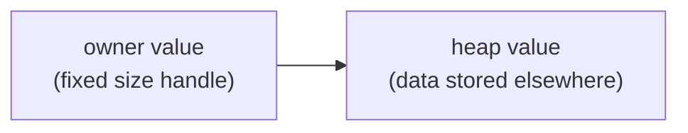

## Table of Contents

1. [The Problem](#the-problem)
2. [Stack, Heap, And Indirection](#stack-heap-and-indirection)
3. [References And Smart Pointers](#references-and-smart-pointers)
4. [Box](#box)
5. [Rc](#rc)
6. [Arc](#arc)
7. [Deref And Drop](#deref-and-drop)
8. [Putting It All Together](#putting-it-all-together)
9. [What's Next](#whats-next)

## The Problem

The notes app is no longer only a list of notes. It now has a notebook outline, shared notebook metadata, background indexing, and export jobs.

Plain ownership still works for most values, but a few designs create pressure:

- A recursive outline node needs to point to child nodes without having infinite size.
- Multiple parts of the UI need to read the same notebook metadata.
- Background work needs shared ownership across threads.

Rust's smart pointers solve these specific ownership shapes. They act like pointers, but they also own data, count owners, clean up resources, or enforce rules.

## Stack, Heap, And Indirection

A pointer-sized value is a small handle to data stored elsewhere. The handle has a fixed size, even when the data behind it is large.

That idea is called indirection: instead of storing the whole value directly inside another value, store a pointer-like handle that leads to it.



Smart pointers use indirection with ownership rules attached. `Box<T>` owns one heap value. `Rc<T>` and `Arc<T>` own through reference-counted handles. The pointer part finds the data; the smart part decides who owns it and when cleanup happens.

## References And Smart Pointers

A reference borrows data:

```rust
fn print_title(title: &str) {
    println!("{title}");
}
```

The reference does not own the string. It only points at text owned elsewhere.

A smart pointer is a value that points at other data and usually owns or manages something about that data.

| Type | Main job |
| --- | --- |
| `Box<T>` | Own one value on the heap |
| `Rc<T>` | Share ownership in one thread |
| `Arc<T>` | Share ownership across threads |

The important question is not "which pointer is advanced?" The question is "what ownership shape does this design need?"

:::expand[Smart pointers are ownership tools, not fancy references]{kind="design"}
The Rust Book describes smart pointers as data structures that act like pointers but also carry metadata or extra capabilities. That extra capability is the reason to use one.

A normal reference answers: can this function look at a value for a while?

A smart pointer answers a stronger design question:

| Question | Possible tool |
| --- | --- |
| Does this value need stable heap storage? | `Box<T>` |
| Do several owners in one thread need the same value? | `Rc<T>` |
| Do several threads need the same value? | `Arc<T>` |
| Does cleanup need to happen when the owner leaves scope? | `Drop` behavior |

The mistake is using smart pointers to avoid thinking about ownership. They do not remove ownership. They encode a different ownership policy.

If a helper only needs to read text, `&str` is still better than `Rc<String>`. If a struct should own its data directly, `String` is still clearer than `Box<String>`. Smart pointers belong where the shape of the data or sharing requires them.
:::

## Box

`Box<T>` owns a value on the heap.

```rust
let title = Box::new(String::from("Advanced Rust"));
println!("{title}");
```

For a plain `String`, this is usually unnecessary because `String` already stores its text on the heap. `Box` becomes useful when the type needs indirection.

Recursive data is the classic example. An enum cannot contain itself directly because Rust needs to know its size at compile time.

```rust
enum Outline {
    Item(String),
    Section {
        title: String,
        children: Vec<Box<Outline>>,
    },
}
```

Each child is behind a `Box`, so the vector stores fixed-size pointers to heap-allocated outline nodes. The recursive shape becomes possible because the enum no longer contains a child enum directly inside itself.

Use `Box` when you need owned indirection, not as a default wrapper.

:::expand[Why recursive types need indirection]{kind="design"}
Rust needs to know the size of every type at compile time. A directly recursive type has no finite size:

```rust
enum Outline {
    Item(String),
    Section {
        title: String,
        child: Outline,
    },
}
```

To know the size of `Outline`, Rust would need to know the size of `child: Outline`, which contains another `child: Outline`, and so on forever.

`Box` breaks that infinite calculation:

```rust
enum Outline {
    Item(String),
    Section {
        title: String,
        child: Box<Outline>,
    },
}
```

Now the `Section` variant stores a fixed-size box handle. The child outline lives on the heap. The type has a finite size because the field is a handle, not an inline copy of another full `Outline`.

This is the real reason `Box` appears in recursive examples. It is not about making code "more advanced." It gives recursive data a fixed-size edge.
:::

## Rc

`Rc<T>` means reference-counted shared ownership in a single thread.

```rust
use std::rc::Rc;

#[derive(Debug)]
struct NotebookMeta {
    name: String,
}

let meta = Rc::new(NotebookMeta {
    name: String::from("work"),
});

let sidebar = Rc::clone(&meta);
let editor = Rc::clone(&meta);

println!("{sidebar:?}");
println!("{editor:?}");
```

Cloning an `Rc` does not clone the underlying `NotebookMeta`. It creates another owner handle and increments the reference count. When the last `Rc` is dropped, the data is cleaned up.

`Rc<T>` is for single-threaded shared ownership. It does not make mutation safe by itself, and it is not thread-safe. If you need shared mutation, you will combine it with interior mutability. If you need thread-safe sharing, use `Arc<T>`.

## Arc

`Arc<T>` is atomically reference-counted shared ownership. It is the thread-safe sibling of `Rc<T>`.

```rust
use std::sync::Arc;
use std::thread;

let meta = Arc::new(String::from("work"));
let other = Arc::clone(&meta);

let handle = thread::spawn(move || {
    println!("{other}");
});

handle.join().unwrap();
```

Use `Arc` when several threads or async tasks need shared ownership of the same value.

The atomic part has a cost, so `Arc` should not replace `Rc` everywhere. Use `Rc` for single-threaded structures. Use `Arc` when sharing crosses thread or task boundaries that require thread safety.

## Deref And Drop

Smart pointers feel pointer-like because of traits.

`Deref` lets a smart pointer behave like a reference in many contexts. That is why you can call methods on the value inside a `Box<T>` or pass a boxed value where a borrowed value is expected.

`Drop` runs cleanup when a value goes out of scope.

```rust
struct TempFile {
    path: String,
}

impl Drop for TempFile {
    fn drop(&mut self) {
        println!("cleaning up {}", self.path);
    }
}
```

You do not usually implement smart pointers yourself, but understanding `Deref` and `Drop` helps explain why they feel natural to use. The pointer owns something, and Rust runs cleanup when ownership ends.

## Putting It All Together

The notes app can choose pointer types by ownership shape:

```rust
use std::rc::Rc;
use std::sync::Arc;

enum Outline {
    Item(String),
    Section {
        title: String,
        children: Vec<Box<Outline>>,
    },
}

struct NotebookMeta {
    name: String,
}

fn main() {
    let ui_meta = Rc::new(NotebookMeta {
        name: String::from("work"),
    });

    let background_meta = Arc::new(String::from("work"));
}
```

`Box` makes recursive outline nodes possible. `Rc` shares notebook metadata in one thread. `Arc` shares data with background work.

Count back to the opener:

- Recursive data needs indirection.
- Single-threaded sharing uses `Rc`.
- Thread-safe sharing uses `Arc`.
- Cleanup still follows ownership.

Smart pointers are advanced because they encode ownership policy. Use them when the policy is real.

## What's Next

`Rc` and `Arc` give shared ownership, but they do not automatically allow mutation. The next article covers interior mutability: the pattern behind `Cell`, `RefCell`, and mutex-protected state.

---

**References**

- [Smart Pointers - The Rust Programming Language](https://doc.rust-lang.org/book/ch15-00-smart-pointers.html)
- [Box - Rust standard library](https://doc.rust-lang.org/std/boxed/struct.Box.html)
- [Rc - Rust standard library](https://doc.rust-lang.org/std/rc/struct.Rc.html)
- [Arc - Rust standard library](https://doc.rust-lang.org/std/sync/struct.Arc.html)
