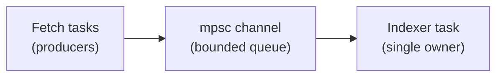

## Table of Contents

1. [The Problem](#the-problem)
2. [Message Passing](#message-passing)
3. [Messages Move Ownership](#messages-move-ownership)
4. [Bounded Channels](#bounded-channels)
5. [Shared State](#shared-state)
6. [Choosing The Shape](#choosing-the-shape)
7. [Putting It All Together](#putting-it-all-together)
8. [What's Next](#whats-next)

## The Problem

The notes app now spawns tasks. One task fetches remote notes. Another parses them. Another updates the search index. The work is concurrent, but the tasks need to coordinate.

Two common needs appear:

- Fetch tasks need to hand parsed notes to an indexer.
- Several tasks need to update a small progress counter.

Those are different communication shapes. The parsed notes should flow through a queue to one owner. The progress counter is small shared state. Rust makes you choose the shape directly instead of hiding coordination behind global mutation.

## Message Passing

Message passing means one task sends values to another task.

For many producers and one consumer, Tokio's `mpsc` channel is the common starting point.

`mpsc` means many producers, single consumer: many senders can send messages, and one receiver pulls messages out.

```rust
use tokio::sync::mpsc;

#[derive(Debug)]
struct ParsedNote {
    title: String,
}

#[tokio::main]
async fn main() {
    let (tx, mut rx) = mpsc::channel::<ParsedNote>(32);

    tokio::spawn(async move {
        while let Some(note) = rx.recv().await {
            println!("indexing {}", note.title);
        }
    });

    tx.send(ParsedNote {
        title: String::from("Async"),
    })
    .await
    .unwrap();
}
```

The sender can be cloned and moved into many tasks. The receiver owns the stream of incoming messages.



This design is useful when one task should own a resource. Instead of every task mutating the index directly, the indexer task receives commands and updates the index in one place.

## Messages Move Ownership

Sending usually transfers ownership of the message into the channel.

```rust
let note = ParsedNote {
    title: String::from("Async"),
};

tx.send(note).await.unwrap();
```

After this send, the sender cannot keep using `note`. The channel now owns the message until the receiver takes it. That is exactly what you want for work items: one task produces a value, another task becomes responsible for processing it.

If several tasks need to share the same large data, send an ID, clone an `Arc`, or design a shared owner. Do not assume channel send is a hidden copy.

## Bounded Channels

The `32` in `mpsc::channel(32)` is the channel capacity.

If producers send faster than the receiver can process, the channel stores messages up to that bound. Once the channel is full, `send(...).await` waits until space is available.

That waiting is called backpressure. It protects the program from building an unbounded pile of work in memory.

:::expand[Unbounded queues hide overload]{kind="pitfall"}
The tempting design is to make every queue unlimited so senders never wait. That can make demos feel smooth and production systems fail dramatically.

Imagine remote fetch tasks producing parsed notes faster than the indexer can write them:

```text
fetch tasks -> queue -> indexer
```

With an unbounded queue, the fetch tasks keep sending. Memory grows. Latency grows. By the time the app looks unhealthy, the real problem started much earlier.

A bounded channel makes overload visible:

```rust
let (tx, rx) = tokio::sync::mpsc::channel(32);
```

When the buffer fills, senders wait. That wait is useful information. It says the downstream task is the bottleneck.

Use the capacity as a design choice:

| Capacity too small | Capacity too large |
| --- | --- |
| Producers wait too often | Overload hides for too long |
| Lower memory use | Higher memory risk |
| Lower latency under pressure | Larger backlog under pressure |

There is no universal perfect number. Pick a bound you can explain, then watch it in real workloads.
:::

## Shared State

Sometimes several tasks need access to the same small value. For that, use shared ownership plus synchronization.

`Arc<T>` gives thread-safe shared ownership. `Mutex<T>` protects mutation.

```rust
use std::sync::Arc;
use tokio::sync::Mutex;

#[tokio::main]
async fn main() {
    let progress = Arc::new(Mutex::new(0usize));

    let mut handles = Vec::new();

    for _ in 0..3 {
        let progress = Arc::clone(&progress);

        handles.push(tokio::spawn(async move {
            let mut value = progress.lock().await;
            *value += 1;
        }));
    }

    for handle in handles {
        handle.await.unwrap();
    }

    println!("progress = {}", *progress.lock().await);
}
```

The `Arc` lets each task own a handle to the same counter. The `Mutex` ensures only one task mutates the counter at a time.

The gotcha is lock scope. Keep the locked section small. Avoid holding a lock across slow work. If a task locks shared state and then awaits a network call, other tasks may sit behind it for no good reason.

:::expand[Arc and Mutex are two separate layers]{kind="design"}
`Arc<Mutex<T>>` combines two jobs, and each job is different.

`Arc<T>` means atomically reference-counted shared ownership. It lets several tasks or threads own a handle to the same value.

`Mutex<T>` means protected interior access. It lets one task at a time lock the value and mutate it.

Together:

```rust
let progress = Arc::new(Mutex::new(0usize));
```

the `Arc` answers "how can several tasks reach the same counter?" The `Mutex` answers "how do we prevent two tasks from changing the counter at the same time?"

Leaving out either layer changes the meaning:

| Type | What is missing |
| --- | --- |
| `Mutex<T>` | One owner only; cannot easily share into many tasks |
| `Arc<T>` | Shared ownership, but no protected mutation |
| `Arc<Mutex<T>>` | Shared ownership plus exclusive mutation |

This shape is good for small shared state. For complex resources, a dedicated owner task plus messages is often easier to reason about.
:::

## Choosing The Shape

Channels and shared state solve different problems.

| Need | Good starting shape |
| --- | --- |
| One task owns a resource | Channel to owner task |
| Many tasks submit work | `mpsc` channel |
| One response to one request | `oneshot` channel |
| Small shared counter or cache | `Arc<Mutex<T>>` |
| Complex async resource | Owner task plus messages |

Tokio's tutorial gives a similar rule of thumb: simple data can be protected with a mutex, while resources that need async work often fit better behind a manager task and message passing.

:::expand[Do not hold the wrong mutex across await]{kind="pitfall"}
Async Rust has two common mutex types: `std::sync::Mutex` and `tokio::sync::Mutex`.

The async mutex is useful when a lock may be held across `.await`, but holding any lock across `.await` deserves suspicion.

This shape is risky:

```rust
let mut cache = cache.lock().await;
let remote = fetch_remote_note(id).await;
cache.insert(id, remote);
```

The task locks the cache, then waits on the network. While it waits, other tasks cannot use the cache.

Prefer doing slow work outside the lock:

```rust
let remote = fetch_remote_note(id).await;

let mut cache = cache.lock().await;
cache.insert(id, remote);
```

Now the lock protects only the mutation.

The rule of thumb is simple: make the protected section small, and make the waiting section outside it when you can. If every operation needs async work while holding exclusive access, consider a dedicated owner task and send it messages instead.
:::

## Putting It All Together

The notes app can use both patterns:

```rust
use std::sync::Arc;
use tokio::sync::{mpsc, Mutex};

#[derive(Debug)]
struct ParsedNote {
    title: String,
}

#[tokio::main]
async fn main() {
    let (tx, mut rx) = mpsc::channel::<ParsedNote>(32);
    let progress = Arc::new(Mutex::new(0usize));

    let indexer = tokio::spawn(async move {
        while let Some(note) = rx.recv().await {
            println!("indexing {}", note.title);
        }
    });

    let progress_for_fetch = Arc::clone(&progress);
    let fetcher = tokio::spawn(async move {
        tx.send(ParsedNote {
            title: String::from("Channels"),
        })
        .await
        .unwrap();

        let mut value = progress_for_fetch.lock().await;
        *value += 1;
    });

    fetcher.await.unwrap();
    indexer.await.unwrap();
}
```

The parsed note moves through a channel to the indexer. The progress counter is shared through `Arc<Mutex<_>>`.

Count back to the opener:

- Work items flow through message passing.
- Small shared values use synchronized shared ownership.
- Channel capacity creates backpressure.
- Lock scope keeps shared state from becoming a hidden bottleneck.

## What's Next

Async tasks are one concurrency tool. The next article steps down to operating system threads and the marker traits `Send` and `Sync`, which explain what Rust allows to cross thread boundaries.

---

**References**

- [Channels - Tokio](https://tokio.rs/tokio/tutorial/channels)
- [Shared state - Tokio](https://tokio.rs/tokio/tutorial/shared-state)
- [tokio::sync::mpsc - Tokio API documentation](https://docs.rs/tokio/latest/tokio/sync/mpsc/)
- [Arc - Rust standard library](https://doc.rust-lang.org/std/sync/struct.Arc.html)
- [Mutex - Tokio API documentation](https://docs.rs/tokio/latest/tokio/sync/struct.Mutex.html)
