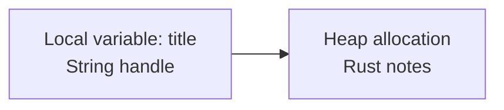

## Table of Contents

1. [What Is Program Memory?](#what-is-program-memory)
2. [The Stack](#the-stack)
3. [The Heap](#the-heap)
4. [Moves and Copies](#moves-and-copies)
5. [Pointers and References](#pointers-and-references)
6. [String and Vec](#string-and-vec)
7. [Box](#box)
8. [Memory Bugs Rust Tries to Prevent](#memory-bugs-rust-tries-to-prevent)

## What Is Program Memory?

A running program stores values in memory. Some values are small and fixed-size, such as `i32`, `bool`, and `char`. Other values need memory that can grow, such as `String` and `Vec<T>`.

If you are coming from JavaScript or Python, memory may feel mostly automatic. You create arrays and strings, and the runtime cleans up later. Rust also cleans up values automatically in safe code, but it makes ownership and borrowing visible. That visibility is why you need a basic picture of stack memory, heap memory, and pointers.

Here is a small Rust program:

```rust
fn main() {
    let count = 3;
    let title = String::from("Rust notes");

    println!("{count}: {title}");
}
```

`count` is a small integer. `title` is a `String`. The `String` value stored in the local variable contains information such as a pointer, a length, and a capacity. The actual text bytes live in heap memory.



The exact internal layout is lower-level than this diagram, but the practical point is accurate: a `String` owns heap storage through a small handle.

## The Stack

The stack stores data for active function calls. Each function call gets a stack frame. The frame holds parameters, local variables, and bookkeeping needed to return to the caller.

Small fixed-size values fit naturally on the stack:

```rust
fn main() {
    let a: i32 = 10;
    let b: bool = true;
    let c: char = 'R';

    println!("{a} {b} {c}");
}
```

These values have known sizes. An `i32` is 32 bits. A `bool` is true or false. A `char` is a Unicode scalar value.

The stack follows function calls. This program has two active functions while `double` is running:

```rust
fn double(value: i32) -> i32 {
    value * 2
}

fn main() {
    let result = double(21);
    println!("{result}");
}
```

`main` has its local values. Then `double` gets a stack frame with its parameter `value`. When `double` returns, its stack frame is gone. The returned `i32` is stored in `result`.

This is why references to local values cannot escape incorrectly. A local value inside `double` exists only while that call is active.

## The Heap

The heap stores data requested while the program runs. Heap allocation is useful when data can grow, when the size is not known at compile time, or when a type wants a stable allocation behind a small owner value.

`String` uses the heap for its text:

```rust
fn main() {
    let mut title = String::from("Rust");
    title.push_str(" notes");
    println!("{title}");
}
```

The output is:

```text
Rust notes
```

The `String` starts with enough capacity for some text. When you append with `push_str`, the string may reuse existing capacity or allocate a larger buffer. Capacity means how much space is available before another allocation is needed.

You can inspect length and capacity:

```rust
fn main() {
    let mut title = String::from("Rust");
    println!("len={} capacity={}", title.len(), title.capacity());

    title.push_str(" notes");
    println!("len={} capacity={}", title.len(), title.capacity());
}
```

Example output might look like:

```text
len=4 capacity=4
len=10 capacity=10
```

The exact capacity can vary by implementation and growth behavior. The key idea is that the string owns a heap allocation, and Rust drops that allocation when the owning string goes out of scope.

## Moves and Copies

Small types such as integers usually copy:

```rust
fn main() {
    let a = 3;
    let b = a;

    println!("{a} {b}");
}
```

Both names work because `i32` implements the `Copy` trait. Copying an integer copies the whole value.

`String` moves by default:

```rust
fn main() {
    let title = String::from("Rust notes");
    let saved = title;

    println!("{saved}");
}
```

The `String` ownership moves from `title` to `saved`. The heap text does not need to be duplicated. The small string handle moves, and `saved` becomes responsible for cleanup.

This version fails:

```rust
fn main() {
    let title = String::from("Rust notes");
    let saved = title;

    println!("{title}");
    println!("{saved}");
}
```

Rust rejects the use of `title` after the move. This prevents two ordinary owners from both trying to clean up the same heap allocation.

If you really want a second owned string, clone it:

```rust
let title = String::from("Rust notes");
let saved = title.clone();

println!("{title}");
println!("{saved}");
```

`clone` creates another owned allocation with the same text.

## Pointers and References

A pointer is a value that stores a memory address. In safe Rust, the pointer-like type you use first is a reference.

A shared reference is written `&T`:

```rust
fn print_title(title: &String) {
    println!("{title}");
}

fn main() {
    let title = String::from("Rust notes");
    print_title(&title);
    println!("{title}");
}
```

The function borrows the string. It can read it, but it does not own it.

Rust code often uses `&str` instead of `&String` for text parameters:

```rust
fn print_title(title: &str) {
    println!("{title}");
}
```

`&str` can borrow text from a `String` or from a string literal. That makes the function more flexible.

A mutable reference is written `&mut T`:

```rust
fn add_suffix(title: &mut String) {
    title.push_str("!");
}

fn main() {
    let mut title = String::from("Rust notes");
    add_suffix(&mut title);
    println!("{title}");
}
```

The output is:

```text
Rust notes!
```

Rust allows one mutable reference to a value at a time in the relevant part of the code. This protects code from reading and changing the same memory through conflicting paths.

## String and Vec

`String` and `Vec<T>` are the heap-owning types that make stack and heap behavior visible in everyday Rust.

A `Vec<T>` owns a growable list:

```rust
fn main() {
    let mut numbers = Vec::new();
    numbers.push(10);
    numbers.push(20);
    numbers.push(30);

    println!("{numbers:?}");
}
```

The output is:

```text
[10, 20, 30]
```

A vector also has length and capacity:

```rust
fn main() {
    let mut numbers = Vec::new();

    for value in 0..5 {
        numbers.push(value);
        println!("len={} capacity={}", numbers.len(), numbers.capacity());
    }
}
```

Example output may look like:

```text
len=1 capacity=4
len=2 capacity=4
len=3 capacity=4
len=4 capacity=4
len=5 capacity=8
```

The exact numbers can vary, but the pattern is common: the vector allocates room for more elements than it currently stores, then grows when it runs out of capacity.

That growth explains an important rule. If code holds a reference to an element inside a vector, Rust will not allow mutation that could reallocate the vector while the reference is active. A reallocation could move the elements to a new heap address, which would make old references invalid.

## Box

`Box<T>` owns one value on the heap.

```rust
fn main() {
    let boxed = Box::new(42);
    println!("{boxed}");
}
```

Putting an integer in a `Box` is rarely useful by itself because an integer fits on the stack. `Box<T>` becomes useful when the type needs heap indirection.

A recursive enum is the classic example:

```rust
enum List {
    Empty,
    Node(i32, Box<List>),
}
```

The `Box<List>` stores the next list node behind a pointer-sized owner. Without `Box`, the enum would contain another `List` directly, which would contain another `List`, and so on. The compiler needs every type to have a known size, and `Box` gives the recursive part a fixed-size handle.

`Box<T>` also appears with trait objects and large values later in Rust. For now, the important idea is simple: a `Box` owns heap memory and drops it when the box goes out of scope.

## Memory Bugs Rust Tries to Prevent

Stack, heap, and pointer mistakes are a major source of low-level bugs.

| Bug | What goes wrong |
| --- | --- |
| Use-after-free | Code uses memory after it has been released |
| Double free | Two owners both release the same allocation |
| Buffer overflow | Code writes past the valid end of a memory region |
| Dangling reference | A reference points to a value that no longer exists |
| Data race | Threads access shared memory at the same time without safe coordination |

Safe Rust prevents many of these by combining ownership, borrowing, bounds-checked safe APIs, and thread-safety rules. You still need to design the program correctly, but the compiler blocks many memory shapes that C and C++ programmers must guard by convention and review.

---

**References**

- [The Rust Programming Language: What Is Ownership?](https://doc.rust-lang.org/book/ch04-01-what-is-ownership.html) - Official explanation of stack, heap, `String`, moves, and ownership.
- [The Rust Programming Language: References and Borrowing](https://doc.rust-lang.org/book/ch04-02-references-and-borrowing.html) - Official guide to shared and mutable references.
- [The Rust Reference: Pointer types](https://doc.rust-lang.org/reference/types/pointer.html) - Reference documentation for references, raw pointers, and function pointers.
- [Rust Standard Library: String](https://doc.rust-lang.org/std/string/struct.String.html) - Official documentation for Rust's owned UTF-8 string type.
- [Rust Standard Library: Vec](https://doc.rust-lang.org/std/vec/struct.Vec.html) - Official documentation for Rust's growable vector type.
- [Rust Standard Library: Box](https://doc.rust-lang.org/std/boxed/struct.Box.html) - Official documentation for owning heap allocation through `Box<T>`.
