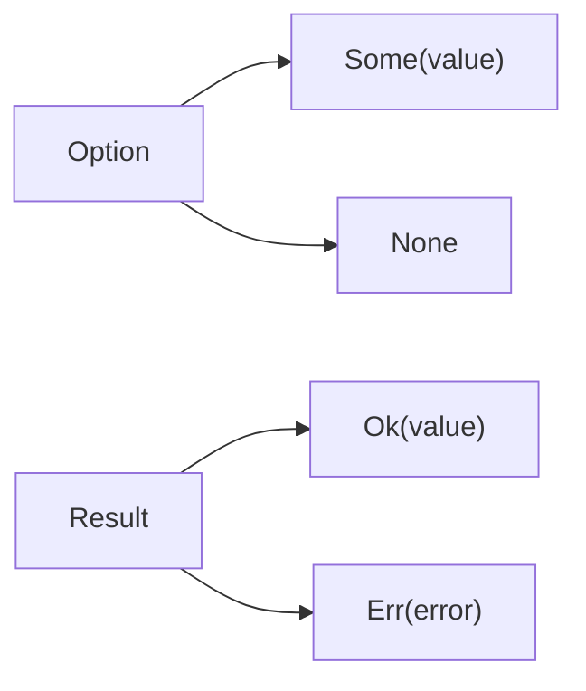

## Table of Contents

1. [The Problem](#the-problem)
2. [Nulls, Exceptions, And Return Values](#nulls-exceptions-and-return-values)
3. [Enums Carry States](#enums-carry-states)
4. [Option](#option)
5. [Result](#result)
6. [Handling With Match](#handling-with-match)
7. [if let](#if-let)
8. [The Unwrap Trap](#the-unwrap-trap)
9. [Putting It All Together](#putting-it-all-together)
10. [What's Next](#whats-next)

## The Problem

The notes app can now hold owned text, borrow slices for search, and keep project files in a normal Cargo layout. The next feature sounds small: read a config file, choose the default notebook, and print part of a notes file.

That small feature creates three different kinds of uncertainty:

- The user might not have configured a default notebook yet.
- The notes file might not exist, or the program might not have permission to read it.
- The file might load successfully but contain no first line to print.

Those states should not collapse into the same answer. A missing default notebook is ordinary absence. A file read failure has a reason. An empty file is different from a file that could not be opened.

Rust pushes those distinctions into return types. A function that might not find a value returns `Option<T>`. A function that might fail and should explain why returns `Result<T, E>`. The caller cannot use the successful value until it decides what to do with the other path.

## Nulls, Exceptions, And Return Values

If you come from JavaScript, TypeScript, or Python, you may expect missing values and failures to travel through `null`, `undefined`, `None`, or exceptions. Rust's default style is different: ordinary absence and recoverable failure are values returned from the function.

That does not mean Rust never panics. It means Rust prefers return types for states the caller can reasonably handle.

| Familiar shape | Rust usually uses | Why |
| --- | --- | --- |
| `null`, `undefined`, or Python `None` for "not found" | `Option<T>` | The caller must handle value or no value |
| `throw` or `raise` for recoverable work | `Result<T, E>` | The caller sees success and failure in the signature |
| Crash for impossible internal state | `panic!` | The program cannot continue normally |

This is why `Option` and `Result` appear so early in Rust. They are not advanced error-handling libraries. They are everyday data shapes for uncertainty.

## Enums Carry States

`Option` and `Result` are enums. An enum says a value is one of several named variants, and each variant can carry data.

A variant is one named case. An `Option<String>` value is either the `Some` variant carrying a `String`, or the `None` variant carrying no data. It is one case at a time, not a bag of flags.

The shape behind `Option` is small:

```rust
enum Option<T> {
    Some(T),
    None,
}
```

The `<T>` means `Option` can wrap many different types. `Option<String>` is either `Some(String)` or `None`. `Option<&str>` is either `Some(&str)` or `None`.

`T` is a type placeholder, like a generic type parameter in TypeScript. It lets the same enum shape work for many contained types.

`Result` has two type parameters because success and failure usually carry different data:

```rust
enum Result<T, E> {
    Ok(T),
    Err(E),
}
```

`Result<String, std::io::Error>` means the operation either produced a `String` or failed with an I/O error.

The useful mental model is simple:



| Situation | Rust shape | Possible states |
| --- | --- | --- |
| A value may be missing | `Option<T>` | `Some(value)` or `None` |
| An action may fail | `Result<T, E>` | `Ok(value)` or `Err(error)` |

The compiler will not let you treat an `Option<String>` as a plain `String`. It asks you to handle the case where there is no string. That pressure is the point.

## Option

Use `Option<T>` when absence is expected and ordinary.

A default notebook is a good example. A user might not have configured one yet. That is not a crashed program or a broken file. The answer is simply: there is a default notebook, or there is not.

```rust
fn default_notebook(config: &str) -> Option<&str> {
    config
        .lines()
        .find(|line| line.starts_with("default="))
        .map(|line| line.trim_start_matches("default="))
}
```

This function borrows `config` and returns a borrowed slice from inside it. If a matching line exists, the return value is `Some("work")` or another borrowed string slice. If no matching line exists, the return value is `None`.

Notice the ownership story. The function does not allocate a new `String`. The returned `&str` is tied to the input text. Rust can express both ideas at once: the value might be missing, and if it exists, it is borrowed from the input.

The caller handles the missing case before using the value:

```rust
let config = "default=work\n";

match default_notebook(config) {
    Some(name) => println!("Default notebook: {name}"),
    None => println!("No default notebook configured"),
}
```

`Option` is not a failure bucket. It works best when `None` is a normal answer and no extra explanation is needed.

:::expand[None is not an error]{kind="design"}
The design pressure behind `Option` is precision. `None` should mean "there is no value here," not "something mysterious failed."

For the notes app, this is a good `Option`:

```rust
fn first_line(text: &str) -> Option<&str> {
    text.lines().next()
}
```

An empty note file has no first line. That is a normal fact about the text. The caller does not need an error code to understand it.

This is a weaker use of `Option`:

```rust
fn read_notes(path: &str) -> Option<String> {
    std::fs::read_to_string(path).ok()
}
```

The function is easy to call, but it hides the reason for failure. `None` could mean the file was missing, permission was denied, the path was a directory, or something else went wrong. The caller has lost information that might change the next step.

Use this decision table:

| Question | Good shape |
| --- | --- |
| "Did the search find an item?" | `Option<T>` |
| "Is this optional config present?" | `Option<T>` |
| "Did a file operation fail?" | `Result<T, E>` |
| "Did user input fail to parse?" | `Result<T, E>` |

`None` is strongest when no further explanation would change the caller's decision. If a caller would want to log, retry, show a specific message, or choose a different recovery path, use `Result`.
:::

## Result

Use `Result<T, E>` when an operation can fail and the caller needs the reason.

Reading a file is the classic case. A path might be wrong. A permission might be missing. The disk might be unavailable. Those are not just empty answers. They are failures the program may want to report, retry, log, or convert into a user-friendly message.

```rust
use std::fs;
use std::io;

fn load_notes(path: &str) -> Result<String, io::Error> {
    fs::read_to_string(path)
}
```

The success type is `String` because reading the file owns the loaded text. The error type is `io::Error` because the standard library can explain I/O failures more precisely than a plain string can.

A caller handles both sides:

```rust
match load_notes("notes.txt") {
    Ok(text) => println!("Loaded {} bytes", text.len()),
    Err(error) => eprintln!("Could not load notes: {error}"),
}
```

This is why `Result` feels different from exceptions. The function signature shows the possibility of failure. The calling code can see it before the program runs.

| Situation | Type | Meaning |
| --- | --- | --- |
| Look up a configured default | `Option<&str>` | Missing is a normal answer |
| Read a notes file | `Result<String, io::Error>` | Failure needs an explanation |
| Parse an optional line after loading text | `Option<&str>` | The file loaded, but the line may not exist |
| Parse user input into a number | `Result<u32, ParseIntError>` | The input may be invalid |

The beginner mistake is using `Option` because it feels simpler even when the caller needs an error message. If every failure becomes `None`, the program can only say "nothing there," even when the real problem was "permission denied."

:::expand[Result keeps the reason alive]{kind="pattern"}
`Result` lets the program keep the reason for failure until the right layer decides what to do with it.

Suppose the notes app needs to parse a line number from user input:

```rust
fn parse_line_number(input: &str) -> Result<usize, std::num::ParseIntError> {
    input.trim().parse()
}
```

The success path gives the caller a `usize`. The error path gives the caller the parse error. That error might later become a command-line message:

```rust
match parse_line_number("abc") {
    Ok(number) => println!("opening line {number}"),
    Err(error) => eprintln!("line number is not valid: {error}"),
}
```

If the function returned `Option<usize>`, the caller would know only that parsing did not produce a number. That might be enough for a tiny toy program, but it is weak for a real app. A command-line tool may want to print "line number is not valid." A web service may want to return a `400 Bad Request`. A test may want to assert that the failure was specifically a parse failure.

This is the deeper pattern:

| Layer | Good job |
| --- | --- |
| Low-level parser | Preserve the specific failure |
| Domain function | Convert it into the app's error type if needed |
| User interface | Turn it into human text |

Do not turn errors into strings or `None` too early. Keep structure inside the program, then format it at the edge.
:::

## Handling With Match

`match` is the most explicit way to handle `Option` and `Result`.

It works by pattern matching against enum variants:

```rust
fn print_first_line(text: &str) {
    match text.lines().next() {
        Some(line) => println!("{line}"),
        None => println!("The file is empty"),
    }
}
```

`text.lines().next()` returns `Option<&str>`. The `Some(line)` arm pulls the borrowed line out of the option. The `None` arm handles the empty file.

For `Result`, `match` separates success from failure:

```rust
match load_notes("notes.txt") {
    Ok(text) => print_first_line(&text),
    Err(error) => eprintln!("notes.txt: {error}"),
}
```

`match` must be exhaustive. If you handle `Ok` but forget `Err`, the program does not compile. If you handle `Some` but forget `None`, the program does not compile.

That exhaustiveness is one of Rust's quiet reliability features. The compiler is not guessing what the missing case should do. It asks you to say it.

## if let

Sometimes you only care about one variant. `if let` gives you a shorter shape for that.

```rust
if let Some(name) = default_notebook("default=work\n") {
    println!("Using {name}");
}
```

This means: if the value is `Some`, bind the inside value to `name` and run the block. If it is `None`, do nothing.

You can add an `else` when there is a useful fallback:

```rust
if let Some(line) = "alpha\nbeta".lines().next() {
    println!("First line: {line}");
} else {
    println!("No lines found");
}
```

Use `if let` when the ignored case is genuinely boring. If both cases matter, `match` is usually clearer.

## The Unwrap Trap

`unwrap()` says, "give me the value, and panic if this is the other variant."

A panic is a runtime stop for a path that cannot continue normally. Depending on settings, Rust may unwind the stack and run cleanup or abort the process. Either way, it is not the same thing as returning a normal error value to the caller.

That can be fine in a throwaway experiment. It can be fine in a test where panic is exactly how the test should fail. It can be fine when you just proved an invariant in the previous line and there is no realistic recovery path.

It is a poor default for application code.

```rust
let first = text.lines().next().unwrap();
```

This line crashes if `text` has no line. The return type already told us that no line was possible: `next()` returned `Option<&str>`. `unwrap()` throws away that warning and turns a normal state into a runtime surprise.

`expect()` is only a little better:

```rust
let first = text.lines().next().expect("notes file should not be empty");
```

The panic message is clearer, but the program still panics. Use `expect` when panic is truly the right behavior and the message explains the invariant. Use `match`, `if let`, `ok_or`, or `?` when the caller should handle the state normally.

:::expand[unwrap turns a typed state into a runtime surprise]{kind="pitfall"}
The tempting mistake is treating `unwrap()` as a shortcut for "I do not want to think about this case yet."

Imagine a command that prints the first note:

```rust
fn print_first_note(text: &str) {
    let line = text.lines().next().unwrap();
    println!("{line}");
}
```

It passes during happy-path testing. Then a user creates an empty notes file, and the program exits with a panic instead of saying the file has no notes.

The safer version keeps the state visible:

```rust
fn print_first_note(text: &str) {
    match text.lines().next() {
        Some(line) => println!("{line}"),
        None => println!("No notes yet"),
    }
}
```

Use this rule of thumb:

| Context | `unwrap` fit |
| --- | --- |
| Tiny scratch program | Usually acceptable |
| Unit test setup | Often acceptable |
| Proved invariant with no recovery path | Sometimes acceptable with `expect` |
| User input, files, network, config | Avoid it |

`unwrap()` is not evil. It is just loud. In code that handles the outside world, prefer returning or handling the missing state instead of surprising the user at runtime.
:::

## Putting It All Together

The notes feature now has different shapes for different kinds of uncertainty:

```rust
use std::io;

fn default_notebook(config: &str) -> Option<&str> {
    config
        .lines()
        .find(|line| line.starts_with("default="))
        .map(|line| line.trim_start_matches("default="))
}

fn load_notes(path: &str) -> Result<String, io::Error> {
    std::fs::read_to_string(path)
}

fn print_first_line(text: &str) {
    match text.lines().next() {
        Some(line) => println!("{line}"),
        None => println!("The file is empty"),
    }
}
```

The config search returns `Option<&str>` because a missing default is ordinary. The file load returns `Result<String, io::Error>` because failure has a reason. The first-line printer handles `Option` with `match` because both outcomes deserve a message.

Count back to the opener:

- Missing default notebook: `Option`.
- File could not be read: `Result`.
- Empty file after a successful read: `Option`.

The important shift is not memorizing names. It is learning to ask what state the caller needs to see.

## What's Next

`Option` and `Result` make absence and failure visible. The next article shows how those values move through larger functions without filling every line with manual `match`: returning `Result`, using `?`, converting errors at boundaries, and designing small APIs that borrow or own data deliberately.

---

**References**

- [Option - Rust standard library](https://doc.rust-lang.org/std/option/)
- [Result - Rust standard library](https://doc.rust-lang.org/std/result/)
- [Defining an Enum - The Rust Programming Language](https://doc.rust-lang.org/book/ch06-01-defining-an-enum.html)
- [Recoverable Errors with Result - The Rust Programming Language](https://doc.rust-lang.org/book/ch09-02-recoverable-errors-with-result.html)
