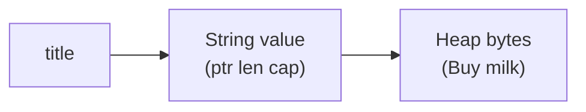
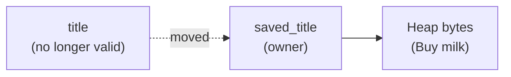

## Table of Contents

1. [The Problem](#the-problem)
2. [Names, Values, And Cleanup](#names-values-and-cleanup)
3. [One Owner](#one-owner)
4. [Stack, Heap, And Handles](#stack-heap-and-handles)
5. [Moves](#moves)
6. [Copy](#copy)
7. [Clone](#clone)
8. [Drop](#drop)
9. [Returning Ownership](#returning-ownership)
10. [Putting It All Together](#putting-it-all-together)
11. [What's Next](#whats-next)

## The Problem

The notes app from Rust Foundations can create notes, count words, and print a small summary. Now you start splitting the work into helper functions. That is when Rust begins saying a value was moved.

The error usually appears in ordinary-looking code:

- You pass a note title to a function, then try to print the title again.
- You put a note into a collection, then try to use the old variable.
- You assign one `String` variable to another and expect both names to keep working.

Rust is not being fussy about style. It is protecting a memory rule: each value has one owner, and the owner is responsible for the value until ownership moves somewhere else or the value is dropped.

That rule is the foundation for Rust's reliability story. Rust does not need a garbage collector to find unused values later, and it does not ask you to manually free memory. Instead, the compiler checks ownership before the program runs.

## Names, Values, And Cleanup

In JavaScript, TypeScript, and Python, you usually create objects and let the runtime decide when unused objects are cleaned up. Rust makes that cleanup path part of the program's structure.

Start with a name and a value:

```rust
let title = String::from("Buy milk");
```

`title` is the name in your code. The `String` is the value. That value owns resources: a small handle in the variable and heap memory for the text bytes. Handle here means the small value Rust follows to reach owned data, not a second copy of the data.

Rust wants one clear answer to this question: when this `String` is finished, who cleans up the heap memory? Ownership is the answer. The owner is responsible for the value until ownership moves or the owner goes out of scope.

## One Owner

Every Rust value has an owner. Most of the time, the owner is a variable.

```rust
let title = String::from("Buy milk");
```

Here, `title` owns the `String`. The string can be used while `title` is valid.

Valid means the name is still inside the region of code where it was created. That region is called a scope. Most Rust scopes are marked by braces:

```rust
{
    let title = String::from("Buy milk");
    println!("{title}");
} // title's scope ends here
```

When execution reaches the closing brace, `title` goes out of scope. That means the name is no longer usable after that point. Because `title` was the owner, Rust cleans up the string there.

That sounds simple, but it matters because `String` owns memory that can grow at runtime. The title text is not just a small fixed value. A `String` needs heap storage for its bytes, and Rust needs one clear place where that storage will be cleaned up.

The ownership rule gives Rust that place. The owner is the cleanup handle: the one valid path Rust will use later to drop the value and release any resources it owns.

## Stack, Heap, And Handles

A useful beginner model is that Rust values often have a small stack part and sometimes a larger heap part.



For a `String`, the stack part stores a pointer, a length, and a capacity. The heap part stores the actual text bytes.

The pointer says where the heap bytes start. The length says how many bytes are currently used. The capacity says how many bytes are reserved before the `String` has to ask for a larger allocation. That small stack value is why people sometimes call `String` a handle to heap data.

This explains why Rust treats different values differently. A small number such as `i32` can be copied cheaply because the whole value is fixed-size stack data. A `String` cannot be copied in the same automatic way without deciding what to do with the heap bytes.

| Value | Typical memory shape | Assignment behavior |
| --- | --- | --- |
| `i32` | Fixed-size value | Copy |
| `bool` | Fixed-size value | Copy |
| `String` | Stack handle plus heap bytes | Move |
| `Vec<T>` | Stack handle plus heap elements | Move |

The table is not a complete type system. It is the practical intuition: if a value owns runtime allocation or another resource, Rust will usually move it instead of silently duplicating it.

:::expand[Why String moves but i32 copies]{kind="design"}
Rust's assignment behavior is easiest to understand if you ask what would have to be duplicated.

For an integer, the whole value is small and fixed-size:

```rust
let word_count = 2;
let saved_count = word_count;
```

Copying `2` means copying a few bytes. There is no heap allocation and no cleanup conflict. Both names can keep working because each has its own complete value.

A `String` is different:

```rust
let title = String::from("Buy milk");
let saved_title = title;
```

The stack part of `title` is only a handle: pointer, length, and capacity. The text bytes live on the heap. Rust has three possible choices here:

| Choice | Problem |
| --- | --- |
| Copy only the handle | Two owners would point to the same heap bytes |
| Copy the heap bytes automatically | Assignment could become surprisingly expensive |
| Move the handle | One owner remains responsible for cleanup |

Rust chooses the third behavior for `String`. The heap bytes are not silently duplicated, and the old name is not allowed to clean up the same allocation later. That is why `String` moves while `i32` copies: one has ownership of runtime allocation, and the other is just a small fixed value.
:::

## Moves

A move transfers ownership from one place to another.

```rust
let title = String::from("Buy milk");
let saved_title = title;

println!("{title}");
```

This does not compile. After `let saved_title = title;`, the `String` is owned by `saved_title`. The old name, `title`, is no longer valid.

The important detail is what Rust refuses to do automatically. It does not copy the heap bytes behind your back. If both variables pointed at the same heap allocation and both later tried to clean it up, the program could free the same memory twice. If Rust secretly copied the heap bytes every time, assignment could become unexpectedly expensive.

So Rust chooses a third behavior:



The word "moved" means ownership changed hands. The data did not necessarily travel to a new address. The permission to use and clean up the value moved.

:::expand[A move changes permission, not necessarily location]{kind="pattern"}
The word "move" can sound like Rust physically picks up all the bytes and carries them somewhere else. For a `String`, that is not usually the useful mental model.

Start here:

```rust
let title = String::from("Buy milk");
let saved_title = title;
```

The heap bytes for `"Buy milk"` can stay where they are. What changes is the stack handle and the right to use it. After the assignment, `saved_title` is the valid name that owns the string. `title` is no longer a usable name.

That distinction explains why this is rejected:

```rust
println!("{title}");
```

Rust is not saying the text vanished. It is saying `title` no longer has permission to access or clean up that text. There is still exactly one owner: `saved_title`.

This is a good reading habit:

| Question | Answer after the move |
| --- | --- |
| Did the heap text need to be copied? | No |
| Which name can use the value now? | `saved_title` |
| Which name cleans it up later? | `saved_title` |
| Can the old name be used? | No |

When a compiler error says a value was moved, look for the line where ownership changed hands. The fix is not always `clone`. Sometimes the function should borrow. Sometimes the old name should simply stop being used.
:::

This comes up often with functions because passing a value into a function can also move it.

```rust
fn save_note(title: String) {
    println!("saved: {title}");
}

let title = String::from("Buy milk");
save_note(title);
println!("{title}");
```

The parameter `title: String` means `save_note` takes ownership. After the call, the original `title` in the caller is no longer usable.

For a notes app, that can be the right design. If `save_note` stores the title permanently, it should own it. If it only needs to inspect the title, taking ownership is too strong. The next article covers that better tool: borrowing.

## Copy

Some values do not move on assignment because they implement `Copy`.

```rust
let word_count = 2;
let saved_count = word_count;

println!("{word_count} words");
println!("{saved_count} words");
```

Both variables remain valid because an integer is cheap to duplicate. There is no separate heap allocation to clean up and no danger that two owners will free the same resource.

Common `Copy` values include integers, booleans, floating-point numbers, characters, and tuples made only of `Copy` values.

The useful question is not "why does Rust move this?" The better question is "would silently copying this value be trivial and safe?" For `String`, the answer is no. For `i32`, the answer is yes.

## Clone

When you really want a second owned value, ask for it explicitly with `clone`.

```rust
let title = String::from("Buy milk");
let saved_title = title.clone();

println!("{title}");
println!("{saved_title}");
```

Now there are two independent strings. Each has its own owned data and each will be cleaned up separately.

`clone` is deliberately visible. It tells the next reader that this line may allocate memory or do work proportional to the size of the value. In a notes app, cloning a short title is usually fine. Cloning the full body of thousands of notes inside a search loop may be the line that makes the app feel slow.

That is the practical tradeoff:

| Need | Rust tool |
| --- | --- |
| Give the value away | Move it |
| Keep using a small fixed value | Let it copy |
| Make a second owned value | Clone it |
| Let code inspect without owning | Borrow it |

Ownership is not about avoiding every clone. It is about making ownership and allocation choices visible.

:::expand[Clone is a design choice, not a compiler escape hatch]{kind="pitfall"}
A common beginner reaction is to add `.clone()` until the compiler stops complaining.

```rust
let title = String::from("Buy milk");
save_note(title.clone());
println!("{title}");
```

This may be correct if `save_note` needs its own independent title and the caller also needs to keep one. But cloning as a reflex can hide the real design question: who should own this text?

For a notes app, compare the choices:

| Situation | Better tool | Why |
| --- | --- | --- |
| `save_note` stores the title permanently | Move `String` | The note becomes responsible for the title |
| `print_title` only reads the title | Borrow `&str` | Printing should not take ownership |
| Caller and callee both need owned strings | `clone()` | Two independent values are genuinely needed |
| Small number is reused | Copy | Cheap fixed-size values can duplicate silently |

The expensive version of "clone until it compiles" often appears in loops:

```rust
for note in notes {
    results.push(note.body.clone());
}
```

That might allocate a new string for every result. Sometimes that is fine. Sometimes the search only needs borrowed views or indexes. The rule of thumb is: clone when a second owned value is part of the design, not when you only need temporary access.
:::

## Drop

When an owner goes out of scope, Rust drops the value.

```rust
{
    let title = String::from("Buy milk");
    println!("{title}");
}
```

At the closing brace, `title` is no longer valid. Rust calls the value's cleanup behavior. For `String`, that means the heap memory for the text can be returned.

This is why the "one owner" rule matters. If exactly one owner is responsible for cleanup, Rust can make cleanup automatic and predictable. No garbage collector has to pause later to discover the string is unused. No programmer has to remember to call `free`.

Drop also happens when a variable is replaced.

```rust
let mut title = String::from("Buy milk");
title = String::from("Read Rust");
```

The old `"Buy milk"` string is dropped when `title` is assigned the new string. The variable keeps existing, but the value it used to own is finished.

## Returning Ownership

Sometimes a function needs to take ownership, do work, and give ownership back.

```rust
fn normalize_title(title: String) -> String {
    title.trim().to_lowercase()
}

let title = String::from("  Buy Milk  ");
let title = normalize_title(title);
println!("{title}");
```

The first `title` moves into `normalize_title`. The function returns a new `String`, and the caller binds that returned value to `title` again.

This pattern is valid, but it can get awkward if a function only needs to look at data. Passing values in and returning them just to keep ownership flowing makes signatures noisy. It also hides the real intent.

When the function's job is "use this data without becoming responsible for it," ownership is the wrong tool. Borrowing is the next tool.

## Putting It All Together

The opening problem was the compiler saying a value was moved. That message is Rust showing you where ownership changed hands.

For the notes app:

- A `String` title owns heap memory, so assignment or passing by value moves it.
- A moved value cannot be used through its old name because it is no longer the owner.
- Small fixed values such as word counts can be copied.
- `clone` creates a second owned value when that is really what you want.
- `drop` runs when the owner goes out of scope or is replaced.

The reliability payoff is that every owned value has one cleanup path. Rust catches use-after-move mistakes before the program runs, and cleanup happens at clear scope boundaries.

## What's Next

Moving ownership is useful when responsibility should truly change hands. But many functions do not need responsibility. They only need temporary access.

The next article introduces borrowing: how a function can read or change a note without owning the note.

---

**References**

- [What Is Ownership?](https://doc.rust-lang.org/book/ch04-01-what-is-ownership.html). Supports Rust's ownership rules, stack and heap model, moves, `Copy`, `Clone`, function ownership transfer, and automatic cleanup through `drop`.
