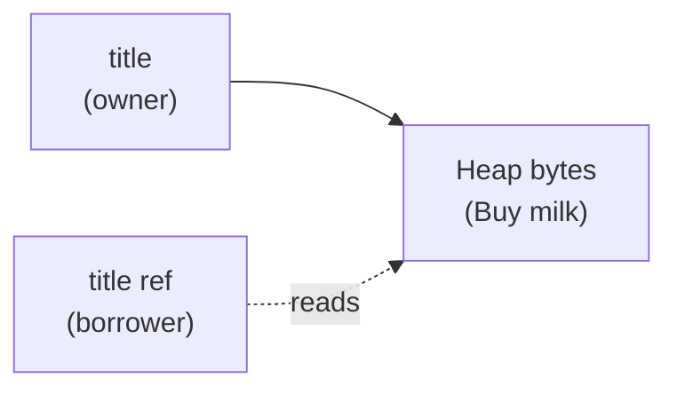

## Table of Contents

1. [The Problem](#the-problem)
2. [Shared References](#shared-references)
3. [Function Signatures](#function-signatures)
4. [Mutable References](#mutable-references)
5. [Readers And Writers](#readers-and-writers)
6. [Borrow Scopes](#borrow-scopes)
7. [No Dangling References](#no-dangling-references)
8. [Choosing A Signature](#choosing-a-signature)
9. [Putting It All Together](#putting-it-all-together)
10. [What's Next](#whats-next)

## The Problem

The ownership article showed why this notes-app function is too strong for a simple summary:

```rust
fn print_title(title: String) {
    println!("{title}");
}

let title = String::from("Buy milk");
print_title(title);
println!("{title}");
```

`print_title` only prints the title, but its signature says it takes ownership of the `String`. The caller loses the title after the function call. That is strange design. Printing a note title should not consume the note title.

The same problem appears across the app:

- A search function needs to inspect note bodies without owning every note.
- A preview function needs to read a title and return a short display string.
- An edit function needs to change one note body while the rest of the app waits.

Borrowing is Rust's answer. A reference lets code use a value without becoming its owner.

## Shared References

A shared reference is written with `&`.

```rust
fn print_title(title: &String) {
    println!("{title}");
}

let title = String::from("Buy milk");
print_title(&title);
println!("{title}");
```

The call `print_title(&title)` borrows the string. The function receives `&String`, which means "a reference to a `String`." It can read the string, but it does not own it.

That changes the ownership story:



When `print_title` returns, the reference is gone. The original `title` is still the owner, so the caller can keep using it.

You will often see signatures use `&str` instead of `&String` for text-reading functions:

```rust
fn print_title(title: &str) {
    println!("{title}");
}
```

That is more flexible because a string slice can refer to a `String` or to a string literal. For this article, the important idea is the same: the `&` means the function borrows instead of owns.

:::expand[Borrowing is temporary access, not shared ownership]{kind="design"}
Borrowing does not create a second owner. It creates temporary access to a value that still belongs somewhere else.

In this call:

```rust
let title = String::from("Buy milk");
print_title(&title);
println!("{title}");
```

`title` remains the owner for the whole sequence. The expression `&title` creates a reference that `print_title` can use during the call. When the function returns, that reference is finished. Nothing about cleanup moved into `print_title`.

That matters because cleanup still has one path:

| Moment | Who owns the `String`? | What can happen? |
| --- | --- | --- |
| Before the call | `title` | Caller can use or move it |
| During the call | `title` | Function can read through the reference |
| After the call | `title` | Caller can keep using it |
| End of scope | `title` | Rust drops the string |

This is why borrowing is the right tool for printing, searching, formatting previews, and validation. The function gets enough access to do its work, but it does not become responsible for the value's lifetime.

If a function needs to keep the value after returning, borrowing is too weak. That function should take ownership or create its own owned value. Borrowing is for temporary access.
:::

## Function Signatures

Rust function signatures tell you what kind of access a function needs.

```rust
fn save_note(title: String) {
    println!("saved: {title}");
}

fn preview_title(title: &str) {
    println!("{title}");
}
```

These functions make different promises. `save_note(title: String)` takes ownership. It can store the title, return it, move it into another struct, or drop it. `preview_title(title: &str)` only borrows text. It can read the title during the call, but it cannot keep owning that title afterward.

That makes signatures part of the design, not just syntax.

| Signature shape | Meaning |
| --- | --- |
| `String` | Takes ownership |
| `&String` | Borrows a `String` for reading |
| `&str` | Borrows text for reading |
| `&mut String` | Borrows a `String` for changing |

When a function surprises you by moving a value, read its parameter list first. If the parameter type is owned, the call transfers ownership unless the type is `Copy`.

## Mutable References

Reading is not the only kind of borrowing. A function can also borrow a value mutably with `&mut`.

The notes app might need a helper that appends text to a draft:

```rust
fn add_line(body: &mut String, line: &str) {
    body.push_str("\n");
    body.push_str(line);
}

let mut body = String::from("Remember:");
add_line(&mut body, "Buy milk");
println!("{body}");
```

Several parts must line up:

- The variable is declared with `let mut body`.
- The call passes `&mut body`.
- The function accepts `body: &mut String`.

That repetition is useful. Mutation is visible at the binding, the call site, and the function boundary. A reader does not have to inspect the function body to know it may change the value.

## Readers And Writers

Rust's borrowing rule is often summarized as many readers or one writer.

You can have multiple shared references at the same time:

```rust
let title = String::from("Buy milk");
let first_view = &title;
let second_view = &title;

println!("{first_view}");
println!("{second_view}");
```

This is safe because shared references can read but cannot mutate. No reader can surprise another reader by changing the title halfway through.

A mutable reference is different. While a mutable reference exists, Rust does not allow other references to the same value.

```rust
let mut title = String::from("Buy milk");
let edit = &mut title;

edit.push_str(" today");
println!("{edit}");
```

The mutable borrow has exclusive access. That exclusivity is what lets Rust permit mutation without letting two parts of the program observe and change the same value in conflicting ways.

| Active access | Allowed at the same time? | Why |
| --- | --- | --- |
| Many `&T` references | Yes | Readers cannot mutate |
| One `&mut T` reference | Yes | One writer has exclusive access |
| `&T` and `&mut T` together | No | A reader could see a surprise change |
| Multiple `&mut T` references | No | Two writers could conflict |

This rule can feel restrictive at first. In return, Rust catches accidental shared mutation before runtime.

:::expand[Many readers or one writer prevents surprise changes]{kind="design"}
The reader-or-writer rule protects a simple expectation: if code is reading a value through a shared reference, the value should not change underneath that reader.

This shape is rejected:

```rust
let mut title = String::from("Buy milk");

let preview = &title;
let edit = &mut title;

edit.push_str(" today");
println!("preview: {preview}");
```

The problem is not that `push_str` is dangerous by itself. The problem is overlap. `preview` is a shared reference that will be used later. `edit` wants exclusive mutable access before that read is finished.

If Rust allowed both at once, `preview` could mean "the old title" in one reader's mind while another part of the program changes the title. In larger programs, that kind of surprise is where bugs hide.

The fix is to separate the phases:

```rust
let mut title = String::from("Buy milk");

let preview = &title;
println!("preview: {preview}");

let edit = &mut title;
edit.push_str(" today");
```

Now the shared read is done before the mutable borrow starts. The rule is not "mutation is bad." The rule is "mutation needs a moment where it is alone."
:::

## Borrow Scopes

A borrow lasts until its last use, not always until the end of the curly-brace scope.

```rust
let mut title = String::from("Buy milk");

let preview = &title;
println!("{preview}");

let edit = &mut title;
edit.push_str(" today");
```

This compiles because the shared borrow `preview` is not used after the first `println!`. The mutable borrow begins after the reader is done.

This small rule explains many fixes for borrowing errors. You often do not need to clone. You can move code so the read finishes before the write begins.

For the notes app, imagine a function that prints a preview and then updates the title. Keep those phases separate:

```rust
let mut title = String::from("Buy milk");

println!("preview: {title}");
title.push_str(" today");
```

The print reads the title. After that read is over, the mutation can happen. Rust is checking that these phases do not overlap in a way that would make the program harder to reason about.

:::expand[Shorten the borrow before reaching for clone]{kind="pattern"}
When the borrow checker complains, cloning is often the loudest-looking escape hatch. First ask whether the borrow can end earlier.

This version keeps the shared borrow alive until the final `println!`:

```rust
let mut title = String::from("Buy milk");

let preview = &title;
title.push_str(" today");
println!("old preview: {preview}");
```

Rust rejects it because `preview` is still needed after the mutation. If the code really wants to print the preview before editing, write the phases that way:

```rust
let mut title = String::from("Buy milk");

let preview = &title;
println!("old preview: {preview}");

title.push_str(" today");
```

An inner block can make the boundary even clearer:

```rust
let mut title = String::from("Buy milk");

{
    let preview = &title;
    println!("old preview: {preview}");
}

title.push_str(" today");
```

The braces show the reader that `preview` is only needed for that small region. After the block, the shared borrow is gone, so mutation can begin. Use `clone` when you truly need two independent values. Use phase boundaries when you only need a read to finish before a write starts.
:::

## No Dangling References

Borrowing also prevents references from pointing to values that no longer exist.

This function tries to return a reference to a local `String`:

```rust
fn make_title() -> &String {
    let title = String::from("Buy milk");
    &title
}
```

Rust rejects this because `title` is dropped when the function returns. A reference to it would point at memory that is no longer valid.

The fix is to return ownership:

```rust
fn make_title() -> String {
    String::from("Buy milk")
}
```

This is a good place to keep the mental model simple. If a function creates a new owned value and the caller needs it afterward, return the owned value. Borrowing is for temporary access to a value that already has an owner outside the function.

## Choosing A Signature

When you write a notes-app helper, start by asking what the function needs to do with the value.

| Function job | Good signature shape |
| --- | --- |
| Store a title inside a new note | `fn new(title: String)` |
| Print or search a title | `fn search(title: &str)` |
| Count words in a body | `fn word_count(body: &str) -> usize` |
| Append text to a draft body | `fn add_line(body: &mut String, line: &str)` |
| Create a fresh title | `fn default_title() -> String` |

The signature should match the responsibility. Own data when the function becomes responsible for it. Borrow data when the function only needs temporary access. Use a mutable borrow when the function must change the caller's value in place.

This habit makes compiler errors easier to interpret. A "value moved" error often means the signature asks for ownership where a borrow would express the real intent.

## Putting It All Together

The opening problem was a function that consumed a title just to print it. Borrowing fixes that by separating access from ownership.

For the notes app:

- `&T` lets a function read a value without owning or dropping it.
- `&mut T` lets a function change a value, but only with exclusive access.
- Function signatures show whether a function owns, reads, or mutates.
- Many readers can coexist, but one writer must be alone.
- Borrow scopes usually end at the last use, so reads and writes can happen in separate phases.
- Rust prevents dangling references by making sure borrowed data outlives the reference.

The reliability payoff is that data can be shared temporarily without losing the clear cleanup path from ownership. Rust lets code collaborate around values while still knowing exactly who owns them.

## What's Next

Borrowing explains how functions can read and mutate existing values without taking ownership. The next ownership idea is slices: borrowed views into part of a string, array, or collection.

Slices make the notes app more precise. A parser can point at the title portion of a line or the first matching word without copying the whole string.

---

**References**

- [References and Borrowing](https://doc.rust-lang.org/book/ch04-02-references-and-borrowing.html). Supports shared references, mutable references, the reader-or-writer borrowing rule, borrow scopes, and Rust's prevention of dangling references.
- [What Is Ownership?](https://doc.rust-lang.org/book/ch04-01-what-is-ownership.html). Supports the connection between function parameters, ownership transfer, returning owned values, and cleanup through ownership.
