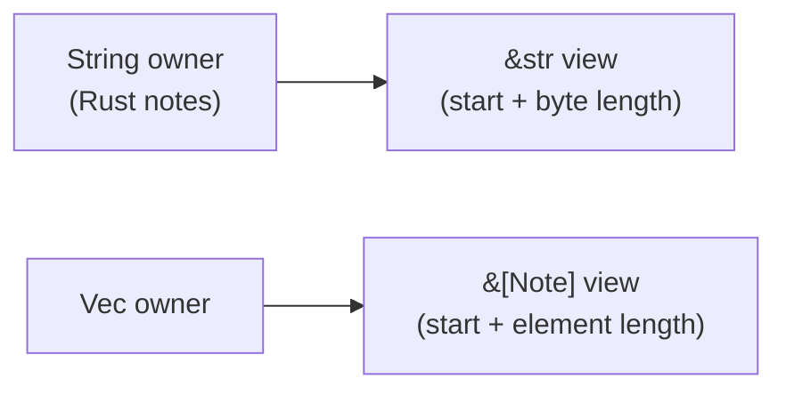

## Table of Contents

1. [The Problem](#the-problem)
2. [Owned Text](#owned-text)
3. [Borrowed Text](#borrowed-text)
4. [Bytes, Characters, And UTF-8](#bytes-characters-and-utf-8)
5. [Slices](#slices)
6. [What A Slice Stores](#what-a-slice-stores)
7. [Vectors And List Slices](#vectors-and-list-slices)
8. [Lifetimes In Plain English](#lifetimes-in-plain-english)
9. [A Practical Heuristic](#a-practical-heuristic)
10. [Putting It All Together](#putting-it-all-together)
11. [What's Next](#whats-next)

## The Problem

The notes app now has ownership rules in its bones. A note owns its title and body. A search command reads notes without taking them away. A formatter creates new output when it needs to print a result.

Then Rust examples start mixing types that look almost the same:

- `String` for stored note text.
- `&str` for function parameters.
- `Vec<Note>` for the list of notes.
- `&[Note]` for helper functions that scan the list.

The question is not "which string type is real?" They are all real. The question is: does this part of the program need to own the data, or does it only need to borrow a view of data owned somewhere else?

That is the thread through this article. The notes app stores owned text because the app must keep it. Helper functions borrow slices because they only inspect part of something that already exists.

## Owned Text

`String` is owned, growable UTF-8 text. Use it when the program needs to store text, mutate text, receive text from outside the program, or return newly built text to a caller.

The notes app's data model should own its text:

```rust
struct Note {
    title: String,
    body: String,
}
```

This means each `Note` is responsible for keeping its own title and body alive. The text remains valid independently of a command line argument or file buffer that might disappear.

Creating a note can take owned strings too:

```rust
fn new_note(title: String, body: String) -> Note {
    Note { title, body }
}
```

This function consumes the two strings and moves them into the struct. That is a good fit when the caller is finished building the text and wants the note to keep it.

The practical consequence is simple. Application structs usually own the data they are responsible for keeping. If a `Note` outlives the command that created it, the note should not depend on a borrowed view owned by that command.

:::expand[Application structs usually own text]{kind="pattern"}
It is tempting to put references inside structs because references feel lighter:

```rust
struct Note<'a> {
    title: &'a str,
    body: &'a str,
}
```

The `<'a>` part is a lifetime parameter. It says the `Note` does not own its text; it borrows text that must stay valid for at least as long as the note view is used. That shape can be useful for temporary parser views, but it is usually the wrong first shape for application data. A stored note needs to keep its title and body after the command, file buffer, or request that created it is gone.

Here is the problem in plain terms:

```rust
fn make_note<'a>() -> Note<'a> {
    let title = String::from("Buy milk");
    let body = String::from("Remember oat milk");

    Note {
        title: &title,
        body: &body,
    }
}
```

This cannot work as stored data. `title` and `body` are local strings. They are dropped when `make_note` returns. A `Note` that borrowed from them would point at text that no longer exists.

The ordinary app shape is simpler:

```rust
struct Note {
    title: String,
    body: String,
}
```

Use owned fields when the struct is responsible for keeping data alive. Use borrowed fields when the struct is a short-lived view into data owned somewhere else. That distinction prevents lifetimes from becoming a workaround for data that should simply be owned.
:::

## Borrowed Text

`&str` is a borrowed view of UTF-8 text. It does not own the characters. It points at text that lives somewhere else.

That makes it ideal for helpers that only read text:

```rust
fn word_count(text: &str) -> usize {
    text.split_whitespace().count()
}
```

This function does not need to store the text. It does not need to change it. It only needs to look at it long enough to count words.

Because `&str` is a borrowed view, the same helper works with several sources:

```rust
let body = String::from("borrowed views keep helpers flexible");

let a = word_count(&body);
let b = word_count("string literals work too");
```

The first call borrows from an owned `String`. The second call uses a string literal, which is already a string slice stored in the program. The helper does not care where the text came from. It only asks for a readable view.

This is why Rust examples often use `&str` in function parameters. Borrowing makes a function easier to call and avoids taking ownership when ownership would add no value.

## Bytes, Characters, And UTF-8

Rust strings are UTF-8. UTF-8 stores text as bytes, and not every visible character uses the same number of bytes.

For plain ASCII text, the relationship looks simple:

```text
text:  R  u  s  t
byte:  0  1  2  3
```

The word `"Rust"` has four visible characters and four bytes. The word `"café"` is different:

```text
text:  c  a  f  é
byte:  0  1  2  3  4
```

The final `é` uses two bytes in UTF-8. That is why Rust string ranges are byte ranges, not character-position ranges. A range must begin and end at valid character boundaries.

`usize` appears often around strings and slices because it is Rust's standard type for counts, lengths, and indexes. When you see a length from `.len()`, read it as a byte count for strings and an element count for list slices.

## Slices

A slice is a borrowed view into a contiguous part of a collection. Contiguous means the items are next to each other in memory, with no gaps in the viewed range. For strings, that view is `&str`. For vectors and arrays, that view looks like `&[T]`.

One way to picture the relationship is:

```text
owner:      String
            "learn Rust slices"

borrowed:         &str
                  "Rust"
```

The owner keeps the data alive. The slice describes a part of it.

Rust lets you borrow a string slice with a range:

```rust
let title = String::from("Rust notes");
let first_word = &title[0..4];
```

`first_word` is a `&str` view into `title`. It does not copy `"Rust"` into a new owned string.

There is an important gotcha here. Rust strings are UTF-8, and string indexes are byte indexes, not character positions. Slicing with a range must land on valid UTF-8 character boundaries. For word-based text work, methods such as `split_whitespace`, `lines`, and `chars` are often a better first tool than manual byte ranges.

The bigger idea is still the same: a slice borrows part of an owner. It is cheap because it does not duplicate the data, and it is safe because Rust checks that the borrowed view cannot outlive the owner.

## What A Slice Stores

A slice is a view with two essential pieces of information:

```text
slice = where the viewed data starts + how much of it is visible
```

For `&str`, the slice points at UTF-8 bytes and stores a length in bytes. For `&[T]`, the slice points at elements of type `T` and stores a length in elements.



This is why slices are cheap to pass into helper functions. The helper receives a small view, not a copy of all the underlying text or notes. The owner still controls how long the data lives.

:::expand[String slices are byte ranges with UTF-8 rules]{kind="pitfall"}
String ranges use byte indexes. That is harmless when the text is plain ASCII:

```rust
let title = String::from("Rust notes");
let first = &title[0..4];

println!("{first}");
```

`"Rust"` is four ASCII characters and four bytes, so `0..4` lands cleanly on character boundaries.

Unicode text can be different:

```rust
let word = String::from("café");
let broken = &word[0..4];
```

The visible word has four characters, but `é` takes two bytes in UTF-8:

```text
byte indexes: 0   1   2   3   4   5
text:         c   a   f   é
bytes:        63  61  66  c3  a9
range 0..4:   c   a   f   half of é
```

The range `0..4` cuts into the middle of that final character, so slicing there is invalid and will panic at runtime.

For beginner text work, prefer methods that understand text boundaries:

```rust
let first_word = title.split_whitespace().next();
let first_char = word.chars().next();
```

Those methods express the job better than manual byte indexes. Use manual string ranges only when you know the byte boundaries are valid, such as when a parser has already found boundaries using safe string methods.

The rule of thumb is: `&text[start..end]` is a byte slice, not a character slice. Rust keeps the result valid UTF-8, but you are responsible for choosing valid boundaries.
:::

## Vectors And List Slices

The same ownership pattern appears with lists.

`Vec<T>` owns a growable list of values. If the notes app stores all notes in memory, it might use a vector:

```rust
let notes: Vec<Note> = Vec::new();
```

The `T` in `Vec<T>` is a placeholder for the element type. `Vec<Note>` means a vector whose elements are `Note` values. `Vec<String>` means a vector whose elements are `String` values.

A helper that only searches notes should not need to own that vector. It can borrow a slice:

```rust
fn count_matching(notes: &[Note], query: &str) -> usize {
    notes
        .iter()
        .filter(|note| note.body.contains(query))
        .count()
}
```

The parameter `notes: &[Note]` says "give me a borrowed view of zero or more notes." The function can iterate over the notes, but it does not take the collection away from the caller.

This also makes the helper flexible. It can accept a whole vector or part of one:

```rust
let all_matches = count_matching(&notes, "rust");
let first_three = count_matching(&notes[..3], "rust");
```

Both calls give the function the same kind of view: a slice of notes. The function does not need separate versions for "whole vector" and "part of vector."

The second call assumes the vector has at least three notes. If it might not, check the length first or use a method that safely handles short lists. Slices are safe views, but range indexes still need to be valid.

Here is the common family pattern:

| Owned value | Borrowed view | Usually used when |
| --- | --- | --- |
| `String` | `&str` | Reading text without storing it |
| `Vec<T>` | `&[T]` | Reading a list without taking it |
| `[T; N]` | `&[T]` | Reading an array through the same list view |

Use this table as a map. Owned containers keep data. Borrowed slices let helpers inspect data.

:::expand[Accept slices when a function only reads a list]{kind="pattern"}
If a function only reads a list, prefer a slice parameter:

```rust
fn count_matching(notes: &[Note], query: &str) -> usize {
    notes
        .iter()
        .filter(|note| note.body.contains(query))
        .count()
}
```

That signature says the helper needs a borrowed view of notes. It does not need to own the vector, resize it, or store it.

The benefit is flexibility. The same function can read a whole vector:

```rust
let count = count_matching(&notes, "rust");
```

It can read part of a vector:

```rust
let count = count_matching(&notes[0..3], "rust");
```

And it can read an array through the same slice shape:

```rust
let sample = [note_one, note_two];
let count = count_matching(&sample, "rust");
```

If the function took `Vec<Note>`, the caller would have to give the whole collection away. If it took `&Vec<Note>`, it would unnecessarily require the caller to have a vector specifically. `&[Note]` asks for the smallest useful thing: a readable sequence of notes.

This pattern appears all over Rust APIs. Own collections at storage boundaries. Accept slices at read-only helper boundaries.
:::

## Lifetimes In Plain English

Every borrowed view has a lifetime, even when you do not write lifetime syntax. A lifetime is the span of code where Rust can prove the borrow is valid.

For this article, the intuition is enough:

```rust
let title = String::from("Rust notes");
let view = &title;

println!("{view}");
```

`view` is valid while `title` is still alive. Rust accepts the code because the owner exists long enough for the borrowed view to be used.

This would be the wrong idea:

```rust
fn bad_title() -> &str {
    let title = String::from("Rust notes");
    &title
}
```

The function tries to return a borrowed view into `title`, but `title` is dropped when the function ends. The view would point at text that no longer exists, so Rust rejects it.

When a function needs to return newly created text, return an owned `String`:

```rust
fn title_label(title: &str) -> String {
    format!("Note: {title}")
}
```

The function borrows the input because it only reads it. It returns `String` because the formatted label is new owned text that must live after the function returns.

## A Practical Heuristic

The most useful beginner heuristic is this: application structs usually own data; functions often borrow inputs.

For the notes app, that leads to a clean shape:

```rust
struct Note {
    title: String,
    body: String,
}

fn title_matches(note: &Note, query: &str) -> bool {
    note.title.contains(query)
}
```

`Note` owns its fields because stored notes need stable text. `title_matches` borrows the note and the query because it only checks them.

The heuristic also helps with API design:

| If the code needs to... | Prefer |
| --- | --- |
| Store text in a struct | `String` |
| Read text passed by a caller | `&str` |
| Build and return new text | `String` |
| Store a growable list | `Vec<T>` |
| Read a caller's list | `&[T]` |

There are exceptions. Sometimes a function takes ownership because it will keep the value, transform it, or avoid a copy. Sometimes a struct borrows data because it is a temporary parser view. But for ordinary application code, owning at storage boundaries and borrowing at helper boundaries keeps the design simple.

## Putting It All Together

The opening problem was that Rust examples seem to switch between `String`, `&str`, `Vec<T>`, and `&[T]` without warning. The switch follows ownership:

- `String` owns growable UTF-8 text.
- `&str` borrows a view of UTF-8 text.
- `Vec<T>` owns a growable list.
- `&[T]` borrows a view of a list.
- Slices are cheap views into data owned somewhere else.
- A borrowed view must not outlive its owner.

The notes app now has a practical rule of thumb. Stored notes own their title and body. Search, count, and format helpers borrow the note text or note list when they only need to inspect it. When a helper creates new output, it returns an owned value.

That is why Rust examples keep using these types differently. They are not competing string and list spellings. They describe who owns the data and who is only looking.

## What's Next

Strings and slices make borrowing feel concrete. The next reliability habit is just as important: representing missing values and recoverable failures without hiding them behind nulls, exceptions, or panics.

The next article introduces `Option` and `Result`, the two enum shapes Rust uses when a value might be absent or an operation might fail.

---

**References**

- [The Slice Type](https://doc.rust-lang.org/book/ch04-03-slices.html). Supports slices as references to contiguous portions of collections, including string slices and array slices.
- [Storing UTF-8 Encoded Text with Strings](https://doc.rust-lang.org/book/ch08-02-strings.html). Supports `String` as growable, mutable, owned UTF-8 text and explains common string operations.
- [Primitive Type str](https://doc.rust-lang.org/std/primitive.str.html). Supports `str` and `&str` as UTF-8 string slice types and documents string slice methods.
- [Struct String](https://doc.rust-lang.org/std/string/struct.String.html). Supports `String` as the standard owned string type and documents its relationship to string slices.
