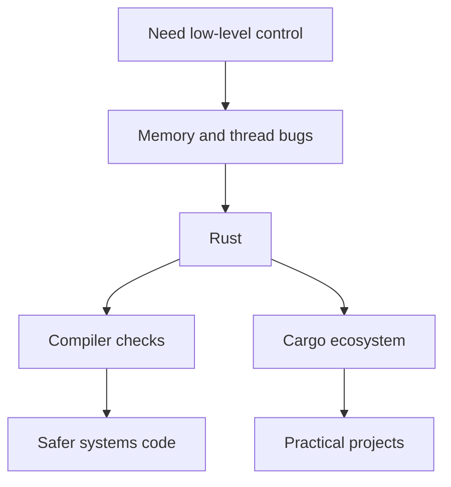

## Table of Contents

1. [The Problem](#the-problem)
2. [Why Rust Exists](#why-rust-exists)
3. [What Rust Optimizes For](#what-rust-optimizes-for)
4. [Where Rust Shows Up](#where-rust-shows-up)
5. [The Rust Community](#the-rust-community)
6. [The Learning Path](#the-learning-path)
7. [Putting It All Together](#putting-it-all-together)
8. [What's Next](#whats-next)

## The Problem

A team has a small service that started in a comfortable language. The code is readable, deploys quickly, and is easy to change. Then the service moves closer to the edge of the system:

- It needs to parse untrusted network input without crashing.
- It needs predictable performance without a large runtime pause.
- It needs to share work across threads without turning every data structure into a hidden race.
- It needs to run in places where a garbage collector, large runtime, or heavy container image is not a good fit.

For decades, teams reached for C or C++ when they needed that kind of control. Those languages are powerful, but they make the programmer manually protect many memory and concurrency rules. A small mistake can become a use-after-free bug, buffer overrun, data race, crash, or security vulnerability.

Rust exists for that uncomfortable space: the place where you want low-level control, but you do not want ordinary memory mistakes to be ordinary production failures.

## Why Rust Exists

Rust started in the Mozilla world and grew into an independent open-source language. Mozilla describes Rust as beginning as a Mozilla Research side project, with Graydon Hoare presenting work in 2010 on a language aimed at better memory safety and concurrency. The project eventually grew beyond Mozilla, with contributors and governance from inside and outside the company.

Rust 1.0 was released on May 15, 2015. That release mattered because it marked a stability promise. Before 1.0, the language was still changing quickly. After 1.0, Rust became a language that teams could build libraries and applications on without expecting the ground to move every few weeks.

The first useful mental model is this: Rust tries to move some bugs from runtime into compile time. The compiler is not only checking syntax. It is checking whether values are used safely, whether references can outlive the data they point to, whether mutation is controlled, and whether thread-sharing rules are explicit.

That is why Rust can feel strict early. The strictness is not decoration. It is part of the design goal.



Rust does not remove all bugs. It does not make architecture decisions for you. It does not make slow algorithms fast. It gives you a language and toolchain that make certain classes of mistakes much harder to ship by accident.

:::expand[Memory safety is a security boundary]{kind="design"}
Memory bugs are not only annoying crashes. In low-level code, they can become the boundary an attacker tries to cross.

Imagine a network service that accepts a small binary message, parses a length field, and copies the payload into memory. If the code trusts the length too much, the payload can spill past the buffer. If the parser keeps a pointer to data that has already been freed, later code may read memory that now belongs to something else. If two threads mutate shared state without coordination, a check in one thread can be invalid by the time another thread acts on it.

Here is the smallest version of that length-field idea. Imagine a simplified login packet stored beside an admin flag:

```text
memory for one request:

[ payload: 8 bytes ][ is_admin: false ]
```

A buggy parser reads the first byte as a length and copies that many bytes into `payload`:

```text
incoming packet:

length = 12
data   = 8 bytes for payload + 4 extra bytes
```

If the parser blindly copies 12 bytes into an 8-byte payload area, the first 8 bytes fill `payload` and the extra bytes spill into whatever sits next in memory. In this toy layout, the next field is `is_admin`. Real exploits are more complex than this sketch, but the shape is the same: untrusted input controls how far a write goes.

In Rust, the default style is to keep that boundary check attached to the data. The first byte says how many payload bytes should follow:

```rust
fn payload(packet: &[u8]) -> Option<&[u8]> {
    let length = *packet.first()? as usize;
    packet.get(1..1 + length)
}

fn main() {
    let packet = [5, b'h', b'i'];

    match payload(&packet) {
        Some(bytes) => println!("{bytes:?}"),
        None => println!("packet claimed more bytes than it contained"),
    }
}
```

The packet claims there are five payload bytes, but only two are present. The `get` call checks the slice bounds and returns `None` instead of reading past the packet. That does not make every parser correct, but it shows the default shape Rust pushes you toward: suspicious input becomes a checked case the code has to handle.

| Bug class | What can go wrong | What safe Rust makes harder |
| --- | --- | --- |
| Buffer overrun | Input writes past the intended memory | Slices carry length, and indexing is checked |
| Use-after-free | Code reads memory after the owner is gone | References cannot outlive the value they borrow |
| Data race | Threads read and write the same memory unsafely | Shared mutation must use thread-safe types |

Rust's promise is not that security becomes automatic. You can still design a bad protocol, trust the wrong user, expose a secret, or use `unsafe` incorrectly. The narrower promise is still important: in safe Rust, many memory-use patterns that would depend on discipline and review in C or C++ are rejected before the program runs.

That is why Rust shows up in parsers, network-facing code, and platform components. Those are places where untrusted input touches low-level control, and where one ordinary memory mistake can become more than an ordinary bug.
:::

## What Rust Optimizes For

Rust is usually introduced with three words: performance, reliability, and productivity. That slogan is easy to repeat and easy to misunderstand.

Performance does not mean every Rust program is automatically faster than every program in another language. It means Rust can compile to native code, give you control over allocation and data layout, and avoid requiring a garbage collector for memory management.

Reliability does not mean Rust programs cannot fail. It means Rust pushes common failure modes into visible types and compiler checks. Missing values become `Option<T>`. Recoverable failures become `Result<T, E>`. Shared mutation must pass through explicit rules. Many memory-safety mistakes that C and C++ programmers must catch through discipline are rejected before the program runs.

Productivity does not mean Rust is effortless on day one. It means the ecosystem gives you a coherent workflow. `rustup` manages toolchains. Cargo creates projects, builds code, runs tests, formats code, checks dependencies, and connects to crates.io. Documentation is generated in a common style and published on docs.rs.

Here is the tradeoff:

| Rust choice | What it costs early | What it buys later |
| --- | --- | --- |
| Strict ownership rules | You must think about who owns data | Fewer hidden lifetime and aliasing bugs |
| Explicit error types | You write failure paths instead of ignoring them | Callers can see what may go wrong |
| Cargo conventions | You learn a specific project shape | Most Rust projects feel familiar |
| Strong types | You model more carefully up front | Refactors have stronger compiler feedback |

This is the reason Rust often clicks through small projects. The first few compiler errors feel personal. Then you notice the compiler is forcing you to describe the program more honestly.

:::expand[No garbage collector is a constraint, not a flex]{kind="design"}
Rust developers sometimes mention "no garbage collector" as if it is only a speed claim. The deeper point is predictability and placement.

A garbage collector can be a good design for many applications. It removes a large amount of memory-management burden. For a web app, business service, or internal tool, that tradeoff can be excellent. Rust is aimed at cases where teams want memory safety but also need more direct control over when values are cleaned up.

Rust does not ask you to manually call `free` in normal code. Instead, each value has an owner. A scope is the region of code where a name is valid, usually marked by braces. When execution leaves that region, the name goes out of scope, which means later code cannot use that name anymore. At that point, Rust automatically drops the value. For types that own heap memory, such as `String`, dropping the value also releases the heap allocation it owns.

Here is a small scope where the cleanup point is visible:

```rust
fn main() {
    {
        let scratch = String::from("temporary notes");
        println!("{scratch}");
    } // scratch is dropped here, so its heap buffer is released

    println!("scratch is gone");
}
```

`scratch` owns a `String`. The `String` value tracks a heap buffer that contains the text. The name `scratch` is valid only inside the inner pair of braces. When the inner block ends, execution has left that scope. `scratch` is no longer a usable name, so Rust calls the cleanup code for `String`, and that cleanup releases the heap buffer. There is no later garbage collector pass that searches for it.

Moving a value changes where cleanup happens:

```rust
fn make_name() -> String {
    let name = String::from("Ada");
    name
}

fn main() {
    let saved = make_name();
    println!("{saved}");
} // saved is dropped here, so the "Ada" buffer is released here
```

`name` is not dropped inside `make_name` because the final `name` expression moves the `String` out to the caller. `saved` becomes the owner. When `saved` leaves scope at the end of `main`, Rust drops it there.

That is the core memory idea: Rust frees owned resources at known points in the program, usually when their owner leaves scope. Simple values like integers may have nothing special to release. Owning types like `String`, `Vec<T>`, and `Box<T>` use this drop step to release heap memory or other resources.

| Environment | Why no built-in GC can matter |
| --- | --- |
| CLI tools | Fast startup and small distribution are valuable |
| Embedded code | Memory and runtime support may be constrained |
| Low-latency services | Teams may care exactly when cleanup work happens |
| FFI boundaries | Rust can fit beside C APIs without carrying a managed runtime |

The important tone is humility. "No GC" is not a moral victory over other languages. It is a constraint Rust chooses so it can work in places where a runtime collector would be awkward.
:::

## Where Rust Shows Up

Rust is a systems language, but "systems" is broader than kernels and device drivers. It appears wherever teams care about predictable performance, safe concurrency, binary distribution, or running close to the platform.

Common Rust use cases include command-line tools, backend services, network services, WebAssembly modules, embedded software, security-sensitive parsers, infrastructure tools, databases, runtimes, developer tools, and pieces of larger systems that used to be written in C or C++.

Google's Android security team has published concrete production evidence for Rust adoption in Android. Their reporting describes Rust as part of a broader memory-safe language strategy and cites a large reduction in memory-safety vulnerability density compared with Android C and C++ code. That does not mean every Android bug vanished. It does show why organizations take Rust seriously for new security-sensitive code.

Rust is also present near the Linux kernel world. The kernel documentation has a Rust section for people working with Rust support in the kernel, including notes on `no_std` and generated Rust documentation. That is a useful signal: Rust is not only a web backend language wearing systems clothing. It is being used in places where the runtime environment is constrained and the safety bar is high.

The Rust Foundation's technology work points in the same direction: supply-chain security, critical infrastructure, safety-critical readiness, and C++ interoperability. Those are not beginner topics, but they explain why Rust's design matters beyond hobby projects.

:::expand[Adoption often starts at the edges]{kind="pattern"}
Most teams do not begin by rewriting a whole product in Rust. They start where Rust's strengths match a clear pressure point and where the blast radius is small.

A realistic adoption ladder often looks like this:

| First Rust project | Why it is a good edge |
| --- | --- |
| Internal CLI | Clear input and output, easy to ship as one binary |
| Log or config parser | Untrusted text, useful tests, limited scope |
| WebAssembly module | One hot path can be isolated from the rest of the app |
| C/C++ replacement component | Rust can improve one risky area without a rewrite |
| Infrastructure helper | Performance and reliability matter, but the domain is bounded |

A poor first project is usually the opposite: a broad rewrite with unclear success criteria. If the team is also learning ownership, Cargo, crates, testing, error handling, CI, and deployment, a full rewrite forces every unknown to arrive at once.

The edge-first path lets Rust prove its value on a real problem. The first project should have a sentence like "we want Rust here because this parser handles untrusted input" or "this tool needs to be fast, portable, and easy to distribute." Without that sentence, the team is probably learning Rust and migration risk at the same time.
:::

## The Rust Community

Rust is not controlled by one company in the way some platform languages are. The Rust project is maintained through project teams, contributors, governance processes, and supporting organizations.

Major Rust decisions go through a Request for Comments process, usually called an RFC. The point is not that every discussion is easy. The point is that language and ecosystem changes are discussed in the open, with tradeoffs written down.

The ecosystem has a few homes you will see constantly:

| Place | Job |
| --- | --- |
| `rust-lang.org` | Language site, install links, learning path, governance, community links |
| The Book | First-principles guide to the language |
| Rust By Example | Runnable examples with less prose |
| Rustlings | Exercises you run locally while learning syntax |
| crates.io | Package registry for Rust crates |
| docs.rs | Generated documentation for published crates |
| Rust Blog | Releases, surveys, project updates, language news |

This community shape affects how you learn. You do not only learn syntax from a tutorial. You learn how to read generated docs, inspect crate examples, check feature flags, review compiler errors, and use Cargo as the interface to the ecosystem.

## The Learning Path

The official Rust learning page points beginners toward The Rust Programming Language, Rust By Example, Rustlings, the Cargo Book, the standard library docs, and local docs through `rustup doc`.

That is a strong path, but the order matters. This roadmap uses a project rhythm:

1. Understand why Rust exists.
2. Install the toolchain and use Cargo.
3. Read ordinary Rust syntax.
4. Model data with structs, enums, and `match`.
5. Split a small project into modules.
6. Then spend serious time on ownership and borrowing.

That order keeps the hardest part in context. Ownership is not a random hurdle. It is the mechanism Rust uses to make low-level control safer.

## Putting It All Together

The opening problem was a team that needed control without casually accepting memory bugs and data races. Rust's answer is not one feature. It is a whole design:

- The language makes ownership, borrowing, errors, and types visible.
- The compiler rejects many unsafe data-use patterns before runtime.
- Cargo gives projects a consistent build, test, package, and dependency workflow.
- The ecosystem gives crates, docs, tools, RFCs, and community learning paths.
- Real organizations use Rust where safety, performance, and maintainability meet.

That is why this roadmap starts with context. If you understand what Rust is trying to protect, the compiler's strictness starts to feel less like a wall and more like feedback.

## What's Next

The next article turns that context into a working local setup. You will install or verify Rust, create a project, run it, check it, format it, and learn the Cargo commands that form the daily Rust loop.

---

**References**

- [Mozilla Welcomes the Rust Foundation](https://blog.mozilla.org/press-uk/2021/02/08/mozilla-welcomes-the-rust-foundation/). Supports Rust's Mozilla Research origin, Graydon Hoare background, and early memory-safety and concurrency goals.
- [Announcing Rust 1.0](https://blog.rust-lang.org/2015/05/15/Rust-1.0/). Supports the Rust 1.0 date, stability promise, and the language's reliability and efficiency goals.
- [Rust Governance](https://www.rust-lang.org/governance/). Supports the RFC process, project teams, and community maintenance model.
- [Learn Rust](https://www.rust-lang.org/learn/). Supports the official beginner resources and local documentation path.
- [Rust in Android: move fast and fix things](https://blog.google/security/rust-in-android-move-fast-fix-things/). Supports Android production adoption and Google's published memory-safety findings.
- [General Information: Rust in the Linux Kernel](https://docs.kernel.org/rust/general-information.html). Supports the existence and shape of Rust support documentation in the Linux kernel.
- [Rust Foundation 2025 Technology Report Summary](https://rustfoundation.org/media/rust-foundations-2025-technology-report-showcases-year-of-rust-security-advancements-ecosystem-resilience-strategic-partnerships/). Supports current ecosystem work around supply chain security, infrastructure, safety-critical Rust, and C++ interoperability.
